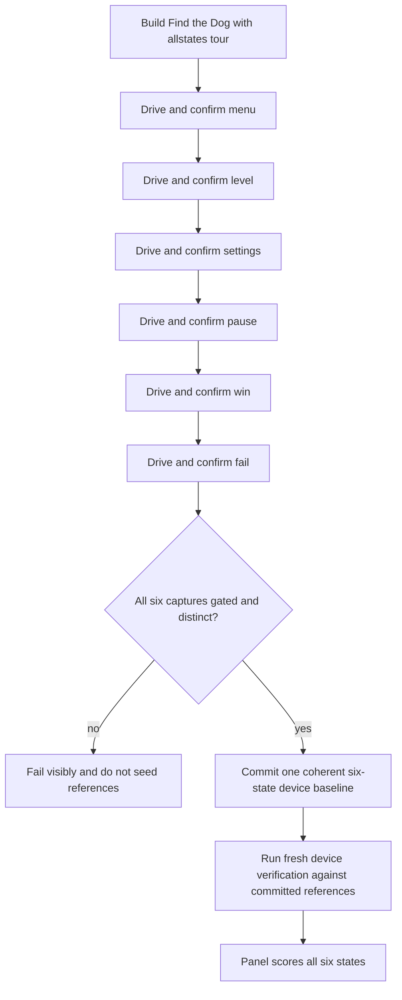

# FTD insitu tour state coverage and device reference seeding — requirements

## Goal

Make Find the Dog's device-verification tour publish trustworthy markers for every declared state, then establish a complete committed device-reference baseline so the fidelity panel can score all six states on future runs.

There are no product-shape decisions to resolve before planning. This is a bounded repair of Find the Dog's existing verification surface.

## Ground truth

- The canonical Find the Dog state order is `menu`, `level`, `settings`, `pause`, `win`, `fail`.
- The app already mounts its real harness into the shared insitu tour and supplies Find the Dog-specific state predicates (`games/find_the_dog/src/bootstrap.ts:148-165`).
- The real harness has state drivers and predicates for all six states (`games/find_the_dog/src/testing/TestHarness.ts:30-77`, `games/find_the_dog/src/testing/TestHarness.ts:274-412`).
- Existing tour unit coverage proves marker sequencing only against a fake harness whose `driveTo` always succeeds (`games/find_the_dog/tests/unit/insitu-tour.test.ts:104-130`).
- Existing real-flow coverage tests level, settings, and win separately, but does not run the complete shared tour against the real Find the Dog harness (`games/find_the_dog/tests/unit/test-harness-real-flow.test.ts:294-374`).
- The July 17 device run gated `menu` and `level`, but captured `settings`, `pause`, `win`, and `fail` blind because their exact markers never appeared (`docs/evidence/2026-07-17-device-verify/summary.json:2-100`, `docs/evidence/2026-07-17-device-verify/summary.json:278-285`).
- The manifest still declares reference and v2 gaps for all six states (`games/find_the_dog/refs/manifest.yaml:27-70`). The existing `games/find_the_dog/refs/device/menu-shipped.png` is not selected by the manifest, so the July 17 panel reported six unscored states and zero trusted references (`docs/evidence/2026-07-17-device-verify/panel.json:28-80`).

## Requirements

**Tour truthfulness**

- R1. A device tour must reach and publish the exact `tourstate:<state>` marker for each state in manifest order: `menu`, `level`, `settings`, `pause`, `win`, and `fail`.
- R2. A state marker may be published only while the corresponding visible state is stable and confirmed by the real Find the Dog harness snapshot.
- R3. Each confirmed state must remain available for the capture driver's dwell and retire through the existing `tourstate:<state>-DONE` contract before the next state begins.
- R4. A state that cannot be reached or does not stay stable must remain visibly failed; the tour must not convert a failed or timed-out drive into a trusted marker.
- R5. Automated coverage must exercise the complete ordered tour against Find the Dog's real harness behavior, rather than proving only a fake `driveTo` success path or isolated verbs.

**Reference baseline**

- R6. One capture-integrity-green device run must produce a gated, visually distinct capture for every canonical state, with no blind capture and no blocking indistinguishable-state finding.
- R7. The six committed files under `games/find_the_dog/refs/device/` must all come from that same green run so viewport, build, game state, and capture provenance are consistent across the baseline.
- R8. The Find the Dog reference manifest must select one committed, at-rest device reference for every canonical state; no canonical state may retain a reference gap.
- R9. Any older unselected device image must either be replaced by the new coherent baseline or remain clearly outside the manifest-selected set; it must not create ambiguous authority.

**Land-gate outcome**

- R10. After the references are committed and selected, a fresh real-device verification run must capture all six states through exact markers and present each state to the fidelity panel with a real score instead of `unscored` or `no reference to score against`.
- R11. The fresh run must complete without the July 17 hard-integrity failures: no blind captures, no capture-runner failure, and no blocking indistinguishable state pairs.
- R12. Local verification must include the Find the Dog typecheck, unit suite, and audit; browser E2E is not a substitute for the required real-device proof.

## Required flow

## Acceptance examples

- AE1. **Covers R1-R4.** Given the allstates tour is running on the iPhone, when `settings` becomes stable, then the capture driver observes exact `tourstate:settings`, captures the visible settings screen, and observes `tourstate:settings-DONE` before the tour advances.
- AE2. **Covers R4 and R6.** Given a state driver times out or the snapshot no longer matches after settling, when the tour reaches that state, then it publishes a failed marker and the run cannot be used to seed the committed baseline.
- AE3. **Covers R6-R9.** Given a capture run gates and distinguishes all six states, when its references are seeded, then the manifest selects exactly one at-rest image from that run for each state and no canonical reference gap remains.
- AE4. **Covers R10-R12.** Given the six references are committed, when a fresh device verification run completes, then all six panel rows have scores and none report blind capture, missing reference, or unscored status.

## Scope boundaries

- In scope: Find the Dog tour reachability, marker truthfulness, regression coverage, six device reference images, manifest wiring, and fresh device proof.
- Out of scope: changing the shared `verify-device` protocol, changing the canonical state taxonomy, redesigning Find the Dog visuals, recovering an external shipped-app corpus, or polishing unrelated fidelity findings.
- The July 17 blind screenshots are forensic evidence only. They are not eligible reference seeds because their named states were never marker-confirmed.

## Success criteria

- The committed test suite catches a regression where any real Find the Dog tour state fails to publish its exact marker.
- `games/find_the_dog/refs/device/` contains a coherent six-state baseline selected by the manifest.
- A new device evidence artifact shows six gated captures and six scored panel rows.
- The evidence is captured on the real phone; no browser or simulator result is reported as equivalent proof.

## Planning notes

- Planning should identify why the current real-device sequence diverges after `level`; the requirements do not assume the failure belongs to the shared tour, the game drivers, lifecycle handling, state predicates, or timing.
- Planning should preserve the shared marker contract and solve the Find the Dog-specific runtime failure with the smallest scoped change.
- Planning should define the exact reference filenames and manifest metadata from the verified capture artifacts, without introducing a second reference authority.
