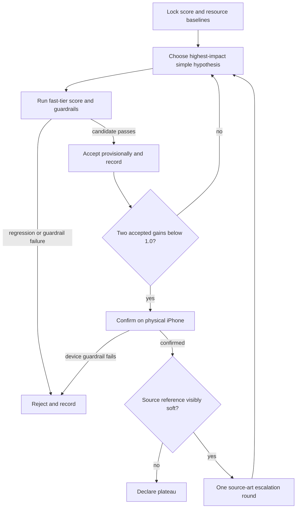

# Max-Zoom Quality Plateau Requirements

## Summary

Iterate on Find the Dog's fully zoomed-in rendering until the ZOOM-1 reference-anchored score reaches the defined plateau. Accept only changes that improve max-zoom fidelity without regressing zoom 1, exceeding the load-time or texture-memory allowance, or losing the device's 30fps budget.

## Problem Frame

The ZOOM-1 baseline makes the current quality gap measurable: its fixed 15-level Chromium sample reports a max-zoom median of `75.457942` and worst decile of `74.412557`, while the zoom-1 median is `76.135316`. The shipped level texture is capped at a 2560-pixel long edge and the camera can zoom to 2.5×, so the runtime stretches less image information than the source reference contains.

This card owns the optimization loop, not a predetermined rendering technique. Texture limits, higher-resolution assets, zoom-aware loading, filtering, mipmaps, grayscale generation, and maximum zoom are variables. The winning result is the smallest maintainable change set that reaches the metric plateau and survives real-iPhone validation.

## Key Decisions

- **Fitness function stays fixed.** `tools/zoom-sharpness/GOAL.md` and the landed ZOOM-1 harness define poses, references, component weights, aggregation, and baseline comparability; optimization must not change the evaluator to create an apparent gain.
- **One measurable hypothesis at a time.** Each iteration changes one lever, or one inseparable lever set, so the score delta and resource cost remain attributable.
- **Fast-tier acceptance is provisional.** Chromium decides whether a candidate remains in the loop, but iPhone capture is authoritative for texture support, visual output, memory, loading, and frame pacing.
- **Quality gain does not buy regressions.** Any guardrail violation rejects the candidate even when max-zoom scores rise.
- **Source-art work is an escalation.** Regeneration or super-resolution is attempted only after runtime and asset-delivery changes plateau and the device reference review identifies visibly soft source art as the remaining ceiling.

## Actors

- A1. Iteration worker: selects a hypothesis, makes the smallest experiment, runs the evaluator, records the result, and accepts or rejects it.
- A2. ZOOM-1 harness: produces deterministic max-zoom and zoom-1 score distributions against source-art references.
- A3. Physical iPhone: supplies authoritative WebView/GPU capability, load, memory, frame-pacing, and visual evidence.
- A4. Reviewer: confirms that the numeric plateau and source-ceiling diagnosis agree with paired device/reference crops.

## Key Flow

## Requirements

**Baseline and experiment discipline**

- R1. Before changing rendering, record the landed ZOOM-1 score baseline and comparable baselines for zoom-1 score, level load time, texture memory, and device frame pacing.
- R2. Every iteration must state its hypothesis, changed lever, expected quality effect, and expected resource effect before evaluation.
- R3. Each iteration must be limited to one lever or a tightly coupled set that cannot produce a valid experiment independently.
- R4. Candidate levers must be tried in expected-impact order unless a recorded measurement or platform limit justifies skipping or reordering them.
- R5. The iteration loop must not impose an arbitrary texture-size, asset-resolution, filtering, or zoom ceiling beyond measured platform capability and the guardrails.

**Scoring and acceptance**

- R6. Every candidate must run the unchanged ZOOM-1 fast tier against the same levels, poses, viewport, seed, references, and aggregation rules as the baseline.
- R7. An iteration may be accepted only when its max-zoom median improves over the current accepted result and its zoom-1 composite does not drop.
- R8. Median gain is measured in composite-score points against the immediately previous accepted iteration, not against a rejected candidate or only the original baseline.
- R9. Worst-decile max-zoom and zoom-1 results must be recorded and reviewed so a median gain cannot hide a materially damaged tail level.
- R10. A score change caused by evaluator, pose, crop, reference, or aggregation drift is invalid and must not count as an accepted iteration.

**Resource and device guardrails**

- R11. Level load time and texture memory must remain within 15% of their locked baseline under the same measurement conditions.
- R12. The physical iPhone must sustain the existing 30fps budget at max zoom during the representative interaction path.
- R13. Runtime texture policy must query actual graphics capability rather than assume that every device supports the same maximum texture size.
- R14. A higher iPhone limit must not remove a lower Android guard where measured Android capability requires it.
- R15. A candidate that passes Chromium but fails iPhone fidelity, loading, memory, texture allocation, or frame pacing is rejected and cannot support the plateau claim.
- R16. Device validation must use the repository's real-device path and capture the same representative max-zoom poses; a browser or simulator result cannot substitute for it.

**Asset and rendering integrity**

- R17. Higher-resolution delivery must preserve level geometry, dog coordinates, reveal alignment, and candidate-to-reference crop identity.
- R18. If a high-resolution texture is loaded only after a zoom threshold, the transition must not flash, jump the camera, lose reveal state, or create a stale texture race.
- R19. The grayscale and color layers must derive from resolution-compatible source content so zoomed reveal boundaries do not expose mismatched detail.
- R20. Filtering or mipmap changes must improve the reference-anchored composite rather than merely appear sharper in an unpaired screenshot.
- R21. Changing maximum zoom is valid only when the newly reachable fully zoomed-in view improves the evaluated player outcome and still meets every guardrail.

**Ledger, plateau, and escalation**

- R22. `tools/zoom-sharpness/iterations.md` must record every attempted iteration, including the change, hypothesis, max-zoom median, worst decile, zoom-1 result, load-time delta, texture-memory delta, device frame result when applicable, disposition, and rejection reason.
- R23. The loop reaches a provisional plateau only after two consecutive accepted iterations each improve max-zoom median by less than `1.0` point.
- R24. Rejected attempts do not count toward the two consecutive accepted iterations and do not reset the comparison base away from the last accepted result.
- R25. A plateau is final only after the physical iPhone confirms the winning candidate's visual result and all guardrails.
- R26. At plateau, paired device/reference crops must be reviewed to determine whether visibly soft source art is the remaining ceiling.
- R27. If source art is the ceiling, perform one escalation round, re-anchor affected references to the new source identity, and resume the same acceptance and plateau loop.
- R28. If source art is not the ceiling, or the one escalation round also plateaus, stop and record final scores, resource deltas, device evidence, accepted changes, rejected changes, and the remaining ceiling.
- R29. The winning asset and runtime policy must cover every playable level; keep the original 15-level corpus locked for headline-score comparability and evaluate a separate deterministic landscape cohort before claiming catalog-wide quality.

## Acceptance Examples

- AE1. **Covers R6-R10.** Given a candidate raises max-zoom median but lowers zoom-1 composite, when the iteration is evaluated, it is recorded as rejected and the previous accepted result remains the comparison base.
- AE2. **Covers R11-R16.** Given a candidate passes Chromium and stays within load and memory limits there, when the iPhone drops below the 30fps budget or cannot allocate the texture, the candidate is rejected and cannot confirm plateau.
- AE3. **Covers R17-R19.** Given zoom-aware high-resolution loading is selected, when the threshold is crossed after partial reveal, the camera and reveal state remain stable and the color/grayscale detail stays aligned.
- AE4. **Covers R22-R25.** Given accepted gains of `0.8` and `0.6` occur consecutively, when the second completes, the loop enters device confirmation; an intervening rejected attempt neither counts nor changes the accepted comparison base.
- AE5. **Covers R23-R24.** Given one accepted gain is `0.7` and the next accepted gain is `1.2`, when the results are recorded, the plateau streak is not complete because both consecutive accepted gains must be below `1.0`.
- AE6. **Covers R26-R28.** Given the runtime result is near its reference but the paired reference crop is visibly soft, when plateau is reviewed, exactly one source-art escalation round is allowed before the loop resumes.
- AE7. **Covers R29.** Given the locked headline corpus contains only portrait levels, when the winning policy is finalized, the original score remains comparable and a separate landscape result proves the policy does not fail on wide levels.

## Success Criteria

- The winning build has the highest accepted max-zoom median produced before the plateau rule fires, with no zoom-1 regression and no hidden worst-decile damage.
- Load time and texture memory remain within `+15%` of baseline, and the physical iPhone sustains the 30fps budget.
- Two consecutive accepted iterations below `1.0` point are present in the ledger, followed by device confirmation.
- Every attempted change is attributable and reproducible from `tools/zoom-sharpness/iterations.md`.
- The final report states whether runtime delivery, device capability, or source art is the remaining quality ceiling.
- The final report distinguishes the locked 15-level headline score from added landscape coverage and makes no portrait-only claim about the full catalog.

## Scope Boundaries

- No new evaluation framework, generalized asset system, or speculative cross-game abstraction.
- No evaluator-weight, pose, crop, or reference changes merely to improve reported scores.
- No source-art regeneration before the runtime and asset-delivery plateau diagnosis calls for it.
- No desktop-browser or simulator claim presented as mobile verification.
- No unrelated gameplay, UI, economy, analytics, or SDK changes.

## Dependencies and Assumptions

- ZOOM-1 (`OaA839ab`) is landed at commit `c4c0da54` and its harness and baseline are the fitness-function authority; the committed report records `b0907b05` as the evaluated build revision.
- The fixed baseline currently reports only the `portrait` aspect class; this card preserves comparability with that corpus rather than silently changing it during optimization.
- Existing guardrail instrumentation is not yet part of `tools/zoom-sharpness`; planning must define the smallest deterministic way to lock and compare load time, texture memory, and iPhone frame pacing before accepting iterations.
- The current runtime cap is `2560`, and `PINCH.maxZoom` is `2.5`; both are variables, not targets.
- Higher-resolution source PNGs exist for at least part of the level corpus, but availability and dimensions must be inventoried before planning assumes a uniform high-resolution variant.

## Outstanding Questions

### Deferred to Planning

- [Affects R1, R11][Measurement] What existing hooks can produce stable, comparable load-time and texture-memory baselines without creating a general performance framework?
- [Affects R12, R16][Device] Which fixed iPhone interaction window and frame statistic constitute the existing 30fps budget check?
- [Affects R4][Sequencing] What measured device texture limit and current source inventory determine whether the first experiment is a conditional runtime cap or higher-resolution asset delivery?
- [Affects R9][Acceptance] What threshold defines materially damaged worst-decile behavior when the median improves, without inventing a second plateau metric?
- [Affects R26][Escalation] What paired-crop review procedure distinguishes source softness from runtime filtering or alignment defects?
- [Affects R29][Coverage] Which deterministic wide-level subset supplies landscape coverage while leaving the locked headline corpus unchanged?

## Sources

- `tools/zoom-sharpness/GOAL.md` defines the objective, metric, guardrails, plateau rule, and source-art escalation.
- `tools/zoom-sharpness/README.md` documents the landed fast-tier command and fixed inputs.
- `tools/zoom-sharpness/baseline/report.json` supplies the current score baseline and corpus metadata.
- `docs/brainstorms/2026-07-20-zoom-max-fidelity-fast-tier-baseline-requirements.md` defines the ZOOM-1 evaluator contract.
- `games/find_the_dog/src/scenes/GameScene.ts` owns the current runtime texture cap and level rendering path.
- `games/find_the_dog/src/scenes/PinchZoom.ts` defines the current zoom range.
- `games/find_the_dog/src/testing/ZoomEvalHook.ts` is the deterministic capture seam used by the fitness function.
