# Grapes Shell Editor Usability Journal

## Task U3-V1 - Make asset replacement visually legible

### Task Snapshot

Status: active

The A1 exercise requires a designer to replace a curated asset confidently. The baseline exposes semantic asset IDs but no actual raster thumbnails, and the artboard shows only a text chip rather than the selected image. This task will make one trusted local asset choice visible end to end without broadening the authoring surface.

### Task Acceptance Criteria

- Every compatible asset choice shows a real thumbnail, semantic name, dimensions, and source pack.
- The installed asset is visibly identified in the tray.
- The artboard visibly renders the installed raster without enabling arbitrary URLs, raw HTML, or raw CSS.

### Iteration 1 - Baseline and trusted local previews

#### Planned Result

The asset tray will read as a curated visual library, and changing a compatible asset will immediately produce a visible raster change on the phone artboard.

#### Why This Iteration

This is the shortest complete proof that U2's asset manifest is usable by a designer rather than merely machine-readable.

#### Capture Setup

- Route: `/`
- Viewport: 1440x1000 desktop
- Fixture: bundled U2 Kenney seed manifest and starter project
- State: Menu page, `menu.hero` selected, base presentation

#### Planned Screenshot Set

- `screenshots/u3-v1-before-menu-hero.png`: baseline tray and artboard with `menu.hero` selected.
- `screenshots/u3-v1-after-menu-hero.png`: matched frame with thumbnails and installed-asset state.
- `screenshots/u3-v1-after-menu-hero-replaced.png`: matched frame after choosing another compatible asset.

#### Expected Result Before Changes

The two after shots should make the selected asset and the replacement difference obvious without relying on the asset ID chip.

#### Pre-Change Screenshots

1. 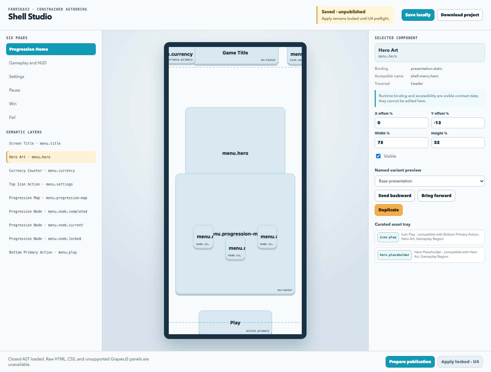
   What to look at: The selected `menu.hero` rectangle in the phone artboard and the two rows in the Curated asset tray.
   Observation: The artboard is a pale placeholder labeled `menu.hero` and `no-raster`; the tray contains only the IDs `icon.play` and `hero.placeholder` with text descriptions. Neither surface shows the pinned PNG bytes, and the installed `hero.placeholder` choice is not distinguished from the alternative.
   Acceptance check: Criterion 1 fail because there are no thumbnails, dimensions, or source pack labels; criterion 2 fail because the installed choice is not visibly marked; criterion 3 fail because the artboard renders no raster. The 1440x1000 capture also records a 1093px document height, which activates the separate workspace-fit task U3-V2.

#### Baseline Decision

failed

#### Next Action

Bundle only the manifest-declared local PNGs, render them in the tray and sandboxed artboard, then recreate the matched screenshots.

#### Changes Made

The editor now bundles only PNGs already declared by the U2 seed manifest. Compatible choices render as visual cards with the actual raster, semantic label, stable ID, dimensions, source pack, and an explicit Installed state. The locked GrapesJS canvas receives only those compile-time URLs, allows same-origin or bundled data images in its otherwise closed CSP, and renders the chosen raster behind the inert copy label; the selected semantic component also has a clear amber outline.

#### Post-Change Screenshots

1. 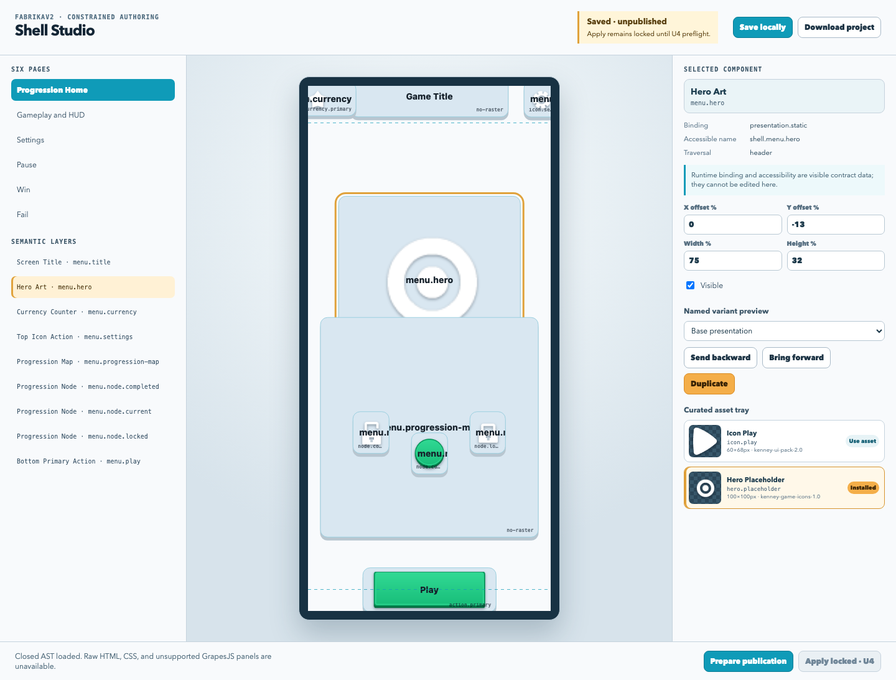
   What to compare: Compare the selected hero and right-side tray with the text-only baseline.
   Observation: The installed target raster is visible in the hero rectangle, both choices have real thumbnails and provenance, and Hero Placeholder carries the amber Installed treatment.
   Acceptance check: Criterion 1 met; criterion 2 met; criterion 3 met. Browser inspection found two tray images and seven loaded artboard images on the Menu page, all with nonzero natural widths.

2. 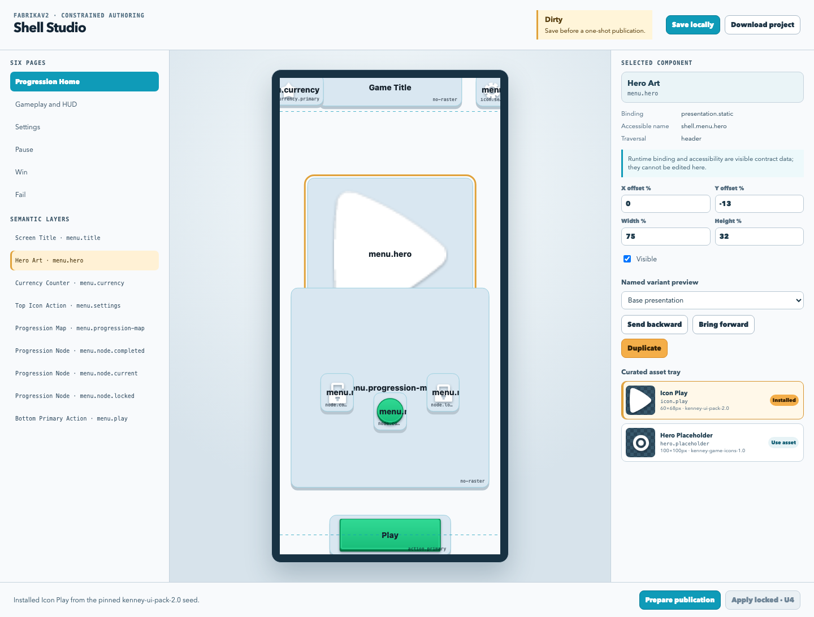
   What to compare: The large hero graphic and the Installed badge against the prior after-shot.
   Observation: Selecting Icon Play immediately replaces the target with the play raster, moves Installed to the chosen card, sets the project Dirty, and writes a source-specific confirmation message.
   Acceptance check: Criterion 1 met; criterion 2 met; criterion 3 met. The artboard image identity changed from `hero.placeholder` at 100px natural width to `icon.play` at 60px natural width.

#### Decision

passed

#### Next Action

Keep this asset path fixed and move to the separately scoped 1440x900 workspace-fit task.

#### Spawned Tasks

- Task U3-V2 is confirmed as blocking A1 comfort because the 1440x1000 baseline already produced a 1093px document.

## Task U3-V2 - Keep the full editing loop in one desktop view

### Task Snapshot

Status: active

The canonical 390x844 phone canvas must remain exact, but displaying it at native CSS pixels together with header and footer turns the editor into a vertically scrolling webpage. This task will scale only the authoring presentation so the designer can keep the phone, controls, and state in one 1440x900 view while navigation and inspector retain their own scroll areas.

### Task Acceptance Criteria

- The browser document itself does not require vertical scrolling at 1440x900.
- The complete phone artboard remains legible and preserves its 390:844 ratio.
- Navigation and inspector can scroll independently while the header, stage context, and publication status remain stable.

### Iteration 1 - Fit the canonical canvas without changing it

#### Planned Result

At 1440x900 the header and footer remain visible, the full portrait artboard fits between them, and only the navigation or inspector scrolls when its own content exceeds the available height.

#### Why This Iteration

The editor is desktop-first, so a predictable laptop-height viewport is the smallest useful fit contract for the A1 exercise.

#### Capture Setup

- Route: `/`
- Viewport: 1440x900 desktop
- Fixture: bundled starter project with the trusted asset-preview change
- State: Menu page, `menu.play` selected, base presentation

#### Planned Screenshot Set

- `screenshots/u3-v2-before-1440x900.png`: baseline full page at the target viewport.
- `screenshots/u3-v2-after-1440x900.png`: matched viewport after fit and independent-panel scrolling.

#### Expected Result Before Changes

The post-shot should show the whole phone frame and both global bars at once, with document height equal to 900px and the artboard still at the canonical aspect ratio.

#### Pre-Change Screenshots

1. 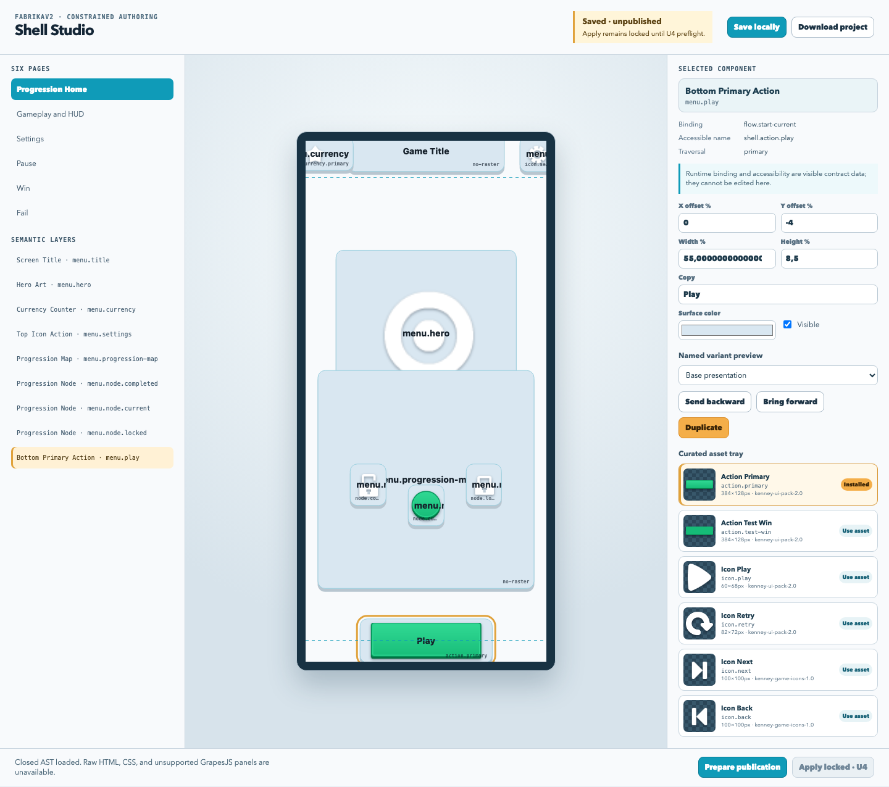
   What to look at: The relationship between the native-size phone frame, browser viewport, and footer.
   Observation: The 874px phone frame forces the workspace to 1124px tall. The document reaches 1275px in a 900px viewport, so the footer and lower phone are below the fold; navigation and inspector expand with the document instead of becoming independent scroll regions.
   Acceptance check: Criterion 1 fail because document height exceeds viewport by 375px; criterion 2 partial because the canonical ratio is preserved but the complete phone is not visible in the viewport; criterion 3 fail because both side panels have equal client and scroll heights of 1124px and the footer is at y=1213px.

#### Baseline Decision

failed

#### Next Action

Constrain the editor shell to the viewport and scale only the visual authoring frame at explicit height breakpoints.

#### Changes Made

The studio shell now occupies exactly one dynamic viewport and clips global overflow at the workspace boundary. The canonical 390x844 GrapesJS canvas remains unchanged internally; only its outer authoring frame scales at explicit height breakpoints, with a top-center transform origin on shorter displays. Navigation and inspector retain `overflow: auto`, so long semantic or asset lists scroll without moving the header, phone stage, status, or footer.

#### Post-Change Screenshots

1. 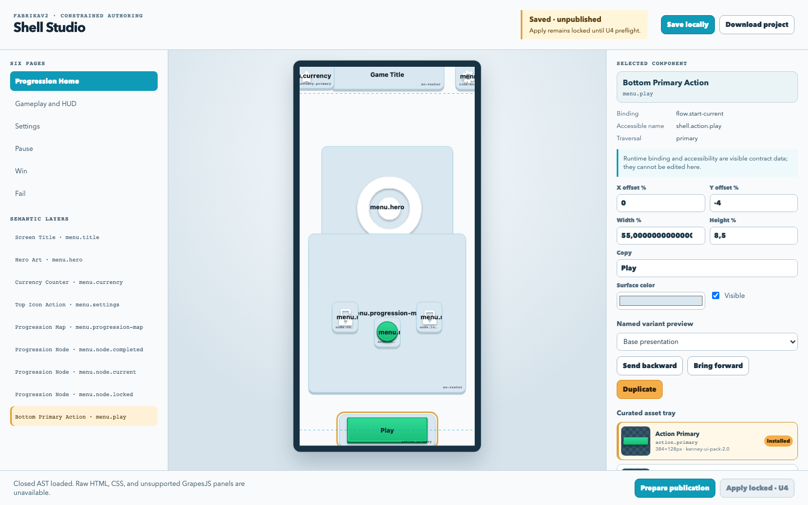
   What to compare: Compare the whole-page composition and footer position with the 1275px baseline.
   Observation: Header, complete phone frame, selected-component context, feedback, and footer all fit in the 900px viewport. The phone is visually 312x675.2 inside a 336x699.2 frame, preserving the exact 390:844 aspect ratio; the inspector now scrolls inside its 749px column while the document remains fixed.
   Acceptance check: Criterion 1 met with document and body height exactly 900px; criterion 2 met with the complete phone visible and ratio preserved; criterion 3 met with a 749px inspector client area and 1124px independent scroll content while the footer stays at y=838px.

#### Decision

passed

#### Next Action

Freeze the viewport-fit behavior and verify that every visible edit control maps to the closed U1 contract.

#### Spawned Tasks

- None; the remaining control-authority issue is already Task U3-V3.

## Task U3-V3 - Make constrained edits trustworthy

### Task Snapshot

Status: active

The constrained inspector must be a truthful projection of the U1 contract: every offered control should work for a valid value, and a rejected edit should remain visibly rejected. The baseline palette picker writes unsupported `surface` data even though the contract only permits background, foreground, accent, border, and shadow, making the most important style edit a false affordance.

### Task Acceptance Criteria

- Every visible edit control maps to an allowed U1 presentation property and succeeds for an in-range value.
- Rejected edits remain unchanged and present a persistent, specific error state.
- Locked binding and accessibility fields are visually distinct from editable fields.

### Iteration 1 - Align controls with the closed contract

#### Planned Result

The inspector will name the actual editable color channel, apply a valid palette change immediately, and show success or rejection in a visually distinct feedback state while preserving the locked semantic metadata treatment.

#### Why This Iteration

Palette editing is an A1 representative operation; leaving a nonfunctional picker would invalidate the usability checkpoint even if the rest of the editor looks complete.

#### Capture Setup

- Route: `/`
- Viewport: 1440x900 desktop
- Fixture: bundled starter project
- State: Menu page, `menu.play` selected, base presentation

#### Planned Screenshot Set

- `screenshots/u3-v3-before-color-control.png`: baseline inspector with the unsupported palette control.
- `screenshots/u3-v3-after-valid-color.png`: inspector and artboard after a valid U1 color edit.
- `screenshots/u3-v3-after-rejected-geometry.png`: persistent error state after an out-of-range geometry edit.

#### Expected Result Before Changes

The valid edit should visibly recolor the selected component and mark the project dirty; the invalid edit should preserve the prior value and present an unmistakable error without looking saved.

#### Pre-Change Screenshots

1. 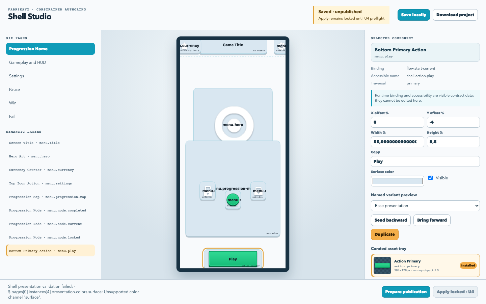
   What to look at: The Surface color control, unchanged Saved state, and footer validation message after choosing `#ff3355`.
   Observation: The visible picker writes `colors.surface`, which U1 rejects as an unsupported channel. The picker silently snaps back to `#d9e7f1`, the project remains Saved, and the failure is rendered in the same low-emphasis footer style used for ordinary guidance.
   Acceptance check: Criterion 1 fail because a visible palette control cannot produce a valid edit; criterion 2 partial because the value remains unchanged and the message is specific, but the error has no persistent error styling; criterion 3 met because binding and accessibility data remain in a separate read-only callout.

#### Baseline Decision

failed

#### Next Action

Map the picker to the U1 `background` channel, use the same channel in editor and portable rendering, and give success and rejection feedback distinct persistent states.

#### Changes Made

The palette picker now writes the U1 `background` channel, and editor plus portable renderers consume `background` and `foreground` consistently. Numeric fields normalize floating-point display noise. Feedback now carries explicit neutral, success, or error state; validation errors are reduced to the first actionable contract reason so the fixed 62px footer cannot displace the editor. Visibility is offered only when the candidate closed AST validates: required instances show a compact lock reason, while duplicated optional instances can be hidden. Reorder controls disable at layer boundaries, and Duplicate disables when the resulting project would violate the contract.

#### Post-Change Screenshots

1. 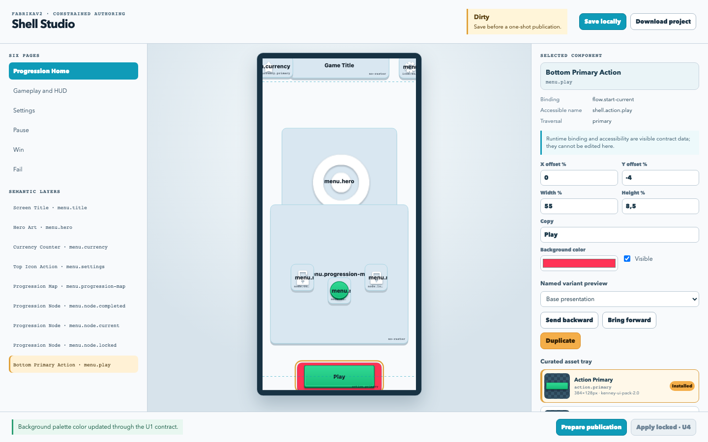
   What to compare: The Background color control, red selected-component surface, Dirty state, and green footer against the failed baseline.
   Observation: Choosing `#ff3355` persists in the picker, visibly recolors the selected component behind its pinned asset, marks the project Dirty, and presents a concise success state.
   Acceptance check: Criterion 1 met for palette editing; criterion 2 not exercised in this shot; criterion 3 met because locked binding and accessibility metadata retain their read-only callout.

2. 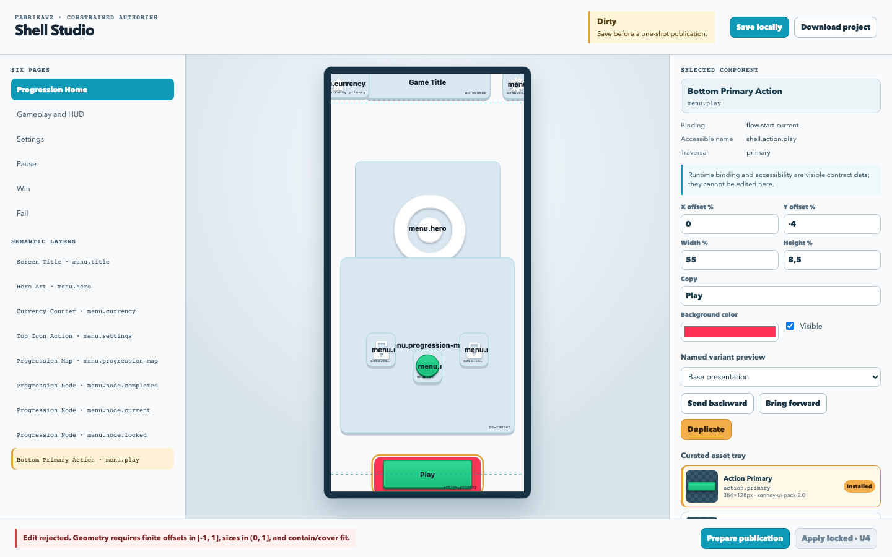
   What to compare: The Width value and red footer while the rest of the workspace remains stable.
   Observation: Entering 500% restores the prior 55% width and shows `Edit rejected. Geometry requires finite offsets in [-1, 1], sizes in (0, 1], and contain/cover fit.` The document remains exactly 900px tall and the project stays Dirty only because of the earlier accepted color edit.
   Acceptance check: Criterion 1 met because valid values remain accepted; criterion 2 met because rejected state is unchanged, specific, and persistently red without collapsing the editor; criterion 3 met.

#### Additional Functional Evidence

[Representative edit metrics](./representative-edit-metrics.json) records successful X/Y movement, resize, copy, background, reorder, same-binding duplicate, and hiding the duplicate at 1440x900. It also records that the required original Play action exposes no editable visibility checkbox and instead names the contract reason, while `menu.currency.copy-1` retains `state.primary-currency` and can be hidden successfully.

#### Decision

passed

#### Next Action

Keep the constrained-control behavior fixed and clarify the browser-save, export, immutable publication, and future apply handoff.

#### Spawned Tasks

- None; deterministic publisher hardening is handled by the parallel correctness review rather than this visual task.

## Task U3-V4 - Clarify save, export, and publication handoff

### Task Snapshot

Status: active

Browser-local persistence, project export, repository publication, and U4 apply are different authority transitions. The baseline groups Save locally and Download project in the header, then offers a Prepare publication button that only changes prose, making it possible to believe the browser project reached Fabrika when it did not. This task will keep the flow simple and honest and expose the exact validated project for the Portal A1 decision.

### Task Acceptance Criteria

- Browser-local save, JSON export, CLI publication, and U4 apply are named as distinct states/actions.
- The A1 Portal handoff can submit the exact validated project JSON with the reviewer decision.
- No UI control claims an immutable publication occurred unless the publisher actually created and verified it.

### Iteration 1 - Make the authority transitions explicit

#### Planned Result

The editor will present one short sequence: save this browser draft, export the exact validated project for Fabrika, publish it with the one-shot CLI, and keep Apply visibly unavailable until U4. The Portal package will carry the same validated project JSON in its accept or reject payload.

#### Why This Iteration

This is the seam that prevents Portal or the browser from becoming an accidental third source of truth.

#### Capture Setup

- Route: `/`
- Viewport: 1440x900 desktop
- Fixture: starter project with one accepted copy edit
- State: dirty, then browser-saved/export-ready

#### Planned Screenshot Set

- `screenshots/u3-v4-before-handoff.png`: baseline dirty state and misleading Prepare publication action.
- `screenshots/u3-v4-after-handoff.png`: explicit browser draft, project handoff, CLI publication, and locked U4 apply states.

#### Expected Result Before Changes

The post-shot should make the authority boundary understandable from the action labels and state copy alone, without opening documentation or implying that Portal publishes code.

#### Pre-Change Screenshots

1. 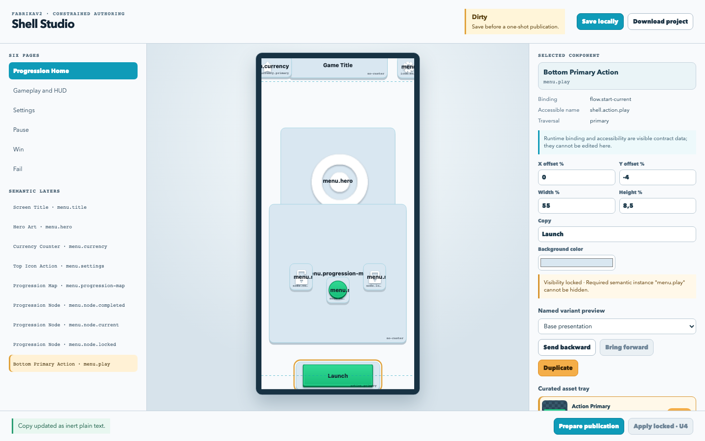
   What to look at: The two header actions, Dirty-state detail, and footer actions.
   Observation: `Save locally` and `Download project` do not say which is a browser-only draft versus the artifact Fabrika needs. `Prepare publication` sounds like an operation but only changes helper text, while Dirty says only `Save before a one-shot publication.`
   Acceptance check: Criterion 1 fail because four authority states are not named distinctly; criterion 2 fail because no review handoff exposes the exact validated project payload; criterion 3 partial because Apply is correctly locked, but Prepare publication implies more work than it performs.

#### Baseline Decision

failed

#### Next Action

Rename and regroup the actions around browser draft versus validated project handoff, remove the no-op publication button, and expose a constrained project snapshot for Portal transport.

#### Changes Made

The actions now say `Save browser draft` and `Export validated project`, and state copy explicitly says whether data is only in this browser or handed to Fabrika. The no-op Prepare publication control is gone. The footer names the next authority transition: an agent saves this exact JSON and runs the one-shot publisher, while Apply stays locked to U4. A same-document read-only bridge returns a structured clone of the revalidated project and browser-draft status so the Portal review wrapper can include the exact project in its decision payload without becoming another authority.

#### Post-Change Screenshots

1. 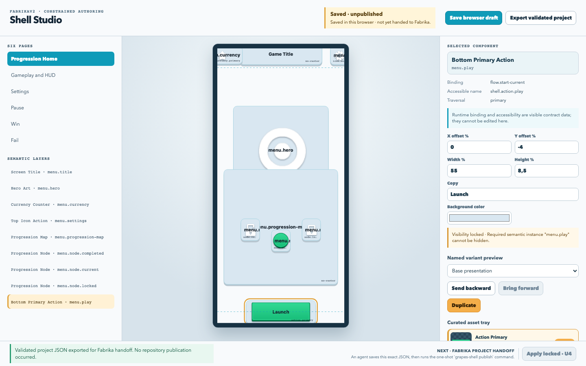
   What to compare: Header labels, Saved-state detail, green export confirmation, and footer sequence against the baseline.
   Observation: The UI now distinguishes browser persistence from validated JSON export, explicitly says no repository publication occurred, names the agent/CLI handoff, and leaves Apply locked. The exported download is `grapes-shell-project.json`; the bridge returned format `grapes-shell-project-v1`, six pages, status `saved-unpublished`, and the edited `Launch` copy.
   Acceptance check: Criterion 1 met; criterion 2 partial because the exact snapshot bridge exists but has not yet been exercised through a live Portal verdict; criterion 3 met because no browser control claims to publish or apply.

#### Decision

partial

#### Next Action

Embed the reviewed editor in the Portal A1 view, submit an accept/reject test payload containing its exact validated project JSON, and then stop for Batu's explicit verdict.

#### Spawned Tasks

- None; the remaining work is Iteration 2 of this same authority-handoff task.

## Task U3-V5 - Match editor and publication geometry at the kernel seam

### Task Snapshot

Status: active

Independent Sol review found a deeper seam beneath the now-correct outer workspace fit. The editor and portable serializer each reconstructed anchors with percentage positioning and center translation, while U1 validates through `projectShellGeometry` over the baseline safe rectangle. The prior captures preserve the visible symptom, so this task can compare the repaired seam against already-recorded pre-change evidence.

### Task Acceptance Criteria

- Editor bounds equal `projectShellGeometry` output for every Menu instance within 0.02px, covering Chromium's 1/64px layout quantization.
- Portable bounds equal the same expected output and editor bounds within 0.02px.
- The post-shot visibly restores top-anchored controls inside the 59px safe guide without changing the closed AST.

### Iteration 1 - Reuse the kernel projector

#### Planned Result

One shared U3 layout adapter will call the kernel projector for editor and publication, removing both local anchor implementations and their full-canvas/safe-rectangle mismatch.

#### Why This Iteration

This is exactly the simplification and seam-matching failure class the project is designed to prevent: two plausible local formulas had drifted from the authority that validates them.

#### Capture Setup

- Route: `/` and generated `portable/menu.html`
- Viewport: editor 1440x900; inner and portable canvas 390x844
- Fixture: starter project
- State: Menu base presentation

#### Pre-Change Screenshots

1. 
   What to look at: The currency, Game Title, and settings components across the top of the phone.
   Observation: The top-anchored components are translated upward by half their own height and visibly clipped against the phone edge, even though the blue safe guide is lower at 59px.
   Acceptance check: Criterion 1 fail and criterion 2 fail because both local consumers used the wrong formula; criterion 3 fail because the top row is not inside the safe guide.

#### Changes Made

The editor and portable serializer now share `projectSemanticLayout`, a small adapter over `projectShellGeometry` with the contract's canonical canvas, baseline insets, role anchor, and role geometry caps. Both consumers position the resulting top-left pixel bounds directly and reserve transforms only for the explicit visual scale property. The editor's named-variant merge also preserves base color channels when a variant supplies only a partial color override.

#### Planned Post-Change Screenshot

- `screenshots/u3-v5-after-layout-seam.png`: matched Menu view with the top row restored below the safe guide.

#### Expected Result Before Capture

All Menu editor and portable bounds should match the shared kernel output to the measurement tolerance, and the top controls should be fully visible.

#### Post-Change Screenshots

1. 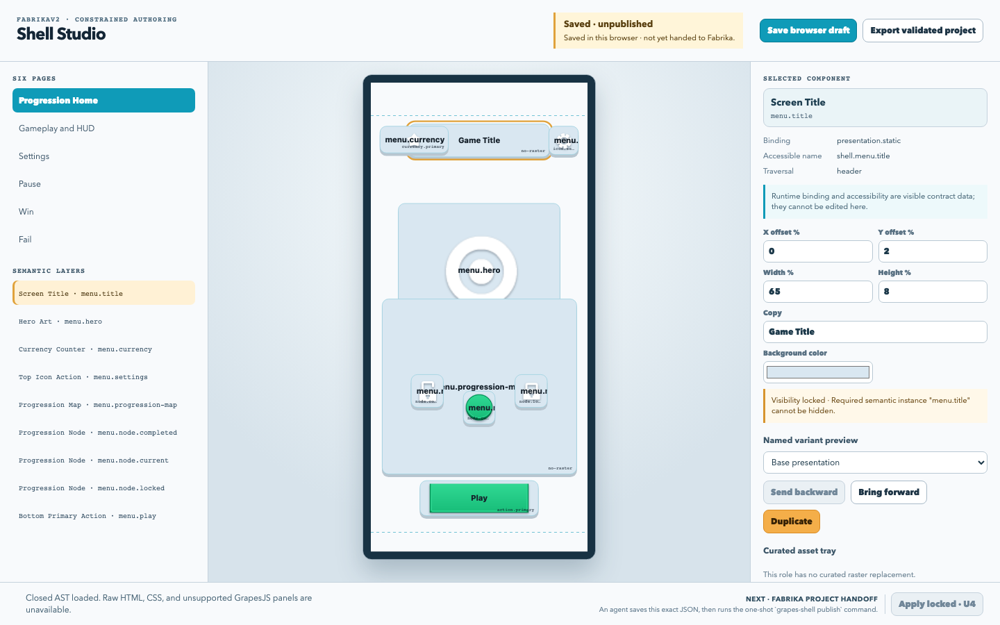
   What to compare: Compare the entire top row and blue safe guide with the clipped pre-shot.
   Observation: Currency, Game Title, and settings now begin below the 59px safe boundary and are fully visible. The rest of the shell remains in its intended regions, and the outer 1440x900 studio fit remains intact.
   Acceptance check: Criterion 3 met; the screenshot is consistent with the measured editor bounds.

#### Additional Functional Evidence

[Layout seam metrics](./layout-seam-metrics.json) records nine Menu instances. Maximum browser-layout deltas were 0.015625px editor-to-kernel, 0.01375px portable-to-kernel, and 0.015625px editor-to-portable, all below the 0.02px tolerance that covers Chromium's 1/64px layout quantization. [The reproducible check](./layout-seam-check.ts) regenerates the publication and fails on identity or bounds drift.

#### Decision

passed

#### Next Action

Keep the shared layout seam fixed and finish publisher hardening plus the Portal A1 transport iteration.

#### Spawned Tasks

- Non-baseline device mapping remains in U4/U6 and is intentionally not pulled into U3.

## Task U3-V4 - Iteration 2 - Bind the exact saved review state

### Planned Result

The self-contained Portal view will carry one saved, target-bound, canonically hashed project snapshot. It will refuse acceptance for a fresh, dirty, recovered, or storage-failed browser state, and the one-shot publisher will reject a different project hash before creating publication bytes.

### Why This Iteration

Independent Sol review found that a generic export plus an unbound `--game` argument could disconnect the state A1 reviewed from the state the CLI published. The same review found silent local-storage recovery, invisible base mutations while previewing a named variant, hierarchy-crossing reorder, and editor/portable asset-style drift.

### Changes Made

- Project JSON now contains the validated `targetGame`; browser storage and export are target-specific, and the CLI validates that the project target matches its `--game` path.
- The editor bridge captures the project, saved state, and canonical SHA-256 as one snapshot. A1 acceptance requires `saved-unpublished`, includes the exact project and hash, and targets `shell_proof`.
- `publish` requires `--expected-project-hash` and rejects a mismatch before creating a publication directory.
- Missing, corrupt, invalid, unreadable, and unwritable browser storage remain visibly unsaved instead of silently claiming Saved.
- Named variants are explicitly read-only in constrained V1; all mutation controls are disabled until Base presentation is selected.
- Semantic layers show hierarchy, and reorder moves only sibling subtrees while deterministically keeping parents behind their descendants.
- Editor and portable asset surfaces share one CSS implementation. The reproducible seam check now covers asset inset, size, object fit, opacity, and filter as well as component geometry.

### Local Transport Evidence

1. 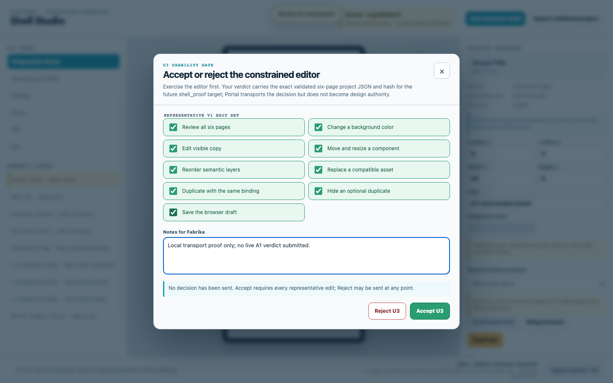
   Observation: The A1 dialog is embedded over the complete 1440×900 editor and names the representative edit checklist without presenting Portal as design authority.
   Acceptance check: A fresh unsaved starter produced no POST and displayed `Accept is blocked until the exact browser draft is saved.` After editing and saving, reload preserved the exact copy. The intercepted 34,876-byte verdict carried schema `fabrikav2-grapes-shell-a1-v1`, target `shell_proof`, six pages, all nine checks, status `saved-unpublished`, and project hash `sha256-28e2d8f00b3a89766794ecbd23fdc3b53f9af5a960ddb06a8ab054c41a648af4`; independent canonical rehash matched exactly. No browser console or page errors occurred.

[Layout seam metrics](./layout-seam-metrics.json) now additionally records seven Menu assets with 0px editor/portable geometry delta and no object-fit, opacity, or filter mismatch. Unit coverage includes persistence recovery, target mismatch, hash-bound CLI publication, sibling-subtree order, and boundary no-ops.

### Decision

blocked before live A1 issue

### Blocking Finding

The local A1 transport is ready, but publishing the human checkpoint would be false-green while the editor's asset vocabulary bypasses U1. [The deterministic asset-slot audit](./asset-slot-audit.json) found 29 seed assets and 40 declared asset/role pairs; 39 pairs violate U1 intrinsic dimension constraints, seven identities span multiple U1 slots, and all 33 starter asset uses are dimension-invalid. U3 strips asset IDs before U1 parsing and trusts a secondary `compatibleRoles` registry, so this is an upstream U2 contract repair rather than a cosmetic U3 tray issue.

### Next Action

Reopen the U2 Kenney seed as slot-specific, contract-valid fixtures, then make U3 consume `parseShellAssetCatalog` directly and enforce the slot fit. Regenerate this exact A1 artifact, verify it live in Portal without submitting a verdict, and stop for Batu's accept/reject. U4 remains locked.

### Spawned Tasks

- Claude Opus independently reviewed publication security and false-green render behavior; its four findings were repaired and regression-tested.
- Codex Sol independently reviewed A1 usability and frontend seams; five U3-owned P1 findings were repaired.
- Two focused Codex subagents rechecked hierarchy, persistence, exact-state binding, asset fidelity, and U1/U2 compatibility against the final live source. They confirmed the hierarchy and U3 usability repairs and isolated the remaining U2 asset-slot blocker.

### Opus Follow-up Closure

The final Claude Opus rereview confirmed that all four earlier security/correctness findings and the five repaired U3 authority/usability seams are closed. It found one remaining P2: editor and portable defaulted an otherwise uncolored component to different surface colors. The fallback surface and ink now live beside the shared visual CSS, and the seam check compares computed background, ink, border, and shadow for all nine Menu instances in addition to geometry and asset styling. The repeated check reports no surface mismatch. Opus found no unflagged P0 or P1 and independently confirmed that the U1/U2 asset-slot mismatch is a valid gating blocker, not a U3 false positive.

### First Live CLI Shakedown

The executable `cli.mjs` seam ran live in a fresh temporary repository root: `init` created the six-page `shell_proof` project, `validate` returned 30 components and canonical project hash `sha256-613095a68ce16fbec678b920b9c254ef511c8ce164fe3d14af1feaa273adf0f4`, `publish` accepted only that exact expected hash and produced immutable publication `sha256-09c11b6e49b708e4c9be34370b97fe8ccce66e585d7155ffd806a5d603f93ee1`, and `status` returned `published` with `canApply: false`. The temporary root was removed. This proves the new CLI-spawning-Vite seam runs once and returns; it does not override the separately recorded U1/U2 asset-contract blocker.

### Portal Handoff

The final non-decision status report is live as Portal post `p_7ea850` in stream `grapes-shell-specialization`. Its HTML, 20-test metric, and sibling screenshot were loaded from the deployed Portal media route with no failed resources. The stable stream link was added to Trello card `qrVosoLc` and sent through Telegram. This is deliberately a report, not the A1 accept/reject request.

## Task U3-V7 - Capture the repaired A1 decision flow

### Task Snapshot

Status: passed for capture evidence; human A1 decision pending

The U1/U2 asset-authority repair and dual-hash binding are now present at commits `c142f286` and `2f5ed0a2`. This iteration regenerates the self-contained A1 view from those commits and records the smallest reproducible sequence that demonstrates the editor, constrained selection, canonical asset tray, saved-unpublished state, and untouched accept/reject boundary.

### Iteration 1 - Regenerate and record the current checkpoint

#### Planned Result

A 3-8 second recording and four stable frames will show, in order, the six-page editor, a representative semantic selection, a slot-filtered asset replacement saved only in the browser, and the A1 dialog that binds the exact project and asset-catalog hashes without submitting a decision.

#### Capture Setup

- Artifact: self-contained `a1-review.html`
- Viewport: 1440x900 at device scale factor 1
- Browser state: fresh isolated Chromium context with empty storage
- Fixture: current `shell_proof` starter project and U1 canonical asset catalog
- Interaction sequence: visit all six pages; select `settings.music`; return to Menu; select `menu.settings`; install `icon-control.confirm`; save the browser draft; open the A1 dialog
- Repro command: `node docs/evidence/2026-07-11-grapes-shell-editor-usability/capture-a1-review.mjs`

#### Pre-Change Evidence

1. 
   What to look at: The existing light, phone-centered editor and decision overlay composition.
   Observation: This older frame established the desired interaction shape, but its underlying project used the now-rejected secondary asset vocabulary and did not carry the reviewed asset-catalog hash end to end.
   Acceptance check: Visual composition remained suitable, but canonical-slot and dual-hash criteria were not current; this evidence was invalidated rather than cosmetically wrong.

#### Changes Made

No product code was redesigned. The current editor distribution was rebuilt, `build-a1-review.mjs` regenerated `a1-review.html`, and an evidence-only Playwright harness captured a deterministic static-state sequence. The artifact SHA-256 changed from `dc6dddefc928760c110bd26c21047fb3780bf3cdc57d9b4b4c6de37b9017006f` to `e20ef4a6a812a14472055b69b71cc35adad7d1da102fbab2ac1d18265d628fcf`.

#### Post-Change Evidence

1. 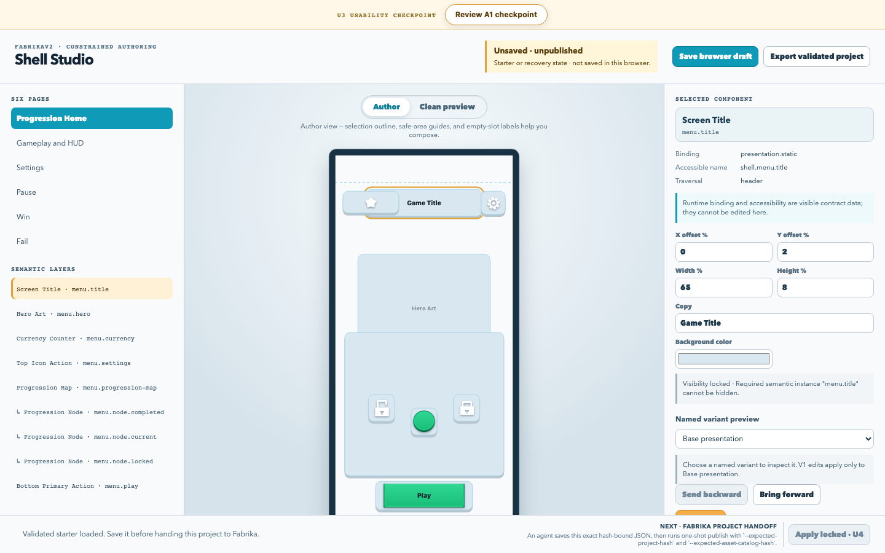
   What to look at: The six-page navigation, centered 390x844 phone artboard, selected semantic layer, and truthful unsaved-unpublished header.
   Observation: The restrained Shell Studio hierarchy is intact, all six page destinations are visible at once, and the editor begins from an explicitly local recovery state.
   Acceptance check: Criterion 1 met; the opening orients a reviewer without adding new UI or motion.

2. 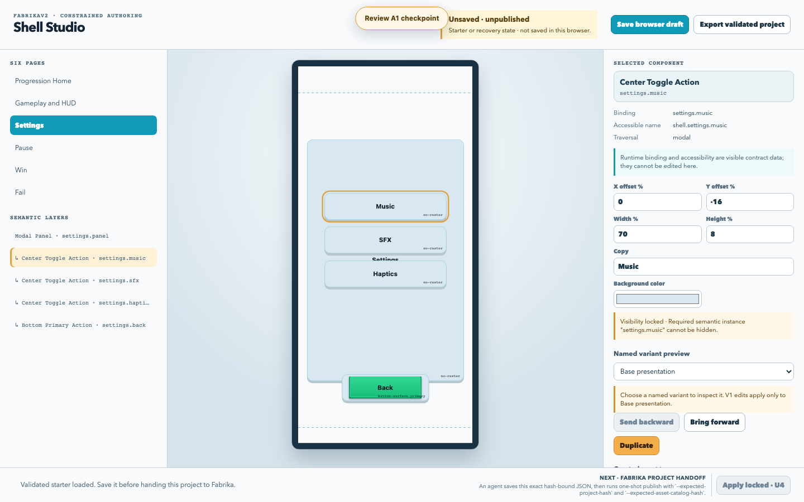
   What to look at: Settings selected in the page rail, `settings.music` highlighted in the semantic tree and phone, and the matching constrained inspector fields.
   Observation: Page switching and component selection remain synchronized across navigation, artboard, and inspector. Runtime binding and accessibility metadata stay visibly locked.
   Acceptance check: Criterion 1 met; the representative interaction is legible and does not expose raw GrapesJS authoring controls.

3. 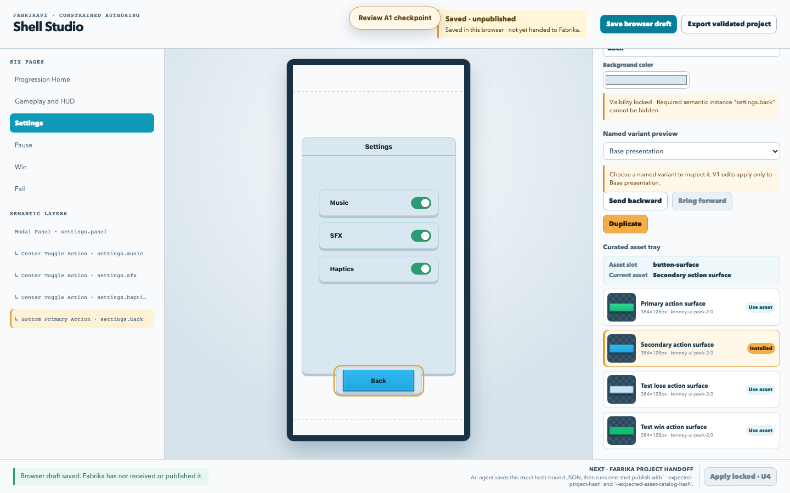
   What to look at: `menu.settings` selected, the tray narrowed to `icon-control.*` candidates, `icon-control.confirm` marked Installed, each visible candidate's dimensions and Kenney provenance, and `Saved · unpublished` in the header.
   Observation: The selected top-icon role receives only canonical icon-control candidates. The exact replacement is visible on the phone and in the tray, while the header and footer state clearly say that saving did not publish or hand the project to Fabrika.
   Acceptance check: Criterion 2 met; the compatible inventory, canonical semantic IDs, intrinsic metadata, provenance, installed state, and authority boundary are visible together.

4. 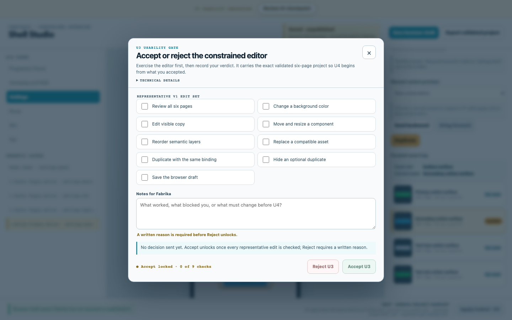
   What to look at: The overlay introduction, complete representative edit checklist, symmetrical Reject/Accept actions, and neutral status line.
   Observation: The dialog explicitly says the verdict carries the exact six-page project JSON plus its project and asset-catalog hashes. The status says `No decision has been sent`, every checkbox remains clear, and neither action was invoked.
   Acceptance check: Criterion 3 met; the two reviewed identities and the human decision boundary are explicit without claiming acceptance.

[Reproducible 6.68-second interaction recording](./videos/u3-v6-a1-flow.webm) follows the same order as the four frames. [Capture manifest](./u3-v6-a1-capture.json) records project hash `sha256-b7cc3468e88f73d5e87083c3d780218b503d1664ec8c680d52cf74139d45b501`, asset-catalog hash `sha256-5a0ce5186af8f07a1d6f7143fe10a5f7d273d39275bbfd74a9ab074f74fe652e`, six visited pages, `saved-unpublished`, and `decisionSubmitted: false`.

#### Isolation and Privacy Check

The capture recorded zero external requests, zero console errors, and zero page errors. The regenerated HTML contains no private filesystem path, private/internal URL, RFC1918 address, or device-like identifier under the evidence scan. The only document request was the self-contained local artifact; no network resource was needed.

#### Criterion-by-Criterion Judgment

- Criterion 1: met. The opening and selection frames preserve the existing restrained, phone-centered editor and expose all six pages plus synchronized semantic selection.
- Criterion 2: met. The saved asset frame shows the role-filtered canonical inventory, semantic IDs, dimensions, provenance, installed marker, rendered replacement, and local-only state.
- Criterion 3: met. The overlay names both hashes, presents the complete checklist and both verdict paths, and explicitly records that no decision has been sent.
- Criterion 4: met. The video duration is 6.68 seconds; all four PNGs are stable; the browser and privacy checks are clean.

#### Decision

passed for capture evidence only

This does not accept U3. The actual A1 decision remains pending explicit human review.

#### Next Action

Present the regenerated artifact and visual evidence for Batu's explicit accept/reject decision; do not start U4 from this capture alone.

#### Spawned Tasks

- None. Any newly requested usability change should be tracked separately from this evidence-only capture.

#### TWF Reviewer Frame Extraction

The 6.68-second WebM was independently sampled with ffmpeg at 0.25s, 3.25s, 4.75s, and 5.75s. The extracted frames show the same four review states in sequence: opening, Settings component selection, canonical icon-control tray after browser save, and the untouched A1 dialog. This confirms the recording itself contains the evidence rather than merely linking to separately staged stills.

## Task U3-V6 - Iteration 2 - Independent aesthetics gate

### Task Snapshot

Status: failed / fix-then-ship

The deterministic U1/U2 authority repair closed the asset-contract blocker, but independent aesthetics review rejected the current A1 surface as a shipping candidate. This is not a reversal of the capture result: the evidence sequence is complete and reproducible, while the product surface shown by that evidence is not ready for A1 acceptance.

### Pre-Fix Corpus

- [Opening frame](./screenshots/u3-v6-a1-opening.png)
- [Settings interaction frame](./screenshots/u3-v6-a1-interaction.png)
- [Slot-filtered saved-state frame](./screenshots/u3-v6-a1-slot-saved.png)
- [A1 decision frame](./screenshots/u3-v6-a1-decision.png)
- [6.68-second interaction recording](./videos/u3-v6-a1-flow.webm)
- [Dual-hash capture manifest](./u3-v6-a1-capture.json)

These files are the immutable pre-change comparison set for the next visual iteration. They must not be replaced or described as accepted evidence.

### Independent Aesthetics Judgment

#### 1. Debug/grey-box canvas

Failed. The phone preview is dominated by pale rectangles, internal semantic labels, and debug-like component treatments. It proves geometry, but it does not yet let a designer trust the shell as the game-facing result.

#### 2. Settings and toggle composition

Failed. The Settings frame reads as stacked placeholder rows inside a large undifferentiated panel. Toggle states and the page hierarchy do not yet communicate a deliberate, finished mobile shell composition.

#### 3. WYSIWYG asset trust and semantic choice

Failed. The tray accurately filters canonical inventory and records an installed choice, but the canvas result remains too abstract to establish that the chosen asset has the intended game-facing role and meaning. Contract validity alone is not sufficient visual trust.

#### 4. A1 acceptance affordance

Failed. Accept appears enabled before the representative checklist is complete and relies on rejection after activation. The visible control must remain disabled until every required edit is checked so the gate tells the truth before interaction.

### Decision

FAILED / FIX-THEN-SHIP

No human A1 acceptance is recorded, and the current artifact must not be presented as ready to ship.

### Next Action

Repair the debug/grey-box canvas, Settings/toggle composition, WYSIWYG asset trust and semantic choice, and disabled-until-complete A1 Accept state; then reproduce the same four-frame and 3-8 second capture sequence against the preserved pre-fix corpus.
