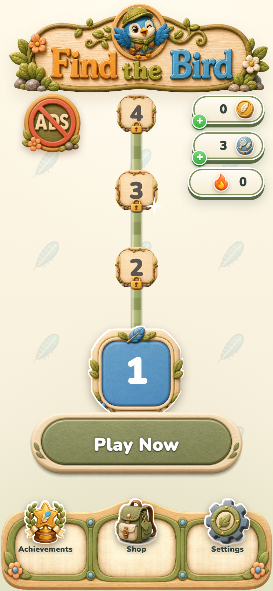
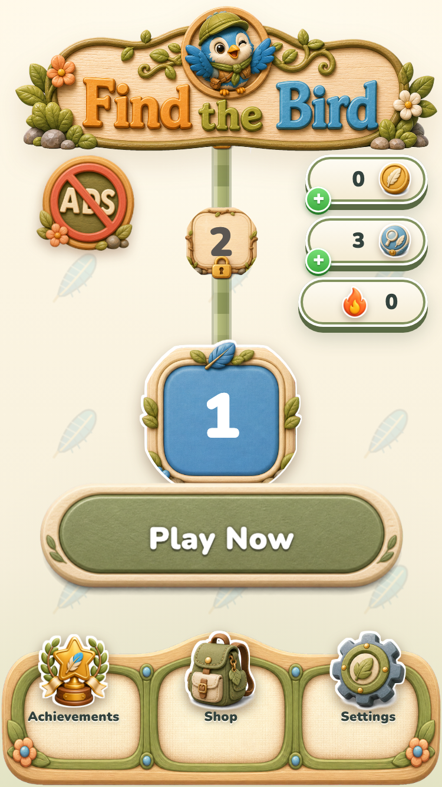
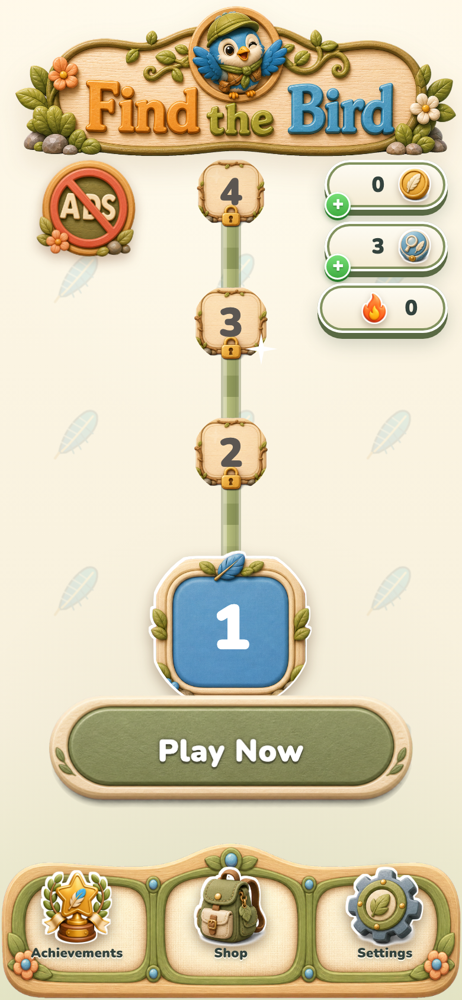
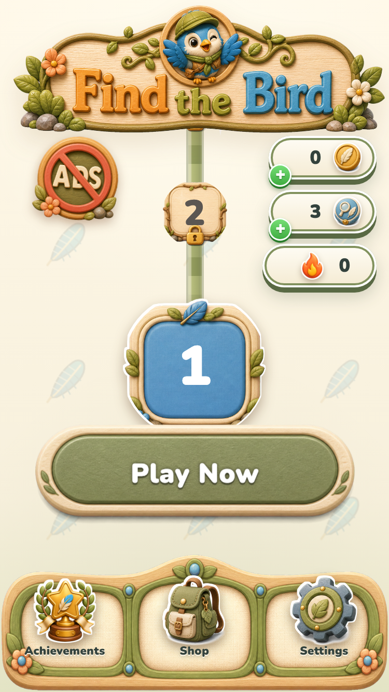

# Bottom navigation placement journal

## Task NAV-1 - Lower bottom navigation content

### Task Snapshot

Status: active

The three icon-label groups are horizontally aligned but sit too high in their illustrated cells. This task translates the complete groups down by the requested 20 CSS pixels without changing sizes or behavior.

### Task Acceptance Criteria

- All three icons move down 20 CSS pixels.
- All three labels move down 20 CSS pixels.
- Alignment and containment remain intact at both captured phone sizes.

### Iteration 1 - Exact 20px translation

#### Planned Result

The three navigation groups move down exactly 20 pixels as units.

#### Why This Iteration

The previous correction over-raised the content; this iteration applies the user's explicit distance.

#### Capture Setup

- Route: Find the Bird test home state.
- Viewports: 390x844 and 375x667.
- Fixture: deterministic home-navigation capture script.
- State: default home screen.

#### Pre-Change Screenshots

1. 
   What to look at: The vertical position of each icon and label within its cream tile.
   Observation: All three groups sit high in the navigation artwork.
   Acceptance check: Criteria 1 and 2 fail; criterion 3 passes.

2. 
   What to look at: The same vertical placement at the compact viewport.
   Observation: The high placement is consistent at the shorter height.
   Acceptance check: Criteria 1 and 2 fail; criterion 3 passes.

#### Changes Made

Pending.

#### Post-Change Screenshots

Pending.

#### Decision

partial

#### Next Action

Translate both icons and labels down 20 pixels, recapture, and judge each criterion.

#### Spawned Tasks

- None.

### Iteration 1 Result - Exact 20px translation

#### Changes Made

Moved all three icon artworks and all three labels down exactly 20 CSS pixels. Horizontal centering, sizes, navigation behavior, and the rest of the home layout were left unchanged.

#### Post-Change Screenshots

1. 
   What to compare: Each icon and label against its position in the matching pre-change screenshot.
   Observation: The complete groups sit 20 pixels lower, retain a visible icon-label gap, and remain inside the illustrated bar.
   Acceptance check: Criteria 1, 2, and 3 met; label boxes are 796-814 with 30px bar-bottom clearance.

2. 
   What to compare: The compact layout's icon-label positions and bottom containment.
   Observation: The exact translation is preserved at the shorter viewport with no horizontal drift.
   Acceptance check: Criteria 1, 2, and 3 met; label boxes are 619-637 with 30px bar-bottom clearance.

#### Decision

passed

#### Next Action

Publish the updated comparison to Portal.

#### Spawned Tasks

- None.
