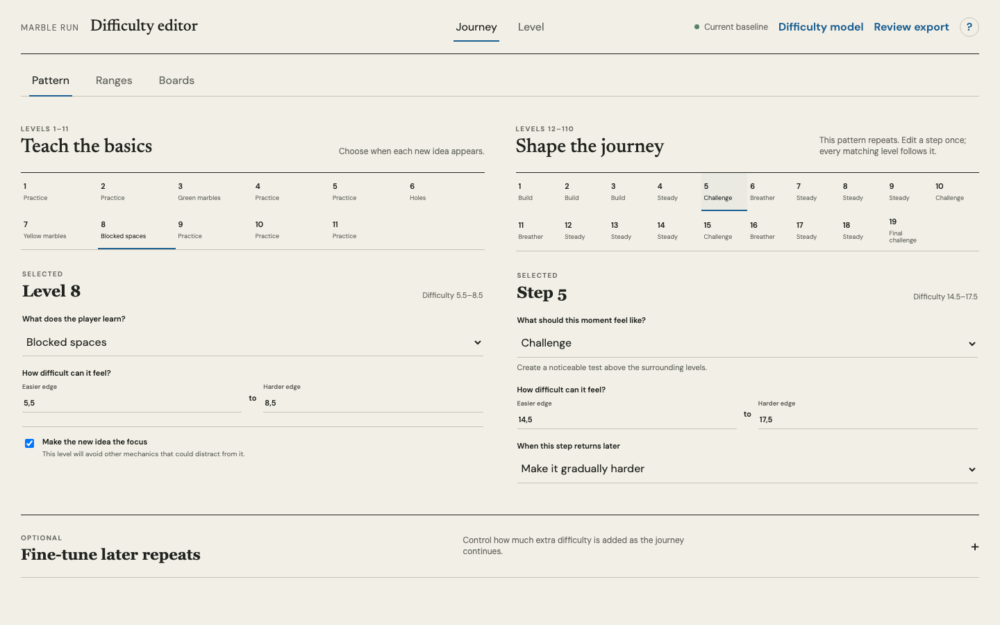
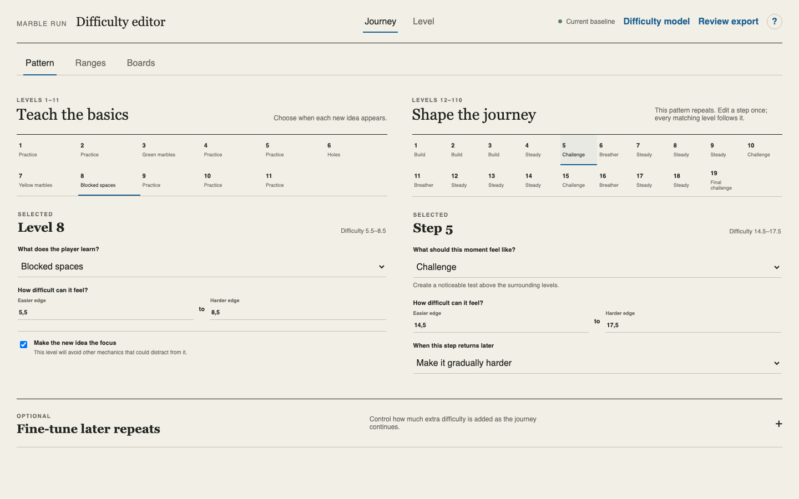
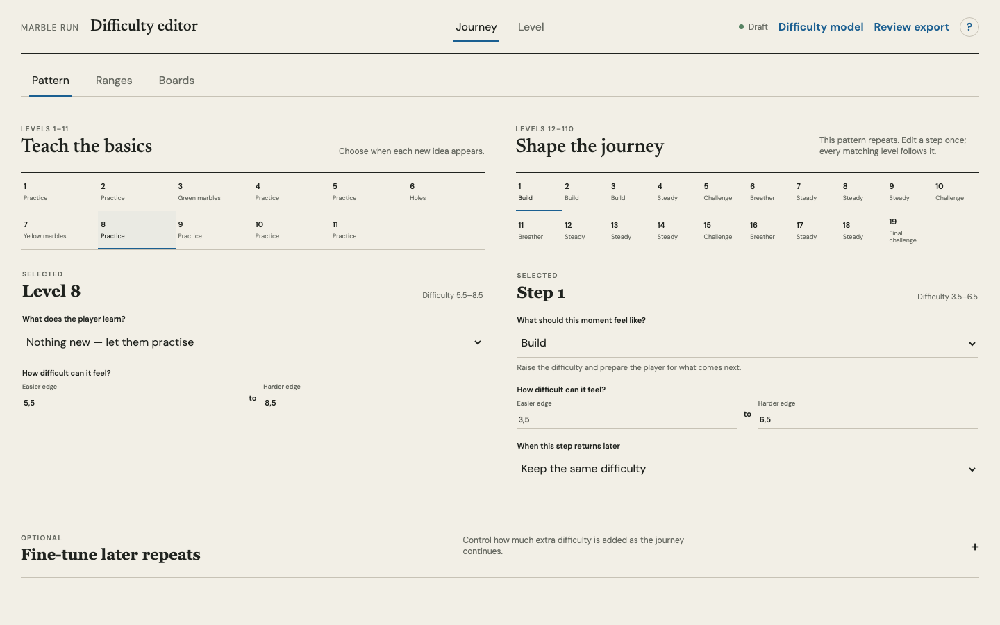
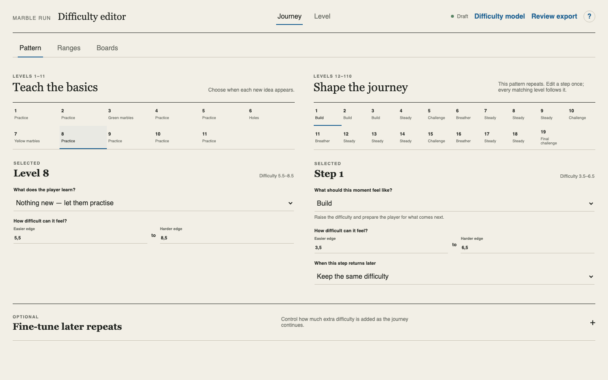

# Plain-language Pattern review

## Task 1 — Make Pattern understandable without generator vocabulary

Task snapshot: The Pattern screen exposes the generator's data structure as thirty simultaneous form rows. Internal pacing labels and arithmetic terms require prior implementation knowledge, so the designer cannot infer what a choice does.

### Iteration 1

Planned result: Replace internal vocabulary with designer-facing pacing choices and reveal detailed controls only after selecting a level or repeating step.

Capture setup: Live authenticated Portal route, content hash `e6a20c180c661c54555afabc8c6bedba377ffeb7e5d1d7e16a715787aaae64bc`, Chromium at 1440 x 900, Journey > Pattern.

What to look at: The left and right columns expose every input at once; the right column begins with unexplained roles such as ramp, band, spike, and recover.
Observation: The screen is a direct rendering of the generator schema, not a designer workflow.
Acceptance check: Criteria 1, 3, and 4 fail; criteria 2 and 5 are present but unusably exposed.

Change explanation: pending.

Decision: failed before implementation.

Next action: implement the selected-step interface and recapture the same viewport.

What to compare: The thirty-row form is replaced by two sequence overviews. Level 8 and Step 5 are selected, and only those two items expose controls.
Observation: Internal pacing names are replaced by Build, Steady, Challenge, Breather, Easy win, and Final challenge. The selected choice explains its effect beside the control. Later-repeat tuning is optional and collapsed.
Acceptance check: Criterion 1 met with an automated visible-copy check; criterion 2 met with all 11 teaching levels and 19 repeating steps visible; criterion 3 met; criterion 4 met; criterion 5 met through unchanged domain values and passing authoring tests.

Change explanation: The interface now translates the generator schema at the presentation boundary. It preserves the stored role and progression values but presents familiar pacing choices, plain questions, and a selected-step editor.

Decision: passed locally at the matched viewport with zero page errors.

Next action: activate the reviewed build in Portal and repeat the visible-copy and selection checks on the exact live artifact.

What to compare: The live authenticated surface matches the reviewed local build, with Level 8 and Step 5 selected.
Observation: The iframe is pinned to content hash `00f1500bfc5326cd26e7d3ee37976c34a8e9525e8f85b8f50991d83c1317c615`; the old internal terms and the word `generator` are absent from visible copy.
Acceptance check: All five criteria met on the live artifact; both sequence selections changed the focused editor; zero page errors.

Decision: passed and deployed.

Next action: preserve this interface vocabulary in future Pattern changes.

### Iteration 2

Planned result: Correct the focus control so its explanation matches runtime behavior and it cannot exist without a mechanic to focus.

Capture setup: Production build, Chromium at 1440 x 900, Level 8 selected, then changed from Blocked spaces to Nothing new.

What to compare: Level 8 now reads Practice and the focus checkbox is absent after its mechanic is removed.
Observation: Moving or removing a mechanic clears the associated focus state. When a mechanic is present, the help text promises emphasis and learning room rather than exclusion of other mechanics.
Acceptance check: Truthful copy met; impossible Practice-plus-focus state removed; selected-entry isolation and advanced repeat edits covered by state assertions; 39 tests pass.

Change explanation: Focus is now conditional on a mechanic debut at both the data-update and presentation boundaries. The interaction test performs real draft mutations instead of checking headings alone.

Decision: passed locally.

Next action: verify this exact state on the newly activated live artifact.

What to compare: The live Level 8 Practice state has no focus control, matching the reviewed production build.
Observation: The authenticated iframe is pinned to `e31f639f5eccdf61e0777e0627a91423a4ae9cd27e23701e7cbc165d5117effa`. Selecting Blocked spaces showed the truthful focus explanation; changing it to Nothing new removed the control and flag.
Acceptance check: Correct conditional state, truthful copy, exact live hash, and zero page errors.

Decision: passed and deployed.

Next action: retain the activation backup for rollback.
