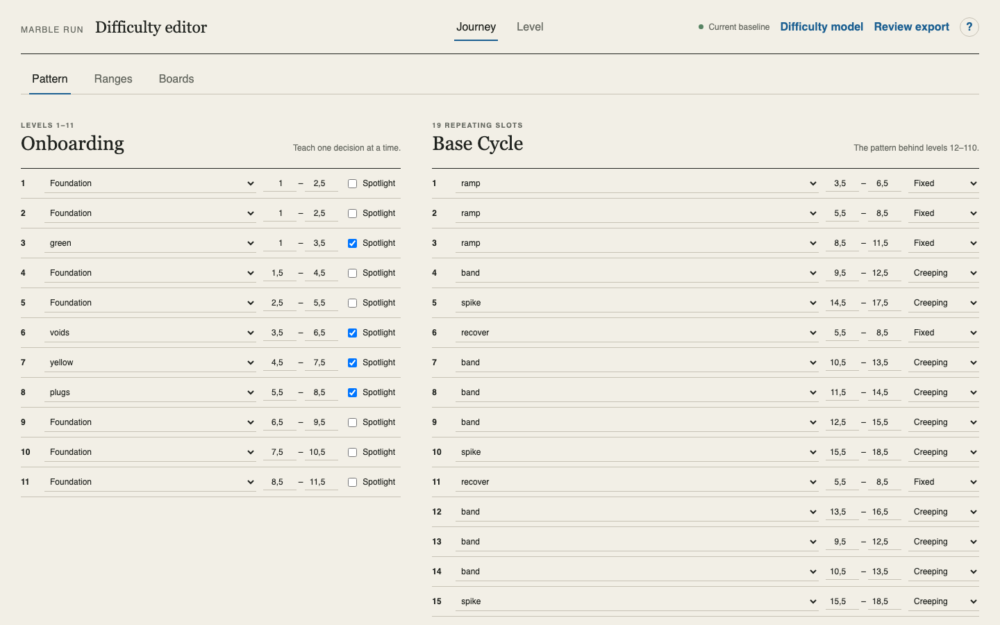
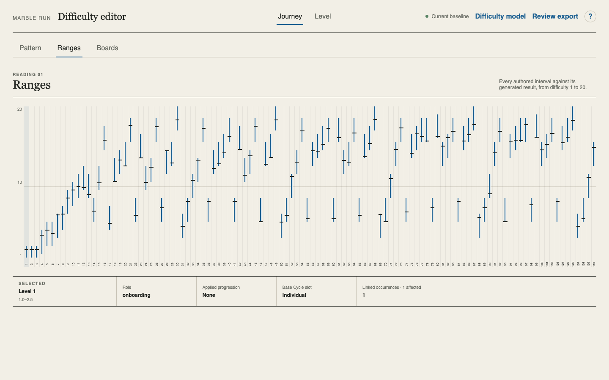
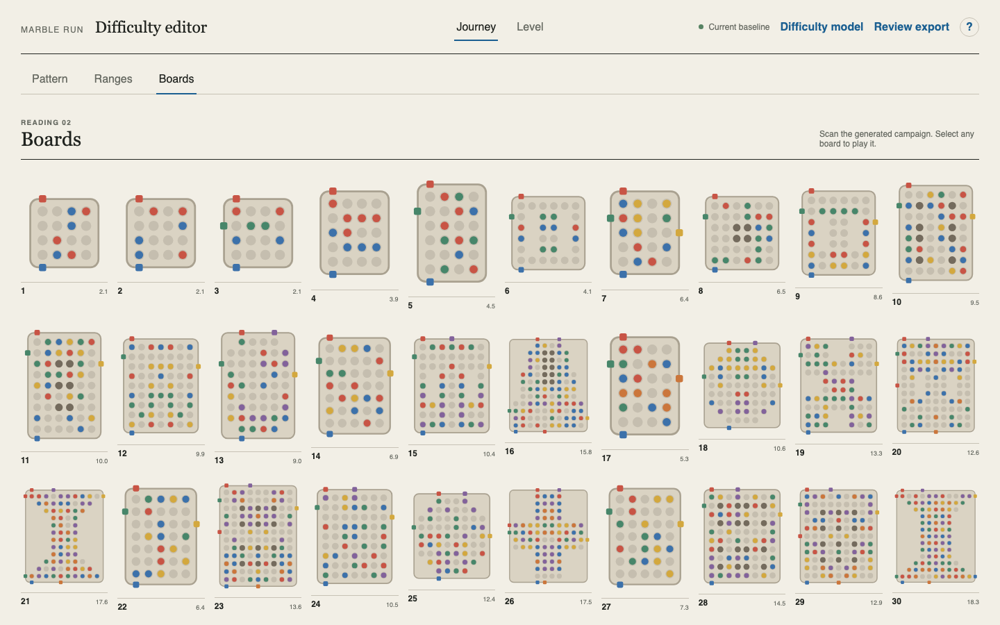
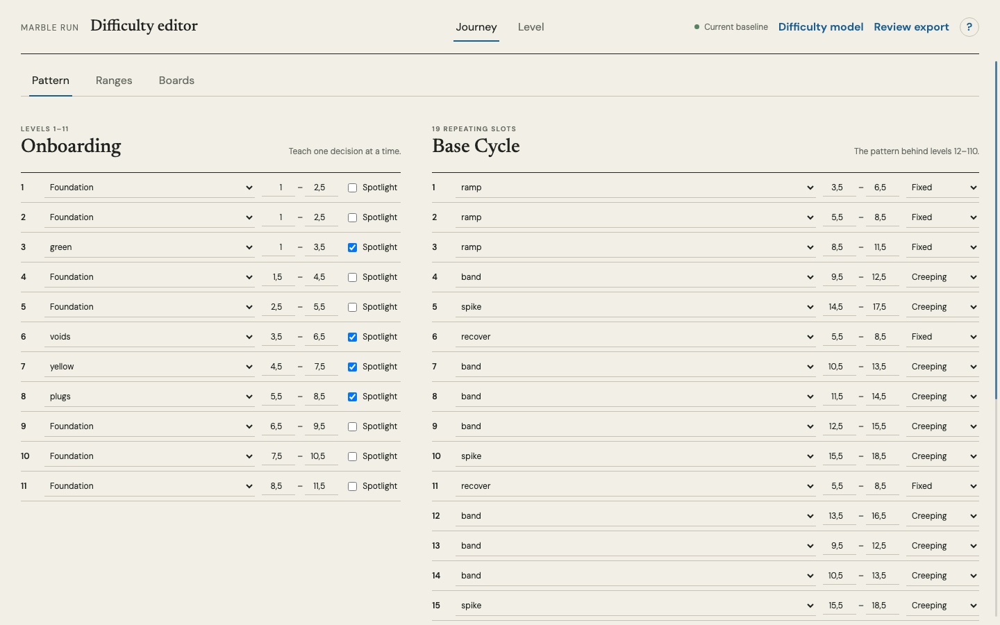
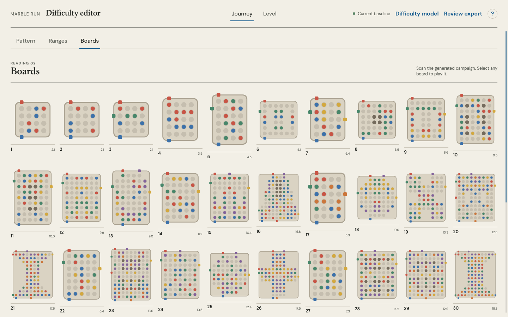
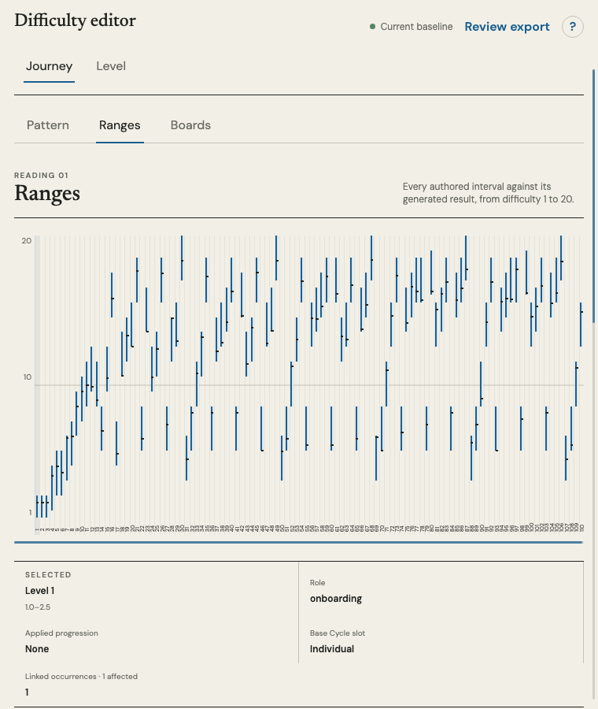
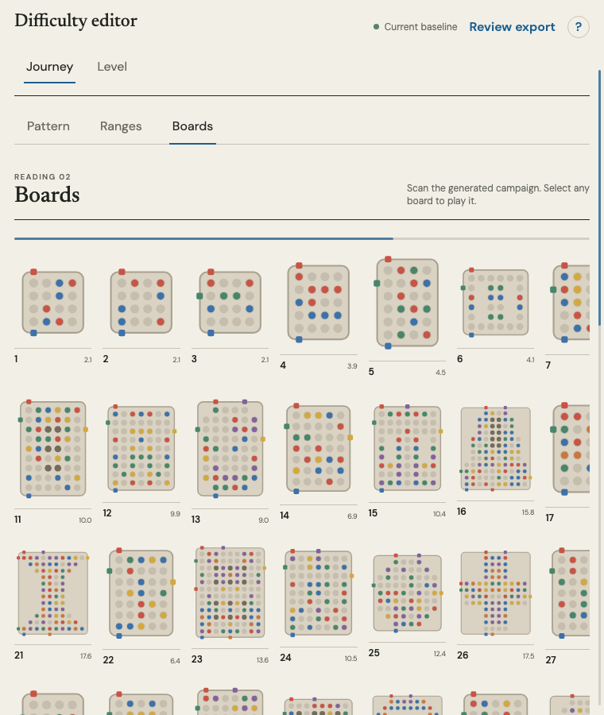

# Scroll affordance review

## Task 1 — Make overflow visible

Task snapshot: The approved captures used full-page screenshots, which made all content visible while hiding the real 1440 × 900 viewport behavior. Pattern and Boards overflow vertically with no persistent visual cue; narrow Ranges and Boards rely on disappearing system overlay scrollbars.

### Iteration 1

Planned result: Use one restrained scrollbar treatment for document and horizontal data overflow, visible only when scrolling is possible.

Capture setup: Live authenticated Portal route, Chromium, 1440 × 900. Close Play preview, then capture Pattern, Ranges, and Boards.

What to look at: Base Cycle stops at slot 15 at the viewport edge.
Observation: More content exists below, but the interface gives no persistent scroll cue.
Acceptance check: Vertical affordance failed.

What to look at: The complete chart fits at desktop width.
Observation: No scrollbar is needed on this axis at this viewport; this state must remain visually quiet.
Acceptance check: No false desktop overflow currently.

What to look at: The view ends after level 30 even though the campaign has 110 boards.
Observation: The remaining 80 boards are below the fold with no persistent scroll cue.
Acceptance check: Vertical affordance failed.

Change explanation: pending.

Decision: failed before implementation.

Next action: add the shared scrollbar treatment, rebuild, and recapture matching states.

### Iteration 2

Planned result: Keep scroll affordances persistent across macOS scrollbar settings without adding labels, arrows, or duplicated navigation.

Capture setup: Production build served locally for verification only, Chromium at 1440 × 900 and 760 × 900. The shareable surface remains Portal; localhost is not a handoff URL.

What to compare: The right edge now carries a thin blue thumb whose length and position describe the hidden Pattern content.
Acceptance check: Persistent vertical affordance met; layout and controls unchanged.

What to compare: Levels 31–110 remain below the fold, but the same right-edge rail makes that continuation explicit.
Acceptance check: Persistent vertical affordance met; board density unchanged.

What to compare: A three-pixel horizontal track beneath the chart exposes the complete 110-level width; the page rail remains at right.
Acceptance check: Both overflow axes visible, non-overflowing desktop horizontal axis remains quiet.

What to compare: The horizontal rail is now directly above the board field, while the vertical rail remains at the right edge.
Acceptance check: Both overflow axes are visible and usable from the first viewport.

Change explanation: Native overlay scrollbars were replaced only on the three editor-owned overflow surfaces with restrained rails tied to their real scroll offsets. Track clicks and thumb drags operate the underlying containers; wheel, touch, and keyboard scrolling remain native.

Decision: passed after moving the Boards horizontal rail above the board field.

Next action: activate the reviewed artifact in Portal after deployment consent.
