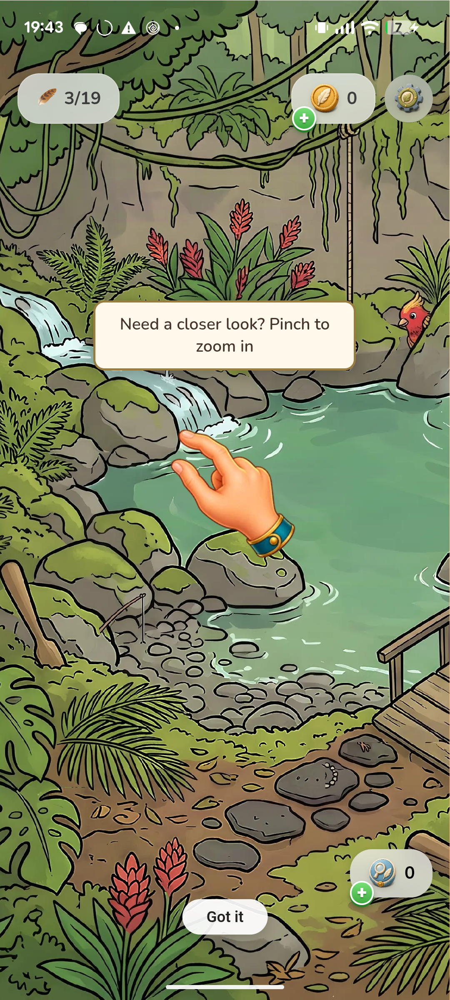
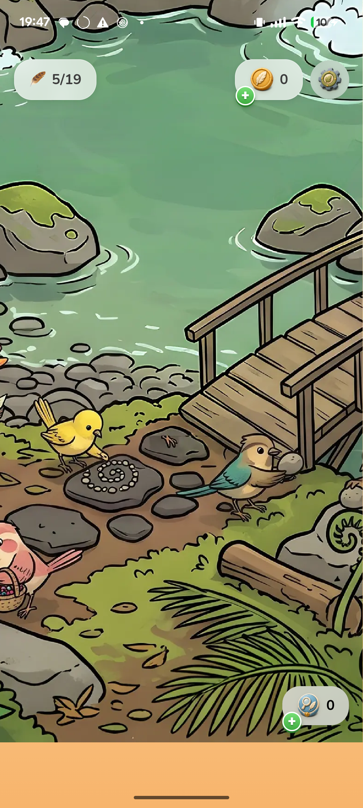
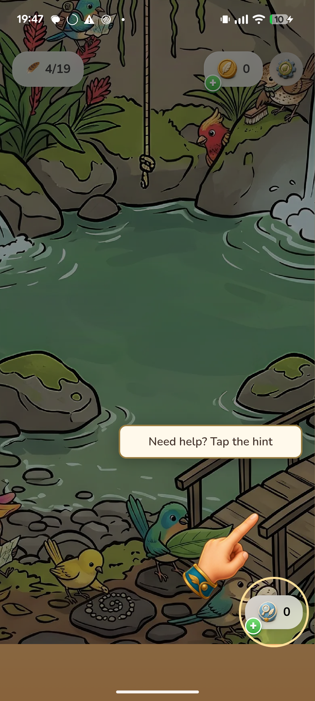
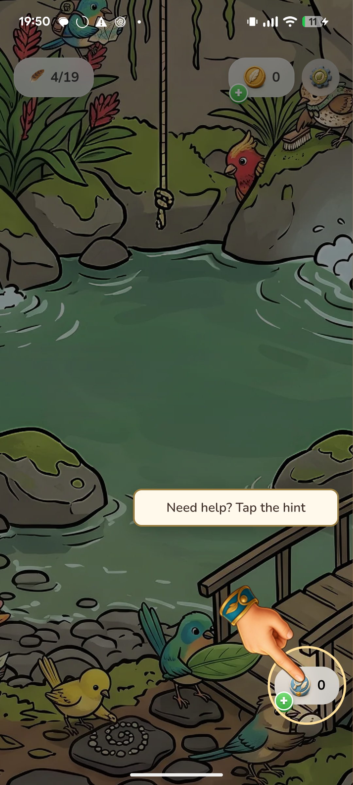
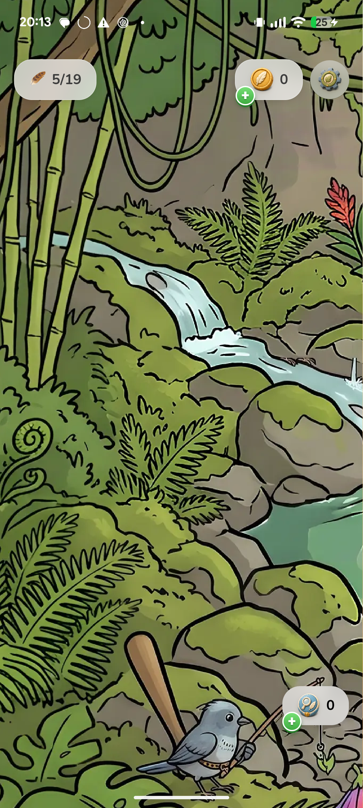
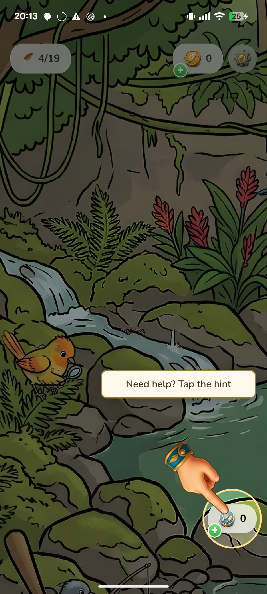
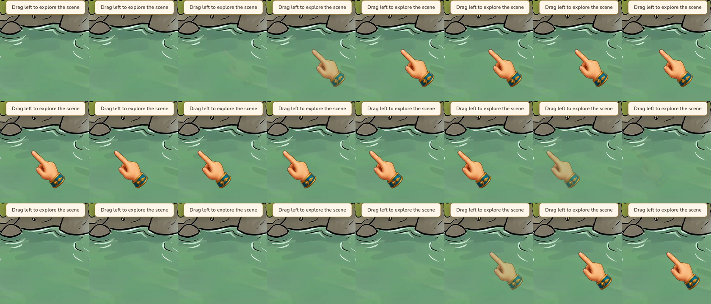

# Android tutorial review journal

## Iteration 1 — reproduce and trace

Planned result: record the existing tutorial and identify the causes of bird disappearance, incorrect fingertip placement, and panning discontinuities before editing runtime behavior.

Setup: physical Pixel 6a, baseline main bc2bb09d1. Private app data backed up outside Git. Existing installed APK differs from the newly merged main APK, so the baseline will be rebuilt with the existing test harness enabled and its installed identity checked.

Acceptance: the three criteria in tasks.md are pending physical review.

### Findings and change

The baseline recording reproduces uncollected birds disappearing, an empty hinted target, the hint hand pointing away from its button, and the pan hand jumping back each loop. GPU readback after three finds shows untouched CPU mask alpha 255 becoming GPU alpha 0 (RGBA 128,128,128,0). A full upload restores the birds. The shared partial uploader's accelerated scratch-canvas copy causes the corruption; using a CPU-backed scratch surface retains partial uploads and preserves untouched pixels.

Observation: the counter is only 3/19, but most uncollected birds are absent. Criterion 1 fails.

Observation: after all eleven recorded checkpoints, five collected birds are removed and remaining birds stay visible. Post-run GPU readback matches CPU alpha at every bird center. Criterion 1 passes; criteria 2 and 3 remain open.

Evidence: private `ftb-android-tutorial-20260914/baseline.mp4` (118 seconds), `cycle1-verified/tutorial.mp4` (38 seconds), its trace.json and mask-readback.json. The entire recording was inspected as ordered frames. The existing unit test was strengthened, failed before the change, and passed after it. The first automated recording attempt exceeded the screenshot buffer; it was discarded and rerun with a bounded larger buffer.

Decision: partial. Next: correct fingertip placement at bottom targets in cycle 2.

## Iteration 2 — keep the fingertip on its target

Planned result: the hand points into guided birds and the hint button, including bottom/right edges, without hiding instruction text. Same Pixel, first-level fixture, full tutorial recording; cycle 1 is the pre-change baseline.

Observation: the hand was clamped upward but still points up, away from the hint button below it. Criterion 2 fails.

Change: position the artwork using its actual fingertip, mirror toward the target when space is constrained, and direct the tap motion toward that point. Regression cases cover ordinary, right-edge and bottom-right anchors.

Observation: the fingertip points down directly into the hint button, and the instruction remains unobscured. Full cycle2/tutorial.mp4 and its ordered frame review cover all eleven checkpoints; birds remain visible. Criteria 1 and 2 pass, criterion 3 remains open. Eight overlay tests pass after a red regression run.

Decision: partial. Next: smooth the pan loop and stop camera recentering during a held drag.

## Iteration 3 — pan motion and final regression

Planned result: the pan demonstration moves in the requested direction, fades out before resetting, and the next-target camera motion begins only after finger release. Repeat the whole tutorial and check adjacent normal finds, hints and settings.

Pre-change evidence: cycle2/tutorial.mp4, pan-left and pan-right checkpoints. The CSS loop ends at the opposite side from its initial position, causing a visible 96 CSS-pixel reset. The scene also advances once a 48 CSS-pixel threshold is crossed while the finger is still held, starting an automatic camera pan that competes with subsequent drag movement.

Change: fade the hand before returning invisibly, ease the lesson's preparatory zoom/pan, wait for drag release before stage advancement, and stop release inertia before programmatic recentering. The scene-level regression failed because advancement occurred during the held drag; it passes with release-based advancement.

### Cold-start rejection and correction

The first cycle 3 replay passed, but a fresh-install replay with a two-finger pinch reproduced GPU corruption before the pinch. This invalidates the earlier claim that a CPU-backed scratch canvas alone fixes the upload bug. Thirteen uncollected bird centers had CPU alpha 255 but GPU alpha 0. No merge was attempted.

The remaining unsafe boundary is the DOM-canvas overload of texSubImage2D, even with a readable scratch surface. The correction submits explicit RGBA bytes and dimensions, with row inversion and premultiplication performed explicitly to preserve Phaser's texture convention. Tests now check exact half-alpha/color bytes, both row orientations, and the raw-byte overload; a fresh physical replay must pass before accepting this correction.

### Final acceptance

Two fresh-install full replays with actual two-finger WebView touch input passed after the explicit-byte correction: `cycle3-corrected/tutorial.mp4` and `cycle3-final/tutorial.mp4` (45 seconds each). The latter includes the final reusable upload buffer, avoiding a second large pixel allocation on every reveal frame. The installed APK SHA-256 exactly matched the built APK: `eae47bd1229630beaa0bea2b958a5791e011e70de9bfd7496c98c565d1ec8a7c`. Source is the eight-file fix against main `bc2bb09d1`; only explanatory comments changed after that build.

Observation: all eleven checkpoints complete, with five found birds removed. GPU readback after completion reports all fourteen uncollected centers at alpha 255, matching the CPU mask with zero mismatches. No mask probe was performed before completion in this acceptance run.

Observation: the downward fingertip intersects the bottom-right hint button. Guided target placement also remains correct through camera movement.

Observation: the hand moves left, fades out, returns while invisible and fades in; no visible position reset. Full ordered recording frames cover pinch, both physical ADB drags, and release before automatic next-target movement. The alternative zoom button was exercised in the earlier cycle 3 replay.

Adjacent checks: a normal post-tutorial find increments 5/19 to 6/19 and removes its target; settings opens and renders correctly. Both physical screenshots were inspected. The private original localStorage backup was restored exactly (30/30 entries), then checked after reload: 29 unchanged, with only the normal notification launch counter incremented. Game progression/settings were preserved. Raw save data remains outside Git.

Decision: all three acceptance criteria pass on physical Pixel 6a. The initial scratch-only fix and its provisional passes remain explicitly rejected by the cold-start result above. Android tutorial acceptance is complete; this is not an iOS device claim or a store release.

Validation: Bird 591 passed / 3 skipped; Dog 516 passed / 2 skipped; both typechecks passed; Bird lint passed. After the final buffer reuse change, all five region-upload tests, Bird typecheck and lint passed again. Held-drag, fingertip edge placement, raw RGBA/premultiplication and flipped-row cases are covered. `git diff --check` passed.

Review: the reuse, quality and efficiency reviewers ran independently. Removed an obsolete zoom callback and reused the byte buffer in response to findings. The suggestion to omit unpack-state writes was not adopted: explicit raw-byte upload state is intentional and matches this helper's existing state-ownership approach; no renderer consumer relying on retained unpack flags was identified. Final inline review covered the exact eight owned code/test files, screenshot/trace evidence and shared Dog caller behavior. No blocking findings remain. iOS physical verification is a remaining platform coverage gap.

Evidence root (private local artifacts): `/Users/base/store-review/find-games/ftb-android-tutorial-20260914/`. Final recording: `cycle3-final/tutorial.mp4`; checkpoint trace and mask readback are also copied beside this journal. The recording is retained outside Git. Other worktrees, provider state and iPhone data were not changed by this Android task.
