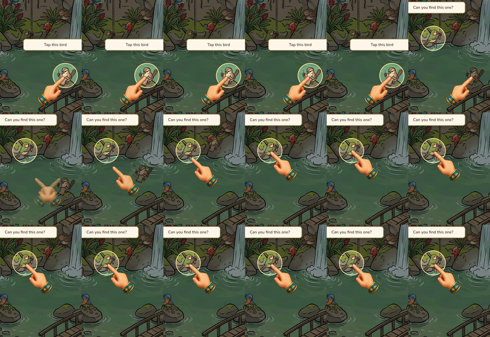
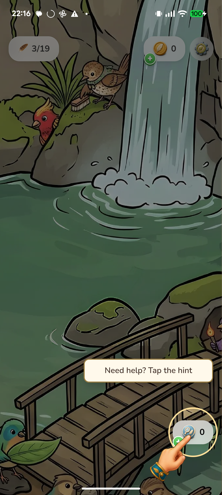

# Tutorial motion follow-up

Source baseline: main d2fbe5a3b. Prior recording was rejected for hand direction, upside-down hint pose, snapping transitions and excessive lessons.

Requested acceptance:

1. Taps translate along the pointing finger in each horizontal alignment.
2. One pan lesson follows zoom; it advances directly to the hint, without another guided bird tap.
3. Hint artwork remains upright with the fingertip on the button.
4. Position, size and gesture changes transition smoothly.
5. Record the revised physical Pixel tutorial and publish the recording to Portal.

Implementation: artwork-local rigid translation inside the mirrored positioning element; no tap scale wobble or vertical reflection. Upright artwork scales to available bottom space. Position and size ease between targets, and separate tap/pinch/pan layers crossfade. The sequence reserves only one remaining bird for the hint. The native onboarding runner follows the shorter sequence.

Regression: six assertions failed before the changes; sequence, overlay, held-drag and economy tests pass after them. Bird suite: 589 passed, 3 skipped. Typecheck and lint pass. Final pose adjustment reran all ten overlay/sequence tests, typecheck and lint successfully.

The first physical replay exposed the hand flattening during a scaleX transition. Replaced that transition with crossfading upright mirrored poses and recorded again. Both the complete 35-second final replay and consecutive 12 fps transition frames were inspected. There are nine checkpoints: three guided birds, zoom, one left pan, hint, hinted bird, objective and normal play. No second pan or post-zoom bird instruction remains.

Native WebView motion readback confirms artwork-local stroke vectors of (-6,-8) and (+6,-8) CSS pixels for left/right pointing poses. Samples during a target change show intermediate positions, crossfading opacity and constant 160px width rather than a flattened hand. See motion-check.json. All fifteen remaining birds have matching CPU/GPU mask alpha after completion.

Physical device: Pixel 6a, serial 27091JEGR22183. Installed diagnostic APK hash exactly matches the built artifact: 06acec74812d7ac54324505f0d3eb8db28ce223b4c1864f04daa85514dc30408. Private final recording: /Users/base/store-review/find-games/ftb-tutorial-motion-20260914/final/tutorial.mp4. The recording is diagnostic gameplay evidence, not a store release. Original localStorage restored exactly after tests.

Inline review covered sequence guards, scarce target counts, hint economy gating, CSS animation/mirror composition, crossfade teardown, reduced motion and the existing native runner. No blocking findings remain. The iOS runner was updated to the shorter sequence but iOS was not physically replayed. No shared renderer changes were needed.
