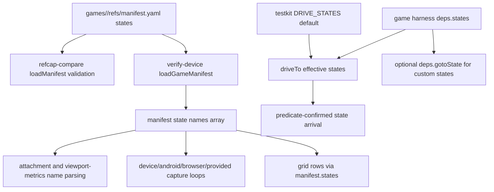

# Taxonomy-as-Data Per-Game States - Plan

## Goal Capsule

- **Objective:** Make each game's `refs/manifest.yaml` `states:` list the source of truth for reference and device-verification state names, while keeping the six legacy states only as scaffold/testkit defaults.
- **Authority:** Ratified Trello card `kBkCwWyS`; the card supersedes the earlier single-tool scope and rejects extending the enum or adding a repo-global state config.
- **Execution profile:** Headless tooling change across `tools/refcap-compare`, `tools/verify-device`, `packages/testkit`, `tools/create-game/test`, and the touched READMEs.
- **Scope fence:** Do not edit `tools/video-refs/**`, `games/*/refs/manifest.yaml`, or `games/*/src/**`; `games/_template/refs/manifest.yaml` stays as the unchanged scaffold default and is covered by a new validation test.
- **Stop conditions:** Stop if implementation requires changing game manifests/source, adding a new dependency, inventing a global states file, or editing the iOS runner outside the card fence without conductor approval.

---

## Product Contract

### Summary

State names are per-game data discovered at ingestion and ratified by humans in the game's refs manifest.
The tools currently agree on `menu`, `level`, `settings`, `pause`, `win`, and `fail` by duplicating a constant in three places; this plan removes those duplicated truth sources and makes the manifest list authoritative for tool behavior.

### Problem Frame

The next game can legitimately need states like `shop`, `tutorial`, or `gameplay`.
Today `tools/refcap-compare/src/manifest.mjs` rejects those states, `tools/verify-device/src/states.mjs` cannot parse/capture them, and `packages/testkit/src/testing/driveTo.ts` rejects them before a game harness gets a say.
That blocks ingestion at the exact point where state vocabulary should be ratified as per-game reference data.

### Requirements

**Manifest Source of Truth**

- R1. `games/<game>/refs/manifest.yaml` `states:` is the authoritative ordered state list for refcap and verify-device consumers.
- R2. `tools/refcap-compare` must remove the fixed canonical-state membership check while keeping existing manifest validation for `game`, `reference.package`, non-empty `states`, duplicate names, and per-lane `offline` or `gap` requirements.
- R3. Manifest state names must match `/^[a-z][a-z0-9_-]*$/`, and invalid names such as `Bad Name!` must fail with a clear manifest error.
- R4. Duplicate state names remain a manifest error even when the names are not in the legacy six.
- R5. The six legacy states survive only as scaffold defaults in `games/_template/refs/manifest.yaml` and as the testkit default list for existing harnesses.

**Tool Consumers**

- R6. `tools/verify-device` must derive its effective state list from the loaded manifest and pass that list into device, Android, browser, provided-captures, attachment extraction, and viewport-metrics parsing paths.
- R7. Verify-device filename parsing must accept only states from the effective manifest list and must handle hyphen and underscore state names without truncating them at the xcresult suffix separator.
- R8. `packages/testkit/src/testing/driveTo.ts` must preserve current default-state behavior for existing games and add a per-game state-list extension point through `DriveToDeps.states?: readonly string[]`.
- R9. `isDriveState` must check the effective list, defaulting to the legacy `DRIVE_STATES` when no per-game list is supplied.
- R10. A declared custom state such as `shop` must be drivable by the shared `driveTo` helper when the deps object supplies the state list, a generic navigation hook, and a predicate capable of confirming arrival; an undeclared state such as `fail` under `states: ['menu', 'shop']` must return `false`.

**Documentation and Verification**

- R11. The READMEs for `tools/refcap-compare`, `tools/verify-device`, and `packages/testkit` must explain that state vocabularies are per-game data discovered at ingestion and ratified in the refs manifest.
- R12. New tests must cover a manifest with `states: [menu, gameplay, shop, tutorial]`, invalid `Bad Name!`, duplicate names, template-manifest validation, verify-device custom state parsing/loading, and the `driveTo` `shop`/`fail` behavior.

### Acceptance Examples

- AE1. Given a manifest whose states are `menu`, `gameplay`, `shop`, and `tutorial`, when `loadManifest` reads it, validation succeeds and preserves that order.
- AE2. Given a manifest state named `Bad Name!`, when `loadManifest` reads it, validation rejects the state name before any capture processing.
- AE3. Given two manifest entries with the same `name`, when `loadManifest` reads it, validation rejects the duplicate.
- AE4. Given a verify-device run for a manifest containing `shop`, when a runner attachment is named `03-shop_0_uuid.png`, the attachment maps to `shop`; when the manifest does not include `fail`, `06-fail_0_uuid.png` is unmapped.
- AE5. Given a verify-device manifest containing `level_intro`, when a runner attachment is named `02-level_intro_0_uuid.png`, filename parsing maps to `level_intro` rather than truncating it to `level`.
- AE6. Given `driveTo` deps with `states: ['menu', 'shop']`, a generic `gotoState` hook, and a `shop` predicate, when `driveTo(deps, 'shop')` runs, it reaches and confirms `shop`; when `driveTo(deps, 'fail')` runs, it returns `false`.
- AE7. Given the real `games/_template/refs/manifest.yaml`, when `loadManifest` validates it, the unchanged six-state scaffold manifest passes.

### Scope Boundaries

**In scope**

- `tools/refcap-compare/src/manifest.mjs` and tests under `tools/refcap-compare/test/`.
- `tools/verify-device/src/**`, `tools/verify-device/cli.mjs`, and tests under `tools/verify-device/test/`.
- `packages/testkit/src/testing/driveTo.ts`, a focused testkit test file under `packages/testkit/src/testing/`, and `packages/testkit/README.md`.
- `tools/create-game/test/create-game.test.js` for the template manifest validation test only.
- `tools/refcap-compare/README.md` and `tools/verify-device/README.md`.

**Out of scope**

- No `games/*/refs/manifest.yaml` edits.
- No `games/*/src/**` edits, even if some harnesses later choose to pass per-game states explicitly.
- No `tools/video-refs/**` edits.
- No repo-global state taxonomy file.
- No browser E2E verification as a substitute for later device proof.

---

## Planning Contract

### Key Technical Decisions

- KTD1. **The manifest list is authoritative for refcap and verify-device.** This keeps the human-ratified ingestion artifact as the only place a game's reference taxonomy is declared.
- KTD2. **Verify-device should expose manifest-scoped parsing helpers instead of a module-level enum.** `stateFromShotName`, viewport-metrics parsing, attachment extraction, and provided-capture loading need an effective state list parameter so tests can prove custom states work without retaining a hidden six-state fallback.
- KTD3. **Underscore-safe parsing is required.** Current parsing splits xcresult names on the first `_`, which breaks allowed state names like `level_intro`; strip known xcresult suffixes from the right and match the remaining token against the manifest states.
- KTD4. **Testkit keeps default states as defaults, not authority.** `DRIVE_STATES` remains for existing games and type inference, but the effective list for `driveTo` and `isDriveState` can come from `DriveToDeps.states`.
- KTD5. **Custom `driveTo` needs a navigation hook, not just a wider guard.** The required `shop` test cannot pass by recognition alone; the minimal compatible shape is an optional generic `gotoState?(state: string)` on `DriveToDeps`, used only for non-default states and confirmed through supplied predicates.
- KTD6. **Docs should name the source-of-truth change, not teach another enum.** README updates should point authors to the per-game manifest and mention the six defaults only as scaffold defaults.

### High-Level Technical Design

### Assumptions

- A1. There is no upstream brainstorm artifact for this card; the ratified Trello description is the product contract.
- A2. Verify-device runner screenshots keep the existing naming convention of optional order prefix plus state name, with xcresult exporting an additional `_<index>_<uuid>` suffix.
- A3. `DriveToDeps.gotoState?` is the smallest extra hook needed to make a custom state like `shop` actually drivable; if implementation finds an existing equally small hook, keep the same behavioral contract and document the choice.
- A4. Existing game harness wrappers do not need edits in this card because the default list preserves the current six-state behavior.

### Risks and Dependencies

- **Filename parsing risk:** Allowed underscores make the existing first-underscore split incorrect; tests must include an underscore state to prevent a partial fix.
- **API widening risk:** Changing `DriveState` directly to `string` can weaken useful default-state typing; preserve a `DefaultDriveState` or equivalent internal type for default predicates and level-id options.
- **Hidden enum risk:** Removing `CANONICAL_STATES` from exported modules is not enough if helper defaults silently keep the six states; tests should pass custom state lists through the public paths.
- **Outside-fence iOS runner risk:** `tools/verify-device/runner/VerifyDeviceRunner/InsituTourTests.swift` currently hardcodes the six states, but the card's allowed edit list names `tools/verify-device/src/** + test/` and READMEs, not runner Swift. The implementation worker must not edit the runner silently; either the conductor expands the fence, or live iOS custom-state capture remains a documented gap while JS-side parsing/capture orchestration is made manifest-driven.
- **Verification-command risk:** The card requires `node --test tools/refcap-compare/test/ tools/verify-device/test/ tools/create-game/test/`; if existing Vitest-style tests make that command fail independent of this change, record the failure honestly and also run the package `test:unit` scripts that match the repo manifests.

### Sources and Research

- `tools/refcap-compare/src/manifest.mjs` currently defines `CANONICAL_STATES` and rejects unknown state names.
- `tools/verify-device/src/states.mjs`, `tools/verify-device/src/attachments.mjs`, `tools/verify-device/src/viewportMetrics.mjs`, and `tools/verify-device/cli.mjs` currently form the duplicated verify-device enum surface.
- `tools/verify-device/runner/VerifyDeviceRunner/InsituTourTests.swift` also hardcodes the six-state iOS runner order; it is a discovered out-of-fence seam, not an implicitly approved edit target.
- `packages/testkit/src/testing/driveTo.ts` currently gates all calls through `DRIVE_STATES` and has no per-game extension point.
- `packages/testkit/src/harness/contract.ts` already describes `GameHarness.gotoState(state)` and `driveTo(state)` as per-game named-state surfaces.
- `docs/solutions/2026-07-09-cameleon-device-and-canvas-lessons.md` warns that a failing `driveTo` or listener can silently kill the insitu tour; this supports keeping confirmation predicates and false-on-failure behavior intact.

---

## Implementation Units

### U1. Refcap Manifest Validation Becomes Taxonomy-Agnostic

- **Goal:** Make `loadManifest` accept any valid per-game state list while preserving all non-enum validation.
- **Requirements:** R1, R2, R3, R4, AE1, AE2, AE3.
- **Dependencies:** None.
- **Files:** `tools/refcap-compare/src/manifest.mjs`, `tools/refcap-compare/test/integration.test.mjs` or a new `tools/refcap-compare/test/manifest.test.mjs`, `tools/refcap-compare/README.md`.
- **Approach:** Remove `CANONICAL_STATES` and its export from `manifest.mjs`; add a local state-name regex validator; keep duplicate detection and lane validation unchanged. Use temporary game-dir fixtures in tests so custom-state manifests do not require editing real game manifests.
- **Patterns to follow:** Existing `loadManifest(gameDir)` fixture style in `tools/refcap-compare/test/integration.test.mjs`.
- **Test scenarios:**
  - Covers AE1. A temp manifest with `menu`, `gameplay`, `shop`, and `tutorial`, each with explicit reference/v2 gaps, validates and preserves order.
  - Covers AE2. A temp manifest with `Bad Name!` rejects with an error naming the invalid state.
  - Covers AE3. A temp manifest with duplicate `shop` entries rejects with the existing duplicate-state style.
  - Existing committed `marble_run` integration still builds six rows from its current manifest without relying on an exported enum.
- **Verification:** Refcap tests pass, and no refcap source file exports or imports a canonical six-state constant.

### U2. Verify-Device Uses Manifest-Derived States Everywhere

- **Goal:** Remove verify-device's copied state enum and route the manifest state list through every state-name consumer.
- **Requirements:** R1, R6, R7, R12, AE4, AE5.
- **Dependencies:** U1, because verify-device loads manifests through refcap.
- **Files:** `tools/verify-device/cli.mjs`, `tools/verify-device/src/states.mjs`, `tools/verify-device/src/attachments.mjs`, `tools/verify-device/src/viewportMetrics.mjs`, `tools/verify-device/src/steps.mjs` if JS orchestration needs a state-list parameter, `tools/verify-device/src/androidDriver.mjs` if parameter names need clarification, `tools/verify-device/src/browserLane.mjs` if comments/docs still say canonical, tests under `tools/verify-device/test/`, `tools/verify-device/README.md`.
- **Approach:** Derive `const stateNames = manifest.states.map((state) => state.name)` after `loadGameManifest`. Pass `stateNames` into `runBrowserLane`, `resolveDeviceCaptures`, `runAndroidDevicePath`, `captureAndroidStates`, `loadCapturesDir`, `extractFromExportDir`, `mapAttachmentsToStates`, and viewport-metrics attachment parsing. Keep lower-level capture drivers generic by already accepting `states`. Do not edit `tools/verify-device/runner/VerifyDeviceRunner/InsituTourTests.swift` unless the conductor expands the file fence; instead, surface that runner hardcode as a blocker or documented live-iOS gap.
- **Technical design:** Directional API shape:
  - `stateFromShotName(name, states)` returns a state only when the normalized token is in `states`.
  - `stateFromViewportMetricsAttachmentName(name, states)` mirrors the same effective-list behavior.
  - `loadCapturesDir(dir, states)` checks `<state>.png` for each effective state.
  - `mapAttachmentsToStates(manifest, states)` and `extractFromExportDir(exportDir, states)` use the same parser.
- **Patterns to follow:** `tools/verify-device/src/crops.mjs` and `tools/verify-device/src/compare.mjs` already validate/iterate against `manifest.states` instead of a duplicated constant.
- **Test scenarios:**
  - Covers AE4. Attachment mapping with states `['menu', 'shop']` maps `03-shop_0_uuid.png` to `shop` and leaves `06-fail_0_uuid.png` unmapped.
  - Covers AE5. Attachment mapping with `['level_intro']` maps `02-level_intro_0_uuid.png` to `level_intro`.
  - Viewport metrics mapping accepts `02-shop-viewportmetrics_0_uuid.txt` only when `shop` is in the effective states.
  - `loadCapturesDir` with states `['menu', 'shop']` loads `menu.png` and `shop.png` and ignores a present `fail.png`.
  - JS orchestration tests prove manifest-derived states are passed into any JS-owned capture path that accepts a state list.
  - CLI/browser/Android tests that assert passed state arrays continue to pass with manifest-derived values.
- **Verification:** Verify-device tests pass, and `rg "CANONICAL_STATES" tools/verify-device/src tools/verify-device/cli.mjs` returns no JS source dependency on a six-state list. If the runner remains out of scope, the worker handoff names the remaining runner hardcode explicitly.

### U3. Testkit `driveTo` Supports Per-Game State Lists

- **Goal:** Preserve existing `driveTo` behavior while allowing a game harness to declare and drive custom state names.
- **Requirements:** R5, R8, R9, R10, AE6.
- **Dependencies:** None.
- **Files:** `packages/testkit/src/testing/driveTo.ts`, new `packages/testkit/src/testing/driveTo.test.ts`, `packages/testkit/README.md`.
- **Approach:** Keep `DRIVE_STATES` as the default list. Add `states?: readonly string[]` to `DriveToDeps`, add a backward-compatible optional state list argument to `isDriveState`, and have `driveTo` use `deps.states ?? DRIVE_STATES` for the initial guard. Keep the default switch branches for `menu`, `settings`, `level`, `win`, `fail`, and `pause`. For non-default declared states, use `deps.gotoState?(state)` and then confirm via `opts.predicates?.[state]`; return `false` if the state is undeclared, no generic hook exists, or no predicate confirms arrival.
- **Technical design:** Preserve a default-state type such as `DefaultDriveState = (typeof DRIVE_STATES)[number]` so `levelIds` remains scoped to default level-like states, while public `DriveState` widens to `string` where custom state names flow through.
- **Patterns to follow:** Existing game unit tests in `games/*/tests/unit/drive-to.test.ts` depend on default six-state behavior; do not require those harnesses to pass `states`.
- **Test scenarios:**
  - Existing default behavior: `isDriveState('menu')` is true and `isDriveState('boot')` is false with no second argument.
  - Effective-list behavior: `isDriveState('shop', ['menu', 'shop'])` is true and `isDriveState('fail', ['menu', 'shop'])` is false.
  - Covers AE6. `driveTo` with deps `states: ['menu', 'shop']`, `gotoState`, and a `shop` predicate calls `gotoState('shop')` and resolves `true`.
  - Covers AE6. The same deps return `false` for `driveTo(deps, 'fail')`.
  - A declared custom state without `gotoState` or without a confirming predicate returns `false`, not an unverified success.
- **Verification:** `npm run test:unit --workspace=@fabrikav2/testkit` passes and existing game-facing default API calls remain source-compatible under `npm run typecheck`.

### U4. Create-Game Guards the Template Manifest Default

- **Goal:** Prove the unchanged template manifest still satisfies the same reader that production tools use.
- **Requirements:** R5, R12, AE7.
- **Dependencies:** U1.
- **Files:** `tools/create-game/test/create-game.test.js`.
- **Approach:** Add a focused test importing `loadManifest` from `tools/refcap-compare/src/manifest.mjs`, resolving the real repo `games/_template` directory, and asserting the template validates with the current six default state names. Do not modify `games/_template/refs/manifest.yaml`.
- **Patterns to follow:** Existing create-game tests already resolve a temporary root for scaffold behavior; this test should resolve the actual repo root only for template validation.
- **Test scenarios:**
  - Covers AE7. The real template manifest validates and yields `['menu', 'level', 'settings', 'pause', 'win', 'fail']`.
  - The existing hermetic fake-template scaffold tests continue to pass unchanged.
- **Verification:** Create-game tests pass without changing the scaffold manifest.

### U5. Documentation and Verification Gates

- **Goal:** Make the new source-of-truth rule visible to future workers and run the exact card gates.
- **Requirements:** R11, R12.
- **Dependencies:** U1, U2, U3, U4.
- **Files:** `tools/refcap-compare/README.md`, `tools/verify-device/README.md`, `packages/testkit/README.md`.
- **Approach:** Replace language like "canonical states" with "per-game manifest states" where it describes tool authority. Keep references to the six states only where discussing scaffold defaults or legacy default behavior. Update verify-device docs to say the allstates tour/capture order is the manifest order.
- **Test scenarios:**
  - Documentation mentions `refs/manifest.yaml states:` as the source of truth in each touched README.
  - Documentation does not describe `tools/refcap-compare` or `tools/verify-device` as owning a canonical six-state enum.
- **Verification:** Exact card verification commands run and outcomes are recorded in the worker handoff.

---

## Verification Contract

| Gate | Command | Done Signal |
|---|---|---|
| Refcap, verify-device, create-game tests | `node --test tools/refcap-compare/test/ tools/verify-device/test/ tools/create-game/test/` | Required by card; failures must be reported with whether they are caused by existing Vitest-style tests or this change. |
| Testkit package tests | `npm run test:unit --workspace=@fabrikav2/testkit` | New `driveTo` tests and existing package tests pass. |
| Repo typecheck | `npm run typecheck` | Workspace TypeScript contracts still compile after `DriveState`/predicate type changes. |
| Enum audit | `rg "CANONICAL_STATES|Mirrors refcap|canonical states" tools/refcap-compare tools/verify-device packages/testkit` | No refcap/verify-device source-owned six-state enum remains; testkit default and template/default documentation may remain where explicitly framed as defaults. |
| Documentation audit | `rg -n "source of truth|manifest states|states:" tools/refcap-compare/README.md tools/verify-device/README.md packages/testkit/README.md` | Each touched README names the per-game manifest states source-of-truth rule. |

Device verification is not part of this headless tooling card because behavior is parser/manifest/testkit API logic, not a rendered game UI change.

---

## Definition of Done

- U1-U5 are implemented without editing `tools/video-refs/**`, `games/*/refs/manifest.yaml`, or `games/*/src/**`.
- `tools/refcap-compare` accepts valid per-game custom state names and rejects invalid names/duplicates.
- `tools/verify-device` consumes the manifest state list for all in-scope JS state parsing and capture iteration paths, and any remaining out-of-fence iOS runner hardcode is either resolved with explicit approval or documented as a blocker/gap.
- `packages/testkit` preserves default six-state behavior and supports declared custom states through `deps.states`.
- `games/_template/refs/manifest.yaml` remains unchanged and is covered by a create-game test using `loadManifest`.
- The three touched READMEs describe states as per-game manifest data.
- All commands in the Verification Contract have been run or honestly reported with blockers.
