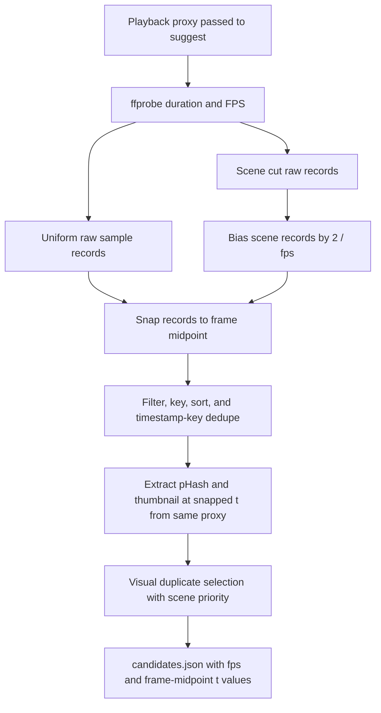

# fix: Align video-refs thumbnails with playback frames

## Goal Capsule

**Objective.** Make `video-refs suggest` emit candidates and thumbnails from the same playback file and at frame-midpoint timestamps so the picker receives frame-accurate inputs, especially around scene cuts.

**Authority.** The Trello card is the product and technical source of truth for this fix; `docs/plans/2026-07-09-001-feat-portal-frame-picker-ingestion-plan.md` remains background for the broader Portal frame-picker flow.

**Execution profile.** This is a bounded tooling fix in `tools/video-refs` with no new dependencies, no automatic proxy generation, no Portal changes, and no edits to `tools/video-refs/src/build-view.mjs`.
End-to-end browser seek consumption of `candidates.json.fps` belongs to the parallel build-view card.

**Stop condition.** Stop if implementation requires changing the picker reader or Portal view contract beyond additive `candidates.json` metadata; that belongs to the parallel build-view card or a follow-up.

**Tail ownership.** The next TWF worker implements and verifies the plan on this branch; the conductor owns landing.

---

## Product Contract

### Problem Frame

`suggest` currently extracts thumbnails from whichever video it is given, while the picker may play a different re-encoded proxy through `build-view --video-src`.
When scene detection emits a timestamp exactly on a cut, small decoder or FPS differences can make the thumbnail show one side of the cut and browser playback seek to the other side.
Exact-boundary seek timestamps are also nondeterministic in browser video playback, so even a same-file workflow needs candidate times biased away from cuts and snapped to frame midpoints.

### Requirements

- R1. Document the same-file operating contract: run `suggest` against the playback proxy, pass that same proxy to `build-view --video-src`, and run `extract` against the original video.
- R2. Keep `suggest` single-purpose; do not auto-transcode, auto-detect a proxy, call Portal, or wait for user decisions.
- R3. Probe the playback video's real FPS with `ffprobe` before candidate normalization.
- R4. Bias every scene-detected cut candidate by two frames into the new scene before thumbnail extraction and before duplicate selection.
- R5. Snap every candidate timestamp to the playback video's frame grid midpoint using `t = (round(t * fps) + 0.5) / fps`.
- R6. Preserve scene-cut candidates through duplicate selection when a nearby uniform sample is visually identical, so the emitted candidate represents the biased post-cut timestamp.
- R7. Emit top-level `fps` in `candidates.json` while preserving existing `video`, `duration_s`, and `candidates[].t/file` fields.
- R8. Keep `extract` using accurate seek against the original video; mid-frame timestamps from the proxy must remain accepted verdict inputs.
- R9. Extend the synthesized fixture test to prove scene-cut biasing, frame-midpoint snapping, and top-level FPS metadata.
- R10. Perform a live proxy-video check by comparing three candidate thumbnails against frames re-extracted from the same proxy using the existing perceptual hash helper.

### Scope Boundaries

**In scope**

- `tools/video-refs/src/suggest.mjs`, `tools/video-refs/src/time.mjs`, and `tools/video-refs/src/ffmpeg.mjs` as needed for FPS probing, timestamp normalization, and candidate generation.
- `tools/video-refs/run.mjs` and `tools/video-refs/README.md` for the documented same-file usage contract.
- `tools/video-refs/test/video-refs.test.mjs` for synthesized-fixture coverage.

**Out of scope**

- `tools/video-refs/src/build-view.mjs`; the parallel card owns consuming the new `fps` field.
- Browser-side thumbnail extraction or frame comparison.
- Auto-generating or transcoding playback proxies inside `suggest`.
- New npm dependencies.

### Acceptance Examples

- AE1. Given a 30fps synthesized video with a scene cut at `2.0`, when `suggest` detects the cut, then the scene candidate is emitted at the frame midpoint for the frame two frames after the cut, not at `2.0`.
- AE2. Given any emitted candidate in `candidates.json`, when the implementer computes `candidate.t * fps`, then the fractional component is `0.5` within `1e-6`.
- AE3. Given a playback proxy used for `suggest --video`, when a candidate thumbnail is compared with a frame re-extracted from the proxy at the candidate timestamp, then the pHash distance is `0` or no more than `1`.

---

## Planning Contract

### Key Technical Decisions

| ID | Decision | Rationale |
|---|---|---|
| KTD1 | Probe FPS inside `suggest` with the existing `runFile('ffprobe', ...)` pattern. | `suggest` already probes duration with `ffprobe`, and the frame-grid contract must be derived from the same file that produces thumbnails. |
| KTD2 | Serialize candidate timestamps from the midpoint calculation at sufficient precision. | The current millisecond `formatTimestamp` behavior is too coarse for exact frame-midpoint math; store numeric `t` values without millisecond formatting and test `abs(frac(t * fps) - 0.5) <= 1e-6`. |
| KTD3 | Convert raw times into candidate records carrying at least timestamp and source before sorting and dedupe. | Bias and duplicate priority depend on whether a timestamp came from scene detection or uniform sampling. |
| KTD4 | Prefer biased scene records over visually duplicate uniform records. | Current pHash dedupe keeps the first duplicate after sort, which can drop the scene candidate and keep a less-safe uniform timestamp near the cut. |
| KTD5 | Add `fps` as additive top-level metadata only. | Existing picker and extract consumers can continue reading current fields, while the build-view card gets the contract field it owns consuming. |

### High-Level Technical Design

### Assumptions

- `ffmpeg` and `ffprobe` are on `PATH`, matching the existing `video-refs` prerequisites.
- `ffprobe` can report a finite video rate through `avg_frame_rate` or `r_frame_rate`.
Prefer `avg_frame_rate` when it is finite and positive; use `r_frame_rate` only when `avg_frame_rate` is invalid and `r_frame_rate` is finite.
If both finite rates differ beyond a small tolerance, treat the proxy as unsupported for this frame-grid contract and fail clearly rather than snapping to a synthetic grid.
- The implementation may add small exported helpers if that is the cleanest way to unit-test deterministic timestamp math, but it should keep the public CLI surface unchanged.

### Sources and Research

- `tools/video-refs/src/suggest.mjs` contains the current duration probe, scene detection, uniform sampling, pHash dedupe, thumbnail extraction, and `candidates.json` write path.
- `tools/video-refs/src/time.mjs` centralizes timestamp formatting and is the natural home for reusable frame-grid timestamp helpers.
- `tools/video-refs/src/phash.mjs` exports the `signature` and `distance` helpers required for the live thumbnail-vs-frame comparison.
- `tools/video-refs/README.md` documents the CLI workflow and verification expectations for Portal picker tooling.

---

## Implementation Units

### U1. Add FPS and Frame-Midpoint Timestamp Primitives

- **Goal:** Provide deterministic helpers for probing or parsing FPS and converting arbitrary seconds to frame-midpoint timestamps.
- **Requirements:** R3, R5, R9.
- **Dependencies:** None.
- **Files:** `tools/video-refs/src/time.mjs`, `tools/video-refs/src/suggest.mjs`, `tools/video-refs/src/ffmpeg.mjs`, `tools/video-refs/test/video-refs.test.mjs`.
- **Approach:** Parse rational frame-rate strings such as `30000/1001`, reject invalid or zero rates, reject conflicting finite `avg_frame_rate`/`r_frame_rate` values, and snap timestamps with frame-index math rather than millisecond rounding.
Clamp or filter timestamps that snap outside the valid video duration so a near-end candidate does not become `duration_s`.
Keep display/file-name formatting safe by stripping trailing zeros while retaining enough decimal precision for `abs(frac(t * fps) - 0.5) <= 1e-6`.
- **Patterns to follow:** Use the existing `probeDuration()` + `runFile()` JSON parsing style in `suggest.mjs` and the pure formatting style in `time.mjs`.
- **Test scenarios:** A helper-level or CLI-backed test covers integer FPS, rational FPS, invalid FPS rejection, conflicting FPS rejection, midpoint snap for `0`, midpoint snap near a scene cut, midpoint tolerance `<= 1e-6`, and near-duration filtering.
- **Verification:** Candidate timestamps in the fixture satisfy the midpoint formula using the probed FPS instead of millisecond-rounded approximations.

### U2. Rework Suggest Candidate Generation Around Source-Aware Records

- **Goal:** Apply scene-cut bias and midpoint snapping before thumbnail extraction while preserving scene candidates through duplicate removal.
- **Requirements:** R4, R5, R6, R7, R9.
- **Dependencies:** U1.
- **Files:** `tools/video-refs/src/suggest.mjs`, `tools/video-refs/test/video-refs.test.mjs`.
- **Approach:** Build raw records from uniform samples and scene detection, bias scene records by `2 / fps`, snap every record to the midpoint grid, filter by duration, and dedupe by timestamp key before pHash work.
During pHash duplicate selection, prefer a scene record over a visually duplicate uniform record so the emitted cut candidate remains the biased post-cut timestamp.
Write top-level `fps` in `candidates.json` and continue extracting signatures and thumbnails from the same `absVideo` supplied to `suggest`.
- **Patterns to follow:** Preserve the current output writer shape, trailing newline, JPEG thumbnail naming pattern, and no-network/no-Portal behavior.
- **Test scenarios:** The synthesized red-to-blue fixture runs at a known FPS, produces `candidates.json.fps`, includes a post-cut scene candidate at the expected biased midpoint, keeps all emitted candidates on the midpoint grid, and still writes thumbnail files.
- **Verification:** `node --test tools/video-refs/test/` proves both the existing CLI flow and the new frame-accuracy contract.

### U3. Document the Same-File Operating Contract

- **Goal:** Make the operator workflow unambiguous so thumbnails and playback use the same file while extraction still targets the original.
- **Requirements:** R1, R2, R7, R8.
- **Dependencies:** U2.
- **Files:** `tools/video-refs/run.mjs`, `tools/video-refs/README.md`.
- **Approach:** Update `suggest` usage text to state that `--video` should be the playback proxy when the picker will play a proxy.
Update the README workflow to show: run `suggest` on the playback proxy, run `build-view --video-src` with that same playback asset, and run `extract --video` on the original source video after the verdict.
Update the documented `candidates.json` shape to include top-level `fps`.
- **Patterns to follow:** Keep help text concise and in the existing plain CLI style; do not add flags or automatic detection.
- **Test scenarios:** Existing CLI help remains printable, and README examples match the implemented JSON contract.
- **Verification:** Manual review confirms the README and `run.mjs` help do not imply automatic proxy creation or original-video thumbnail extraction.

### U4. Verify With Unit Tests and a Real Proxy pHash Check

- **Goal:** Prove both the synthetic contract and the Batu-reported real-video failure mode.
- **Requirements:** R9, R10.
- **Dependencies:** U1, U2, U3.
- **Files:** `tools/video-refs/test/video-refs.test.mjs`.
- **Approach:** Extend the existing `node:test` fixture instead of adding a new framework.
For the live check, run `suggest` on the Wool Crush proxy path from the card, recompute the scene-derived timestamps with the same source-aware helper used by `suggest`, match those timestamps to emitted candidates, and choose the first three matched scene candidates.
Re-extract each frame from the same proxy with accurate `ffmpeg` seek, convert both thumbnail and re-extracted frame to the existing 32x32 grayscale signature shape, and compare with read-only `distance()` from `tools/video-refs/src/phash.mjs`.
Record each `t`, thumbnail file, and pHash distance; pass when each distance is `0` or no more than `1`, far below the existing duplicate threshold of `10`.
- **Patterns to follow:** Reuse the current fixture-generation style with `ffmpeg` lavfi sources and the existing `sh()` helper.
- **Test scenarios:** The test asserts scene bias, midpoint grid membership, `fps`, thumbnail existence, and unchanged extract manifest behavior.
- **Verification:** The handoff records `node --test tools/video-refs/test/` plus three live pHash distances that are `<= 1`.

---

## Verification Contract

| Gate | Command or Evidence | Proves |
|---|---|---|
| Unit/fixture tests | `node --test tools/video-refs/test/` | Scene candidates are biased two frames into the new scene, all emitted timestamps sit on the frame-midpoint grid, `candidates.json` includes `fps`, and existing build/extract behavior still passes. |
| Tool lint | `npx eslint --config tools/video-refs/eslint.config.js tools/video-refs` | The changed `video-refs` files satisfy the tool-local ESLint config; avoid repo-root `npx eslint <dir>` because the card notes the root config gap is pre-existing. |
| Live proxy check | Run `node tools/video-refs/run.mjs suggest --video /private/tmp/claude-501/-Users-base-dev-appletolye-fabrikav2/59f8be58-e51b-44da-acc0-10c88345c6af/scratchpad/woolcrush/woolcrush-proxy.mp4 --out /tmp/vr-acc-check`, recompute and match three emitted scene-derived candidates, then compare their thumbnails to frames re-extracted from that proxy with read-only `tools/video-refs/src/phash.mjs`. Record `t`, file, and distance triples; pass at distance `<= 1`. | The same-file contract fixes the thumbnail/frame extraction mismatch on the playback proxy; browser seek consumption remains owned by the build-view card. |
| Documentation review | Inspect `tools/video-refs/README.md` and `tools/video-refs/run.mjs` help. | Operators are told to run `suggest` on the playback proxy, pass that same asset to `build-view --video-src`, and run `extract` on the original. |

If npm cache permissions fail during lint or supporting commands, use `NPM_CONFIG_CACHE=/private/tmp/npm-cache` as noted on the card.

---

## Definition of Done

- `suggest` probes FPS from the playback video, biases scene cuts by two frames, snaps every candidate to a frame midpoint, and extracts thumbnails from the same file used for candidate timestamps.
- `candidates.json` preserves existing fields and includes top-level `fps`.
- The scene-cut fixture asserts the biased timestamp and frame-midpoint grid contract instead of only checking for a loose candidate near the cut.
- `tools/video-refs/README.md` and `tools/video-refs/run.mjs` document the same-file workflow and the original-video `extract` exception.
- `tools/video-refs/src/build-view.mjs` remains untouched.
- `node --test tools/video-refs/test/` passes.
- `npx eslint --config tools/video-refs/eslint.config.js tools/video-refs` passes or any failure is clearly identified as unrelated pre-existing behavior.
- The live Wool Crush proxy check records three `t`/file/distance triples between matched scene candidate thumbnails and re-extracted proxy frames; distances are `<= 1`.
- No new dependencies, generated proxy files, PRs, merges, or unrelated refactors are introduced.
