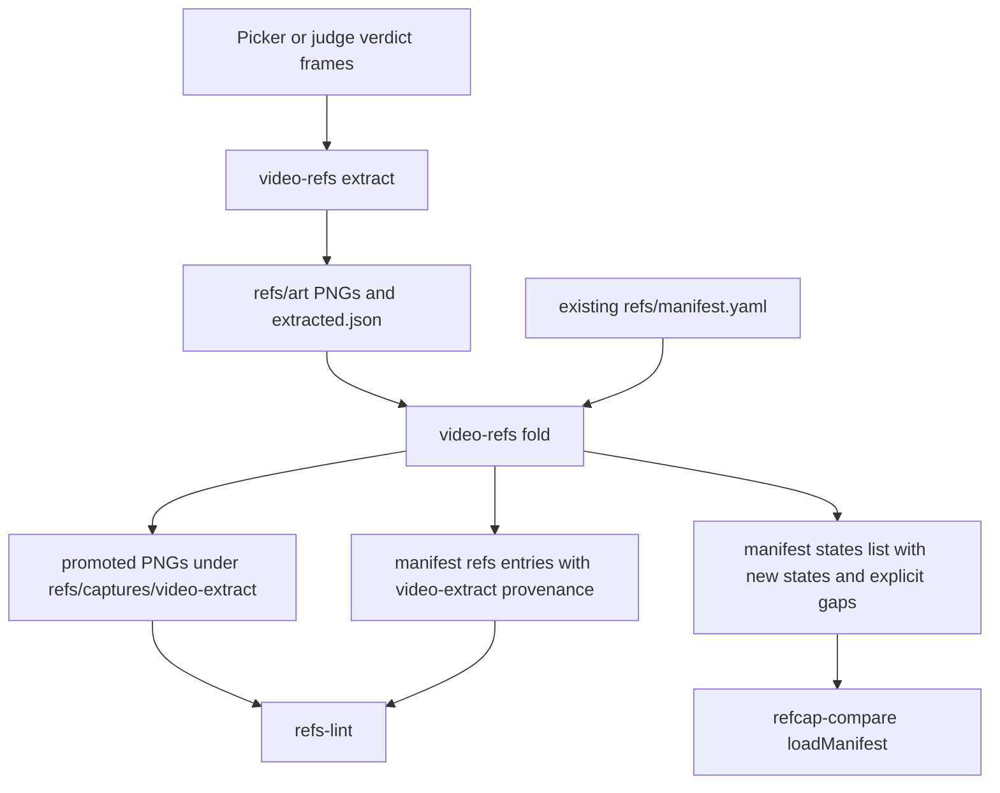

# feat: Fold video extracts into refs manifests

## Goal Capsule

**Objective.** Add a deterministic `video-refs fold` path that promotes `games/<game>/refs/art/extracted.json` frame records into `games/<game>/refs/manifest.yaml` entries that pass the existing refs and refcap manifest consumers, with Wool Crush as the live proof.

**Authority.** Trello card HiZduOSL is the source of truth. `games/marble_run/refs/manifest.yaml` is the exemplar for manifest shape, especially `refs/captures/...` entry keys, structured provenance, explicit at-rest metadata, and `states:` entries that declare either an offline source or a gap.

**Execution profile.** This is a tooling and reference-corpus change in `tools/video-refs`, `tools/audit`, and `games/wool_crush/refs`. Do not touch `tools/refcap-compare`, `tools/verify-device`, `packages/testkit`, or `tools/video-refs/src/build-view.mjs`.

**Stop condition.** Stop and surface a blocker if satisfying Wool Crush requires changing refcap-compare validation, verify-device semantics, or the shared game harness. Those are outside this card's fence.

**Tail ownership.** The next TWF worker implements and verifies this plan on the feature branch; the conductor owns landing.

---

## Product Contract

### Problem Frame

The current `extract` verb writes full-resolution PNGs and an `extracted.json` sidecar under `refs/art`, but refs-lint only treats committed images under `refs/captures` as manifest-managed references. The extracted frame records also carry a legacy string provenance value and hard-code `at-rest: true`, so folding them directly into a manifest would fail the provenance contract and silently trust unjudged video frames.

Wool Crush already has extracted PNGs and `refs/art/extracted.json`, but its manifest is still a fresh scaffold with state gaps and no `refs:` entries. This card turns the extracted video corpus into the same manifest shape that marble_run already proves can satisfy both refs-lint and refcap-compare.

### Requirements

- R1. Add a `video-refs fold` implementation that reads `games/<game>/refs/art/extracted.json` plus the existing `games/<game>/refs/manifest.yaml` and writes an updated manifest with one `refs:` entry per extracted frame.
- R2. Promote extracted frame PNGs into `games/<game>/refs/captures/...` so refs-lint sees them; do not widen refs-lint to scan `refs/art`.
- R3. Each folded entry must include `state-variant`, `capture-recipe`, boolean `at-rest`, and structured `provenance`.
- R4. `state-variant` must use `<state>/<variant>`, where state comes from the frame record and variant comes from label context or timestamp, such as `gameplay/t8`.
- R5. `capture-recipe` must identify the source video timestamp and the `video-refs extract` command context that obtained the frame.
- R6. Add refs-lint provenance source `video-extract`; for that source require `source`, `tool`, `captured`, and a video path in place of package/device.
- R7. `extract` must preserve an at-rest verdict from the picker or judge frame record instead of stamping every frame as trusted.
- R8. When a frame lacks an at-rest verdict, producer-side output must default to `at-rest: false`, include `not-at-rest-reason: unjudged video frame`, and include a recapture or review note so absence is visible.
- R9. Keep judge integration as a plumbed data contract or stub helper only; the full AI judge belongs to the P6 track.
- R10. Extend the manifest `states:` list with any new states found in `extracted.json`, using explicit lane gaps where an offline source is not yet selected.
- R11. Preserve current manifest fields and comments as far as practical; the fold must append or update the machine-relevant `refs:` and `states:` data without deleting lane metadata.
- R12. Run the fold for `games/wool_crush` for real and commit the promoted captures plus manifest update.
- R13. Verification must include `node --test tools/video-refs/test/`, `node --test tools/audit/test/`, refs-lint against the live repo, and a refcap-compare `loadManifest` check for Wool Crush.

### Scope Boundaries

**In scope**

- `tools/video-refs/run.mjs`, new or existing `tools/video-refs/src/**` modules, and `tools/video-refs/test/video-refs.test.mjs`.
- `tools/audit/src/refs-lint.js`, `tools/audit/test/refs-lint.test.js`, and docs describing the new provenance source.
- `games/wool_crush/refs/manifest.yaml` plus promoted PNGs under `games/wool_crush/refs/captures/...`.

**Out of scope**

- Changing `tools/refcap-compare`, `tools/verify-device`, `packages/testkit`, or `tools/video-refs/src/build-view.mjs`.
- Building the full AI at-rest judge; this card only carries judge-provided fields through the data path.
- Browser or device UI verification; this card is headless tooling plus committed reference artifacts.
- Reclassifying or deleting the original `refs/art` source material.

### Acceptance Examples

- AE1. Given an extracted frame `{state: "gameplay", t: 8, file: "gameplay-8.png", at-rest: true}`, when `fold` runs for Wool Crush, then the manifest contains a `refs/captures/.../gameplay-8.png` entry with `state-variant: gameplay/t8`, a video timestamp capture recipe, `at-rest: true`, and `provenance.source: video-extract`.
- AE2. Given an extracted frame with no at-rest verdict, when `extract` writes `extracted.json`, then that record has `at-rest: false`, `not-at-rest-reason: unjudged video frame`, and a review-oriented `recapture-note`.
- AE3. Given a video-extract manifest entry, when refs-lint validates provenance, then it accepts `video` plus `tool` and `captured` without requiring `package` or `device`.
- AE4. Given Wool Crush has extracted states not present in its scaffold manifest, when `fold` completes, then those states are present in `states:` with both lanes declaring either `offline` or `gap`.
- AE5. Given the live Wool Crush fold output, when refs-lint and refcap-compare load the manifest, then both complete without hard errors.

---

## Planning Contract

### Key Technical Decisions

| ID | Decision | Rationale |
|---|---|---|
| KTD1 | Follow the existing `refs/captures` contract by promoting copies of extracted PNGs into `refs/captures/video-extract/<video-stem>/`. | `tools/audit/src/refs-lint.js` walks only `refs/captures`, and `games/wool_crush/refs/art/README.md` describes `refs/art` as human-provided source material. Copying preserves the source artifact while creating lint-visible committed references. |
| KTD2 | Add `video-extract` as a provenance source with source-specific field validation. | Existing provenance requires package/device because shipped captures are app-device captures; video extracts instead need the source video path plus the extraction tool and capture date. |
| KTD3 | Treat `at-rest` as producer data, never as a fold default. | The card explicitly rejects defaulting to trusted; unsafe or unjudged frames must stay visible to refs-lint through false-at-rest explanation fields. |
| KTD4 | Keep the fold writer inside `tools/video-refs` and update only machine-managed manifest sections with narrow text operations, then parse the result for validation. | The repo has a parse-only YAML subset reader, and marble_run shows comments/operator context are part of the manifest's value. A full YAML round-trip would erase that context. |
| KTD5 | Fold updates or appends `refs:` and missing `states:` data while preserving existing lane metadata and comments as far as practical. | `loadManifest` only requires valid `states`, while marble_run's comments and lane metadata are important operator context. The writer should not normalize the whole file just to add refs. |
| KTD6 | Add new states rather than filtering them to canonical names. | P1 made per-game states legal, and the card specifically requires growing the states list for new extracted states such as `gameplay` or `other`. |

### High-Level Technical Design

### Assumptions

- The Trello card's P1 dependency is satisfied because this card has already reached `planned` in TWF.
- For the live Wool Crush fold, use `2026-07-09` as the `provenance.captured` value unless implementation finds a more specific extracted-frame capture date in source data.
- Existing Wool Crush legacy `extracted.json` entries may have `at-rest: true`; fold should honor those values, while producer-side changes prevent future unjudged frames from being stamped trusted.
- If the original source video is not committed, the fold may store the repo-relative intended video path, such as `refs/video/woolcrush-reference-video.mp4`, as provenance without requiring the file to exist.

### Sources and Research

- `games/marble_run/refs/manifest.yaml` is the exemplar: top-level `reference` and `v2` lane metadata, `refs:` keys under `refs/captures/android-basegamelab/...`, per-entry `state-variant`, `capture-recipe`, `at-rest`, false-at-rest explanation fields, structured provenance, and `states:` entries that keep missing lanes as explicit `gap` values.
- `tools/audit/src/refs-lint.js` currently hard-codes `PROVENANCE_SOURCES`, walks `refs/captures`, validates required ref entry fields, and produces the refs coverage table.
- `tools/refcap-compare/src/manifest.mjs` validates `game`, `reference.package`, and every `states:` lane having either `offline` or `gap`; the plan avoids touching this fence.
- `tools/video-refs/src/extract.mjs` currently writes `extracted.json` with string provenance and hard-coded `at-rest: true`; this is the producer-side bug to correct.
- `tools/video-refs/test/video-refs.test.mjs` already covers suggest/build-view/extract in one CLI-oriented fixture, making it the natural home for fold and producer metadata coverage.
- `docs/solutions/2026-07-09-cameleon-device-and-canvas-lessons.md` reinforces that accepted references belong in the manifest reference lane and proof must name the real artifact or command output observed.

---

## Implementation Units

### U1. Normalize Extracted Frame Metadata

- **Goal:** Make `extract` emit frame records that carry structured provenance and truthful at-rest metadata for `fold` to consume.
- **Requirements:** R5, R7, R8, R9.
- **Dependencies:** None.
- **Files:** `tools/video-refs/src/extract.mjs`, `tools/video-refs/run.mjs`, `tools/video-refs/README.md`, `tools/video-refs/test/video-refs.test.mjs`.
- **Approach:** Preserve `at-rest`, `not-at-rest-reason`, and `recapture-note` from verdict frame records when present. When the verdict omits an at-rest value, write `at-rest: false`, `not-at-rest-reason: unjudged video frame`, and a recapture or review note. Replace string provenance for new outputs with a structured object carrying `source: video-extract`, `tool`, `captured`, and `video`; accept a CLI or helper-provided capture date so tests stay deterministic. Keep backwards compatibility in `fold` for the existing Wool Crush legacy records.
- **Patterns to follow:** Existing `extractFrames` validation and JSON write style in `tools/video-refs/src/extract.mjs`; existing CLI flag parsing in `tools/video-refs/run.mjs`.
- **Test scenarios:** Extract with explicit `at-rest: true` preserves true and omits false-only explanation fields; extract with explicit `at-rest: false` preserves the supplied reason and recapture note; extract with no at-rest value writes false plus `unjudged video frame`; extracted records include structured video-extract provenance with deterministic captured date in tests.
- **Verification:** `node --test tools/video-refs/test/` shows the current extract fixture updated away from hard-coded trusted output while preserving filenames and source fields.

### U2. Implement the Fold Command and Manifest Writer

- **Goal:** Add `video-refs fold` to promote extracted frames into lint-visible captures and update `refs/manifest.yaml`.
- **Requirements:** R1, R2, R3, R4, R5, R10, R11.
- **Dependencies:** U1 for the new producer shape, while still accepting Wool Crush's legacy extracted records.
- **Files:** `tools/video-refs/run.mjs`, `tools/video-refs/src/fold.mjs`, `tools/video-refs/src/manifest-text.mjs`, `tools/video-refs/README.md`, `tools/video-refs/test/video-refs.test.mjs`.
- **Approach:** Load the existing manifest with the same YAML subset parser used by refcap-compare, normalize extracted records, copy each PNG from the extracted directory into `refs/captures/video-extract/<video-stem>/`, and write or replace a manifest `refs:` entry for the promoted path. Build variants from an existing variant field when present, otherwise from timestamp labels such as `t8` or `t15_9`. Add any missing `states:` entries with documented reference and v2 gaps unless a state already exists. Use a narrow text helper for `refs:` and missing `states:` blocks so existing comments and lane metadata survive; parse the final text with `loadManifest`/`parseYaml` as validation.
- **Patterns to follow:** Marble_run manifest ordering and entry shape; existing no-dependency parser in `tools/refcap-compare/src/yaml.mjs`; current `video-refs` verbs that return after one deterministic action.
- **Test scenarios:** Fold a temp game manifest with no refs and two extracted records, assert copied PNG paths live under `refs/captures`, assert `refs:` entries have state variants and capture recipes, assert missing states are added with gaps, and assert rerunning fold updates idempotently instead of duplicating states or refs.
- **Verification:** `node --test tools/video-refs/test/` proves fold output can be parsed again and contains the expected refs and states.

### U3. Extend Refs-Lint for Video-Extract Provenance

- **Goal:** Teach refs-lint that video-extracted captures are first-class reference provenance without weakening existing shipped-capture checks.
- **Requirements:** R2, R3, R6.
- **Dependencies:** None.
- **Files:** `tools/audit/src/refs-lint.js`, `tools/audit/test/refs-lint.test.js`, `tools/audit/README.md`.
- **Approach:** Add `video-extract` to `PROVENANCE_SOURCES`. Refactor provenance validation so common fields require `source` and `captured`, existing non-video sources continue requiring `package`, `device|lane`, and `host|tool`, and `video-extract` requires non-empty `video` plus non-empty `tool`. Leave `captureFiles()` pointed at `refs/captures`; do not add `refs/art` walking.
- **Patterns to follow:** Existing refs-lint violation objects and test helpers in `tools/audit/test/refs-lint.test.js`.
- **Test scenarios:** A video-extract ref under `refs/captures` with `video`, `tool`, and `captured` passes; missing `video` fails; missing `tool` fails; shipped-capture entries still fail when package or device is missing; refs/art files remain invisible to the linter.
- **Verification:** `node --test tools/audit/test/` proves the new source is accepted only with its required fields and existing sources are not loosened.

### U4. Fold Wool Crush for Live Proof

- **Goal:** Commit the real Wool Crush fold result and prove both consumers accept it.
- **Requirements:** R10, R12, R13.
- **Dependencies:** U2, U3.
- **Files:** `games/wool_crush/refs/manifest.yaml`, `games/wool_crush/refs/captures/video-extract/**`, `games/wool_crush/refs/art/extracted.json` only if producer normalization is intentionally applied to the legacy sidecar.
- **Approach:** Run `video-refs fold` against `games/wool_crush/refs/art/extracted.json`, using the source video path recorded in legacy provenance or an explicit `--video refs/video/woolcrush-reference-video.mp4` override. Keep the existing scaffold lane metadata. Add folded refs for all extracted frames and add any new states such as `gameplay` or `other` with explicit lane gaps. Do not delete the original `refs/art` PNGs.
- **Patterns to follow:** Marble_run's `refs/captures/android-basegamelab` entry grouping, false-at-rest explanation fields, and explicit state gap style.
- **Test scenarios:** The live manifest includes one refs entry per extracted Wool Crush frame, every promoted PNG exists under `refs/captures`, states include every unique extracted state, and both manifest consumers load without hard errors.
- **Verification:** Capture command output for the handoff: `node tools/video-refs/run.mjs fold ...`, `node tools/audit/src/refs-lint.js` or `npm run audit` scoped by output inspection, and a Node one-liner importing `loadManifest` for `games/wool_crush`.

### U5. End-to-End Verification and Documentation

- **Goal:** Leave the next stage with a repeatable contract and pasted proof for future workers.
- **Requirements:** R13.
- **Dependencies:** U1, U2, U3, U4.
- **Files:** `tools/video-refs/README.md`, `tools/audit/README.md`, card handoff comment.
- **Approach:** Document `fold` usage, the promoted-captures location, the structured extracted record shape, and the `video-extract` provenance requirements. Run the requested test suites and live Wool Crush checks after the manifest update. Paste the key command outputs into the TWF handoff or card comment as required by the card.
- **Patterns to follow:** Existing `tools/video-refs/README.md` verb sections and `tools/audit/README.md` linter notes.
- **Test scenarios:** Documentation examples match implemented flags and JSON/YAML field names; no docs imply refs-lint scans `refs/art`; live outputs are included in the card narrative.
- **Verification:** The final worker handoff names every command run, whether it passed, and any remaining unverified real-environment behavior.

---

## Verification Contract

| Gate | Command or Evidence | Proves |
|---|---|---|
| Video refs unit tests | `node --test tools/video-refs/test/` | Extract metadata plumbing, fold manifest writing, capture promotion, and idempotent state/ref updates work in deterministic fixtures. |
| Audit unit tests | `node --test tools/audit/test/` | refs-lint accepts `video-extract` provenance only with the required video/tool/captured fields and preserves existing source requirements. |
| Live Wool Crush fold | `node tools/video-refs/run.mjs fold --game games/wool_crush --extracted games/wool_crush/refs/art/extracted.json --video refs/video/woolcrush-reference-video.mp4 --captured 2026-07-09` or the implemented equivalent | The new verb runs against the real Wool Crush extracted corpus and writes committed refs/captures plus manifest entries. |
| Live refs-lint | `node tools/audit/src/refs-lint.js` if supported directly, otherwise `npm run audit` and inspect the refs-lint section | The live Wool Crush files satisfy the committed reference metadata contract. |
| Live refcap manifest load | A Node check that imports `tools/refcap-compare/src/manifest.mjs` and calls `loadManifest` for `games/wool_crush` | The manifest remains accepted by the refcap-compare consumer without changing refcap-compare. |
| Scope fence | `git diff --name-only` | No changes landed in `tools/refcap-compare`, `tools/verify-device`, `packages/testkit`, or `tools/video-refs/src/build-view.mjs`. |

---

## Definition of Done

- `video-refs extract` no longer stamps unjudged frames as `at-rest: true`.
- New extracted records carry structured `video-extract` provenance; legacy Wool Crush records remain foldable.
- `video-refs fold` promotes extracted PNGs into `refs/captures/video-extract/...` and updates `refs/manifest.yaml` entries in the marble_run-compatible shape.
- refs-lint includes `video-extract` in its source vocabulary and validates video-specific fields without weakening shipped-capture validation.
- Wool Crush has committed promoted captures and manifest refs for every frame in `games/wool_crush/refs/art/extracted.json`.
- Wool Crush `states:` includes every new extracted state and keeps every lane's absence explicit through `gap` values when no offline source is selected.
- `node --test tools/video-refs/test/` passes.
- `node --test tools/audit/test/` passes.
- Live Wool Crush refs-lint and refcap-compare `loadManifest` checks pass, and their outputs are pasted into the card handoff.
- The implementation does not touch refcap-compare, verify-device, testkit, build-view, open a pull request, merge, or run `twf next` more than once.
