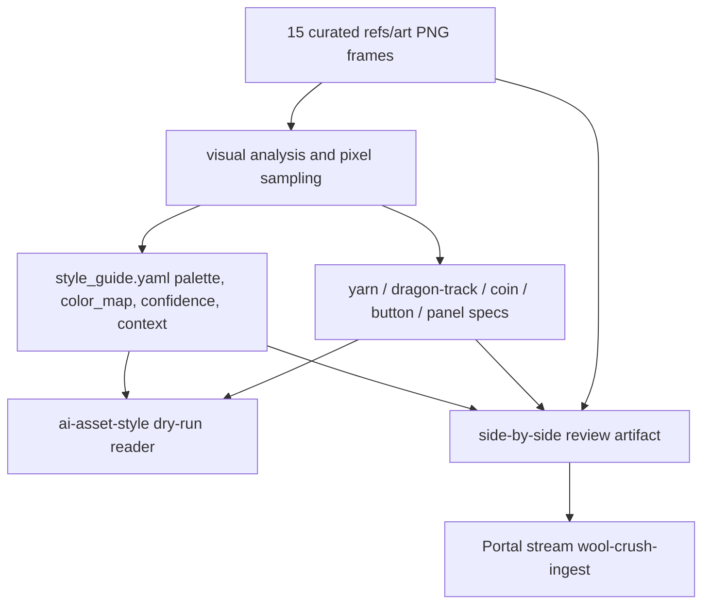

# Wool Crush AI Asset Style Guide Analyzer - Plan

## Goal Capsule

**Objective.** Analyze the 15 curated Wool Crush reference frames in `games/wool_crush/refs/art/*.png` and author a real `ai_asset` input bundle under `games/wool_crush/design/ai-asset/` that the design-sheets `ai-asset-style` ingester validates.

**Authority.** Trello card b1Fw4Zmt is the source of truth. The real ingestion contract is `design-sheets/ingesters/ai-asset-style/lib/read-guide.mjs`, not the vendored schema files under `design-sheets/ingesters/ai-asset-style/vendor/schema/`.

**Execution profile.** This is a design-input artifact task: write YAML files, derive palette values from existing PNG pixels, produce a review artifact, and run the design-sheets ingester dry-run. Do not amend a sheet with `--sheet`, do not edit generated files in `games/wool_crush/design/{tokens.css,copy.ts,assets.ts}`, and do not open a pull request.

**Stop condition.** Stop and surface a blocker if the real ingester requires a contract change, if sampled frame colors cannot be traced back to the PNGs, or if producing the Portal review post requires credentials or a CLI that is absent in the worker environment.

**Tail ownership.** The next TWF worker implements this plan and advances through the Worked stage. The conductor owns landing and the later real sheet scaffold/amend step described on the card.

---

## Product Contract

### Problem Frame

Wool Crush has 15 selected reference frames, but the missing middle of the asset pipeline is the analyzer output that converts those frames into a style guide and asset specs. The design-sheets importer only validates a narrow runtime contract: a YAML mapping with a required `palette` block, optional `color_map`, optional numeric `confidence`, and sibling asset specs whose `style_ref` byte-matches the guide basename.

The implementation must therefore produce files for the real importer rather than chasing the broader vendored `ai_asset` schema. Palette values must be sampled from the PNGs so future reviewers can verify they came from the frames, while mood/style text remains contextual support for asset generation.

### Requirements

**Ingester contract**

- R1. Create `games/wool_crush/design/ai-asset/style_guide.yaml` as a YAML mapping with a required `palette` mapping of role names to lists of quoted lowercase `"#rrggbb"` strings.
- R2. Use only fields accepted by the real importer as pass-through context; do not rely on the vendored schema being loaded or enforced.
- R3. Include optional `color_map` only as the same role-to-hex-list shape as `palette`.
- R4. Include `confidence` values only as floats in the inclusive range `0..1`.
- R5. Create sibling `*_spec.yaml` files whose `style_ref` value exactly equals `style_guide.yaml`.
- R6. Every asset-producing spec must have a non-empty `type` or `name` and all slugified asset IDs must be unique.

**Frame analysis**

- R7. Analyze all 15 files listed in `games/wool_crush/refs/art/extracted.json`; do not silently omit menu, gameplay, win, settings, other, or fail frames.
- R8. Sample palette hexes from the actual PNG pixels and record enough source evidence for reviewers to spot-check the sampled frame and surface.
- R9. Assign honest confidence values per visual group, with lower confidence for mixed, obscured, or state-specific assets.
- R10. Capture the visible style language: soft yarn/fiber balls, saturated candy colors, polished gold coin surfaces, rounded purple/pink panels and buttons, dragon/track elements, mobile safe-area composition, and bright puzzle-game lighting.

**Output and review**

- R11. Place all new source artifacts under `games/wool_crush/design/ai-asset/`.
- R12. Cover the key assets visible in the frames with specs: yarn balls, dragon or track elements, coins, buttons, and panels.
- R13. Produce a visual side-by-side review artifact comparing selected frames with extracted swatches and spec names, then post it to the `wool-crush-ingest` Portal stream per silence-is-approval.
- R14. Flag low-confidence palette or asset groups in the guide and in the Portal post.
- R15. Prove the bundle with the dry-run command `node ~/dev/appletolye/design-sheets/ingesters/ai-asset-style/run.mjs --guide games/wool_crush/design/ai-asset/` and paste the output into the card handoff.

### Scope Boundaries

**In scope**

- `games/wool_crush/design/ai-asset/style_guide.yaml`.
- `games/wool_crush/design/ai-asset/*_spec.yaml` for the visible asset families.
- A local review artifact under `games/wool_crush/design/ai-asset/` if needed to make the Portal side-by-side durable.
- A Portal post to the `wool-crush-ingest` stream when the configured Portal tooling is available.

**Out of scope**

- Editing `games/wool_crush/design/tokens.css`, `games/wool_crush/design/copy.ts`, `games/wool_crush/design/assets.ts`, or generated design asset bindings by hand.
- Running `ingesters/ai-asset-style/run.mjs` with `--sheet`; the card reserves real sheet amendment for the conductor after landing.
- Changing `design-sheets/ingesters/ai-asset-style/**` or the vendored `ai_asset` schema.
- Producing final game art images from the specs.
- Browser or device verification of Wool Crush gameplay; this card validates design input files, not runtime UI.

### Acceptance Examples

- AE1. Given `style_guide.yaml` has `palette.yarn: ["#f66aa4", "#7ec7ff"]`, when the dry-run ingester reads the directory, then it reports `Palette candidates` without a palette-shape error.
- AE2. Given `coin_spec.yaml` has `style_ref: style_guide.yaml` and `type: coin`, when the ingester reads sibling specs, then `coin` appears in the `Asset specs:` output.
- AE3. Given `panel_spec.yaml` uses `style_ref: wool_style.yaml`, when the ingester dry-run executes, then it fails with an expected-style-ref error; the implementation must not leave such a mismatch.
- AE4. Given two specs slugify to the same asset ID, when the ingester dry-run executes, then it fails with `duplicate spec asset id`; the implementation must avoid duplicate `type` or `name` values.
- AE5. Given a palette color is used in the guide, when reviewers inspect the side-by-side artifact, then the color has a frame/source note showing which reference image or surface it came from.

---

## Planning Contract

### Key Technical Decisions

| ID | Decision | Rationale |
|---|---|---|
| KTD1 | Target the runtime reader in `design-sheets/ingesters/ai-asset-style/lib/read-guide.mjs`, not the vendored schemas. | The reader validates only `palette`, optional `color_map`, optional `confidence`, and sibling spec `style_ref`/`type` or `name`; schema-only fields are pass-through context and cannot be trusted as acceptance criteria. |
| KTD2 | Keep guide and spec files in `games/wool_crush/design/ai-asset/`. | The card names this directory, and the ingester accepts either a directory containing `style_guide.yaml` or the guide file itself. |
| KTD3 | Record palette evidence alongside the guide rather than relying on memory or prose. | Palette values must be verifiably sampled from frames; source notes make the dry-run proof and Portal review auditable without redoing the entire visual pass. |
| KTD4 | Use separate spec files for asset families instead of one omnibus spec. | The ingester creates one spec-only asset entry per sibling `*_spec.yaml`; separate files produce clear unique IDs for yarn balls, coins, buttons, panels, and dragon or track art. |
| KTD5 | Make the Portal review post a review artifact, not a gate that mutates repo state. | The card asks for silence-is-approval visibility. Missing Portal credentials should be surfaced as a blocker or fallback note, but the repo artifact and dry-run remain the deterministic proof. |

### High-Level Technical Design

### Assumptions

- `games/wool_crush/refs/art/extracted.json` is the authoritative list of the 15 curated frames named on the card.
- Extra top-level context fields in `style_guide.yaml` are acceptable because `read-guide.mjs` validates only the consumed fields and passes the rest through to the candidate card.
- The Portal CLI or equivalent posting mechanism may not be available in every worker sandbox; if it is unavailable, the worker should leave the local side-by-side artifact path and the exact missing command/config in the handoff.
- Hexes should be lowercase and quoted because unquoted YAML `#` begins a comment.

### Sources and Research

- `design-sheets/ingesters/ai-asset-style/lib/read-guide.mjs` requires a YAML mapping, validates `palette` as role-to-hex-list, validates optional `color_map`, validates `confidence.*` as numbers in `0..1`, skips specs with no `style_ref`, and rejects mismatched `style_ref` or duplicate slugified asset IDs.
- `design-sheets/ingesters/ai-asset-style/run.mjs` prints a dry-run summary and writes nothing when `--sheet` is omitted.
- `design-sheets/ingesters/ai-asset-style/README.md` states that the importer amends only its own card and spec-only asset entries when run with `--sheet`; this card must not run that real amendment.
- `design-sheets/tests/ai-asset-ingester.test.js` covers dry-run behavior, lowercase palette normalization in the emitted card, skip behavior for specs with no `style_ref`, style-ref failures, malformed hex failures, and duplicate or invalid spec surfaces.
- `games/wool_crush/design/README.md` marks `tokens.css`, `copy.ts`, and `assets.ts` as generated, git-committed outputs that must not be hand-edited.
- `games/wool_crush/refs/art/extracted.json` lists the 15 frame files and their state labels.

---

## Implementation Units

### U1. Sample and Record Frame Palette Evidence

- **Goal:** Derive a compact, verifiable palette from the 15 reference frames.
- **Requirements:** R7, R8, R9, R10, R14.
- **Dependencies:** None.
- **Files:** `games/wool_crush/refs/art/extracted.json`, `games/wool_crush/refs/art/*.png`, `games/wool_crush/design/ai-asset/style_guide.yaml`, `games/wool_crush/design/ai-asset/palette_evidence.yaml` if a separate evidence file keeps the guide readable.
- **Approach:** Inspect every curated frame and group recurring colors by visual role: yarn colors, board/track, panels, buttons, coin/gold, dragon/character, text/highlight, shadows, and backgrounds. Sample hex values directly from PNG pixels using an eyedropper, ImageMagick, or another deterministic pixel tool, then record each kept hex with the source frame and visual surface. Prefer representative game colors over compression artifacts, highlights, and transient overlays. Keep evidence concise enough that a reviewer can spot-check the source but not so large that it becomes a pixel dump.
- **Patterns to follow:** `games/wool_crush/refs/art/extracted.json` for the frame list; `design-sheets/ingesters/ai-asset-style/vendor/examples/settings_screen/style_guide.yaml` for readable guide organization, while ignoring its schema-only authority.
- **Test scenarios:** Each palette role in the guide has at least one sampled source note; every state group in `extracted.json` is inspected; low-confidence colors from mixed or obscured frames are labeled with lower confidence instead of being presented as certain.
- **Verification:** The worker can name the sampled source frame for every palette hex in `style_guide.yaml`, and the side-by-side review artifact displays representative swatches next to the frames.

### U2. Author the Runtime-Compatible Style Guide

- **Goal:** Write `style_guide.yaml` so the real reader accepts it and the imported candidate card carries useful design context.
- **Requirements:** R1, R2, R3, R4, R9, R10, R11, R14.
- **Dependencies:** U1.
- **Files:** `games/wool_crush/design/ai-asset/style_guide.yaml`.
- **Approach:** Create a YAML mapping with `version`, context fields, required `palette`, optional `color_map`, and `confidence`. Keep `palette` and `color_map` values as lists of quoted lowercase hex strings. Use role names that describe Wool Crush surfaces, such as `yarn`, `board`, `panel`, `button`, `coin`, `dragon`, `text`, `highlight`, `shadow`, and `background`. Add mood/style context only as pass-through fields for readers and the later synthesizer; avoid treating schema-only sections as validation requirements.
- **Patterns to follow:** The runtime validation in `design-sheets/ingesters/ai-asset-style/lib/read-guide.mjs`; the pass-through card rendering in `design-sheets/ingesters/ai-asset-style/lib/amend-sheet.mjs`.
- **Test scenarios:** A missing `palette` block fails in local checking before handoff; a malformed hex such as `blue` fails before handoff; every `confidence` value is numeric and between `0` and `1`; the guide remains valid if optional context fields are ignored by the reader.
- **Verification:** `node ~/dev/appletolye/design-sheets/ingesters/ai-asset-style/run.mjs --guide games/wool_crush/design/ai-asset/` reports the expected palette role count without validation errors.

### U3. Write Per-Asset Specs for Visible Families

- **Goal:** Create sibling specs that the ingester exposes as spec-only asset entries for the key Wool Crush art families.
- **Requirements:** R5, R6, R11, R12.
- **Dependencies:** U2.
- **Files:** `games/wool_crush/design/ai-asset/yarn_ball_spec.yaml`, `games/wool_crush/design/ai-asset/dragon_track_spec.yaml`, `games/wool_crush/design/ai-asset/coin_spec.yaml`, `games/wool_crush/design/ai-asset/button_spec.yaml`, `games/wool_crush/design/ai-asset/panel_spec.yaml`, plus any additional `*_spec.yaml` that a clearly visible frame asset justifies.
- **Approach:** Give each spec a unique, slug-safe `type` value and `style_ref: style_guide.yaml`. Describe aspect, silhouette, material, palette roles, states, and negative prompts in plain YAML fields that help later image generation, while remembering that the real ingester only consumes the spec identity and copies the rest as source material. Do not create two specs with labels that slugify to the same ID.
- **Patterns to follow:** `design-sheets/ingesters/ai-asset-style/vendor/examples/settings_screen/asset_spec.yaml` for broad shape; `design-sheets/ingesters/ai-asset-style/lib/read-guide.mjs` for the actual `style_ref` and slug rules.
- **Test scenarios:** Every asset-producing spec has `style_ref: style_guide.yaml`; every spec has a non-empty `type`; the dry-run `Asset specs:` list contains all intended IDs exactly once; no layout-only helper file accidentally uses `_spec.yaml` without a valid `style_ref`.
- **Verification:** The dry-run command lists all expected asset IDs, including yarn, dragon/track, coin, button, and panel specs.

### U4. Build and Post the Visual Review Artifact

- **Goal:** Make the analyzer output reviewable by showing selected frames, extracted swatches, and spec coverage together.
- **Requirements:** R8, R13, R14.
- **Dependencies:** U1, U2, U3.
- **Files:** `games/wool_crush/design/ai-asset/review.html` or another small artifact under `games/wool_crush/design/ai-asset/` if a committed review page is the simplest durable format.
- **Approach:** Create a side-by-side view with representative frame thumbnails, palette swatches grouped by role, the sampled source notes, the spec file names, and a short low-confidence callout. Post the artifact or screenshot to the `wool-crush-ingest` Portal stream. If the Portal CLI/config is unavailable, leave the local artifact committed and record the exact Portal blocker in the card handoff instead of pretending the review was posted.
- **Patterns to follow:** The Portal posting recipe in `tools/video-refs/README.md` for CLI shape, while keeping this artifact non-interactive; project guidance favoring self-contained HTML for human-facing artifacts.
- **Test scenarios:** The review artifact renders without external assets missing; every palette role from `style_guide.yaml` appears; every spec file is listed; low-confidence groups are visually called out; the Portal post names the review as silence-is-approval for `wool-crush-ingest`.
- **Verification:** The worker records either the Portal post URL/output or a clear unavailable-Portal reason plus the local review artifact path.

### U5. Run Real Ingester Dry-Run and Close Out

- **Goal:** Prove the output bundle satisfies the real design-sheets importer without mutating any sheet.
- **Requirements:** R1, R3, R4, R5, R6, R15.
- **Dependencies:** U2, U3.
- **Files:** `games/wool_crush/design/ai-asset/**`, card handoff comment.
- **Approach:** Run the exact dry-run command from the card from this repo root. Confirm the output names the guide path, palette roles, optional color map surfaces, all asset specs, and `Dry run: no --sheet given, nothing written`. Fix any validation failure in the YAML bundle before handoff. Paste the command output in the TWF handoff so the next stages do not have to trust a summary.
- **Patterns to follow:** `design-sheets/tests/ai-asset-ingester.test.js` dry-run expectations.
- **Test scenarios:** Dry-run fails if `style_guide.yaml` is missing; dry-run fails if a spec has a mismatched `style_ref`; dry-run fails if two specs share a slug; the final committed bundle passes the dry-run.
- **Verification:** The handoff includes the dry-run stdout and any Portal post output or blocker.

---

## Verification Contract

| Gate | Command or Evidence | Proves |
|---|---|---|
| Scope check | `git diff --name-only` | The implementation only adds or edits the plan-authorized `games/wool_crush/design/ai-asset/**` files unless a documented review artifact requires another path. |
| Real ingester dry-run | `node ~/dev/appletolye/design-sheets/ingesters/ai-asset-style/run.mjs --guide games/wool_crush/design/ai-asset/` | The guide and sibling specs satisfy `read-guide.mjs`; no sheet is mutated because `--sheet` is omitted. |
| Palette provenance | Side-by-side review artifact plus source notes in the guide or evidence file | Palette hexes are sampled from actual frames and low-confidence groups are visible. |
| Portal review | Portal post output or URL for stream `wool-crush-ingest` | The visual side-by-side was posted for silence-is-approval review. |
| Non-mutation fence | Dry-run output includes `Dry run: no --sheet given, nothing written` | The worker did not run the real sheet amendment reserved for the conductor. |

---

## Definition of Done

- `games/wool_crush/design/ai-asset/style_guide.yaml` exists and has a valid required `palette` mapping.
- Palette and `color_map` hexes are quoted lowercase `"#rrggbb"` values sampled from `games/wool_crush/refs/art/*.png`.
- Confidence values are honest floats in `0..1`, and low-confidence groups are called out.
- At least the yarn ball, dragon or track, coin, button, and panel asset families have unique sibling `*_spec.yaml` files with `style_ref: style_guide.yaml`.
- The real ingester dry-run passes and its stdout is pasted into the TWF handoff.
- A visual side-by-side artifact exists and is posted to `wool-crush-ingest`, or the exact Portal blocker is recorded with the artifact path.
- No generated design files in `games/wool_crush/design/` are hand-edited.
- No design-sheets source files, vendored schemas, PRs, merges, or real sheet amendments are introduced by this card.
