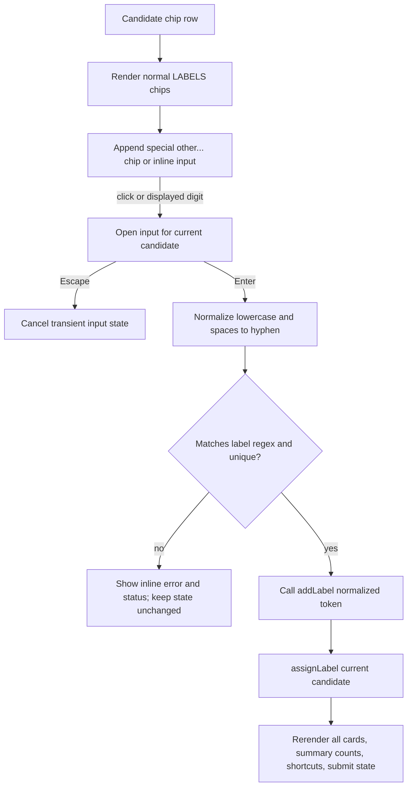

# Other Chip Inline Text - Plan

## Goal Capsule

- **Objective:** Replace the terminal default `other` label bucket in the generated video-refs picker with a per-card `other...` chip that opens an inline text input and mints a normal global tag.
- **Authority:** Trello card `fEdbSODs` is the source of truth. The current baseline already has configurable labels, runtime add-label machinery, at-rest review, and real-density picker verification expectations from the prior video-refs work.
- **Execution profile:** Bounded generated-picker and documentation work in `tools/video-refs`; no PR, merge, mobile-device proof, or changes outside the requested video-refs files.
- **Scope fence:** Touch only `tools/video-refs/src/build-view.mjs`, `tools/video-refs/test/video-refs.test.mjs`, and `tools/video-refs/README.md`. Use scratch `.work/fEdbSODs-video-refs/` only for untracked verification artifacts if the implementation worker can run Playwright.
- **Stop condition:** Stop and surface a blocker if the implementation cannot preserve the existing `--labels` and `candidates.json.labels` contracts, or if real-density Playwright verification cannot be prepared with a 57+ candidate fixture or a documented equivalent.

---

## Product Contract

### Summary

The picker no longer treats `other` as a normal terminal category in the default label set. Each candidate card instead appends a special `other...` chip after the normal labels. Activating that chip on a card turns it into an inline input; a valid submitted name becomes a normal global label, appears on every card and in summary counts, and is assigned to the current candidate.

### Problem Frame

The current baseline still ships `DEFAULT_LABELS = ['menu', 'level', 'settings', 'pause', 'win', 'fail', 'gameplay', 'other']` and exposes runtime label creation through a header `+ label` button backed by `window.prompt('New label')`. That makes `other` a destination bucket instead of a path to a precise state name, and it hides label minting away from the card where the reviewer discovered the missing tag.

### Requirements

**Default Labels and Existing Contracts**

- R1. Drop `other` from `DEFAULT_LABELS` while keeping the remaining default labels in their current order.
- R2. Preserve the `--labels` and `candidates.json.labels` contracts: validation, duplicate handling, CLI precedence, and unknown-candidate fallback behavior remain unchanged.
- R3. Do not introduce a separate terminal `other` count or submit value from the special chip; only reviewer-entered names become real labels.

**Per-Card Inline Other Flow**

- R4. Every candidate card chip row ends with a special `other...` chip that is not part of the global label array until the reviewer submits a valid name.
- R5. Clicking the special chip opens an inline text input on that same card, focused and associated with the current candidate.
- R6. Pressing the displayed number key for the special chip opens the same inline input when a single-digit shortcut is available.
- R7. Enter normalizes the input by lowercasing and converting whitespace runs to `-`, then validates the normalized value against `/^[a-z][a-z0-9_-]*$/`.
- R8. A valid submitted value is added through the existing runtime add-label machinery, appears as a normal chip on every card and in header summary counts, and is assigned to the current candidate.
- R9. Invalid input is rejected visibly without mutating labels or the current candidate assignment.
- R10. Escape cancels the inline input without mutating labels or the current candidate assignment.

**UI Surface and Payload**

- R11. Remove the header `+ label` button as a minting path so label discovery happens from the card-level `other...` chip only.
- R12. Runtime-created labels submit exactly like configured labels in the existing verdict payload; no new payload field is introduced.
- R13. Existing at-rest, keep/drop, timeline, summary, confirmation reset, and submit behavior continue to work when labels are minted inline.

**Verification and Documentation**

- R14. Tests cover the default labels without `other`, inline input open/Enter/Escape behavior, invalid rejection, global chip/count rerendering, assignment to the current candidate, keyboard activation, and submitted payload labels.
- R15. README guidance describes `other...` as the runtime-label discovery path, including normalization, validation, Enter, Escape, and the removal of the header `+ label` prompt.
- R16. Real-density Playwright verification at `1440x900` exercises the card-specified flow: click `other...`, type `boss_intro`, Enter, verify global chips and header count, submit payload with the new label, invalid rejection, and Escape cancellation.

### Acceptance Examples

- AE1. Given the picker is built without `--labels` or `candidates.json.labels`, when it loads, then the default global labels are `menu`, `level`, `settings`, `pause`, `win`, `fail`, and `gameplay`, and each card also shows a non-global `other...` chip.
- AE2. Given the focused card has the `other...` chip's displayed number shortcut, when the reviewer presses that number, then an inline input opens on that card.
- AE3. Given the inline input contains `Boss Intro`, when the reviewer presses Enter, then `boss-intro` is created globally, every card renders a normal `boss-intro` chip, the header summary includes `boss-intro`, and the focused candidate is assigned to `boss-intro`.
- AE4. Given the inline input contains `boss_intro`, when the reviewer presses Enter and submits, then the POST payload carries `label: "boss_intro"` for the current candidate.
- AE5. Given the inline input contains `123 bad`, when the reviewer presses Enter, then the UI shows a validation error and no new chip or assignment is created.
- AE6. Given the inline input is open with unsaved text, when the reviewer presses Escape, then the input closes and the candidate keeps its prior label.

### Scope Boundaries

**In scope**

- `tools/video-refs/src/build-view.mjs`
- `tools/video-refs/test/video-refs.test.mjs`
- `tools/video-refs/README.md`
- `.work/fEdbSODs-video-refs/` for untracked generated picker HTML, Playwright scripts, screenshots, and captured payloads

**Out of scope**

- No changes to `tools/video-refs/run.mjs`, `extract.mjs`, `fold.mjs`, `suggest.mjs`, `time.mjs`, game assets, game manifests, Portal APIs, or mobile-game verification.
- No new dependency for the inline input behavior.
- No AI/model-assisted label naming, autocomplete, or persistence beyond the generated picker's existing runtime state and POST payload.
- No rejection of caller-provided custom labels that happen to be named `other`; the requested contract change is to remove the default terminal bucket and use a special card-level minting affordance.

---

## Planning Contract

### Key Technical Decisions

- KTD1. Remove the header `+ label` button. The card names the `other...` chip as the replacement discovery path, and retaining the prompt-based header control would leave two competing minting experiences to test and explain.
- KTD2. Reuse `addLabel()` as the only global mutation path. The current function already validates uniqueness, pushes into `LABELS`, rerenders chips, summary counts, shortcuts, and resets confirmation; the inline flow should call through it rather than duplicate label-state logic.
- KTD3. Track inline editing as transient UI state keyed to the candidate. A small `state.otherInputForId` plus draft/error fields keeps the special chip local to one card and lets `renderRail()` rebuild the DOM without losing the intended open/cancel semantics.
- KTD4. Normalize before validation. The reviewer-facing contract says lowercase and spaces-to-hyphens are accepted input conveniences; validation should run on the normalized token so `Boss Intro` succeeds as `boss-intro`.
- KTD5. Preserve the existing single-digit shortcut ceiling. Normal labels keep keys `1` through `9` where available; the special `other...` chip receives the next displayed digit only when one exists. If more labels leave no digit, clicking remains the activation path and the UI must not display a false shortcut.

### High-Level Technical Design

The diagram is directional: implementation can choose exact state field names and DOM structure, but the mutation order matters. A new tag must be added globally before assigning it to the current candidate so all chips and counts share the same `LABELS` source of truth.

### Assumptions

- The plan is executed on the current baseline where runtime labels and at-rest payload handling have already landed.
- The existing Happy DOM test style can observe inline input behavior without requiring a full browser for every case; Playwright remains required for the real-density proof.
- `boss_intro` is intentionally valid because underscores are already permitted by the label regex.
- Scratch verification artifacts stay untracked under `.work/fEdbSODs-video-refs/`; the committed diff remains limited to the three requested files.

### Sources and Research

- `tools/video-refs/src/build-view.mjs` defines `DEFAULT_LABELS`, `LABEL_TOKEN_RE`, `addLabel()`, `makeChips()`, `renderSummary()`, `renderShortcutHints()`, keyboard digit handling, and submit payload mapping.
- `tools/video-refs/test/video-refs.test.mjs` already has structural generated-HTML assertions and a Happy DOM flow for runtime add-label, at-rest flip, and submit payload.
- `tools/video-refs/README.md` currently documents the default label list with `other` and the header `+ label` runtime creation path.
- `docs/plans/2026-07-09-004-feat-video-refs-labels-atrest-plan.md` is the immediate prior plan for configurable labels, runtime add-label, and real-density picker verification expectations.

---

## Implementation Units

### U1. Replace Default Other Bucket With Per-Card Other Chip

- **Goal:** Remove the default terminal `other` label while rendering a special per-card `other...` chip after the normal label chips.
- **Requirements:** R1, R2, R3, R4, R6, R11, AE1, AE2.
- **Dependencies:** None.
- **Files:** `tools/video-refs/src/build-view.mjs`, `tools/video-refs/test/video-refs.test.mjs`, `tools/video-refs/README.md`.
- **Approach:** Change `DEFAULT_LABELS` to omit `other`. Keep `normalizeLabels()` and `resolveLabels()` behavior otherwise unchanged. Update `makeChips()` so it renders normal label chips from `LABELS` and then appends a special `other...` control that is not counted as a label. Derive the special chip's shortcut from the next available single digit after normal labels, and omit the visual key when no digit exists.
- **Patterns to follow:** Existing `makeChips()`, `shortcutKeyForIndex()`, `renderShortcutKeyRange()`, and structural regex tests in `video-refs.test.mjs`.
- **Test scenarios:** Default generated model labels exclude `other`; generated cards include a special `other...` chip after normal chips; summary counts do not include `other` before a reviewer-created label; `--labels menu,gameplay,shop` still produces those exact normal labels plus the special chip; invalid and duplicate configured labels still fail with the existing errors; digit shortcuts for normal labels still work.
- **Verification:** The generated HTML structural tests prove the default model and chip rendering changed without altering configured label parsing or candidate fallback behavior.

### U2. Implement Inline Text Minting and Assignment

- **Goal:** Turn the special `other...` chip into an inline input that mints a global label and assigns it to the current candidate.
- **Requirements:** R5, R7, R8, R9, R10, R12, R13, AE2, AE3, AE4, AE5, AE6.
- **Dependencies:** U1.
- **Files:** `tools/video-refs/src/build-view.mjs`, `tools/video-refs/test/video-refs.test.mjs`.
- **Approach:** Add transient generated-picker state for the open inline input, draft value, and validation message. Clicking the special chip or pressing its displayed shortcut opens and focuses an input on that card. Enter normalizes the draft by trimming, lowercasing, and replacing whitespace runs with `-`; successful validation calls `addLabel(normalized)` and then `assignLabel(currentMarker, normalized)`. Invalid or duplicate values keep the input open, show a visible card-local error and status message, and do not mutate `LABELS` or candidate state. Escape clears the transient input state and rerenders the card without changing labels.
- **Patterns to follow:** Existing `addLabel()`, `assignLabel()`, `setStatus()`, `resetConfirm()`, `render(false)`, and generated keyboard listener patterns. Keep DOM creation with `document.createElement()` and text nodes rather than string-building untrusted input.
- **Test scenarios:** Clicking `other...` opens one focused inline input on the clicked card; pressing the special chip's displayed number key opens the same input for the focused card; entering `Boss Intro` creates `boss-intro`, assigns it to that card, rerenders every card with a `boss-intro` normal chip, updates summary counts, and resets confirmation if needed; entering `boss_intro` submits that exact valid token; entering `123 bad` or a duplicate label shows an error without adding a chip or changing the candidate label; Escape cancels an open input and preserves the previous assignment.
- **Verification:** Happy DOM tests execute the generated script through click, keyboard, Enter, invalid input, Escape, and submit flows, with assertions on DOM chips, summary counts, focused candidate label, status/error text, and captured POST payload.

### U3. Remove Prompt-Based Header Add-Label UI and Update Documentation

- **Goal:** Make the card-level `other...` chip the only documented runtime label creation path.
- **Requirements:** R11, R15.
- **Dependencies:** U1, U2.
- **Files:** `tools/video-refs/src/build-view.mjs`, `tools/video-refs/test/video-refs.test.mjs`, `tools/video-refs/README.md`.
- **Approach:** Delete the `button.add-label#add-label` header control and its `window.prompt('New label')` listener. Keep the underlying `addLabel()` helper because U2 uses it as the global mutation path. Update README text to list default labels without `other`, explain the `other...` chip, document normalization and validation, and describe Enter/Escape behavior.
- **Patterns to follow:** Existing README `build-view` section and tests that assert generated markup and runtime add-label behavior.
- **Test scenarios:** Generated HTML no longer contains `#add-label` or `window.prompt('New label')`; README no longer documents `+ label` and instead documents `other...`; tests still prove runtime labels can be created through the inline flow.
- **Verification:** Structural tests and README diff show the obsolete discovery path was removed without deleting the shared helper needed by inline minting.

### U4. Prove the Real-Density Picker Flow

- **Goal:** Verify the inline `other...` behavior in the generated picker's real desktop Portal surface at the density required by the card.
- **Requirements:** R14, R16, AE3, AE4, AE5, AE6.
- **Dependencies:** U1, U2, U3.
- **Files:** `tools/video-refs/test/video-refs.test.mjs`, `.work/fEdbSODs-video-refs/`.
- **Approach:** Reuse or author a Playwright verification script under `.work/fEdbSODs-video-refs/` that serves a generated picker through a Portal-like stub at `1440x900`. Prefer a 57+ candidate source; if unavailable, create a documented dozens-of-candidates fallback from existing fixture generation. The script should click a card's `other...` chip, type `boss_intro`, press Enter, assert the new normal chip appears on all cards and in summary counts, submit to the stub, capture the payload, then separately verify invalid input rejection and Escape cancellation.
- **Patterns to follow:** Prior `.work/<card>-video-refs/` picker verification pattern from related video-refs cards and the README requirement that generated picker UI changes get realistic Playwright screenshots.
- **Test scenarios:** A screenshot after adding `boss_intro` shows the inline-created chip at real density; payload JSON contains the current candidate with `label: "boss_intro"`; invalid entry produces visible rejection and no payload/tag mutation; Escape closes an input without mutation; the page still supports at-rest and submit confirmation state.
- **Verification:** Handoff records the exact `node --test tools/video-refs/test/` result, the real-density build command, screenshot paths, payload path, and whether the fixture had 57+ real candidates or a documented fallback. If the sandbox cannot launch the browser, the worker should leave the fixture and script paths plus the exact conductor repro command.

---

## Verification Contract

| Gate | Command or Evidence | Proves |
|---|---|---|
| Video refs tests | `node --test tools/video-refs/test/` | Default label removal, inline other flow, validation, cancellation, global chip/count rerendering, payload assignment, and existing video-refs coverage still pass. |
| Scope audit | `git diff --name-only` | Implementation source edits are limited to `tools/video-refs/src/build-view.mjs`, `tools/video-refs/test/video-refs.test.mjs`, and `tools/video-refs/README.md`, aside from this plan artifact and untracked `.work` proof files. |
| Real-density picker build | Generated picker under `.work/fEdbSODs-video-refs/` from a 57+ candidate source or documented dozens-of-candidates fallback | The UI is evaluated at the density required by the card instead of the tiny unit fixture only. |
| Playwright interaction at `1440x900` | Screenshots plus captured POST payload under `.work/fEdbSODs-video-refs/` | Click `other...`, type `boss_intro`, Enter, invalid rejection, Escape cancellation, global chips/counts, assignment, and payload behavior work in the real generated picker surface. |
| Documentation check | README diff plus tests that assert obsolete markup is gone | The documented runtime-label path matches the implemented per-card inline flow and no longer advertises the header prompt. |

---

## Definition of Done

- `DEFAULT_LABELS` is `menu`, `level`, `settings`, `pause`, `win`, `fail`, and `gameplay`; it no longer contains `other`.
- The `--labels` and `candidates.json.labels` contracts remain unchanged.
- Every candidate card renders a special `other...` chip after normal label chips.
- Clicking `other...` or pressing its displayed number key opens an inline input on that card.
- Enter normalizes lowercasing and spaces-to-hyphens, validates `/^[a-z][a-z0-9_-]*$/`, adds a valid tag globally, and assigns it to the current candidate.
- Invalid input is rejected visibly without mutating labels or assignments.
- Escape cancels the inline input without mutating labels or assignments.
- Runtime-created tags appear as normal chips on every card, appear in header summary counts, and submit in payload frames exactly like configured labels.
- The header `+ label` button and prompt-based runtime label creation path are removed.
- `tools/video-refs/README.md` documents the default label change and the `other...` inline flow.
- `node --test tools/video-refs/test/` passes.
- Real-density Playwright verification at `1440x900` is captured or, if sandbox-blocked, a runnable fixture/script and exact repro command are left for the conductor.
- No pull request is opened, no merge is performed, and implementation source changes stay within the three requested source/doc/test files aside from this plan artifact.
