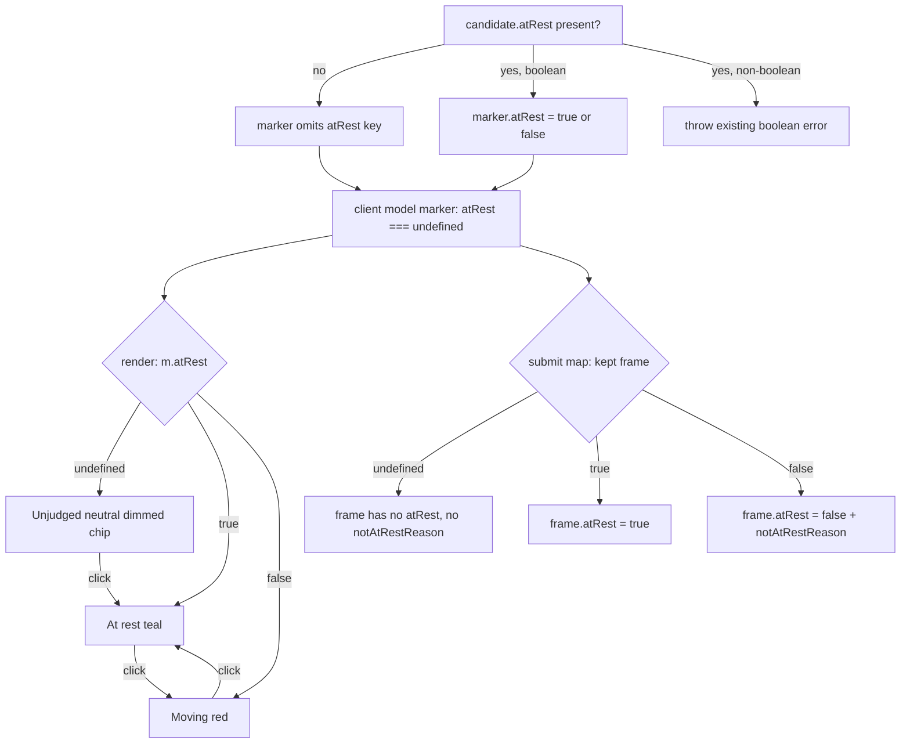

# Video-Refs At-Rest Three-State - Plan

## Goal Capsule

- **Objective:** Make the picker's at-rest indicator three-state — `true` ("At rest", teal), `false` ("Moving", red), and ABSENT ("Unjudged", subtle neutral/dimmed) — so unmarked candidates stop rendering a false red "Moving" claim, and make the submit payload carry `atRest` only when it was actually set.
- **Authority:** Trello card `qAGcXNCx` is the source of truth. Batu hit this live (picker v3 `req_f70386`): `suggest` emits no `atRest`, `build-view` currently defaults missing `atRest` to `false`, so all 76 candidates showed a loud red "Moving" badge — a false claim rendered 76 times that read as noise and confused the reviewer.
- **Execution profile:** Bounded generated-picker + test + documentation work in `tools/video-refs`. No PR, no merge, no changes to `extract.mjs`, `suggest.mjs`, `fold.mjs`, `run.mjs`, or `time.mjs`.
- **Scope fence:** Touch only `tools/video-refs/src/build-view.mjs`, `tools/video-refs/test/video-refs.test.mjs`, and `tools/video-refs/README.md`. Untracked verification artifacts go under `.work/qAGcXNCx-video-refs/`.
- **Stop condition:** Stop and surface a blocker if the change cannot preserve the extract/fold downstream contract (absent → at-rest `false` + `unjudged video frame` reason, handled by `extract.mjs`, which must not change), or if the picker's existing keep/drop, label, timeline, summary, and submit behavior cannot be preserved.

---

## Product Contract

### Summary

The picker's per-candidate at-rest control becomes three-state. An unjudged candidate (no `atRest` on the incoming payload) renders a subtle neutral "Unjudged" chip instead of a red "Moving" badge. Clicking the control cycles the candidate into judged states. The picker's generated server-side model and its submitted verdict payload carry `atRest` **only** for frames that are actually judged (human-set or producer-set); absent stays absent so the existing downstream `extract` behavior (treat absent as unjudged) is preserved unchanged.

### Problem Frame

`normalizeAtRest()` in `build-view.mjs` currently collapses a missing `atRest` to `false`, and every render path (`restbtn`, inspector `rest-state`) treats `!atRest` as "Moving" (red). Because the upstream `suggest` step emits no `atRest`, every suggested candidate is presented as a confident "Moving" claim. At real density (76 candidates) this is 76 false red badges — pure noise that undermines the reviewer's trust and hides the frames a human genuinely flagged as moving.

The fix keeps the payload honest: an unset `atRest` must round-trip as unset, not as a fabricated `false`. `extract.mjs` already treats absent as unjudged (at-rest `false` + `unjudged video frame` reason downstream, per P2-FOLD), so build-view must simply stop inventing a value.

### Requirements

**Model / Payload Contract**

- R1. `normalizeAtRest()` (or its replacement) must NOT default a missing `atRest` to `false`. When a candidate has no own `atRest` property, the generated server-side marker must omit `atRest` entirely (so `JSON.stringify` emits no key and the client model reads it as absent).
- R2. When a candidate has `atRest` present, it must still be validated as a boolean and preserved as `true` or `false`. A present-but-non-boolean `atRest` still throws the existing `candidate <index> atRest must be a boolean` error.
- R3. The submitted verdict payload must carry `atRest` for a kept frame ONLY when that frame is judged: `atRest: true` for at-rest, `atRest: false` (with `notAtRestReason`) for moving. An unjudged (absent) kept frame must submit with NO `atRest` and NO `notAtRestReason`.
- R4. The extract/fold downstream contract is unchanged: `extract.mjs` is not edited, and its existing "absent → at-rest false + `unjudged video frame` reason" handling remains the single source of the unjudged-downstream semantics.

**Render (three-state)**

- R5. The per-candidate at-rest control renders three visually distinct states: `true` → "At rest" (teal, existing `is-rest` style), `false` → "Moving" (red, existing style), absent → "Unjudged" (a subtle, neutral, dimmed chip — visually quieter than both judged states, not red).
- R6. The focused-candidate inspector `rest-state` element renders the same three states with matching visual treatment.
- R7. Accessibility: the toggle exposes its tri-state honestly (recommended `aria-pressed="true" | "false" | "mixed"`, or an equivalent accessible state), and the control's title/tooltip describes the current state and the next action.

**Cycle Interaction**

- R8. Clicking the at-rest control cycles the state. The chosen cycle (KTD1) is: absent → At rest (`true`) → Moving (`false`) → At rest (`true`) → Moving (`false`) → … i.e. the first click leaves "Unjudged" and lands on "At rest", and thereafter the control toggles between the two judged states and never returns to Unjudged.
- R9. Newly human-added frames (the "+ Add frame at playhead" affordance) start Unjudged (absent `atRest`), not "Moving" — the reviewer has not yet judged rest state (KTD2).
- R10. Every existing picker behavior — keep/drop, label assignment incl. inline `other`, timeline markers, summary counts, submit confirmation reset, focus/keyboard navigation — continues to work unchanged when a candidate is Unjudged.

**Verification and Documentation**

- R11. `tools/video-refs/test/video-refs.test.mjs` at-rest assertions are updated for: three-state render markup; the generated model omitting `atRest` for candidates without it (absent, not `false`); the submit payload omitting `atRest`/`notAtRestReason` for unjudged kept frames while still emitting them for judged frames; and the click cycle absent → true → false.
- R12. `tools/video-refs/README.md` at-rest note is updated to describe the three states, the absent="unjudged" neutral rendering, the click cycle, that new manual frames start unjudged, and that the payload omits `atRest` for unjudged frames (downstream extract treats absent as unjudged).
- R13. Verification: `node --test tools/video-refs/test/` passes; a real-density picker rebuild plus Playwright interaction proves the badge cycle and the payload-omits-unset contract. If the sandbox blocks browsers, the worker leaves the verify script + fixture under `.work/qAGcXNCx-video-refs/` and parks the live run for the conductor.

### Acceptance Examples

- AE1. Given a `candidates.json` where a candidate has no `atRest`, when the picker is built, then that candidate's generated marker has no `atRest` key and its card renders a neutral "Unjudged" chip (not red "Moving").
- AE2. Given a candidate with `atRest: false`, when the picker renders, then its card shows the red "Moving" state — the false-claim fix must not hide genuinely human-flagged moving frames.
- AE3. Given an Unjudged candidate, when the reviewer clicks its at-rest control once, then it shows "At rest" (teal); a second click shows "Moving" (red); a third click returns to "At rest"; it never returns to "Unjudged".
- AE4. Given an Unjudged kept frame is submitted, when the POST payload is built, then that frame object has no `atRest` and no `notAtRestReason` property.
- AE5. Given a judged at-rest kept frame and a judged moving kept frame are submitted, then the payload carries `atRest: true` (no reason) for the first and `atRest: false` with `notAtRestReason` for the second.
- AE6. Given the reviewer adds a frame at the playhead, then that new frame renders "Unjudged" until the reviewer clicks its at-rest control.

### Scope Boundaries

**In scope**
- `tools/video-refs/src/build-view.mjs`
- `tools/video-refs/test/video-refs.test.mjs`
- `tools/video-refs/README.md`
- `.work/qAGcXNCx-video-refs/` for untracked generated picker HTML, Playwright script, screenshots, and captured payloads

**Out of scope**
- No changes to `extract.mjs`, `suggest.mjs`, `fold.mjs`, `run.mjs`, `time.mjs`, or any game assets/manifests/Portal APIs.
- No change to the downstream unjudged semantics (`unjudged video frame` reason, at-rest false at extract) — that stays owned by `extract.mjs`.
- No change to `--labels` / `candidates.json.labels` handling, keep/drop, timeline, summary, or the inline `other` label flow beyond what three-state rendering requires.
- No new dependency; no persistence beyond the existing runtime state and POST payload.

---

## Planning Contract

### Key Technical Decisions

- KTD1. **Cycle = absent → true → false → true → …** The existing `toggleAtRest()` uses `m.atRest = !m.atRest`, and JS `!undefined === true`, `!true === false`, `!false === true`, so this exact cycle already falls out of the current toggle with no logic change: the first click on an absent value yields `true` (At rest), then it alternates true/false and never returns to absent. This is the least-surprising behavior: a reviewer sets a judgment and thereafter flips between the two real states; "Unjudged" is a starting condition, not a destination you cycle back into. The card explicitly delegated this choice — record it in the handoff.
- KTD2. **New manual frames start Unjudged (absent `atRest`).** The "+ Add frame at playhead" handler currently seeds `atRest: false`. Change it to omit `atRest` so a freshly added frame is honestly unjudged rather than falsely "Moving", matching the whole point of the card. The reviewer's first click then judges it (per KTD1).
- KTD3. **Absence is represented by property omission, not a sentinel.** The server model marker omits `atRest` when the candidate lacks it; `JSON.stringify` drops `undefined`/absent keys, so the client model naturally reads `m.atRest === undefined`. Client render/payload branches test `m.atRest === true` / `=== false` / else-absent. Do not introduce a `null` or string sentinel — omission keeps the payload contract clean and matches how `extract` already detects absence.
- KTD4. **Render branches on tri-state, not truthiness.** Every place that currently does `m.atRest ? 'At rest' : 'Moving'` (the `restbtn` and the inspector `rest-state`) must branch on the three cases. Add a neutral/dimmed CSS variant (e.g. `.restbtn.is-unjudged`, `.rest-state.is-unjudged`) that is quieter than both judged colors; keep the existing red base and teal `is-rest` for the judged states.
- KTD5. **Keep the payload map honest.** Replace `var frame = { …, atRest: m.atRest === true }; if (!frame.atRest) frame.notAtRestReason = …` with a branch: set `atRest: true` when judged at-rest; set `atRest: false` + `notAtRestReason` when judged moving; set neither when absent. This is the core of R3/R4 and prevents fabricating `false` for unjudged frames.

### High-Level Technical Design

The mutation order and omission semantics matter: the server must omit the key (not write `false`), and the client submit map must omit the key for absent state. Exact CSS class names and DOM structure are the implementer's choice provided the three states are visually distinct and the unjudged state is neutral/dimmed (not red).

### Assumptions

- Executed on the current baseline where configurable labels, the inline `other` chip, and at-rest review already landed.
- Happy DOM tests can observe three-state render, the click cycle, and the submit payload without a full browser for every case; Playwright remains the real-density proof.
- `suggest` emits candidates without `atRest`; the real-density fixture should reflect that (mostly-absent `atRest`) so the "Unjudged" rendering is exercised at density.
- Scratch verification artifacts stay untracked under `.work/qAGcXNCx-video-refs/`; the committed diff is limited to the three requested files plus this plan.

### Sources and Research

- `tools/video-refs/src/build-view.mjs`: `normalizeAtRest()` (L47-53) defaults absent → false; `readCandidates()` builds markers (L64-79); `.restbtn` CSS (L477-487) and `.rest-state` CSS (L320-330); `toggleAtRest()` (L762-766); `restbtn` render in `makeCard()` (L981-988); inspector `renderInspector()` rest-state (L1060-1061); "+ Add frame" seeds `atRest: false` (L1130-1143); submit payload map (L1173-1180).
- `tools/video-refs/test/video-refs.test.mjs`: render structural assertions L176 (`restbtn`) and L196 (payload map); model-omits assertion candidate-c at L288-295 (currently expects `['menu', false]` for the no-atRest candidate — must become absent); extract manifest test L200-261 exercises the downstream `unjudged video frame` reason and is owned by `extract.mjs` (do NOT change its expectations); happy-DOM submit flow L427-434.
- `tools/video-refs/README.md` L73-75, L142, L149-153: current at-rest note and the `unjudged video frame` downstream description.
- `docs/plans/2026-07-09-004-feat-video-refs-labels-atrest-plan.md` and `2026-07-09-005-feat-other-chip-inline-text-plan.md`: prior at-rest and inline-label work this builds on.

---

## Implementation Units

### U1. Stop Defaulting Absent At-Rest to False (Model + Payload)

- **Goal:** Absent `atRest` round-trips as absent through the generated server model and the submitted payload.
- **Requirements:** R1, R2, R3, R4, AE1, AE4, AE5.
- **Dependencies:** None.
- **Files:** `tools/video-refs/src/build-view.mjs`, `tools/video-refs/test/video-refs.test.mjs`.
- **Approach:** Replace `normalizeAtRest()`'s absent-→-false with omission: when `!Object.hasOwn(candidate, 'atRest')`, do not set `atRest` on the marker at all (validate + preserve boolean when present, still throwing on non-boolean). In `readCandidates()`, build the marker so it omits `atRest` when absent (e.g. conditionally assign, or spread a computed partial) rather than always writing a boolean. In the submit payload map, branch: judged-at-rest → `atRest: true`; judged-moving → `atRest: false` + `notAtRestReason`; absent → neither key.
- **Patterns to follow:** Existing `normalizeAtRest`, `readCandidates` marker construction, and the `NOT_AT_REST_REASON` usage.
- **Test scenarios:** A candidate without `atRest` produces a marker whose `atRest` is absent (update the L288-295 expectation from `false` to absent/`undefined`); a candidate with `atRest: false` still yields `false`; non-boolean still throws; submit payload omits `atRest`/`notAtRestReason` for an unjudged kept frame and emits them correctly for judged frames.
- **Verification:** Generated-model and happy-DOM payload assertions prove absence round-trips and the extract manifest test (unchanged) still passes.

### U2. Three-State Render and Cycle (Card + Inspector)

- **Goal:** Render Unjudged / At rest / Moving distinctly, cycle correctly on click, and start new manual frames Unjudged.
- **Requirements:** R5, R6, R7, R8, R9, R10, AE1, AE2, AE3, AE6.
- **Dependencies:** U1.
- **Files:** `tools/video-refs/src/build-view.mjs`, `tools/video-refs/test/video-refs.test.mjs`.
- **Approach:** Add a neutral/dimmed CSS variant for the unjudged state on both `.restbtn` and inspector `.rest-state`. Change the `restbtn` render in `makeCard()` and the inspector render to branch on `m.atRest === true` / `=== false` / else-unjudged for text ("At rest" / "Moving" / "Unjudged"), class, `title`, and `aria-pressed` (`true`/`false`/`mixed`). Leave `toggleAtRest()`'s `m.atRest = !m.atRest` as-is (it already yields absent→true→false→true per KTD1) — but confirm the render reads the resulting boolean correctly. Change the "+ Add frame at playhead" handler to omit `atRest` (unjudged) instead of `atRest: false`.
- **Patterns to follow:** Existing `restbtn` markup (L981-988), `renderInspector()` (L1045-1062), the `.is-rest` CSS convention, and the DOM-building style in `makeCard`.
- **Test scenarios:** An absent-atRest candidate card shows the neutral "Unjudged" text/class and NOT the red "Moving"; an `atRest: false` candidate still shows red "Moving"; clicking an unjudged control once → "At rest", twice → "Moving", thrice → "At rest" (never back to Unjudged); a newly added frame renders "Unjudged"; keep/drop, labels, summary, and submit still function with unjudged candidates present.
- **Verification:** Structural HTML assertions (updated L176 to the tri-state branch) plus happy-DOM click-cycle assertions on the rendered `.restbtn`.

### U3. Update Tests and README

- **Goal:** Lock the three-state contract in tests and document it.
- **Requirements:** R11, R12.
- **Dependencies:** U1, U2.
- **Files:** `tools/video-refs/test/video-refs.test.mjs`, `tools/video-refs/README.md`.
- **Approach:** Update the render structural assertion (L176) to the new tri-state branch and the payload structural assertion (L196) to the new omit-when-unset map. Update the generated-model expectation (L288-295) so the no-atRest candidate reads absent. Add/adjust happy-DOM assertions for the click cycle and the unjudged-omits-from-payload behavior. Do NOT change the extract manifest assertions (L200-261) — they validate `extract.mjs`, which stays. Update README's at-rest note (L73-75) and the payload example so absent means "unjudged", describe the three states + neutral rendering + click cycle + new-frames-start-unjudged, and keep the downstream `unjudged video frame` description accurate.
- **Patterns to follow:** Existing structural regex assertions, the happy-DOM flow test at L340-437, and the README at-rest section.
- **Test scenarios:** `node --test tools/video-refs/test/` passes with all updated at-rest assertions; README diff shows the three-state note and unchanged downstream description.
- **Verification:** Test run green; README diff reviewed.

### U4. Real-Density Rebuild + Playwright Proof

- **Goal:** Prove the badge cycle and payload-omits-unset in the real generated picker at density.
- **Requirements:** R13, AE1, AE3, AE4.
- **Dependencies:** U1, U2, U3.
- **Files:** `.work/qAGcXNCx-video-refs/` (untracked), `tools/video-refs/test/video-refs.test.mjs` if a fixture helper is reused.
- **Approach:** Build a picker from a real-density fixture (target ~57-76 candidates, mostly WITHOUT `atRest` so the Unjudged state dominates, mirroring the live `req_f70386` shape). Author/reuse a Playwright script under `.work/qAGcXNCx-video-refs/` at `1440x900` that: (a) screenshots the initial rail to confirm no red "Moving" flood — unjudged candidates render neutral; (b) clicks one candidate's at-rest control through Unjudged→At rest→Moving→At rest and screenshots each; (c) submits to a Portal-like stub and captures the payload, asserting unjudged kept frames omit `atRest`/`notAtRestReason` while judged frames include them.
- **Patterns to follow:** The prior `.work/<card>-video-refs/` Playwright verification pattern from related video-refs cards; the README real-density expectation.
- **Test scenarios:** Initial screenshot shows neutral unjudged chips (no red flood); cycle screenshots show the three distinct states; captured payload JSON confirms the omit-when-unset contract at density.
- **Verification:** Handoff records the exact `node --test` result, the build command, screenshot paths, the captured payload path, and the candidate count. If the sandbox cannot launch a browser, leave the script + fixture + exact conductor repro command and park the live run — do not claim device/browser proof that was not observed.

---

## Verification Contract

| Gate | Command or Evidence | Proves |
|---|---|---|
| Video refs tests | `node --test tools/video-refs/test/` | Three-state render, absent round-trips as absent in model + payload, click cycle, and unchanged extract/fold + existing coverage all pass. |
| Scope audit | `git diff --name-only` | Source edits limited to `tools/video-refs/src/build-view.mjs`, `tools/video-refs/test/video-refs.test.mjs`, `tools/video-refs/README.md`, aside from this plan and untracked `.work` proof files. |
| Real-density rebuild | Generated picker under `.work/qAGcXNCx-video-refs/` from a ~57-76 candidate, mostly-absent-atRest fixture | The Unjudged rendering is evaluated at the density that surfaced the live bug, not just the tiny unit fixture. |
| Playwright interaction at `1440x900` | Screenshots (initial + cycle) + captured POST payload under `.work/qAGcXNCx-video-refs/` | No red "Moving" flood on unjudged frames; the click cycle shows three distinct states; the payload omits `atRest`/`notAtRestReason` for unjudged kept frames and includes them for judged frames. |
| Downstream integrity | Extract manifest test (unchanged) still green; `extract.mjs` untouched in `git diff` | Absent → `unjudged video frame` downstream semantics remain owned by `extract`, unbroken. |

---

## Definition of Done

- `normalizeAtRest`/`readCandidates` no longer default a missing `atRest` to `false`; a candidate without `atRest` yields a marker with no `atRest` key.
- A present `atRest` is still validated as boolean and preserved; non-boolean still throws.
- The per-candidate control and the inspector render three distinct states: "At rest" (teal), "Moving" (red), "Unjudged" (neutral/dimmed), with honest `aria-pressed` (`true`/`false`/`mixed`) and descriptive titles.
- Clicking an unjudged control cycles absent → At rest → Moving → At rest → … and never returns to Unjudged.
- Newly added (+ Add frame) frames start Unjudged.
- The submit payload carries `atRest` (and `notAtRestReason` when moving) ONLY for judged kept frames; unjudged kept frames submit with neither key.
- `extract.mjs`, `suggest.mjs`, `fold.mjs`, `run.mjs`, `time.mjs` are unchanged; the `unjudged video frame` downstream behavior still passes its existing test.
- `tools/video-refs/test/video-refs.test.mjs` at-rest assertions updated for three-state render, absent-round-trips model, click cycle, and payload-omits-unset.
- `tools/video-refs/README.md` documents the three states, neutral unjudged rendering, click cycle, new-frames-start-unjudged, and payload omission.
- `node --test tools/video-refs/test/` passes.
- Real-density Playwright verification at `1440x900` is captured, or — if sandbox-blocked — a runnable fixture/script and exact repro command are left under `.work/qAGcXNCx-video-refs/` and the live run is parked for the conductor.
- No pull request is opened, no merge is performed, and source changes stay within the three requested files aside from this plan artifact.
