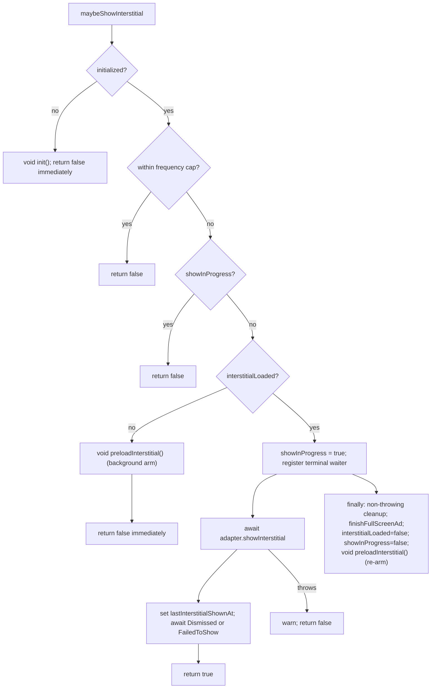
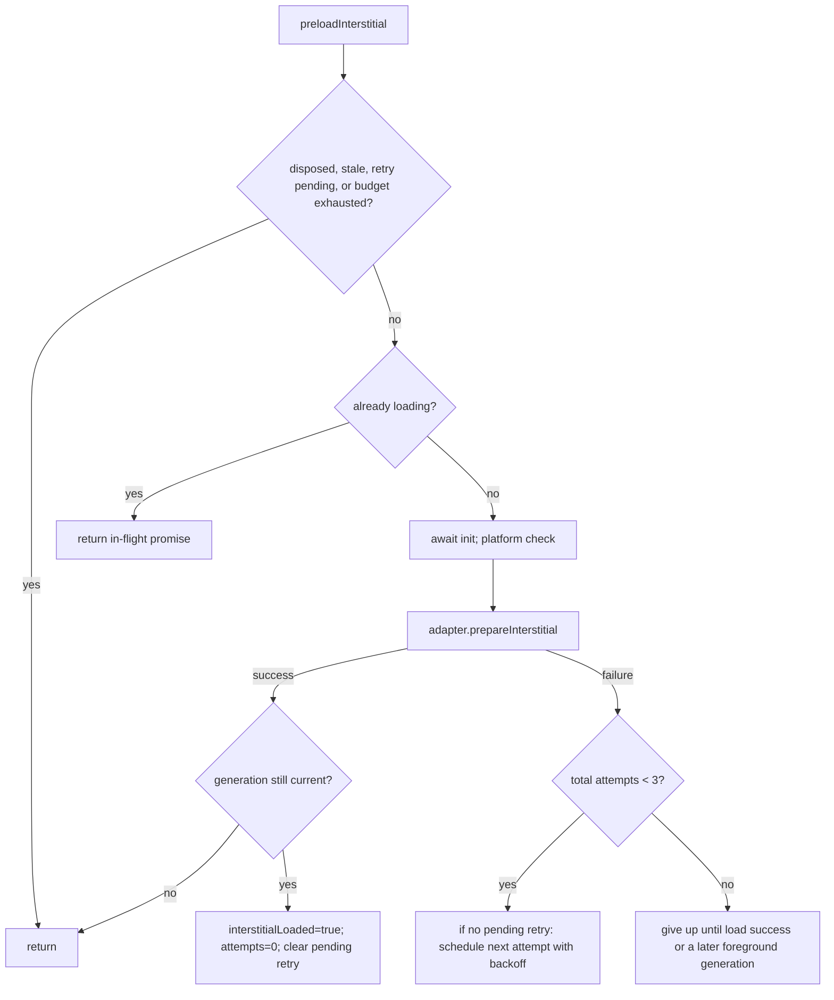

# fix: AdMob interstitial — ready-only display + re-arm

**Product Contract preservation:** Product Contract unchanged. This plan enriches the
requirements-only brainstorm (`docs/brainstorms/2026-07-10-admob-interstitial-ready-only-rearm-requirements.md`)
with HOW; it resolves the brainstorm's six open decisions but does not alter the WHAT.

---

## Summary

`AdMobProvider.maybeShowInterstitial` (`packages/sdk/src/ads/AdMobProvider.ts:369-416`) **awaits a
network preload inline** on the not-loaded path and then shows the ad whenever it resolves —
potentially long after the caller's break has passed (level already started, its audio already
playing). It also **never re-arms** after a show (the next opportunity pays a full cold load again),
has **no startup prewarm**, and has **no concurrent-show guard**.

The sibling `AppLovinMaxProvider.maybeShowInterstitial` (`packages/sdk/src/ads/AppLovinMaxProvider.ts:166-209`)
already ships the exact ready-only + re-arm contract this card asks for: background-arm + immediate
`return false` on the not-loaded path, and a `finally` re-arm after each consumed ad. **This is a
converge-to-sibling job, not a design-from-scratch.** We bring AdMob's interstitial into parity with
AppLovin's already-shipped contract, honoring the AdMob-specific mechanics AppLovin lacks, and adding
the three net-new testable seams the acceptance criteria require (bounded load backoff, app-foreground
re-arm, disposal). The shared `AdProvider` interface and exported `createAdProvider(): AdProvider` factory stay
unchanged. An additive owned-provider bootstrap helper carries teardown for production composition roots.

**Scope is AdMob interstitial only.** Rewarded (`:469-506`) intentionally awaits-then-shows (the caller
*wants* to wait for a hint) and is untouched. Banner is untouched. AppLovin is untouched.

---

## Problem Frame

Three behaviors diverge from the AppLovin contract and from the card's acceptance criteria:

1. **Blocking show (AC1 violation).** `:382-384` does `if (!this.interstitialLoaded) { await this.preloadInterstitial(); }`
   then shows if it resolves loaded. The caller `void`-fires `maybeShowInterstitial` at a natural break;
   a blocking preload means the ad can surface after the break is over.
2. **No re-arm (AC2 violation).** `finally` at `:414` sets `interstitialLoaded = false` but never triggers
   a fresh preload. Every subsequent opportunity is a cold load.
3. **No prewarm; no concurrent-show guard; no backoff/app-lifecycle/disposal coverage (AC3 gap).** First
   opportunity is always cold; two overlapping `maybeShowInterstitial` calls can both pass the ready check
   (`lastInterstitialShownAt` is only set *after* present, `:400`); load failures just clear a flag with no
   retry policy; nothing re-arms a stale ad after a long background; listeners are registered and never removed.

### The pivotal AdMob-specific mechanic

AppLovin's `showInterstitial` promise resolves on **dismiss**, so its `finally` re-arm fires when the ad is
genuinely finished. AdMob's native `showInterstitial()` resolves on **present**, not dismiss, and the v8 native
plugin holds one interstitial reference per platform rather than a documented separate next-ad slot. AdMob must
therefore use an interstitial-specific `Dismissed`/`FailedToShow` waiter with no synthetic timeout, independent of
audio lifecycle hooks, and keep
`showInProgress` set until that terminal waiter settles. `finally` remains the single re-arm site, but it runs
only after a terminal event (or an immediate `showInterstitial` rejection), never merely after present.

---

## Requirements

Traced to the card's acceptance criteria (AC1-AC4) and the brainstorm's contract table.

- **R1 (AC1):** `maybeShowInterstitial` makes an **immediate** ready/not-ready decision. When initialization is
  incomplete it starts initialization in the background and returns `false` without awaiting init or preload.
- **R2 (AC2):** A ready ad displays **once**; dismissal or show-failure **re-arms exactly once**; concurrent
  `maybeShowInterstitial` calls do **not** duplicate a show.
- **R3 (prewarm):** A background prewarm exists so the first eligible opportunity can find a ready ad.
- **R4 (AC3):** Re-preload after load failure has **bounded retry/backoff** with exactly three total native load
  attempts per failure streak (the initial attempt plus at most two retries). Show calls and resume events cannot
  bypass a pending delay or reset an exhausted budget; only load success or a later foreground generation starts a
  new streak,
  driven by an **injectable** scheduler so it is deterministic to unit-test (matching the repo's inject-`now`,
  no-fake-timers convention, `AdMobProviderOptions.now` at `:113-119`).
- **R5 (AC3):** App foreground (resume) re-arms a stale interstitial via an **injectable** app-lifecycle seam —
  **never auto-shows** — and the production composition root supplies that seam from `@capacitor/app`.
- **R6 (AC3):** An AdMob-local `dispose()` removes registered listeners, cancels pending backoff/app listeners,
  fences in-flight async completions, and is reachable through the lifecycle owner returned by production construction.
- **R7 (AC3):** Tests cover initialization, load failure + backoff, dismissal/re-arm, app background/foreground,
  disposal, and the concurrent-show guard.
- **R8 (AC4 / boundary):** All new seams are validated against **mocks only** at this stage. Because this checkout
  has no buildable Android AdMob app, the conductor must create and link the explicit release-gate card named in
  Scope Boundaries before this card can close; that card owns a real Android harness and device evidence.

**Non-functional invariants preserved (from `AdProvider.ts:1-9`):** every method swallows its own errors and
resolves to a safe value; gameplay is **never** blocked by an ad failure. No method may be "improved" into
throwing.

---

## Key Technical Decisions

Each resolves one of the brainstorm's six open decisions, defaulting to AppLovin parity + the CLAUDE.md rule
"reuse compatible AppLovin semantics without forcing provider-specific internals into the common API."

- **KTD1 — Re-arm lives in `finally`, after an interstitial-only terminal waiter with no timeout.** Every ready show creates
  `Dismissed`/`FailedToShow` listeners even when no `FullScreenAdLifecycle` hooks were injected. A successful native
  present awaits that terminal waiter before returning; an immediate show rejection is already terminal. `finally`
  is the only re-arm site, so dismissal and failed-to-show cannot double-arm. Both terminal listeners are required;
  if either cannot be registered, the provider does not present and returns the ready state to a safe retryable state.
  The existing 30-second waiter remains unchanged for rewarded ads; it is never used by interstitials.

- **KTD2 — Concurrent-show guard spans presentation through terminal dismissal.** Add `private showInProgress = false`.
  Check it before the not-loaded lazy-arm branch, set it before any listener-registration await, and clear it only in
  terminal cleanup. This prevents a second call, including one with `minIntervalMs: 0`, from arming or presenting
  while the first ad remains onscreen.

- **KTD3 — Prewarm on init success AND keep the lazy arm, but never await init from show.** After `this.initialized = true` inside the init IIFE
  (`:251`), fire `void this.preloadInterstitial()` (fire-and-forget — must NOT be awaited, or it would block init).
  Keep the not-loaded lazy arm from R1 so an opportunity that arrives before prewarm completes still arms the next
  gate. `preloadInterstitial`'s existing in-flight dedup (`preloadPromise`, `:267-269`) prevents a double load when
  prewarm and a lazy arm race. AdMob-local; AppLovin is not given prewarm (keeps blast radius on AdMob only).
  `maybeShowInterstitial` checks `initialized` synchronously; when false it `void`-starts `init()` and returns `false`.

- **KTD4 — Bounded load backoff via an injectable scheduler seam.** Add
  `AdMobProviderOptions.scheduleRetry?: (fn: () => void, delayMs: number) => () => void` (returns a cancel fn),
  defaulting to a `setTimeout`/`clearTimeout` wrapper. `MAX_INTERSTITIAL_LOAD_ATTEMPTS = 3` counts **total native
  `prepareInterstitial` calls in one streak**, including the initial call, so only failures 1 and 2 schedule retries;
  failure 3 stops. Explicit preload/show/resume arms share the counter and cannot run while a retry is pending.
  Reset only on success or the next native resume event after exhaustion. Backoff uses base
  `2_000`, multiplier `2`, and cap `30_000`.
  Only **one** pending retry at a time (a scheduled retry is skipped/replaced if one is already pending) to avoid a
  timer pile-up. This is net-new (AppLovin has no backoff); the injectable seam matches the inject-`now` convention
  and keeps tests free of fake timers. *Rejected:* real `setTimeout` with fake timers in tests — the file's
  established convention is dependency injection over `vi.useFakeTimers`.

- **KTD5 — App-foreground re-arm is injected into AdMob and wired at the production composition root.** Add
  `AdMobProviderOptions.addAppResumeListener?: (onResume: () => void) => Promise<ListenerHandle>`. When provided,
  `init` (on success) registers a handler that, on resume, fires `void this.preloadInterstitial()` **only if not
  currently loaded or showing** — it never shows. `games/marble_run/src/main.ts` supplies the seam from
  `@capacitor/app`'s `resume` listener, and `games/marble_run/package.json`/`package-lock.json` add the Capacitor-8-aligned
  runtime dependency. The SDK package itself remains free of a hard app-plugin dependency.

- **KTD6 — AdMob-local `dispose()` is exposed through an additive lifecycle owner helper, not `AdProvider`.** Retain listener handles (today
  `registerEventListeners` discards them, `:190-212`) in a `private disposables: ListenerHandle[]`. Add
  `async dispose(): Promise<void>` that marks disposal first, advances a lifecycle generation, cancels retry state,
  and removes every retained listener with per-handle error swallowing. Preserve the exported
  `createAdProvider(...): AdProvider` signature and runtime shape. Add a separate `createOwnedAdProvider` bootstrap
  helper returning `{ provider, dispose }`; both factories share one internal selection routine so behavior cannot
  drift. `GameSdk` opts into the owner helper and its pagehide path calls disposal.

- **KTD7 — Generation guards make disposal win every async race and retained callback.** Capture the current lifecycle generation before
  each init, listener registration, preload, scheduled retry, and terminal-show cleanup. After every await, mutate
  fields or retain a handle only if the generation still matches and the provider is not disposed; otherwise remove
  any late handle immediately and ignore the late load result. `dispose()` advances the generation before awaiting
  teardown, so an in-flight init/preload cannot resurrect loaded state or leak a listener. Every global, resume, and
  per-show callback checks its captured generation and disposed flag before mutation, so even a handle whose
  `remove()` rejects becomes inert. Dispose settles an active show without re-arm and finishes lifecycle once.

---

## High-Level Technical Design

### Ready-only `maybeShowInterstitial` control flow (target state)

### Preload + backoff lifecycle

Trigger sources feeding `preloadInterstitial` (all `void`-fired, all deduped by the in-flight promise):
init prewarm (KTD3) · lazy arm on not-loaded show (R1) · `finally` re-arm (KTD1) · app resume (KTD5) ·
backoff retry (KTD4).

---

## Implementation Units

U1-U6 modify `packages/sdk/src/ads/AdMobProvider.ts` and its test. U7 wires the resulting lifecycle through
provider selection and the Marble Run production composition root without adding `dispose` to `AdProvider`.

### U1. Ready-only `maybeShowInterstitial` + concurrent-show guard

**Goal:** Satisfy R1 and the concurrency half of R2 — immediate ready/not-ready decision, never await preload,
never double-show.

**Requirements:** R1, R2 (concurrency), KTD2.

**Dependencies:** none.

**Files:** `packages/sdk/src/ads/AdMobProvider.ts`, `packages/sdk/src/ads/AdMobProvider.test.ts`.

**Approach:**
- Add `private showInProgress = false` field.
- Before any await, if `initialized` is false, `void this.init(); return false;`. The show path must never join an
  in-flight init promise.
- Replace the blocking not-loaded branch (`:382-388`) with the AppLovin pattern: if `!this.interstitialLoaded`,
  `void this.preloadInterstitial(); return false;`.
- Check `showInProgress` before the ready/lazy-arm branch; if set, return `false` without preloading.
- Set the guard before awaiting terminal-listener registration and always create the dismissal waiter, even with no lifecycle hooks.
- Use a dedicated interstitial waiter with only `Dismissed` and `FailedToShow`; do not pass through the existing
  30-second rewarded waiter.
- Do not call native show unless both terminal listeners are registered; partial registration is cleaned up safely.
- Reset `showInProgress` only after `Dismissed`, `FailedToShow`, or an immediate native show rejection.

**Patterns to follow:** `AppLovinMaxProvider.ts:180-183` (background arm + immediate false); the existing
`finally` structure at `AdMobProvider.ts:409-415`.

**Test scenarios** (`AdMobProvider.test.ts`):
- **Rewrite** the existing "preloads on demand then shows a loaded interstitial" test (`:120-131`): under ready-only
  semantics a not-preloaded `maybeShowInterstitial` now returns `false`, calls `prepareInterstitial` (background arm),
  and does **not** call `showInterstitial`. Covers AC1.
- Ready path: after `await provider.preloadInterstitial()`, `maybeShowInterstitial` returns `true` and calls
  `showInterstitial` once.
- Concurrent guard: fire two `maybeShowInterstitial` calls without awaiting the first (adapter `showInterstitial`
  holds a pending promise), assert `showInterstitial` called exactly once and the second call resolves `false`.
  Covers AC2 (no duplicate).
- Present-vs-dismiss race: let native `showInterstitial` resolve while withholding `Dismissed`, call again with
  `minIntervalMs: 0`, and assert the second call returns `false` with no preload/show until the terminal event fires.
- No lifecycle hooks: a successful present still waits for `Dismissed` before resolving, clearing the guard, or re-arming.
- Listener registration failure: fail each terminal listener independently and assert no native present; any partially
  registered handle is removed without throwing.
- Cold-init race: hold native initialize/listener promises pending, call `maybeShowInterstitial`, and assert it resolves
  `false` before either promise; resolving init/prewarm later must not show for that expired call.
- Withhold terminal events after native present, flush all microtasks, and assert the show promise and guard remain
  pending with no re-arm. The dedicated interstitial waiter contains no timer; rewarded's existing timed waiter test
  remains unchanged, while the native release gate proves the interstitial remains guarded beyond 30 seconds.
- Regression: "returns false when the preload fails" (`:133-144`) still passes (not-loaded → background arm that
  fails → immediate false; `showInterstitial` never called).

**Verification:** SDK unit tests green; a not-loaded `maybeShowInterstitial` provably returns without awaiting a
network call (no `showInterstitial` on the not-loaded path).

### U2. Re-arm after dismissal/failure

**Goal:** Satisfy the re-arm half of R2 — a consumed or failed show re-arms exactly once.

**Requirements:** R2 (re-arm), KTD1.

**Dependencies:** U1 (concurrent guard makes exactly-once hold).

**Files:** `packages/sdk/src/ads/AdMobProvider.ts`, `packages/sdk/src/ads/AdMobProvider.test.ts`.

**Approach:** In `maybeShowInterstitial`'s `finally`, after the interstitial-only waiter has observed `Dismissed` or
`FailedToShow`, mark the ad consumed and fire one background preload. Cleanup removes each temporary listener with
per-handle error swallowing. A nested finalization block must still finish lifecycle hooks, reset loaded/show state,
and re-arm if cleanup unexpectedly rejects, preserving the shared never-throw provider contract.

**Patterns to follow:** `AppLovinMaxProvider.ts:203-208`.

**Test scenarios:**
- After a successful show, a fresh preload is triggered: assert `prepareInterstitial` is called again post-show and
  a subsequent opportunity (past the frequency cap, advancing the injected clock) finds a ready ad and shows. Covers AC2 (re-arm).
- Re-arm on show failure: adapter `showInterstitial` throws → `maybeShowInterstitial` returns `false` and the
  `finally` still fires a re-arm (`prepareInterstitial` called again).
- Exactly-once: a single show results in exactly one re-arm preload (assert `prepareInterstitial` call count delta
  is 1 across one show, accounting for the frequency-cap clock).
- Present is not terminal: resolving native show alone causes no re-arm; emitting `Dismissed` causes exactly one.
- Both terminal events firing, and a late event after an immediate show rejection, still produce one finalization and
  one re-arm for the captured show generation.
- `FailedToShow` after a resolved native present releases the guard and re-arms exactly once.
- A listener handle whose `remove()` rejects cannot make `maybeShowInterstitial` reject and cannot strand
  `showInProgress`, `interstitialLoaded`, lifecycle-finish, or the re-arm.

**Verification:** SDK unit tests green; re-arm count is exactly one per completed/failed show.

### U3. Background prewarm on init

**Goal:** Satisfy R3 — first eligible opportunity can find a ready ad.

**Requirements:** R3, KTD3.

**Dependencies:** none (independent of U1/U2 but tested after them).

**Files:** `packages/sdk/src/ads/AdMobProvider.ts`, `packages/sdk/src/ads/AdMobProvider.test.ts`.

**Approach:** Inside the init IIFE, immediately after `this.initialized = true` (`:251`), add
`void this.preloadInterstitial();` (fire-and-forget — never awaited). Guarded naturally: `preloadInterstitial`
re-enters `init` but returns early since `initialized` is already true, and the in-flight `preloadPromise` dedups
against any racing lazy arm. U6 later fences prewarm and init continuations with KTD7's lifecycle generation.

**Patterns to follow:** the fire-and-forget `void this.registerAdRevenueListener()` call in
`AppLovinMaxProvider.ts:105` (post-init side-effect, not awaited).

**Test scenarios:**
- After `await provider.init()` on a native platform, `prepareInterstitial` is called without any explicit
  `preloadInterstitial`/`maybeShowInterstitial` — the ad is warm. Covers "prewarm exists".
- No prewarm when init fails: init throws → `initialized` stays false → `prepareInterstitial` not called.
- No prewarm on non-native platform (init bails before `initialized = true`).
- Regression: "initializes exactly once across repeated init() calls" (`:86-94`) still asserts `initialize`
  called once (prewarm's re-entrant `init` returns early).

**Verification:** SDK unit tests green; init success arms an interstitial exactly once.

### U4. Bounded load backoff with injectable scheduler

**Goal:** Satisfy R4 — bounded retry after load failure, deterministic under test.

**Requirements:** R4, KTD4.

**Dependencies:** none (touches `preloadInterstitial`); tested independently.

**Files:** `packages/sdk/src/ads/AdMobProvider.ts`, `packages/sdk/src/ads/AdMobProvider.test.ts`.

**Approach:**
- Add module constants `MAX_INTERSTITIAL_LOAD_ATTEMPTS = 3`, `INTERSTITIAL_BACKOFF_BASE_MS = 2_000`, cap `30_000`.
- Add `AdMobProviderOptions.scheduleRetry?: (fn: () => void, delayMs: number) => () => void`, defaulting to a
  `setTimeout`/`clearTimeout` wrapper that returns a cancel function.
- Add fields `private interstitialLoadAttempts = 0` and `private pendingRetryCancel: (() => void) | null = null`;
  increment the counter immediately before each native `prepareInterstitial` call.
- In `preloadInterstitial`'s success branch: `interstitialLoaded = true; interstitialLoadAttempts = 0;` and clear
  any `pendingRetryCancel`.
- In the failure branch (`:297-300`): if `interstitialLoadAttempts < MAX` and no retry is pending, compute
  `delay = min(cap, BASE * 2 ** (attempts - 1))`, and
  `this.pendingRetryCancel = this.scheduleRetry(() => { this.pendingRetryCancel = null; void this.preloadInterstitial(); }, delay)`.
  At the cap, stop scheduling (no storm).
- Backoff must not run after disposal (U6 sets a disposed flag the scheduler callback and scheduling site check).
- At preload entry, a pending retry or exhausted budget returns without a native call. Explicit show/preload/resume
  arms do not reset attempts. After exhaustion, the next native resume event resets the streak and starts a new
  initial attempt; load success resets immediately.

**Patterns to follow:** the injectable `now` option (`AdMobProviderOptions.now`, `:113-119`) as the model for a
constructor-injected, defaulted seam.

**Test scenarios:**
- On a failing `prepareInterstitial`, `scheduleRetry` is invoked once with the base delay; invoking the captured
  callback retries `prepareInterstitial`; a second failure schedules with the doubled delay. Covers AC3 backoff.
- Success resets: after a retry succeeds, `interstitialLoadAttempts` is 0 and a later failure schedules at base delay again.
- Cap: one explicit arm plus scheduled retries makes exactly three native prepare calls total; the third failure
  schedules nothing (retry storm bounded, with no off-by-one fourth attempt).
- Single pending retry: back-to-back failures while a retry is pending do not stack multiple timers.
- While retry 2 is scheduled, repeated show calls, explicit preload calls, and resume callbacks neither call native
  prepare nor replace/shorten the pending delay.
- After the third failure, repeated explicit arms leave total native calls at exactly three; the next native resume
  event opens one fresh three-attempt streak.
- Default scheduler unit: the default `scheduleRetry` wrapper returns a working cancel (asserted via injecting a
  spy factory, not real timers).
- Timer race: dispose after a retry callback starts but before native prepare resolves; the late result cannot set
  loaded state or schedule another timer.

**Execution note:** Prefer a fake `scheduleRetry` that captures `(fn, delay)` synchronously — do not use
`vi.useFakeTimers`; this file's convention is dependency injection over fake timers.

**Verification:** SDK unit tests green; retries are bounded and deterministic with the injected scheduler.

### U5. App-foreground re-arm via injectable seam

**Goal:** Satisfy the provider half of R5 — resume re-arms a stale interstitial and never shows.

**Requirements:** R5, KTD5.

**Dependencies:** U3 (shares init registration site), U4 (re-arm goes through backoff-aware preload).

**Files:** `packages/sdk/src/ads/AdMobProvider.ts`, `packages/sdk/src/ads/AdMobProvider.test.ts`.

**Approach:**
- Add `AdMobProviderOptions.addAppResumeListener?: (onResume: () => void) => Promise<ListenerHandle>`.
- On init success (after prewarm), if provided, register a generation-fenced handler. On resume, if not loaded, not
  showing, and not disposed, either preserve an active retry/backoff or, after an exhausted streak, reset for that
  resume event and `void this.preloadInterstitial()`. Never calls `showInterstitial`.
- Store the returned handle in `disposables` (U6) so `dispose` removes it.
- When the option is absent, foreground re-arm is a no-op (no registration).

**Patterns to follow:** `registerEventListeners` (`:185-216`) for the addListener + swallow-errors shape.

**Test scenarios:**
- With a fake `addAppResumeListener` that exposes an emit hook: firing resume while not loaded calls
  `prepareInterstitial` and never `showInterstitial`. Covers AC3 app foreground.
- Resume while already loaded is a no-op (no extra `prepareInterstitial`).
- Resume while a show is in progress is a no-op.
- Resume while backoff is pending does not bypass its delay; only a resume after exhaustion opens a new budget.
- No option provided → no resume registration, no crash.
- Resume after `dispose` (U6) does nothing.

**Verification:** SDK unit tests green; resume re-arms only when stale and never auto-shows.

### U6. AdMob-local `dispose()` teardown

**Goal:** Satisfy the provider half of R6 — clean teardown, race fencing, and non-throwing cleanup.

**Requirements:** R6, KTD6, KTD7.

**Dependencies:** U4 (cancels pending backoff), U5 (removes resume listener).

**Files:** `packages/sdk/src/ads/AdMobProvider.ts`, `packages/sdk/src/ads/AdMobProvider.test.ts`.

**Approach:**
- Retain listener handles: change `registerEventListeners` (`:190-212`) to push each `addListener` result into a
  `private disposables: ListenerHandle[]`. Push the resume handle (U5) too.
- Add `private disposed = false` and a monotonic lifecycle generation captured by every async operation.
- Add `async dispose(): Promise<void>`: mark disposed and advance the generation before any await, cancel pending
  retry state, and remove every handle independently while swallowing removal errors.
- After every init/preload/listener await, discard stale results; remove a handle that resolves after disposal rather
  than retaining it. Guard show finalization so disposal never starts another preload.
- Wrap every registered event callback with its captured lifecycle generation/disposed check before any state mutation;
  this includes global banner/interstitial/rewarded callbacks, resume, and per-show terminal callbacks.
- Make dismissal cleanup independently swallow each handle-removal error so the public show promise remains safe.
- Track the active interstitial finalizer so dispose can finish lifecycle exactly once and settle it without re-arm;
  later native terminal callbacks are inert.

**Patterns to follow:** the handle-collection + pop-and-remove teardown already in
`createFullScreenAdDismissalWaiter` (`:552-563`).

**Test scenarios:**
- `dispose` calls `remove` on every registered listener handle (assert count matches registered listeners).
- `dispose` cancels a pending backoff retry (the injected `scheduleRetry` cancel fn is invoked).
- After `dispose`, a resume emit and a `finally` re-arm do not call `prepareInterstitial` (disposed guard).
- `dispose` is idempotent (second call is a safe no-op).
- Dispose while native preload is pending, then resolve success/failure: loaded state stays false and no retry appears.
- Dispose while init or listener registration is pending, then resolve it: initialized stays false, no prewarm
  starts, and any late listener handle is removed immediately.
- Dispose while listener registration is pending, then resolve a handle: that handle is immediately removed and not retained.
- One listener `remove()` rejection does not prevent remaining handles from being removed or make `dispose` reject.
- After a listener `remove()` rejection, manually invoke its retained callback and assert no loaded/visible/show state mutates.
- Dispose during an active presented interstitial finishes lifecycle once, performs no re-arm, and ignores later
  `Dismissed`/`FailedToShow` callbacks.

**Verification:** SDK unit tests green; no listener or timer survives `dispose`.

### U7. Production lifecycle owner and Capacitor resume wiring

**Goal:** Make R5/R6 reachable from real construction and teardown without changing existing public factory behavior.

**Requirements:** R5, R6, KTD5, KTD6, KTD7.

**Dependencies:** U5, U6.

**Files:** `packages/sdk/src/ads/createAdProvider.ts`, `packages/sdk/src/ads/createAdProvider.test.ts`,
`packages/sdk/src/ads/index.ts`, `games/marble_run/src/sdk/SdkContext.ts`,
`games/marble_run/tests/unit/sdk-wiring.test.ts`, `games/marble_run/src/main.ts`,
`games/marble_run/package.json`, `package-lock.json`.

**Approach:**
- Preserve `createAdProvider` argument order, return type, and direct `AdProvider` runtime shape. Add an additive
  `createOwnedAdProvider` helper returning a provider plus async disposal. Both call one internal selection routine;
  AdMob owner delegates to the concrete instance while AppLovin/Disabled use a no-op.
- Let production construction pass the AdMob resume-listener seam through the owner factory.
- Add Capacitor-8-compatible `@capacitor/app` to Marble Run, inject `App.addListener('resume', ...)` from
  `src/main.ts`, retain the returned owner in `GameSdk`, and invoke its disposal from the existing pagehide/session
  teardown path. Dependency and lockfile changes are confined to the game composition root.

**Test scenarios:**
- Provider selection returns an owner whose `provider` preserves current AdMob/AppLovin/Disabled selection behavior.
- Existing `createAdProvider` tests continue to access `providerName` and ad methods directly, and a compile-time
  assignment to `AdProvider` remains valid without `.provider` adaptation.
- Disposing an AdMob owner calls the concrete provider once; AppLovin/Disabled owner disposal is a safe no-op.
- The production GameSdk factory forwards the injected resume seam to Android AdMob construction.
- Emitting the injected production resume callback re-arms but never calls show.
- Calling GameSdk teardown invokes owner disposal once even when pagehide/session teardown repeats.
- Type-level regression: normal game code still consumes only `AdProvider`; no `dispose` member is added to that interface.
- Selection parity: legacy and owned helpers choose the same provider for every iOS/Android/web configuration.

**Verification:** SDK selection tests and Marble Run wiring tests prove that resume and teardown are reachable from
production construction; the manifest and lockfile resolve one Capacitor-major-compatible app plugin.

---

## Verification Contract

Per the card ("SDK ad tests/typecheck, root unit/audit/eslint. Commit only."):

- `npm run typecheck -w packages/sdk` (or root `npm run typecheck`) — clean.
- `npm run test:unit -w packages/sdk` — all AdMob ad tests green, including the rewritten `:120` test and every new
  scenario in U1-U7, plus provider-owner selection/teardown coverage.
- `npm run typecheck -w @fabrikav2/marble_run` and `npm run test:unit -w @fabrikav2/marble_run` — production resume
  injection and pagehide disposal wiring compile and pass.
- `npm run lint -w packages/sdk` / root `npm run lint` (eslint) — clean.
- Root `npm run test:unit` and `npm run audit` — green (blast-radius check; this change is AdMob-local but the
  shared `AdProvider` interface and AppLovin/Disabled providers must remain untouched and passing).
- **Commit only. No PR** (the twf conductor lands the branch). The linked native release-gate card owns device work.

---

## Scope Boundaries

**In scope:** AdMob interstitial ready-only display, terminal-event re-arm, prewarm, bounded backoff,
app-foreground re-arm, disposal, concurrent-show guard, the provider lifecycle owner, and Marble Run production
resume/teardown wiring. `@capacitor/app` is added only at the game composition root.

**Non-goals (out of this card's identity):**
- AdMob rewarded and banner lifecycles — rewarded intentionally awaits-then-shows (`:469-506`); untouched.
- Any change to the shared `AdProvider` method interface or existing `createAdProvider` return shape — lifecycle
  ownership stays in the additive owned-provider helper.
- Any change to `AppLovinMaxProvider` or the Disabled provider. AppLovin shares the latent concurrent-show gap
  (KTD2) but fixing it there is a separate change (kit blast radius across shared consumers).
- Adding native dependencies to the shared SDK package — `@capacitor/app` belongs only to Marble Run's composition root.

**Deferred to Follow-Up Work (blocking release gate, not this PR):**
- **Required linked card: `RELEASE GATE: prove AdMob terminal-only re-arm on Android device` (R8, AC4).** No
  buildable Android AdMob harness exists in this checkout: Marble Run has no Android platform, while Arrow has the
  Android package but no SDK/AdMob integration. The conductor must create and link this card before `VWLRgHuu` can
  close. The release-gate card owns selecting or creating a real Capacitor Android harness with the same
  `@capacitor-community/admob` major, physical-device evidence under
  `docs/evidence/admob-interstitial-ready-only-android/`, and an explicit release decision.
  Its acceptance matrix must prove: cold/uninitialized calls return false without later showing; present without a
  terminal event remains guarded beyond 30 seconds; Dismissed and FailedToShow each re-arm exactly once; offline load
  failure makes exactly three attempts per foreground generation; pending backoff survives repeated opportunities;
  resume re-arms but never shows; dispose makes retained callbacks inert; logs distinguish mocks from native events.
- Optionally back-porting the concurrent-show guard and prewarm to AppLovin for provider parity.

---

## Risks & Mitigations

- **"Exactly once" re-arm double-fire or early present-time re-arm.** Mitigation: KTD1 always waits for
  `Dismissed`/`FailedToShow`, KTD2 holds the guard across that wait, and only terminal `finally` re-arms.
- **Prewarm changes existing test expectations.** Prewarm-on-init (U3) and ready-only (U1) both alter what the
  current `:120` test observes; that test is explicitly rewritten in U1, and U3's regression scenario re-checks the
  init-once invariant. Risk is contained to the one test.
- **Backoff timer leak / storm.** Mitigation: single-pending-retry rule, three total attempts, and disposal generation
  fencing (U4/U6), with explicit arms blocked during pending/exhausted states and a foreground-generation reset.
- **Floating async completions after disposal.** Mitigation: generation validation after every await and immediate
  removal of late listener handles plus generation checks inside every callback body (KTD7/U6).
- **Lifecycle API blast radius.** Mitigation: `AdProvider` and `createAdProvider(): AdProvider` stay unchanged; the
  additive owned helper is opt-in and shares the same internal selection routine.
- **New native dependency.** Mitigation: pin `@capacitor/app` to the existing Capacitor 8 major at Marble Run only,
  update the lockfile, and keep physical-device proof as R8 rather than treating mock wiring as native evidence.
- **Card contract-path error.** The card cites `packages/sdk/src/ads/provider.ts` (does not exist); the real
  contract is `packages/sdk/src/ads/AdProvider.ts`. This plan uses the correct path throughout (carried from the
  origin brainstorm).

---

## Sources & Research

- Origin brainstorm: `docs/brainstorms/2026-07-10-admob-interstitial-ready-only-rearm-requirements.md`.
- Divergent code under repair: `packages/sdk/src/ads/AdMobProvider.ts:266-416` (`preloadInterstitial`,
  `maybeShowInterstitial`), `:185-216` (listener registration), `:513-566` (dismissal waiter).
- Parity target: `packages/sdk/src/ads/AppLovinMaxProvider.ts:134-209` (ready-only + `finally` re-arm).
- Contract of record: `packages/sdk/src/ads/AdProvider.ts:20-42`.
- Production owner/consumer: `packages/sdk/src/ads/createAdProvider.ts`, `games/marble_run/src/sdk/SdkContext.ts`,
  `games/marble_run/src/main.ts`.
- Native feasibility audit: Marble Run has no `@capacitor/android` dependency/platform; Arrow has the Android package
  but no AdMob/SDK integration. Native proof therefore belongs to the named release-gate card, not this mock plan.
- Native contract checked against `@capacitor-community/admob` v8: `showInterstitial` resolves on present and each
  platform executor retains one interstitial reference; terminal completion arrives through plugin events.
- Test harness convention: `packages/sdk/src/ads/AdMobProvider.test.ts` (fake adapter + `__emit`, injected `now`,
  no fake timers).

## Definition of Done

- U1-U7 implemented; provider tests, owner-selection tests, Marble Run wiring tests, and dependency lockfile are green.
- `maybeShowInterstitial` never awaits init or preload on a not-ready call (R1); re-arms exactly once on dismissal/failure and never
  double-shows through dismissal (R2); init prewarm arms an ad (R3); a capped failure streak makes exactly three total attempts
  (R4); production app resume re-arms without showing (R5); owner disposal tears down and fences late work (R6);
  AC3 coverage is complete (R7).
- Shared `AdProvider` interface and exported `createAdProvider(): AdProvider` signature/runtime shape remain unchanged;
  AppLovin and Disabled providers remain passing.
- Typecheck, sdk unit tests, eslint, root unit/audit green. Commit only; no PR.
- The conductor-created `RELEASE GATE: prove AdMob terminal-only re-arm on Android device` card is linked on
  `VWLRgHuu` with the required evidence path and acceptance matrix. R8/AC4 remains open until that card records a
  passing device result or an explicit release denial; mock completion cannot close this card.
