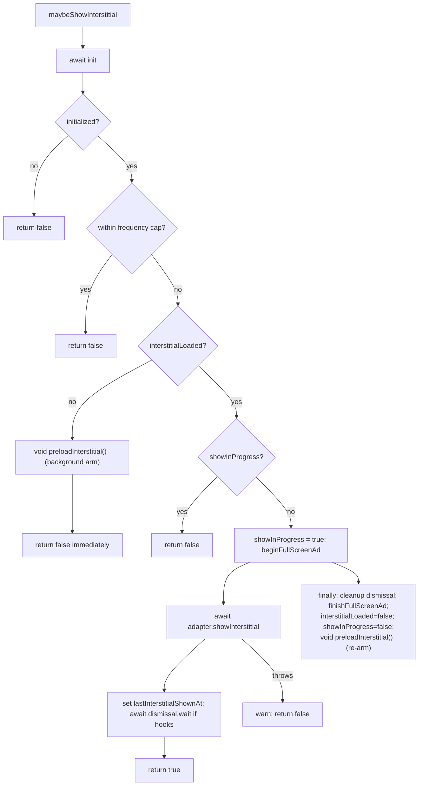
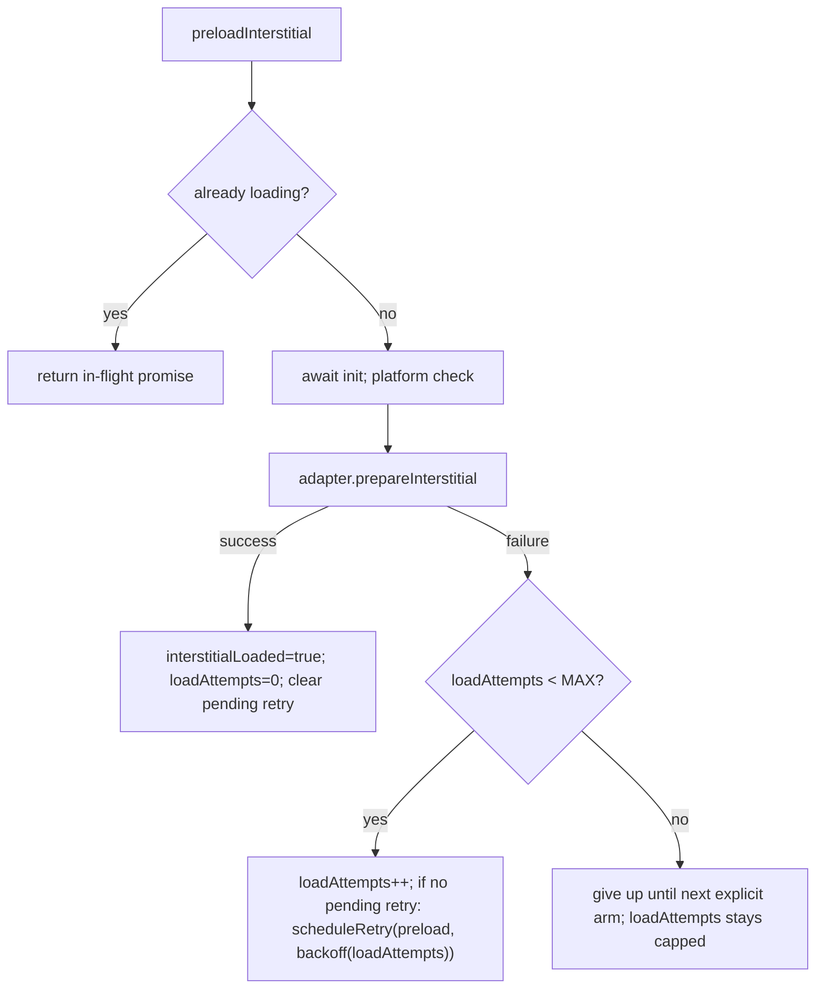

# fix: AdMob interstitial — ready-only display + re-arm

**Product Contract preservation:** Product Contract unchanged. This plan enriches the
requirements-only brainstorm (`docs/brainstorms/2026-07-10-admob-interstitial-ready-only-rearm-requirements.md`)
with HOW; it resolves the brainstorm's six open decisions but does not alter the WHAT.

---

## Summary

`AdMobProvider.maybeShowInterstitial` (`packages/sdk/src/ads/AdMobProvider.ts:369-416`) **awaits a
network preload inline** on the not-loaded path and then shows the ad whenever it resolves —
potentially long after the caller's break has passed (level already started, its audio already
playing). It also **never re-arms** after a show (the next opportunity pays a full cold load again),
has **no startup prewarm**, and has **no concurrent-show guard**.

The sibling `AppLovinMaxProvider.maybeShowInterstitial` (`packages/sdk/src/ads/AppLovinMaxProvider.ts:166-209`)
already ships the exact ready-only + re-arm contract this card asks for: background-arm + immediate
`return false` on the not-loaded path, and a `finally` re-arm after each consumed ad. **This is a
converge-to-sibling job, not a design-from-scratch.** We bring AdMob's interstitial into parity with
AppLovin's already-shipped contract, honoring the AdMob-specific mechanics AppLovin lacks, and adding
the three net-new testable seams the acceptance criteria require (bounded load backoff, app-foreground
re-arm, disposal) as **AdMob-local** additions that do not widen the shared `AdProvider` interface.

**Scope is AdMob interstitial only.** Rewarded (`:469-506`) intentionally awaits-then-shows (the caller
*wants* to wait for a hint) and is untouched. Banner is untouched. AppLovin is untouched.

---

## Problem Frame

Three behaviors diverge from the AppLovin contract and from the card's acceptance criteria:

1. **Blocking show (AC1 violation).** `:382-384` does `if (!this.interstitialLoaded) { await this.preloadInterstitial(); }`
   then shows if it resolves loaded. The caller `void`-fires `maybeShowInterstitial` at a natural break;
   a blocking preload means the ad can surface after the break is over.
2. **No re-arm (AC2 violation).** `finally` at `:414` sets `interstitialLoaded = false` but never triggers
   a fresh preload. Every subsequent opportunity is a cold load.
3. **No prewarm; no concurrent-show guard; no backoff/app-lifecycle/disposal coverage (AC3 gap).** First
   opportunity is always cold; two overlapping `maybeShowInterstitial` calls can both pass the ready check
   (`lastInterstitialShownAt` is only set *after* present, `:400`); load failures just clear a flag with no
   retry policy; nothing re-arms a stale ad after a long background; listeners are registered and never removed.

### The pivotal AdMob-specific mechanic

AppLovin's `showInterstitial` promise resolves on **dismiss**, so its `finally` re-arm fires when the ad is
genuinely finished. AdMob's native `showInterstitial()` resolves on **present**, not dismiss —
`createFullScreenAdDismissalWaiter` (`:513-566`) compensates by awaiting `Dismissed`/`FailedToShow`, but it
is **only constructed when lifecycle hooks are present** (`:390`). This is the crux of "re-arm exactly once":
a re-arm placed in `finally` still fires **once per `maybeShowInterstitial` call that reached the show block**,
because that block executes at most once per call. On the no-hooks path `finally` runs right after *present*
(ad still on screen) — but re-preloading then is safe: AdMob's `prepareInterstitial` loads the *next* ad into
a separate slot and does not disturb the currently-displayed one. So a `finally` re-arm (mirroring AppLovin)
is both correct and exactly-once **provided** the show block is guarded against concurrent entry (U1) so it
cannot run twice for overlapping calls.

---

## Requirements

Traced to the card's acceptance criteria (AC1-AC4) and the brainstorm's contract table.

- **R1 (AC1):** `maybeShowInterstitial` makes an **immediate** ready/not-ready decision — it never awaits a
  network preload, and can never display an ad after its call context has passed.
- **R2 (AC2):** A ready ad displays **once**; dismissal or show-failure **re-arms exactly once**; concurrent
  `maybeShowInterstitial` calls do **not** duplicate a show.
- **R3 (prewarm):** A background prewarm exists so the first eligible opportunity can find a ready ad.
- **R4 (AC3):** Re-preload after load failure has **bounded retry/backoff** (no unbounded retry storm),
  driven by an **injectable** scheduler so it is deterministic to unit-test (matching the repo's inject-`now`,
  no-fake-timers convention, `AdMobProviderOptions.now` at `:113-119`).
- **R5 (AC3):** App foreground (resume) re-arms a stale interstitial via an **injectable** app-lifecycle seam —
  **never auto-shows**. No new runtime dependency (`@capacitor/app`) is added at this stage.
- **R6 (AC3):** An AdMob-local `dispose()` removes registered listeners and cancels any pending backoff/app
  listeners so the provider can be torn down cleanly.
- **R7 (AC3):** Tests cover initialization, load failure + backoff, dismissal/re-arm, app background/foreground,
  disposal, and the concurrent-show guard.
- **R8 (AC4 / boundary):** All new seams are validated against **mocks only** at this stage. Mocks are **not**
  native proof — the pipeline must carry a downstream native-device-proof / explicit-release-gate task before
  this card closes (see Scope Boundaries and the origin doc's AC4 note).

**Non-functional invariants preserved (from `AdProvider.ts:1-9`):** every method swallows its own errors and
resolves to a safe value; gameplay is **never** blocked by an ad failure. No method may be "improved" into
throwing.

---

## Key Technical Decisions

Each resolves one of the brainstorm's six open decisions, defaulting to AppLovin parity + the CLAUDE.md rule
"reuse compatible AppLovin semantics without forcing provider-specific internals into the common API."

- **KTD1 — Re-arm lives in `finally` (converge to AppLovin), not a persistent dismissal listener.**
  Mirror `AppLovinMaxProvider.ts:203-208`: in `maybeShowInterstitial`'s `finally`, after `interstitialLoaded = false`,
  fire `void this.preloadInterstitial()`. Exactly-once holds because the show block runs at most once per call
  (KTD2 guards concurrency), and the existing `InterstitialAdPluginEvents.FailedToLoad` listener (`:204-207`)
  already clears `interstitialLoaded` on a failed load. *Rejected:* a separate always-on `Dismissed` re-arm
  listener — it adds a second re-arm path that would need de-duping against `finally`, exactly the double-arm
  risk the brainstorm flagged. The `finally` path is simpler and provably one-per-ad.

- **KTD2 — Concurrent-show guard via an in-flight flag.** Add `private showInProgress = false`. After the ready
  check and before `beginFullScreenAd`, if `showInProgress` is set, `return false` immediately; otherwise set it,
  and clear it in `finally`. Needed because `lastInterstitialShownAt` is only updated *after* present, so the
  frequency cap alone cannot dedupe two overlapping calls. AdMob-local. *(AppLovin has the same latent gap;
  fixing it there is out of scope — noted in Scope Boundaries.)*

- **KTD3 — Prewarm on init success AND keep the lazy arm.** After `this.initialized = true` inside the init IIFE
  (`:251`), fire `void this.preloadInterstitial()` (fire-and-forget — must NOT be awaited, or it would block init).
  Keep the not-loaded lazy arm from R1 so an opportunity that arrives before prewarm completes still arms the next
  gate. `preloadInterstitial`'s existing in-flight dedup (`preloadPromise`, `:267-269`) prevents a double load when
  prewarm and a lazy arm race. AdMob-local; AppLovin is not given prewarm (keeps blast radius on AdMob only).

- **KTD4 — Bounded load backoff via an injectable scheduler seam.** Add
  `AdMobProviderOptions.scheduleRetry?: (fn: () => void, delayMs: number) => () => void` (returns a cancel fn),
  defaulting to a `setTimeout`/`clearTimeout` wrapper. On a preload failure, if attempts remain, schedule one
  re-preload after an exponential-ish delay; reset the attempt counter on any successful load. Constants (module-level):
  `MAX_INTERSTITIAL_LOAD_ATTEMPTS = 3`, `INTERSTITIAL_BACKOFF_BASE_MS = 2_000`, multiplier `2`, cap `30_000`.
  Only **one** pending retry at a time (a scheduled retry is skipped/replaced if one is already pending) to avoid a
  timer pile-up. This is net-new (AppLovin has no backoff); the injectable seam matches the inject-`now` convention
  and keeps tests free of fake timers. *Rejected:* real `setTimeout` with fake timers in tests — the file's
  established convention is dependency injection over `vi.useFakeTimers`.

- **KTD5 — App-foreground re-arm via an injectable seam; no new dependency now.** Add
  `AdMobProviderOptions.addAppResumeListener?: (onResume: () => void) => Promise<ListenerHandle>`. When provided,
  `init` (on success) registers a handler that, on resume, fires `void this.preloadInterstitial()` **only if not
  currently loaded** — it never shows. When absent, foreground re-arm is a no-op. The real `@capacitor/app` wiring
  (a new runtime dependency requiring approval per CLAUDE.md) is **deferred to the downstream native-integration
  task** — the SDK just exposes the seam so the behavior is implemented and unit-tested now. *Rejected:* adding
  `@capacitor/app` in this card — it is a dependency addition (needs explicit approval) and native wiring belongs to
  the native-proof stage, not the mock stage.

- **KTD6 — AdMob-local `dispose()`, not on the shared interface.** Retain listener handles (today
  `registerEventListeners` discards them, `:190-212`) in a `private disposables: ListenerHandle[]`. Add
  `async dispose(): Promise<void>` that: cancels any pending backoff timer (via the KTD4 cancel fn), removes the app
  resume listener (KTD5), removes all retained plugin listeners, and marks the provider disposed so late re-arms
  no-op. Do **not** add `dispose` to `AdProvider` (`AdProvider.ts:20-30`) — that would force it onto AppLovin +
  Disabled (kit blast radius) for no consumer need. Document the promotion path if a shared consumer ever needs it.
  *Rejected:* shared-interface `dispose` — violates "don't force provider-specific internals into the common API."

---

## High-Level Technical Design

### Ready-only `maybeShowInterstitial` control flow (target state)

### Preload + backoff lifecycle

Trigger sources feeding `preloadInterstitial` (all `void`-fired, all deduped by the in-flight promise):
init prewarm (KTD3) · lazy arm on not-loaded show (R1) · `finally` re-arm (KTD1) · app resume (KTD5) ·
backoff retry (KTD4).

---

## Implementation Units

All units modify `packages/sdk/src/ads/AdMobProvider.ts` and its test
`packages/sdk/src/ads/AdMobProvider.test.ts`. Ordered by dependency.

### U1. Ready-only `maybeShowInterstitial` + concurrent-show guard

**Goal:** Satisfy R1 and the concurrency half of R2 — immediate ready/not-ready decision, never await preload,
never double-show.

**Requirements:** R1, R2 (concurrency), KTD2.

**Dependencies:** none.

**Files:** `packages/sdk/src/ads/AdMobProvider.ts`, `packages/sdk/src/ads/AdMobProvider.test.ts`.

**Approach:**
- Add `private showInProgress = false` field.
- Replace the blocking not-loaded branch (`:382-388`) with the AppLovin pattern: if `!this.interstitialLoaded`,
  `void this.preloadInterstitial(); return false;`.
- After the ready check, guard on `showInProgress`: if set, `return false`; else set it true.
- Reset `showInProgress = false` in the existing `finally` (`:409-415`).

**Patterns to follow:** `AppLovinMaxProvider.ts:180-183` (background arm + immediate false); the existing
`finally` structure at `AdMobProvider.ts:409-415`.

**Test scenarios** (`AdMobProvider.test.ts`):
- **Rewrite** the existing "preloads on demand then shows a loaded interstitial" test (`:120-131`): under ready-only
  semantics a not-preloaded `maybeShowInterstitial` now returns `false`, calls `prepareInterstitial` (background arm),
  and does **not** call `showInterstitial`. Covers AC1.
- Ready path: after `await provider.preloadInterstitial()`, `maybeShowInterstitial` returns `true` and calls
  `showInterstitial` once.
- Concurrent guard: fire two `maybeShowInterstitial` calls without awaiting the first (adapter `showInterstitial`
  holds a pending promise), assert `showInterstitial` called exactly once and the second call resolves `false`.
  Covers AC2 (no duplicate).
- Regression: "returns false when the preload fails" (`:133-144`) still passes (not-loaded → background arm that
  fails → immediate false; `showInterstitial` never called).

**Verification:** SDK unit tests green; a not-loaded `maybeShowInterstitial` provably returns without awaiting a
network call (no `showInterstitial` on the not-loaded path).

### U2. Re-arm after dismissal/failure

**Goal:** Satisfy the re-arm half of R2 — a consumed or failed show re-arms exactly once.

**Requirements:** R2 (re-arm), KTD1.

**Dependencies:** U1 (concurrent guard makes exactly-once hold).

**Files:** `packages/sdk/src/ads/AdMobProvider.ts`, `packages/sdk/src/ads/AdMobProvider.test.ts`.

**Approach:** In `maybeShowInterstitial`'s `finally`, after `this.interstitialLoaded = false`, add
`void this.preloadInterstitial();` — mirroring `AppLovinMaxProvider.ts:205-207`. No new state; relies on U1's
guard for one-per-ad and on `preloadInterstitial`'s in-flight dedup.

**Patterns to follow:** `AppLovinMaxProvider.ts:203-208`.

**Test scenarios:**
- After a successful show, a fresh preload is triggered: assert `prepareInterstitial` is called again post-show and
  a subsequent opportunity (past the frequency cap, advancing the injected clock) finds a ready ad and shows. Covers AC2 (re-arm).
- Re-arm on show failure: adapter `showInterstitial` throws → `maybeShowInterstitial` returns `false` and the
  `finally` still fires a re-arm (`prepareInterstitial` called again).
- Exactly-once: a single show results in exactly one re-arm preload (assert `prepareInterstitial` call count delta
  is 1 across one show, accounting for the frequency-cap clock).

**Verification:** SDK unit tests green; re-arm count is exactly one per completed/failed show.

### U3. Background prewarm on init

**Goal:** Satisfy R3 — first eligible opportunity can find a ready ad.

**Requirements:** R3, KTD3.

**Dependencies:** none (independent of U1/U2 but tested after them).

**Files:** `packages/sdk/src/ads/AdMobProvider.ts`, `packages/sdk/src/ads/AdMobProvider.test.ts`.

**Approach:** Inside the init IIFE, immediately after `this.initialized = true` (`:251`), add
`void this.preloadInterstitial();` (fire-and-forget — never awaited). Guarded naturally: `preloadInterstitial`
re-enters `init` but returns early since `initialized` is already true, and the in-flight `preloadPromise` dedups
against any racing lazy arm.

**Patterns to follow:** the fire-and-forget `void this.registerAdRevenueListener()` call in
`AppLovinMaxProvider.ts:105` (post-init side-effect, not awaited).

**Test scenarios:**
- After `await provider.init()` on a native platform, `prepareInterstitial` is called without any explicit
  `preloadInterstitial`/`maybeShowInterstitial` — the ad is warm. Covers "prewarm exists".
- No prewarm when init fails: init throws → `initialized` stays false → `prepareInterstitial` not called.
- No prewarm on non-native platform (init bails before `initialized = true`).
- Regression: "initializes exactly once across repeated init() calls" (`:86-94`) still asserts `initialize`
  called once (prewarm's re-entrant `init` returns early).

**Verification:** SDK unit tests green; init success arms an interstitial exactly once.

### U4. Bounded load backoff with injectable scheduler

**Goal:** Satisfy R4 — bounded retry after load failure, deterministic under test.

**Requirements:** R4, KTD4.

**Dependencies:** none (touches `preloadInterstitial`); tested independently.

**Files:** `packages/sdk/src/ads/AdMobProvider.ts`, `packages/sdk/src/ads/AdMobProvider.test.ts`.

**Approach:**
- Add module constants `MAX_INTERSTITIAL_LOAD_ATTEMPTS = 3`, `INTERSTITIAL_BACKOFF_BASE_MS = 2_000`, cap `30_000`.
- Add `AdMobProviderOptions.scheduleRetry?: (fn: () => void, delayMs: number) => () => void`, defaulting to a
  `setTimeout`/`clearTimeout` wrapper that returns a cancel function.
- Add fields `private interstitialLoadAttempts = 0` and `private pendingRetryCancel: (() => void) | null = null`.
- In `preloadInterstitial`'s success branch: `interstitialLoaded = true; interstitialLoadAttempts = 0;` and clear
  any `pendingRetryCancel`.
- In the failure branch (`:297-300`): if `interstitialLoadAttempts < MAX` and no retry is pending, increment
  attempts, compute `delay = min(cap, BASE * 2 ** (attempts - 1))`, and
  `this.pendingRetryCancel = this.scheduleRetry(() => { this.pendingRetryCancel = null; void this.preloadInterstitial(); }, delay)`.
  At the cap, stop scheduling (no storm).
- Backoff must not run after disposal (U6 sets a disposed flag the scheduler callback and scheduling site check).

**Patterns to follow:** the injectable `now` option (`AdMobProviderOptions.now`, `:113-119`) as the model for a
constructor-injected, defaulted seam.

**Test scenarios:**
- On a failing `prepareInterstitial`, `scheduleRetry` is invoked once with the base delay; invoking the captured
  callback retries `prepareInterstitial`; a second failure schedules with the doubled delay. Covers AC3 backoff.
- Success resets: after a retry succeeds, `interstitialLoadAttempts` is 0 and a later failure schedules at base delay again.
- Cap: after `MAX` consecutive failures, no further `scheduleRetry` call is made (retry storm bounded).
- Single pending retry: back-to-back failures while a retry is pending do not stack multiple timers.
- Default scheduler unit: the default `scheduleRetry` wrapper returns a working cancel (asserted via injecting a
  spy factory, not real timers).

**Execution note:** Prefer a fake `scheduleRetry` that captures `(fn, delay)` synchronously — do not use
`vi.useFakeTimers`; this file's convention is dependency injection over fake timers.

**Verification:** SDK unit tests green; retries are bounded and deterministic with the injected scheduler.

### U5. App-foreground re-arm via injectable seam

**Goal:** Satisfy R5 — resume re-arms a stale interstitial, never shows, no new dependency.

**Requirements:** R5, KTD5.

**Dependencies:** U3 (shares init registration site), U4 (re-arm goes through backoff-aware preload).

**Files:** `packages/sdk/src/ads/AdMobProvider.ts`, `packages/sdk/src/ads/AdMobProvider.test.ts`.

**Approach:**
- Add `AdMobProviderOptions.addAppResumeListener?: (onResume: () => void) => Promise<ListenerHandle>`.
- On init success (after prewarm), if provided, `await`/register a handler: on resume, if `!this.interstitialLoaded`
  and not disposed, `void this.preloadInterstitial()`. Never calls `showInterstitial`.
- Store the returned handle in `disposables` (U6) so `dispose` removes it.
- When the option is absent, foreground re-arm is a no-op (no registration).

**Patterns to follow:** `registerEventListeners` (`:185-216`) for the addListener + swallow-errors shape.

**Test scenarios:**
- With a fake `addAppResumeListener` that exposes an emit hook: firing resume while not loaded calls
  `prepareInterstitial` and never `showInterstitial`. Covers AC3 app foreground.
- Resume while already loaded is a no-op (no extra `prepareInterstitial`).
- No option provided → no resume registration, no crash.
- Resume after `dispose` (U6) does nothing.

**Verification:** SDK unit tests green; resume re-arms only when stale and never auto-shows.

### U6. AdMob-local `dispose()` teardown

**Goal:** Satisfy R6 — clean teardown of listeners and pending timers; AdMob-local only.

**Requirements:** R6, KTD6.

**Dependencies:** U4 (cancels pending backoff), U5 (removes resume listener).

**Files:** `packages/sdk/src/ads/AdMobProvider.ts`, `packages/sdk/src/ads/AdMobProvider.test.ts`.

**Approach:**
- Retain listener handles: change `registerEventListeners` (`:190-212`) to push each `addListener` result into a
  `private disposables: ListenerHandle[]`. Push the resume handle (U5) too.
- Add `private disposed = false`.
- Add `async dispose(): Promise<void>`: set `disposed = true`; call `pendingRetryCancel?.()`; `await`-remove every
  handle in `disposables` (swallow errors); clear the array. Guard re-arm sites (backoff callback, resume handler,
  `finally` re-arm) with `if (this.disposed) return;` so late fire-and-forget preloads no-op.
- `dispose` is **not** added to `AdProvider`. Add a short doc comment noting the promotion path.

**Patterns to follow:** the handle-collection + pop-and-remove teardown already in
`createFullScreenAdDismissalWaiter` (`:552-563`).

**Test scenarios:**
- `dispose` calls `remove` on every registered listener handle (assert count matches registered listeners).
- `dispose` cancels a pending backoff retry (the injected `scheduleRetry` cancel fn is invoked).
- After `dispose`, a resume emit and a `finally` re-arm do not call `prepareInterstitial` (disposed guard).
- `dispose` is idempotent (second call is a safe no-op).

**Verification:** SDK unit tests green; no listener or timer survives `dispose`.

---

## Verification Contract

Per the card ("SDK ad tests/typecheck, root unit/audit/eslint. Commit only."):

- `npm run typecheck -w packages/sdk` (or root `npm run typecheck`) — clean.
- `npm run test:unit -w packages/sdk` — all AdMob ad tests green, including the rewritten `:120` test and every new
  scenario in U1-U6.
- `npm run lint -w packages/sdk` / root `npm run lint` (eslint) — clean.
- Root `npm run test:unit` and `npm run audit` — green (blast-radius check; this change is AdMob-local but the
  shared `AdProvider` interface and AppLovin/Disabled providers must remain untouched and passing).
- **Commit only. No PR** (the twf conductor lands the branch). No native device work at this stage.

---

## Scope Boundaries

**In scope:** AdMob interstitial ready-only display, re-arm, prewarm, bounded backoff, app-foreground re-arm
(injectable seam), disposal, concurrent-show guard — all AdMob-local, all mock-tested.

**Non-goals (out of this card's identity):**
- AdMob rewarded and banner lifecycles — rewarded intentionally awaits-then-shows (`:469-506`); untouched.
- Any change to the shared `AdProvider` interface (`AdProvider.ts`) — `dispose` stays AdMob-local.
- Any change to `AppLovinMaxProvider` or the Disabled provider. AppLovin shares the latent concurrent-show gap
  (KTD2) but fixing it there is a separate change (kit blast radius across shared consumers).
- Adding `@capacitor/app` or any new runtime dependency — deferred; requires explicit approval and belongs to the
  native-integration/native-proof stage.

**Deferred to Follow-Up Work (downstream pipeline tasks, not this PR):**
- **Native-device proof / explicit release gate (R8, AC4).** Mocks are not native proof. A downstream task must
  wire the real `@capacitor/app` resume seam and validate ready-only + re-arm + backoff on a physical device (or
  record an explicit release gate) before this card is considered done. The mock stages here cannot close AC4.
- Optionally back-porting the concurrent-show guard and prewarm to AppLovin for provider parity.

---

## Risks & Mitigations

- **"Exactly once" re-arm double-fire.** Mitigation: KTD1 keeps re-arm solely in `finally`; KTD2's `showInProgress`
  guard ensures the show block (and thus the `finally`) runs at most once per call. Test asserts a single re-arm
  per show.
- **Prewarm changes existing test expectations.** Prewarm-on-init (U3) and ready-only (U1) both alter what the
  current `:120` test observes; that test is explicitly rewritten in U1, and U3's regression scenario re-checks the
  init-once invariant. Risk is contained to the one test.
- **Backoff timer leak / storm.** Mitigation: single-pending-retry rule + `MAX` cap + `dispose` cancellation (U4/U6),
  all unit-tested with an injected scheduler.
- **Floating `void` preloads after disposal.** Mitigation: `disposed` guard at every re-arm site (U6).
- **Card contract-path error.** The card cites `packages/sdk/src/ads/provider.ts` (does not exist); the real
  contract is `packages/sdk/src/ads/AdProvider.ts`. This plan uses the correct path throughout (carried from the
  origin brainstorm).

---

## Sources & Research

- Origin brainstorm: `docs/brainstorms/2026-07-10-admob-interstitial-ready-only-rearm-requirements.md`.
- Divergent code under repair: `packages/sdk/src/ads/AdMobProvider.ts:266-416` (`preloadInterstitial`,
  `maybeShowInterstitial`), `:185-216` (listener registration), `:513-566` (dismissal waiter).
- Parity target: `packages/sdk/src/ads/AppLovinMaxProvider.ts:134-209` (ready-only + `finally` re-arm).
- Contract of record: `packages/sdk/src/ads/AdProvider.ts:20-42`.
- Test harness convention: `packages/sdk/src/ads/AdMobProvider.test.ts` (fake adapter + `__emit`, injected `now`,
  no fake timers).

## Definition of Done

- U1-U6 implemented in `AdMobProvider.ts`; all test scenarios present and green in `AdMobProvider.test.ts`.
- `maybeShowInterstitial` never awaits a preload (R1); re-arms exactly once on dismissal/failure and never
  double-shows (R2); init prewarm arms an ad (R3); load failures back off within bounds via the injected scheduler
  (R4); app resume re-arms without showing (R5); `dispose` tears down listeners and timers (R6); AC3 coverage
  complete (R7).
- Shared `AdProvider` interface, AppLovin, and Disabled providers untouched and passing (blast-radius clean).
- Typecheck, sdk unit tests, eslint, root unit/audit green. Commit only; no PR.
- **R8/AC4 remains open by design** — a downstream native-proof/release-gate task is required before the card closes.
