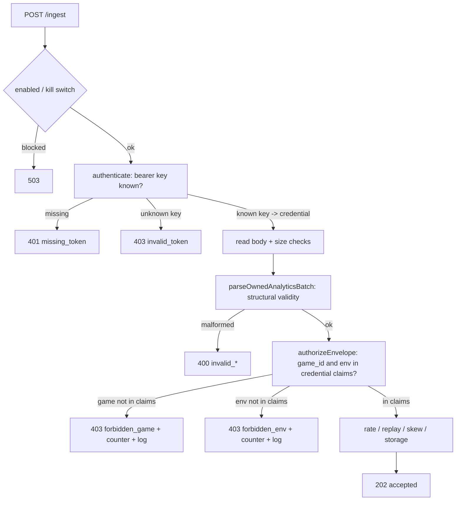

# Bind Analytics Ingest Credentials to Game and Environment - Plan

## Goal Capsule

- **Objective:** Make each owned-analytics ingest credential carry explicit allowed `game_id` and `env` claims, and validate the batch envelope's identity against those claims before any rate/replay/storage work — so a public key issued for one game/environment cannot submit events for another.
- **Authority:** Ratified Trello card `csYLD5PK` (AUDIT #10). The card fixes the decided direction: least-privilege credential claims, envelope-identity validation, browser keys remain public (containment not secrecy), and no production credential rotation or worker deploy from this change.
- **Execution profile:** Headless TypeScript change in the Cloudflare analytics ingest worker (`packages/services/src/analytics-worker`) plus its tests, with a new owned contract file `auth.ts`. SDK envelope shape is unchanged; the SDK is a consumer whose round-trip must keep passing.
- **Scope fence:** Do not change the wire contract (`packages/sdk/src/analytics/wire.ts`) or the batch envelope shape. Do not rotate real credentials, edit `wrangler.template.toml` secrets, or deploy. Do not touch `query.ts`/`budget.ts`/`storage.ts` logic beyond what threading a denial reason requires.
- **Stop conditions:** Stop if the fix would require changing the SDK wire envelope, adding a runtime dependency, inventing a secret-signing/JWT scheme (out of scope — these are public browser keys), or deploying/rotating production credentials.

---

## Product Contract

### Summary

The owned-analytics ingest worker authenticates a request by checking the bearer token against a flat set of public client keys, then independently trusts the `game_id` and `env` the caller wrote into the batch envelope. Because auth and identity are decoupled, any valid key can submit events tagged with any game and any environment. This plan binds each credential to an explicit set of allowed games and environments and rejects envelopes whose identity falls outside the presenting credential's claims.

### Problem Frame

In `packages/services/src/analytics-worker/ingest.ts`:
- `authenticate()` (lines 304-314) accepts a request if the bearer token is present in `config.publicClientKeys` — a flat `ReadonlySet<string>` built from `ANALYTICS_PUBLIC_CLIENT_KEYS` (`readAnalyticsWorkerConfig`, lines 205-220).
- `parseOwnedAnalyticsBatch()` (lines 222-257) validates `game_id` against a **separate, credential-independent** `allowedGameIds` set (`ANALYTICS_ALLOWED_GAME_IDS`) and validates `env` only for membership in the environment enum. Neither is tied to the presenting credential.
- The request context (lines 115-124) then threads `parsed.batch.game_id` and `parsed.batch.env` — caller-chosen values — into rate-limiting, replay, and storage.

Result: a public key copied from game A (public by nature — it ships in a browser bundle) can submit **production** events for game B. Cross-game and cross-environment forgery is undefended. The wire contract comment already warns `game_id` is "never trusted for auth" (`wire.ts:43`) — but nothing enforces that boundary.

**Environment vocabulary note:** the canonical `AnalyticsEnvironment` enum is `production | development | test` (`packages/sdk/src/analytics/contract.ts:33`). The card's "dev/staging/prod" phrasing maps onto this enum; there is no `staging`. Tests and claims use the real three values.

### Requirements

**R1 — Credential claims are explicit.** Each ingest credential is represented as a public key plus its allowed `game_id` set and allowed `env` set. Least privilege: a credential grants only the games and environments it is issued for. (Card acceptance 1.)

**R2 — Envelope identity is validated against claims before downstream work.** After the batch is parsed, the worker checks that `batch.game_id` is in the credential's allowed games and `batch.env` is in the credential's allowed environments, and denies deterministically otherwise — *before* rate-limit, replay, and storage. (Card acceptance 1; "validate before rate/replay/storage.")

**R3 — Cross-game and cross-environment submissions are denied deterministically.** A valid key presenting an envelope outside its claims yields a stable `403` with a non-secret denial code. (Card acceptance 1.)

**R4 — Valid scoped submissions stay SDK-envelope compatible.** A credential scoped to `(game, env)` accepts the exact batch the SDK `owned-mirror-sink` produces, with zero envelope adaptation. The wire round-trip test keeps passing. (Card acceptance 2; board lesson **contract-ownership**.)

**R5 — Unknown/malformed claims fail closed without leaking secrets.** Malformed credential configuration, an unknown key, or a claim that cannot be parsed results in denial (or, for config, no credential being minted) — never an open default, never echoing key material or raw config into responses/logs. (Card acceptance 3.)

**R6 — Denial is observable.** Scope denials increment an abuse counter and are logged deterministically with game/env/reason but no secret material. (Card acceptance 4.)

**R7 — Documented issuance/rotation path.** A migration path from the legacy flat config is provided and a rotation/issuance runbook is documented as a release follow-up (docs only — no live rotation). (Card acceptance 5.)

### Success Criteria

- Cross-game and cross-env submissions with an otherwise-valid key return `403` with a non-secret code and increment a denial counter.
- A correctly scoped credential accepts the SDK-produced batch unchanged; `wire-roundtrip.test.ts` and SDK tests stay green.
- Malformed credential config mints no usable credential and fails closed; no response or log contains key material.
- New tests cover multi-game, all three environments, legacy-config migration, and denial logging.
- `packages/services` analytics tests, SDK + services typecheck, and root unit/audit/eslint pass. Commit only — no deploy.

---

## Scope Boundaries

### In scope
- New owned contract file `packages/services/src/analytics-worker/auth.ts` (credential claim type + parser + authorization function).
- Wiring `auth.ts` into `ingest.ts`: config load, the post-parse authorization gate, a denial abuse counter, and denial logging.
- New/updated tests in `packages/services/src/analytics-worker/*.test.ts`.
- Docs: env-var/issuance/rotation reference (release follow-up).

### Out of scope (non-goals)
- Changing the SDK wire envelope or `game_id`/`env` fields (`wire.ts`, `contract.ts`).
- Any secrecy/signing scheme for browser keys — they are public by design; this is containment, not secrecy.
- Query API auth (`query.ts` operator tokens) — different credential class.

### Deferred to Follow-Up Work
- Operational issuance/rotation execution against real Cloudflare secrets (this plan documents the runbook only — R7).
- Per-credential rate-limit budgets (current limiter keys on `(game, key, ip)`; unchanged here).

---

## Key Technical Decisions

**KTD1 — `auth.ts` is the owner of the credential contract.** Per the card's contract line and the board **contract-ownership** lesson, the credential-claim shape and its validation live in exactly one file. `ingest.ts` imports and calls it; it does not re-declare claim shapes. `contracts.ts` may re-export the type alias for local readability (mirroring how it aliases the wire types) but the canonical declaration is in `auth.ts`.

**KTD2 — Structured credential config, with a legacy bridge.** Introduce a new env var (proposed `ANALYTICS_INGEST_CREDENTIALS`) holding a JSON array of `{ key, games, envs }` claims. When present it is authoritative. When absent, fall back to a **legacy bridge**: derive one credential per `ANALYTICS_PUBLIC_CLIENT_KEYS` entry, granting it the current `ANALYTICS_ALLOWED_GAME_IDS` set (or, if that is empty, deny — see KTD4) across **all** environments, and emit a one-time migration warning. This keeps existing single-game deployments working (R4) while making least-privilege the target state (R1). The bridge is documented as temporary in R7's runbook.

**KTD3 — Authorize after parse, before rate/replay/storage.** Envelope identity (`game_id`, `env`) is only known post-parse. The authorization gate is inserted in `fetch()` immediately after `parseOwnedAnalyticsBatch()` succeeds (ingest.ts ~line 111) and before the duplicate/rate/skew/replay/storage sequence (lines 126+). `authenticate()` stays as the cheap key-presence pre-check (401 for missing/unknown token); the new gate adds the scope check (403 for out-of-claims). This matches R2's ordering requirement exactly.

**KTD4 — Fail closed on ambiguity.** Malformed JSON in the credentials var, a claim missing `games` or `envs`, an empty games/envs list, or an unknown environment string → that claim is dropped (not minted) and, if the whole config is unparseable, the credential registry is empty so every request is denied. An empty legacy `allowedGameIds` under the bridge denies rather than granting all games (closing the current `allowedGameIds.size > 0` permissive gap for the credential path). No malformed input ever produces a wildcard grant. (R5.)

**KTD5 — Denials never leak secrets.** Denial responses carry a stable code (`forbidden_game`, `forbidden_env`) and a message naming the game/env but never the key. Logs (and the new abuse counter) record game/env/reason only. Config parse failures log a count and field name, never the key value. (R5, R6.)

**KTD6 — Do not weaken existing `parseOwnedAnalyticsBatch` validation.** The batch parser keeps validating `game_id` format and env-enum membership (structural validity). The new authorization layer adds the *credential-scoped* check on top. Keeping them separate preserves the 400-vs-403 distinction: malformed identity is a bad request; well-formed-but-out-of-scope identity is forbidden.

---

## High-Level Technical Design

Request lifecycle after this change (auth-relevant steps only):



Credential registry shape (directional, declared canonically in `auth.ts`):

```
IngestCredential {
  key: string
  games: ReadonlySet<string>          // least-privilege allow-list
  envs:  ReadonlySet<AnalyticsEnvironment>
}
CredentialRegistry = Map<string /* key */, IngestCredential>
```

---

## Implementation Units

### U1. Author the credential contract and authorization core (`auth.ts`)

- **Goal:** Create the single-owner contract file: the `IngestCredential` type, a fail-closed parser that builds a `CredentialRegistry` from worker env (structured var + legacy bridge), and a pure `authorizeEnvelope(credential, gameId, env)` decision function.
- **Requirements:** R1, R2, R3, R4, R5, KTD1, KTD2, KTD4, KTD5.
- **Dependencies:** none.
- **Files:**
  - `packages/services/src/analytics-worker/auth.ts` (new)
  - `packages/services/src/analytics-worker/auth.test.ts` (new)
- **Approach:**
  - Declare `IngestCredential` and `CredentialRegistry`. Import `AnalyticsEnvironment` / `ANALYTICS_ENVIRONMENTS` from `contracts.ts` (or `contract.ts`) — do not redefine the env enum.
  - `parseIngestCredentials(env)`: if `ANALYTICS_INGEST_CREDENTIALS` is present, `JSON.parse` inside try/catch; validate each entry has a string `key` (length ≥ 16, matching the existing key-length floor), a non-empty `games` array of valid `game_id`s, and a non-empty `envs` array of valid environments; drop invalid entries (fail closed per KTD4). On top-level parse failure return an empty registry.
  - Legacy bridge: when the structured var is absent, build credentials from `ANALYTICS_PUBLIC_CLIENT_KEYS` × `ANALYTICS_ALLOWED_GAME_IDS` across all `ANALYTICS_ENVIRONMENTS`; if `allowedGameIds` is empty, mint nothing (deny — KTD4). Signal (return value/flag) that the bridge path was used so the caller can log the migration warning once.
  - `authorizeEnvelope(credential, gameId, env)`: return `{ ok: true }` or `{ ok: false, code: 'forbidden_game' | 'forbidden_env' }`. Pure, no I/O, no secrets in the result.
- **Patterns to follow:** mirror `readAnalyticsWorkerConfig` env-parsing helpers (`envList`, key-length filter) in `ingest.ts:205-220,374-395`; mirror the discriminated-union return style of `authenticate()`/`parseOwnedAnalyticsBatch`.
- **Test scenarios** (`auth.test.ts`):
  - Covers AE(R1). Structured config with two credentials → registry maps each key to its own games/envs sets.
  - Covers AE(R3). `authorizeEnvelope` denies `forbidden_game` when game not in claims; denies `forbidden_env` when env not in claims; allows when both match.
  - Multi-game: one key scoped to `game_a` + `game_b`, another to `game_c`; each authorizes only its own games.
  - All three envs: credential scoped to `test` only rejects `production`/`development`; credential scoped to all three accepts each.
  - Covers AE(R5). Malformed structured JSON → empty registry (all-deny). Entry missing `games` / empty `envs` / unknown env string / short key → that entry dropped, others survive.
  - Legacy bridge: with only `ANALYTICS_PUBLIC_CLIENT_KEYS` + `ANALYTICS_ALLOWED_GAME_IDS` set, each key authorizes the allowed games across all three envs; empty `allowedGameIds` → no credential minted (deny).
  - No result object or thrown error contains the key string (assert on serialized decision).

### U2. Wire the authorization gate into `ingest.ts`

- **Goal:** Use the registry for authentication (key → credential) and insert the post-parse, pre-downstream scope gate; add a denial abuse counter and deterministic denial logging.
- **Requirements:** R2, R3, R6, KTD3, KTD5, KTD6.
- **Dependencies:** U1.
- **Files:**
  - `packages/services/src/analytics-worker/ingest.ts` (modify)
  - `packages/services/src/analytics-worker/contracts.ts` (modify — add `forbiddenScope` to `AnalyticsWorkerAbuseCounters`; optionally re-export the credential type alias)
  - `packages/services/src/analytics-worker/ingest.test.ts` (modify/extend)
- **Approach:**
  - In `readAnalyticsWorkerConfig`, build the `CredentialRegistry` (via U1) and carry it on the config instead of the flat `publicClientKeys` set (or alongside, during transition). Keep `allowedGameIds` only as a legacy-bridge input.
  - `authenticate()` looks the bearer token up in the registry: unknown → `403 invalid_token` (unchanged behavior for unknown keys); known → return the resolved `IngestCredential`.
  - After `parseOwnedAnalyticsBatch` succeeds (ingest.ts ~line 111), call `authorizeEnvelope(credential, batch.game_id, batch.env)`. On denial: increment `abuseCounters.forbiddenScope`, log `{ game_id, env, reason }` (no key), return `403` with the code from U1. This sits **before** the duplicate/rate/skew/replay/storage block (lines 126+) per KTD3/R2.
  - Add `forbiddenScope` to the abuse-counter object (ingest.ts:58-65) and to `AnalyticsWorkerAbuseCounters` (contracts.ts) and `totalAbuse` (ingest.ts:370-372).
  - Emit the one-time legacy-bridge migration warning when U1 signals the bridge path.
- **Patterns to follow:** existing abuse-counter increments + `jsonError` returns in `fetch()` (ingest.ts:90-154); `authenticate()` return-shape (ingest.ts:304-314).
- **Test scenarios** (`ingest.test.ts`):
  - Covers AE(R3). Valid key for `game_a`, envelope `game_id: game_b` → `403 forbidden_game`; `forbiddenScope` counter incremented; response body contains no key.
  - Covers AE(R2). Valid key scoped to `test`, envelope `env: production` → `403 forbidden_env`; asserted to reject **before** rate-limit/storage (e.g. store `writeBatch` spy never called).
  - Covers AE(R4). Correctly scoped key + matching envelope → `202`, storage write occurs, envelope unchanged.
  - Unknown key → `401`/`403` as today (regression guard).
  - Ordering: a cross-scope request under an exhausted rate limit still returns the scope `403`, proving the gate precedes rate-limiting.
  - Legacy-bridge env (only flat vars) → existing single-game batch still accepted (back-compat).

### U3. Envelope round-trip compatibility guard

- **Goal:** Prove a scoped credential accepts the exact SDK-produced batch with zero adaptation, extending the existing wire round-trip coverage.
- **Requirements:** R4, board lesson contract-ownership.
- **Dependencies:** U2.
- **Files:**
  - `packages/services/src/analytics-worker/wire-roundtrip.test.ts` (modify)
- **Approach:** In the existing round-trip test, configure a credential scoped to the game/env the SDK sink emits, feed the SDK-built batch through the worker, and assert `202` with no envelope mutation. This closes the loop between the producer-owned wire contract and the new credential gate.
- **Patterns to follow:** the existing producer→worker round-trip assertions in `wire-roundtrip.test.ts`.
- **Test scenarios:**
  - Covers AE(R4). SDK `owned-mirror-sink` batch for `(game, env)` + credential scoped to `(game, env)` → accepted unchanged.
  - Same batch + credential scoped to a different env → `403 forbidden_env` (forgery path closed end-to-end).

### U4. Issuance/rotation + env-var documentation (release follow-up)

- **Goal:** Document the new credential config format, the legacy-bridge migration path, and an issuance/rotation runbook — without performing any live rotation.
- **Requirements:** R7, KTD2.
- **Dependencies:** U1 (format must be final).
- **Files:**
  - `packages/services/src/analytics-worker/README.md` or the nearest existing analytics-worker doc (modify/create); reference `wrangler.template.toml` for where secrets are set.
- **Approach:** Document the `ANALYTICS_INGEST_CREDENTIALS` JSON shape, least-privilege guidance (scope each browser key to its one game + intended envs), the legacy `ANALYTICS_PUBLIC_CLIENT_KEYS`/`ANALYTICS_ALLOWED_GAME_IDS` bridge and how to cut over, and a rotation runbook (issue new scoped key → deploy → update SDK config → retire old key). State explicitly that browser keys are public and this is containment, not secrecy. No secrets committed.
- **Test expectation:** none — documentation only.

---

## Verification Contract

- **Analytics worker tests:** run the `packages/services` analytics-worker suite (`auth.test.ts`, `ingest.test.ts`, `wire-roundtrip.test.ts`) — all green, including the new cross-scope denial, ordering, and round-trip cases.
- **Typecheck:** SDK + services typecheck clean (envelope/wire types unchanged; new `auth.ts` types resolve).
- **Root gates:** root unit tests, `audit`, and `eslint` (`npx eslint .`) pass.
- **Secret-leak check:** grep new test assertions and denial paths to confirm no response body or log line includes key material.
- **Commit only** — no deploy, no live credential rotation (card constraint).

## Definition of Done

- R1–R7 satisfied; card acceptance 1–5 met.
- `auth.ts` is the sole declaration site of the credential-claim contract; `ingest.ts` imports it (contract-ownership).
- Cross-game and cross-env submissions denied deterministically with non-secret codes, counted, and logged, before rate/replay/storage.
- SDK envelope unchanged; round-trip and SDK tests green.
- Verification Contract gates all pass. Work committed, not deployed.

---

## Sources & Research

- `packages/services/src/analytics-worker/ingest.ts` — `authenticate` (304-314), `readAnalyticsWorkerConfig` (205-220), `parseOwnedAnalyticsBatch` (222-257), request-context threading (115-124), abuse counters (58-65, 370-372).
- `packages/services/src/analytics-worker/contracts.ts` — worker env bindings (77-99), `AnalyticsWorkerAbuseCounters` (142-149), env enum re-export (44-50).
- `packages/sdk/src/analytics/wire.ts` — producer-owned envelope; `game_id` "never trusted for auth" (43).
- `packages/sdk/src/analytics/contract.ts:33` — canonical `AnalyticsEnvironment = 'production' | 'development' | 'test'` (no `staging`).
- `packages/services/src/analytics-worker/ingest.test.ts` — test harness conventions (`enabledEnv`, `batch`, `request`).
- Board lesson **contract-ownership**; card `csYLD5PK` decided direction + acceptance criteria.
