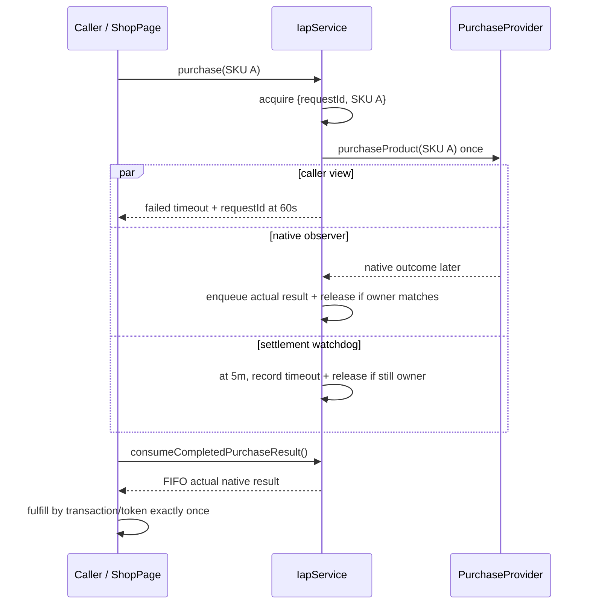

# fix: Keep IAP Purchase Serialization Through Native Settlement

## Goal Capsule

**Objective.** Prevent a caller-facing purchase timeout from releasing Fabrika v2's shared
native-store lock while RevenueCat is still processing the charge. Preserve every late native
outcome, make it drainable with stable request identity, and keep fulfillment exactly-once.

**Authority.** The committed legacy requirements document at
`docs/brainstorms/2026-07-10-iap-purchase-native-settlement-serialization-requirements.md` is the
product contract. The hardened `restore()` path in `packages/sdk/src/iap/service.ts` is the local
implementation precedent; the archived Fabrika learning on RevenueCat native-operation
serialization supplies corroborating context.

**Execution profile.** This is a money-path state-machine fix centered in `@fabrikav2/sdk`, plus
the existing `ShopPage.refresh()` integration seam needed to prove a late result round-trips to a
consumer without adding UI copy or a polling clock. RevenueCat's provider port remains unchanged.

**Stop condition.** Stop and surface a blocker if the installed native RevenueCat plugin exposes a
different `purchaseStoreProduct` contract than the structural adapter, or if native proof cannot
use a real Capacitor bridge plus RevenueCat Test Store / StoreKit / Play sandbox. Fakes prove the
state machine only and cannot close the device-evidence gate.

**Tail ownership.** The next TWF worker implements and verifies this plan in the card worktree; the
conductor owns review and landing.

---

## Product Contract

### Problem Frame

`IapService.purchase()` currently passes the native `purchaseProduct()` promise only through a
caller-facing `withTimeout(...)`. When that timer wins, `finally` clears
`activePurchaseProductId`, even though `Promise.race` did not cancel the native promise. A retry can
therefore issue a second charge while the first call remains active, and the first call's eventual
transaction is discarded.

`restore()` already separates these lifetimes: the caller may return on a short timeout while a
second settlement observer retains the native promise, owns the lock until settlement, and banks a
late result. Purchase must adopt that discipline while accounting for transaction identity,
consumables, and the fact that a bounded bridge watchdog cannot cancel an underlying store call.

### Requirements

- **R1 — Serialization survives caller timeout.** One authorized purchase owns the shared native
  store gate until native resolve/reject or the explicit settlement bound. A retry of the same or a
  different SKU, and restore during that interval, returns the existing `unavailable` / "native
  store operation already in progress" result without calling the provider again.
- **R2 — Caller and native lifetimes are separate.** Preserve the current caller-facing purchase
  timeout and early failed return, but retain and observe the raw native promise independently.
  A longer native-settlement watchdog prevents a permanently hung bridge from wedging the SDK.
- **R3 — Late outcomes are drainable.** A native success, cancellation, or failure that lands after
  the caller returned is captured exactly once and exposed through a purchase-result drain. A late
  purchased result can pass through the existing verified fulfill-once ledger; consumables are not
  recovered through the customer-info listener.
- **R4 — Lock release is owner-safe.** Success, cancellation, rejection, and settlement-watchdog
  expiry release only the lock owned by that purchase request. An old callback must never clear a
  newer purchase or restore. Existing purchase/restore mutual exclusion and customer-info listener
  behavior remain intact.
- **R5 — Request identity is correlation, not store idempotency.** Each authorized provider call
  receives a service-local request ID that follows the caller result and any drained late result.
  Store transaction ID / purchase token remains the durable entitlement-deduplication key.
- **R6 — Deterministic coverage.** Fake-provider tests cover timeout then retry, late success and
  grant, late failure, separate-SKU serialization, purchase/restore exclusion, watchdog release,
  stale-callback ownership, and FIFO draining without wall-clock sleeps.
- **R7 — Public contract fidelity.** New result metadata and the drain method are owned by
  `packages/sdk/src/iap/service.ts`, flow through the existing SDK barrels, and are exercised by a
  real package consumer without parallel result-shape declarations.

### Scope Boundaries

**In scope**

- Purchase settlement tracking, lock ownership, result capture/draining, and timeout policy in
  `packages/sdk/src/iap/service.ts`.
- Deterministic SDK and fulfillment tests using `FakePurchaseProvider` and Vitest fake timers.
- A zero-adaptation `ShopPage.refresh()` drain path and test using the public SDK package export.
- Real-device native-bridge evidence at the later evidence stage.

**Out of scope**

- A purchase queue or automatic retry; concurrent operations remain rejected.
- New shop copy, toasts, timers, or visual states.
- Rewriting restore beyond an owner-safe shared helper if implementation genuinely needs one.
- Treating customer-info updates as consumable fulfillment.
- Adding a provider idempotency parameter unsupported by RevenueCat.
- Claiming native correctness from Vitest, browser, or fake-provider evidence.

### Acceptance Examples

- **AE1.** Given SKU A's native promise outlives the caller timeout, when A or SKU B is attempted
  before native settlement, then the second result is `unavailable` and `purchaseCalls` still has
  exactly one entry.
- **AE2.** Given the caller has received a timeout failure, when the original native promise later
  resolves with transaction `txn-1`, then one drained `purchased` result carries the original SKU,
  transaction, and request ID; fulfillment grants once and a second drain returns `null`.
- **AE3.** Given a late native rejection, when it settles, then the request's failure is drainable,
  `lastErrorMessage` is updated, and purchase or restore may start after the lock releases.
- **AE4.** Given an old native promise settles after its settlement watchdog released the gate and a
  newer operation acquired it, then the old result is captured under its own request ID without
  clearing or relabeling the newer operation.
- **AE5.** Given a real-device caller timeout while a native store sheet remains active, when the
  player retries or taps Restore, then no second native purchase starts; completing or cancelling
  the original flow produces one observable terminal result and releases the controls.

---

## Planning Contract

### Key Technical Decisions

| ID | Decision | Rationale |
|---|---|---|
| KTD1 | Keep `purchaseTimeoutMs` as the caller-facing wait (default 60 seconds) and add a separately configurable `purchaseSettleTimeoutMs` with `DEFAULT_PURCHASE_SETTLE_TIMEOUT_MS = 300_000` (five minutes). Sample both once per request and require finite positive values with settlement strictly greater than caller wait before invoking the provider. | Existing callers retain their return behavior, tests/device harnesses can shorten both bounds deterministically, and the native lease is materially longer without becoming unbounded. Five minutes is an explicit Fabrika safety policy, not a RevenueCat latency guarantee. |
| KTD2 | Replace the product-id-only lock with a private active purchase owner containing `{ requestId, productId }`; preserve the public snapshot fields by deriving them from that owner. | A product ID cannot distinguish a timed-out old request from a later request for the same SKU. Owner identity prevents stale handlers from clearing new work. |
| KTD3 | Generate monotonic service-local request IDs only after all preflight guards pass and immediately before the single provider invocation. Add optional `requestId` correlation metadata to `IapPurchaseResult`; unavailable preflight/retry results have no request ID. | Callers can correlate the timeout view and late native result without pretending the local ID is a provider idempotency key. Optional additive metadata avoids forcing unrelated unavailable-result fixtures to invent an operation. |
| KTD4 | Retain the raw native promise, attach one idempotent native-outcome observer, and run caller and settlement watchdogs as separate views of that same promise. | This mirrors restore's proven discipline while ensuring the underlying promise is still observed after either timer wins. |
| KTD5 | Store late native outcomes in a private FIFO, drained one at a time by `consumeCompletedPurchaseResult()`. Do not auto-return an old SKU's result from a new `purchase(productId)` call. | Explicit draining avoids misattributing SKU A to a call for SKU B. FIFO avoids overwriting A if a watchdog later permits B before A's detached promise finally settles. |
| KTD6 | On settlement-watchdog expiry, record `lastErrorMessage` and release only the matching owner, but keep the raw promise observed. Do not enqueue a synthetic timeout result; the caller already received its timeout, and the queue must contain at most one actual native outcome per request. If native eventually settles, enqueue that actual outcome under the original request ID without touching a newer owner. | A JavaScript watchdog cannot cancel StoreKit/Play. Continuing observation prevents a post-bound charge from disappearing while owner checks prevent stale callbacks from corrupting current state. |
| KTD7 | Leave `PurchaseProvider.purchaseProduct(productId)` and `RevenueCatProvider` unchanged. | Current official `PurchaseStoreProductOptions` contains the product and Android product-change fields, but no caller-supplied request/idempotency key. RevenueCat documents waiting for an operation already in progress; Fabrika's shared service gate is the primary defense. |
| KTD8 | Route drained purchased results through existing `fulfillVerifiedPurchaseOnce`; never dedupe grants by request ID or customer-info-listener IDs. | The persistent wallet ledger already dedupes on purchase token / transaction ID. That is the durable store identity and preserves consumable safety. |

### High-Level Technical Design

### Purchase State and Failure Semantics

| Event | Caller result | Lock / owner | Drain and error behavior |
|---|---|---|---|
| Service/product/provider preflight fails | `unavailable`, no request ID | Never acquired | No provider call; no queued result. |
| Another purchase or restore owns the gate | `unavailable`, no request ID | Existing owner unchanged | No provider call; queue unchanged. |
| Native resolves before caller timeout | `purchased` with request ID | Matching owner releases | Returned directly; not queued. |
| Native rejects/cancels before caller timeout | `failed` / `cancelled` with request ID | Matching owner releases | Returned directly; `lastErrorMessage` records non-cancel failure; not queued. |
| Caller timeout wins | `failed` with request ID | Remains owned | Raw native promise continues; timeout is not settlement. |
| Native resolves after caller timeout | Caller already returned | Matching owner releases if still active | Enqueue one `purchased` result with the same request ID. |
| Native rejects/cancels after caller timeout | Caller already returned | Matching owner releases if still active | Enqueue one `failed` / `cancelled` result and record non-cancel error. |
| Settlement watchdog expires | Caller already returned because settle bound is greater | Matching owner releases | Record settlement-timeout error; enqueue no synthetic native result; keep raw promise observed. |
| Raw native promise settles after watchdog and newer work starts | No change to prior caller | New owner remains untouched | Enqueue old actual result with old request ID; FIFO prevents overwrite. |

### Assumptions

- A five-minute settlement lease is long enough for ordinary RevenueCat purchase flows but remains
  a policy boundary, not cancellation. A result after that boundary is still captured; the SDK may
  allow a new operation after the bound to avoid a permanent wedge.
- The card accepts that bounded recovery creates a residual post-bound overlap risk because the
  provider exposes no idempotency key. Device evidence must call this out rather than claiming
  impossible exactly-once charging beyond the watchdog.
- `consumeCompletedPurchaseResult()` is a non-blocking drain. Consumers own when to call
  `refresh()`, matching the existing restore contract; the SDK adds no timer or UI callback loop.
- The customer-info listener remains dedicated to deferred non-consumable recovery and is not used
  to grant consumables. Late purchase fulfillment uses the complete transaction-bearing result.
- Existing barrel exports (`packages/sdk/src/iap/index.ts` and `packages/sdk/src/index.ts`) already
  re-export `service.ts`; no barrel edit is needed unless implementation changes that fact.

### Sources and Research

- `packages/sdk/src/iap/service.ts:230` contains the racy purchase path; `:291-363` contains the
  restore late-settlement precedent and result drain.
- `packages/sdk/src/iap/fake-provider.ts:22-112` provides delayed, rejected, and hanging purchases
  plus `purchaseCalls`, sufficient for deterministic state-machine tests.
- `packages/sdk/src/iap/fulfillment.ts:81-121` establishes transaction/token ledger identity and
  fulfill-once behavior.
- `packages/ui/src/ShopPage.ts:360-398` is the existing consumer-driven refresh and result-hook seam;
  it owns no timer.
- `fabrika/docs/solutions/integration-issues/revenuecat-native-operation-serialization-20260522.md`
  records the same `Promise.race` sharp edge and shared native-operation rule in the archived source.
- [RevenueCat Capacitor API](https://github.com/RevenueCat/purchases-capacitor/blob/main/README.md)
  documents `PurchaseStoreProductOptions` without a request/idempotency key.
- [RevenueCat error handling](https://www.revenuecat.com/docs/test-and-launch/errors) documents
  `OPERATION_ALREADY_IN_PROGRESS` and instructs clients to wait for the original operation.
- [RevenueCat purchase flow](https://www.revenuecat.com/docs/getting-started/making-purchases) confirms
  successful purchase completion returns transaction details and updated customer information.

---

## Implementation Units

### U1. Introduce Owner-Identified Purchase Settlement Tracking

- **Goal:** Make caller timeout a view onto, rather than the lifetime owner of, one native purchase.
- **Requirements:** R1, R2, R4, R5.
- **Dependencies:** None.
- **Files:** `packages/sdk/src/iap/service.ts`.
- **Approach:**
  - Add `purchaseSettleTimeoutMs?: () => number` to `IapServiceDependencies`, the five-minute
    default, and one helper that snapshots/validates both purchase bounds before lock acquisition.
  - Replace `activePurchaseProductId` with a private owner record and monotonic request sequence;
    derive `pendingPurchaseProductIds`, `purchaseInProgress`, and `nativeOperationInProgress` so the
    public snapshot stays compatible.
  - Add optional `requestId` to `IapPurchaseResult`; include it on every result from an authorized
    native attempt, including the caller timeout and eventual late outcome.
  - Invoke `provider.purchaseProduct(productId)` exactly once inside a synchronous-throw-safe block.
    Attach the raw settlement observer before awaiting the caller timeout. Centralize native result
    mapping and owner-checked release so resolve/reject/watchdog races are idempotent.
  - Run the longer watchdog independently. On expiry, set the settlement-timeout error and release
    only if `requestId` still owns the gate. Do not detach the raw observer or let it release a newer
    owner when it eventually fires.
- **Patterns to follow:** Preserve `restore()`'s `release...InFinally` discipline and
  `withTimeout` primitive; do not refactor the sibling machine unless a tiny shared owner-release
  helper reduces duplication without changing restore semantics.
- **Test scenarios:** Invalid timeout configuration makes no provider call; synchronous provider
  throw releases; early success/cancel/failure release normally; caller timeout keeps the gate;
  watchdog expiry clears it; stale completion cannot clear a newer owner.
- **Verification:** SDK tests observe one provider invocation per request and snapshot fields remain
  compatible before, during, and after each terminal.

### U2. Add FIFO Late-Purchase Reconciliation and Fulfill-Once Proof

- **Goal:** Preserve every actual native outcome after caller return and prove a late charge grants
  exactly once.
- **Requirements:** R3, R5, R6, R7.
- **Dependencies:** U1.
- **Files:** `packages/sdk/src/iap/service.ts`, `packages/sdk/src/iap/service.test.ts`,
  `packages/sdk/src/iap/fulfillment.test.ts`.
- **Approach:**
  - Add a private FIFO of completed late native results and public
    `consumeCompletedPurchaseResult(): IapPurchaseResult | null` that shifts one entry.
  - Queue only actual native outcomes whose caller already returned. Direct outcomes are returned
    normally, and watchdog expiry updates error state without manufacturing a second terminal.
  - Guard each operation record so native resolve/reject is mapped and enqueued at most once.
  - Keep the provider seam unchanged. Use the result's transaction ID / purchase token with
    `fulfillVerifiedPurchaseOnce`; request ID is asserted only for correlation.
  - Use Vitest fake timers with the existing fake provider delays/hangs; remove the current real
    `wait()` helper from late-settlement coverage touched by this work.
- **Test scenarios:**
  - Caller timeout then same-SKU retry: retry unavailable, exactly one `purchaseCalls` entry.
  - Caller timeout then different-SKU attempt and restore: both unavailable until native settles.
  - Late success drains once with original SKU/request/transaction and fulfillment grants once.
  - Late cancellation and generic rejection drain with correct status; generic rejection updates
    `lastErrorMessage`; both release the gate.
  - SKU A settles, SKU B later settles, and FIFO preserves order/identity without overwrite.
  - Watchdog releases a never-settling purchase; a later owner remains active when an old delayed
    result arrives; the old actual result remains drainable.
- **Verification:** Targeted SDK tests pass entirely under fake timers, with no network and no
  wall-clock sleeps.

### U3. Prove the Public Drain Through the Existing Shop Consumer

- **Goal:** Demonstrate zero-adaptation contract flow from the SDK barrel to a consumer and its
  existing fulfillment callback, without adding UI state or timers.
- **Requirements:** R3, R7.
- **Dependencies:** U2.
- **Files:** `packages/ui/src/ShopPage.ts`, `packages/ui/src/ShopPage.test.ts`.
- **Approach:** During `ShopPage.refresh()`, drain all currently completed purchase results in FIFO
  order and invoke the existing `onPurchase` hook once per result before rendering the fresh
  snapshot. Keep `runPurchase()`'s direct-result callback unchanged; because direct results are not
  queued, the two paths cannot double-call. Preserve the component's explicit consumer-driven
  refresh contract and source guard prohibiting `setTimeout`, `setInterval`, and
  `requestAnimationFrame`.
- **Patterns to follow:** Mirror the existing late-restore drain in `refresh()` and import the
  service/result contract only from `@fabrikav2/sdk/iap`.
- **Test scenarios:** A caller-timed-out delayed purchase settles, `handle.refresh()` drains it and
  calls `onPurchase` once with matching request/transaction identity; a second refresh does not
  repeat it; direct success still calls once; no-polling source guard remains green.
- **Verification:** UI tests prove the public package boundary and callback path without local type
  redeclarations or a new clock.

### U4. Capture Native-Bridge Settlement Evidence

- **Goal:** Prove the state machine against a real mobile bridge and store flow, not only fakes.
- **Requirements:** R1-R4 and AE5.
- **Dependencies:** U1, U2, U3 and an available native RevenueCat-enabled game/harness.
- **Files:** `docs/evidence/2026-07-10-iap-purchase-settlement/` evidence artifacts only; do not add a
  production test mode to SDK source.
- **Approach:**
  - Build a native development variant with explicit short caller timeout and longer settlement
    timeout injected at the composition root. Record the exact values and build commit.
  - Use an iPhone or Android device with RevenueCat debug logging and Test Store, StoreKit sandbox,
    or Play license testing. Prefer a real StoreKit/Play sandbox transaction for the charge path.
  - Start a purchase and leave the native sheet unresolved beyond caller timeout. Capture the
    timeout result/request ID and busy snapshot, then attempt the same SKU, another SKU, and Restore.
    Logs must show no second provider purchase while the first lease is active.
  - Complete one run successfully and cancel/fail another. Capture the late drained result,
    transaction/token, matching request ID, one wallet/entitlement change, and released controls.
  - Save device provenance, screen recording/screenshots, Xcode/Android Studio + RevenueCat logs,
    and a short result table. Redact account identifiers and tokens while retaining stable hashes
    sufficient to correlate one transaction.
- **Verification:** Evidence explicitly distinguishes native bridge/store proof from unit proof.
  `verify-device` screenshots may supplement the artifact but cannot alone prove provider call
  count, settlement timing, or charge identity.

---

## Verification Contract

| Gate | Command or evidence | Proves |
|---|---|---|
| SDK focused tests | `npm run test:unit -w @fabrikav2/sdk -- src/iap/service.test.ts src/iap/fulfillment.test.ts` | Caller/native lifetime split, owner-safe release, FIFO drain, and fulfill-once behavior. |
| SDK typecheck | `npm run typecheck -w @fabrikav2/sdk` | New dependency/result/method contracts are coherent. |
| SDK lint | `npm run lint -w @fabrikav2/sdk` | State-machine implementation satisfies repository lint rules. |
| UI focused tests | `npm run test:unit -w @fabrikav2/ui -- src/ShopPage.test.ts` | Public barrel round-trip, consumer drain, one callback, and no polling loop. |
| UI typecheck/lint | `npm run typecheck -w @fabrikav2/ui && npm run lint -w @fabrikav2/ui` | The downstream consumer compiles without an adapter/redeclaration. |
| Regression suite | `npm run test:unit` | Restore, customer-info, fulfillment, games, and shared packages retain behavior. |
| Repository audit | `npm run audit` | No dependency, duplication, or workspace-boundary regression. |
| Native evidence | `docs/evidence/2026-07-10-iap-purchase-settlement/` with verified device provenance, store/debug logs, screenshots/recording, timeout values, and scenario table | A real Capacitor/RevenueCat bridge holds one operation through caller timeout and surfaces one late terminal. |

### Native Evidence Result Table

The evidence artifact must record at least:

| Scenario | Caller timeout observed | Retry/restore provider calls while active | Native terminal | Drained result | Grant count | Lock released |
|---|---:|---:|---|---|---:|---:|
| Same-SKU retry | Yes | 0 | Success | Purchased, matching request | 1 | Yes |
| Different-SKU + restore | Yes | 0 | Cancel or failure | Matching cancelled/failed result | 0 | Yes |

---

## Risks and Mitigations

- **A store call may settle after the five-minute watchdog.** JavaScript cannot cancel it. Keep the
  raw observer attached, identify it by request, and capture its actual outcome without releasing a
  newer owner. Document the residual post-bound overlap risk in native evidence.
- **A single result slot can overwrite another late charge.** Use FIFO rather than a nullable slot,
  because a watchdog may release the gate before an old bridge callback arrives.
- **Request ID may be mistaken for financial idempotency.** Name and document it as local
  correlation only; continue fulfilling/deduping exclusively by purchase token/transaction ID.
- **Customer-info recovery can double-grant consumables.** Do not route late purchase fulfillment
  through that listener; drain the complete transaction-bearing result.
- **Timeout races can double-return or double-enqueue.** Centralize native outcome capture in one
  operation record with idempotent flags, and use fake timers to test boundary ordering.
- **Consumer refresh may not run after settlement.** Preserve the explicit ShopPage contract and
  prove the drain on refresh; native integration must wire its existing app refresh/lifecycle clock
  and demonstrate the late grant. Do not hide this responsibility in an SDK timer.

---

## Definition of Done

- Caller-facing purchase timeout no longer clears the active native-operation owner.
- Same-SKU, different-SKU, and restore attempts are rejected without provider calls while the
  purchase settlement lease remains active.
- Every authorized purchase has stable local request identity across caller and late-result views.
- Native success/cancel/failure releases only its matching owner and is returned or queued exactly
  once; watchdog expiry releases a hung owner while the raw promise remains safely observed.
- `consumeCompletedPurchaseResult()` drains late actual outcomes FIFO, and a late purchase fulfills
  through the transaction/token ledger exactly once.
- RevenueCat provider interfaces and adapter remain unchanged because no supported idempotency-key
  input exists.
- Restore mutual exclusion, restore late settlement, and customer-info listener tests remain green.
- ShopPage proves the new SDK contract through its existing refresh/onPurchase seam with no new
  copy, visual state, timer, or result-shape redeclaration.
- SDK/UI typecheck, lint, focused tests, root unit suite, and repository audit pass.
- A real-device evidence artifact demonstrates caller timeout, blocked retries/restore, one native
  terminal, one drained outcome, one grant, and lock release; fake/browser evidence is not labeled
  as native proof.
- No implementation outside the files and evidence surface named above, no provider-port widening,
  no merge, and no push are introduced by the planning stage.
