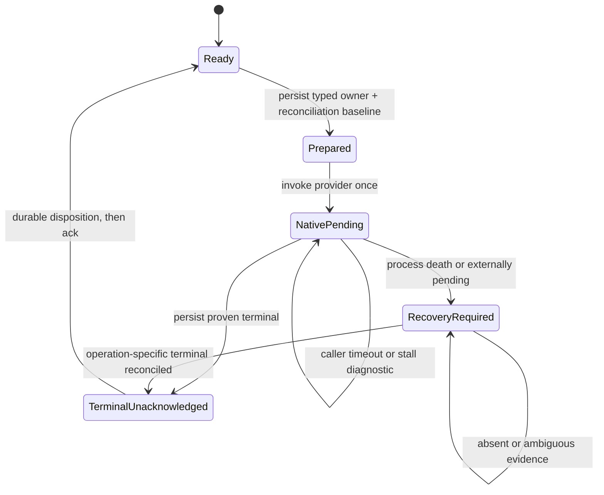
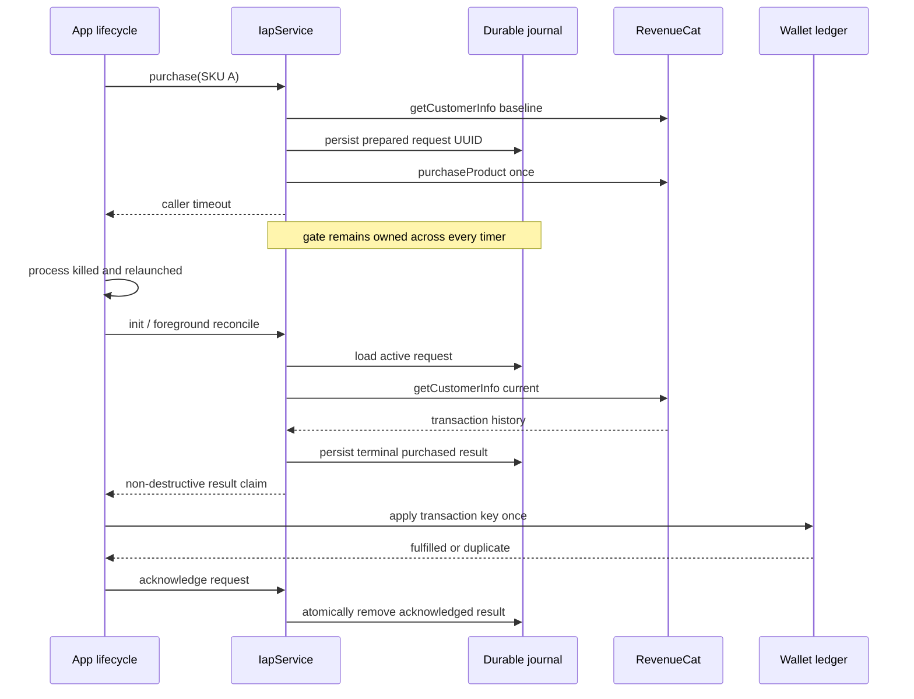

# Keep IAP Store Serialization Through Native Settlement - Plan

## Goal Capsule

**Objective.** Prevent any timeout, restart, or stale callback from reopening Fabrika v2's shared
native-store gate while a purchase or restore call may still be live. Persist typed purchase/restore
ownership and outcomes across process death, deliver paid results until durably acknowledged, and
grant each store transaction exactly once.

**Authority.** The committed legacy requirements document at
`docs/brainstorms/2026-07-10-iap-purchase-native-settlement-serialization-requirements.md` is the
product contract. The current `restore()` path in `packages/sdk/src/iap/service.ts` demonstrates
caller/native lifetime separation but is also part of the defect: its 60-second settle watchdog
clears the shared gate without cancelling the raw native promise. The archived Fabrika learning on
RevenueCat native-operation serialization supplies corroborating context.

**Execution profile.** This is a deep money-path state-machine and persistence fix spanning the SDK
provider/service contract, `ShopPage`, and both game composition roots. The RevenueCat port widens
only for current customer-information reconciliation and complete non-subscription transaction
identity; no unsupported cancellation or idempotency input is invented.

**Stop condition.** Stop and surface a blocker if the native plugin cannot provide transaction IDs,
purchase tokens, and purchase dates through `getCustomerInfo()`, if the host cannot supply a
crash-durable atomic journal, or if a restart leaves settlement indeterminate. An indeterminate
purchase or restore record blocks every new native-store call; elapsed time, a journal read error,
an empty CustomerInfo snapshot, and a successful unrelated `getCustomerInfo()` read are never
treated as proof that the original native operation ended.

**Tail ownership.** The next TWF worker implements and verifies this plan in the card worktree; the
conductor owns review and landing.

---

## Product Contract

### Problem Frame

`IapService.purchase()` currently passes the native `purchaseProduct()` promise only through a
caller-facing `withTimeout(...)`. When that timer wins, `finally` clears
`activePurchaseProductId`, even though `Promise.race` did not cancel the native promise. A retry can
therefore issue a second charge while the first call remains active, and the first call's eventual
transaction is discarded.

`restore()` separates caller and native lifetimes within one JavaScript process, but its bounded
watchdog has the same shared-gate defect: `RESTORE_SETTLE_TIMEOUT_MS` clears `restoreInProgress`
while the raw `restorePurchases()` promise can remain live. A purchase started after that boundary
can overlap the unresolved restore. Purchase and restore therefore need one typed crash-durable
owner/result journal, provider-backed restart reconciliation, and acknowledged delivery into the
persistent transaction ledger.

**Product Contract preservation.** R1-R7 are strengthened to close the red-team findings; R8-R10
add restart reconciliation, acknowledged delivery, and native lifecycle proof. The card's original
goal and no-overlapping-charge acceptance criterion are unchanged.

### Requirements

**Settlement safety and identity**

- R1. **Serialization survives every elapsed-time boundary.** One authorized purchase or restore
  owns the shared native-store gate until its raw native promise reaches a provider-proven terminal
  or operation-specific restart reconciliation proves a terminal. No watchdog releases that gate.
- R2. **Caller and native lifetimes are separate.** Preserve the caller-facing timeout and early
  return while retaining the raw native observer. A longer stall threshold emits diagnostics and a
  recovery-required state only; it never authorizes another store operation.
- R3. **Ownership and outcomes are crash-durable.** Before invoking the provider, persist a
  versioned journal record with operation kind, collision-resistant request identity, and the
  operation's reconciliation baseline. Persist an actual purchase or restore terminal outcome
  before releasing the gate or returning it.
- R4. **Lock and error updates are owner-safe.** A terminal callback releases only its matching
  durable owner. Old outcomes remain deliverable but cannot clear, relabel, or overwrite the
  snapshot error of a newer owner.
- R5. **Request identity is durable correlation, not financial idempotency.** Each authorized call
  uses a collision-resistant persisted request ID. Store transaction ID or purchase token remains
  the wallet deduplication key; a request ID never permits a retry.
**Verification and public contract**

- R6. **Deterministic coverage.** Controllable provider and journal fakes cover timeout and
  arbitrary stall boundaries in both directions, restart reconstruction, result/ack crashes,
  background-resume, listener-versus-promise ordering, stale errors, purchase-to-restore exclusion,
  and hung-restore-to-purchase exclusion.
- R7. **Public contract migration is explicit.** Journal, provider, result, and acknowledgement
  contracts are SDK-owned and flow through existing barrels. `ShopPage`, Marble Run, and Find the
  Dog migrate without local shape redeclarations or implicit acknowledgement.
**Restart reconciliation and delivery**

- R8. **Restart reconciliation is conservative and operation-specific.** For a purchase owner,
  compare full current non-subscription transaction history against the persisted pre-purchase
  baseline; only one unique matching transaction becomes a durable purchased result. For a restore
  owner, CustomerInfo may recover entitlement data but cannot prove the original restore invocation
  ended because RevenueCat exposes no restore operation identity/status. Unless the provider supplies
  operation-specific terminal evidence, the restore remains recovery-required and keeps every
  native-store call blocked.
- R9. **Delivery is two-phase.** Completed results are peeked or claimed non-destructively and
  removed only after the consumer reports a durable disposition: fulfilled/duplicate for a
  purchase, or handled for cancellation, failure, and restore. Throws, rejections, dismissal, and
  crashes leave the result available for replay.
**Native proof**

- R10. **Native proof covers lifecycle failure.** Device evidence includes the diagnostic-bound
  expiry, background/foreground, process kill and restart, delayed CustomerInfo ordering, and a
  crash between wallet commit and journal acknowledgement.

### Scope Boundaries

**In scope**

- Durable typed purchase/restore settlement-journal storage, restart reconciliation, shared lock
  ownership, result delivery, and diagnostic timeout policy in `packages/sdk/src/iap`.
- Complete RevenueCat non-subscription transaction mapping plus `getCustomerInfo()` reconciliation.
- Deterministic SDK, fulfillment, UI, and game-composition tests with controllable provider and
  journal fakes.
- Explicit acknowledgement integration in `ShopPage`, Marble Run, and Find the Dog.
- Real-device native-bridge evidence at the later evidence stage.

**Out of scope**

- A purchase queue or automatic retry; concurrent operations remain rejected.
- New shop copy, toasts, timers, or visual states.
- Changing restore entitlement semantics or using restore CustomerInfo to fulfill consumables.
- Treating customer-info updates as consumable fulfillment.
- Releasing an indeterminate purchase or restore because a timer elapsed or a journal read failed.
- Claiming native correctness from Vitest, browser, or fake-provider evidence.

**Deferred to follow-up work**

- Server-side RevenueCat webhook fulfillment for uninstall, cross-device, and local-storage-loss
  recovery. RevenueCat recommends server-owned consumable redemption; this card guarantees process
  crash/restart safety on one installed app instance.

### Acceptance Examples

- AE1. Given SKU A outlives both caller and stall thresholds, attempts for A, SKU B, and Restore
  remain unavailable with no additional provider calls until a proven terminal exists.
- AE2. Given transaction `txn-1` settles after caller return, the service persists it before
  releasing the gate. If fulfillment crashes before acknowledgement, restart replays `txn-1`; the
  wallet grants once, duplicate replay grants zero, and acknowledgement then removes the result.
- AE3. Given `onPurchase` throws or rejects, the same result remains the head of the durable
  delivery queue and a later refresh can process it again.
- AE4. Given the process dies with an active journal record, initialization diffs current
  transactions against the stored baseline. One new matching transaction is recovered; zero or
  multiple ambiguous matches keep the gate blocked.
- AE5. Given an old terminal arrives while newer non-store state exists, its error is attached to
  its own result and cannot replace the newer request's snapshot error.
- AE6. Given a real device is backgrounded or killed around purchase settlement, relaunch shows
  the durable recovery state, issues no retry, and proves one transaction and one durable grant
  across callback-first and CustomerInfo-first orderings.
- AE7. Given `restorePurchases()` outlives its caller and diagnostic thresholds, purchase and second
  restore attempts remain unavailable with zero provider calls. Background/foreground and service
  recreation retain the restore UUID; after process restart, CustomerInfo alone does not clear it.

---

## Planning Contract

### Key Technical Decisions

| ID | Decision | Rationale |
|---|---|---|
| KTD1 | Remove purchase and restore settlement-watchdog release. Keep each caller timeout, and use diagnostic stall thresholds that never clear shared ownership. | StoreKit, Play, and RevenueCat are not cancelled by a JavaScript timer; the existing restore settle bound can otherwise admit a purchase while restore remains live. |
| KTD2 | Require a versioned, crash-durable settlement journal with atomic whole-record replacement and one typed `purchase`/`restore` active owner. Native initialization and every store operation fail closed when journal load or write fails. | In-memory purchase, restore, and FIFO state disappear on process death. Persisting before either provider call prevents a second operation from entering on recreation. |
| KTD3 | Use a persisted collision-resistant request ID generated from a cryptographic UUID source, with an injectable deterministic factory for tests. | A service-local counter resets and can alias an old callback after recreation. The request ID remains correlation only. |
| KTD4 | Model provider outcomes as definitive success, definitive cancellation/failure, externally pending, or indeterminate. RevenueCat payment-pending and operation-in-progress errors do not release the gate. | A rejected JavaScript promise can still represent later store approval; the service must not confuse callback completion with financial finality. |
| KTD5 | Persist a baseline set of transaction keys before purchase and reconcile purchase restart through `getCustomerInfo()` with complete non-subscription transaction ID, token, product, and purchase-date fields. Treat restore restart separately: a CustomerInfo snapshot can recover data but cannot prove the old restore call ended. | RevenueCat CustomerInfo contains transaction history but no identity or status for a particular `restorePurchases()` invocation. A unique new matching transaction can prove purchase success; snapshot availability cannot release a restore owner. |
| KTD6 | Persist every actual terminal result before clearing its owner or returning it to the caller. Journal phases distinguish prepared, native-pending, recovery-required, and terminal-unacknowledged. | A crash in the callback-to-UI gap must not discard a paid consumable or a completed restore result. |
| KTD7 | Replace destructive consumption with non-destructive claim/peek plus explicit acknowledgement. Acknowledgement is accepted only for the matching request after durable consumer processing, and an unacknowledged terminal keeps every store operation unavailable. | At-least-once delivery plus the wallet transaction ledger closes crashes before and after grant while preventing paid-but-unapplied backlog. |
| KTD8 | Require all purchased-result consumers to use a persistent transaction/token ledger and acknowledge only `fulfilled` or `duplicate`; non-purchased terminals acknowledge only after their handler completes. | A crash after grant but before journal acknowledgement safely replays and dedupes instead of double-granting. |
| KTD9 | Store error state on the operation record and publish global error state only from the current owner or newest completed request. | A stale callback must not relabel a newer operation. |
| KTD10 | Widen `PurchaseProvider` with current-customer-info reconciliation and preserve full transaction metadata; do not add a fake request idempotency option. | The current Capacitor API supports `getCustomerInfo()` and transaction history but no client purchase idempotency key. |
| KTD11 | Drive replay and operation-specific reconciliation from explicit application lifecycle refresh and initialization, with no polling timer. | Restart and foreground events are recovery clocks, but they never release a restore owner without operation-scoped terminal evidence. |
| KTD12 | Treat ambiguous reconciliation as a surfaced recovery-required state, not an automatic retry or journal reset. | Zero or multiple candidate transactions cannot safely identify the original attempt. |

### High-Level Technical Design

### Purchase State and Failure Semantics

| Event | Caller view | Durable journal and gate | Delivery/error behavior |
|---|---|---|---|
| Preflight, journal, or baseline read fails | `unavailable`, no provider call | No native call; failed prepared write remains recovery-required if its outcome is uncertain | Error is scoped to that attempted request. |
| Purchase or restore call authorized | Pending | Typed prepared/native-pending owner is persisted before invocation | Exactly one provider call for the request UUID. |
| Caller timeout or stall threshold wins | Timed-out/indeterminate caller result | Owner remains; purchase and restore stay blocked indefinitely | Diagnostic only; no synthetic terminal result. |
| Purchase native success | `purchased` when caller still waits | Persist terminal transaction, then release native owner | Result remains unacknowledged until durable fulfillment. |
| Restore native terminal | `restored`/`failed` when caller still waits | Persist normalized restore result, then release its exact owner | Result remains unacknowledged until the restore handler completes. |
| Proven cancellation/definitive failure | Cancelled/failed when caller still waits | Persist terminal, then release native owner | Failure is attached to this request; stale errors do not update newer state. |
| Payment pending or ambiguous provider error | Pending/recovery-required | Owner remains blocked | CustomerInfo listener and lifecycle reconciliation may later prove success. |
| Process restart with one new matching transaction | No old caller | Persist reconstructed purchased result and release owner | Replay carries original request ID and store transaction identity. |
| Purchase restart with zero or multiple candidates | Recovery-required | Owner and shared gate remain blocked | Surface support diagnostics; do not retry, restore, or clear automatically. |
| Restore caller returns before raw promise | Timed-out/indeterminate | Durable restore owner remains across every timer and foreground event | Late raw terminal is persisted before release and replayed to the caller/consumer. |
| Restore restart without operation-scoped terminal proof | Recovery-required | Restore owner and shared gate remain blocked even if `getCustomerInfo()` succeeds | Recovered CustomerInfo may update diagnostics/entitlements but cannot acknowledge or clear the old invocation. |
| Handler throws, rejects, or app dies before ack | No acknowledgement | Terminal result remains durable | The same request is offered again. |
| Wallet reports fulfilled or duplicate | Handled | Matching result is atomically acknowledged and removed | A crash before ack replays safely through wallet dedupe. |

### Assumptions

- The host provides one crash-durable storage key with atomic replacement semantics. A storage exception fails closed before charging.
- RevenueCat CustomerInfo returns complete non-subscription transaction identity on the supported native plugin version. Implementation verifies the installed type and runtime payload.
- Reconciliation accepts only a unique transaction not present in the persisted baseline and compatible with the active product. Sandbox alias ambiguity remains blocked unless uniqueness proves the mapping.
- An empty CustomerInfo result cannot distinguish cancellation from an unfinished or unsynced charge and therefore never releases the gate.
- This card covers process crash/restart for one installation. Server-side webhook redemption remains the follow-up for uninstall, cross-device, and local-storage loss.
- Customer-info listeners may trigger reconciliation but never directly grant consumables. All grants flow through the transaction-bearing journal result.
- A CustomerInfo request has no restore-operation correlation field. Restore recovery therefore
  fails closed after restart unless the installed provider version exposes stronger terminal proof;
  a snapshot, listener callback, or foreground event alone is insufficient.

### Sources and Research

- [RevenueCat Capacitor API](https://github.com/RevenueCat/purchases-capacitor/blob/main/README.md) documents `getCustomerInfo()` and full `PurchasesStoreTransaction` identity: transaction identifier, product, purchase date, and Android token.
- The same official API documents `restorePurchases()` and `getCustomerInfo()` as returning only
  CustomerInfo; neither exposes a restore request ID or the status of an invocation lost on restart.
- [RevenueCat CustomerInfo](https://www.revenuecat.com/docs/customers/customer-info) documents lifecycle refresh and safe repeated `getCustomerInfo()` reads.
- [RevenueCat non-subscription purchases](https://www.revenuecat.com/docs/platform-resources/non-subscriptions) states that consumable redemption must be tracked outside RevenueCat and recommends server webhooks.
- `packages/sdk/src/iap/fulfillment.ts` supplies the transaction/token fulfill-once ledger contract.
- `games/find_the_dog/src/core/GameState.ts` supplies the existing persistent processed-purchase ledger pattern.

---

## Implementation Units

### U1. Add the Durable Shared-Operation Journal and Fail-Closed Gate

- **Goal:** Make purchase and restore ownership survive caller timeout, diagnostics, service recreation, and process restart.
- **Requirements:** R1-R5, R8.
- **Dependencies:** None.
- **Files:** `packages/sdk/src/iap/settlement-journal.ts`, `packages/sdk/src/iap/settlement-journal.test.ts`, `packages/sdk/src/iap/service.ts`, `packages/sdk/src/iap/service.test.ts`, `packages/sdk/src/iap/index.ts`.
- **Approach:**
  - Define a versioned journal schema with a single typed `purchase`/`restore` owner, request UUID,
    operation-specific baseline, prepared/native-pending/recovery-required phases, durable terminal
    records, and an injected atomic storage port.
  - Load and validate the journal before the service becomes purchase-ready. Corrupt or unavailable native storage produces a recovery-required/unavailable snapshot rather than silently discarding ownership.
  - Generate UUID request identity for either operation, persist its owner and reconciliation
    baseline, then invoke the provider once. A synchronous throw is classified and journaled without
    leaving an untracked attempt.
  - Remove both purchase and `RESTORE_SETTLE_TIMEOUT_MS` gate release. Caller timeouts remain, but
    purchase and restore raw-promise observers persist terminal results before clearing their exact
    owner; both guards consult the same durable owner.
  - Serialize journal mutations so callbacks, lifecycle reconciliation, and acknowledgement cannot overwrite one another.
- **Execution note:** Build the journal transition tests before replacing the current product-ID lock.
- **Test scenarios:**
  - Storage write fails before either provider invocation: no native call occurs and the service reports unavailable.
  - Purchase caller/diagnostic timers expire: same-SKU, different-SKU, and restore attempts remain unavailable after arbitrary fake-clock advancement.
  - Restore caller/diagnostic timers expire: same/different-SKU purchases and a second restore remain unavailable while the first raw restore promise is unresolved.
  - Recreating the service over the same journal restores the purchase or restore request UUID and blocks all store operations.
  - A late restore terminal persists before release; timeout, background/foreground, and a stale restore callback cannot clear a mismatched owner.
  - Corrupt/newer-schema journal data fails closed with actionable diagnostics.
  - An old callback cannot clear a recovered or newer owner, and cannot overwrite its error.
- **Verification:** Tests prove there is no time-based transition from unresolved owner to ready.

### U5. Add Transaction-Bearing RevenueCat Reconciliation

- **Goal:** Prove restart success from store history without inventing provider idempotency or cancellation.
- **Requirements:** R4, R5, R7, R8.
- **Dependencies:** U1.
- **Files:** `packages/sdk/src/iap/revenuecat-provider.ts`, `packages/sdk/src/iap/revenuecat-provider.test.ts`, `packages/sdk/src/iap/fake-provider.ts`, `packages/sdk/src/iap/service.test.ts`.
- **Approach:**
  - Extend structural CustomerInfo transaction entries with transaction ID, purchase token, product ID, and purchase date, and expose `getCustomerInfo()` through `PurchaseProvider`.
  - Preserve the complete fields through purchase, listener, restore, and current-info mappings.
  - Add controllable deferred purchases, mutable transaction history, listener ordering, and `getCustomerInfo` failures to the fake provider.
  - On init and foreground refresh, branch by owner kind: diff current transaction keys for a
    purchase owner, but keep a surviving restore owner recovery-required unless the provider returns
    operation-scoped terminal proof. Never use a successful CustomerInfo read as a restore terminal.
  - Normalize payment-pending/operation-in-progress errors as nonterminal and keep the owner blocked until reconciliation.
- **Test scenarios:**
  - Current-info before purchase creates the exact baseline stored in the journal.
  - Restart with one new matching iOS transaction ID or Android token reconstructs the original request result.
  - Zero candidates, two candidates, an alias ambiguity, and current-info failure all remain blocked.
  - Listener-before-promise and promise-before-listener persist one terminal result.
  - Payment-pending followed by a listener transaction transitions once; payment-pending alone never releases.
  - Restart with a restore owner plus empty, unchanged, or changed CustomerInfo remains blocked;
    foreground/listener updates cannot manufacture restore-operation completion.
- **Verification:** Adapter tests round-trip official RevenueCat transaction fields without local shape conversion.

### U2. Make Result Delivery Acknowledged and Fulfillment Idempotent

- **Goal:** Guarantee that a paid result is replayed until its transaction has durably fulfilled or been recognized as a duplicate.
- **Requirements:** R3, R5, R6, R9.
- **Dependencies:** U1, U5.
- **Files:** `packages/sdk/src/iap/service.ts`, `packages/sdk/src/iap/service.test.ts`, `packages/sdk/src/iap/fulfillment.ts`, `packages/sdk/src/iap/fulfillment.test.ts`.
- **Approach:**
  - Persist every actual purchase or restore terminal before owner release, including direct results whose caller is still present.
  - Expose non-destructive claim/peek and matching-request acknowledgement. Remove the existing
    destructive `consumeCompletedRestoreResult()` and do not introduce a destructive purchase drain.
  - Keep a terminal purchased result until the consumer reports `fulfilled` or `duplicate` from the transaction/token ledger. Unverified/unknown/ambiguous outcomes remain pending for repair.
  - Acknowledge cancellation/failure only after the consumer handler completes.
  - Maintain FIFO ordering for terminal records while allowing an old record's error to remain operation-local.
- **Test scenarios:**
  - Direct and late success both remain available until acknowledged.
  - Throw, rejected promise, dismissal, and simulated crash between claim and ack preserve the result.
  - Crash after wallet commit but before ack replays; fulfillment returns duplicate, grants zero, and then acknowledgement removes it.
  - Wrong request ID, wrong transaction key, and acknowledgement before durable disposition are rejected.
  - Repeated callback/listener delivery creates one journal result and one wallet grant.
  - A late restore result survives caller return and recreation until explicitly handled; a
    callback/handler failure does not destructively consume it.
- **Verification:** The journal provides at-least-once delivery while the wallet ledger proves exactly-once grant.

### U3. Migrate ShopPage to the Two-Phase Consumer Contract

- **Goal:** Process direct and replayed purchase/restore results through one awaited acknowledgement path without polling.
- **Requirements:** R7, R9.
- **Dependencies:** U2.
- **Files:** `packages/ui/src/ShopPage.ts`, `packages/ui/src/ShopPage.test.ts`.
- **Approach:**
  - Replace the fire-and-forget `onPurchase: void` contract with an explicit asynchronous processing disposition that distinguishes durable fulfilled/duplicate, handled non-purchase/restore, and retry.
  - Serialize direct and refresh-driven delivery so a result cannot be concurrently offered twice.
    Replace ShopPage's destructive completed-restore drain with the same durable head/ack path and
    acknowledge only after the restore handler has applied its non-consumable entitlement result.
  - Leave thrown/rejected/retry results unacknowledged and render from a fresh snapshot. Keep the source guard against polling clocks.
- **Test scenarios:**
  - Direct success, caller-timeout late success, and restart-replayed success each use the same processor and acknowledge once.
  - Synchronous throw, async rejection, dismissal, and retry disposition retain the result for the next refresh.
  - Fulfilled and duplicate dispositions remove the matching result; a second refresh does not callback.
  - Multiple durable results retain FIFO order and stop draining when the head is unacknowledged.
  - A late restore result, restore-handler throw/rejection, and recreation before restore ack replay
    one durable result; CustomerInfo never grants consumables.
- **Verification:** UI tests prove zero-adaptation use of the public SDK contract and no destructive pre-callback shift.

### U6. Migrate Game Wallets and Composition Roots

- **Goal:** Supply durable journal storage, native provider/lifecycle wiring, and transaction-ledger acknowledgement in every current purchase consumer.
- **Requirements:** R1-R3, R5-R10.
- **Dependencies:** U2, U3.
- **Files:** `package-lock.json`, `games/marble_run/package.json`, `games/marble_run/src/main.ts`, `games/marble_run/src/sdk/SdkContext.ts`, `games/marble_run/src/core/SaveState.ts`, `games/marble_run/src/core/SaveState.test.ts`, `games/marble_run/src/shell/App.ts`, `games/marble_run/tests/unit/sdk-wiring.test.ts`, `games/marble_run/tests/unit/iap-settlement.test.ts`, `games/find_the_dog/package.json`, `games/find_the_dog/src/bootstrap.ts`, `games/find_the_dog/src/platform/gameLifecycle.ts`, `games/find_the_dog/src/shop/IapService.ts`, `games/find_the_dog/src/ui/HUD.ts`, `games/find_the_dog/src/scenes/GameScene.ts`, `games/find_the_dog/tests/unit/iap-settlement.test.ts`.
- **Approach:**
  - Add an atomic local journal adapter at each composition root, namespaced and versioned independently from wallet save data.
  - Give Marble Run a persistent processed-transaction ledger and route purchases through `fulfillVerifiedPurchaseOnce`; remove unconditional coin grants from `applyPurchaseResult`.
  - Expose claim/ack/reconcile through the Find the Dog wrapper and acknowledge only after its existing persistent GameState ledger reports fulfilled or duplicate.
  - Remove Find the Dog HUD's destructive completed-restore consumption and route direct/late
    restore results through the acknowledged handler without re-fulfilling consumables.
  - Replace both games' unconditional native `FakePurchaseProvider` composition with an injected
    `RevenueCatProvider` on native builds while retaining the fake only for web/test. Add the
    RevenueCat and Capacitor App plugin dependencies and fail closed when key/plugin/storage
    prerequisites are absent.
  - Wire real Capacitor application foreground events, not an in-game pause button or visibility
    alone, to serialized reconciliation and ShopPage refresh in both games. Extend Find the Dog's
    existing lifecycle hook and register Marble Run at `main.ts`; teardown listeners with their
    owning app/session.
- **Test scenarios:**
  - Marble Run applies a transaction once across SaveState recreation and acknowledges duplicate replay without adding coins.
  - Find the Dog crashes after GameState commit but before journal ack, then replays and acknowledges without a second grant.
  - Both games fail closed when journal storage is unavailable on native.
  - Foreground reconciliation before and after page mount delivers one result.
  - Background/foreground during a hung restore retains the same owner and produces zero purchase,
    restore, or reconciliation-driven grant calls beyond the allowed read-only CustomerInfo refresh.
- **Verification:** Game tests prove durable wallet and journal composition, not merely SDK-level mocks.

### U4. Capture Native Restart and Settlement Evidence

- **Goal:** Prove the safety contract against a real Capacitor/RevenueCat bridge and store lifecycle.
- **Requirements:** R1-R4, R6, R8-R10, AE6, and AE7.
- **Dependencies:** U1-U3, U5, U6; U6 must provision and smoke-test the native RevenueCat-enabled Marble Run harness rather than assuming it already exists.
- **Files:** `docs/evidence/2026-07-10-iap-purchase-settlement/` evidence artifacts only.
- **Approach:**
  - Build a native development variant with short caller and diagnostic thresholds, durable journal inspection, RevenueCat debug logs, and redacted transaction hashes.
  - Hold the native purchase sheet beyond both thresholds; attempt same SKU, different SKU, and Restore before and after foregrounding. Record zero additional provider calls.
  - Hold or suspend a native restore beyond both thresholds; attempt purchase and a second Restore
    before/after foregrounding and after service recreation. Record zero additional mutating provider calls.
  - Exercise success, cancellation, payment pending/Ask to Buy, background/foreground, and process kill during the sheet and after store completion.
  - Relaunch and capture journal reconstruction, CustomerInfo reconciliation, transaction-bearing replay, wallet fulfillment, and acknowledgement.
  - Force one handler failure and one kill after wallet commit but before acknowledgement; prove replay and duplicate-ledger acknowledgement without a second grant.
  - Record callback-first and CustomerInfo-first orderings when the platform permits, plus any ordering that could not be forced.
  - Kill the process during restore, relaunch, and prove the persisted restore UUID remains
    recovery-required unless operation-specific native terminal evidence is actually available;
    CustomerInfo success alone must not reopen the gate.
- **Verification:** Evidence includes device/build provenance, exact thresholds, journal transitions, provider logs, transaction-key hashes, and wallet counts. Screenshots alone do not prove call count or financial identity.

---

## Verification Contract

| Gate | Command or evidence | Proves |
|---|---|---|
| SDK focused tests | `npm run test:unit -w @fabrikav2/sdk -- src/iap/service.test.ts src/iap/settlement-journal.test.ts src/iap/revenuecat-provider.test.ts src/iap/fulfillment.test.ts` | Durable typed purchase/restore ownership, no timer release in either direction, operation-specific reconciliation, acknowledged replay, and ledger dedupe. |
| SDK typecheck/lint | `npm run typecheck -w @fabrikav2/sdk && npm run lint -w @fabrikav2/sdk` | Journal/provider/public API contracts are coherent. |
| UI focused tests | `npm run test:unit -w @fabrikav2/ui -- src/ShopPage.test.ts` | Awaited processing, non-destructive replay, acknowledgement, and no polling. |
| UI typecheck/lint | `npm run typecheck -w @fabrikav2/ui && npm run lint -w @fabrikav2/ui` | The breaking callback migration is complete. |
| Marble Run focused tests | `npm run test:unit -w @fabrikav2/marble_run -- src/core/SaveState.test.ts tests/unit/sdk-wiring.test.ts` | Persistent transaction ledger and journal composition survive recreation. |
| Find the Dog focused tests | `npm run test:unit -w @fabrikav2/find_the_dog -- tests/unit` | Existing wallet ledger acknowledges replay without duplicate consumable grants. |
| Regression suite | `npm run test:unit` | Restore, listener, game, and package consumers retain behavior. |
| Repository audit | `npm run audit` | No dependency, duplication, or workspace-boundary regression. |
| Native evidence | `docs/evidence/2026-07-10-iap-purchase-settlement/` with device provenance, store/debug logs, journal snapshots, lifecycle timestamps, and redacted transaction hashes | A real bridge never reopens by time, reconstructs after restart, and grants/acknowledges exactly once. |

### Native Evidence Result Table

| Scenario | Timers elapsed | Process/lifecycle event | Additional purchase/restore calls | Reconciliation result | Wallet grants | Journal end state |
|---|---:|---|---:|---|---:|---|
| Sheet held beyond caller and diagnostic thresholds | Yes | Foreground | 0 | Still native-pending | 0 | Owner retained |
| Restore held beyond caller and diagnostic thresholds | Yes | Background/foreground + service recreation | 0 | Same restore remains native-pending | 0 | Restore owner retained |
| Kill during restore | Yes | Relaunch | 0 | CustomerInfo does not prove restore completion | 0 | Restore recovery-required |
| Kill while sheet or external approval is pending | Yes | Relaunch | 0 | No transaction or pending | 0 | Recovery-required |
| Kill after store success before JavaScript callback | Yes | Relaunch | 0 | Unique transaction recovered | 1 | Terminal until ack |
| CustomerInfo listener before/after purchase promise | Either | Background/foreground | 0 | Same transaction persisted once | 1 | Acknowledged |
| Kill after wallet commit before journal ack | Either | Relaunch | 0 | Result replayed as duplicate | 1 total | Acknowledged after replay |
| Proven cancellation or definitive failure | Either | Foreground | 0 while active | Terminal non-purchase result | 0 | Acknowledged after handling |

---

## Risks and Mitigations

- **An indeterminate record can block purchases indefinitely.** This is the intentional safety posture. Surface recovery diagnostics and support metadata; never trade a possible duplicate charge for automatic availability.
- **Local journal or wallet storage can be lost on uninstall or device failure.** Keep this card scoped to process crash/restart and track authenticated RevenueCat webhook fulfillment as follow-up.
- **CustomerInfo history can be stale, incomplete, or ambiguous.** Require complete transaction fields, compare against the persisted baseline, accept only one unambiguous candidate, and otherwise stay recovery-required.
- **Provider error meanings can drift.** Normalize documented pending and in-progress codes in the RevenueCat adapter and cover unknown codes with fail-closed tests.
- **Journal and wallet are separate durable writes.** Deliver at least once and acknowledge only after the wallet transaction ledger reports fulfilled or duplicate; every crash boundary is safe under replay.
- **The public migration is broader than the original drain proposal.** Compile and test every constructor and purchase consumer, including both games, rather than hiding compatibility behind optional defaults.
- **Lifecycle callbacks can race the original promise.** Serialize journal transitions by request and transaction key; listener-first and promise-first tests must converge on one record.
- **RevenueCat exposes no restart identity/status for a restore invocation.** Persist restore ownership
  before calling the plugin and keep it recovery-required after process death unless the installed
  provider supplies operation-specific terminal proof. CustomerInfo is data recovery, not lock proof.
- **The current games compose fake IAP even on native and Marble Run has no application foreground
  IAP hook.** Provision the real native RevenueCat adapter and bootstrap lifecycle wiring in U6;
  otherwise U4 is blocked and no device claim may be made.
- **Sandbox alias products can make product matching ambiguous.** Use the pre-purchase baseline and unique-candidate rule; ambiguity blocks instead of guessing.

---

## Definition of Done

- No caller timeout, diagnostic threshold, background event, restart, journal error, or reconciliation miss releases an unresolved native purchase or restore owner.
- A typed durable journal record and cryptographic request ID are committed before the single provider purchase or restore invocation.
- Purchase and restore remain unavailable while native-pending or recovery-required, regardless of elapsed time.
- Native terminal outcomes are persisted before owner release and survive service/process recreation.
- Purchase restart reconciliation uses full RevenueCat transaction identity and releases only on one proven matching transaction or a provider-proven definitive terminal; restore restart never releases from CustomerInfo alone.
- Payment-pending, operation-in-progress, empty history, ambiguous history, and reconciliation failure remain blocked.
- Completed results are delivered non-destructively until matching acknowledgement follows durable fulfilled/duplicate purchase processing or handled restore/non-purchase processing.
- A crash before fulfillment grants once on replay; a crash after wallet commit but before acknowledgement replays as duplicate and grants zero additional value.
- Stale callbacks and failures cannot clear or relabel a newer owner or overwrite its snapshot error.
- RevenueCat adapter, fake provider, SDK barrels, ShopPage, Marble Run, and Find the Dog compile against one SDK-owned contract.
- Marble Run gains a persistent transaction ledger; Find the Dog continues using its existing persistent ledger; both acknowledge only safe fulfillment outcomes.
- Focused SDK/UI/game tests, package typechecks and lint, the root unit suite, and repository audit pass.
- Native evidence demonstrates timer expiry in both operation directions, purchase/restore exclusion,
  hung-restore-to-purchase exclusion, background/foreground, process kill/restart, both callback
  orderings, replay, duplicate-ledger handling, and one total grant.
- Fake, browser, and screenshot evidence is never labeled as native store proof.
- Abandoned experimental paths and compatibility shims that bypass durable acknowledgement are absent from the final diff.
