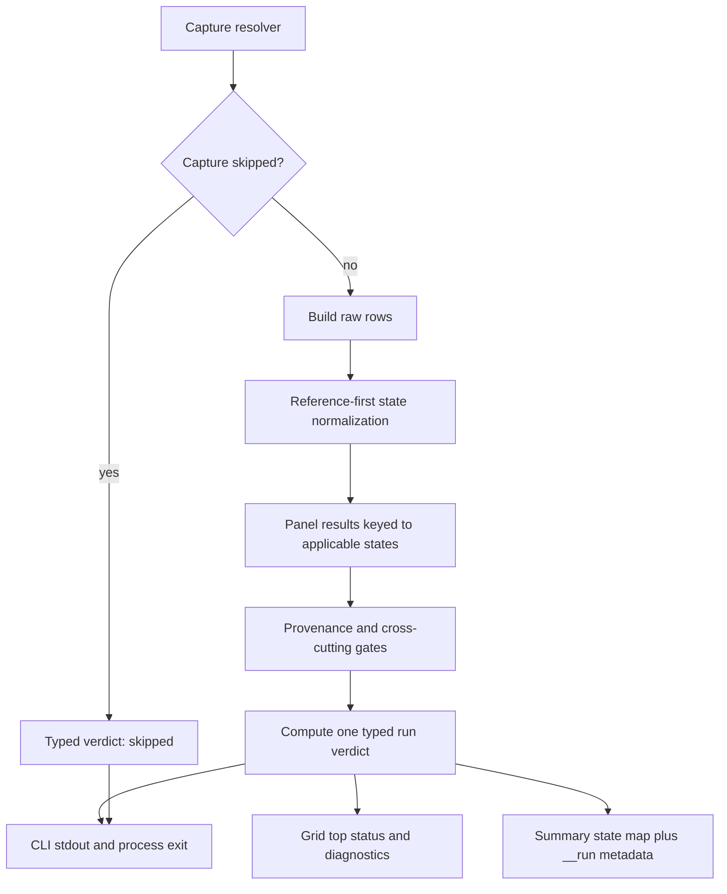

# Strict Device Verification Requires Verified Evidence - Plan

## Goal Capsule

- **Objective:** Make `verify-device --strict` fail closed unless at least one applicable state has fresh, live-device provenance and complete primary fidelity evidence, while every required applicable state is covered and every strict gate passes.
- **Authority:** Trello card `9l9Ploxe` is the product source of truth. `tools/verify-device/src/verdict.mjs` owns evidence normalization, typed run classification, and exit policy; the CLI, grid, and summary consume that result.
- **Execution profile:** Bounded JavaScript logic, subprocess regression tests, compatibility tests, and documentation. No device run, PR, merge, or push is required; commit only.
- **Scope fence:** Touch only `tools/verify-device/src/verdict.mjs`, `tools/verify-device/cli.mjs`, `tools/verify-device/src/args.mjs`, `tools/verify-device/src/grid.mjs`, `tools/verify-device/src/summary.mjs`, `tools/verify-device/src/panel.mjs` if panel output needs an additive coverage field, `tools/verify-device/test/verdict.test.mjs`, `tools/verify-device/test/cli.test.mjs`, `tools/verify-device/test/args.test.mjs`, the other focused consumer tests named below, and `tools/verify-device/README.md`.
- **Stop condition:** Stop if the additive run metadata cannot be introduced without breaking a known `summary.json`, grid, Portal, or `refcap-compare` consumer, or if detached-artifact freshness would require implementing the attestation contract owned by downstream AUDIT #7 rather than merely failing closed until it exists.

---

## Product Contract

### Summary

`verify-device` currently derives success from aggregate booleans that can be true without proof. Empty, skipped-only, and no-reference-only phash rows pass by default; the graceful-skip branch exits before strict policy runs; panel and phash can aggregate different state sets; and `--xcresult` is implicitly stamped as a trusted device lane without proving that the artifact belongs to the current run.

The fix creates one typed run verdict after row normalization, primary fidelity evaluation, provenance, and cross-cutting gates are known. Evidence classification and enforcement mode are separate axes: `kind` describes the evidence, while `enforcement` and `exitCode` describe whether `--strict` turns that evidence into a process gate. The same run verdict is computed before and consumed by the grid, summary, stdout, and final process exit.

### Problem Frame

Strict device verification is the forcing function behind AGENTS.md #8 and #9. A gate that passes without current, applicable, trusted evidence manufactures a completion claim. The contract must distinguish absence, inapplicability, untrusted provenance, incomplete fidelity evaluation, and observed failure without letting aggregate defaults or stale rows blur those states.

### Requirements

**Evidence normalization and typed verdict**

- R1. `verdict.mjs` exports one discriminated run verdict whose `kind` is exactly `verified-pass`, `verified-fail`, `skipped`, `unverified`, or `no-applicable-evidence`; `kind` is evidence-derived and does not change merely because `--strict` is on or off.
- R2. Applicability is reference-first and is derived from raw row structure, not inferred from the old status name: `skipJudging` is `skipped`; an absent, gapped, or otherwise untrusted reference is `no-reference` even when the device capture is also absent; only a state with a trusted reference is applicable; and an applicable state without a complete device capture/diff is `missing`.
- R3. `verified-pass` requires a verified live-device provenance boundary, at least one applicable state, every required capture/diff present, exactly one complete primary panel result for each captured applicable state, every such panel state passing, and every strict evidence gate passing.
- R4. `verified-fail` requires verified live-device provenance and at least one applicable state, but one or more applicable states are missing, fail the complete primary panel evaluation, or fail a strict evidence gate such as viewport assertions. Lack of a usable primary panel evaluation is `unverified`, not a fabricated failure or pass.
- R5. `no-applicable-evidence` applies when zero states have a trusted reference, including empty rows and rows missing both device and reference. It takes precedence over lane classification unless capture was skipped entirely.
- R6. `skipped` applies only when capture was not attempted or produced no run because of `--skip-device`, missing device/toolchain, or an equivalent graceful-skip reason.
- R7. `unverified` applies when captures exist but their provenance is not trusted (`browser`, `provided-captures`, detached `--xcresult`) or when primary panel fidelity for an otherwise captured applicable state is absent, incomplete, duplicated, or cannot be matched one-to-one. A structurally missing applicable capture remains `verified-fail` on a live run.
- R8. The verdict carries `kind`, `enforcement`, `exitCode`, `summary`, `reason`, `applicableCount`, `fidelitySource`, normalized per-state evidence, ignored stale/inapplicable panel states, coverage gaps, and blocking reasons. Human surfaces and exit policy consume these fields rather than reconstructing them.

**Strict and exploratory enforcement**

- R9. With `enforcement: strict`, exit code 0 is possible only for `verified-pass`; `verified-fail`, `skipped`, `unverified`, and `no-applicable-evidence` are nonzero.
- R10. A complete live-device and panel pass exits 0 under strict; any missing applicable capture, applicable panel failure, viewport assertion failure, or hard integrity failure exits nonzero.
- R11. With `enforcement: exploratory`, fidelity failure, viewport failure, skipped capture, unverified provenance, and no applicable evidence remain exit 0, preserving current advisory behavior. Capture-runner failure, ungated/blind captures without `--allow-ungated`, and blocking indistinguishable states remain hard integrity failures and exit nonzero in both modes. Output says `EXPLORATORY` and separately reports the evidence kind; it never presents exit 0 as a strict gate pass.
- R12. Every graceful-skip reason routes through the typed verdict. Strict skip is `skipped` with nonzero exit; exploratory skip is `skipped` with exit 0 and the existing explicit UNVERIFIED explanation.

**Fidelity reconciliation, provenance, and consumers**

- R13. The CLI computes the typed run verdict once after rows, panel results, provenance, viewport assertions, capture integrity, and indistinguishable-state checks are known but before grid, summary, stdout, Portal delivery, or exit. Those consumers receive the same object.
- R14. Wire changes are additive: existing per-state fields remain; `summary.json` gains one reserved run-metadata member that internal state iterators explicitly exclude; the grid gains an additive run-verdict input and keeps panel/phash detail as diagnostics. Existing summary files without run metadata continue to load and compare unchanged.
- R15. Table-driven verdict tests cover evidence composition, enforcement, provenance, primary-fidelity coverage, panel/phash divergence, stale/duplicate/extra panel rows, mixed applicable/inapplicable rows, and every cross-cutting gate. Each case asserts kind, reason class, and exit code.
- R16. Subprocess CLI tests cover every early-exit class: help, strict and exploratory forced skip, injected missing-device/toolchain skip reasons through the same executable wrapper, and top-level fatal rejection. They assert the real process exit code and truthful stdout/stderr, including `--help` strings for strict missing-panel failure, detached `--xcresult` provenance, and panel-versus-phash authority, so a verdict-only unit test cannot mask an unchanged CLI return or stale operator guidance.
- R17. `README.md` and CLI `HELP` define the minimum strict proof, the five evidence kinds, exploratory enforcement, panel-required fidelity, phash's advisory role, additive artifact metadata, and the detached-artifact boundary. Help must say that missing primary panel evidence is strict-nonzero, detached `--xcresult` is unverified pending attestation, and phash-only output cannot be a verified pass.
- R18. Freshness is not inferred from file modification time. Only captures produced by the live iOS/Android path in the current CLI invocation, with every applicable row stamped consistently for that live lane, are provenance-verified in this card. `--captures`, browser captures, mixed-lane rows, and detached `--xcresult` are unverified and strict-nonzero until AUDIT #7 provides and this verifier validates a run/commit/device attestation.
- R19. When a panel verdict exists, fidelity is evaluated per captured applicable state by canonical state identity after structural missing states have already failed: exactly one panel state is required for each remaining applicable row; phash supplies structure and an advisory diagnostic; panel failures override phash passes; panel passes may override phash threshold failures; inapplicable or unknown extra panel states are ignored and reported; missing or duplicate panel states for captured applicable evidence make the run `unverified`.

### Acceptance Examples

- AE1. Zero rows or rows that are all `skipped`/`no-reference` produce `no-applicable-evidence`; strict exits nonzero and exploratory exits 0 with no verified-gate claim.
- AE2. `--strict --skip-device` prints the UNVERIFIED skip reason, reports `skipped`, and exits nonzero.
- AE3. `--skip-device` without strict reports `EXPLORATORY` plus `skipped` and exits 0.
- AE4. A live-device run with applicable `menu` and `level`, exactly one passing panel result for each, complete captures/diffs, and no failed gate is `verified-pass`; strict exits 0.
- AE5. A live-device run where `menu` passes but applicable `win` lacks its capture/diff is `verified-fail`; strict exits nonzero.
- AE6. A live-device run with passing applicable `menu` and manifest-skipped `fail` is `verified-pass`; the skipped state remains visible but cannot help or hurt coverage.
- AE7. Browser or provided captures with complete passing panel results are `unverified`; strict exits nonzero and exploratory exits 0 with provenance labeled.
- AE8. A blind capture without `--allow-ungated` exits nonzero in either enforcement mode and names the hard integrity reason.
- AE9. A row missing both reference and device is `no-reference`, not `missing`, and cannot increase applicable coverage.
- AE10. A passing applicable row plus a no-reference row can be `verified-pass`; the panel `unscored` diagnostic for the inapplicable row does not poison the applicable aggregate.
- AE11. With complete panel coverage, panel pass plus phash fail uses the panel pass; panel fail plus phash pass is `verified-fail`. A missing or duplicate applicable panel state is `unverified`, never pass.
- AE12. A viewport assertion failure on otherwise verified evidence is `verified-fail`; strict exits nonzero while exploratory exits 0 and reports the failure.
- AE13. A device run with the panel disabled, unavailable, or entirely unscored is `unverified`; advisory phash cannot produce `verified-pass`.
- AE14. A detached or stale `--xcresult` with visually passing rows is `unverified` and strict-nonzero until AUDIT #7 attestation is present and validated.

### Scope Boundaries

**In scope**

- Canonical evidence normalization and typed verdict in `tools/verify-device/src/verdict.mjs`.
- CLI ordering, graceful-skip routing, live-vs-detached provenance stamping, and executable subprocess coverage in `tools/verify-device/cli.mjs` and `tools/verify-device/test/cli.test.mjs`.
- Additive run-verdict consumption in `tools/verify-device/src/grid.mjs`, `tools/verify-device/src/summary.mjs`, and focused tests.
- Panel output changes only if an additive state-identity/coverage field is required; prefer reconciling existing panel states in `verdict.mjs`.
- Minimum-proof and artifact-contract documentation in `tools/verify-device/README.md`.

**Deferred to Follow-Up Work**

- AUDIT #7 owns the durable attestation that could upgrade a detached `--xcresult` to verified provenance. Until that contract lands, detached artifacts fail closed as `unverified`.

**Out of scope**

- No changes to capture drivers, image codec/diff math, panel scoring thresholds, judge roster, reference manifest schema, or Portal transport.
- No new dependency, device run, PR, merge, or push.

---

## Planning Contract

### Product Contract Preservation

Product Contract changed: R2-R17 were clarified and R18-R19 plus AE9-AE14 were added to resolve the contract red-team findings. The outcome remains the card's original fail-closed strict-device objective.

### Key Technical Decisions

- KTD1. **Normalize structure before fidelity.** Produce one normalized state record from each raw row using reference-first precedence. Applicability is an explicit field, so dual-gap rows cannot alias to applicable `missing` states.
- KTD2. **Separate evidence from enforcement.** `kind` records evidence truth; `enforcement` is `strict` or `exploratory`; `exitCode` combines both with the hard-integrity override. A non-strict live run may show evidence kind `verified-pass`, but the surface remains labeled `EXPLORATORY`, not a strict gate success.
- KTD3. **Require complete canonical panel coverage after structural coverage.** A trusted-reference state with no complete capture/diff is immediately `verified-fail` on a live run. For the remaining captured applicable states, match panel states by identity, ignore/report rows outside that set, reject duplicate/missing canonical results as `unverified`, and use per-state panel status rather than aggregate `primary.pass`. Phash remains structural/advisory when panel exists.
- KTD4. **Panel absence cannot verify fidelity.** A skipped, unavailable, or incomplete panel yields `unverified` even when device provenance and phash look good. This follows the current grid/CLI language that the panel is primary and phash is advisory.
- KTD5. **Compute once before rendering.** Derive ungated states directly from capture metadata passed to the verdict rather than from the already-built summary, breaking the current summary-to-exit cycle. Then pass the completed run verdict to grid, summary, stdout, Portal artifacts, and exit.
- KTD6. **Keep summary compatibility additive.** Add a reserved `__run` metadata member while leaving every existing state entry unchanged. Internal normalize/compare/format helpers skip `__run` as a state; old files without it retain existing behavior. Stop if a known external consumer cannot tolerate the additive member.
- KTD7. **Trust only current-invocation live captures.** The live iOS/Android resolver marks provenance verified. Browser, `--captures`, and `--xcresult` mark it unverified. AUDIT #7 may later supply a validated attestation; this card does not infer freshness from paths, timestamps, or labels.
- KTD8. **Test the executable boundary.** Keep pure table tests for classification, but add a subprocess harness around the real CLI wrapper for every early-return class. Deterministic dependency injection may select the skip/fatal condition; the assertion remains the child process exit and emitted labels.
- KTD9. **Treat CLI help as part of the proof contract.** Update `src/args.mjs` in the same change as exit semantics: `--strict`, `--skip-panel`, `--xcresult`, and the panel credential note must describe the typed verdict accurately. Assert the exported help text directly and through `cli.mjs --help` so source-level and executable guidance cannot drift.
- KTD10. **Retire divergent exit policy.** `computeStrictExitCode` is either removed with all callers updated or retained solely as a compatibility adapter over the typed verdict. It cannot accept independent booleans that recreate policy.

### High-Level Technical Design

The run verdict is authoritative for run-level status. Panel and phash remain visible diagnostics, but neither consumer recomputes the run result.

### Assumptions

- `manifest.states` remains the canonical required-state set and state names are unique. Duplicate canonical names are invalid input and fail closed.
- Current-invocation live iOS/Android capture provenance is trusted for this card; detached attestation is owned by AUDIT #7.
- A complete primary panel evaluation is required for `verified-pass`; phash remains advisory.
- The reserved `summary.json.__run` member is an additive change, but implementation must stop if a known external consumer proves otherwise.
- No new reference-manifest field is required; trusted-reference/applicability facts already exist in each raw row.

### Sources and Research

- `tools/verify-device/src/verdict.mjs` — current device-first `missing` precedence and aggregate fail-open.
- `tools/verify-device/src/args.mjs` — exported CLI help currently promises panel-skipped exit 0 without the strict exception and does not identify detached `--xcresult` as unverified.
- `tools/verify-device/src/compare.mjs` — raw row fields needed for reference-first applicability and lane identity.
- `tools/verify-device/src/panel.mjs` — per-state panel statuses and aggregate behavior that currently lets inapplicable `unscored` rows contaminate `primary.pass`.
- `tools/verify-device/cli.mjs` — graceful-skip early return, `--xcresult` provenance alias, artifact-build ordering, and independent exit booleans.
- `tools/verify-device/src/grid.mjs` and `tools/verify-device/src/summary.mjs` — existing panel/phash consumers and stable state-keyed summary contract.
- `tools/verify-device/test/verdict.test.mjs`, `tools/verify-device/test/panel.test.mjs`, `tools/verify-device/test/grid.test.mjs`, and `tools/verify-device/test/summary.test.mjs` — nearby fixtures and compatibility expectations.

---

## Implementation Units

### U1. Normalize evidence and classify one typed run verdict

- **Goal:** Make applicability, evidence kind, fidelity coverage, and enforcement deterministic without aggregate truthy defaults.
- **Requirements:** R1-R11, R18-R19; AE1, AE4-AE14.
- **Dependencies:** None.
- **Files:** `tools/verify-device/src/verdict.mjs`, `tools/verify-device/test/verdict.test.mjs`.
- **Approach:** Add reference-first normalized state evidence, explicit applicability, canonical panel-state matching, provenance/fidelity completeness checks, the five evidence kinds, and strict/exploratory exit derivation. Remove or thinly delegate the legacy exit adapter.
- **Execution note:** Start with the dual-gap, mixed no-reference, missing/duplicate panel, panel/phash divergence, panel-skipped, stale-provenance, and viewport enforcement regressions before changing classification.
- **Patterns to follow:** Existing per-state reason strings and `isVerifiedDeviceLane`, while replacing boolean aggregate reuse with explicit normalized records.
- **Test scenarios:** Empty rows; skipped-only; no-reference-only; dual device+reference gap; mixed pass+skipped; mixed pass+no-reference; all-applicable panel pass; applicable capture missing; panel fail; panel missing/duplicate/extra state; both panel/phash divergence directions; panel skipped/all-unscored; live/browser/provided/detached provenance; strict/exploratory; capture failure; ungated with and without override; indistinguishable states; viewport failure.
- **Verification:** Every table row asserts evidence kind, applicability/coverage facts, reason category, and exit code; no zero-applicable or incomplete-primary case can become `verified-pass`.

### U2. Route CLI capture provenance and every exit through the verdict

- **Goal:** Compute the verdict before artifacts and prove all CLI early exits use it.
- **Requirements:** R9-R13, R16-R18; AE2-AE3, AE7, AE13-AE14.
- **Dependencies:** U1.
- **Files:** `tools/verify-device/cli.mjs`, `tools/verify-device/src/args.mjs`, `tools/verify-device/test/cli.test.mjs`, `tools/verify-device/test/args.test.mjs`, and a focused test fixture under `tools/verify-device/test/fixtures/` only if deterministic child-process injection requires it.
- **Approach:** Stamp only current live iOS/Android results as provenance-verified; demote browser, `--captures`, and detached `--xcresult`; compute capture-integrity inputs before summary construction; build the typed verdict before rendering; and return only its exit code. Update CLI `HELP` in `args.mjs` so `--strict` names complete primary panel evidence, `--skip-panel` says phash remains advisory and strict becomes `unverified`/nonzero, detached `--xcresult` says provenance is unverified pending AUDIT #7 attestation, and the missing-panel credential note distinguishes exploratory exit 0 from strict failure. Make the executable wrapper testable without bypassing its actual process boundary.
- **Test scenarios:** Child process `--help` exits 0 and its stdout contains the strict missing-panel, detached-`--xcresult`, and advisory-phash claims; `args.test.mjs` pins the same exported `HELP` contract; exploratory forced skip exits 0 with `EXPLORATORY`, `skipped`, and UNVERIFIED; strict forced skip exits nonzero with the same evidence kind; deterministic no-device and no-toolchain skip reasons behave identically; top-level fatal error exits nonzero; detached `--xcresult` cannot report verified provenance or strict success.
- **Verification:** Subprocess assertions observe the real exit codes and output labels, and no CLI early return carries an independent success constant.

### U3. Make grid and summary consume the run verdict compatibly

- **Goal:** Align run-level human and machine artifacts with the exact verdict used for exit while retaining existing diagnostic shapes.
- **Requirements:** R8, R13-R14, R17.
- **Dependencies:** U1, U2.
- **Files:** `tools/verify-device/src/grid.mjs`, `tools/verify-device/src/summary.mjs`, `tools/verify-device/test/grid.test.mjs`, `tools/verify-device/test/summary.test.mjs`, and `tools/verify-device/src/panel.mjs`/`tools/verify-device/test/panel.test.mjs` only if additive panel coverage metadata is necessary.
- **Approach:** Render the run verdict as the grid's top status and retain panel/phash sections as labeled diagnostics. Store additive `__run` metadata in `summary.json`; exclude that reserved member from state formatting/comparison; continue loading legacy state-only summaries.
- **Test scenarios:** Verified pass/fail, unverified provenance, no-applicable, and skipped banners use the run verdict; panel/phash divergence cannot change the banner independently; new summary round-trip preserves `__run`; old summary fixtures load unchanged; `__run` is not rendered or compared as a game state; Portal file delivery inputs remain unchanged.
- **Verification:** Grid, summary, compare, and Portal-focused tests remain green with old and new artifact shapes.

### U4. Complete the adversarial contract matrix

- **Goal:** Make every evidence/enforcement/provenance/coverage boundary executable and prevent future silent-pass regressions.
- **Requirements:** R15-R16, R18-R19; AE1-AE14.
- **Dependencies:** U1-U3.
- **Files:** `tools/verify-device/test/verdict.test.mjs`, `tools/verify-device/test/cli.test.mjs`, `tools/verify-device/test/args.test.mjs`, `tools/verify-device/test/grid.test.mjs`, `tools/verify-device/test/summary.test.mjs`, and `tools/verify-device/test/panel.test.mjs` if touched by U3.
- **Approach:** Consolidate table fixtures around raw rows, panel state maps, provenance, enforcement, and gate inputs. Keep process-boundary tests separate from pure verdict tables so both policy and wiring are independently proven.
- **Test scenarios:** Cross every base composition with strict/exploratory where exit differs; cross canonical panel coverage with missing/duplicate/extra/stale/inapplicable rows; assert mixed row-lane input cannot be promoted by a global `device` label; assert the hard-integrity and viewport-policy distinction; run all early-exit subprocess cases.
- **Verification:** Each requirement and acceptance example maps to at least one named assertion; no expected result is inferred solely from `primary.pass`.

### U5. Document minimum proof and detached provenance

- **Goal:** Make strict proof, exploratory output, panel dependence, artifact metadata, and AUDIT #7 ownership explicit to operators.
- **Requirements:** R17-R18.
- **Dependencies:** U1-U4.
- **Files:** `tools/verify-device/README.md`, `tools/verify-device/src/args.mjs`, and `tools/verify-device/test/args.test.mjs`.
- **Approach:** Document the five evidence kinds, two enforcement modes, strict minimum proof, non-strict viewport behavior, hard-integrity exceptions, panel-required fidelity, phash's advisory role, `summary.json.__run`, and why detached captures remain unverified pending AUDIT #7. Keep README and `HELP` terminology aligned, including strict behavior when the panel is missing.
- **Test scenarios:** Direct `HELP` assertions cover strict missing-panel nonzero semantics, detached `--xcresult` as unverified, and phash-only as advisory; the U2 subprocess help case proves the executable emits those same claims.
- **Verification:** README and CLI help match the final table/subprocess behavior and contain no claim that phash-only, missing-panel, or detached evidence is verified under strict enforcement.

---

## Verification Contract

| Gate | Command or Evidence | Proves |
|---|---|---|
| Focused verdict and CLI tests | `npm run test:unit -w @fabrikav2/verify-device -- verdict.test.mjs cli.test.mjs args.test.mjs` | Structural normalization, typed classification, policy, provenance, executable early exits, and truthful CLI help match R1-R19. |
| Package unit tests | `npm run test:unit -w @fabrikav2/verify-device` | Grid, summary, panel, Portal, and legacy artifact compatibility remain intact. |
| Package lint | `npm run lint -w @fabrikav2/verify-device` | The amended verifier surfaces satisfy repository JavaScript standards. |
| Root unit and audit | `npm run test:unit` and `npm run audit` | Workspace consumers and repository audit rules remain green. |
| Process evidence | Subprocess assertions for truthful help strings, strict/exploratory skip, injected device/toolchain skip, fatal error, and detached provenance | No CLI early exit or detached artifact bypasses the typed verdict, and operator guidance describes the enforced behavior. |
| Scope and ownership audit | Changed-file review plus import search for verdict/exit helpers | Work remains in scoped verifier files and no independent exit-deciding boolean survives. |

---

## Definition of Done

- `verdict.mjs` normalizes rows reference-first, so dual gaps and no-reference states never count as applicable missing evidence.
- The typed verdict has exactly five evidence kinds plus separate strict/exploratory enforcement, complete reason/coverage fields, and one authoritative exit code.
- `verified-pass` requires current-invocation live-device provenance and complete per-applicable-state panel passes; panel-skipped, incomplete, duplicated, stale, mixed-lane, or detached evidence cannot pass strict.
- Panel/phash divergence follows R19, and inapplicable/extra panel rows are visible diagnostics that cannot affect applicable fidelity.
- Viewport failure is strict-nonzero but exploratory-advisory; capture failure, disallowed ungated capture, and blocking indistinguishable states remain nonzero in both modes.
- CLI computes the verdict before grid/summary/stdout and every early exit is covered through a subprocess boundary.
- Grid top status, additive `summary.json.__run`, stdout, and process exit consume the same run verdict; legacy state-only summaries continue to load and compare.
- Detached `--xcresult` remains unverified until AUDIT #7 supplies a validated attestation; freshness is never guessed from timestamps or paths.
- Focused verifier tests, full package tests, lint, root unit tests, and audit pass.
- README and CLI `HELP` match the tested proof/provenance contract, including strict missing-panel failure, detached `--xcresult` unverified provenance, and advisory-only phash; abandoned alternatives are absent, and changes stay within the amended scope.
- No PR, merge, push, or device run is performed; the plan amendment and later implementation are committed separately.
