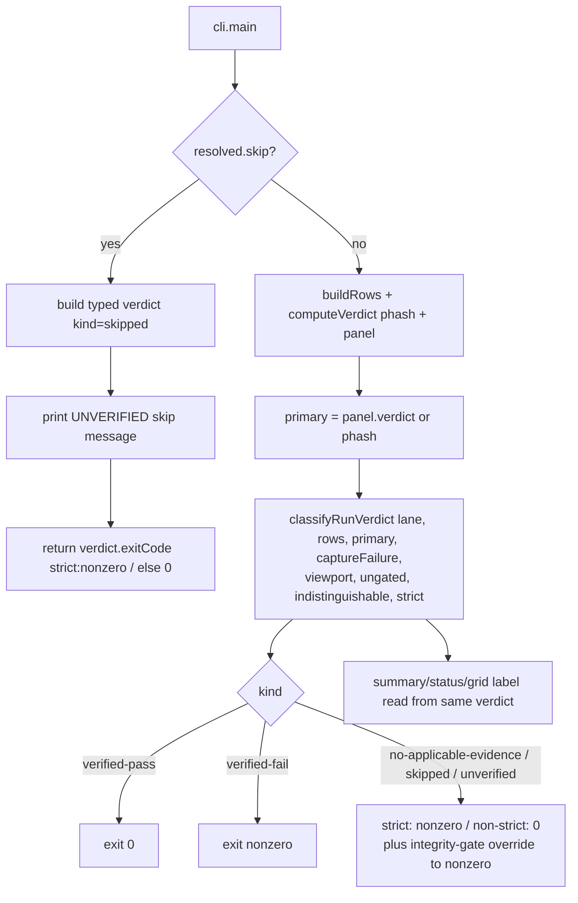

# Strict Device Verification Requires Verified Evidence - Plan

## Goal Capsule

- **Objective:** Make `verify-device --strict` fail closed unless at least one fresh, applicable device state was actually captured and verified and every required applicable state is covered — replacing the current truthy-default pass that lets empty, skipped-only, no-reference, no-applicable, and `--skip-device` runs report a verified success.
- **Authority:** Trello card `9l9Ploxe` is the source of truth. `tools/verify-device/src/verdict.mjs` is the canonical owner of the strict verdict contract (per the card's `Contract:` line and the board's `contract-ownership` lesson); the CLI and panel/summary consume that typed verdict, they do not re-declare pass/fail semantics.
- **Execution profile:** Bounded logic + test + docs work inside `tools/verify-device`; no PR, no merge, no device run required (the fix is pure JS glue + table-driven tests). Commit only.
- **Scope fence:** Touch only `tools/verify-device/src/verdict.mjs`, `tools/verify-device/cli.mjs`, `tools/verify-device/src/panel.mjs` (only if needed to source the shared typed verdict), `tools/verify-device/test/verdict.test.mjs` (and, if a CLI-level skip path is asserted, a narrow new/existing CLI test), and `tools/verify-device/README.md`.
- **Stop condition:** Stop and surface a blocker if making the typed verdict authoritative would require changing the row/summary/panel wire shapes consumed by other tools (`refcap-compare`, Portal) beyond additive fields, or if the "applicable state" definition cannot be derived from data already present in `compare.buildRows` output + the manifest without a new manifest field.

---

## Product Contract

### Summary

`verify-device` has two verdict surfaces today: `computeVerdict` (phash) and `aggregatePanel` (panel), both shaped `{pass, summary, states}`, plus `computeStrictExitCode` which turns a chosen `primary.pass` boolean and several sibling booleans into an exit code. Strict mode is meant to be the gate that only exits 0 when the real device rendered correctly. It does not currently do that:

1. `computeVerdict` sets `pass = fails.length === 0 && missing.length === 0`. An **empty** row set, a **skipped-only** set, and a **no-reference-only** set all contain zero fails and zero missing, so they report `pass: true` — a verified success derived from the absence of evidence.
2. The CLI graceful-skip path (`cli.mjs` ~276-283) prints the UNVERIFIED message and `return 0` **before** `computeStrictExitCode` is ever reached, so `--strict --skip-device` (and any device-absent run) exits 0 even though nothing was verified.
3. `computeStrictExitCode` requires a `device` lane and `primary.pass`, but never checks that at least one *applicable* state actually produced fresh, trusted, diffed device evidence — so a device-lane run that captured only skipped/no-reference states still passes strict.

The fix introduces a single **typed run verdict** owned by `verdict.mjs` that classifies every run into one of `verified-pass`, `verified-fail`, `skipped`, `unverified`, or `no-applicable-evidence`, and derives both the human-facing status/summary and the process exit code from that one typed value. Strict mode exits 0 only for `verified-pass`. A clearly labeled non-strict exploratory mode is preserved, but it is never represented as verified.

### Problem Frame

Strict device verification is the forcing function behind AGENTS.md #8/#9 ("a proxy is not verification", "name the concrete artifact that proves it"). A gate that returns 0 when *no evidence exists* is worse than no gate: it manufactures false "verified" signals for exactly the empty/skipped/skip-device cases a reviewer would reach for when the device is unavailable. The verdict must fail closed on absence of evidence and only pass on the presence of fresh, applicable, trusted device evidence covering every required state.

### Requirements

**Typed Verdict Contract (owner: `verdict.mjs`)**

- R1. `verdict.mjs` exports a typed run-verdict value with a discriminated `kind` covering exactly: `verified-pass`, `verified-fail`, `skipped`, `unverified`, `no-applicable-evidence`. The kind is derived from evidence, never from a truthy default.
- R2. An **applicable** state is defined as a state that has a trusted reference to diff against and is not excluded from judging — i.e. not `skipped` (refs manifest `skipJudging`/`at-rest:false`) and not `no-reference` (documented reference gap). The definition is derived from data already present in `compare.buildRows` row classification; no new manifest field is introduced.
- R3. `verified-pass` requires **all** of: the lane is a verified device lane; capture did not fail; there is **at least one** applicable state; **every** applicable state was device-captured (not `missing`) and passed its fidelity check; and no cross-cutting gate (ungated/blind captures, indistinguishable states, viewport-metric assertions) failed.
- R4. `verified-fail` is the classification when applicable evidence exists (≥1 applicable state and a verified device lane) but at least one applicable state failed, was missing, or a cross-cutting gate failed.
- R5. `no-applicable-evidence` is the classification when the row set is empty or contains zero applicable states (all skipped and/or no-reference), on any lane.
- R6. `skipped` is the classification when the device capture was skipped entirely (`--skip-device`, no device, no toolchain) so no captures were produced.
- R7. `unverified` is the classification when captures exist on a non-verified device lane (`browser`, `provided-captures`) — evidence exists but not from a trusted device.
- R8. The typed verdict carries a human-readable `summary`/`reason` string that names *why* it landed in its kind (e.g. `"no applicable device evidence: 0 of 3 states diffable"`), and the per-state breakdown, so the grid/stdout/summary and the exit code read from the same object.

**Strict / Non-strict Exit Semantics**

- R9. In `--strict` mode the process exits nonzero for every kind except `verified-pass`. Specifically empty, skipped-only, no-reference, no-applicable-state, browser/provided-captures lane, and `--skip-device` runs all exit nonzero.
- R10. A fully verified applicable pass (`verified-pass`) exits 0 in strict mode. A verified failure (`verified-fail`) exits nonzero.
- R11. Non-strict (exploratory) mode preserves today's behavior: it exits 0 for `skipped`, `unverified`, and `no-applicable-evidence`, and does not fail on fidelity `verified-fail` — **but** it still exits nonzero on the existing hard integrity gates (capture-runner failure, ungated/blind captures without `--allow-ungated`, indistinguishable states). Exploratory output is always labeled UNVERIFIED and never presented as verified.
- R12. The CLI graceful-skip path must route through the typed verdict instead of an unconditional `return 0`: a skip under `--strict` exits nonzero (kind `skipped`), a skip without `--strict` exits 0 with the existing clear UNVERIFIED message.

**Single Source of Truth**

- R13. The panel/summary status/label and the CLI exit code both derive from the one typed verdict. No new independent pass/fail boolean is introduced in the CLI to compute the exit; existing sibling signals (viewport, ungated, indistinguishable, capture failure) are folded into the typed verdict as inputs rather than remaining parallel exit-deciding booleans.
- R14. Backward-compatible wire shapes: `computeVerdict`'s existing `{pass, states, summary}` return and the panel verdict shape may gain additive fields but must not break `summary.json`, the grid, or `refcap-compare`/Portal consumers. If `computeStrictExitCode` is retained it becomes a thin derivation of the typed verdict (or is superseded by a typed-verdict accessor with updated call sites/tests).

**Tests and Documentation**

- R15. Table-driven tests in `verdict.test.mjs` cover every evidence composition (empty, skipped-only, no-reference-only, mixed applicable+skipped, all-applicable-pass, applicable-with-one-fail, applicable-with-one-missing) crossed with strict/non-strict, and each cross-cutting gate (capture failure, ungated, indistinguishable, viewport-fail). Each row asserts both the typed `kind` and the resulting exit code.
- R16. A test proves the `--skip-device` behavior contract: skip under strict → nonzero, skip without strict → 0. Prefer covering this at the verdict/typed-verdict boundary; add a narrow CLI-level assertion only if the strict-skip routing cannot be observed from the verdict function alone.
- R17. `README.md` states the **minimum proof contract** explicitly: what strict requires to exit 0 (≥1 applicable state, all applicable states captured and passed on a verified device lane, no failed gate), and that the exploratory (non-strict / skip / browser / provided-captures) mode is never a verified result.

### Acceptance Examples

- AE1. Given zero rows (or a rows set where every row is `skipped`/`no-reference`), when the run is strict, then the typed kind is `no-applicable-evidence` and the process exits nonzero.
- AE2. Given `--strict --skip-device`, when the run executes, then it prints the UNVERIFIED skip message, the typed kind is `skipped`, and the process exits nonzero.
- AE3. Given `--skip-device` without `--strict`, when the run executes, then it prints the UNVERIFIED skip message and exits 0 (exploratory, labeled unverified).
- AE4. Given a device-lane run where states `menu` and `level` are applicable and both diff under threshold and no gate fails, when the run is strict, then the typed kind is `verified-pass` and it exits 0.
- AE5. Given a device-lane run where `menu` passes but `win` is missing (never captured), when the run is strict, then the typed kind is `verified-fail` and it exits nonzero.
- AE6. Given a device-lane run where `menu` is applicable and passes but `fail` is `skipped` (refs `at-rest:false`), when the run is strict, then the typed kind is `verified-pass` (skipped states are excluded from the applicable set, and ≥1 applicable state was verified).
- AE7. Given a `--lane browser` run where every applicable state passes, when the run is strict, then the typed kind is `unverified` and it exits nonzero; without `--strict` it exits 0 and is labeled DEVICE-UNVERIFIED.
- AE8. Given a device-lane verified-pass on fidelity but one state was captured blind (ungated) without `--allow-ungated`, when the run is strict or non-strict, then it exits nonzero (existing integrity gate folded into the typed verdict).

### Scope Boundaries

**In scope**

- `tools/verify-device/src/verdict.mjs` — the typed run verdict + strict/non-strict exit derivation (canonical owner).
- `tools/verify-device/cli.mjs` — route the graceful-skip path and the final exit through the typed verdict; stop pre-returning 0 on skip under strict; feed the existing sibling signals in as verdict inputs.
- `tools/verify-device/src/panel.mjs` — only if the shared typed status/label must be sourced here; prefer leaving panel aggregation as-is and composing the run verdict in `verdict.mjs`.
- `tools/verify-device/test/verdict.test.mjs` — table-driven coverage (and a narrow CLI skip-path test only if R16 needs it).
- `tools/verify-device/README.md` — minimum proof contract.

**Out of scope**

- No changes to the device capture drivers (`steps.mjs`, `androidDriver.mjs`, `browserLane.mjs`, `attachments.mjs`), the image codec/diff (`refcap-compare`), or the vision panel scoring math.
- No new manifest field; "applicable" is derived from existing row classification.
- No change to `summary.json`/grid/Portal wire shapes beyond additive fields.
- No new dependency, no PR, no merge, no device run, no threshold retuning.

---

## Planning Contract

### Key Technical Decisions

- KTD1. **One typed verdict, five kinds, derived last.** Add a function in `verdict.mjs` (e.g. `classifyRunVerdict({ lane, rows, primary, captureFailure, viewportMetricsPass, ungatedCaptureStates, allowUngated, indistinguishableStatePairs, skipReason, strict })`) returning `{ kind, exitCode, summary, applicableCount, coverageGaps, states }`. It is the last thing computed and the only thing the CLI exit reads. This satisfies R13/AC-series without scattering booleans.
- KTD2. **Applicability comes from the phash row classification, fidelity comes from `primary`.** `computeVerdict`/`classify` already labels each state `pass|fail|missing|skipped|no-reference`. The applicable set = states classified `pass|fail|missing` (they have a trusted reference). `verified-pass` needs applicable set non-empty, no `missing` in it, and `primary.pass` true. Using the row classification for structure and `primary` (panel when present, else phash) for the fidelity decision avoids a second fidelity computation and keeps panel/phash as the fidelity authority. Reconcile the two only where panel `states` and phash rows disagree on presence; prefer the phash row classification for the missing/skipped/no-reference structural facts.
- KTD3. **Fix the fail-open at the source too.** Change `computeVerdict` so `pass` is not `true` on an empty/skipped-only/no-reference-only set — either by exposing an explicit `applicableCount`/`hasApplicable` field the run verdict consumes, or by making `pass` require `applicableCount > 0`. Preserve the existing per-state statuses and the existing tests' intent (a `no-reference` state alongside a real pass must not, by itself, fail the *phash* advisory number — but the *run* verdict must still refuse `verified-pass` when there is no applicable evidence at all). Encode the run-level requirement in the typed verdict, and add `hasApplicable`/`applicableCount` to `computeVerdict`'s output so the truthy-default is removed without overloading the advisory phash number's meaning.
- KTD4. **Strict-skip routing in the CLI.** Replace the unconditional `return 0` in the skip branch with: build a `skipped` typed verdict, print the existing UNVERIFIED message, and `return verdict.exitCode` (nonzero under strict, 0 otherwise). This is the direct fix for the reported `--strict --skip-device` bug.
- KTD5. **Keep `computeStrictExitCode` as a thin adapter or retire it with call-site updates.** To minimize churn and keep the existing strict-lane tests meaningful, prefer keeping `computeStrictExitCode` as a function that internally delegates to the typed verdict (or is re-expressed in terms of it). If it is retired, update `cli.mjs` and `verdict.test.mjs` call sites in the same change so there are no divergent exit booleans left (R13).
- KTD6. **Exploratory labeling stays truthful.** The stdout `laneNote`/skip message and the grid banner already say DEVICE-UNVERIFIED / DEVICE-PROVENANCE-UNVERIFIED for browser/provided-captures/skip. Ensure the typed verdict's `unverified`/`skipped`/`no-applicable-evidence` summaries reinforce that and that non-strict exit 0 never prints "verified".

### High-Level Technical Design

Direction is authoritative on ordering: the run verdict is computed once from all inputs, and both the printed status and the returned exit code read from it. Applicability (structure) is sourced from the phash row classification; the fidelity pass/fail is sourced from `primary`; the integrity gates (capture failure, ungated, indistinguishable, viewport) are inputs that can force `verified-fail`/nonzero even in non-strict mode, exactly as today.

### Assumptions

- `compare.buildRows` output continues to classify states such that `classify()` can distinguish `pass|fail|missing|skipped|no-reference` (verified against `verdict.mjs:53-89` and `verdict.test.mjs` row factories).
- `primary = panel.verdict || phashVerdict` remains the fidelity authority; when the panel is skipped the run can still be `verified-pass` on phash if the device lane and applicable-coverage requirements hold (the panel-skip means fidelity is *advisory*, but the card's contract is about evidence *presence/coverage*, not about forcing the panel to run). If the card intent is that a skipped panel must also block strict `verified-pass`, that is a one-line tightening in `classifyRunVerdict`; call it out at implementation and confirm against the card rather than guessing — default to the coverage-based reading above and note the toggle.
- No consumer of `computeVerdict`/panel verdict outside `tools/verify-device` depends on the empty/skipped-only set returning `pass:true`; additive fields are safe.
- The change is pure logic; the conductor does not need a device run to verify it — unit tests exercise every composition.

### Sources and Research

- `tools/verify-device/src/verdict.mjs:15-89` — `computeVerdict` (the `pass = fails===0 && missing===0` fail-open), `computeStrictExitCode`, `isVerifiedDeviceLane`, and `classify` (the per-state status source).
- `tools/verify-device/cli.mjs:276-283` — the graceful-skip `return 0` that precedes `computeStrictExitCode`; `cli.mjs:389-391` (`primary` selection); `cli.mjs:444-453` (the current `computeStrictExitCode` call with sibling booleans).
- `tools/verify-device/test/verdict.test.mjs` — existing row factories (`passRow`, `missingRow`, `noRefRow`, `skippedRow`) and the strict/advisory exit-semantics blocks to extend into the table-driven suite.
- `tools/verify-device/src/summary.mjs:29-56,156-171` — `buildSummary` and `ungatedCaptureStates` (how per-state verdict/status flows into `summary.json`; keep additive).
- `tools/verify-device/src/panel.mjs:206-209,383` — `aggregatePanel` returns `{pass, summary, states, score}`, the panel side of `primary`.
- `tools/verify-device/README.md:54-71,296-331` — gating/degrade prose + Flags + Verify sections to update with the minimum proof contract.
- Board lesson `contract-ownership` + card `Contract:` line — `verdict.mjs` owns the strict verdict; consumers import it and do not re-declare pass/fail.

---

## Implementation Units

### U1. Introduce the typed run verdict in `verdict.mjs`

- **Goal:** A single typed run-verdict value with five kinds derived from evidence, plus an applicability accessor that removes the truthy default.
- **Requirements:** R1, R2, R3, R4, R5, R6, R7, R8, R13, R14.
- **Dependencies:** None.
- **Files:** `tools/verify-device/src/verdict.mjs`, `tools/verify-device/test/verdict.test.mjs`.
- **Approach:** Add `classifyRunVerdict(...)` returning `{ kind, exitCode, summary, applicableCount, coverageGaps, states }`. Compute the applicable set from the phash per-state classification (`pass|fail|missing` = has trusted reference; `skipped|no-reference` = excluded). Add `hasApplicable`/`applicableCount` to `computeVerdict`'s output and stop `computeVerdict.pass` from being `true` when `applicableCount === 0`. Fold `captureFailure`, `ungatedCaptureStates`+`allowUngated`, `indistinguishableStatePairs`, and `viewportMetricsPass` in as inputs that can force `verified-fail`/nonzero. Re-express `computeStrictExitCode` as a thin delegator to `classifyRunVerdict` (or retire it and update call sites in U3/tests).
- **Patterns to follow:** Existing `classify()` status taxonomy, `isVerifiedDeviceLane`, and the current `computeStrictExitCode` gate ordering (integrity gates first, then strict/lane, then fidelity).
- **Test scenarios:** Covered exhaustively in U4; here just ensure the function compiles and the five kinds are reachable.
- **Verification:** `verdict.test.mjs` (extended in U4) is the proof; typecheck/lint clean.

### U2. Route the CLI skip path and final exit through the typed verdict

- **Goal:** `--strict --skip-device` (and any device-absent run under strict) exits nonzero; non-strict skip still exits 0; the final CLI exit reads only the typed verdict.
- **Requirements:** R9, R10, R11, R12, R13.
- **Dependencies:** U1.
- **Files:** `tools/verify-device/cli.mjs`.
- **Approach:** Replace the skip branch's `return 0` with a `skipped` typed verdict (`classifyRunVerdict({ kind-driving skipReason, strict, lane })`), keep the existing three-line UNVERIFIED message, and `return verdict.exitCode`. At the end of `main()`, replace the `computeStrictExitCode({...})` call with `classifyRunVerdict({...})` (or the retained thin adapter), passing `rows`, `primary`, `lane`, `captureFailure`, `viewportMetricsPass`, `blindCaptureStates`, `allowUngated`, `indistinguishableStates.blockingPairs`, and `strict`. Ensure the printed `verdict (...)` line and lane notes reflect the typed kind (labels stay truthful per KTD6).
- **Patterns to follow:** Current skip branch (`cli.mjs:276-283`) and final `computeStrictExitCode` call (`cli.mjs:444-453`); `laneNote` truthful labeling (`cli.mjs:399-403`).
- **Test scenarios:** Skip-under-strict → nonzero and skip-without-strict → 0 (U4/R16). If not observable from the verdict function alone, add a narrow CLI test that invokes the skip branch.
- **Verification:** Manual `node tools/verify-device/cli.mjs --game <g> --skip-device --strict` exits nonzero and `--skip-device` (no strict) exits 0; plus the table tests.

### U3. Reconcile call sites and keep wire shapes additive

- **Goal:** No divergent exit booleans remain; existing consumers (`summary.json`, grid, `refcap-compare`, Portal) keep working.
- **Requirements:** R13, R14.
- **Dependencies:** U1, U2.
- **Files:** `tools/verify-device/cli.mjs`, `tools/verify-device/src/panel.mjs` (only if the shared status label is sourced there), `tools/verify-device/test/verdict.test.mjs`.
- **Approach:** Ensure `buildSummary`/grid still receive the fields they read (`state.status`/`verdict`); only add fields. If `computeStrictExitCode` is retired, update its remaining references and the `verdict.test.mjs` `computeStrictExitCode(...)` expectations to the new API in the same commit so the suite stays green and meaningful. Grep for all importers of `computeStrictExitCode`/`computeVerdict` to confirm no external adaptation is needed.
- **Patterns to follow:** `summary.mjs` additive `{score, majorConsensusCount, verdict}` shape; existing import graph in `cli.mjs`.
- **Test scenarios:** Existing `panel.test.mjs`, `summary.test.mjs`, `grid.test.mjs` still pass unchanged.
- **Verification:** Full `npm run test:unit -w @fabrikav2/verify-device` green; `git grep computeStrictExitCode` shows only updated call sites.

### U4. Table-driven verdict tests for every composition

- **Goal:** Prove all evidence compositions × strict/non-strict × integrity gates land in the right kind and exit code.
- **Requirements:** R15, R16, and all AEs.
- **Dependencies:** U1, U2, U3.
- **Files:** `tools/verify-device/test/verdict.test.mjs`.
- **Approach:** Add a `describe` with a table of cases: `[]` (empty), `[skippedRow]` only, `[noRefRow]` only, `[passRow, skippedRow]`, `[passRow, passRow]`, `[passRow, missingRow]`, `[passRow, failRow]`, each under `strict:true|false`, and each cross-cutting gate (`captureFailure`, `ungatedCaptureStates` ±`allowUngated`, `indistinguishableStatePairs`, `viewportMetricsPass:false`), plus lane variants (`device|browser|provided-captures`). Assert `{kind, exitCode}` per row. Add the two `--skip-device` contract cases (strict→nonzero, non-strict→0). Reuse/extend the existing row factories; add a `failRow` factory.
- **Patterns to follow:** Existing `verdict.test.mjs` structure and row factories; table-driven `it.each` style.
- **Test scenarios:** Enumerated above; each AE1–AE8 has a corresponding row.
- **Verification:** `npm run test:unit -w @fabrikav2/verify-device` passes with the new table; every listed composition has an assertion.

### U5. Document the minimum proof contract

- **Goal:** README states exactly what strict requires and that exploratory mode is never verified.
- **Requirements:** R17.
- **Dependencies:** U1–U4.
- **Files:** `tools/verify-device/README.md`.
- **Approach:** In the "Gating / graceful degrade" and Flags/`--strict` prose, state: strict exits 0 only when ≥1 applicable state exists, every applicable state was device-captured and passed on a verified device lane, and no integrity gate failed; empty/skipped-only/no-reference/no-applicable/`--skip-device`/browser/provided-captures all exit nonzero under strict; non-strict is exploratory and always labeled UNVERIFIED. Name the five verdict kinds.
- **Patterns to follow:** Existing README §"Gating / graceful degrade" and §Flags tone.
- **Test scenarios:** N/A (docs); consistency checked against implemented behavior.
- **Verification:** README diff matches the shipped strict semantics; no stale "exits 0" claim for skip-under-strict remains.

---

## Verification Contract

| Gate | Command or Evidence | Proves |
|---|---|---|
| Package unit tests | `npm run test:unit -w @fabrikav2/verify-device` | Typed verdict, every evidence composition, strict/non-strict, integrity gates, and the `--skip-device` contract behave per AC1–AC8. |
| Package typecheck/lint | `npm run typecheck -w @fabrikav2/verify-device` (if present) + `npm run lint -w @fabrikav2/verify-device` / `npx eslint tools/verify-device` | No type/lint regressions from the new verdict API. |
| Root unit + audit | root `npm run test:unit` and `npm run audit` (per card Verification line) | The change doesn't break the workspace or violate repo audit rules. |
| Skip-path exit codes | `node tools/verify-device/cli.mjs --game <g> --skip-device --strict; echo $?` (nonzero) and `... --skip-device; echo $?` (0) | The reported `--strict --skip-device` exits-0 bug is fixed and non-strict skip still degrades gracefully. |
| Scope audit | `git diff --name-only` | Changes limited to `verdict.mjs`, `cli.mjs`, `panel.mjs` (if needed), `verdict.test.mjs` (+ narrow CLI test if used), `README.md`, and this plan. |
| No divergent booleans | `git grep -n computeStrictExitCode tools/verify-device` | Exit code derives from the single typed verdict; any retained adapter delegates to it. |

---

## Definition of Done

- `verdict.mjs` exports a typed run verdict with kinds `verified-pass`, `verified-fail`, `skipped`, `unverified`, `no-applicable-evidence`, derived from evidence with no truthy default.
- `computeVerdict` no longer reports `pass: true` for empty, skipped-only, or no-reference-only row sets (via an applicability accessor the run verdict consumes).
- Strict mode exits nonzero for empty, skipped-only, no-reference, no-applicable-state, browser/provided-captures lane, and `--skip-device`; exits 0 only for a fully verified applicable pass; exits nonzero for verified failures.
- The CLI skip branch and final exit both derive from the typed verdict; `--strict --skip-device` exits nonzero, `--skip-device` without strict exits 0 with the UNVERIFIED message.
- Panel/summary status and CLI exit read from the same typed verdict; no parallel exit-deciding boolean remains (any retained `computeStrictExitCode` is a thin delegator).
- Table-driven `verdict.test.mjs` covers all evidence compositions × strict/non-strict × integrity gates and the two skip-path cases; `npm run test:unit -w @fabrikav2/verify-device` passes.
- Package typecheck/lint and root unit/audit pass.
- `README.md` states the minimum proof contract and names the five kinds; no stale skip-exits-0-under-strict claim remains.
- No PR opened, no merge, no device run required; commit only; changes stay within the scoped files aside from this plan artifact.
