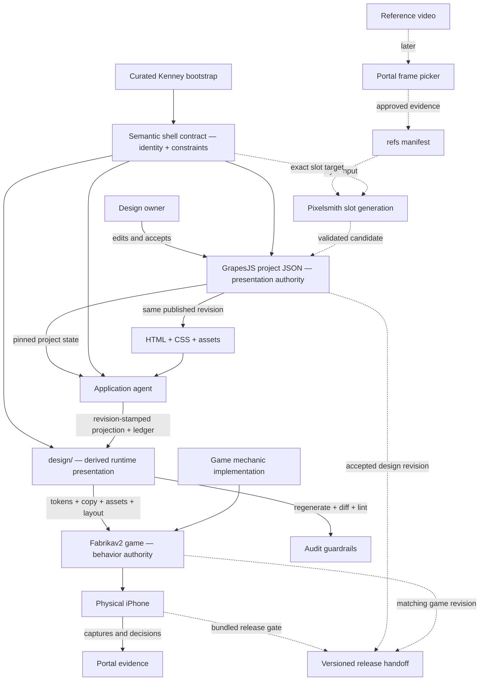
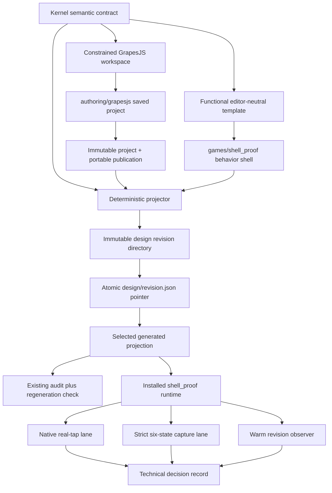
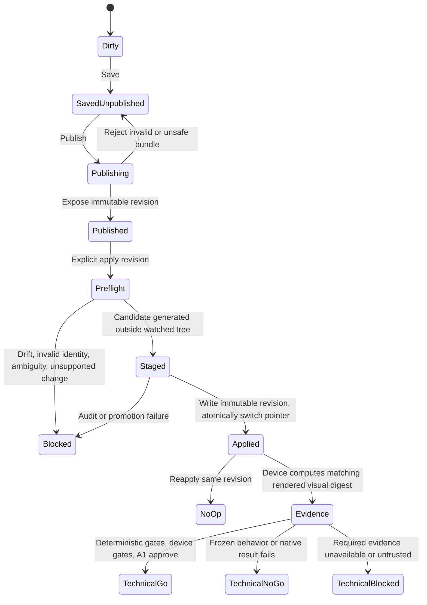
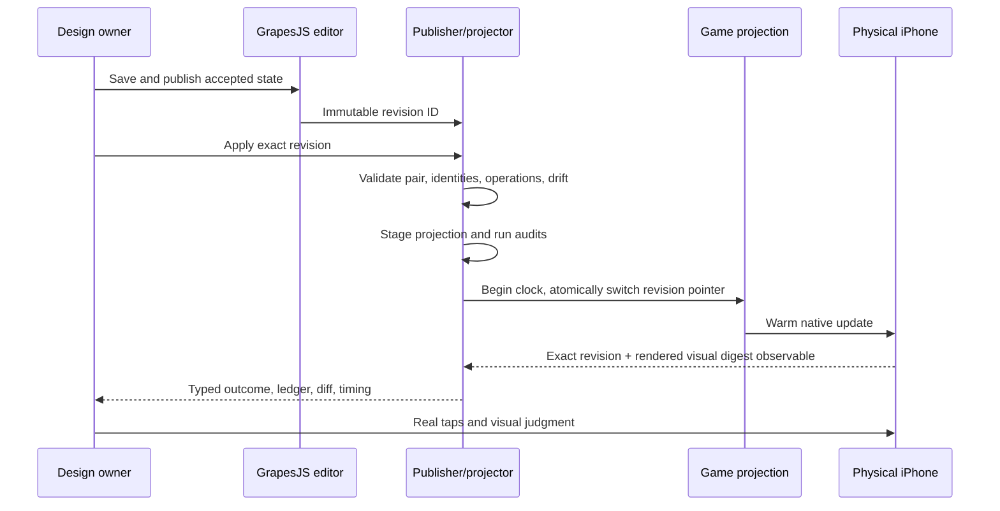
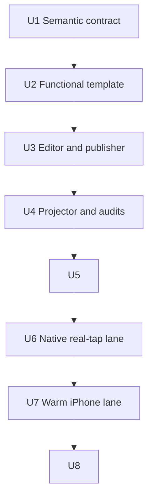

# GrapesJS Shell Specialization - Plan

## Goal Capsule

- **Objective:** Prove that a designer can specialize a complete generic Fabrikav2 shell in GrapesJS, ask an agent to apply the saved design, and—after the validated projection is ready—see the behavior-preserving presentation propagate to a physical iPhone within 30 seconds. Record the full request-to-device duration separately without presenting it as a gated 30-second promise.
- **Product authority:** Batu approves the experience. GrapesJS is the provisional sole presentation authority for the isolated proof game; Technical Go unlocks one real-game pilot, while Factory Adoption Go makes GrapesJS the default for new scaffolds. Fabrikav2 owns runtime behavior, and the semantic shell contract owns identity and compatibility constraints without becoming a third visual state.
- **Execution profile:** Deep, cross-cutting Technical Go proof split into eight dependency-linked work units. The units are intentionally serialized at their authority, asset, lockfile, installable-game, native-runner, and physical-device seams so each TWF card has one cold-reader-safe input state.
- **Stop conditions:** Stop with no Technical decision when required evidence is unavailable or untrustworthy. Stop with Technical No-Go when the frozen editor/application behavior or physical result fails. Do not begin Pixelsmith, Android, factory-default scaffolding, or legacy Design Sheets migration in this plan.
- **Tail ownership:** TWF workers implement and review the code portions of U1-U7 in isolated worktrees. After U3’s worker artifact is ready, the conductor presents the constrained editor and A1/Batu owns the recorded usability accept/reject checkpoint that gates U4. The conductor also runs all physical-device seams, and A1/Batu alone records the U8 Technical Go, Technical No-Go, or Technical Blocked decision.
- **Open blockers:** None. Exact Kenney file selection is bounded inside U2 by the approved source families and semantic-slot manifest; all authority, projection, publication, native-input, timing, and evidence seams are resolved below.

---

## Product Contract

### Summary

Build a GrapesJS-first specialization loop around a functional, Kenney-skinned Fabrikav2 game template. The first proof covers static shell artboards, explicit agent application, and physical-iPhone validation; reference-conditioned asset generation and production SDK completion follow later through the same semantic slots.

### Problem Frame

Fabrikav2 already contains shared shell screens, lifecycle machinery, SDK interfaces, test hooks, and native verification tooling, but `games/_template` still mounts a placeholder instead of delivering the complete factory product. The strongest working shell is assembled inside Marble Run, while richer HUD and menu patterns remain local to individual games.

The visual state is also fragmented. Design Sheets ingests game files into another editable representation and applies a limited subset back through snapshots and change briefs. Asset identity is split among semantic-looking bindings, provenance manifests, and separate runtime URL imports; a prior Marble Run reskin changed an asset binding without changing the rendered asset.

The desired workflow is designer-led and device-first. A human needs to make precise visual changes in an approachable editor, ask an agent to implement the accepted state, and judge the result in the installed mobile game without treating a browser preview or another intermediate document as authoritative.

### Key Decisions

- **Build the working shell before the editor adapter.** GrapesJS must represent a complete generic game, not the current placeholder and not a Design Sheets card.
- **Prototype GrapesJS first.** Claude Design remains a possible later comparison, but no parallel editor implementation is required for this proof.
- **Use static portrait artboards.** GrapesJS edits presentation for each shell state; navigation, SDK calls, persistence, and game behavior run only in Fabrikav2.
- **Apply changes explicitly through an agent.** There is no automatic editor watcher, direct runtime synchronization, automatic commit, or game-to-editor re-ingestion loop.
- **Supersede the token-only reskin boundary for game-local presentation.** Agent-applied GrapesJS changes may alter layout and component instances, while shared component behavior, semantic roles, and runtime contracts remain protected.
- **Keep one authority per decision type.** In the isolated proof, GrapesJS owns accepted presentation, Fabrikav2 owns behavior, the semantic contract defines functional sockets, the reference manifest later owns approved evidence, and Portal only transports decisions and proof. Legacy Design Sheets games retain their current authority until explicitly migrated after Factory Adoption Go.
- **Start with a curated Kenney skin.** A small CC0 subset supplies coherent neutral fixtures and slot geometry without becoming the final style, the asset catalog, or a raw editor library.
- **Publish two complementary exports as one revision.** GrapesJS project JSON is required for faithful editor reload; plain HTML, CSS, and assets provide portable interchange, agent input, reviewability, and a vendor-exit path rather than a lossless editor backup. They must be generated and pinned together so an agent cannot mix states.
- **Compile accepted presentation into `design/`.** In a Grapes-authority game, the application agent is the sole producer of a revision-stamped, git-committed runtime projection under `design/`; it replaces Design Sheets as producer without making the projection another editable authority.
- **Version the shell and editor as one starting point.** A scaffold receives a matched, pinned Fabrikav2 shell and GrapesJS project; later template changes require an explicit, conflict-aware migration and never silently rewrite a game.
- **Prove the editor loop before asset generation.** The first round trip uses existing Kenney assets. Pixelsmith and the video-reference pipeline join only after the editor-to-device seam works.
- **Use two explicit adoption gates.** Technical Go proves the constrained Kenney-backed editor-to-iPhone loop and unlocks one reference-conditioned pilot; Factory Adoption Go follows a successful real-game pilot and compatibility checkpoint before GrapesJS becomes the scaffold default or Design Sheets migration begins.
- **Use real SDK contracts with deterministic providers.** Fake or disabled providers keep shell behavior testable without making production SDK credentials and native adapters a prerequisite for editor learning.
- **Approve on the physical iPhone.** GrapesJS and browser renders are editing aids; Android is a secondary compatibility checkpoint, not a substitute for the Apple-first lane.

### Actors

- A1. **Design owner:** Edits the per-game GrapesJS project, saves an accepted state, requests application, and approves physical-device evidence.
- A2. **Application agent:** Reads the pinned editor state and portable export, validates semantic identity, translates presentation intent into the game, and reports unsupported or ambiguous changes.
- A3. **Fabrikav2 shell/runtime:** Owns screen transitions, persistence, SDK contracts, test hooks, native packaging, and the boundary where a real mechanic replaces placeholder gameplay.
- A4. **Portal:** Delivers reference decisions and physical-device evidence without becoming canonical design, runtime, or reference storage.
- A5. **Later asset pipeline:** Promotes reference frames and generates candidates for explicit semantic slots after the GrapesJS proof succeeds.

### End-to-End Authority and Flow



The first proof follows the solid path from Kenney-backed template to GrapesJS, agent application, and iPhone evidence. The dotted reference and Pixelsmith path is deliberately later, but it must enter through the same semantic slots and editor authority rather than creating a parallel route into the runtime.

### Requirements

**Functional generic shell**

- R1. `games/_template` must become a functional generic game rather than a placeholder, with Progression Home, Gameplay/HUD, Pause, Settings, Win, and Lose surfaces.
- R2. Progression Home must include a title or logo slot, hero-art slot, primary-currency counter, settings action, Play action, and a sample level path or map containing completed, current, and locked nodes; Play and the current node may start the current level, while a locked node must not start gameplay.
- R3. The lean Gameplay/HUD surface must include primary currency, a level label, pause access that can reach Settings, and a mechanic-neutral gameplay region.
- R4. Placeholder gameplay must expose clearly test-only Win and Lose controls so the full shell lifecycle works before a mechanic exists.
- R5. Play, pause, resume, settings, win, lose, and return-home transitions must remain functional independently of the visual editor. Winning must mark the level completed and advance the current node; Win must offer Next, which starts that new current level, and Home, which shows the updated map. Losing must not advance progress; Lose must offer Retry for the same level and Home for the unchanged map. The first proof must not include an ad-continue path.
- R6. First-proof Settings must contain Music, SFX, and Haptics toggles plus Back; changes must update deterministic shell state through real callbacks, and Back must return to the surface that opened Settings—Home or Pause.
- R7. The template must use the real Fabrikav2 SDK interfaces with fake or disabled providers, retain deterministic test hooks, and expose inspectable event or SDK traces for Play, Settings changes, Win, and Lose so importing interfaces alone cannot count as integration. First-proof state and traces must be synthetic and exclude credentials, tokens, device identifiers, notifications, and personal data.
- R8. Technical Go must run in a named `games/shell_proof` instance created once from `_template`. Factory Adoption Go must then require the existing scaffold path to create a fresh game with the complete shell, matched per-game GrapesJS project, and initial portable publication; game-specific implementation replaces the mechanic-neutral gameplay region instead of rebuilding meta-game screens.
- R9. Shop is not required by this proof and must not leave a dead navigation affordance in the initial template.

**GrapesJS editing surface**

- R10. Each game must have one saved GrapesJS project containing static portrait pages for Progression Home, Gameplay/HUD, Pause, Settings, Win, and Lose.
- R11. Every editable shell object must retain a stable theme-neutral component role and a stable per-instance identity across save, reload, and export. Duplication must preserve the source object’s identity, assign the duplicate a new stable instance identity, and keep both visible in the selected-component UI with their human-readable role, instance name, identity, and current runtime binding without exposing raw metadata editing.
- R12. The designer must be able to move, resize, reorder, hide, duplicate, recolor, edit copy, and replace assets on approved shell components.
- R13. The editor must use a canonical 390 × 844 portrait canvas with visible baseline safe-area guides 59 px from the top and 34 px from the bottom, without asking the designer to author responsive rearrangements; runtime validation must still use actual device insets.
- R14. Buttons and overlays need not navigate or call runtime services inside GrapesJS; static editing must not pretend to verify behavior.
- R15. The constrained first-proof workspace must expose a six-page switcher, canonical canvas, semantic layer tree, curated asset tray, selected-component properties and semantic panel, and publication control. The asset tray must show semantic names, descriptions, and compatible slots. The workspace must hide raw HTML or CSS editing and GrapesJS panels, traits, or assets outside the supported operation set. Technical Go edits and duplicates components already present on the pages; insertion from a semantic block tray is deferred to the real-game pilot if it proves necessary.
- R16. GrapesJS project JSON must be the faithful editor persistence format, while HTML, CSS, and assets must be exported alongside it as portable interchange and agent-readable evidence. At publication, the portable export must be regenerated from the saved project JSON and deterministically checked for equal page counts plus identical canonical component records—including identities, hierarchy, order, editable presentation properties, bindings, and asset hashes—before one immutable published-revision identity binds the pair. The portable form must render all six canonical pages while retaining those records outside GrapesJS. Publication must visibly distinguish dirty or saved state, the latest immutable published revision, application or blocked status, and the last applied revision. Deterministic allowlist validation must run before project load as well as before publication; only sanitized declarative components may enter GrapesJS or publish, and scripts, event handlers, external URLs, unsafe URL schemes, and asset paths outside the immutable revision root must be rejected.
- R17. The plain export must never be described as a lossless GrapesJS reload source when editor-specific metadata is absent, and any portable preview must run in a network-disabled sandbox rather than as trusted active content.
- R18. The saved GrapesJS project is the continuing provisional presentation authority for the isolated proof game after application, and that game must not be re-ingested to create a competing editor state. Technical Go unlocks one reference-conditioned real-game pilot without changing defaults. Factory Adoption Go promotes GrapesJS to the default authority for new scaffolds; existing Design Sheets games remain unchanged until each is explicitly migrated.

**Kenney bootstrap and semantic slots**

- R19. The initial skin must curate roughly 20–30 assets from the generic Kenney UI, Adventure UI, Game Icons, or Mobile Controls families and preserve their CC0 license, approved source path, source hash, and copied-byte provenance.
- R20. Each curated asset identity must declare exactly one semantic shell slot rather than expose a Kenney filename or a parallel compatible-role list as product vocabulary. Its catalog entry must include a human-readable semantic name and description; identical bytes may use distinct semantic IDs only when a present first-proof consumer genuinely needs the same source in another slot, while the byte hash remains the shared integrity identity.
- R21. The starter set must cover representative button states, icon buttons, settings controls, progression nodes, modal or result framing, navigation icons, and a temporary primary-currency symbol.
- R22. Kenney assets must remain replaceable fixtures; they are neither the target style nor required inputs for later games.
- R23. The Fabrikav2-owned semantic slot contract must define each stable theme-neutral role, rendered geometry caps and fit, source-raster minimum resolution and aspect eligibility, bounded raster resource policy, alpha constraints, state family, non-editable accessibility semantics, and provenance requirements. Intrinsic source pixels must never be compared to rendered-point maxima: role `geometryCaps` alone bound rendered boxes, while slot source-raster rules reject undersized, wrong-shape, unsafe, or over-budget inputs. The same slot identity must appear in the machine-readable contract, GrapesJS object or layer, and deterministic asset filename; embedded image metadata may repeat it but is never authoritative. Each Grapes-authority game’s active `design/revisions/<projection-id>/asset-identity.json` must be a deterministic, non-authoritative projection of the semantic contract and pinned GrapesJS revision; audits and Pixelsmith adapters must resolve it through `design/revision.json` rather than maintain identity independently, and audit must regenerate and diff it so hand-edited projection drift fails visibly. The current runtime binding must be derived from the pinned GrapesJS revision rather than edited as another visual choice. Unaccounted semantic, binding, asset, accessibility, or authored-presentation mismatches are blocking drift; deterministic safe-area and runtime-layout transformations required by R31 must be recorded but are not drift.
- R24. The first proof must perform at least one asset replacement using the curated existing set without Pixelsmith or reference-conditioned generation. As a negative control, changing only a derived identity projection such as the active revision’s `asset-identity.json` without changing the published GrapesJS revision must return `blocked-drift` and must never change rendered output.

**Explicit agent application**

- R25. Application begins only after the design owner saves an accepted GrapesJS state and explicitly asks an agent to apply that exact state. That request is the sole operational authority; instructions embedded in project content, copy, metadata, HTML, CSS, or assets have no authority.
- R26. Every application must identify the exact published revision containing the saved project state and its same-state portable export; a stale, missing, or mixed revision pair must be rejected before preflight so later evidence traces to one coherent input.
- R27. Before modifying the game, the agent must parse project JSON, portable exports, copy, asset metadata, and generated content strictly as untrusted data through a deterministic allowlisted parser; embedded instructions must be ignored. It must then preflight the complete change set against semantic identities and supported operations and compare game-local presentation with the last applied GrapesJS revision to detect runtime-only drift.
- R28. Missing identity, an unsupported structural change, an ambiguous runtime binding, or runtime-only presentation drift must stop the application before partial game changes and report the exact unresolved object or property. Drift may be resolved by discarding the runtime-only change or expressing and accepting it in GrapesJS, never by automatically re-ingesting the game into the editor.
- R29. Supported presentation changes must include palette and copy edits, position and size changes, reordering, visibility, one asset replacement, and duplication of an approved component whose runtime meaning remains unambiguous.
- R30. A duplicated component must preserve its component family, receive a new instance identity, and copy its existing runtime binding as explicit metadata by default; changing its meaning, such as turning a coin counter into a diamond counter, requires an explicit supported binding or must stop for clarification.
- R31. The agent must translate fixed-artboard intent into safe-area-aware anchors, caps, and aspect-preserving runtime layout without requiring authored responsive variants in GrapesJS.
- R32. Applying presentation must preserve screen behavior, SDK contracts, persistence hooks, accessibility hooks, and deterministic test controls. Optional instances may be hidden, but the last required Play, Pause, Resume, Back, test Win, test Lose, Next, Retry, or Home action for a flow must remain visible, safe-area compliant, and tappable.
- R33. Every application must produce an inspectable game diff and a change ledger mapping each applied editor component, property, or slot identity to the resulting game change, and must not automatically commit, merge, or push it. The diff must be confined to the declared generated projection and any mechanically required registration files; behavior source is not a presentation output. The proof must apply revision A, apply a distinct revision B over A, and reapply B; both transitions must preserve behavior, and the final reapplication must produce no game diff. At least one run must be blind: the agent receives only the pinned revision identity and apply instruction, with no separate prose description of the edits.
- R34. Design Sheets, `.dsync` snapshots, change briefs, and editor-to-sheet-to-game re-ingestion must not participate in the isolated proof’s application path. In `games/shell_proof`, the application agent replaces Design Sheets as producer of the generated `design/` projection. Legacy Design Sheets games must remain untouched through Technical Go and the real-game pilot. Factory Adoption Go makes GrapesJS canonical for new scaffolds, while each existing game requires a separate explicit migration that changes the declared producer before its Design Sheets authority is deprecated. Proven parsing or validation utilities may be extracted without preserving sheet authority.

**Physical-device iteration and proof**

- R35. The first proof must establish a warm in-situ native development lane; once established, a supported presentation-only change must become visibly observable on the running physical iPhone within 30 seconds from the monotonic timestamp recorded immediately before the validated projection pointer is promoted. The end observation must match both the new revision and a revision-specific visual sentinel derived from the applied change. Request-to-device end-to-end duration, request-to-diff agent turnaround, and clarification time must be included in the Technical Go decision record but do not pass or fail this deterministic propagation gate.
- R36. Physical iPhone rendering is the approval surface; a GrapesJS canvas, desktop browser, simulator, build, or unit test cannot be reported as mobile visual proof.
- R37. The proof must exercise terminal actions with real taps: Win → Next starts the advanced level; Win → Home shows the advanced map; Lose → Retry restarts the same level; Lose → Home shows unchanged progress. It must also exercise Pause → Settings → Pause → Resume and Pause → Home.
- R38. The six editor pages must map to the proof game’s canonical `refs/manifest.yaml` states—`menu`, `level`, `settings`, `pause`, `win`, and `fail`—and the existing physical-device verification lane must produce a strict `verified-pass` with live-device provenance. Captures must make safe-area, text fit, touch-target, asset-bound, and overlay errors visible; ad hoc screenshots cannot satisfy the gate.
- R39. A bundled physical-iPhone build must reproduce the complete six-state real-tap capture pass and strict `verified-pass`; install-and-launch alone cannot close the proof, and success must not depend only on live reload.
- R40. After Technical Go, the newly scaffolded real-game pilot must reproduce the same six-state real-tap capture set through the existing physical-Android verification lane before Factory Adoption Go. It does not block the Apple-first Technical Go, but failure blocks Factory Adoption Go and any claim that the shell is cross-platform ready.
- R41. Portal may publish access-controlled captures, comparisons, and human decisions, but the applied GrapesJS state and Fabrikav2 repository remain the canonical presentation and runtime records. Portal evidence must use synthetic or scrubbed state and exclude credentials, tokens, device identifiers, notifications, and personal data.

**Compatibility with the later factory flow**

- R42. The later reference flow must reuse the existing video-frame suggestion, Portal selection, exact extraction, and `refs/manifest.yaml` promotion path rather than adding another reference store.
- R43. Approved references and the semantic slot specification may produce one accepted, versioned game-level style brief that is shared across the later shell-asset batch; neither that brief, its analysis, nor generated candidates become an ongoing design authority.
- R44. Later Pixelsmith generation must target exactly one semantic slot and reject incompatible geometry, alpha, or identity before a candidate enters the editor; it must not silently resize or write directly into runtime bindings.
- R45. A generated candidate must enter GrapesJS for composition and acceptance before the same explicit agent-application path can place it in the game.
- R46. A real game mechanic must replace the placeholder middle while emitting the same lifecycle outcomes the shell already handles, leaving shell presentation and SDK wiring outside mechanic ownership.
- R47. In a Grapes-authority game, `design/` must remain generated and git-committed but its declared producer becomes the application agent operating from one pinned GrapesJS revision through the deterministic projector. Each immutable `design/revisions/<projection-id>/` must contain `tokens.css`, `copy.ts`, `assets.ts`, installed bytes under `assets/`, a structural `presentation.ts`, and the derived `asset-identity.json`; the atomically replaced root `design/revision.json` manifest selects the active projection, records the source revision, and hashes every active projected artifact. The shell must resolve and consume the selected projection while remaining behavior-only. Existing `no-literals`, token-consumer, token-reference, and asset-identity guardrails plus revision regeneration-and-diff must pass after every apply; the transition must update documentation and audit rules in the same Technical Go wave rather than bypass them through allowlists. This replaces the current token-only reskin restriction for game-local presentation without granting games permission to fork shared behavior or semantic contracts.
- R48. Every scaffolded game must pin a matched version of the functional shell and its GrapesJS project; later template changes must never propagate silently and may enter an existing game only through an explicit, conflict-aware migration.
- R49. Before release, the handoff must pin the accepted GrapesJS state to the corresponding game revision, make placeholder Win and Lose controls unavailable, production-validate the provider for every enabled production concern, explicitly release-disable providers and affordances for intentionally absent features, and pass a bundled physical-device release gate. Production credentials must be injected through platform or environment secret facilities and remain outside the repository, GrapesJS projects, portable exports, traces, and Portal artifacts; implementing that release lane is deferred from the first proof.
- R50. Reference-conditioned generation and Pixelsmith integration may begin only after A1 records Technical Go against the first-proof criteria. That Go unlocks exactly one representative newly scaffolded real-game pilot, never an existing Design Sheets game. Factory Adoption Go additionally requires the pilot to pass GrapesJS authoring, blind and repeated agent application, bundled physical-iPhone approval, and the Android checkpoint; only then may GrapesJS become the new-scaffold default and Design Sheets migration begin. The first legacy-game migration remains its own explicit accept-or-reject pilot rather than being pre-approved by Factory Adoption Go. A Technical or Factory No-Go must preserve the functional shell and semantic contract work while reopening the failed layer rather than forcing it forward.

### Key Flows

- F1. Generic shell and editor bootstrap
  - **Trigger:** The named shell proof is assembled from `_template`, or a post-Technical-Go pilot is scaffolded.
  - **Actors:** A2, A3.
  - **Steps:** Compose the complete shell, assign semantic component and slot identities, install the curated Kenney skin, create the six static editor pages, publish project data and the portable export under one revision, define the agent-produced `design/` projection and audit contract, and instantiate `games/shell_proof`; automatic matched-state inheritance through `create-game` is proven later by the newly scaffolded pilot.
  - **Outcome:** The editor and functional game begin from the same versioned shell vocabulary without Design Sheets between them.
  - **Covered by:** R1–R24.

- F2. Designer edit and explicit application
  - **Trigger:** A1 saves an accepted GrapesJS state and requests “apply current,” which A2 immediately resolves to one immutable published revision.
  - **Actors:** A1, A2, A3.
  - **Steps:** A2 treats the same-revision JSON/export pair as untrusted declarative data, checks supported changes and game-local presentation drift, protects mandatory tappable actions, regenerates the revision-stamped `design/` projection, emits the semantic change ledger and inspectable diff, passes the projection and existing repository audits, and exposes the result through the warm native development lane.
  - **Outcome:** A1 sees one traceable, behavior-preserving implementation of the accepted editor state, while repeated application of the same revision is a no-op.
  - **Covered by:** R25–R36, R47.

- F3. Component duplication and binding
  - **Trigger:** A1 duplicates a semantic component such as the primary-currency counter.
  - **Actors:** A1, A2, A3.
  - **Steps:** The duplicate retains its component family, receives a new instance identity, and carries a copied primary-currency binding as explicit metadata. If A1 changes its intended role to diamonds or hints, A2 requires a corresponding supported binding and otherwise stops before applying.
  - **Outcome:** Same-role duplication is quick, while semantic role changes remain explicit rather than guessable.
  - **Covered by:** R11, R12, R28–R32.

- F4. Physical-device approval
  - **Trigger:** A supported application is visible in the installed development game.
  - **Actors:** A1, A2, A3, A4.
  - **Steps:** Exercise real taps across the six manifest states, obtain a strict live-device `verified-pass`, publish access-controlled scrubbed evidence to Portal, iterate if needed, repeat the complete pass on a bundled iPhone build, and have A1 record Technical Go, Technical No-Go, or Technical Blocked with both deterministic and end-to-end timing observations.
  - **Outcome:** Technical Go rests on observed native behavior and appearance rather than a browser proxy and unlocks one real-game pilot; No-Go reopens the failed layer without discarding the shell or semantic contract; Blocked records no product decision and unlocks nothing.
  - **Covered by:** R35–R39, R41, R50.

- F5. Later reference-conditioned asset specialization
  - **Trigger:** A1 has recorded Technical Go and the representative pilot has approved reference footage.
  - **Actors:** A1, A2, A4, A5.
  - **Steps:** Create a fresh pilot through the scaffold path, promote reference frames through the existing Portal flow, accept and version one game-level style brief, use it across exact-slot candidates, validate them, import them into GrapesJS, accept them, apply them through F2, and repeat the six-state pass on physical iPhone and Android.
  - **Outcome:** Generated art extends the proven editor loop instead of bypassing it or creating another authority; successful iPhone and Android pilot evidence makes Factory Adoption Go available to A1.
  - **Covered by:** R40, R42–R45, R50.

- F6. Mechanic integration
  - **Trigger:** A game-specific mechanic is ready to replace placeholder gameplay.
  - **Actors:** A2, A3.
  - **Steps:** Implement the mechanic inside the gameplay boundary, emit play/pause/win/lose lifecycle events, and verify that the existing shell and SDK paths still work around it.
  - **Outcome:** New-game implementation concentrates on the mechanic rather than rebuilding the commercial shell.
  - **Covered by:** R4–R8, R32, R46.

- F7. Versioned migration and release handoff
  - **Trigger:** An existing game adopts a later template revision or becomes a release candidate.
  - **Actors:** A1, A2, A3.
  - **Steps:** Compare the pinned shell/editor pair with the proposed revision, migrate only through an explicit conflict-aware change, pin the accepted design state to the resulting game revision, disable placeholder controls, validate enabled production providers, explicitly disable absent features, and exercise the bundled physical-device gate.
  - **Outcome:** Neither template evolution nor release preparation can silently separate design, runtime, or production behavior.
  - **Covered by:** R48, R49.

### Acceptance Examples

- AE1. **Covers R1–R9.** Given `games/shell_proof` assembled once from `_template`, when it is inspected and launched without a real mechanic, then it contains the matched GrapesJS project and portable publication; Play and the current node start placeholder gameplay; locked nodes do not; winning advances progress for Next and Home; losing preserves the current level for Retry and Home; Settings returns to Home or Pause according to its origin; inspectable shell events are emitted; and no Shop or ad-continue affordance appears.
- AE2. **Covers R10–R18.** Given the constrained editor and a saved six-page GrapesJS project, when the design owner publishes and reloads it, then the portable export is regenerated from that JSON; page counts and semantic identity sets match before the revision is issued; the workspace exposes only supported pages, layers, semantic properties, curated assets, and publication states; raw web-authoring controls remain hidden; all six sandboxed portable pages retain semantic identities without network access; and a mixed or divergent JSON/export pair is rejected.
- AE3. **Covers R19–R24.** Given the Kenney bootstrap, when the primary action skin is replaced by another curated compatible asset, then the editor and game resolve the same new asset while Play behavior remains unchanged. When only the active derived `asset-identity.json` is then altered, audit or apply returns `blocked-drift` and rendered output cannot change.
- AE4. **Covers R25–R34, R47.** Given one immutable published revision whose matched GrapesJS project JSON and portable export contain a palette edit, copy edit, moved and resized control, reordered instance, hidden instance, and duplicated counter carrying its copied primary-currency binding, when the agent receives only that revision identity and the explicit apply instruction, then it ignores embedded instructions, regenerates only the declared `design/` projection and required registration, emits an inspectable diff plus semantic identity-to-game-change ledger, and passes revision, literal, token, and asset-identity audits without a Design Sheets round trip, automatic commit, or fork of shared behavior.
- AE5. **Covers R27–R30.** Given one immutable published revision whose matched GrapesJS project JSON and portable export contain a duplicated primary-currency counter with its intended role changed to diamonds but no supported diamond binding, when the agent preflights that revision pair, then application stops before game changes and identifies that instance as missing a runtime binding rather than guessing or displaying the coin balance under a new meaning.
- AE6. **Covers R27, R28, R31, R32.** Given an editor object with a removed semantic identity, runtime-only presentation drift, a required final action hidden or outside safe tappable space, or a layout that cannot map safely to the fixed shell vocabulary, when application is requested, then no partial design is applied and the exact conflict is reported; runtime drift is never silently imported into GrapesJS.
- AE7. **Covers R35–R41.** Given a supported presentation edit under the warm setup, when the validated projection pointer is about to be promoted, then a monotonic start is recorded and the physical iPhone reports both the exact revision and its revision-specific visual sentinel within 30 seconds; the decision record also shows request-to-diff and request-to-device durations. Approval additionally requires the six manifest states, real taps, live-device provenance, and a strict `verified-pass`, never browser or ad hoc screenshot evidence alone.
- AE8. **Covers R38–R40, R50.** Given Technical Go and a newly scaffolded real-game pilot with a complete bundled-iPhone pass, when the same six-state real-tap set runs through the physical-Android verification lane, then pass permits Factory Adoption Go and fail blocks Factory Adoption Go and cross-platform readiness without invalidating the earlier Apple-first Technical Go.
- AE9. **Covers R42–R45.** Given a later Pixelsmith batch uses one accepted versioned style brief and one candidate has the wrong canvas or alpha policy for its named slot, when it is validated, then that candidate is rejected before GrapesJS import and cannot update the runtime directly.
- AE10. **Covers R46.** Given a real mechanic replacing the placeholder, when it emits the established lifecycle outcomes, then the pre-existing Home, Pause, Settings, Win, Lose, SDK, and device-verification paths continue to operate without mechanic-owned copies.
- AE11. **Covers R48.** Given a game created from shell/editor version 1 and a later version 2 template, when version 2 is published, then the existing game remains unchanged until an explicit migration reports and resolves conflicts across both its game and GrapesJS state.
- AE12. **Covers R49.** Given a release candidate, when its release handoff is evaluated, then one accepted GrapesJS state points to the candidate game revision, debug Win and Lose controls are unavailable, every enabled provider is production-validated, intentionally absent features have explicit release-disabled providers and no affordances, production credentials exist only in approved secret facilities, and the bundled build passes the required physical-device gate.
- AE13. **Covers R34, R50.** Given the first proof receives Technical No-Go, when follow-on work is selected, then the functional shell and semantic contract remain, the failed layer reopens, Design Sheets remains unchanged, and the real-game pilot does not begin. Given required evidence is unavailable or untrustworthy, Technical Blocked records no decision and likewise unlocks nothing. Given a later Factory No-Go, the pilot evidence remains but GrapesJS is not promoted and Design Sheets migration does not begin.
- AE14. **Covers R25–R33, R47.** Given accepted revisions A and B, when the agent blindly applies A, applies B over A, and reapplies B, then both transitions appear on the physical iPhone with preserved behavior, complete semantic change ledgers, revision-stamped projection manifests, and green repository audits; behavior source remains unchanged, and the final B reapplication produces no game diff.
- AE15. **Covers R8, R50.** Given Technical Go, when the representative pilot is created through the normal scaffold path, then the fresh game contains the complete shell, matched GrapesJS project, initial portable publication, and no inherited Design Sheets authority before reference-conditioned specialization begins.

### Success Criteria

**Technical Go — first implementation wave**

- The design owner completes the representative GrapesJS edit set—palette, copy, reposition, resize, reorder, visibility, compatible asset replacement, and component duplication—through the constrained visual interface without editing raw JSON, HTML, or CSS, and explicitly approves its usability for routine specialization.
- One published revision reloads faithfully from GrapesJS project JSON, exposes clear publication status, and renders all six semantically identified pages from a sanitized portable export regenerated from that JSON; equal page counts and semantic identity sets are proven before issue, and mixed, stale, or internally divergent pairs are rejected.
- The editor and runtime resolve every proof component and asset through the same semantic identities; the blind application ledger proves those identities drove the diff, and the derived-projection negative control cannot fabricate a rendered change.
- Every apply regenerates the declared `design/` projection and `revision.json` hashes from the pinned GrapesJS revision, leaves behavior source unchanged, and passes the existing literal, token, and asset-identity audits without allowlist exceptions.
- Revision A, revision B over A, and idempotent B reapplication behave as specified without passing through Design Sheets or accepting instructions embedded in design content.
- The deterministic validated-projection-to-iPhone path completes within 30 seconds from the pre-promotion monotonic timestamp to observation of both the exact revision and its visual sentinel; separately recorded request-to-diff and request-to-device durations appear in the decision record but do not gate Technical Go.
- Real taps and scrubbed captures prove all six manifest states through a strict live-device `verified-pass`, and a bundled iPhone build repeats the complete pass.

**Factory Adoption Go and later constraints**

- One newly scaffolded reference-conditioned real-game pilot proves automatic matched-state inheritance and uses the shared style brief, semantic slots, Pixelsmith validation, GrapesJS acceptance, blind and repeated application, and bundled physical-device approval without introducing another editable authority.
- The pilot repeats the six-state real-tap pass through the physical-Android verification lane before GrapesJS becomes the default for new scaffolds or cross-platform readiness is claimed.
- Factory Adoption Go, not Technical Go, permits the new-scaffold authority change and the start of explicit per-game Design Sheets migration.
- Each legacy-game migration explicitly changes the `design/` producer from Design Sheets to the GrapesJS application path and must pass its own accept-or-reject proof; Factory Adoption Go does not pre-approve migration mechanics.
- A scaffold retains its matched shell/editor version until an explicit migration, and a release candidate cannot ship with an unpinned design state, placeholder controls, leaked credentials, or an unresolved enabled/disabled production-provider state.

### Scope Boundaries

**Deferred for later**

- Shop and its navigation, catalog, purchase, and restore surfaces.
- Reference-conditioned generation, Pixelsmith slot installation, and the exhaustive shell asset catalog; R42–R45 constrain their later fit but do not put them in the first implementation slice.
- Production SDK credentials, native provider completion, store sandbox validation, and release configuration.
- Claude Design comparison unless GrapesJS fails the proof or a later benchmark is valuable.
- Authored responsive rearrangements, landscape artboards, tablet-specific layouts, and multiple designer-authored breakpoints beyond the canonical 390 × 844 canvas.
- Continuous Android iteration, migration tooling and rollout automation, optional offers, tutorials, rate prompts, timed events, and specialized monetization.
- The game mechanic, levels, and gameplay-specific art beyond the placeholder boundary.

**Outside this product’s identity**

- A generic website builder or unrestricted raw-HTML authoring product.
- A raw browser over the entire Kenney library.
- Design Sheets, style analysis, Portal, or an exported snapshot acting as a second visual authority.
- Browser or simulator evidence presented as mobile approval.
- Automatic editor-to-game commits, merges, pushes, or autonomous design application without a human request.
- A fully automatic game generator that removes agent judgment from ambiguous layout or runtime binding decisions.

### Dependencies and Assumptions

- Current GrapesJS provides multi-page projects, reusable blocks, custom component attributes, JSON project persistence, and per-page HTML/CSS export. Its official storage guidance requires project JSON for faithful reload and warns that HTML/CSS can strip editor information.
- The physical iPhone and local macOS/Capacitor toolchain remain available for the primary lane; the proof must establish and measure the warm live-reload path rather than assume it already exists.
- The Ubuntu-connected Android device remains available as a secondary compatibility appliance, but the first editor iteration does not depend on it.
- The workspace Kenney collection under `../assets/UI assets/` and `../assets/Icons/Game Icons/` remains available as CC0 source material; only curated, provenance-bearing copies enter the game template.
- Existing Fabrikav2 UI, kernel, SDK, testkit, create-game, video-reference, and verify-device capabilities remain the starting point rather than being rebuilt.
- The 390 × 844 editor canvas and 59 px/34 px baseline guides provide one stable design coordinate system; actual runtime safe-area insets remain device-derived.
- The 30-second target begins at an observable filesystem timestamp when a validated game diff is written and ends at the observable update on the already-running physical iPhone; request-to-diff agent time, clarifications, and cold native builds are recorded separately and are non-gating.

### Planning Resolutions

- The curated Kenney bootstrap is selected in U2 from `../assets/UI assets/UI Pack/PNG/Green/Default/`, `../assets/UI assets/UI Pack - Adventure/PNG/Default/`, and `../assets/Icons/Game Icons/PNG/White/2x/`. A committed wrapper records the approved source packs and contains the exact canonical U1 asset catalog for roughly 20–30 fixtures: semantic IDs, names, descriptions, one slot per identity, dimensions, alpha and MIME facts, byte counts, normalized source paths, CC0 provenance, and source/copied-byte hashes. Role compatibility is derived only from U1's role-to-slot mapping.
- `tools/grapes-shell/` owns the constrained editor plus deterministic `publish`, `preflight`, `apply`, and `status` primitives. Per-game editable state and immutable publications live under `games/<game>/authoring/grapesjs/`; the generated runtime projection remains under `games/<game>/design/`.
- `packages/kernel/contracts/shell-presentation.v1.json` is the Node-readable semantic contract, with typed wrappers in `packages/kernel/src/`. It defines the schemas and compatibility identity used by the shell, editor, projector, audits, and evidence.
- All supported Technical Go transformations are deterministic. The agent resolves an explicit revision, invokes the tools, and explains typed results; it does not improvise projection bytes. An ambiguous binding or unsupported layout returns a blocked outcome before writes and requires an accepted authoring-contract change.
- The projector writes and audits a complete immutable `design/revisions/<projection-id>/` directory outside the active runtime path, records the propagation start immediately before atomically replacing `design/revision.json`, and leaves the prior pointer unchanged on failure. The iPhone test bridge exposes both the exact applied revision and a deterministic digest of the changed presentation properties; both must match to end the interval.
- The apply result returns a deterministic semantic ledger with source revision, prior projection revision, outcome, component and property mappings, expected visual sentinel, produced paths and hashes, and blocked reasons. Volatile timestamps and environment observations stay in gitignored run evidence and enter only the final scrubbed Technical Go record.
- `_template` becomes functional but editor-neutral. `games/shell_proof` is created once from it for Technical Go; automatic matched GrapesJS inheritance through `tools/create-game/` remains a post-Technical-Go pilot requirement and is not enabled by this plan.

### Sources and Research

- `docs/architecture/v2-architecture.md` for the shell-versus-gameplay boundary and the current Design Sheets-era authority model being replaced.
- `games/_template/`, `tools/create-game/`, and `packages/{kernel,ui,sdk,testkit}/` for the current scaffold, shared surfaces, runtime contracts, and test hooks.
- `games/marble_run/src/shell/App.ts` and `games/marble_run/src/sdk/SdkContext.ts` for the strongest current shared-shell and SDK composition.
- `games/find_the_dog/src/scenes/HomeScene.ts` and `games/find_the_dog/src/ui/HUD.ts` for richer local menu and HUD patterns.
- `tools/video-refs/README.md`, `tools/verify-device/README.md`, and `../portal/README.md` for reference promotion, native evidence, and review transport.
- `../design-sheets/` for reusable validation and packaging ideas and for the sheet/snapshot/re-ingestion authority chain excluded here.
- `../pixelsmith/src/pixelsmith/generate.py` for the current generation, provenance, resize, alpha-warning, and arbitrary-output behavior that later slot targeting must tighten.
- [GrapesJS Pages](https://grapesjs.com/docs/modules/Pages.html), [Storage Manager](https://grapesjs.com/docs/modules/Storage.html), [Component Manager](https://grapesjs.com/docs/modules/Components.html), and [Block Manager](https://grapesjs.com/docs/modules/Blocks) for current editor feasibility and persistence constraints.

---

## Planning Contract

### Approach Summary

Deliver Technical Go as a vertical proof with one authority seam at each boundary. A versioned JSON contract defines semantic identity; an editor-neutral functional template consumes a generated presentation interface; one GrapesJS workspace publishes immutable per-game authoring revisions; a deterministic projector validates and writes `design/`; existing audits reject drift; native tooling separately proves real actions, visual fidelity, and warm propagation on iPhone.

The implementation stops after the Technical Go decision. It does not make GrapesJS the scaffold default, alter existing Design Sheets games, add Pixelsmith, claim Android parity, or implement production SDKs.

### Key Technical Decisions

- KTD1. **Put the semantic contract in `packages/kernel` as data first.** `packages/kernel/contracts/shell-presentation.v1.json` is the canonical Node-readable registry; typed TypeScript wrappers expose it to game code without requiring Node tools to import or duplicate TypeScript declarations.
- KTD2. **Keep `_template` functional and editor-neutral through Technical Go.** `_template` owns the complete behavior shell and a seed presentation, while only `games/shell_proof` gains GrapesJS authoring state. This prevents Technical Go from silently changing every future scaffold before Factory Adoption Go.
- KTD3. **Use one new tool workspace.** `tools/grapes-shell/` owns the constrained editor and the deterministic `publish`, `preflight`, `apply`, and `status` commands. No watcher, MCP layer, vendor prompt format, or second projection service is introduced.
- KTD4. **Separate editable authoring state from generated runtime state.** `games/shell_proof/authoring/grapesjs/` contains the saved project and immutable publications. `games/shell_proof/design/` contains only generated, git-committed runtime projection files and never becomes editable authority.
- KTD5. **Bind canonical authoring and portable content with one content-derived publication ID.** Publication stages the saved project, sanitized portable export, and immutable assets; it compares complete canonical component records and exposes the revision only after their hashes are final. Six derived previews carry separate renderer-fingerprint and image hashes but do not affect the publication ID, so unchanged authoring content remains stable across render environments.
- KTD6. **Make the application agent the sole approved orchestrator and the projector the sole byte-writer.** The agent resolves one explicit immutable revision and invokes deterministic primitives. Supported edits project without model judgment; unsupported or ambiguous changes return a typed blocked result before any write.
- KTD7. **Freeze V1 transformations and geometry mapping.** Palette, copy, order, visibility, compatible asset replacement, and same-binding duplication are deterministic. Position and size retain each role-declared 3 × 3 anchor, store normalized offsets and size within the 390 × 751 baseline safe rectangle, reconstruct them against the actual runtime safe rectangle, apply role-declared rendered min/max caps and the slot's contain/cover rule, and reject rather than clamp any required action outside safe bounds or below 48 px. Asset ingestion separately enforces slot source-raster minima, aspect, alpha, MIME, provenance, and bounded decode/payload policy; it never treats intrinsic pixels as rendered points. Any different meaning, anchor, or unsupported layout must first become an explicit, A1-approved contract or authoring change.
- KTD8. **Use typed outcomes and one atomic runtime pointer.** Results are `applied`, `no-op`, `blocked-drift`, `invalid-revision`, or `unsupported`. The projector writes and audits a complete immutable `design/revisions/<projection-id>/`, then atomically replaces only `design/revision.json`; the runtime never consumes an unselected directory, and a failed apply leaves the prior pointer and projection active.
- KTD9. **Let each selected revision’s `presentation.ts` own the runtime presentation boundary.** It carries structural layout, safe-area anchor rules, copy and asset references, and replaces a separate game-local `theme.ts` in `shell_proof`. Legacy `theme.ts` files and current Design Sheets producers remain unchanged.
- KTD10. **Keep operational observations out of deterministic projection bytes.** `revision.json` hashes every other projected artifact and excludes wall-clock fields. Apply ledgers are deterministic command results; timing, device, and environment observations live under gitignored `.work/` until U8 promotes a scrubbed decision record.
- KTD11. **Promote calibrated expected renders as comparison references only after successful apply.** Publication previews remain editor evidence. After apply, a network-disabled renderer consumes the selected runtime projection under the primary iPhone viewport and safe-area profile, with pinned Chromium, fonts, pixel ratio, animation state, load barrier, and encoder; U5 places hash-bound expected renders under `refs/captures/grapesjs/<revision>/`, and U8 calibrates comparison regions and tolerances against P0 before accepting a strict result. Reference promotion is a post-apply evidence step, not part of the atomic projection commit, and physical-device evidence plus A1 remain the approval authority.
- KTD12. **Add real native action proof beside the existing deterministic tour.** The current harness-driven six-state tour remains the live-lane deterministic fidelity path. A native behavioral lane taps rendered action centers, asserts transitions, captures all six canonical states during that same journey, and supplies those attachments to the strict comparator for the bundled gate; it cannot relabel `driveTo()` as user input.
- KTD13. **Measure a secured dev-only warm iPhone lane separately from the bundled gate.** The live URL must use an exact allowlisted HTTPS host, a per-session capability, and a preflighted certificate fingerprint held outside git; the bundled app contains none of them. A prebuilt XCUITest observer activates the already-running app without reinstalling it and closes the clock only when the revision matches and a live visual digest computed from rendered DOM bounds, computed styles, visible copy, and decoded asset identity matches the expected sentinel. The runtime must compute this digest after paint and may not echo the ledger’s expected value. Bundled build, install, real-tap, and strict capture proof remain mandatory and separate.
- KTD14. **Record three Technical outcomes.** `technical_go` requires every deterministic and device gate plus A1 usability approval. `technical_no_go` means the frozen editor/application behavior or native result failed. `technical_blocked` means required evidence was unavailable or untrustworthy and does not unlock the pilot or condemn GrapesJS.
- KTD15. **Keep state families and accessibility semantics explicit but non-generic.** Buttons, progression nodes, and toggles expose a base plus named visual variants through one selected-component variant control, with inheritance limited to missing presentation fields. Runtime role, action identity, accessible name key, enabled/selected state semantics, and traversal group are non-editable contract data; publication and projection must reject missing variants or desynchronized accessibility output.

### High-Level Technical Design

The diagrams name ownership and ordering, not implementation signatures.









### Output Structure

```text
packages/kernel/
  contracts/shell-presentation.v1.json
  src/shellContract.ts
  tests/shellContract.test.ts
tools/grapes-shell/
  cli.mjs
  src/editor/
  src/publication/
  src/application/
  test/
games/_template/
  design/
  refs/assets/kenney/
  src/core/
  src/game/
  src/sdk/
  src/shell/
games/shell_proof/
  authoring/grapesjs/
    project.json
    publications/<publication-id>/
  design/
    revision.json
    revisions/<projection-id>/
      tokens.css
      copy.ts
      assets.ts
      assets/
      presentation.ts
      asset-identity.json
  refs/captures/grapesjs/<publication-id>/
  .work/
docs/evidence/<technical-go-run>/
```

### System-Wide Impact

- **Authority:** GrapesJS authority exists only in `shell_proof`; legacy Design Sheets producers remain authoritative for their current games.
- **Scaffolding:** `_template` becomes a usable generic shell, but `tools/create-game/` does not yet add GrapesJS authoring state automatically.
- **Shared packages:** `packages/kernel` gains the semantic registry and `packages/testkit` gains a native-test bridge. `packages/ui` should remain untouched unless a card proves an existing API cannot meet its acceptance criteria.
- **Audit:** `tools/audit` learns the optional `authoring/` directory and a Grapes-produced projection contract without adding an allowlist exception to existing literal, token, or asset checks.
- **Native verification:** `tools/verify-device` gains separate behavioral and revision-observer capabilities while retaining the current strict visual verdict semantics.
- **Dependencies:** GrapesJS is added once in U3 and contained in the authoring tool; game bundles do not depend on the editor package.
- **Security and privacy:** Published HTML, CSS, copy, metadata, and assets are untrusted declarative input. Scripts, handlers, remote content, unsafe URLs, path escape, secrets, device identifiers, and personal data are rejected or scrubbed.

### Risks and Mitigations

| Risk | Consequence | Mitigation | Gate |
|---|---|---|---|
| The editor and runtime disagree on identity | Wrong asset or action changes silently | One JSON registry, publication identity-set equality, projection regeneration audit | U1, U3, U4 |
| A generated projection becomes a third editable authority | Drift and confused ownership return | Sole byte-writer, drift detection, no-op reapply, documentation | U4, U5 |
| GrapesJS output carries active or remote content | Prompt injection or data exfiltration | Allowlisted parser, sanitizer, network-disabled renderer, immutable local assets | U3, U4 |
| `_template` accidentally opts every new game into GrapesJS | Factory Adoption is bypassed | Keep template editor-neutral and leave `create-game` behavior unchanged | U2, U5 |
| Reference previews are mistaken for approval | Browser artifacts close a mobile gate | Treat previews as comparison targets only; require live and bundled iPhone proof | U5, U8 |
| Current XCUITest remains harness-driven | “Real taps” are claimed without user input | Separate semantic-target bridge and coordinate-tap journey | U6, U8 |
| Warm reload is unreachable or served by the wrong host | The 30-second loop is blocked or untrustworthy | Allowlisted HTTPS host, session capability, certificate preflight, observer shakedown | U7 |
| Projection timestamps break idempotence | Reapplying B always dirties git | Content-derived IDs, deterministic manifests, volatile evidence in `.work/` | U4, U5 |
| A device or signing failure is labeled GrapesJS failure | False Technical No-Go | Three-state decision model with `technical_blocked` | U8 |
| Cards collide in root lockfiles or shared tools | Worktree merge churn | U2 owns template dependency lockfile changes, U3 follows and owns GrapesJS changes, U5 later owns the new workspace entry, and shared tools remain dependency-ordered | TWF dependency graph |

### Scope Traceability

| Product scope | Plan treatment |
|---|---|
| R1–R7, R9 | U2 functional shell and behavior proof |
| Technical-Go portion of R8 | U5 creates `shell_proof` once from `_template` |
| R10–R18 | U1, U3, U5 authoring contract, editor, publication, and isolated authority |
| R19–R24 | U1, U2, U4, U5 semantic Kenney bootstrap and negative control |
| R25–R34, R47 | U1, U3, U4, U5 deterministic explicit application and generated projection |
| R35–R39, R41 | U5–U8 physical iPhone timing, real taps, strict references, evidence privacy |
| R40 | Deferred to the post-Technical-Go real-game Android pilot |
| R42–R46 | Deferred to the reference-conditioned Pixelsmith and mechanic workstreams |
| R48–R49 | Deferred to factory adoption, migration, and release-hardening workstreams |
| Technical-Go portion of R50 | U8 gates exactly one later real-game pilot; Factory Adoption remains locked |

### Implementation Constraints

- No card may modify an existing game’s Design Sheets authority, `.dsync` state, or generated design producer.
- No steady-state `apply` command may edit `src/`, behavior source, shared UI, package manifests, git state, Trello, Portal, or device configuration.
- A worker may author device tooling, but physical Xcode, signing, live iPhone, and Portal publication steps are conductor-run and must be reported as unverified until the conductor executes them.
- Any required change outside a card’s file fence belongs in its TWF handoff under `SURPRISES`, not in that card’s diff.
- The A1 editor-usability checkpoint at the end of U3 must pass before U4 begins; rejection reopens the constrained-editor layer before projector or native work.
- The first live native seam in U6 and U7 must be shaken down before a worker or conductor claims the planned locator, observer, or warm-host mechanism works.

---

## Implementation Units

### U1. Define the semantic shell and projection contract

- **Goal:** Establish the single machine-readable vocabulary joining shell states, components, instances, actions, runtime bindings, asset slots, publication compatibility, and generated projection schemas.
- **Requirements:** R11, R13, R16, R23, R25–R32, R38, R47; F1–F3; AE2, AE4–AE6.
- **Dependencies:** None.
- **Files:** `packages/kernel/contracts/shell-presentation.v1.json`; `packages/kernel/src/shellContract.ts`; `packages/kernel/src/index.ts`; `packages/kernel/tests/shellContract.test.ts`; nearby kernel fixtures only.
- **Approach:** Define the six canonical states and their editor-page mapping; theme-neutral role and instance identifiers; binding families; required-action cardinality; non-editable accessible role, name key, state semantics, and traversal group; named state families with base-field inheritance; 390 × 844 coordinate system; the 390 × 751 baseline safe rectangle; role-declared 3 × 3 anchors; normalized offsets and size; rendered role caps; contain/cover behavior; runtime inset inputs; rejection rules; source-raster minimum resolution, aspect, alpha, MIME, byte/decode budgets, semantic name and description, one-slot identity, and provenance fields; publication and contract compatibility IDs; immutable revision directory, `presentation.ts`, `asset-identity.json`, and pointer-manifest data shapes. Define a closed declarative presentation AST whose editable values are only finite numbers within declared bounds, fixed enums, validated color values, plain Unicode copy, and known local raster asset IDs. No arbitrary CSS, HTML, URL, attribute, function, expression, or source fragment enters the AST. Keep JSON canonical and make TypeScript wrappers validate and expose it without a second registry.
- **Patterns:** Follow current `GameScreenName`, refs-manifest state names, shell action hooks, and kernel test style. Preserve 48 px minimum action geometry while keeping actual device insets runtime-derived.
- **Test scenarios:** A valid six-state registry loads through Node JSON and TypeScript with identical IDs; every required action has a state, binding, minimum count, geometry rule, accessibility contract, and complete visual state family; golden fixtures map each supported anchor across representative safe-area insets; high-density sources above rendered maxima remain valid, while source-floor, aspect, edge, per-file and aggregate byte, aggregate decoded-pixel, count, alpha, MIME, provenance, normalized source-path, one-slot, and role-slot mismatches fail deterministically; duplicate instance IDs, missing variants, missing accessibility semantics, invalid rendered geometry, unknown bindings, unsafe overflow, arbitrary CSS/HTML/URLs/attributes, active SVG or data/blob assets, and non-neutral role names fail validation; serialization is stable and content hashing is repeatable.
- **Verification:** `npm run typecheck -w @fabrikav2/kernel`; `npm run test:unit -w @fabrikav2/kernel`; `npm run lint -w @fabrikav2/kernel`.
- **Execution note:** Contract work is test-first because every later card consumes these identifiers cold.

### U2. Build the functional editor-neutral template and Kenney seed

- **Goal:** Replace the placeholder with a complete generic six-surface shell whose behavior, persistence, SDK traces, harness, semantic actions, and seed presentation work before GrapesJS exists.
- **Requirements:** R1–R9, R19–R24, R32; F1, F6; AE1, AE3, AE10.
- **Dependencies:** U1.
- **Files:** `games/_template/src/main.ts`; `games/_template/src/shell/`; `games/_template/src/core/`; `games/_template/src/game/`; `games/_template/src/sdk/`; `games/_template/design/`; `games/_template/refs/`; `games/_template/tests/`; `games/_template/package.json`; root `package-lock.json` for the template’s declared workspace dependencies only.
- **Approach:** Declare the existing UI and SDK workspace dependencies, then compose shared Home, Saga Map, Pause, Settings, and Result UI APIs into one state owner. Wire Play, current and locked nodes, pause/resume, origin-aware Settings Back, test-only Win/Lose, Next, Retry, and Home. Use real SDK interfaces with deterministic fake or disabled providers and inspectable synthetic traces. Make the rendered shell and deterministic harness share the same state owner. Add a presentation-driven layout host from the first commit, render every contract state variant, preserve non-editable accessibility semantics and traversal, and include a behavior-neutral seed projection. Curate roughly 20–30 Kenney files into slot-bearing semantic filenames and one canonical U1 catalog inside the provenance wrapper; preserve license text and exact source/copied-byte hashes, prune speculative cross-slot pairings instead of cloning them, and assign no semantically false panel, toggle, background, or emblem asset merely to fill a slot.
- **Patterns:** Reduce the shell and SDK composition from `games/marble_run/src/shell/App.ts` and `games/marble_run/src/sdk/SdkContext.ts`; reuse `packages/ui` components, `createFlowMachine`, persisted JSON helpers, testkit hooks, and RingBuffer traces. Do not copy Marble Run’s separate hand-authored `theme.ts` authority.
- **Test scenarios:** Play and the current node enter the current level while a locked node does not; Win advances once and Next/Home use the advanced level; Lose leaves progress unchanged and Retry/Home use the same level; Settings returns to Home or Pause according to origin; Music, SFX, and Haptics update state and traces; every mandatory action is visible, semantically hooked, accessibly named, and ordered; locked/current/completed nodes, toggle values, and control states render their declared variants; the full curated catalog and every starter use pass U1 together, copied PNG facts and provenance match approved bytes through realpath-confined regular files, every identity has one slot, and no parallel compatible-role field exists; Win and Lose are visually distinct; a full harness tour reflects rendered state; no Shop or ad-continue affordance exists.
- **Verification:** `npm run typecheck -w @fabrikav2/game-template`; `npm run test:unit -w @fabrikav2/game-template`; `npm run lint -w @fabrikav2/game-template`; `npm run build -w @fabrikav2/game-template`.

### U3. Implement the constrained GrapesJS editor and immutable publisher

- **Goal:** Provide a designer-usable six-page editor that saves one faithful project and publishes one sanitized, portable, content-addressed revision.
- **Requirements:** R10–R18, R24–R27, R29–R30; F1–F3; AE2, AE3, AE5.
- **Dependencies:** U2.
- **Files:** `tools/grapes-shell/package.json`; `tools/grapes-shell/cli.mjs`; `tools/grapes-shell/vite.config.ts`; `tools/grapes-shell/src/editor/`; `tools/grapes-shell/src/publication/`; `tools/grapes-shell/src/shared/`; `tools/grapes-shell/test/`; root `package.json`; root `package-lock.json`; `docs/evidence/<editor-usability-run>/` for the conductor-recorded A1 checkpoint.
- **Approach:** Add GrapesJS only to this tool workspace and consume U2’s exact parsed U1 asset catalog rather than inventing a second inventory. Parse unstripped project JSON through U1’s closed presentation AST with that catalog before every editor load or reload, derive tray eligibility only from the selected role's slot, display semantic name, description, and immutable compatible slot, and run the authoring canvas in a script- and network-blocked sandbox. Build the canonical portrait canvas, six-page switcher, semantic layer tree, constrained selected-component and state-variant controls, safe-area guides, and publication status. Hide raw HTML/CSS and unsupported GrapesJS panels; keep runtime bindings and accessibility metadata visible but non-editable. Persist project JSON, then publish by reloading the validated AST, pinning both the reviewed project hash and canonical catalog hash, exporting all six pages through fixed serializers, comparing complete canonical component records, copying only hash-verified realpath-confined catalog rasters within U1 budgets, and publishing the same canonical catalog under one content-addressed revision with an atomic latest-published pointer. Render previews separately with a pinned renderer fingerprint, fonts, pixel ratio, disabled animation, explicit load barrier, and deterministic encoder. Any change to slot identity, source eligibility, starter mapping, tray inventory, or tray states invalidates prior A1 evidence. After worker verification, the conductor repeats A1’s representative edit and compatible-asset choice by semantic name/description, confirms the visible slot and absence of off-slot choices, and records acceptance; U3 cannot merge and U4 cannot start until that regenerated evidence says accepted.
- **Patterns:** Use the repo’s Vite, Vitest, and Playwright versions. Follow stage-then-promote semantics from the Design Sheets snapshot/apply implementation without importing its authority model. Keep every CLI response structured and terminate after one operation.
- **Test scenarios:** Save/reload preserves page, role, instance, binding, state variants, accessibility metadata, layout, copy, and asset data; every displayed tray card passes the same U1 role-slot predicate used at load and publish, wrong-slot, unknown, unsafe, over-budget, malformed, symlink-escaped, and catalog-hash-mismatched assets fail before writes, and changing a legacy compatible-role-like field cannot authorize anything; dirty and saved-unpublished states cannot apply; unchanged canonical content republishes to the same ID even when derived preview bytes are regenerated; duplicate components get new instance IDs and copied bindings; scripts, event handlers, external URLs, unsafe schemes, path escape, mixed project/export pairs, canonical property divergence, and embedded instruction text are rejected or treated as inert data before editor load and publication; emitted `asset-catalog.json` itself passes U1 and portable pages render with networking disabled.
- **Verification:** `npm run typecheck -w @fabrikav2/grapes-shell`; `npm run test:unit -w @fabrikav2/grapes-shell`; `npm run test:render -w @fabrikav2/grapes-shell` proves all six portable pages render while every network request is rejected; `npm run lint -w @fabrikav2/grapes-shell`; `npm run build -w @fabrikav2/grapes-shell`; `npm install --package-lock-only --ignore-scripts` leaves the lockfile stable on a second run; the conductor records A1’s completed representative V1 edit set and explicit usability acceptance under `docs/evidence/` before U3 merges.

### U4. Implement the deterministic projector and audit guardrails

- **Goal:** Convert one immutable publication into a validated, idempotent `design/` projection while blocking drift, ambiguity, unsupported edits, and partial writes.
- **Requirements:** R23–R34, R47; F2, F3; AE3–AE6, AE14.
- **Dependencies:** U3.
- **Files:** `tools/grapes-shell/cli.mjs`; `tools/grapes-shell/src/application/`; `tools/grapes-shell/src/shared/`; `tools/grapes-shell/test/`; `tools/audit/src/structure.js`; `tools/audit/src/design-projection.js`; `tools/audit/src/cli.js`; `tools/audit/test/`; `tools/audit/README.md`; `docs/architecture/v2-architecture.md`; `games/README.md`.
- **Approach:** Implement and route `preflight`, `apply`, and `status` as structured primitives. Resolve only explicit revision IDs. Parse all authoring content into the closed AST, compare the selected projection with its last applied revision, validate state-family completeness, accessibility semantics, and required actions after the fixed anchor/safe-area mapping, build the full candidate under `.work/`, and emit `tokens.css`, `copy.ts`, `assets.ts`, installed asset bytes, `presentation.ts`, and `asset-identity.json` only through fixed serializers that escape strings and accept typed primitives or known raster asset IDs. Reject arbitrary CSS functions/imports, active SVG, data/blob/external URLs, attributes, and source fragments. Write the candidate into a content-addressed immutable revision directory, regenerate and byte-audit it, then atomically replace only `design/revision.json` to select it. On failure, remove the unselected candidate and preserve the prior pointer. Return typed outcomes, expected visual sentinel, and a deterministic semantic ledger. Add `authoring/` as an allowed optional game directory and activate projection audits only when the pointer declares the Grapes projector producer.
- **Patterns:** Reuse audit CLI registration and fixture style; preserve existing literal, token-consumer, token-reference, and asset-identity checks. The new audit regenerates from the pinned publication and byte-diffs every projected artifact rather than granting exceptions.
- **Test scenarios:** A supported candidate writes a complete immutable directory and returns `applied` only after one pointer swap; simulated failure before and during candidate creation leaves the previous pointer and runtime bytes active; reapplying the same revision returns `no-op`, performs no writes, emits an empty delta, and leaves git clean; hand-editing the selected `asset-identity.json` returns `blocked-drift`; stale or mixed revision material returns `invalid-revision`; missing identity, variant, accessibility semantic, hidden final required action, ambiguous binding, unsupported geometry, prompt-injection copy, delimiter-breaking strings, arbitrary CSS, active SVG, remote/data/blob URL, unsafe attribute, and path escape return blocked typed results with the prior projection unchanged; generated TS and CSS remain syntactically inert under adversarial fixtures; changing only a derived identity file cannot alter rendered output.
- **Verification:** `npm run test:unit -w @fabrikav2/grapes-shell`; `npm run test:unit -w @fabrikav2/audit`; `npm run lint -w @fabrikav2/grapes-shell`; `npm run lint -w @fabrikav2/audit`; `npm run audit`; `npm run check-claude-mirror`.
- **Execution note:** Freeze expected bytes in fixtures before implementing promotion and drift detection; idempotence is part of the API, not cleanup.

### U5. Instantiate `shell_proof` and prove local P0 to A to B to B

- **Goal:** Create the isolated installable proof game, give it a matched GrapesJS P0 publication, and prove the entire local authoring-to-projection contract including the blind and negative-control cases.
- **Requirements:** Technical-Go portion of R8; R10, R16, R18, R24–R34, R47; F1–F3; AE1–AE6 and the local projection portion of AE14.
- **Dependencies:** U4.
- **Files:** `games/shell_proof/`, including `authoring/grapesjs/`, `design/`, `refs/`, committed `native-resources/`, Capacitor and Vite configuration, tests, and README; root `package-lock.json` for the new game workspace entry only. Generated `ios/` and `android/` trees remain gitignored and are created transiently by device tooling.
- **Approach:** Create `shell_proof` once through the existing scaffold from the finished editor-neutral template. Add the per-game GrapesJS project and publish/apply bootstrap P0. Freeze representative A and distinct B edit bundles covering every supported V1 operation, including a compatible asset replacement and same-binding duplicate. Apply A, apply B over A using only its revision ID and explicit instruction, then reapply B. After each successful apply, render the selected runtime projection under the declared primary-iPhone viewport and safe-area profile, place the derived expected captures in the refs path, update the manifest with generated at-rest provenance plus renderer fingerprint, and hash-bind each reference to the publication and projection. Run the derived-identity negative control and assert behavior-source hashes remain unchanged.
- **Patterns:** Preserve committed `native-resources/` and the six-state refs manifest, while leaving generated native trees to existing device tooling. Store volatile run outputs under `games/shell_proof/.work/`; commit only authoring revisions, generated projection, promoted references, and deterministic fixtures.
- **Test scenarios:** P0 renders all six functional states; A and B produce the expected semantic ledgers and visibly different projections while shell flow tests remain green; blind B matches the expected deterministic bytes; B-over-B is a true filesystem and git no-op; changing only derived identity blocks before output; all six target-profile expected renders are applicable references with publication, projection, renderer, and provenance hashes; no Design Sheets or `.dsync` file enters the path.
- **Verification:** `npm run typecheck -w @fabrikav2/shell_proof`; `npm run test:unit -w @fabrikav2/shell_proof`; `npm run lint -w @fabrikav2/shell_proof`; `npm run build -w @fabrikav2/shell_proof`; `npm run audit`; deterministic Grapes-shell fixture commands prove P0, A, B, repeated B, blind B, and the negative control.

### U6. Add genuine native real-tap verification

- **Goal:** Prove the shell’s required actions through physical XCUITest taps on stable semantic targets, separately from harness-driven capture navigation.
- **Requirements:** R32, R37–R39; F4; AE6–AE8, AE14.
- **Dependencies:** U5.
- **Files:** `packages/testkit/src/`, including colocated test files under the package’s existing typecheck/test seam; `tools/verify-device/cli.mjs`; `tools/verify-device/src/args.mjs`; `tools/verify-device/src/steps.mjs`; `tools/verify-device/src/summary.mjs`; `tools/verify-device/test/`; `tools/verify-device/runner/VerifyDeviceRunner/BehavioralTapTests.swift`; runner project files; `tools/verify-device/README.md`; `docs/testing-approach.md`.
- **Approach:** Start with a live WKWebView/XCUITest locator shakedown against `shell_proof`. Add one test-only bridge that publishes current shell state and visible semantic action rectangles derived from rendered `data-fab-action` elements. The sibling native test converts those rectangles to app coordinates, taps their centers through `XCUICoordinate.tap()`, waits for state assertions, and captures `menu`, `level`, `settings`, `pause`, `win`, and `fail` as attachments reached by that journey. Define separate runner profiles: `behavioral-smoke` keeps the bridge enabled, disables `VITE_INSITU_TOUR`, and selects only `BehavioralTapTests`; the deterministic tour profile enables all-states and selects only `InsituTourTests`. The strict flag remains verdict enforcement: when combined with `behavioral-smoke`, it evaluates the behavioral journey’s own six attachments rather than launching the deterministic tour. Reset deterministic profile state between independent Win and Lose branches.
- **Patterns:** Reuse the existing marker/accessibility bridge, runner environment plumbing, attachment export, and unit-tested command assembly. Keep `InsituTourTests.swift` as the deterministic screenshot tour.
- **Test scenarios:** Real taps prove Win to Next, Win to Home, Lose to Retry, Lose to Home, Pause to Settings to Pause to Resume, and Pause to Home; the same journey exports all six canonical captures with transition provenance; locked progression cannot start; target lookup is independent of editable copy; a missing, duplicated, hidden, offscreen, too-small, or stale target fails with its semantic action ID; bridge state reset makes each branch deterministic; command tests prove each profile selects exactly one XCTest class, behavioral plus strict consumes behavioral attachments, and the behavioral profile cannot start the automatic tour.
- **Verification:** `npm run typecheck -w @fabrikav2/testkit`; `npm run test:unit -w @fabrikav2/testkit`; `npm run test:unit -w @fabrikav2/verify-device`; `npm run lint -w @fabrikav2/testkit`; `npm run lint -w @fabrikav2/verify-device`; conductor-run `npm run verify-device -- --game shell_proof --behavioral-smoke` on the physical iPhone before this seam is accepted. U6 owns this flag and preserves the current bundled build/install default; U7 introduces the later `--runtime` selector.

### U7. Establish the warm physical-iPhone propagation lane

- **Goal:** Make an already-running physical iPhone observe an audited presentation revision within the measured 30-second interval while keeping the bundled gate independent.
- **Requirements:** R35, R36, R41; F2, F4; AE7, AE14.
- **Dependencies:** U6.
- **Files:** `games/shell_proof/capacitor.config.ts`; `games/shell_proof/vite.config.ts`; `games/shell_proof/src/main.ts`; `games/shell_proof/src/shell/`; dev-only scripts or config under `games/shell_proof/`; `tools/verify-device/cli.mjs`; `tools/verify-device/src/`; `tools/verify-device/test/`; `tools/verify-device/runner/VerifyDeviceRunner/RevisionObserverTests.swift`; runner project files; `tools/verify-device/README.md`.
- **Approach:** Add an environment-configured, dev-only Capacitor HTTPS URL guarded by an exact host allowlist, per-session capability, and preflighted certificate fingerprint held outside git. Expose the selected revision plus an actual visual digest computed after paint from normalized rendered DOM bounds, allowlisted computed styles, visible copy, and decoded local asset identity; the runtime may not read or echo the expected ledger digest. Add a runner-preparation command that executes `xcodebuild build-for-testing` outside the measured interval and records a hash-bound `.xctestrun` artifact keyed to runner sources, Xcode version, device target, app bundle ID, signing inputs, and target build. The observation command requires a fresh matching artifact, invokes `test-without-building` with only `RevisionObserverTests`, activates the already-running target app without sync, install, launch, or rebuild, and records monotonic start and matching end observations. The projector records start immediately before the atomic pointer swap; the host observer closes only when the device’s revision and independently computed visual digest match the expected values. Missing or stale prebuilt state returns blocked evidence. Keep request-to-diff, request-to-device, clarification, and cold-build timings as separate non-gating observations.
- **Patterns:** Reuse current device selection, environment forwarding, summary writing, and scrub rules. Production and bundled configurations must ignore the live server URL and continue to package local assets.
- **Test scenarios:** A fresh hash-matched `.xctestrun` lets a trusted reachable warm device report the exact promoted revision, independently computed rendered visual digest, and duration without target-app sync, build, install, or relaunch; a forged expected-digest echo, stale computed properties, unloaded asset, missing or stale runner artifact, old revision, wrong host, missing capability, mismatched certificate, unreachable host, missing device, stale app, or bridge failure never closes the timer and returns blocked evidence; command tests assert the timed observation path contains no build, sync, install, or app-launch operation; no capability, certificate path, host-specific address, device identifier, or notification text enters committed artifacts; bundled configuration contains no live URL or trust exception.
- **Verification:** `npm run test:unit -w @fabrikav2/verify-device`; `npm run test:unit -w @fabrikav2/shell_proof`; `npm run build -w @fabrikav2/shell_proof`; conductor-run warm shakedown applies two supported presentation revisions and uses the planned `--runtime live --observe-revision <id> --expect-sentinel <digest>` path to record each matching observation under 30 seconds; a `--runtime bundled` build check proves the live URL and trust material are absent.

### U8. Run and record the Technical Go gate

- **Goal:** Produce the canonical, scrubbed evidence and A1 decision that either unlocks exactly one real-game pilot, reopens the failed layer, or records a blocked/no-decision run.
- **Requirements:** R35–R39, R41, Technical-Go portion of R50; F4; AE7, AE13–AE15.
- **Dependencies:** U7.
- **Files:** `docs/evidence/<technical-go-run>/`; `games/shell_proof/evidence/` if the game-local evidence index requires it; no product or tooling source.
- **Approach:** Freeze the landed integration SHA and final publication B. Reconfirm the U3 usability checkpoint, then have A1 perform the representative editor operations without raw source editing and request blind application by revision ID. Calibrate the target-profile reference regions and tolerances against the P0 physical baseline, then run local audits, repeated-B no-op, warm revision-plus-rendered-digest timing, a strict live six-state deterministic tour, and one bundled behavioral journey whose real taps produce both the required transitions and all six captures consumed by the strict comparator. Publish only scrubbed artifacts to a Portal audience restricted to A1 and named project reviewers, prohibit public links, record retention/deletion policy, and verify the ACL before linking it. Write one canonical decision record with P0/A/B hashes, projection and behavior-source hashes, ledgers, negative control, timing partitions, native action result, strict summary hashes, reference revision, Portal ACL verification, link, and A1 decision.
- **Patterns:** Use existing `verify-device` evidence directories and `ce-evidence` pipeline artifacts. A worker may prepare commands and record templates, but the conductor executes device/build/Portal operations and A1 supplies the usability verdict.
- **Test scenarios:** All deterministic and device checks plus A1 approval yield `technical_go`; a frozen editor/apply/native-result defect yields `technical_no_go` with the failed layer named; missing device, signing failure, inaccessible warm host, unavailable review panel, or untrustworthy evidence yields `technical_blocked`; only Go states that exactly one reference-conditioned pilot is unlocked, and no outcome changes default scaffolding or legacy Design Sheets games.
- **Verification:** `npm run project-gate`; `npm run verify-device -- --game shell_proof --runtime live --strict`; `npm run verify-device -- --game shell_proof --runtime bundled --behavioral-smoke --strict` proves real transitions and a strict `verified-pass` from that journey’s six captures; `ce-evidence` records the release-gate artifact; A1’s explicit decision and Portal ACL check are present in the canonical record.
- **Execution note:** This is a conductor-and-human gate, not a sandbox worker completion card.

---

## Verification Contract

| Gate | Applies to | Command or evidence | Passing signal |
|---|---|---|---|
| Kernel contract | U1 | `npm run typecheck -w @fabrikav2/kernel`; `npm run test:unit -w @fabrikav2/kernel`; `npm run lint -w @fabrikav2/kernel` | Source-raster and rendered geometry domains stay separate; canonical registry and wrapper agree; invalid fixtures fail deterministically |
| Functional template | U2 | Template typecheck, unit, lint, and build workspace commands | Six rendered states, complete flow tests, SDK traces, U1-valid one-slot seed catalog, and byte-true Kenney provenance |
| Editor and publication | U3 | Grapes-shell typecheck, unit, lint, and build commands; `npm run test:render -w @fabrikav2/grapes-shell`; A1 usability checkpoint | One U1 catalog authorizes load, tray, and publication; project and catalog hashes are pinned; six derived previews make zero network requests; regenerated A1 accepts the constrained UX |
| Projector and audit | U4 | Grapes-shell and audit unit/lint commands; `npm run audit`; `npm run check-claude-mirror` | Typed outcomes, immutable revision directories, one atomic pointer, zero-write blocks, deterministic regeneration, no allowlist bypass |
| Integrated proof | U5 | Shell-proof typecheck, unit, lint, build; `npm run audit`; P0/A/B/B fixtures | Blind B matches; B reapply is byte- and git-clean; negative control blocks; target-profile references are applicable |
| Native behavior | U6 | Testkit and verify-device unit/lint commands; bundled physical `--behavioral-smoke` run | Actual coordinate taps prove every required branch and produce all six canonical captures; automatic tour is disabled and not selected |
| Warm propagation | U7 | Verify-device and shell-proof tests/build; two physical revision-plus-rendered-digest observations | Exact promoted revision and independently observed presentation are visible within 30 seconds without target reinstall/relaunch; failures classify as blocked evidence |
| Technical decision | U8 | `npm run project-gate`; strict live tour; bundled `--behavioral-smoke --strict`; evidence review | Real-tap bundled captures yield `verified-pass`, references are calibrated, Portal evidence is restricted, and one explicit Technical verdict is recorded |

The root `npm run project-gate` remains the final deterministic repository gate. Browser, simulator, skipped-device, or `no-applicable-evidence` runs may diagnose a problem but cannot satisfy U6–U8. A physical-device command that cannot execute is reported as not run and routes U8 to `technical_blocked`, never to pass.

---

## Definition of Done

- Every U1–U7 implementation card is landed on the integration branch with its declared narrow checks green, review findings resolved, and no unrelated worktree changes.
- `games/_template` is a functional, editor-neutral shell and `games/shell_proof` is the only Technical-Go game with GrapesJS authority.
- One semantic identity is traceable through the kernel registry, editor component and state variants, immutable publication, selected generated projection, runtime and accessibility bindings, apply ledger, visual sentinel, and strict reference.
- The constrained editor supports the complete V1 edit set without raw source editing and publishes a faithful, sanitized six-page revision.
- A1’s U3 usability checkpoint is recorded as accepted against the current slot contract and tray inventory before projector work begins; any later slot, source-eligibility, starter-mapping, or tray change invalidates it and requires the representative semantic-choice exercise to be repeated. A rejection reopens U3 and prevents downstream cards from starting.
- Apply is deterministic, atomic at the selected-revision pointer, drift-blocking, prompt-injection resistant, and idempotent; A, blind B over A, and B over B behave exactly as specified.
- Existing literal, token, asset-identity, structure, and project gates pass without bypasses or legacy Design Sheets changes.
- The existing deterministic tour supplies the live strict comparison, while the bundled native behavioral journey proves real rendered actions and supplies its own six captures to the strict comparator.
- Two warm presentation promotions are observed by matching revision and an independently computed rendered visual digest on the physical iPhone within the 30-second deterministic interval, and the bundled real-tap strict pass succeeds independently of live reload for a Go outcome.
- The canonical U8 record contains every required hash, ledger, timing partition, native result, calibrated strict summary, provenance link, Portal ACL verification, and A1 decision with private data scrubbed.
- `technical_go` unlocks exactly one later real-game pilot; `technical_no_go` or `technical_blocked` unlocks nothing and names the failed or unavailable gate.
- No Pixelsmith integration, Android claim, GrapesJS scaffold default, production SDK work, legacy Design Sheets migration, Shop, real mechanic, autonomous apply watcher, or automatic git/Trello action is present.
- Dead experiments, temporary fixtures outside declared test data, host-specific live URLs, generated staging directories, and abandoned implementation paths are removed before the final gate.
