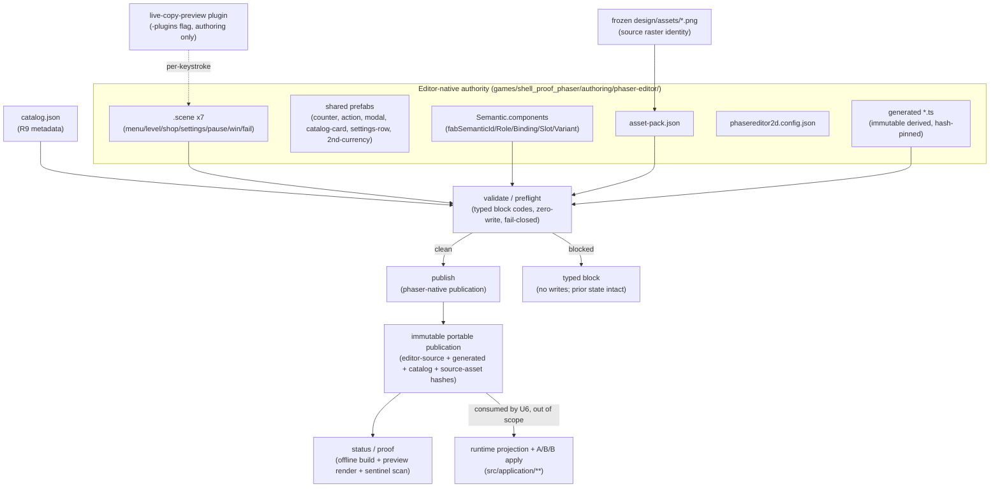

# [DUAL U5] Seven-page Phaser Editor authoring + portable publisher — Plan

> **Scope of this document.** This is the implementation-ready sub-plan for a **single** parent goal unit — `goal.md#U5` — of the dual-design-frontends evaluation. It decomposes U5 into landable work units (`P1`…`P7`). It plans the Phaser **authoring surface and portable publisher only**. It does **not** plan the Phaser-native runtime, projection selection, or the A→B→B application loop — those are `goal.md#U6` and live under `tools/phaser-shell/src/application/**`, which is explicitly outside this card's fence.

---

## Goal Capsule

- **Objective:** Give the Phaser Editor lane authoring capability at parity with the GrapesJS lane (`goal.md#U3`): seven editable shell surfaces, stable semantic identity, curated asset guidance, and a deterministic portable publisher — all with editor-native `.scene`/project state as the *sole* editable authority and generated code as immutable derived output.
- **Product authority:** The Phaser Editor project (`.scene` + `Semantic` component + asset-pack + config) is the only editable visual authority for `shell_proof_phaser` (R11). Generated `.ts`, publications, previews, and evidence are derived records that must never be hand-edited back into authority.
- **Execution profile:** One TWF card worktree on `trello-gJtZP63y-...`, landing only to `experiment/dual-design-frontends`. Deterministic tooling is built editor-free and unit-tested; the seven authoritative scenes and their generated code are produced in a **human-authenticated Phaser Editor 5.0.2 GUI session** (a measured vendor cost, per U2 finding 2 — headless regeneration is unsupported and must not be faked). Both land through this worktree.
- **Meaning of finished:** `@fabrikav2/phaser-shell` and the Phaser proof authoring surface pass typecheck/unit/render/lint/build; `npm --workspace @fabrikav2/phaser-shell run verify-authoring && npm run audit && npm run project-gate` are green; two clean generations match; the full rehearsal edit set persists across save/reopen/publish without raw-source edits; scope and frozen-behavior audits stay inside the Phaser fence; the implementation ledger is complete. This is **authoring parity**, not runtime readiness (U6) and not device readiness (U8/U10).
- **Stop conditions:** A reproducible authoring/identity/publication feasibility failure that cannot be met without weakening R7–R13 is a `no-go` routed back to a Batu decision (it does not make GrapesJS the winner). A missing Phaser Editor license/account or unreachable device is an environmental **block**, never a pass and never a product defect.
- **Tail ownership:** The card worktree worker owns the deterministic tooling, conventions, fixtures, and tests. The conductor (or Batu) owns the human-authenticated editor GUI session that authors and compiles the seven scenes, and owns the shared-surface integration cards (structure-linter whitelist; any behavior correction).

---

## Product Contract

> Carried from `goal.md#U5` (Requirements R1, R5–R17, R20–R25, R27–R30; Flows F2, F4; Acceptance AE2, AE3, AE6–AE8). **Product Contract unchanged** — this sub-plan enriches HOW; it does not restate or alter the parent's WHAT. R-IDs below reference `goal.md`.

### Summary

Build the same functional seven-surface mobile-game shell that the GrapesJS lane authors, but in Phaser Editor with Phaser as the target renderer — authored directly as Phaser Editor scenes/prefabs rather than translated from a DOM shell. The design owner must be able to perform the matched operation classes (select, direct move + resize, per-keystroke copy preview, palette, compatible curated asset swap with metadata, visibility, sibling reorder, stable duplicate / second currency) and then publish one faithful, deterministic, portable `phaser-native` revision. Editor-native state is the only editable authority; generated Phaser output and publications are immutable derived records.

### Problem Frame

The frozen U1 baseline (`experiment/dual-design-frontends`) preseeds the Phaser lane workspace (`tools/phaser-shell/package.json` with `phaser@4.2.1`) and the `shell_proof_phaser` proof game with its frozen controller, fake SDK, curated Kenney rasters, fonts, copy, and semantic seed — but there is **no authoring surface and no publisher yet**. U2 proved (verdict `pass`) that the pinned toolchain can hold stable semantic identity in supported editor state, generate deterministically, survive hostile input, publish through typed gates, and rebuild offline. U5 must turn those proven single-scene facts into a full seven-scene authoring project plus the portable publisher, without introducing a second editable representation and without a runtime/apply loop.

### Requirements (traceability to `goal.md`)

- **R1 / R5 / R6** — Seven distinct editable surfaces (`menu`, `level`, `shop`, `settings`, `pause`, `win`, `fail`) on the canonical 390×844 design system with baseline safe-area guides and the shared optional second-currency counter.
- **R7** — Editor supports canvas + semantic-layer selection, direct move/resize, color change, curated asset replacement, visibility, sibling reorder, stable duplication, and copy editing with **live per-keystroke preview**.
- **R8** — A duplicated semantic instance gets a stable new instance ID, stays in the correct semantic parent, retains or explicitly changes an allowed binding, and survives save/close/reopen/publish (and, downstream, apply/device).
- **R9** — Curated asset tray shows stable asset ID, human-readable name, detailed purpose, slot compatibility, source dimensions, alpha policy, provenance; consumes the same catalog and source raster bytes as the frozen seed.
- **R10** — Publication fails closed on missing required actions, invalid bindings, unsafe geometry, incompatible assets, active/remote content, path escape, or unrepresentable runtime state.
- **R11** — Phaser Editor project + `.scene` state is the sole editable authority; generated code/publications/previews/evidence are derived and never hand-edited into authority.
- **R12** — Publish a faithful portable v2 revision that reopens in the editor, identifies its `phaser-native` renderer profile, typed editor-source hashes, asset-catalog hash, artifacts, and source-asset hashes. V1 immutable; migration mints a new identity.
- **R13** — Compiles/runs without Phaser Editor or its account after generated artifacts are committed; no credentials, license material, machine IDs, or private paths in git/publications/logs/Portal/ledger.
- **R14 / R15 / R16 / R17** — Human-only rehearsal edit set works without raw JSON/TS/CSS/generated edits; same six local commands exist with shared typed outcomes (`applied`, `no-op`, `blocked-drift`, `invalid-revision`, `unsupported-intent`). *(U5 owns `validate`/`publish`/`preflight`/`status`/`proof`; `apply` is U6.)*
- **R20–R25** — Respect the frozen baseline, file fences, capability-mapped tool surface, per-renderer visual references, and the neutral rehearsal.
- **R27 / R28 / R29 / R30** — Portable, offline, network-free publication at publish time; editor-native source authoritative; lane fence discipline; no cross-lane or shared-surface edits without integration cards.

### Acceptance Examples honored

- **AE2 (R7–R13):** Edit copy, color, geometry, order, visibility, asset, and a duplicated counter; reopen and publish; editor preserves changes and stable identities; revision contains only allowed local artifacts; regeneration reproduces identical bytes for the `phaser-native` profile.
- **AE3 (R10–R12):** Hiding a required action, assigning an incompatible raster, injecting active content, or moving an action outside the safe region returns a typed block and leaves the prior selected projection unchanged.
- **AE6 (R20–R25):** The rehearsal edit set completes without raw-source edits under the frozen protocol.
- **AE7 (R27–R29):** With editor and network unavailable, the committed proof game rebuilds from its portable accepted revision; the report records that future Phaser visual editing requires a licensed editor.
- **AE8 (R30–R32):** A cross-lane or shared-file edit blocks in the scope audit; published evidence is private and scrubbed.

---

## Planning Contract

### Approach Summary

Reuse the exact U2-proven seam rather than re-deriving it: the `Semantic` **user component** carries identity (no plugin), the **26-line live-copy-preview plugin** is the only justified plugin, generated code is **hash-pinned** (never headlessly regenerated), and validation reuses the U2 `publish-check` block-code vocabulary extended to the full R10 surface. Scale U2's single `Probe.scene` to seven shell scenes composed from shared prefabs, browse the curated catalog with full metadata, and publish one immutable portable `phaser-native` revision that binds editor-source + generated + asset hashes under one publication ID and rejects divergence between editor source and committed generated code. Stop at authoring parity; hand the runtime/projection/apply loop to U6.

### Key Technical Decisions

- **KTD-A — Editor-native `.scene`/project is the sole authority; generated `.ts` is immutable, hash-pinned derived output.** The Phaser Editor project under `games/shell_proof_phaser/authoring/phaser-editor/` (`.scene`, `Semantic.components`/`Semantic.ts`, `asset-pack.json`, `phasereditor2d.config.json`, generated scene `.ts`) is authority. Generated code is committed as derived output pinned by hash and never hand-edited (hard constraint: "no generated-code hand edits"). Extends `data-first-semantic-contract-and-immutable-projections`.
- **KTD-B — Identity via the `Semantic` user component (5 fields), no plugin.** Reuse U2's proven mechanism verbatim: `fabSemanticId`, `fabRole`, `fabBinding`, `fabSlot`, `fabVariant` serialize into scene JSON as flat `Semantic.<prop>` keys, survive save/reopen/duplicate, are inspector-editable, and compile into plain property assignments importing only `phaser`. Duplicate → fresh UUID, same semantic parent, binding retained then retargetable via the inspector (R8). Built-in UUIDs alone are insufficient (they cannot carry role/binding/slot/variant) — U2 rung (b) is the accepted rung.
- **KTD-C — The only plugin is U2's 26-line `live-copy-preview` forwarder.** Loaded via the documented `-plugins` flag for per-keystroke copy preview (base editor commits fields only on blur/Enter). It is authoring-scoped, never shipped to the runtime bundle, and is the "smallest U2-proven plugin" the card permits. Do not build a new plugin; identity and catalog UX need none.
- **KTD-D — The publisher hash-pins committed generated bytes; it never regenerates headlessly.** Headless regeneration is unsupported (U2 finding 2: the scene compiler lives only in the workbench browser client). The editor auto-compiles on save, so `.scene` and generated `.ts` move together; U5's publisher pins the committed generated bytes by hash and enforces the editor-source↔generated pairing at publish time. This absence is recorded as a measured vendor cost, never faked.
- **KTD-E — Curated catalog is data with full R9 metadata; source raster identity is preserved.** Extend U2's `catalog.json` to the full seed catalog: each entry carries `id`, `packKey`, `url`, human-readable `name`, detailed `purpose`, `slotCompatibility`, source `dimensions`, `alphaPolicy`, and `provenance`. The catalog and `asset-pack.json` reference the **same individual source raster bytes** already frozen under `games/shell_proof_phaser/design/assets/` (KTD8 — no atlas/texture derivative unless deterministic and hash-bound to source).
- **KTD-F — Typed validation reuses and extends U2's `publish-check` vocabulary, fail-closed.** Block codes: `blocked-missing-semantic-id`, `blocked-duplicate-semantic-id`, `blocked-invalid-binding`, `blocked-invalid-catalog-id`, `blocked-unknown-texture`, extended with `blocked-unsafe-asset-path`, `blocked-active-content`, `blocked-unsafe-string-encoding`, `blocked-missing-required-action`, `blocked-unsafe-geometry`, and `blocked-unrepresentable`. A blocked publication performs **zero writes**. Codes map onto the shared typed vocabulary (`invalid-revision` / `unsupported-intent` / `blocked-drift`).
- **KTD-G — One `phaser-native` publication binds all hashes under one ID.** The publisher emits an immutable, portable publication that reopens in the editor, identifies the renderer profile, and records typed editor-source hashes (scene/components/asset-pack/config), generated-artifact hashes, asset-catalog hash, and source-asset hashes plus the artifacts themselves (R12). It rejects editor-source↔generated divergence. It does **not** produce the runtime projection pointer or perform apply (U6).
- **KTD-H — U5 owns `validate`/`publish`/`preflight`/`status`/`proof`; `apply` is U6.** All five are scriptable and editor-free (U2 command-surface findings). `proof` here is local (offline build + bundle-sentinel scan / headless preview render); physical-device proof is U8/U10.
- **KTD-I — The GUI authoring leg is human/vendor-gated and structurally honest.** The worker builds all deterministic tooling, conventions, catalog, fixtures, and tests editor-free, and may hand-author declarative `.scene` JSON as scaffolding. The paired authoritative generated `.ts` for the seven scenes must come from a human-authenticated Phaser Editor auto-compile-on-save session (like U2's conductor-run Android leg). Faking generated bytes is prevented by construction: the divergence gate (KTD-D/G) fails if generated code does not match its editor source.

### High-Level Technical Design



### Output Structure

Files U5 creates or modifies, all inside the **Phaser lane fence** (`experiments/design-frontends/fences.json` → `lanes.phaser.writable`) minus `src/application/**`:

```text
tools/phaser-shell/
  package.json                      # add scripts incl. verify-authoring, dev deps (lane-scoped only)
  tsconfig.json
  eslint.config.js
  vitest.config.ts
  README.md                         # extend: authoring/publisher usage, vendor-gated GUI leg
  src/
    authoring/
      catalog.ts                    # catalog schema + loader (R9 metadata)
      semantic.ts                   # Semantic role/binding/slot/variant vocabulary + guards
      sceneModel.ts                 # scene-JSON walk/model shared by validate + publish
    publish/
      validate.ts                   # typed block-code gate (extends U2 publish-check)
      publish.ts                    # phaser-native publication + hashing + divergence gate
      preflight.ts                  # validate + hash comparison
      status.ts                     # read publication state; typed outcomes
      proof.ts                      # offline build + headless preview render + sentinel scan
      manifest.ts                   # publication manifest schema + typed hashes
    cli.mjs                         # validate/publish/preflight/status/proof entry points
    # NOTE: src/application/** is U6 — NOT created here
  test/
    catalog.test.ts
    semantic-identity.test.ts
    validate-blockcodes.test.ts
    hostile-strings.test.ts         # AST inertness (reuse U2 fixture shape)
    determinism.test.ts             # two clean generations match
    publish-divergence.test.ts
    preview-render.test.ts          # headless-canvas scene instantiation (offline)
    fixtures/                       # representative scene fixtures for editor-free tests

games/shell_proof_phaser/
  authoring/
    phaser-editor/
      phasereditor2d.config.json
      src/scenes/{Menu,Level,Shop,Settings,Pause,Win,Fail}.scene   # editor-native authority
      src/scenes/*.ts                                              # generated derived (GUI-compiled)
      src/prefabs/*.scene + *.ts                                   # shared prefabs
      src/components/Semantic.components + Semantic.ts             # from U2
      public/assets/asset-pack.json
    catalog/catalog.json            # curated tray, full R9 metadata
    editor-plugins/live-copy-preview/   # U2's 26-line forwarder (authoring only)
  refs/                             # per-renderer calibrated authoring references (R23)
  evidence/<run-id>/                # rehearsal edit-set evidence + implementation ledger (scrubbed)
```

---

## Implementation Units

> Work units of parent goal unit U5, id-prefixed **P** to stay unambiguous vs. `goal.md`'s U-IDs and this doc's R-IDs. Land in dependency order. All units are inside the Phaser lane fence; none touch `src/application/**`, the Grapes lane, shared surfaces, `_template`, `create-game`, existing games, or root manifests/lockfile.

### P1. Rebase onto the sealed U1 head and scaffold the Phaser lane authoring workspace

- **Goal:** Put the card worktree on the correct base and stand up the `@fabrikav2/phaser-shell` authoring/publisher package skeleton and the `authoring/` project skeleton, so every later unit builds on real U1 state.
- **Requirements:** R11, R13, R30; precondition for all.
- **Dependencies:** none (first unit).
- **Files:** `tools/phaser-shell/package.json`, `tools/phaser-shell/tsconfig.json`, `tools/phaser-shell/eslint.config.js`, `tools/phaser-shell/vitest.config.ts`, `tools/phaser-shell/src/` (empty module skeletons excluding `application/`), `games/shell_proof_phaser/authoring/` skeleton (config, empty `public/assets/asset-pack.json`, `editor-plugins/live-copy-preview/`, `src/components/Semantic.*` imported from the U2 fixture).
- **Approach:** Rebase `trello-gJtZP63y-...` onto the corrected sealed U1 integration head of `experiment/dual-design-frontends` (the card's explicit precondition; `tools/phaser-shell` and the fences/baseline exist only there — they are absent on this `main`-based worktree). Add lane-scoped dev dependencies (the U2-pinned toolchain: `typescript`, `vite`, `vitest`, `eslint`, `typescript-eslint`, `@types/node`) to `tools/phaser-shell/package.json` **only** — never the root manifest/lockfile (hard constraint) — and add the `verify-authoring` script placeholder (wired in P7). Copy the U2 `Semantic` component and the 26-line live-copy plugin into the lane as the identity/preview basis.
- **Execution note:** This is mostly scaffolding/config; prefer install + build smoke over unit coverage. Do not author scene content here.
- **Patterns to follow:** `tools/phaser-shell/package.json` (U1 preseed), `tools/grapes-shell/` layout as the lane-parity shape, U2 fixture `editor-project/src/components/Semantic.ts` and `editor-plugins/live-copy-preview/`.
- **Test scenarios:** `Test expectation: none — scaffolding/config`. Verification is: `npm --workspace @fabrikav2/phaser-shell run typecheck` and `build` succeed on the empty skeleton; `npm run audit` still passes **or** cleanly reports the pending structure-linter whitelist (see Open Questions Q1).
- **Verification:** Worktree HEAD's parent is the sealed U1 head (record starting SHA in the ledger); package installs and typechecks; no root manifest/lockfile diff; no files outside `lanes.phaser.writable`.

### P2. Curated asset catalog + asset pack as data (R9)

- **Goal:** Make the frozen seed rasters browsable as a curated tray with complete metadata and compatibility, consumed identically to the Grapes lane catalog.
- **Requirements:** R5, R9, R11 (KTD-E, KTD8).
- **Dependencies:** P1.
- **Files:** `games/shell_proof_phaser/authoring/catalog/catalog.json`, `games/shell_proof_phaser/authoring/phaser-editor/public/assets/asset-pack.json`, `tools/phaser-shell/src/authoring/catalog.ts`, `tools/phaser-shell/test/catalog.test.ts`.
- **Approach:** Extend U2's minimal `catalog.json` to the full curated set drawn from `games/shell_proof_phaser/design/assets/` (action surfaces, control icons, counter frame, progression nodes). Each entry gains `name`, `purpose`, `slotCompatibility` (which semantic slots may bind it), `dimensions` (from the source PNG), `alphaPolicy`, and `provenance` (Kenney source + license, matching `design/kenney-seed.manifest.json`). The `asset-pack.json` `packKey`s must match catalog `packKey`s and load the identical source bytes (no atlas/derivative). `catalog.ts` loads + validates the catalog and exposes lookups for validation/publish.
- **Patterns to follow:** U2 `catalog/catalog.json` shape; `games/shell_proof_phaser/design/assets.ts` and `design/kenney-seed.manifest.json` for provenance/dimensions; `design/assets/*.png` are the byte source of truth.
- **Test scenarios:**
  - Happy: every catalog `id` resolves to an existing `design/assets/*.png`; `packKey`s are unique and each appears in `asset-pack.json`; recorded `dimensions` match the actual PNG header bytes.
  - Edge: `slotCompatibility` references only slots present in the semantic vocabulary (P3); `alphaPolicy` ∈ known set; `provenance` license matches the seed manifest.
  - Error: a catalog entry pointing at a non-seed path fails the loader; a `packKey` mismatch between catalog and asset-pack fails.
  - `Covers AE2 (asset metadata/compatibility).`
- **Verification:** `catalog.test.ts` green; catalog + asset-pack reference only frozen source bytes; no derived textures introduced.

### P3. Semantic vocabulary, shared prefabs, and the seven-scene authoring model

- **Goal:** Define the semantic role/binding/slot/variant vocabulary and the seven editable shell scenes composed from shared prefabs, with the authored `.scene` JSON as authority (generated `.ts` produced in the GUI session per KTD-I).
- **Requirements:** R1, R5, R6, R7, R8, R11 (KTD-A, KTD-B).
- **Dependencies:** P1, P2.
- **Files:** `tools/phaser-shell/src/authoring/semantic.ts`, `tools/phaser-shell/src/authoring/sceneModel.ts`, `games/shell_proof_phaser/authoring/phaser-editor/src/scenes/{Menu,Level,Shop,Settings,Pause,Win,Fail}.scene` (+ generated `.ts` from the GUI session), `games/shell_proof_phaser/authoring/phaser-editor/src/prefabs/*`, `tools/phaser-shell/test/semantic-identity.test.ts`, `tools/phaser-shell/test/fixtures/`.
- **Approach:** Author seven scenes / scene compositions on an editor border matching the canonical 390×844 design coordinate system (R5) with baseline safe-area anchors. *(U2's `Probe.scene` used a generic 720×1280 probe border; the real scenes must target the 390×844 design system, not inherit the probe's dimensions.)* Build shared prefabs for the recurring compositions — currency counter, primary/secondary action button, modal, Shop catalog card, Settings row, and the optional second-currency socket — so duplicate-and-specialize (R6/R8) is a prefab instance, not a copy. **Pause and Settings are distinct prefabs/compositions**, not one reused sheet (R2). Every semantic object carries the `Semantic` component with a stable `fabSemanticId`, a `fabRole` from the vocabulary (`hud`/`copy`/`action`/`asset`/`counter`/`container`/`nav`), a `fabBinding` (`copy:*`, `asset:<catalog-id>`, `action:*`, `counter:*`), a `fabSlot`, and a `fabVariant`. `semantic.ts` is the single source of the vocabulary + guards; `sceneModel.ts` is the shared scene-JSON walk used by both validate and publish. Hand-authored `.scene` JSON is legitimate scaffolding; the paired generated `.ts` is compiled by the human-authenticated editor session (P6) and hash-pinned.
- **Execution note:** Build `semantic.ts`/`sceneModel.ts` and the fixture scenes test-first; the real seven authoritative scenes' generated code is a GUI-gated deliverable folded in at P6.
- **Patterns to follow:** U2 `editor-project/src/scenes/Probe.scene` (Semantic keys, texture keys, origins, safe-area anchor), `games/shell_proof_phaser/design/presentation.ts` for seed geometry, the frozen `TemplateShellController` states for the seven-surface set.
- **Test scenarios:**
  - Happy: all seven scenes parse; each declares its required semantic actions (e.g., `menu` has play/shop/settings; `pause` has resume/settings/home; `win` has next/home; `fail` has retry/home; `shop` has back/restore + catalog section); every semantic object has a non-empty unique `fabSemanticId`.
  - Edge (R6/R8): the second-currency socket is present and binds a distinct `fabSemanticId` with a valid `counter:*` binding and correct semantic parent; a duplicated prefab instance is representable with a fresh id in the same parent.
  - Edge (R2): `Pause` and `Settings` have structurally distinct semantic trees (asserted, not incidental).
  - Edge (R7): move/resize (x/y/width/height or scale), visibility (visible flag), and sibling reorder (displayList order) are all representable in the scene model without losing identity.
  - Error: a scene missing a required action, or with a duplicate `fabSemanticId`, is detectable by `sceneModel.ts`.
  - `Covers AE2, AE6.`
- **Verification:** `semantic-identity.test.ts` green against the fixture scenes; the seven-scene set enumerates the required semantic actions; Pause≠Settings asserted.

### P4. Typed validation gate — `validate` and `preflight` (R10)

- **Goal:** Fail closed on every unsafe/invalid/incomplete state with a named block code and zero writes, mapping onto the shared typed vocabulary.
- **Requirements:** R10, R11, R16, R17 (KTD-F).
- **Dependencies:** P2, P3.
- **Files:** `tools/phaser-shell/src/publish/validate.ts`, `tools/phaser-shell/src/publish/preflight.ts`, `tools/phaser-shell/test/validate-blockcodes.test.ts`, `tools/phaser-shell/test/hostile-strings.test.ts`.
- **Approach:** Port U2's `publish-check.mjs` into `validate.ts` over `sceneModel.ts`, then extend beyond catalog/binding to the full R10 surface: `blocked-missing-required-action` (a required semantic action for a scene is absent or hidden), `blocked-unsafe-geometry` (an action's rect falls outside the safe interaction region / below 48px min), `blocked-unsafe-asset-path` (asset URL escapes the pack root or is remote), `blocked-active-content` (script/remote/URL-bearing property), `blocked-unsafe-string-encoding` (a would-be-unrepresentable generated string), and `blocked-unrepresentable`. Binding-required roles keep U2's set (`asset`/`action`/`copy`/`counter`). `preflight.ts` = `validate` + hash comparison of scene/generated/catalog/assets. Every block path is read-only: **zero writes**, prior outputs untouched (AE3). Emit a typed result mapping block codes to `invalid-revision` / `unsupported-intent` / `blocked-drift`.
- **Patterns to follow:** U2 `scripts/publish-check.mjs` (`walkObjects`, `BLOCK_CODES`, `BINDING_REQUIRED_ROLES`), U2 `tests/hostile-strings.test.ts` and `tests/binding.test.ts`.
- **Test scenarios:**
  - Happy: a clean seven-scene fixture returns `ok` with zero blocks.
  - Error (one per code): missing semantic id; duplicate semantic id (same id+variant); missing binding on a binding-required role; `asset:<unknown-id>`; texture not in asset pack; asset path escaping the pack root or `http(s)://`; a required action hidden/removed; an action rect outside the safe region / under 48px; an active-content property; an unrepresentable/unsafe string.
  - Inertness (R10/AE3): hostile copy and identifiers containing `"`/`'`/`` ` ``/`${}`/`{}`/newline/`*/`/`//`/`</script>` round-trip as inert string data (AST proof that hostile content never escapes a string literal) — matches U2's proven compiler escaping.
  - Zero-write invariant: after any block, no file under the publication output path changed (mtime + bytes).
  - `Covers AE3.`
- **Verification:** every block code has a firing test; clean fixtures pass; hostile-string AST test green; zero-write asserted.

### P5. Deterministic portable publisher — `publish`, `status`, `proof` (R12/R27)

- **Goal:** Emit one immutable, portable, network-free `phaser-native` publication that reopens in the editor, binds all typed hashes under one ID, and rejects editor-source↔generated divergence — without ever regenerating headlessly.
- **Requirements:** R11, R12, R13, R16, R17, R27, R28, R29 (KTD-D, KTD-G, KTD-H).
- **Dependencies:** P3, P4.
- **Files:** `tools/phaser-shell/src/publish/publish.ts`, `tools/phaser-shell/src/publish/status.ts`, `tools/phaser-shell/src/publish/proof.ts`, `tools/phaser-shell/src/publish/manifest.ts`, `tools/phaser-shell/src/cli.mjs`, `tools/phaser-shell/test/determinism.test.ts`, `tools/phaser-shell/test/publish-divergence.test.ts`, `tools/phaser-shell/test/preview-render.test.ts`.
- **Approach:** `publish.ts` runs `validate`, then assembles a publication directory whose `manifest.ts` records: publication ID (incorporating the `phaser-native` renderer profile), typed editor-source hashes (`.scene` × 7, `Semantic.components`, `asset-pack.json`, `phasereditor2d.config.json`), generated-artifact hashes (generated `.ts`), asset-catalog hash, and source-asset hashes — plus copies of the artifacts. Because headless regen is unsupported (KTD-D), publish **does not** re-derive generated code; it pins the committed generated bytes and enforces the pairing by hashing the committed editor-source→generated pair recorded at authoring time and re-checking it (a mismatch is `blocked-drift`). `status.ts` reads publication state and reports typed outcomes. `proof.ts` performs the local, editor-free, network-free proof: an offline build using generated scene code + `phaser@4.2.1` only (no editor package markers), a bundle-sentinel scan, and a **headless-canvas preview render** that instantiates the published scenes and asserts the semantic display objects exist (authoring preview — *not* the U6 runtime shell). The publisher writes its publication under a lane-writable path; the exact directory shared with U6 is resolved in Open Questions Q2. `cli.mjs` exposes `validate`/`publish`/`preflight`/`status`/`proof` (not `apply`).
- **Patterns to follow:** U2 `report.json` `command_surface` mappings and `scripts/{hash,normalize,verify}.mjs`; U2 `feasibility.normalization` (volatile-field registry currently empty → normalization is identity); `data-first-semantic-contract-and-immutable-projections`.
- **Test scenarios:**
  - Happy (AE2): a valid seven-scene project publishes; the publication contains only allowed local artifacts + manifest; reopening the editor-source in a fixture round-trips byte-identically.
  - Determinism (R12/AE2): two clean publications of unchanged input produce byte-identical (or identically-normalized) publications; an unchanged re-publish is a `no-op`.
  - Divergence (KTD-D/G): a generated `.ts` that does not match its `.scene` source (hand-edited or stale) blocks as `blocked-drift`; zero writes.
  - Offline (R13/R27/AE7): `proof` builds and preview-renders with network disabled and no editor package present; the bundle contains the sentinel and no editor markers.
  - Preview render: each published scene instantiates in a headless canvas and exposes its semantic objects; a scene that fails to instantiate fails proof.
  - Security (R10): a publication attempt carrying active/remote content is refused before any write.
  - `Covers AE2, AE7.`
- **Verification:** `determinism`, `publish-divergence`, `preview-render` tests green; two clean generations match; offline proof passes with no editor footprint; typed outcomes (`applied`/`no-op`/`blocked-drift`/`invalid-revision`) emitted correctly.

### P6. Author the seven authoritative scenes and prove the rehearsal edit set (vendor-gated)

- **Goal:** Produce the real seven-scene authoritative project + generated code in the Phaser Editor and prove the full comparison edit set persists across save/close/reopen/publish without raw-source edits, with a scrubbed evidence record and implementation ledger.
- **Requirements:** R7, R8, R14, R21, R22, R23, R24, R25 (KTD-I); F2, F4; AE2, AE6.
- **Dependencies:** P3, P4, P5.
- **Files:** `games/shell_proof_phaser/authoring/phaser-editor/src/scenes/*.{scene,ts}`, `.../src/prefabs/*`, `games/shell_proof_phaser/refs/`, `games/shell_proof_phaser/evidence/<run-id>/` (rehearsal captures + `implementation-ledger.json`, scrubbed).
- **Approach:** In a **human-authenticated Phaser Editor 5.0.2 GUI session** (the license/account is a human/environment step, never repo automation — R13), author the seven scenes from the P3 model and the P2 catalog, letting the editor auto-compile generated `.ts` on save (the only supported regeneration path). Load the `live-copy-preview` plugin via `-plugins` for per-keystroke preview. Perform the rehearsal edit set — global palette + title/button copy change, reposition + resize a header element and primary action to a target reference, replace ≥2 curated assets, duplicate the currency counter into the second-currency socket, reorder + hide an optional instance, make Settings and Pause visibly distinct, restyle one Shop product section — then publish, close, reopen, and re-inspect. Generate the per-renderer calibrated authoring references into `refs/` (hash-bound to publication/renderer/viewport/safe-area, R23). Record the implementation ledger (starting/ending SHA, inherited work, agent/model identity, active elapsed time, attempts, rework, human intervention, added deps/tools, changed surface, failed gates) and scrubbed evidence (no credentials, account data, device IDs, private paths — R13/R32). If the editor/license is unavailable, record an environmental **block** honestly (never a fabricated pass).
- **Execution note:** Vendor-gated. The deterministic tooling (P1–P5, P7) is worker-owned and editor-free; this unit is the editor GUI leg and is conductor/Batu-run, mirroring how U2's Android leg was conductor-run. Do not hand-fake generated bytes — the P5 divergence gate will (correctly) reject them.
- **Patterns to follow:** U2 `scripts/editor-session.mjs` + `evidence/sessions/session-ledger.json` (hash-bracketed GUI observations), U2 `report.md` ledger shape, `experiments/design-frontends/evidence.schema.json`.
- **Test scenarios:** `Test expectation: primarily human/GUI proof, bound to committed bytes.` The deterministic bindings are: published scenes validate + publish cleanly via P4/P5; a unit test binds the evidence ledger hashes to the committed project bytes so evidence cannot drift from landed state (U2 pattern); every rehearsal edit is observable in the reopened project.
  - `Covers AE2, AE6, AE7, AE8 (scrubbed evidence).`
- **Verification:** the rehearsal edit set completes without raw-source edits; reopen preserves changes + stable identities; publication is deterministic; evidence is scrubbed and hash-bound; ledger complete. Honest `blocked` recorded if the license/editor is unavailable.

### P7. Wire `verify-authoring`, scope + frozen-behavior audits, and local verification

- **Goal:** Provide the single card-verification entry point and prove the lane stays inside its fence with frozen behavior untouched.
- **Requirements:** R11, R13, R20, R30; the card's Verification command.
- **Dependencies:** P1–P6.
- **Files:** `tools/phaser-shell/package.json` (`verify-authoring` script), `tools/phaser-shell/README.md`, and (via a conductor integration card — see Q1) the audit structure-linter whitelist.
- **Approach:** Implement `verify-authoring` to run, editor-free: `typecheck` + `test:unit` + `render` (headless preview) + `lint` + `build` for `@fabrikav2/phaser-shell` and the Phaser proof authoring surface, plus `validate` → `publish` (determinism / divergence) → offline `proof` on the committed seven-scene project. Confirm the scope audit and each proof game's frozen-behavior test still pass — the frozen dirs (`src`, `content`, `tests/unit`, and `design` except `design/revisions/**`, `design/revision.json`, and the identity-excluded `design/copy.ts`) must be byte-unchanged; `_template`/`create-game` byte-identical to main. Surface the structure-linter whitelist dependency (Q1) explicitly rather than editing `tools/audit` from this card.
- **Patterns to follow:** root `package.json` scripts (`audit`, `project-gate`), `experiments/design-frontends/baseline/behavior-hashes.json`, the `frozen-behavior.test.ts` + `no-testkit-duplication.test.ts` already in `shell_proof_phaser/tests/unit/`.
- **Test scenarios:**
  - Happy: `npm --workspace @fabrikav2/phaser-shell run verify-authoring` exits green on the committed project.
  - Guard: the frozen-behavior test passes (no frozen byte changed); scope audit reports no writes outside `lanes.phaser.writable`.
  - Integration: `npm run audit && npm run project-gate` pass once the structure-linter whitelist is extended (Q1); if not yet extended, the failure is the expected, documented blocker — not a lane defect.
  - `Covers AE8.`
- **Verification:** the full card command `npm --workspace @fabrikav2/phaser-shell run verify-authoring && npm run audit && npm run project-gate` is green (or the only red is the pending Q1 whitelist integration card, explicitly flagged in the handoff).

---

## Verification Contract

| Gate | Unit(s) | Evidence | Passing signal |
|---|---|---|---|
| Lane scaffold on real U1 base | P1 | typecheck/build on skeleton; no root/lockfile diff | Worktree rebased onto sealed U1 head; workspace installs; nothing outside the phaser fence |
| Catalog integrity | P2 | `catalog.test.ts` | Every catalog id → frozen seed raster bytes; full R9 metadata; no derived textures |
| Seven-scene semantic model | P3 | `semantic-identity.test.ts` + fixtures | 7 scenes, required actions present, unique stable ids, Pause≠Settings, second-currency socket, move/resize/visibility/reorder/duplicate representable |
| Typed validation, fail-closed | P4 | `validate-blockcodes.test.ts`, `hostile-strings.test.ts` | Every R10 block code fires; hostile strings inert (AST); zero writes on block |
| Deterministic portable publisher | P5 | `determinism.test.ts`, `publish-divergence.test.ts`, `preview-render.test.ts` | Two clean generations match; divergence blocks; offline proof with no editor footprint; typed outcomes correct |
| Rehearsal edit set (vendor-gated) | P6 | scrubbed `evidence/<run-id>/` + ledger | Full edit set persists across save/reopen/publish with no raw-source edits; evidence hash-bound + scrubbed; honest `blocked` if editor unavailable |
| Card verification | P7 | `verify-authoring` + `audit` + `project-gate` | `npm --workspace @fabrikav2/phaser-shell run verify-authoring && npm run audit && npm run project-gate` green; frozen-behavior + scope audits clean |

The card's authoritative command is `npm --workspace @fabrikav2/phaser-shell run verify-authoring && npm run audit && npm run project-gate`. Device/runtime/apply proof is explicitly **out of scope** (U6/U8/U10).

---

## Definition of Done

U5 authoring parity is complete when:

- The card worktree is rebased onto the corrected sealed U1 integration head and lands only to `experiment/dual-design-frontends`.
- The Phaser Editor project (7 `.scene` + shared prefabs + `Semantic` component + `asset-pack.json` + config) is the sole editable authority; generated `.ts` is committed, hash-pinned, and never hand-edited.
- The editor supports select, move, resize, live copy, palette, curated asset replacement, visibility, reorder, and stable duplicate (with the second-currency socket) across save/close/reopen/publish, proven by the rehearsal edit set without raw-source edits.
- Publication fails closed on every R10 case with a typed block code and zero writes; hostile strings remain inert (AST-proven) or block.
- The publisher emits one immutable, portable, network-free `phaser-native` publication binding editor-source + generated + catalog + source-asset hashes under one ID, rejects editor-source↔generated divergence, and reproduces byte-identical output on two clean generations — all without headless regeneration (recorded as a measured vendor cost).
- `@fabrikav2/phaser-shell` and the Phaser proof authoring surface pass typecheck/unit/render/lint/build; `verify-authoring` + `npm run audit` + `npm run project-gate` are green (or the sole remaining red is the flagged Q1 structure-linter integration card).
- Scope audit stays inside `lanes.phaser.writable`; frozen behavior bytes are unchanged; `_template`/`create-game`/v1 contract untouched; no credentials/account/device/private-path data committed or published; implementation ledger complete.
- **Not required by U5:** runtime shell, projection selection, `design/revision.json` pointer, A→B→B apply (`src/application/**` — U6); physical-device/warm-propagation proof (U8/U10); Apple readiness.

---

## Risks, Dependencies, and Open Questions

### Dependencies / preconditions

- **Sealed U1 head + U2 pass.** U5 cannot start until it rebases onto the corrected sealed U1 integration head (the card mandates this; `tools/phaser-shell`, `fences.json`, and `baseline/` exist only there). U2's `pass` verdict and imported facts (`report.json`) are the design basis.
- **Human-authenticated Phaser Editor 5.0.2.** P6 requires a licensed, pre-authenticated editor install (a human/environment step, never repo automation). Its absence is an environmental `block`, not a defect.

### Risks and mitigations

| Risk | Consequence | Mitigation |
|---|---|---|
| Headless regeneration is unsupported (U2 finding 2) | Publisher could be tempted to fake/skip generation | Hash-pin committed generated bytes; enforce editor-source↔generated pairing; record the GUI-only regeneration as a measured vendor cost; never fake it (KTD-D/I) |
| GUI authoring leg blocks the deterministic units | Card stalls waiting on the editor | Split cleanly: P1–P5 + P7 are editor-free and land first; P6 is the vendor-gated leg the conductor/Batu runs; honest three-state if unavailable |
| `authoring/` top-level dir trips the audit structure linter | `audit`/`project-gate` fail | Q1 conductor integration card extends the whitelist (fences note); flag, don't self-edit `tools/audit` |
| Atlas/texture derivative loses source raster identity | Wrong asset renders under a valid-looking binding | Load identical source bytes only; any derivative must be deterministic + hash-bound to source (KTD8) + negative-control tested |
| Generated scene code becomes hand-edited authority | Design drift returns | Editor-native source authoritative; divergence gate blocks; no-generated-hand-edit hard constraint |
| U5↔U6 publication seam ambiguity | Two units write the same paths | Resolve Q2 before P5 lands; keep U5 output inside the phaser fence and hand the pointer/apply to U6 |

### Open Questions

- **Q1 — Structure-linter whitelist (shared surface).** Adding `games/shell_proof_phaser/authoring/` as a new top-level proof-game entry requires extending the audit `structure` linter whitelist, which lives in `tools/audit` (a shared/U7 surface, not the phaser fence). Per `fences.json` notes, this must go through a **conductor integration card**. *Resolution:* request the whitelist extension from the conductor; until then, `audit`/`project-gate` will flag `authoring/` and P7's integration gate stays red for that one reason. Deferred to the conductor, not resolvable inside this card.
- **Q2 — Exact publication output path and the U5↔U6 seam.** `fences.json` lists both `games/shell_proof_phaser/design/revisions/**` and `design/revision.json` as lane-writable, but `goal.md`'s U3/U4 precedent assigns `design/` (projection + pointer) to the projection/apply unit (U6), while U5 is the "portable publisher." *Recommended:* U5's publisher writes immutable publications inside its own fence (e.g., under `authoring/publications/<publicationId>/` or `design/revisions/<publicationId>/`), and U6 owns `design/revision.json` (the applied pointer) + runtime consumption. Confirm the exact directory with the conductor before P5 lands so the two units do not collide. Deferred to an execution-time decision with the conductor.
- **Q3 — "render" check scope.** The card verification names a `render` check. This plan scopes it to a **headless-canvas authoring preview** (does the published generated scene instantiate its semantic objects offline?), deliberately *not* the U6 runtime shell. If the conductor wants a richer render gate it belongs in U6. Resolved as scoped above unless overridden.

---

## Sources and Research

- `goal.md#U5` (experiment/dual-design-frontends) — canonical parent unit; requirements, files, approach, patterns, test scenarios, verification.
- `experiments/design-frontends/fixtures/phaser-feasibility/report/{report.md,report.json}` (U2 / card 43Qvbih7) — the four decisive findings this plan is built on: identity via `Semantic` user component (no plugin), the 26-line live-copy plugin, headless regen unsupported → hash-pin, deterministic byte-identical generation, clean worktree confinement, and the scriptable `validate/publish/preflight/status/proof` command surface.
- `experiments/design-frontends/fixtures/phaser-feasibility/scripts/publish-check.mjs` — the block-code validator this plan extends (P4).
- `experiments/design-frontends/fixtures/phaser-feasibility/editor-project/src/{components/Semantic.ts,scenes/Probe.scene}` — the identity component and scene-JSON authority shape (P3).
- `experiments/design-frontends/fences.json` — the phaser lane writable/forbidden fence and the structure-linter whitelist note (Q1).
- `experiments/design-frontends/baseline/{behavior-hashes.json,dependencies.json,device-profile.json}` — frozen inputs the lane must not change.
- `games/shell_proof_phaser/design/{assets.ts,assets/*.png,kenney-seed.manifest.json,presentation.ts}` — source raster identity, provenance, and seed geometry (P2, P3).
- `tools/phaser-shell/{package.json,README.md}` (U1 preseed) — the lane workspace and `phaser@4.2.1` pin this plan builds on.
- `docs/plans/2026-07-10-002-feat-grapesjs-shell-specialization-plan.md` — origin plan for the shared security, deterministic-publication, and behavior-preservation posture carried into the `phaser-native` profile.
- `docs/solutions/architecture-patterns/data-first-semantic-contract-and-immutable-projections.md` — the data-first contract + immutable-derived-projection pattern extended here.
