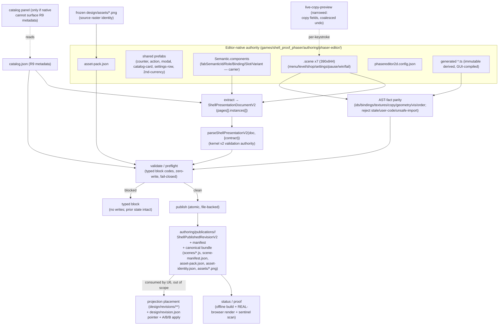

# [DUAL U5] Seven-page Phaser Editor authoring + portable publisher — Plan

> **Scope of this document.** This is the implementation-ready sub-plan for a **single** parent goal unit — `goal.md#U5` — of the dual-design-frontends evaluation. It decomposes U5 into landable work units (`P1`…`P7`) and names the shared-surface U1 integration prerequisites (`S1`…`S5`) that must land and be resealed **before** U5 implementation. It plans the Phaser **authoring surface and portable publisher only**. It does **not** plan the Phaser-native runtime, projection selection/placement, the `design/revision.json` pointer, or the A→B→B application loop — those are `goal.md#U6` and live under `tools/phaser-shell/src/application/**` and `games/shell_proof_phaser/design/**`, both explicitly outside this card's ownership.
>
> **Amendment note (rev 2).** This revision closes the plan-review findings on card `gJtZP63y` (comments 7, 8) and adopts the conductor artifact-profile resolution (comments 9, 10). The material changes vs rev 1: (a) a first-class **Shared U1 Integration Prerequisites** section that names the five shared repairs with minimal fixes + negative tests and keeps them out of the U5 lane; (b) validation is anchored on the **kernel v2 parsers** (`parseShellPresentationV2` over a bootstrapped `ShellPresentationDocumentV2`), not U2's five flat strings; (c) source↔generated parity is **AST-fact parity**, not hash-pairing; (d) the publication seam is **decided** (`authoring/publications/<publicationId>/`; U6 alone owns `design/revisions/**` + `design/revision.json`) and the old Q2 is removed; (e) the safety surface is expanded (symlink / path-escape / remote-data-blob URL / non-raster pack entry / unexpected file / unsafe import / user-code / partial-write); (f) render proof is **browser/editor-backed**, never a Node fake-canvas; (g) the `phaser-native` artifact profile is **not widened** — U5 bundles into the canonical lowercase artifacts the profile already permits; (h) the narrowed live-copy plugin + curated-tray GUI proof + rehearsal clean-P0 scratch/reset are specified.

---

## Goal Capsule

- **Objective:** Give the Phaser Editor lane authoring capability at parity with the GrapesJS lane (`goal.md#U3`): seven editable shell surfaces, stable semantic identity, curated asset guidance, and a deterministic portable publisher — all with editor-native `.scene`/project state as the *sole* editable authority, generated code as immutable derived output, and validation anchored on the frozen kernel v2 contract.
- **Product authority:** The Phaser Editor project (`.scene` + `Semantic` component + prefabs + `asset-pack.json` + `phasereditor2d.config.json`) is the only editable visual authority for `shell_proof_phaser` (R11). Generated `.ts`/`.js`, publications, previews, and evidence are derived records that must never be hand-edited back into authority.
- **Execution profile:** One TWF card worktree on `trello-gJtZP63y-...`, landing only to `experiment/dual-design-frontends`, after rebasing onto the corrected sealed U1 integration head **that already carries the S1–S5 prerequisites**. Deterministic tooling is built editor-free and unit-tested; the seven authoritative scenes and their generated code are produced in a **human-authenticated Phaser Editor 5.0.2 GUI session** (a measured vendor cost, per U2 finding 2 — headless regeneration is unsupported and must not be faked). Both legs land through this worktree.
- **Meaning of finished:** `@fabrikav2/phaser-shell` and the Phaser proof authoring surface pass typecheck/unit/render/lint/build; a bootstrapped `ShellPresentationDocumentV2` validates under the kernel v2 parsers; every R10 case fails closed with a typed block and zero writes; the publisher emits one immutable, atomic, portable, network-free `phaser-native` publication under `authoring/publications/<publicationId>/` binding every editor-source/generated/asset hash and proving **AST-fact** parity (not hash-pairing); two clean generations match; the full rehearsal edit set persists across save/reopen/publish without raw-source edits; render proof is captured in a real browser where Phaser genuinely instantiates; `npm --workspace @fabrikav2/phaser-shell run verify-authoring && npm run audit && npm run project-gate` are green; scope and frozen-behavior audits stay inside the Phaser fence. This is **authoring parity**, not runtime readiness (U6) and not device readiness (U8/U10).
- **Stop conditions:** A reproducible authoring/identity/publication feasibility failure that cannot be met without weakening R7–R13 is a `no-go` routed back to a Batu decision (it does not make GrapesJS the winner). A missing Phaser Editor license/account or unreachable browser/device is an environmental **block**, never a pass and never a product defect.
- **Tail ownership:** The card worktree worker owns the deterministic tooling, conventions, catalog, fixtures, and tests. The **conductor** owns (a) the five shared-surface U1 integration cards (S1–S5), which must land and be resealed *before* U5 implementation, and (b) the human-authenticated editor GUI session that authors and compiles the seven scenes and records its recorded-GUI proof.

---

## Product Contract

> Carried from `goal.md#U5` (Requirements R1, R5–R17, R20–R25, R27–R30; Flows F2, F4; Acceptance AE2, AE3, AE6–AE8). **Product Contract unchanged** — this sub-plan enriches HOW; it does not restate or alter the parent's WHAT. R-IDs below reference `goal.md`.

### Summary

Build the same functional seven-surface mobile-game shell that the GrapesJS lane authors, but in Phaser Editor with Phaser as the target renderer — authored directly as Phaser Editor scenes/prefabs rather than translated from a DOM shell. The design owner must be able to perform the matched operation classes (select, direct move + resize, per-keystroke copy preview, palette, compatible curated asset swap with metadata, visibility, sibling reorder, stable duplicate / second currency) and then publish one faithful, deterministic, portable `phaser-native` revision. Editor-native state is the only editable authority; generated Phaser output and publications are immutable derived records.

### Problem Frame

The frozen U1 baseline (`experiment/dual-design-frontends`) preseeds the Phaser lane workspace (`tools/phaser-shell/package.json` with `phaser@4.2.1`) and the `shell_proof_phaser` proof game with its frozen controller, fake SDK, curated Kenney rasters, fonts, copy, and DOM seed — but there is **no authoring surface and no publisher yet**, and `games/shell_proof_phaser/authoring/` does not exist. U2 proved (verdict `pass`) that the pinned toolchain can hold stable semantic identity in supported editor state, generate deterministically, survive hostile input, publish through typed gates, and rebuild offline. U5 must turn those proven single-scene facts into a full seven-scene authoring project plus the portable publisher, **validating against the frozen kernel v2 contract** (the five U2 `Semantic.*` strings are only an editor-side carrier, not the v2 schema), without introducing a second editable representation and without a runtime/apply loop.

### Requirements (traceability to `goal.md`)

- **R1 / R5 / R6** — Seven distinct editable surfaces (`menu`, `level`, `shop`, `settings`, `pause`, `win`, `fail`) on the canonical 390×844 design system with baseline safe-area guides and the shared optional second-currency counter.
- **R7** — Editor supports canvas + semantic-layer selection, direct move/resize, color change, curated asset replacement, visibility, sibling reorder, stable duplication, and copy editing with **live per-keystroke preview**.
- **R8** — A duplicated semantic instance gets a **fresh object UUID automatically**, but its `fabSemanticId` is **cloned** until retargeted: publication **blocks the un-retargeted clone** (`blocked-duplicate-semantic-id`); after retarget it holds a stable new instance ID, stays in the correct semantic parent, retains or explicitly changes an allowed binding, and survives save/close/reopen/publish (and, downstream, apply/device — U6+).
- **R9** — Curated asset tray shows stable asset ID, human-readable name, detailed purpose, slot compatibility, source dimensions, alpha policy, provenance; consumes the same catalog and source raster bytes as the frozen seed. **U2 did NOT prove this metadata is visible in the Phaser Editor UI** — U5 must record GUI proof that it is surfaced, and may add the smallest catalog panel if native UI cannot expose it.
- **R10** — Publication fails closed on missing/hidden required actions, invalid bindings, unsafe geometry, incompatible assets, active content, remote/data/blob content, path escape, symlinks, non-raster pack entries, unexpected files, unsafe generated imports/user code, or an unrepresentable runtime state.
- **R11** — Phaser Editor project + `.scene` state is the sole editable authority; generated code/publications/previews/evidence are derived and never hand-edited into authority.
- **R12** — Publish a faithful portable v2 revision that reopens in the editor, identifies its `phaser-native` renderer profile, typed editor-source hashes, asset-catalog hash, artifacts, and source-asset hashes. V1 immutable; migration mints a new identity.
- **R13** — Compiles/runs without Phaser Editor or its account after generated artifacts are committed; no credentials, license material, machine IDs, or private paths in git/publications/logs/Portal/ledger.
- **R14 / R15 / R16 / R17** — Human-only rehearsal edit set works without raw JSON/TS/CSS/generated edits; the same six local commands exist with shared typed outcomes (`applied`, `no-op`, `blocked-drift`, `invalid-revision`, `unsupported-intent`). *(U5 owns `validate`/`publish`/`preflight`/`status`/`proof`; `apply` is U6.)*
- **R20–R25** — Respect the frozen baseline, file fences, capability-mapped tool surface, per-renderer visual references, and the neutral rehearsal.
- **R27 / R28 / R29 / R30** — Portable, offline, network-free publication at publish time; editor-native source authoritative; lane fence discipline; no cross-lane or shared-surface edits without integration cards.

### Acceptance Examples honored

- **AE2 (R7–R13):** Edit copy, color, geometry, order, visibility, asset, and a duplicated counter; reopen and publish; editor preserves changes and stable identities; the bootstrapped v2 document validates under kernel parsers; revision contains only allowed local artifacts; regeneration reproduces identical bytes for the `phaser-native` profile.
- **AE3 (R10–R12):** Hiding a required action, assigning an incompatible raster, injecting active/remote content, escaping the pack root, or moving an action outside the safe region returns a typed block and leaves the prior selected projection unchanged (zero writes).
- **AE6 (R20–R25):** The rehearsal edit set completes without raw-source edits under the frozen protocol, from a clean scratch P0 that does not mutate the landing worktree.
- **AE7 (R27–R29):** With editor and network unavailable, the committed proof game rebuilds from its portable accepted publication; render proof runs in a real browser; the report records that future Phaser visual editing requires a licensed editor.
- **AE8 (R30–R32):** A cross-lane or shared-file edit blocks in the scope audit / changed-path fence gate; published evidence is private and scrubbed.

---

## Shared U1 Integration Prerequisites (conductor-owned; land + reseal BEFORE U5)

> These five repairs touch **shared surfaces** (the audit linter, the root manifest/lockfile, both twins' frozen-behavior guards, the kernel contract package, and the verify-gate) that `experiments/design-frontends/fences.json` and its `sharedSurfaces` block reserve for **conductor integration cards**. Per card comment 3 the U5 plan must *name* them, define the minimal repair and its negative test, and **keep U5 lane work fenced** — U5 does **not** implement any of S1–S5. They must land on the U1 integration head and be **resealed** (baseline regenerated where noted) before U5 rebases and implements. Grounded facts: `tools/audit/src/structure.js` (`ALLOWED_DIRS`), `games/shell_proof_{grapes,phaser}/tests/unit/frozen-behavior.test.ts` (byte-identical twins), `experiments/design-frontends/baseline/behavior-hashes.json`, `packages/kernel/contracts/shell-presentation.v2.json` (`rendererProfiles`), `experiments/design-frontends/fences.json`, `tools/verify-gate/src/git.mjs` (`changedFilesVsMain`).

### S1 — Permit `authoring/` as a top-level proof-game directory in the structure audit
- **Problem:** `tools/audit/src/structure.js` checks each game's top-level entries against `ALLOWED_DIRS = {src, design, content, public, tests, native-resources, refs, docs, evidence, .work}`. `authoring` is absent, so `games/shell_proof_phaser/authoring/` is flagged and `audit`/`project-gate` fail. `fences.json` note #2 already calls this out as an integration-card change.
- **Minimal repair:** Add `'authoring'` to `ALLOWED_DIRS`. Extend the pass fixture `tools/audit/test/fixtures/structure/pass/games/goodgame/` with an `authoring/` entry (or a dedicated fixture) so a positive test proves it is accepted.
- **Negative test:** A bogus top-level dir (e.g. `secrets/`) still produces a violation; `authoring/`'s *interior* is not policed (the linter is top-level only, by design).
- **Why shared / not U5:** `tools/audit/**` is a `_template`/shared surface; `games/shell_proof_grapes` also needs `authoring/` (U3), so the whitelist is a twin-shared change.

### S2 — Make Phaser `4.2.1` resolve for editor-generated imports under `shell_proof_phaser`
- **Problem:** The single root `package-lock.json` hoists `phaser@3.90.0` (pulled by `games/find_the_dog`), while `tools/phaser-shell` gets a nested `phaser@4.2.1`. `games/shell_proof_phaser` declares **no** phaser dependency, so any `import 'phaser'` resolved from the game root would pick up **3.90.0**, not the accepted **4.2.1**. `dependencies.json` freezes the workspace + lockfile; the phaser lane cannot fix this unilaterally.
- **Minimal repair (conductor to choose + record in `dependencies.json`):** Guarantee the accepted major resolves for the published bundle. Preferred mechanism: the offline build/proof resolves `phaser` **through `@fabrikav2/phaser-shell`** (whose nested `phaser@4.2.1` is authoritative), so no game-level or root manifest change is needed and no nested game lockfile is introduced. If instead a game-level dependency is deemed necessary, it is a shared root-lockfile change and stays a conductor card. Either way: **no nested lockfile, no accidental root Phaser 3.90 in the bundle's resolution.**
- **Negative test:** A resolution test asserts the bundle/proof resolves `phaser` to `4.2.1` (e.g. asserts the resolved `phaser/package.json` version), and fails if `3.90.0` is resolved.
- **Why shared / not U5:** `package.json`/`package-lock.json` are frozen `sharedSurfaces`; only a conductor integration card may touch dependency resolution.

### S3 — Exclude only `design/revisions/**` + `design/revision.json` from BOTH frozen-behavior guards, reseal baseline, negative-test other drift
- **Problem:** Both twins' byte-identical `frozen-behavior.test.ts` recursively hash **all** of `design/` (skipping only `.DS_Store` and `design/copy.ts`), while `fences.json` declares `design/revisions/**` and `design/revision.json` **writable** and **lane-specific**. The first legitimate U6 projection under `design/revisions` would (a) mismatch the baseline and (b) violate the required cross-twin byte-identity — a guaranteed guard failure. (This is a **U6-enabling** repair the conductor wants landed at U1 seal time; U5 itself writes only under `authoring/`, which is outside `FROZEN_DIRS`.)
- **Minimal repair:** Extend the exclusion mechanism in **both** `games/shell_proof_{grapes,phaser}/tests/unit/frozen-behavior.test.ts` so the hash-walk skips exactly the `design/revisions/**` subtree and `design/revision.json` (a prefix carve-out alongside `IDENTITY_EXCLUDED`), keeping `frozenBehavior.dirs = ["src","design","content","tests/unit"]` unchanged (its value is separately asserted by the frozen `experiment-records.test.ts`). Regenerate the single shared `experiments/design-frontends/baseline/behavior-hashes.json` by replaying the guard's own `frozenFileHashes` walk (no regeneration script exists — the baseline is hand-committed and resealed via `protocol.json`'s `freeze` block). Because the two test files live in the frozen `tests/unit` set, editing them changes their own hashes, so the reseal must include them.
- **Negative test:** Adding a stray byte to any other `design/` file (e.g. `design/tokens.css`, `design/presentation.ts`) still trips the guard; only the two carved-out paths are exempt.
- **Why shared / not U5:** Edits the **grapes** twin (forbidden to the phaser lane) and the shared baseline + frozen `tests/unit`.

### S4 — Kernel-registry test that the canonical bundle validates and raw editor files do NOT leak (NO profile widening)
- **Problem / resolution (card comments 9, 10):** Do **not** widen `shell-presentation-v2` to admit the raw Phaser Editor `components/`/`prefabs/`/`.scene` tree. The `phaser-native` profile in `packages/kernel/contracts/shell-presentation.v2.json` **already** declares exactly the canonical lowercase artifacts U5 needs — `requiredArtifacts: ["scene-manifest.json","asset-pack.json","asset-identity.json"]` plus `allowedArtifactPatterns` for `assets/…(png|jpe?g|webp)` and `scenes/<name>.(ts|js)`. So no contract change is required; only a guard test.
- **Minimal repair:** In `packages/kernel/tests/shellContractRegistry.test.ts` (or a sibling), assert that a `phaser-native` projection whose artifacts are the **accepted bundled layout** (`scenes/*.js` + `scene-manifest.json` + `asset-pack.json` + `asset-identity.json` + `assets/*.png`) validates via `parseProjectionRevisionV2`, and that a projection carrying **raw editor files** (`*.scene`, `*.components`, prefab `*.ts`) is **rejected** (`unsafe-artifact` / `profile-mismatch`) — proving editor-only metadata cannot leak into the runtime projection.
- **Negative test:** Included above (raw editor files rejected). Also assert the two profiles stay distinguishable (`indistinguishable-profiles` guard already exists).
- **Why shared / not U5:** `packages/kernel/**` is a `sharedSurface`. U5 **consumes** the existing profile; it never edits the contract.

### S5 — Executable baseline-relative changed-path fence gate
- **Problem:** `fences.json` is data-only today; no gate enforces that a lane's changed paths stay inside its `writable` globs and out of the other lane's `forbidden` globs. The plumbing exists (`tools/verify-gate/src/git.mjs` → `changedFilesVsMain`, merge-base vs `origin/main`/`main`) but nothing matches those paths against the lane fences.
- **Minimal repair:** Add an executable gate (e.g. `tools/verify-gate/fence-gate.mjs`, wired into `audit`/`project-gate`) that computes baseline-relative changed paths and fails closed if any lands outside the active lane's `writable` set or inside its `forbidden` set. Data-drive it from `fences.json` so both lanes reuse it.
- **Negative test:** A synthetic changed path under `games/shell_proof_grapes/**` (forbidden to the phaser lane) fails the gate; a path under `tools/phaser-shell/**` passes.
- **Why shared / not U5:** `tools/verify-gate/**` is shared tooling and the gate governs both lanes; it belongs in the U1 integration reseal.

> **Precondition on U5:** P1 must verify that the rebased head **already carries S1–S5** (structure whitelist present, phaser resolution test green, frozen-behavior exclusions + resealed baseline present, kernel-registry bundle test present, fence gate present). If any is missing, U5 is **blocked** on the conductor, not worked around inside the lane (no hiding authoring state elsewhere, no importing Phaser 3, no weakening the behavior guard, no hand-editing generated output).

---

## Planning Contract

### Approach Summary

Reuse the exact U2-proven seam rather than re-deriving it, but **validate against the kernel v2 contract, not against U2's five flat strings**: the `Semantic` **user component** carries the editor-side identity carrier (no identity plugin); a **narrowed** live-copy-preview plugin gives per-keystroke copy preview with coalesced undo; generated code is **AST-fact-validated** against scene authority (never headlessly regenerated); and the seven scenes are extracted into a real `ShellPresentationDocumentV2` and validated with `parseShellPresentationV2` against the frozen v2 contract's roles/bindings/slots/instances/required-actions. Scale U2's single `Probe.scene` (a generic 720×1280 probe) to seven shell scenes on the canonical **390×844** design system, composed from shared prefabs; browse the curated catalog with full R9 metadata (with recorded GUI proof it is surfaced); and publish one immutable, atomic, portable `phaser-native` publication under `authoring/publications/<publicationId>/` that (a) records typed editor-source + generated + asset hashes, (b) bundles the accepted generated code into the canonical lowercase artifacts the existing profile permits, and (c) rejects source↔generated divergence by **AST-fact parity**. Stop at authoring parity; hand runtime/projection placement, the `design/revision.json` pointer, and apply to U6.

### Key Technical Decisions

- **KTD-A — Editor-native `.scene`/project is the sole authority; generated code is immutable, hash-pinned, AST-validated derived output.** The Phaser Editor project under `games/shell_proof_phaser/authoring/phaser-editor/` (`.scene`, `Semantic.components`/`Semantic.ts`, prefabs, `asset-pack.json`, `phasereditor2d.config.json`, generated scene `.ts`) is authority. Generated code is committed as derived output, hash-pinned, AST-fact-validated against its scene source, and never hand-edited (hard constraint). Extends `data-first-semantic-contract-and-immutable-projections`.
- **KTD-B — Identity via the `Semantic` component (editor carrier), MAPPED into and validated against the kernel v2 contract.** The five editor fields (`fabSemanticId`, `fabRole`, `fabBinding`, `fabSlot`, `fabVariant`) are flat string carriers (U2 rung (b); no identity plugin). U5 **extracts** them (plus geometry/copy/asset/order/visibility from each scene object) into a `ShellPresentationDocumentV2` — `pages[].instances[]` conforming to `ShellPresentationInstance` (`id`, `prototypeInstanceId`, `parentInstanceId`, `roleId`, `bindingId`, `stateFamilyId`, `actionId?`, `accessibility`, `presentation`, `variants`) — and validates it with `parseShellPresentationV2(doc, { contract })` against the frozen v2 contract's `roles`/`bindings`/`assetSlots`/`stateFamilies`/`instances`/`requiredActions`. The five strings are the *carrier*; the kernel v2 document is the *validation authority* (the conductor's finding: "the five generic U2 strings are not the full v2 semantic schema"). Duplicate → object UUID fresh automatically; `fabSemanticId` cloned until retargeted (KTD spelled out in R8/P3/P4).
- **KTD-C — At most two narrow authoring plugins, both authoring-scoped and never shipped to the runtime bundle.** (1) A **narrowed** live-copy-preview forwarder restricted to **copy fields only** (fields whose bound object is `role:copy` / `fabBinding` `copy:*`) that **coalesces keystrokes into a single undo entry per edit** rather than U2's one-undo-per-keystroke on all `formText` fields. (2) *Only if* the native asset tray cannot surface the full R9 metadata (U2 proved it shows pack keys only, no `id`/`purpose`), the **smallest catalog panel plugin** that renders `name`/`purpose`/`slotCompatibility`/`dimensions`/`alphaPolicy`/`provenance` from `catalog.json`. Native UI is tried first; the plugin is added only against recorded GUI proof that native cannot expose it.
- **KTD-D — Source↔generated parity is AST-FACT parity, not hash-pairing.** Headless regeneration is unsupported (U2 finding 2: the scene compiler lives only in the workbench browser client), so the editor auto-compiles on save and U5 **never regenerates**. But a pair of hashes does not prove faithfulness. U5 parses each generated scene module's AST and extracts per-object facts — semantic id, role, binding, texture key, copy string, geometry (x/y/width/height/scale), visibility, and display-list order — and diffs them against the `.scene` authority. Any divergence, any import other than `phaser` + the local `Semantic` component, and any non-generated (user-authored) statement outside the deterministic `new X(); x.prop = …` shape is `blocked-drift`/`blocked-user-code`. Stale or hand-edited generated code cannot pass.
- **KTD-E — Curated catalog is data with full R9 metadata; source raster identity preserved.** Extend U2's four-field `catalog.json` (`id`/`packKey`/`url`/`purpose`) to the full R9 set: `name`, detailed `purpose`, `slotCompatibility` (which semantic slots may bind it, cross-checked against the kernel `assetSlots.compatibleRoleIds`), source `dimensions`, `alphaPolicy` (∈ the kernel slot `alpha` domain `allowed`/`required`/`forbidden`), and `provenance` (matching `design/kenney-seed.manifest.json`). Catalog and `asset-pack.json` reference the **same individual source raster bytes** already frozen under `design/assets/` (KTD8 — no atlas/derivative unless deterministic and hash-bound to source).
- **KTD-F — Typed validation reuses U2's `publish-check` vocabulary, extended to the full R10 + safety surface, fail-closed, zero-write.** Block codes: U2's `blocked-missing-semantic-id`, `blocked-duplicate-semantic-id`, `blocked-invalid-binding`, `blocked-invalid-catalog-id`, `blocked-unknown-texture`; extended with `blocked-missing-required-action`, `blocked-unsafe-geometry` (outside safe rect / under 48px `minimumActionSize`), `blocked-active-content` (script/URL-bearing property), `blocked-remote-content` (`http(s)`/`data:`/`blob:` URL), `blocked-unsafe-asset-path` (path escape / `..` / absolute / symlink target outside pack root), `blocked-symlink` (any symlink in the tree), `blocked-non-raster-pack-entry` (asset-pack entry not `png`/`jpe?g`/`webp`), `blocked-unexpected-file` (a publication file outside the allowed set), `blocked-unsafe-import` / `blocked-user-code` (generated code imports/statements outside the generated shape), `blocked-unsafe-string-encoding`, and `blocked-unrepresentable`. Kernel `ShellValidationIssue` codes (`unknown-profile`/`profile-mismatch`/`missing-artifact`/`unsafe-artifact`/`compatibility-mismatch`) are surfaced as-is. All map onto the shared typed vocabulary (`invalid-revision`/`unsupported-intent`/`blocked-drift`). A blocked publication performs **zero writes**.
- **KTD-G — One `phaser-native` publication, atomic + file-backed, under `authoring/publications/<publicationId>/`; U6 owns `design/`.** The publisher assembles the publication in a temp directory and **atomically renames** it into place (no partial writes). It records a `ShellPublishedRevisionV2` (`publicationId`, `rendererProfile: 'phaser-native'`, `editorSources: ShellEditorSourceHash[]` keyed by the profile's `editorSourceKinds` = `asset-pack`/`editor-config`/`scene`/`user-components`, `assetCatalogHash`, `pageCount: 7`, `states`) plus a **portable-project manifest** hashing **every** file (editor sources, generated code, assets, catalog, bundle). It bundles the accepted generated code into the canonical lowercase artifacts the existing profile permits — `scenes/<state>.js`, `scene-manifest.json` (mapping all seven states into the bundle), `asset-pack.json`, `asset-identity.json` (per the kernel `assetIdentity` schema: `instanceId`/`slotId`/`assetId`/`path`/`sha256`), `assets/*.png` — and validates that layout against the `phaser-native` profile. `publicationId`/`projectionId` are computed with `computeShellPublicationIdV2`/`computeShellProjectionIdV2`. **U6 alone** owns `design/revisions/**`, the `design/revision.json` pointer, projection placement, and apply; the old Q2 is removed.
- **KTD-H — U5 owns `validate`/`publish`/`preflight`/`status`/`proof` + a rehearsal `reset`; `apply` is U6.** All are scriptable and editor-free (U2 command-surface findings). `proof` is browser-backed (KTD-I); physical-device proof is U8/U10.
- **KTD-I — GUI leg is human/vendor-gated, structurally honest; render proof is BROWSER/EDITOR-backed, never a Node fake canvas.** The worker builds all deterministic tooling editor-free and may hand-author declarative `.scene` JSON as scaffolding; the paired authoritative generated code for the seven scenes comes from a human-authenticated Phaser Editor auto-compile-on-save session. Render proof (`proof`) runs the generated scenes in a **real headless browser** (Chromium/Playwright) where Phaser 4 genuinely instantiates and the semantic display objects are asserted present — Phaser cannot be honestly instantiated in a Node fake canvas, so that lane is rejected. Recorded GUI proof must additionally show the curated-tray metadata is surfaced (R9). This is an **authoring preview** correctness check, explicitly **not** device/runtime convergence (U6/U8/U10 own the phone).
- **KTD-J — Rehearsal clean-P0 scratch/reset contract; the human session never mutates the landing worktree.** A deterministic `reset`/scratch command copies the clean P0 project to a scratch location outside the landing worktree, records the starting project hash, and provides an explicit clean launch/reset/rehearsal entry point (card comments 2, 4). The rehearsal brief is unscored/rehearsal-only and never reused in scored packets.

### High-Level Technical Design



### Output Structure

Files U5 creates or modifies, all inside the **Phaser lane fence** (`experiments/design-frontends/fences.json` → `lanes.phaser.writable` = `tools/phaser-shell/**`, `games/shell_proof_phaser/authoring/**`, `.../refs/**`, `.../evidence/**`) minus `src/application/**`. **U5 does NOT write `design/revisions/**` or `design/revision.json`** (U6).

```text
tools/phaser-shell/
  package.json                      # add scripts incl. verify-authoring, dev deps (lane-scoped only; NEVER root manifest/lockfile)
  tsconfig.json
  eslint.config.js
  vitest.config.ts
  playwright.config.ts              # browser render-proof harness (offline)
  README.md                         # authoring/publisher usage, vendor-gated GUI leg, rehearsal reset
  src/
    authoring/
      catalog.ts                    # R9 catalog schema + loader; cross-checks kernel assetSlots
      semantic.ts                   # Semantic carrier vocabulary + guards
      sceneModel.ts                 # scene-JSON walk (shared by validate + publish)
      extractV2.ts                  # scene set -> ShellPresentationDocumentV2 (kernel-shaped)
      astFacts.ts                   # parse generated code -> per-object facts (parity)
    publish/
      validate.ts                   # typed block-code gate; kernel parseShellPresentationV2 authority
      preflight.ts                  # validate + full-manifest hash comparison
      publish.ts                    # atomic file-backed publication + bundle + hashing + AST parity
      status.ts                     # read publication state; typed outcomes
      proof.ts                      # offline build + real-browser render + sentinel scan
      manifest.ts                   # portable-project manifest (every file hashed) + ShellPublishedRevisionV2
      bundle.ts                     # canonical lowercase phaser-native artifacts (profile-validated)
      safety.ts                     # symlink/path-escape/URL/non-raster/unexpected-file/import guards
    reset.mjs                       # rehearsal clean-P0 scratch/reset entry point (records P0 hash)
    cli.mjs                         # validate/publish/preflight/status/proof/reset (NOT apply)
    # NOTE: src/application/** is U6 — NOT created here
  test/
    catalog.test.ts
    extract-v2.test.ts              # bootstrapped ShellPresentationDocumentV2 validates via kernel
    semantic-identity.test.ts       # duplicate -> clone -> blocked -> retarget -> stable
    validate-blockcodes.test.ts     # every R10 + safety code fires
    hostile-strings.test.ts         # AST inertness (reuse U2 fixture shape)
    ast-parity.test.ts              # generated facts == scene authority; drift/user-code/unsafe-import blocked
    determinism.test.ts             # two clean generations match
    publish-atomicity.test.ts       # no partial writes; temp+rename
    render-proof.spec.ts            # Playwright: scenes instantiate in a real browser (offline)
    fixtures/                       # representative scene fixtures for editor-free tests

games/shell_proof_phaser/
  authoring/
    phaser-editor/
      phasereditor2d.config.json
      src/scenes/{Menu,Level,Shop,Settings,Pause,Win,Fail}.scene   # editor-native authority (390x844)
      src/scenes/*.ts                                              # generated derived (GUI-compiled)
      src/prefabs/*.scene + *.ts                                   # shared prefabs (Pause != Settings)
      src/components/Semantic.components + Semantic.ts             # from U2
      public/assets/asset-pack.json
    catalog/catalog.json            # curated tray, full R9 metadata
    editor-plugins/live-copy-preview/   # narrowed forwarder (copy fields, coalesced undo)
    editor-plugins/catalog-panel/       # optional, only if native tray can't surface R9 metadata
    publications/<publicationId>/   # immutable, atomic publications (U5-owned; U6 reads)
  refs/                             # per-renderer calibrated authoring references (R23)
  evidence/<run-id>/                # rehearsal edit-set + recorded-GUI proof + ledger (scrubbed)
```

---

## Implementation Units

> Work units of parent goal unit U5, id-prefixed **P** to stay unambiguous vs. `goal.md`'s U-IDs and this doc's R-IDs. Land in dependency order. All units are inside the Phaser lane fence; none touch `src/application/**`, `design/revisions/**`, `design/revision.json`, the Grapes lane, shared surfaces (S1–S5 are conductor-owned), `_template`, `create-game`, existing games, or root manifests/lockfile.

### P1. Rebase onto the sealed U1 head (with S1–S5) and scaffold the Phaser lane authoring workspace

- **Goal:** Put the card worktree on the correct base **that already carries S1–S5**, and stand up the `@fabrikav2/phaser-shell` authoring/publisher package skeleton and the `authoring/` project skeleton.
- **Requirements:** R11, R13, R30; S1–S5 precondition for all.
- **Dependencies:** S1–S5 landed + resealed (conductor).
- **Files:** `tools/phaser-shell/{package.json,tsconfig.json,eslint.config.js,vitest.config.ts,playwright.config.ts}`, `tools/phaser-shell/src/` (empty module skeletons excluding `application/`), `games/shell_proof_phaser/authoring/` skeleton (config, empty `public/assets/asset-pack.json`, `editor-plugins/live-copy-preview/`, `src/components/Semantic.*` imported from the U2 fixture).
- **Approach:** Rebase `trello-gJtZP63y-...` onto the corrected sealed U1 integration head of `experiment/dual-design-frontends`. **Verify S1–S5 are present** (structure whitelist includes `authoring`; the phaser-resolution test is green; both frozen-behavior guards carve out `design/revisions/**` + `design/revision.json` and the baseline is resealed; the kernel-registry bundle test exists; the fence gate exists). If any is missing → **block on the conductor**, do not proceed. Add lane-scoped dev dependencies (the U2-pinned toolchain: `typescript`, `vite`, `vitest`, `eslint`, `typescript-eslint`, `@types/node`, `@playwright/test`, an AST parser such as `typescript`/`acorn`) to `tools/phaser-shell/package.json` **only** — never the root manifest/lockfile. Copy the U2 `Semantic` component and the live-copy plugin (to be narrowed in P6) into the lane.
- **Execution note:** Mostly scaffolding/config; prefer install + build smoke over unit coverage. Do not author scene content here.
- **Patterns to follow:** `tools/phaser-shell/package.json` (U1 preseed), `tools/grapes-shell/` layout as the lane-parity shape, U2 `editor-project/src/components/Semantic.ts` and `editor-plugins/live-copy-preview/`.
- **Test scenarios:** `Test expectation: none — scaffolding/config`. Verification is: `npm --workspace @fabrikav2/phaser-shell run typecheck` and `build` succeed on the empty skeleton; `npm run audit` passes now that S1 whitelists `authoring/`; the S2 phaser-resolution test is green.
- **Verification:** Worktree HEAD's parent is the sealed U1 head (record starting SHA in the ledger); S1–S5 confirmed present; package installs and typechecks; no root manifest/lockfile diff; nothing outside `lanes.phaser.writable` (the S5 fence gate agrees).

### P2. Curated asset catalog + asset pack as data (R9)

- **Goal:** Make the frozen seed rasters browsable as a curated tray with complete R9 metadata and compatibility, consumed identically to the Grapes lane catalog and cross-checked against the kernel asset-slot definitions.
- **Requirements:** R5, R9, R11 (KTD-E, KTD8).
- **Dependencies:** P1.
- **Files:** `games/shell_proof_phaser/authoring/catalog/catalog.json`, `games/shell_proof_phaser/authoring/phaser-editor/public/assets/asset-pack.json`, `tools/phaser-shell/src/authoring/catalog.ts`, `tools/phaser-shell/test/catalog.test.ts`.
- **Approach:** Extend U2's four-field `catalog.json` to the full curated set drawn from `design/assets/`. Each entry gains `name`, detailed `purpose`, `slotCompatibility`, `dimensions` (from the PNG header), `alphaPolicy` (∈ kernel slot `alpha` domain), and `provenance` (Kenney source + license, matching `design/kenney-seed.manifest.json`). `asset-pack.json` `packKey`s match catalog `packKey`s and load identical source bytes (no atlas/derivative). `catalog.ts` loads + validates the catalog, exposes lookups for validation/publish, and cross-checks `slotCompatibility` against the frozen v2 contract's `assetSlots[].compatibleRoleIds`. *(Note: whether this metadata is **visible in-editor** is proven in P6; here it is validation-time data.)*
- **Patterns to follow:** U2 `catalog/catalog.json`; `design/assets.ts`, `design/kenney-seed.manifest.json`; `design/assets/*.png` as byte source of truth; kernel `ShellAssetSlotDefinition`.
- **Test scenarios:**
  - Happy: every catalog `id` resolves to an existing `design/assets/*.png`; `packKey`s unique + present in `asset-pack.json`; recorded `dimensions` match PNG header bytes.
  - Edge: `slotCompatibility` references only slots/roles in the kernel contract; `alphaPolicy` ∈ `{allowed,required,forbidden}`; `provenance` license matches the seed manifest.
  - Error: a catalog entry pointing at a non-seed path fails the loader; a `packKey` mismatch fails; a `slotCompatibility` role absent from the contract fails.
  - `Covers AE2 (asset metadata/compatibility).`
- **Verification:** `catalog.test.ts` green; catalog + asset-pack reference only frozen source bytes; no derived textures; slot compatibility agrees with the kernel contract.

### P3. Semantic carrier, kernel-v2 extraction, shared prefabs, and the seven-scene authoring model

- **Goal:** Define the semantic carrier vocabulary, the **scene→`ShellPresentationDocumentV2` extractor**, and the seven editable shell scenes composed from shared prefabs, with authored `.scene` JSON as authority (generated `.ts` produced in the GUI session per KTD-I).
- **Requirements:** R1, R5, R6, R7, R8, R11 (KTD-A, KTD-B).
- **Dependencies:** P1, P2.
- **Files:** `tools/phaser-shell/src/authoring/{semantic.ts,sceneModel.ts,extractV2.ts}`, `games/shell_proof_phaser/authoring/phaser-editor/src/scenes/{Menu,Level,Shop,Settings,Pause,Win,Fail}.scene` (+ generated `.ts` from P6), `.../src/prefabs/*`, `tools/phaser-shell/test/{semantic-identity.test.ts,extract-v2.test.ts,fixtures/}`.
- **Approach:** Author seven scenes on a border matching the canonical **390×844** design coordinate system (R5) with baseline safe-area anchors *(U2's `Probe.scene` was a generic 720×1280 probe; the real scenes must target 390×844)*. Build shared prefabs for the recurring compositions — currency counter, primary/secondary action button, modal, Shop catalog card, Settings row, and the optional second-currency socket — so duplicate-and-specialize (R6/R8) is a prefab instance, not a copy. **Pause and Settings are distinct prefabs/compositions** (R2), asserted. Every semantic object carries the `Semantic` component (`fabSemanticId`, `fabRole`, `fabBinding`, `fabSlot`, `fabVariant`). `semantic.ts` is the single source of the carrier vocabulary + guards; `sceneModel.ts` is the shared scene-JSON walk; **`extractV2.ts` maps the scene set into a `ShellPresentationDocumentV2`** (`pages[].instances[]` conforming to `ShellPresentationInstance`, mapping `fabRole→roleId`, `fabBinding→bindingId`, `fabSlot→anchor/assetSlot`, `fabVariant→variant`, and geometry/copy/asset/order/visibility→`presentation`) and validates it with `parseShellPresentationV2(doc, { contract })` against the frozen v2 contract. **Duplicate identity chain (R8), explicit:** object UUID is fresh automatically; `fabSemanticId` is cloned; the extractor/model represent both the pre-retarget (duplicate id, same parent) and post-retarget (fresh id, same parent, allowed binding) states so P4 can block the former and pass the latter.
- **Execution note:** Build `semantic.ts`/`sceneModel.ts`/`extractV2.ts` and the fixture scenes test-first; the real seven authoritative scenes' generated code is the GUI-gated deliverable folded in at P6.
- **Patterns to follow:** U2 `editor-project/src/scenes/Probe.scene` (Semantic keys/texture keys/origins/anchor), `design/presentation.ts` for seed geometry, the frozen `TemplateShellController` states; kernel `ShellPresentationInstance`/`ShellPresentationPage`/`parseShellPresentationV2`.
- **Test scenarios:**
  - Happy: all seven scenes parse; each declares its required semantic actions (`menu`: play/shop/settings; `pause`: resume/settings/home; `win`: next/home; `fail`: retry/home; `shop`: back/restore + catalog); the extracted `ShellPresentationDocumentV2` validates via `parseShellPresentationV2` with zero issues.
  - Edge (R6/R8): the second-currency socket binds a distinct `fabSemanticId`/`counter:*`; a duplicated prefab instance is representable with a fresh id in the same parent.
  - Edge (R2): `Pause` and `Settings` have structurally distinct instance trees (asserted).
  - Edge (R7): move/resize, visibility, and sibling reorder are representable in the model + survive extraction without losing identity.
  - Error: a scene missing a required action, or with a duplicate `fabSemanticId`, or whose `fabRole`/`fabBinding` is absent from the contract, fails extraction/validation.
  - `Covers AE2, AE6.`
- **Verification:** `semantic-identity.test.ts` + `extract-v2.test.ts` green; the extracted document validates under the kernel; seven scenes enumerate required actions; Pause≠Settings asserted; duplicate chain representable.

### P4. Typed validation gate — `validate` and `preflight` (R10 + safety)

- **Goal:** Fail closed on every unsafe/invalid/incomplete state with a named block code and zero writes, using the kernel v2 parsers as the semantic authority and mapping onto the shared typed vocabulary.
- **Requirements:** R10, R11, R16, R17 (KTD-F).
- **Dependencies:** P2, P3.
- **Files:** `tools/phaser-shell/src/publish/{validate.ts,preflight.ts,safety.ts}`, `tools/phaser-shell/test/{validate-blockcodes.test.ts,hostile-strings.test.ts}`.
- **Approach:** `validate.ts` first runs the kernel authority — extract → `parseShellPresentationV2` — surfacing kernel `ShellValidationIssue`s, then applies the extended lane block-code surface over `sceneModel.ts`: U2's five codes plus `blocked-missing-required-action`, `blocked-unsafe-geometry`, `blocked-active-content`, `blocked-remote-content`, `blocked-unsafe-asset-path`, `blocked-symlink`, `blocked-non-raster-pack-entry`, `blocked-unexpected-file`, `blocked-unsafe-import`, `blocked-user-code`, `blocked-unsafe-string-encoding`, `blocked-unrepresentable`. `safety.ts` centralizes the filesystem/URL guards (reject symlinks; reject `..`/absolute/path-escape; reject `http(s)`/`data:`/`blob:`/script/play URLs; reject non-raster pack entries; reject files outside the allowed publication set). `preflight.ts` = `validate` + full-manifest hash comparison. Every block path is read-only: **zero writes**, prior outputs untouched (AE3). Emit typed results mapping block codes to `invalid-revision`/`unsupported-intent`/`blocked-drift`.
- **Patterns to follow:** U2 `scripts/publish-check.mjs` (`walkObjects`, `BLOCK_CODES`, `BINDING_REQUIRED_ROLES`), U2 `tests/hostile-strings.test.ts` and `tests/binding.test.ts`; kernel `parseShellPresentationV2` + `ShellContractValidationError`.
- **Test scenarios:**
  - Happy: a clean seven-scene fixture returns `ok` with zero blocks and validates under the kernel.
  - Error (one per code): missing/duplicate semantic id; missing binding on a binding-required role; `asset:<unknown-id>`; unknown texture; asset path escaping the pack root; symlink; `http(s)`/`data:`/`blob:` URL; a required action hidden/removed; an action rect outside the safe region / under 48px; non-raster pack entry; an unexpected publication file; a generated `import` other than phaser/Semantic; a user-authored statement; an unrepresentable/unsafe string.
  - Duplicate-before-retarget (R8/AE3): a scene whose duplicated instance still carries the cloned `fabSemanticId` returns `blocked-duplicate-semantic-id`; the retargeted variant passes.
  - Inertness (R10/AE3): hostile copy/identifiers containing `"`/`'`/`` ` ``/`${}`/`{}`/newline/`*/`/`//`/`</script>` round-trip as inert string data (AST proof) — matches U2's proven compiler escaping.
  - Zero-write invariant: after any block, no file under the publication output path changed (mtime + bytes).
  - `Covers AE3.`
- **Verification:** every block code has a firing test; clean fixtures pass under kernel + lane checks; hostile-string AST test green; zero-write asserted.

### P5. Deterministic portable publisher — `publish`, `status`, `proof` (R12/R27) with AST-fact parity

- **Goal:** Emit one immutable, atomic, portable, network-free `phaser-native` publication under `authoring/publications/<publicationId>/` that reopens in the editor, binds every typed hash, bundles the canonical lowercase artifacts, and rejects source↔generated divergence by **AST-fact parity** — without ever regenerating headlessly, and proven by a **real-browser** render.
- **Requirements:** R11, R12, R13, R16, R17, R27, R28, R29 (KTD-D, KTD-G, KTD-H, KTD-I).
- **Dependencies:** P3, P4.
- **Files:** `tools/phaser-shell/src/publish/{publish.ts,status.ts,proof.ts,manifest.ts,bundle.ts,astFacts.ts}`, `tools/phaser-shell/src/cli.mjs`, `tools/phaser-shell/{playwright.config.ts}`, `tools/phaser-shell/test/{determinism.test.ts,ast-parity.test.ts,publish-atomicity.test.ts,render-proof.spec.ts}`.
- **Approach:** `publish.ts` runs `validate`, then assembles the publication in a temp dir and **atomically renames** it into `authoring/publications/<publicationId>/` (no partial writes). `manifest.ts` records: `ShellPublishedRevisionV2` (`publicationId`, `rendererProfile: 'phaser-native'`, `editorSources` keyed by `editorSourceKinds`, `assetCatalogHash`, `pageCount: 7`, `states`) **and** a portable-project manifest hashing **every** file (each `.scene`, prefab, `Semantic.*`, `asset-pack.json`, `phasereditor2d.config.json`, every generated module, every asset, the catalog, and every bundle artifact). `bundle.ts` deterministically bundles the accepted generated code into the canonical lowercase artifacts the existing `phaser-native` profile permits — `scenes/<state>.js`, `scene-manifest.json` (all seven states), `asset-pack.json`, `asset-identity.json` (kernel `assetIdentity` schema), `assets/*.png` — and validates the layout against the profile; **raw editor files never enter the bundle** (S4 guards this in the kernel). `astFacts.ts` implements KTD-D: parse each generated module, extract per-object facts, diff against the `.scene` authority, and reject any divergence (`blocked-drift`), any unexpected import (`blocked-unsafe-import`), or any user-authored statement (`blocked-user-code`). `status.ts` reads publication state → typed outcomes. `proof.ts` runs the offline, network-free proof: an offline build resolving `phaser@4.2.1` (per S2) with no editor package markers, a bundle-sentinel scan, and a **Playwright real-browser render** that boots each published scene and asserts its semantic display objects exist (authoring preview — *not* the U6 runtime shell, *not* a Node fake canvas). `cli.mjs` exposes `validate`/`publish`/`preflight`/`status`/`proof`/`reset` (**not** `apply`).
- **Patterns to follow:** U2 `report.json` `command_surface`, `scripts/{hash,normalize,verify}.mjs`, `feasibility.normalization` (empty volatile-field registry → identity normalization); kernel `computeShellPublicationIdV2`/`computeShellProjectionIdV2`/`parseShellPublishedRevisionV2`/`parseProjectionRevisionV2`; `data-first-semantic-contract-and-immutable-projections`; game-qa Playwright patterns for the offline render harness.
- **Test scenarios:**
  - Happy (AE2): a valid seven-scene project publishes under `authoring/publications/<publicationId>/`; the publication contains only allowed local artifacts + manifest + bundle; reopening the editor-source round-trips byte-identically; the bundle validates under the `phaser-native` profile.
  - Determinism (R12/AE2): two clean publications of unchanged input are byte-identical; an unchanged re-publish is a `no-op`.
  - AST parity (KTD-D): a generated module whose facts diverge from its `.scene` (hand-edited/stale) blocks `blocked-drift`; an extra import blocks `blocked-unsafe-import`; a hand-added statement blocks `blocked-user-code`; zero writes.
  - Atomicity (KTD-G): an interrupted publish leaves **no** partial publication directory (temp+rename proven).
  - Offline (R13/R27/AE7): `proof` builds and renders with network disabled and no editor present; `phaser` resolves to `4.2.1`; the bundle carries the sentinel and no editor markers.
  - Real-browser render: each published scene instantiates in Chromium and exposes its semantic objects; a scene that fails to instantiate fails proof.
  - Security (R10): a publication carrying active/remote content, a symlink, a path escape, or an unexpected file is refused before any write.
  - `Covers AE2, AE7.`
- **Verification:** `determinism`, `ast-parity`, `publish-atomicity`, `render-proof` green; two clean generations match; bundle validates under the profile; offline real-browser proof passes with no editor footprint; typed outcomes emitted correctly.

### P6. Author the seven authoritative scenes, narrow the plugins, and prove the rehearsal edit set (vendor-gated)

- **Goal:** Produce the real seven-scene authoritative project + generated code in the Phaser Editor; narrow the live-copy plugin and (if needed) add the catalog panel with recorded GUI proof; prove the full rehearsal edit set persists across save/close/reopen/publish without raw-source edits, from a clean scratch P0, with a scrubbed evidence record and implementation ledger.
- **Requirements:** R7, R8, R9, R14, R21, R22, R23, R24, R25 (KTD-C, KTD-I, KTD-J); F2, F4; AE2, AE6, AE7, AE8.
- **Dependencies:** P3, P4, P5.
- **Files:** `games/shell_proof_phaser/authoring/phaser-editor/src/scenes/*.{scene,ts}`, `.../src/prefabs/*`, `games/shell_proof_phaser/authoring/editor-plugins/{live-copy-preview,catalog-panel}/`, `games/shell_proof_phaser/refs/`, `games/shell_proof_phaser/evidence/<run-id>/` (rehearsal captures + recorded-GUI proof + `implementation-ledger.json`, scrubbed).
- **Approach:** From a clean scratch P0 (via `reset`, KTD-J — never the mutable landing worktree) in a **human-authenticated Phaser Editor 5.0.2 GUI session**, author the seven scenes from the P3 model and P2 catalog, letting the editor auto-compile generated code on save. **Narrow the live-copy plugin** to copy fields only with coalesced undo (KTD-C) and record the before/after undo behavior. **Record GUI proof the curated-tray metadata (name/purpose/compatibility/dimensions/alpha/provenance) is surfaced** (R9); if native UI shows only pack keys (U2's finding), add the smallest `catalog-panel` plugin and record proof it surfaces the metadata. Perform the rehearsal edit set — global palette + title/button copy change (live per-keystroke), reposition + resize a header element and a primary action to a target reference, replace ≥2 curated assets, **duplicate the currency counter → observe the cloned `fabSemanticId` blocks publication → retarget to the second-currency socket → passes**, reorder + hide an optional instance, keep Settings and Pause visibly distinct, restyle one Shop product section — then publish, close, reopen, and re-inspect. Generate the per-renderer calibrated authoring references into `refs/` (hash-bound to publication/renderer/viewport/safe-area, R23). Record the implementation ledger (starting/ending SHA, inherited work, agent/model identity, active elapsed time, attempts, rework, human intervention, added deps/tools, changed surface, failed gates) and scrubbed evidence (no credentials/account/device IDs/private paths — R13/R32). If the editor/license/browser is unavailable, record an environmental **block** honestly (never a fabricated pass).
- **Execution note:** Vendor-gated and conductor/Batu-run (like U2's Android leg). The deterministic tooling (P1–P5, P7) is worker-owned and editor-free; the P5 AST-fact parity gate rejects any hand-faked generated bytes by construction.
- **Patterns to follow:** U2 `scripts/editor-session.mjs` + `scripts/session-snapshot.mjs` + `evidence/sessions/session-ledger.json` (hash-bracketed GUI observations), U2 `report.md` ledger shape, `experiments/design-frontends/evidence.schema.json`.
- **Test scenarios:** `Test expectation: primarily human/GUI proof, bound to committed bytes.` Deterministic bindings: the published scenes validate + publish cleanly via P4/P5; a unit test binds the evidence-ledger hashes to committed project bytes so evidence cannot drift from landed state (U2 pattern); every rehearsal edit is observable in the reopened project; the duplicate-block-then-retarget sequence is recorded.
  - `Covers AE2, AE6, AE7, AE8 (scrubbed evidence).`
- **Verification:** the rehearsal edit set completes without raw-source edits from a clean scratch P0; the curated tray metadata is proven surfaced; reopen preserves changes + stable identities; publication is deterministic + atomic; evidence is scrubbed + hash-bound; ledger complete. Honest `blocked` recorded if the license/editor/browser is unavailable.

### P7. Wire `verify-authoring`, scope + frozen-behavior + fence audits, and local verification

- **Goal:** Provide the single card-verification entry point and prove the lane stays inside its fence with frozen behavior untouched.
- **Requirements:** R11, R13, R20, R30; the card's Verification command.
- **Dependencies:** P1–P6.
- **Files:** `tools/phaser-shell/package.json` (`verify-authoring` script), `tools/phaser-shell/README.md`.
- **Approach:** Implement `verify-authoring` to run, editor-free: `typecheck` + `test:unit` + `render` (Playwright offline preview) + `lint` + `build` for `@fabrikav2/phaser-shell` and the Phaser proof authoring surface, plus `validate` → `publish` (determinism / AST parity / atomicity) → offline `proof` on the committed seven-scene project. Confirm the scope audit, the S5 changed-path fence gate, and each proof game's frozen-behavior guard still pass — the frozen dirs (`src`, `content`, `tests/unit`, and `design` except the S3 carve-outs `design/revisions/**` + `design/revision.json`, and the identity-excluded `design/copy.ts`) are byte-unchanged; `_template`/`create-game` byte-identical to main. Because S1 whitelists `authoring/` and S5 enforces the fence, `audit`/`project-gate` pass without any shared-file edit from this card.
- **Patterns to follow:** root `package.json` scripts (`audit`, `project-gate`), `experiments/design-frontends/baseline/behavior-hashes.json`, `frozen-behavior.test.ts` + `no-testkit-duplication.test.ts`, `tools/verify-gate/**` + the S5 fence gate.
- **Test scenarios:**
  - Happy: `npm --workspace @fabrikav2/phaser-shell run verify-authoring` exits green on the committed project.
  - Guard: the frozen-behavior test passes (no frozen byte changed; only the S3 carve-outs exempt); scope audit + fence gate report no writes outside `lanes.phaser.writable`.
  - Integration: `npm run audit && npm run project-gate` pass (S1 whitelist + S5 fence gate already landed).
  - `Covers AE8.`
- **Verification:** the full card command `npm --workspace @fabrikav2/phaser-shell run verify-authoring && npm run audit && npm run project-gate` is green.

---

## Verification Contract

| Gate | Unit(s) | Evidence | Passing signal |
|---|---|---|---|
| Shared prereqs landed + resealed | S1–S5 (conductor) | audit whitelist + phaser-resolution test + resealed baseline + kernel-registry bundle test + fence gate | All five present on the rebased U1 head before P1 proceeds |
| Lane scaffold on real U1 base | P1 | typecheck/build on skeleton; no root/lockfile diff | Rebased onto sealed U1 head w/ S1–S5; workspace installs; nothing outside the phaser fence |
| Catalog integrity | P2 | `catalog.test.ts` | Every catalog id → frozen seed raster bytes; full R9 metadata; slot compat agrees with kernel contract; no derived textures |
| Kernel-v2 semantic model | P3 | `semantic-identity.test.ts`, `extract-v2.test.ts` | 7 scenes; extracted `ShellPresentationDocumentV2` validates via `parseShellPresentationV2`; required actions; Pause≠Settings; second-currency socket; duplicate chain representable |
| Typed validation, fail-closed | P4 | `validate-blockcodes.test.ts`, `hostile-strings.test.ts` | Every R10 + safety block code fires; duplicate-before-retarget blocks; hostile strings inert (AST); zero writes on block |
| Deterministic portable publisher | P5 | `determinism.test.ts`, `ast-parity.test.ts`, `publish-atomicity.test.ts`, `render-proof.spec.ts` | Two clean generations match; AST-fact parity blocks drift/user-code/unsafe-import; atomic temp+rename; offline real-browser render; bundle validates under profile; typed outcomes correct |
| Rehearsal edit set (vendor-gated) | P6 | scrubbed `evidence/<run-id>/` + recorded-GUI proof + ledger | Full edit set persists across save/reopen/publish from a clean scratch P0 with no raw-source edits; curated-tray metadata proven surfaced; duplicate-block-then-retarget recorded; evidence hash-bound + scrubbed; honest `blocked` if unavailable |
| Card verification | P7 | `verify-authoring` + `audit` + `project-gate` | Full card command green; frozen-behavior + scope + fence audits clean |

The card's authoritative command is `npm --workspace @fabrikav2/phaser-shell run verify-authoring && npm run audit && npm run project-gate`. Device/runtime/apply proof is explicitly **out of scope** (U6/U8/U10).

---

## Definition of Done

U5 authoring parity is complete when:

- The five shared prerequisites (S1–S5) have landed on the U1 integration head and been resealed; the card worktree is rebased onto that head and lands only to `experiment/dual-design-frontends`.
- The Phaser Editor project (7 `.scene` + shared prefabs + `Semantic` component + `asset-pack.json` + config) is the sole editable authority; generated code is committed, hash-pinned, AST-fact-validated, and never hand-edited.
- The editor supports select, move, resize, live copy (narrowed plugin, coalesced undo), palette, curated asset replacement, visibility, reorder, and stable duplicate (object UUID fresh; cloned `fabSemanticId` blocks until retargeted; second-currency socket) across save/close/reopen/publish, proven by the rehearsal edit set from a clean scratch P0 without raw-source edits.
- The extracted `ShellPresentationDocumentV2` validates under the kernel v2 parsers; publication fails closed on every R10 + safety case with a typed block code and zero writes; hostile strings remain inert (AST-proven) or block.
- The publisher emits one immutable, atomic, portable, network-free `phaser-native` publication under `authoring/publications/<publicationId>/` binding editor-source + generated + catalog + source-asset hashes, bundling the canonical lowercase artifacts the existing profile permits (raw editor files never leaking), rejecting source↔generated divergence by AST-fact parity, and reproducing byte-identical output on two clean generations — all without headless regeneration (a measured vendor cost).
- The curated-tray R9 metadata is proven surfaced in the editor (native or smallest catalog panel); render proof is captured in a real browser where Phaser genuinely instantiates.
- `@fabrikav2/phaser-shell` and the Phaser proof authoring surface pass typecheck/unit/render/lint/build; `verify-authoring` + `npm run audit` + `npm run project-gate` are green; scope audit + S5 fence gate stay inside `lanes.phaser.writable`; frozen behavior bytes are unchanged (only the S3 carve-outs exempt); no credentials/account/device/private-path data committed or published; implementation ledger complete.
- **Not required by U5:** runtime shell, projection placement (`design/revisions/**`), `design/revision.json` pointer, A→B→B apply (`src/application/**` — U6); physical-device/warm-propagation proof (U8/U10); Apple readiness.

---

## Risks, Dependencies, and Open Questions

### Dependencies / preconditions

- **Sealed U1 head with S1–S5 + U2 pass.** U5 cannot start until it rebases onto a U1 integration head that already carries the five shared repairs (S1–S5). U2's `pass` verdict and imported facts (`report.json`) are the design basis. `tools/phaser-shell`, `fences.json`, the kernel v2 contract, and `baseline/` exist only on `experiment/dual-design-frontends` (absent on this `main`-based worktree) — the rebase is load-bearing.
- **Human-authenticated Phaser Editor 5.0.2 + a headless browser.** P6 requires a licensed, pre-authenticated editor install (a human/environment step, never repo automation — R13). P5/P6 render proof requires a runnable Chromium. Their absence is an environmental `block`, not a defect.

### Risks and mitigations

| Risk | Consequence | Mitigation |
|---|---|---|
| Headless regeneration is unsupported (U2 finding 2) | Publisher could fake/skip generation | Editor GUI is the only regen path; AST-fact parity (KTD-D) rejects hand-faked/stale generated bytes; recorded as a measured vendor cost |
| Node fake-canvas render is dishonest | False "it renders" signal | Render proof is browser-backed (Playwright/Chromium) where Phaser genuinely instantiates; Node fake-canvas rejected (KTD-I) |
| The 5 `Semantic.*` strings ≠ the v2 schema | Under-validated, drifts from contract | Extract into `ShellPresentationDocumentV2` and validate with `parseShellPresentationV2` against the frozen contract (KTD-B) |
| Root resolves phaser 3.90 for game imports | Bundle builds against the wrong major | S2 guarantees `4.2.1` resolution (through `@fabrikav2/phaser-shell`) with a resolution test; no nested lockfile, no root manifest edit from the lane |
| Raw editor files leak into the runtime projection | Editor-only metadata pollutes the profile | No profile widening (S4); U5 bundles only canonical lowercase artifacts; kernel-registry test proves raw files are rejected (comments 9/10) |
| GUI authoring leg blocks the deterministic units | Card stalls waiting on the editor | Split cleanly: P1–P5 + P7 are editor-free and land first; P6 is vendor-gated and conductor/Batu-run; honest three-state if unavailable |
| Partial/interrupted publish | Corrupt half-written publication | Atomic temp-dir + rename; `publish-atomicity.test.ts` |
| Curated-tray metadata not surfaced in-editor | R9 discoverability unproven (U2 gap) | Record GUI proof; add smallest catalog-panel plugin only if native cannot expose it (KTD-C) |

### Open Questions

- **OQ1 (routing reconciliation).** The plan frontmatter routes `claude/opus` per plan-review comment 7 §9, but the card body and comment 1 still read `claude/fable`. A planning worker cannot edit the card's routing field. *Action:* the conductor reconciles the card routing to `claude/opus` (or overrides the review). Not resolvable inside this card.
- **Resolved from rev 1.** The rev-1 open questions are now **decided**: the structure-linter whitelist is named as conductor prerequisite **S1** (was Q1), and the publication output path / U5↔U6 seam (was Q2) is fixed — U5 publications live under `authoring/publications/<publicationId>/` and **U6 alone** owns `design/revisions/**` + `design/revision.json`. The render-scope question (rev-1 Q3) is resolved to a browser-backed authoring preview (KTD-I). No unresolved shared-file or output-path questions remain for U5 implementation.

---

## Sources and Research

- `goal.md#U5` (experiment/dual-design-frontends) — canonical parent unit; requirements R1/R5–R17/R20–R25/R27–R30, files, approach, patterns, test scenarios, verification; U6 boundary (runtime/projection/apply).
- `packages/kernel/src/shellContract.ts` + `packages/kernel/contracts/shell-presentation.v2.json` — the v2 contract, `ShellPresentationDocumentV2`/`ShellPresentationInstance`/`ShellPresentationPage`, the kernel parsers (`parseShellPresentationV2`, `parseShellPublishedRevisionV2`, `parseProjectionRevisionV2`, `computeShellPublicationIdV2`/`computeShellProjectionIdV2`), the **already-declared** `phaser-native` profile (`requiredArtifacts`/`allowedArtifactPatterns`), and the `assetIdentity` schema (P3–P5, S4).
- `packages/kernel/tests/shellContractRegistry.test.ts` — the registry/profile-isolation test S4 extends (bundle validates; raw editor files rejected).
- `experiments/design-frontends/fixtures/phaser-feasibility/report/{report.md,report.json}` (U2 / card 43Qvbih7) — identity via `Semantic` user component (no plugin), the ~26-line live-copy plugin (one-undo-per-keystroke, all `formText` — narrowed by KTD-C), headless regen unsupported → AST-fact parity, deterministic byte-identical generation, clean worktree confinement, the `validate/publish/preflight/apply/status/proof` command surface, and the **unproven** curated-tray visibility (R9 gap → P6).
- `experiments/design-frontends/fixtures/phaser-feasibility/scripts/publish-check.mjs` — the block-code validator this plan extends (P4); `editor-project/src/{components/Semantic.ts,scenes/Probe.scene}` (720×1280 probe; P3 targets 390×844); `editor-plugins/live-copy-preview/`; `scripts/{editor-session,session-snapshot}.mjs` + `evidence/sessions/session-ledger.json` (P6 hash-bracketed evidence).
- `tools/audit/src/structure.js` (`ALLOWED_DIRS`) + `tools/audit/test/fixtures/structure/` — the structure linter and its positive-fixture pattern (S1).
- `games/shell_proof_{grapes,phaser}/tests/unit/frozen-behavior.test.ts` (byte-identical twins) + `experiments/design-frontends/baseline/behavior-hashes.json` + `experiment-records.test.ts` — the frozen-behavior guards, the hand-committed baseline, and the `frozenBehavior.dirs` assertion (S3).
- `experiments/design-frontends/fences.json` (+ `sharedSurfaces`) and `experiments/design-frontends/baseline/dependencies.json` — the phaser lane writable/forbidden fence, the shared-surface list, the workspace/lockfile freeze, and the phaser 4.2.1 vs root 3.90 resolution facts (S2, S5, output structure).
- `tools/verify-gate/src/git.mjs` (`changedFilesVsMain`) + `tools/verify-gate/{project-gate,merge-gate}.mjs` — the baseline-relative changed-path plumbing the S5 fence gate builds on.
- `games/shell_proof_phaser/design/{assets.ts,assets/*.png,kenney-seed.manifest.json,presentation.ts}` — source raster identity, provenance, dimensions, and seed geometry (P2, P3).
- `docs/plans/2026-07-10-002-feat-grapesjs-shell-specialization-plan.md` + `docs/solutions/architecture-patterns/data-first-semantic-contract-and-immutable-projections.md` — origin plan and the data-first contract + immutable-derived-projection pattern carried into the `phaser-native` profile.
