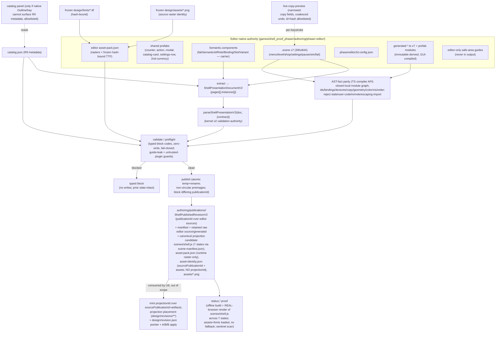

# [DUAL U5] Seven-page Phaser Editor authoring + portable publisher — Plan

> **Scope of this document.** This is the implementation-ready sub-plan for a **single** parent goal unit — `goal.md#U5` — of the dual-design-frontends evaluation. It decomposes U5 into landable work units (`P1`…`P7`) and names the shared-surface U1 integration prerequisites (`S1`…`S6`) that must land and be resealed **before** U5 implementation. It plans the Phaser **authoring surface and portable publisher only**. It does **not** plan the Phaser-native runtime, projection selection/placement, the `design/revision.json` pointer, the minted runtime `projectionId`, or the A→B→B application loop — those are `goal.md#U6` and live under `tools/phaser-shell/src/application/**` and `games/shell_proof_phaser/design/**`, both explicitly outside this card's ownership.
>
> **Amendment note (rev 3).** This revision closes the independent rev-2 acceptance review on card `gJtZP63y` (comment 15, 14 items) and the U1-execution corrections (comments 11, 14). **No product redesign** — the rev-1/rev-2 structure is preserved; each of the 14 findings is closed surgically:
> 1. **No dependency declarations or root-lock mutation.** U5 adds **scripts / config / source only**; the sealed U1 head preseeds the entire accepted `@fabrikav2/phaser-shell` dev toolchain **and** exact game-local `phaser@4.2.1` into package manifests + the single root lock (comment 14). U5 uses the **preseeded TypeScript compiler API** for AST work (no `acorn`/other parser) and proves `npm ci` leaves `package-lock.json` **byte-identical** (S2, P1).
> 2. **The single canonical runtime projection is exactly `scenes/shell.js`,** with all seven states mapped by `scene-manifest.json`. The source publication may *retain* the raw Editor per-state source/generated files but must never call scenes-per-state the canonical projection (KTD-G, P5).
> 3. **V2 `asset-identity.json` carries `sourcePublicationId` + `assets` only, never an embedded `projectionId`** — enabled by the S6 kernel de-cycle repair (KTD-G, S6).
> 4. **AST parity accepts a closed, recursively validated local generated-module graph** (real prefab dependencies) and rejects remote / bare-unexpected / escaping imports (KTD-D, P5).
> 5. **Non-circular portable-manifest preimages;** an existing `publicationId` whose bytes differ is **blocked**. `publicationId` authenticates the authoritative Editor sources; **U6's** `projectionId` authenticates the generated runtime artifacts and links by `sourcePublicationId` (KTD-G, S6).
> 6. **Real Editor provenance** (clean scratch → delete generated output → invoke Workbench *CompileProject* twice → compare hashes → open/save all seven scenes → full terminate/restart/reopen). AST parity alone is insufficient (KTD-I, P6).
> 7. **Native Editor Outline, user-components, and editor-only safe-area guides are used before any plugin,** proving canvas/Outline selection agreement, reorder, visibility, duplicate — and proving **no guides leak** into generated/runtime output (KTD-C, KTD-F, P6).
> 8. **A real compatible texture swap preserves `menu.settings` semantics;** live copy works per keystroke in the real Inspector, **coalesces one typing burst into one undo**, and preserves unrelated fields (KTD-C, P6).
> 9. **The authoritative Editor asset pack may carry only the exact frozen hash-bound TTF entries plus allowed rasters;** the runtime projection pack stays **raster-only**; copied raster + font bytes are in the portable manifest; browser proof shows fonts loaded **without fallback** (KTD-E, KTD-G, P2, P5).
> 10. **Exact plugin IDs + content hashes are allowlisted;** plugin source is statically scanned to reject network/storage/exfiltration APIs; the GUI + proof sessions run with **outbound traffic blocked except loopback** (KTD-C, KTD-F, P6).
> 11. **The real-browser proof loads the published `scenes/shell.js` in Phaser 4.2.1,** waits on assets **and fonts**, covers **all seven states**, and is not an unrelated probe canvas (KTD-I, P5).
> 12. **U5 proves Shop viewport/content semantics only** (U6 owns scrolling); palette acceptance is narrowed to **explicit per-object colors** (the Phaser lane has no native shared-palette model) (KTD-B, P3, P6).
> 13. **A real launch command plus a separate unscored Morning P0 Task Pack** (unique scratch reset, Phaser-specific P0 hash, `Morning Shell` live-while-typing, explicit nonzero move, compatible `icon-control.confirm` swap, save, full restart/reopen, ten-minute soft stop, one neutral hint max, no scoring/adoption/device inference) — U2 and DOM-seed substitution explicitly prohibited (KTD-J, new §Morning Rehearsal Task Pack, P6).
> 14. **After U1 lands, U5 records a trusted lane base descending from the sealed integration branch** and the executable fence uses that recorded base — **never HEAD-as-base** (S5, P1).
>
> **Amendment note (rev 4).** This revision closes the U6 seam review on card `gJtZP63y` (comment 19). **All 14 rev-3 repairs remain unchanged** — this is a narrow output-contract addition and a reference-ownership split, not a product redesign:
> - **A. Three accepted immutable publications are U5's explicit handoff to U6.** U5 must publish and hand off exactly three accepted, immutable, editor-native publications: **P0** (the frozen seed **before any edit**), **A** (the **first** accepted matched-edit bundle), and a **distinct B** (the **second** accepted matched-edit bundle). All three `publicationId`s **plus their manifest/source hashes** are recorded in a committed handoff record, and **each** is independently proven through the existing gates — real-Editor provenance (§6), the deterministic publisher, the full portable manifest, and the real-browser render of `scenes/shell.js` across all seven states (KTD-K, P5, P6).
> - **B. The unscored Morning P0 rehearsal cannot substitute** for these three accepted publications — it stays usability-only evidence; P0/A/B are separate, gate-proven deliverables (KTD-K, §Morning Rehearsal Task Pack).
> - **C. U6 consumes exactly P0/A/B for its P0→A→B→B apply sequence** (B is reused — hence B must be **distinct** from A); **U6 may not fabricate fixtures or patch a runtime** — it consumes only these accepted U5 publications (KTD-K).
> - **D. Reference ownership is split.** U5 writes per-renderer calibrated authoring references only under **`refs/authoring/<publicationId>/`**; **U6 alone owns `refs/runtime/<projectionId>/`** (KTD-K, Output Structure, P6).
> - **E. Single CLI ownership is preserved.** `cli.mjs`'s base `preflight`/`status`/`proof` handlers are **extended/composed by U6, never duplicated**; U5 stays the sole owner of the base handlers and adds no `apply` (KTD-H).

---

## Goal Capsule

- **Objective:** Give the Phaser Editor lane authoring capability at parity with the GrapesJS lane (`goal.md#U3`): seven editable shell surfaces, stable semantic identity, curated asset guidance, and a deterministic portable publisher — all with editor-native `.scene`/project state as the *sole* editable authority, generated code as immutable derived output, and validation anchored on the frozen kernel v2 contract.
- **Product authority:** The Phaser Editor project (`.scene` + `Semantic` component + prefabs + `asset-pack.json` + `phasereditor2d.config.json`) is the only editable visual authority for `shell_proof_phaser` (R11). Generated `.ts`/`.js`, publications, previews, and evidence are derived records that must never be hand-edited back into authority.
- **Execution profile:** One TWF card worktree on `trello-gJtZP63y-...`, landing only to `experiment/dual-design-frontends`, after syncing onto the corrected sealed U1 integration head **that already carries the S1–S6 prerequisites and preseeds all dependencies + the single root lock**. Deterministic tooling is built editor-free and unit-tested; the seven authoritative scenes and their generated code are produced in a **human-authenticated Phaser Editor 5.0.2 GUI session** (a measured vendor cost, per U2 finding 2 — headless regeneration is unsupported and must not be faked). Both legs land through this worktree.
- **Meaning of finished:** `@fabrikav2/phaser-shell` and the Phaser proof authoring surface pass typecheck/unit/render/lint/build; a bootstrapped `ShellPresentationDocumentV2` validates under the kernel v2 parsers; every R10 case fails closed with a typed block and zero writes; the publisher emits one immutable, atomic, portable, network-free `phaser-native` publication under `authoring/publications/<publicationId>/` binding every editor-source/generated/asset/font hash and proving **AST-fact** parity over a closed generated-module graph (not hash-pairing); its single canonical projection candidate is `scenes/shell.js` (seven states via `scene-manifest.json`) linking by `sourcePublicationId`; two clean generations match; **three** accepted immutable publications — **P0** (frozen seed pre-edit), **A** (first matched-edit bundle), **B** (distinct second) — are published, recorded with their `publicationId`s + hashes in a committed handoff record, and each proven through provenance/publisher/manifest/render, the exact set U6 consumes for P0→A→B→B; the full rehearsal edit set persists across save/reopen/publish without raw-source edits; render proof loads `scenes/shell.js` in a real browser across all seven states with fonts loaded (no fallback); `npm --workspace @fabrikav2/phaser-shell run verify-authoring && npm run audit && npm run project-gate` are green with `npm ci` leaving the lock byte-identical; scope and frozen-behavior audits stay inside the Phaser fence measured against the **recorded trusted lane base**. This is **authoring parity**, not runtime readiness (U6) and not device readiness (U8/U10).
- **Stop conditions:** A reproducible authoring/identity/publication feasibility failure that cannot be met without weakening R7–R13 is a `no-go` routed back to a Batu decision (it does not make GrapesJS the winner). A missing Phaser Editor license/account or unreachable browser/device is an environmental **block**, never a pass and never a product defect.
- **Tail ownership:** The card worktree worker owns the deterministic tooling, conventions, catalog, fixtures, and tests. The **conductor** owns (a) the six shared-surface U1 integration cards (S1–S6), which must land and be resealed *before* U5 implementation, and (b) the human-authenticated editor GUI session that authors and compiles the seven scenes and records its recorded-GUI provenance + rehearsal proof.

---

## Product Contract

> Carried from `goal.md#U5` (Requirements R1, R5–R17, R20–R25, R27–R30; Flows F2, F4; Acceptance AE2, AE3, AE6–AE8). **Product Contract unchanged** — this sub-plan enriches HOW; it does not restate or alter the parent's WHAT. R-IDs below reference `goal.md`.

### Summary

Build the same functional seven-surface mobile-game shell that the GrapesJS lane authors, but in Phaser Editor with Phaser as the target renderer — authored directly as Phaser Editor scenes/prefabs rather than translated from a DOM shell. The design owner must be able to perform the matched operation classes (select, direct move + resize, per-keystroke copy preview, palette, compatible curated asset swap with metadata, visibility, sibling reorder, stable duplicate / second currency) and then publish one faithful, deterministic, portable `phaser-native` revision. Editor-native state is the only editable authority; generated Phaser output and publications are immutable derived records.

### Problem Frame

The frozen U1 baseline (`experiment/dual-design-frontends`) preseeds the Phaser lane workspace (`tools/phaser-shell/package.json` with `phaser@4.2.1`, plus — per comment 14 — the accepted dev toolchain and exact game-local Phaser resolution baked into the manifests and single root lock) and the `shell_proof_phaser` proof game with its frozen controller, fake SDK, curated Kenney rasters, fonts, copy, and DOM seed — but there is **no authoring surface and no publisher yet**, and `games/shell_proof_phaser/authoring/` does not exist. U2 proved (verdict `pass`) that the pinned toolchain can hold stable semantic identity in supported editor state, generate deterministically, survive hostile input, publish through typed gates, and rebuild offline. U5 must turn those proven single-scene facts into a full seven-scene authoring project plus the portable publisher, **validating against the frozen kernel v2 contract** (the five U2 `Semantic.*` strings are only an editor-side carrier, not the v2 schema), without introducing a second editable representation and without a runtime/apply loop.

### Requirements (traceability to `goal.md`)

- **R1 / R5 / R6** — Seven distinct editable surfaces (`menu`, `level`, `shop`, `settings`, `pause`, `win`, `fail`) on the canonical 390×844 design system with baseline safe-area guides and the shared optional second-currency counter.
- **R7** — Editor supports canvas + semantic-layer (Outline) selection, direct move/resize, per-object color change, curated asset replacement, visibility, sibling reorder, stable duplication, and copy editing with **live per-keystroke preview**.
- **R8** — A duplicated semantic instance gets a **fresh object UUID automatically**, but its `fabSemanticId` is **cloned** until retargeted: publication **blocks the un-retargeted clone** (`blocked-duplicate-semantic-id`); after retarget it holds a stable new instance ID, stays in the correct semantic parent, retains or explicitly changes an allowed binding, and survives save/close/reopen/publish (and, downstream, apply/device — U6+).
- **R9** — Curated asset tray shows stable asset ID, human-readable name, detailed purpose, slot compatibility, source dimensions, alpha policy, provenance; consumes the same catalog and source raster bytes as the frozen seed. **U2 did NOT prove this metadata is visible in the Phaser Editor UI** — U5 must record GUI proof that it is surfaced, and may add the smallest catalog panel if native UI cannot expose it.
- **R10** — Publication fails closed on missing/hidden required actions, invalid bindings, unsafe geometry, incompatible assets, active content, remote/data/blob content, path escape, symlinks, non-raster runtime-pack entries, unexpected files, unsafe generated imports/user code, editor-only safe-area guides leaking into output, or an unrepresentable runtime state.
- **R11** — Phaser Editor project + `.scene` state is the sole editable authority; generated code/publications/previews/evidence are derived and never hand-edited into authority.
- **R12** — Publish a faithful portable v2 revision that reopens in the editor, identifies its `phaser-native` renderer profile, typed editor-source hashes, asset-catalog hash, artifacts, and source-asset hashes. V1 immutable; migration mints a new identity.
- **R13** — Compiles/runs without Phaser Editor or its account after generated artifacts are committed; no credentials, license material, machine IDs, or private paths in git/publications/logs/Portal/ledger.
- **R14 / R15 / R16 / R17** — Human-only rehearsal edit set works without raw JSON/TS/CSS/generated edits; the same six local commands exist with shared typed outcomes (`applied`, `no-op`, `blocked-drift`, `invalid-revision`, `unsupported-intent`). *(U5 owns `validate`/`publish`/`preflight`/`status`/`proof`; `apply` is U6.)*
- **R20–R25** — Respect the frozen baseline, file fences, capability-mapped tool surface, per-renderer visual references, and the neutral rehearsal.
- **R27 / R28 / R29 / R30** — Portable, offline, network-free publication at publish time; editor-native source authoritative; lane fence discipline; no cross-lane or shared-surface edits without integration cards.

### Acceptance Examples honored

- **AE2 (R7–R13):** Edit copy, per-object color, geometry, order, visibility, asset, and a duplicated counter; reopen and publish; editor preserves changes and stable identities; the bootstrapped v2 document validates under kernel parsers; revision contains only allowed local artifacts; regeneration reproduces identical bytes for the `phaser-native` profile.
- **AE3 (R10–R12):** Hiding a required action, assigning an incompatible raster, injecting active/remote content, escaping the pack root, or moving an action outside the safe region returns a typed block and leaves the prior selected projection unchanged (zero writes).
- **AE6 (R20–R25):** The rehearsal edit set completes without raw-source edits under the frozen protocol, from a clean scratch P0 that does not mutate the landing worktree.
- **AE7 (R27–R29):** With editor and network unavailable, the committed proof game rebuilds from its portable accepted publication; render proof loads `scenes/shell.js` in a real browser with fonts loaded (no fallback); the report records that future Phaser visual editing requires a licensed editor.
- **AE8 (R30–R32):** A cross-lane or shared-file edit blocks in the scope audit / changed-path fence gate (measured against the recorded trusted lane base); published evidence is private and scrubbed.

---

## Shared U1 Integration Prerequisites (conductor-owned; land + reseal BEFORE U5)

> These six repairs touch **shared surfaces** (the audit linter, the root manifest/lockfile, both twins' frozen-behavior guards, the kernel contract package, and the verify-gate) that `experiments/design-frontends/fences.json` and its `sharedSurfaces` block reserve for **conductor integration cards**. Per card comment 3 the U5 plan must *name* them, define the minimal repair and its negative test, and **keep U5 lane work fenced** — U5 does **not** implement any of S1–S6. They must land on the U1 integration head and be **resealed** (baseline regenerated where noted) before U5 syncs and implements. Grounded facts (verified on this merged worktree): `tools/audit/src/structure.js` (`ALLOWED_DIRS`), `games/shell_proof_{grapes,phaser}/tests/unit/frozen-behavior.test.ts` (byte-identical twins), `experiments/design-frontends/baseline/behavior-hashes.json`, `experiments/design-frontends/baseline/dependencies.json`, `packages/kernel/contracts/shell-presentation.v2.json` (`rendererProfiles`, `schemas.assetIdentity`), `packages/kernel/src/shellContract.ts` (`ShellAssetIdentityProjection`), `experiments/design-frontends/fences.json`, `tools/verify-gate/src/git.mjs` (`changedFilesVsMain`).

### S1 — Permit `authoring/` as a top-level proof-game directory in the structure audit
- **Problem:** `tools/audit/src/structure.js` checks each game's top-level entries against `ALLOWED_DIRS = {src, design, content, public, tests, native-resources, refs, docs, evidence, .work}`. `authoring` is absent, so `games/shell_proof_phaser/authoring/` is flagged and `audit`/`project-gate` fail. `fences.json` note #2 already calls this out as an integration-card change.
- **Minimal repair:** Add `'authoring'` to `ALLOWED_DIRS`. Extend the pass fixture `tools/audit/test/fixtures/structure/pass/games/goodgame/` with an `authoring/` entry (or a dedicated fixture) so a positive test proves it is accepted.
- **Negative test:** A bogus top-level dir (e.g. `secrets/`) still produces a violation; `authoring/`'s *interior* is not policed (the linter is top-level only, by design).
- **Why shared / not U5:** `tools/audit/**` is a `_template`/shared surface; `games/shell_proof_grapes` also needs `authoring/` (U3), so the whitelist is a twin-shared change.

### S2 — Preseed the dev toolchain + game-local `phaser@4.2.1` into manifests + the single root lock; guarantee resolution
- **Problem:** The single root `package-lock.json` hoists `phaser@3.90.0` (pulled by `games/find_the_dog`), while `tools/phaser-shell` gets a nested `phaser@4.2.1`. `games/shell_proof_phaser` declares **no** phaser dependency, so any `import 'phaser'` resolved from the game root would pick up **3.90.0**, not the accepted **4.2.1**. `dependencies.json` freezes the workspace + lockfile; the phaser lane cannot fix this unilaterally, and **U5 may not add any dependency declaration** (comment 14: a workspace manifest change without the root lock is invalid).
- **Minimal repair (conductor-owned):** On the U1 head, preseed the entire accepted `@fabrikav2/phaser-shell` dev toolchain (`typescript`, `vite`, `vitest`, `eslint`, `typescript-eslint`, `@types/node`, `@playwright/test`) **and** the exact game-local `phaser@4.2.1` resolution for the published bundle into the relevant package manifests **and** the single root `package-lock.json`, recorded in `dependencies.json`. No nested game lockfile; no accidental root Phaser 3.90 in the bundle's resolution.
- **Negative test:** A resolution test asserts the bundle/proof resolves `phaser` to `4.2.1` (e.g. asserts the resolved `phaser/package.json` version) and fails if `3.90.0` is resolved; a lock-integrity test asserts `npm ci` reproduces `package-lock.json` **byte-identical**.
- **Why shared / not U5:** `package.json`/`package-lock.json` are frozen `sharedSurfaces`; only a conductor integration card may touch dependency declarations or the lock. **U5 verifies (P1); it never edits.**

### S3 — Exclude only `design/revisions/**` + `design/revision.json` from BOTH frozen-behavior guards, reseal baseline, negative-test other drift
- **Problem:** Both twins' byte-identical `frozen-behavior.test.ts` recursively hash **all** of `design/` (skipping only `.DS_Store` and `design/copy.ts`), while `fences.json` declares `design/revisions/**` and `design/revision.json` **writable** and **lane-specific**. The first legitimate U6 projection under `design/revisions` would (a) mismatch the baseline and (b) violate the required cross-twin byte-identity — a guaranteed guard failure. (This is a **U6-enabling** repair the conductor wants landed at U1 seal time; U5 itself writes only under `authoring/`, which is outside `FROZEN_DIRS`.)
- **Minimal repair:** Extend the exclusion mechanism in **both** `games/shell_proof_{grapes,phaser}/tests/unit/frozen-behavior.test.ts` so the hash-walk skips exactly the `design/revisions/**` subtree and `design/revision.json` (a prefix carve-out alongside `IDENTITY_EXCLUDED`), keeping `frozenBehavior.dirs = ["src","design","content","tests/unit"]` unchanged (its value is separately asserted by the frozen `experiment-records.test.ts`). Regenerate the single shared `experiments/design-frontends/baseline/behavior-hashes.json` by replaying the guard's own `frozenFileHashes` walk (no regeneration script exists — the baseline is hand-committed and resealed via `protocol.json`'s `freeze` block). Because the two test files live in the frozen `tests/unit` set, editing them changes their own hashes, so the reseal must include them.
- **Negative test:** Adding a stray byte to any other `design/` file (e.g. `design/tokens.css`, `design/presentation.ts`) still trips the guard; only the two carved-out paths are exempt.
- **Why shared / not U5:** Edits the **grapes** twin (forbidden to the phaser lane) and the shared baseline + frozen `tests/unit`.

### S4 — Kernel-registry test that the canonical bundle validates and raw editor files do NOT leak (NO profile widening)
- **Problem / resolution (card comments 9, 10):** Do **not** widen `shell-presentation-v2` to admit the raw Phaser Editor `components/`/`prefabs/`/`.scene` tree. The `phaser-native` profile in `packages/kernel/contracts/shell-presentation.v2.json` **already** declares exactly the canonical lowercase artifacts U5 needs — `requiredArtifacts: ["scene-manifest.json","asset-pack.json","asset-identity.json"]` plus `allowedArtifactPatterns` for `assets/…(png|jpe?g|webp)` and `scenes/[a-z0-9-]+\.(?:ts|js)` (verified at lines 2675–2684). The pattern permits the single canonical `scenes/shell.js`. So no contract change is required for the artifact set; only a guard test.
- **Minimal repair:** In `packages/kernel/tests/shellContractRegistry.test.ts` (or a sibling), assert that a `phaser-native` projection whose artifacts are the **accepted bundled layout** (`scenes/shell.js` + `scene-manifest.json` + `asset-pack.json` + `asset-identity.json` + `assets/*.png`) validates via `parseProjectionRevisionV2`, and that a projection carrying **raw editor files** (`*.scene`, `*.components`, prefab `*.ts`) or a **TTF/font** artifact under `assets/` is **rejected** (`unsafe-artifact` / `profile-mismatch`) — proving editor-only metadata and fonts cannot leak into the runtime projection.
- **Negative test:** Included above (raw editor files + fonts rejected). Also assert the two profiles stay distinguishable (`indistinguishable-profiles` guard already exists).
- **Why shared / not U5:** `packages/kernel/**` is a `sharedSurface`. U5 **consumes** the existing profile; it never edits the contract.

### S6 — Break the self-referential v2 `asset-identity` ↔ `projectionId` cycle (kernel de-cycle), open renderer-writable paths
- **Problem (verified; card comment 11):** `packages/kernel/contracts/shell-presentation.v2.json` `schemas.assetIdentity.required` currently lists `projectionId` **and** `sourcePublicationId` (lines 3382–3388), and `packages/kernel/src/shellContract.ts` `ShellAssetIdentityProjection` embeds `projectionId` (lines 350–355). Because the runtime `projectionId` is computed over the projection `artifacts` — which **include** `asset-identity.json` — embedding `projectionId` inside `asset-identity.json` is **self-referential** (the id depends on a file that depends on the id). Comment 11: the U1 integration repair "now also breaks the self-referential v2 asset-identity/projection-ID cycle and opens exact renderer-writable paths."
- **Minimal repair (conductor-owned, kernel):** Change `schemas.assetIdentity` so `asset-identity.json` requires exactly `contractId`, `contractVersion`, `sourcePublicationId`, `assets` (drop the required/embedded `projectionId`); update `ShellAssetIdentityProjection` and its parser accordingly. The runtime `projectionId` (still required on the **projection revision**, `schemas.projectionRevision`) is computed by **U6** over `sourcePublicationId` + de-cycled `artifacts`, breaking the loop. Open the exact renderer-writable projection paths (`design/revisions/**`, `design/revision.json`) referenced by S3.
- **Negative test:** An `asset-identity.json` that still embeds `projectionId` is rejected as `additionalProperties`; a de-cycled `asset-identity.json` (`sourcePublicationId` + `assets`) parses; a projection revision missing its `projectionId` still fails (U6's field is untouched).
- **Why shared / not U5:** `packages/kernel/**` is a `sharedSurface`; the fix changes a v2 schema + parser + the identity-computation seam that both lanes and U6 depend on. **U5 consumes the de-cycled `asset-identity.json` shape (comment 15 §3); it never edits the contract and never mints the runtime `projectionId` (that is U6, comment 15 §5).**

### S5 — Executable trusted-lane-base changed-path fence gate
- **Problem:** `fences.json` is data-only today; no gate enforces that a lane's changed paths stay inside its `writable` globs and out of the other lane's `forbidden` globs. The plumbing exists (`tools/verify-gate/src/git.mjs` → `changedFilesVsMain`, merge-base vs `origin/main`/`main`) but nothing matches those paths against the lane fences, and comment 15 §14 forbids using HEAD as the base.
- **Minimal repair:** Add an executable gate (e.g. `tools/verify-gate/fence-gate.mjs`, wired into `audit`/`project-gate`) that computes changed paths **relative to a recorded trusted lane base** — a committed base SHA descending from the sealed `experiment/dual-design-frontends` integration branch, **never HEAD-as-base** — and fails closed if any lands outside the active lane's `writable` set or inside its `forbidden` set. Data-drive it from `fences.json` so both lanes reuse it; read the trusted base from a committed lane-base record (written by U5 P1, consumed here).
- **Negative test:** A synthetic changed path under `games/shell_proof_grapes/**` (forbidden to the phaser lane) fails the gate; a path under `tools/phaser-shell/**` passes; a gate invoked with HEAD-as-base (no trusted base record) fails closed rather than passing vacuously.
- **Why shared / not U5:** `tools/verify-gate/**` is shared tooling and the gate governs both lanes; it belongs in the U1 integration reseal. **U5 records the trusted lane base (P1) and consumes the gate; it does not author the gate.**

> **Precondition on U5:** P1 must verify that the synced head **already carries S1–S6** (structure whitelist present; phaser-resolution + lock-byte-identical tests green; frozen-behavior exclusions + resealed baseline present; kernel-registry bundle test present; kernel `asset-identity` de-cycled; fence gate present and base-record-driven). If any is missing, U5 is **blocked** on the conductor, not worked around inside the lane (no hiding authoring state elsewhere, no importing Phaser 3, no weakening the behavior guard, no hand-editing generated output, no adding a dependency to force resolution, no re-embedding `projectionId`).

---

## Planning Contract

### Approach Summary

Reuse the exact U2-proven seam rather than re-deriving it, but **validate against the kernel v2 contract, not against U2's five flat strings**: the `Semantic` **user component** carries the editor-side identity carrier (no identity plugin); a **narrowed** live-copy-preview plugin gives per-keystroke copy preview with **one-undo-per-typing-burst** coalescing; generated code is **AST-fact-validated over a closed, recursively-resolved local generated-module graph** against scene authority (never headlessly regenerated), using the **preseeded TypeScript compiler API** (no added parser); and the seven scenes are extracted into a real `ShellPresentationDocumentV2` and validated with `parseShellPresentationV2` against the frozen v2 contract's roles/bindings/slots/instances/required-actions. Scale U2's single `Probe.scene` (a generic 720×1280 probe) to seven shell scenes on the canonical **390×844** design system, composed from shared prefabs; browse the curated catalog with full R9 metadata (with recorded GUI proof it is surfaced); and publish one immutable, atomic, portable `phaser-native` publication under `authoring/publications/<publicationId>/` that (a) records typed editor-source + generated + asset + font hashes with **non-circular preimages**, (b) bundles the accepted generated code into a **single canonical `scenes/shell.js`** (seven states via `scene-manifest.json`) plus the lowercase artifacts the existing profile permits, linking by `sourcePublicationId` (no embedded `projectionId`), and (c) rejects source↔generated divergence by **AST-fact parity**. Stop at authoring parity; hand runtime/projection placement, the minted `projectionId`, the `design/revision.json` pointer, and apply to U6.

### Key Technical Decisions

- **KTD-A — Editor-native `.scene`/project is the sole authority; generated code is immutable, hash-pinned, AST-validated derived output.** The Phaser Editor project under `games/shell_proof_phaser/authoring/phaser-editor/` (`.scene`, `Semantic.components`/`Semantic.ts`, prefabs, `asset-pack.json`, `phasereditor2d.config.json`, generated scene/prefab `.ts`) is authority. Generated code is committed as derived output, hash-pinned, AST-fact-validated against its scene source, and never hand-edited (hard constraint). Extends `data-first-semantic-contract-and-immutable-projections`.
- **KTD-B — Identity via the `Semantic` component (editor carrier), MAPPED into and validated against the kernel v2 contract; palette is per-object color.** The five editor fields (`fabSemanticId`, `fabRole`, `fabBinding`, `fabSlot`, `fabVariant`) are flat string carriers (U2 rung (b); no identity plugin). U5 **extracts** them (plus geometry/copy/asset/order/visibility from each scene object) into a `ShellPresentationDocumentV2` — `pages[].instances[]` conforming to `ShellPresentationInstance` (`id`, `prototypeInstanceId`, `parentInstanceId`, `roleId`, `bindingId`, `stateFamilyId`, `actionId?`, `accessibility`, `presentation`, `variants`) — and validates it with `parseShellPresentationV2(doc, { contract })` against the frozen v2 contract's `roles`/`bindings`/`assetSlots`/`stateFamilies`/`instances`/`requiredActions`. The five strings are the *carrier*; the kernel v2 document is the *validation authority*. **Palette (comment 15 §12):** the Phaser lane has **no native shared-palette model**, so U5 accepts only **explicit per-object colors** (per-object `tint`/`fillColor` on individual display objects, captured in `presentation`); no shared palette token graph is introduced. Duplicate → object UUID fresh automatically; `fabSemanticId` cloned until retargeted (KTD spelled out in R8/P3/P4).
- **KTD-C — At most two narrow authoring plugins, native UI first, both authoring-scoped, allowlisted, and never shipped to the runtime bundle.** **Native first (comment 15 §7):** use the native Editor **Outline** (semantic-layer selection/reorder/visibility/duplicate), native **user-components** (`Semantic`), and **editor-only safe-area guides** before any plugin. Plugins are added only against recorded GUI proof native cannot do the job: (1) a **narrowed** live-copy-preview forwarder restricted to **copy fields only** (bound object `role:copy` / `fabBinding` `copy:*`) that **coalesces a typing burst into a single undo entry** (vs U2's one-undo-per-keystroke on all `formText`) and preserves unrelated fields; (2) *only if* the native asset tray cannot surface the full R9 metadata (U2 proved it shows pack keys only), the **smallest catalog panel plugin** rendering `name`/`purpose`/`slotCompatibility`/`dimensions`/`alphaPolicy`/`provenance` from `catalog.json`. **Plugin trust (comment 15 §10):** each plugin's exact **id + content sha256** is allowlisted; plugin source is **statically scanned** to reject network/storage/exfiltration APIs (`fetch`, `XMLHttpRequest`, `WebSocket`, `navigator.sendBeacon`, `localStorage`, `indexedDB`, dynamic `import()`/`eval`); the GUI + proof sessions run with **outbound traffic blocked except loopback**.
- **KTD-D — Source↔generated parity is AST-FACT parity over a CLOSED local generated-module graph, not hash-pairing; parsed with the preseeded TypeScript compiler API.** Headless regeneration is unsupported (U2 finding 2: the scene compiler lives only in the workbench browser client), so the editor auto-compiles on save and U5 **never regenerates**. Using the **preseeded TypeScript compiler API** (`typescript` from the U1-preseeded toolchain — no `acorn`/other parser, per comment 14), U5 parses each generated module's AST and extracts per-object facts — semantic id, role, binding, texture key, copy string, geometry (x/y/width/height/scale), per-object color, visibility, and display-list order — and diffs them against the `.scene` authority. **Imports (comment 15 §4):** accept a **closed, recursively validated local generated-module graph** — `phaser`, the local `Semantic` user-component, and **relative imports that resolve inside the editor project's generated `src/` tree** (real prefab dependencies), transitively closed and cycle-checked; **reject** any remote/bare-unexpected import, any relative import escaping the project (`..` past root), and any user-authored statement outside the deterministic `new X(); x.prop = …` generated shape (`blocked-unsafe-import` / `blocked-user-code`). Any fact divergence is `blocked-drift`. Stale or hand-edited generated code cannot pass.
- **KTD-E — Curated catalog is data with full R9 metadata; source raster identity preserved; fonts hash-bound in the editor pack.** Extend U2's four-field `catalog.json` to the full R9 set: `name`, detailed `purpose`, `slotCompatibility` (cross-checked against the kernel `assetSlots.compatibleRoleIds`), source `dimensions`, `alphaPolicy` (∈ the kernel slot `alpha` domain), and `provenance` (matching `design/kenney-seed.manifest.json`). Catalog and the **authoritative editor** `asset-pack.json` reference the **same individual source raster bytes** frozen under `design/assets/` (KTD8 — no atlas/derivative). **Fonts (comment 15 §9):** the authoritative editor `asset-pack.json` may additionally carry **only the exact frozen hash-bound TTF entries** (`design/fonts/kenney-future.ttf`, `kenney-future-narrow.ttf`) plus allowed rasters; the **runtime projection pack stays raster-only** (the profile's `assets/…(png|jpe?g|webp)` pattern already forbids TTF, guarded by S4). Copied raster **and** font bytes are recorded in the portable manifest.
- **KTD-F — Typed validation reuses U2's `publish-check` vocabulary, extended to the full R10 + safety surface, fail-closed, zero-write.** Block codes: U2's `blocked-missing-semantic-id`, `blocked-duplicate-semantic-id`, `blocked-invalid-binding`, `blocked-invalid-catalog-id`, `blocked-unknown-texture`; extended with `blocked-missing-required-action`, `blocked-unsafe-geometry` (outside safe rect / under 48px `minimumActionSize`), `blocked-active-content` (script/URL-bearing property), `blocked-remote-content` (`http(s)`/`data:`/`blob:` URL), `blocked-unsafe-asset-path` (path escape / `..` / absolute / symlink target outside pack root), `blocked-symlink` (any symlink in the tree), `blocked-non-raster-pack-entry` (**runtime** asset-pack entry not `png`/`jpe?g`/`webp`), `blocked-guide-leak` (an editor-only safe-area guide object present in generated/runtime output), `blocked-unexpected-file` (a publication file outside the allowed set), `blocked-unsafe-import` / `blocked-user-code` (generated code imports/statements outside the closed generated graph/shape), `blocked-untrusted-plugin` (plugin id/hash off the allowlist or containing a rejected API), `blocked-unsafe-string-encoding`, and `blocked-unrepresentable`. Kernel `ShellValidationIssue` codes are surfaced as-is. All map onto the shared typed vocabulary (`invalid-revision`/`unsupported-intent`/`blocked-drift`). A blocked publication performs **zero writes**.
- **KTD-G — One `phaser-native` publication, atomic + file-backed, under `authoring/publications/<publicationId>/`; single canonical `scenes/shell.js`; asset-identity links by `sourcePublicationId` (no `projectionId`); U6 owns `design/` + the minted `projectionId`.** The publisher assembles the publication in a temp directory and **atomically renames** it into place (no partial writes). It records a `ShellPublishedRevisionV2` (`publicationId`, `rendererProfile: 'phaser-native'`, `editorSources: ShellEditorSourceHash[]` keyed by the profile's `editorSourceKinds` = `asset-pack`/`editor-config`/`scene`/`user-components`, `assetCatalogHash`, `pageCount: 7`, `states`) — `publicationId` computed with `computeShellPublicationIdV2`, authenticating **the authoritative Editor sources** (comment 15 §5). It **retains** the raw Editor per-state source/generated files inside the source publication (comment 9) — but these are **not** the canonical projection. The **single canonical projection candidate** is `scenes/shell.js` (comment 15 §2), with **all seven states mapped by `scene-manifest.json`**, alongside the lowercase artifacts the existing profile permits — `asset-pack.json` (**runtime, raster-only**), `asset-identity.json` (per the de-cycled kernel `assetIdentity` schema: `contractId`, `contractVersion`, **`sourcePublicationId`**, `assets[]` of `instanceId`/`slotId`/`assetId`/`path`/`sha256` — **no embedded `projectionId`**, comment 15 §3 + S6), `assets/*.png` — and validates that layout against the `phaser-native` profile. The **runtime `projectionId` is NOT computed here** — U6 mints it over `sourcePublicationId` + the de-cycled artifacts when it places the projection (comment 15 §5). A **portable-project manifest** hashes **every** file with **non-circular preimages** (comment 15 §5): the manifest's own bytes and the `publicationId`/manifest-digest fields are excluded from their own preimage; `publicationId` is the sha256 over the contract-declared `publicationIdFields` only. If a publication directory for the computed `publicationId` already exists but its bytes differ, publish **blocks** (`blocked-publication-mismatch`) rather than overwriting. **U6 alone** owns `design/revisions/**`, the `design/revision.json` pointer, projection placement, and the minted `projectionId`.
- **KTD-H — U5 owns `validate`/`publish`/`preflight`/`status`/`proof` + a rehearsal `reset` and a `launch` entry; `apply` is U6.** All are scriptable and editor-free (U2 command-surface findings) except the GUI-gated `launch` into the human editor session. `proof` is browser-backed (KTD-I); physical-device proof is U8/U10. **Single CLI ownership (comment 19):** `cli.mjs` is the one CLI and U5 is the sole owner of the base `preflight`/`status`/`proof` handlers; **U6 extends/composes those base handlers (and adds `apply`) — it never duplicates them.** U5 itself adds no `apply`.
- **KTD-I — GUI leg is human/vendor-gated with a real Editor provenance protocol; render proof loads `scenes/shell.js` in a REAL browser, never a Node fake canvas or a probe.** The worker builds all deterministic tooling editor-free and may hand-author declarative `.scene` JSON as scaffolding; the paired authoritative generated code comes from a human-authenticated Phaser Editor auto-compile-on-save session. **Provenance (comment 15 §6):** from a clean scratch, delete the generated output, invoke the Workbench **CompileProject twice**, compare the two output hashes (deterministic regeneration proof), open and save all seven scenes, then **fully terminate, restart, and reopen** the editor and re-verify — proving the bytes came from a real Editor, since **AST parity alone is insufficient**. **Render proof (comment 15 §11):** `proof` loads the **published `scenes/shell.js`** in a **real headless browser** (Chromium/Playwright) instantiating **Phaser 4.2.1**, **waits on assets and fonts**, drives **all seven states**, and asserts each state's semantic display objects exist and fonts are loaded **without fallback** — it is explicitly **not** U2's `Probe` canvas, **not** a Node fake canvas, and **not** the U6 runtime shell. This is an **authoring preview** correctness check, not device/runtime convergence (U6/U8/U10 own the phone).
- **KTD-J — Rehearsal clean-P0 scratch/reset + a real `launch` command; the human session never mutates the landing worktree.** A deterministic `reset`/scratch command copies the clean P0 project to a unique scratch location **outside** the landing worktree, records the starting **Phaser-specific P0 project hash**, and a `launch` command opens that scratch project in the editor (card comments 2, 4). The Morning Rehearsal Task Pack (below) is unscored/rehearsal-only and never reused in scored packets; it explicitly prohibits U2 and DOM-seed substitution.
- **KTD-K — U5's handoff to U6 is exactly three accepted immutable publications (P0/A/B) plus a committed handoff record; references split authoring vs runtime (card comment 19).** Beyond the publisher *mechanics* (KTD-G), U5's concrete U6-facing deliverable is **three** accepted, immutable `phaser-native` publications under `authoring/publications/<publicationId>/`, each produced by the *same* deterministic publisher from a **real-Editor-provenanced** authoring state and each independently passing validate → publish (atomic; non-circular manifest; asset-identity `sourcePublicationId`+assets, no `projectionId`) → offline real-browser render of `scenes/shell.js` across all seven states: **P0** = the frozen-seed clean project **before any edit** (the neutral baseline U6 applies first); **A** = the **first** accepted **matched-edit** bundle (a distinct valid publishable state reached by the matched operation classes); **B** = a **distinct second** accepted matched-edit bundle (distinct from A — U6 reuses it, applying B twice). A committed handoff record (`games/shell_proof_phaser/authoring/publications/accepted.json`) maps each role (`p0`/`a`/`b`) to its `publicationId` + manifest/source hash, is **bound to committed bytes by a unit test** (so it cannot drift from the landed publications), and is the exact set **U6 consumes for its P0→A→B→B apply sequence — U6 fabricates no fixtures and patches no runtime** (comment 19). The **unscored Morning P0 rehearsal cannot substitute** for these three gate-proven publications (KTD-J). **Reference split:** U5 writes per-renderer calibrated authoring references only under **`refs/authoring/<publicationId>/`** (R23, hash-bound to publication/renderer/viewport/safe-area); **U6 alone owns `refs/runtime/<projectionId>/`.**

### Morning Rehearsal Task Pack (unscored; comment 15 §13, comments 2/4)

> A **separate, unscored** neutral-rehearsal brief, distinct from the deterministic verification. It exists only to observe discoverability/feedback/recovery on a real human session; **no scoring, adoption, agent, maintenance, or device conclusion may be inferred** from it. It is **never** reused in scored packets. **U2 and the DOM seed are explicitly prohibited as substitutes** — the session runs against the real 390×844 Phaser Editor P0, never U2's 720×1280 probe or the `rendererProfile=dom-css` seed.

- **Launch/reset:** `reset` mints a **unique scratch** copy of the clean P0 (outside the landing worktree) and records the **Phaser-specific P0 project hash**; `launch` opens it in the human-authenticated editor.
- **Task steps (exact):** from the clean Menu P0 — (1) edit `menu.title` copy to **`Morning Shell`**, observed **live while typing**; (2) make an **explicit nonzero move** of a header/title element; (3) perform a **compatible `icon-control.confirm` asset swap** on `menu.settings`, preserving its `menu.settings` semantics; (4) **save**; (5) **fully terminate, restart, and reopen** the editor and confirm the persisted result in the lane-owned preview.
- **Facilitation limits:** **ten-minute soft stop**; **at most one neutral hint**; observation is narrowed to discoverability of semantic selection, move/copy/asset feedback, exact confusion/hints/recovery, and persistence after close/reopen.
- **Hygiene:** scrubbed evidence only (no credentials/account/device IDs/private paths); the landing worktree is never mutated.

### High-Level Technical Design



### Output Structure

Files U5 creates or modifies, all inside the **Phaser lane fence** (`experiments/design-frontends/fences.json` → `lanes.phaser.writable` = `tools/phaser-shell/**`, `games/shell_proof_phaser/authoring/**`, `.../refs/**`, `.../evidence/**`) minus `src/application/**`. **U5 does NOT write `design/revisions/**` or `design/revision.json`** (U6). **U5 writes calibrated authoring references only under `refs/authoring/**`; `refs/runtime/**` is U6's** (comment 19). **U5 adds scripts/config/source only — never dependency declarations or the root lock** (comment 14).

```text
tools/phaser-shell/
  package.json                      # add SCRIPTS + config only (verify-authoring etc.); deps preseeded by U1 (S2); NEVER edit deps/lockfile
  tsconfig.json
  eslint.config.js
  vitest.config.ts
  playwright.config.ts              # browser render-proof harness (offline; loopback-only)
  README.md                         # authoring/publisher usage, vendor-gated GUI leg, launch/reset, morning task pack
  lane-base.json                    # recorded trusted lane base SHA (descends from sealed U1 head) — consumed by S5 fence gate (P1)
  src/
    authoring/
      catalog.ts                    # R9 catalog schema + loader; cross-checks kernel assetSlots
      semantic.ts                   # Semantic carrier vocabulary + guards
      sceneModel.ts                 # scene-JSON walk (shared by validate + publish)
      extractV2.ts                  # scene set -> ShellPresentationDocumentV2 (kernel-shaped)
      astFacts.ts                   # TS compiler API: parse generated closed module graph -> per-object facts (parity)
    publish/
      validate.ts                   # typed block-code gate; kernel parseShellPresentationV2 authority
      preflight.ts                  # validate + full-manifest hash comparison
      publish.ts                    # atomic file-backed publication + canonical bundle + hashing + AST parity
      status.ts                     # read publication state; typed outcomes
      proof.ts                      # offline build + real-browser render of scenes/shell.js (7 states, fonts) + sentinel scan
      manifest.ts                   # portable-project manifest (every file hashed, non-circular preimages) + ShellPublishedRevisionV2
      bundle.ts                     # canonical scenes/shell.js + scene-manifest.json + runtime asset-pack.json + asset-identity.json (sourcePublicationId) + assets (profile-validated)
      safety.ts                     # symlink/path-escape/URL/non-raster/guide-leak/unexpected-file/import/plugin-trust guards
    reset.mjs                       # rehearsal clean-P0 unique-scratch reset (records Phaser P0 hash)
    launch.mjs                      # open the scratch P0 in the human editor session (loopback-only)
    cli.mjs                         # validate/publish/preflight/status/proof/reset/launch (NOT apply)
    # NOTE: src/application/** is U6 — NOT created here
  test/
    catalog.test.ts
    extract-v2.test.ts              # bootstrapped ShellPresentationDocumentV2 validates via kernel
    semantic-identity.test.ts       # duplicate -> clone -> blocked -> retarget -> stable
    validate-blockcodes.test.ts     # every R10 + safety code fires (incl guide-leak, plugin-trust)
    hostile-strings.test.ts         # AST inertness (reuse U2 fixture shape)
    ast-parity.test.ts              # generated facts == scene authority; closed graph; drift/user-code/remote-import blocked
    determinism.test.ts             # two clean generations match
    publish-atomicity.test.ts       # no partial writes; temp+rename; block differing publicationId
    manifest-preimage.test.ts       # non-circular preimages; publicationId over declared fields only
    render-proof.spec.ts            # Playwright: scenes/shell.js instantiates across 7 states, fonts loaded (offline, loopback)
    fixtures/                       # representative scene fixtures for editor-free tests

games/shell_proof_phaser/
  authoring/
    phaser-editor/
      phasereditor2d.config.json
      src/scenes/{Menu,Level,Shop,Settings,Pause,Win,Fail}.scene   # editor-native authority (390x844)
      src/scenes/*.ts                                              # generated derived (GUI-compiled)
      src/prefabs/*.scene + *.ts                                   # shared prefabs (Pause != Settings); generated modules in the closed graph
      src/components/Semantic.components + Semantic.ts             # from U2 (native user-component)
      public/assets/asset-pack.json                               # editor pack: rasters + frozen hash-bound TTF
    catalog/catalog.json            # curated tray, full R9 metadata
    editor-plugins/live-copy-preview/   # narrowed forwarder (copy fields, coalesced undo); allowlisted id+hash
    editor-plugins/catalog-panel/       # optional, only if native tray can't surface R9 metadata; allowlisted
    editor-plugins/allowlist.json       # exact plugin id + content sha256 allowlist (KTD-C/§10)
    publications/<publicationId>/   # immutable, atomic publications — the P0/A/B accepted set (U5-owned; U6 reads)
    publications/accepted.json      # handoff record: {p0,a,b} -> publicationId + hash (comment 19; unit-bound to committed bytes)
  refs/authoring/<publicationId>/   # per-renderer calibrated authoring references (R23); U6 alone owns refs/runtime/<projectionId>/
  evidence/<run-id>/                # rehearsal edit-set + recorded-GUI provenance + morning-pack + P0/A/B publish proofs + ledger (scrubbed)
```

---

## Implementation Units

> Work units of parent goal unit U5, id-prefixed **P** to stay unambiguous vs. `goal.md`'s U-IDs and this doc's R-IDs. Land in dependency order. All units are inside the Phaser lane fence; none touch `src/application/**`, `design/revisions/**`, `design/revision.json`, the Grapes lane, shared surfaces (S1–S6 are conductor-owned), `_template`, `create-game`, existing games, or root manifests/lockfile.

### P1. Sync onto the sealed U1 head (with S1–S6), record the trusted lane base, and scaffold the Phaser lane authoring workspace

- **Goal:** Put the card worktree on the correct base **that already carries S1–S6 and the preseeded deps + root lock**, record the trusted lane base for the fence gate, and stand up the `@fabrikav2/phaser-shell` authoring/publisher package skeleton and the `authoring/` project skeleton — **scripts/config/source only**.
- **Requirements:** R11, R13, R30; S1–S6 precondition for all; comment 14 (no deps/lock) + comment 15 §14 (trusted lane base).
- **Dependencies:** S1–S6 landed + resealed (conductor).
- **Files:** `tools/phaser-shell/{package.json (SCRIPTS+config only),tsconfig.json,eslint.config.js,vitest.config.ts,playwright.config.ts,lane-base.json}`, `tools/phaser-shell/src/` (empty module skeletons excluding `application/`), `games/shell_proof_phaser/authoring/` skeleton (config, empty editor `public/assets/asset-pack.json`, `editor-plugins/{live-copy-preview,allowlist.json}`, `src/components/Semantic.*` imported from the U2 fixture).
- **Approach:** Sync `trello-gJtZP63y-...` onto the corrected sealed U1 integration head of `experiment/dual-design-frontends`. **Verify S1–S6 are present** (structure whitelist includes `authoring`; the phaser-resolution test is green; `npm ci` leaves `package-lock.json` byte-identical; both frozen-behavior guards carve out `design/revisions/**` + `design/revision.json` and the baseline is resealed; the kernel-registry bundle test exists; the kernel `asset-identity` is de-cycled; the fence gate exists and is base-record-driven). If any is missing → **block on the conductor**, do not proceed. **Record the trusted lane base** (`tools/phaser-shell/lane-base.json` = the sealed U1 head SHA, verified to descend from `experiment/dual-design-frontends`) for the S5 fence gate — never HEAD-as-base. Add only **scripts/config/source** to `tools/phaser-shell/package.json`; **add no dependency declarations and do not touch the root lock** (the U1 head preseeded the toolchain + game-local `phaser@4.2.1`). Copy the U2 `Semantic` component and the live-copy plugin (to be narrowed in P6) into the lane; register the plugin id in `editor-plugins/allowlist.json`.
- **Execution note:** Mostly scaffolding/config; prefer install + build smoke over unit coverage. Do not author scene content here.
- **Patterns to follow:** `tools/phaser-shell/package.json` (U1 preseed), `tools/grapes-shell/` layout as the lane-parity shape, U2 `editor-project/src/components/Semantic.ts` and `editor-plugins/live-copy-preview/`.
- **Test scenarios:** `Test expectation: none — scaffolding/config`. Verification is: `npm ci` leaves `package-lock.json` byte-identical (diff clean); `npm --workspace @fabrikav2/phaser-shell run typecheck` and `build` succeed on the empty skeleton; `npm run audit` passes now that S1 whitelists `authoring/`; the S2 phaser-resolution test is green; `lane-base.json` records a base descending from the sealed integration head.
- **Verification:** Worktree base is the sealed U1 head (recorded in `lane-base.json`); S1–S6 confirmed present; `npm ci` byte-identical lock; package installs and typechecks; no root manifest/lockfile diff; nothing outside `lanes.phaser.writable` (the S5 fence gate, run against the recorded base, agrees).

### P2. Curated asset catalog + editor asset pack as data (R9)

- **Goal:** Make the frozen seed rasters browsable as a curated tray with complete R9 metadata and compatibility, consumed identically to the Grapes lane catalog and cross-checked against the kernel asset-slot definitions; declare the frozen hash-bound TTF entries for the editor pack.
- **Requirements:** R5, R9, R11 (KTD-E, KTD8); comment 15 §9 (fonts).
- **Dependencies:** P1.
- **Files:** `games/shell_proof_phaser/authoring/catalog/catalog.json`, `games/shell_proof_phaser/authoring/phaser-editor/public/assets/asset-pack.json`, `tools/phaser-shell/src/authoring/catalog.ts`, `tools/phaser-shell/test/catalog.test.ts`.
- **Approach:** Extend U2's four-field `catalog.json` to the full curated set drawn from `design/assets/`. Each entry gains `name`, detailed `purpose`, `slotCompatibility`, `dimensions` (from the PNG header), `alphaPolicy` (∈ kernel slot `alpha` domain), and `provenance` (Kenney source + license, matching `design/kenney-seed.manifest.json`). The **editor** `asset-pack.json` `packKey`s match catalog `packKey`s and load identical source raster bytes (no atlas/derivative), **plus** the exact frozen hash-bound TTF entries (`design/fonts/kenney-future.ttf`, `kenney-future-narrow.ttf`) — and **only** those fonts. `catalog.ts` loads + validates the catalog, exposes lookups for validation/publish, cross-checks `slotCompatibility` against the frozen v2 contract's `assetSlots[].compatibleRoleIds`, and asserts every declared font byte-matches its frozen `design/fonts/*.ttf` hash. *(Whether this metadata is **visible in-editor** is proven in P6; here it is validation-time data. The **runtime** pack is raster-only and is produced by P5's bundler, not here.)*
- **Patterns to follow:** U2 `catalog/catalog.json`; `design/assets.ts`, `design/kenney-seed.manifest.json`; `design/assets/*.png` + `design/fonts/*.ttf` as byte source of truth; kernel `ShellAssetSlotDefinition`.
- **Test scenarios:**
  - Happy: every catalog `id` resolves to an existing `design/assets/*.png`; `packKey`s unique + present in the editor `asset-pack.json`; recorded `dimensions` match PNG header bytes; declared TTF entries byte-match the frozen fonts.
  - Edge: `slotCompatibility` references only slots/roles in the kernel contract; `alphaPolicy` ∈ `{allowed,required,forbidden}`; `provenance` license matches the seed manifest.
  - Error: a catalog entry pointing at a non-seed path fails the loader; a `packKey` mismatch fails; a `slotCompatibility` role absent from the contract fails; a font entry other than the two frozen TTFs (or a hash mismatch) fails.
  - `Covers AE2 (asset metadata/compatibility).`
- **Verification:** `catalog.test.ts` green; catalog + editor asset-pack reference only frozen source bytes (rasters + the two frozen TTFs); no derived textures; slot compatibility agrees with the kernel contract.

### P3. Semantic carrier, kernel-v2 extraction, shared prefabs, and the seven-scene authoring model

- **Goal:** Define the semantic carrier vocabulary, the **scene→`ShellPresentationDocumentV2` extractor**, and the seven editable shell scenes composed from shared prefabs, with authored `.scene` JSON as authority (generated `.ts` produced in the GUI session per KTD-I).
- **Requirements:** R1, R5, R6, R7, R8, R11 (KTD-A, KTD-B); comment 15 §12 (Shop viewport-only; per-object palette).
- **Dependencies:** P1, P2.
- **Files:** `tools/phaser-shell/src/authoring/{semantic.ts,sceneModel.ts,extractV2.ts}`, `games/shell_proof_phaser/authoring/phaser-editor/src/scenes/{Menu,Level,Shop,Settings,Pause,Win,Fail}.scene` (+ generated `.ts` from P6), `.../src/prefabs/*`, `tools/phaser-shell/test/{semantic-identity.test.ts,extract-v2.test.ts,fixtures/}`.
- **Approach:** Author seven scenes on a border matching the canonical **390×844** design coordinate system (R5) with baseline safe-area anchors *(U2's `Probe.scene` was a generic 720×1280 probe; the real scenes must target 390×844)*. Build shared prefabs for the recurring compositions — currency counter, primary/secondary action button, modal, Shop catalog card, Settings row, and the optional second-currency socket — so duplicate-and-specialize (R6/R8) is a prefab instance, not a copy. **Pause and Settings are distinct prefabs/compositions** (R2), asserted. **Shop (comment 15 §12):** the Shop scene proves **viewport + catalog content semantics only** (product cards, back/restore actions, layout) — **scrolling behavior is U6's** and is out of scope here. **Palette (comment 15 §12):** color edits are **explicit per-object colors** (`tint`/`fillColor` on individual objects) captured into `presentation` — no shared palette model. Every semantic object carries the `Semantic` component. `semantic.ts` is the single source of the carrier vocabulary + guards; `sceneModel.ts` is the shared scene-JSON walk; **`extractV2.ts` maps the scene set into a `ShellPresentationDocumentV2`** (`pages[].instances[]` conforming to `ShellPresentationInstance`, mapping `fabRole→roleId`, `fabBinding→bindingId`, `fabSlot→anchor/assetSlot`, `fabVariant→variant`, and geometry/copy/asset/order/per-object-color/visibility→`presentation`) and validates it with `parseShellPresentationV2(doc, { contract })` against the frozen v2 contract. **Duplicate identity chain (R8), explicit:** object UUID is fresh automatically; `fabSemanticId` is cloned; the extractor/model represent both the pre-retarget (duplicate id, same parent) and post-retarget (fresh id, same parent, allowed binding) states so P4 can block the former and pass the latter.
- **Execution note:** Build `semantic.ts`/`sceneModel.ts`/`extractV2.ts` and the fixture scenes test-first; the real seven authoritative scenes' generated code is the GUI-gated deliverable folded in at P6.
- **Patterns to follow:** U2 `editor-project/src/scenes/Probe.scene` (Semantic keys/texture keys/origins/anchor), `design/presentation.ts` for seed geometry, the frozen `TemplateShellController` states; kernel `ShellPresentationInstance`/`ShellPresentationPage`/`parseShellPresentationV2`.
- **Test scenarios:**
  - Happy: all seven scenes parse; each declares its required semantic actions (`menu`: play/shop/settings; `pause`: resume/settings/home; `win`: next/home; `fail`: retry/home; `shop`: back/restore + catalog); the extracted `ShellPresentationDocumentV2` validates via `parseShellPresentationV2` with zero issues.
  - Edge (R6/R8): the second-currency socket binds a distinct `fabSemanticId`/`counter:*`; a duplicated prefab instance is representable with a fresh id in the same parent.
  - Edge (R2): `Pause` and `Settings` have structurally distinct instance trees (asserted).
  - Edge (R7/§12): move/resize, visibility, sibling reorder, and a **per-object color change** are representable in the model + survive extraction without losing identity; the Shop viewport/content semantics are represented without any scrolling-behavior state.
  - Error: a scene missing a required action, or with a duplicate `fabSemanticId`, or whose `fabRole`/`fabBinding` is absent from the contract, fails extraction/validation.
  - `Covers AE2, AE6.`
- **Verification:** `semantic-identity.test.ts` + `extract-v2.test.ts` green; the extracted document validates under the kernel; seven scenes enumerate required actions; Pause≠Settings asserted; second-currency socket + duplicate chain representable; Shop is viewport/content-only.

### P4. Typed validation gate — `validate` and `preflight` (R10 + safety)

- **Goal:** Fail closed on every unsafe/invalid/incomplete state with a named block code and zero writes, using the kernel v2 parsers as the semantic authority and mapping onto the shared typed vocabulary.
- **Requirements:** R10, R11, R16, R17 (KTD-F); comment 15 §7 (guide-leak), §10 (plugin trust).
- **Dependencies:** P2, P3.
- **Files:** `tools/phaser-shell/src/publish/{validate.ts,preflight.ts,safety.ts}`, `tools/phaser-shell/test/{validate-blockcodes.test.ts,hostile-strings.test.ts}`.
- **Approach:** `validate.ts` first runs the kernel authority — extract → `parseShellPresentationV2` — surfacing kernel `ShellValidationIssue`s, then applies the extended lane block-code surface over `sceneModel.ts`: U2's five codes plus `blocked-missing-required-action`, `blocked-unsafe-geometry`, `blocked-active-content`, `blocked-remote-content`, `blocked-unsafe-asset-path`, `blocked-symlink`, `blocked-non-raster-pack-entry` (runtime pack), `blocked-guide-leak` (an editor-only safe-area guide object present in generated/runtime output), `blocked-unexpected-file`, `blocked-unsafe-import`, `blocked-user-code`, `blocked-untrusted-plugin` (plugin id/hash off `allowlist.json` or containing a rejected network/storage/exfiltration API), `blocked-unsafe-string-encoding`, `blocked-unrepresentable`. `safety.ts` centralizes the filesystem/URL/plugin guards (reject symlinks; reject `..`/absolute/path-escape; reject `http(s)`/`data:`/`blob:`/script/play URLs; reject non-raster runtime-pack entries; reject files outside the allowed publication set; reject safe-area guide objects in output; statically scan allowlisted plugins for banned APIs). `preflight.ts` = `validate` + full-manifest hash comparison. Every block path is read-only: **zero writes**, prior outputs untouched (AE3). Emit typed results mapping block codes to `invalid-revision`/`unsupported-intent`/`blocked-drift`.
- **Patterns to follow:** U2 `scripts/publish-check.mjs` (`walkObjects`, `BLOCK_CODES`, `BINDING_REQUIRED_ROLES`), U2 `tests/hostile-strings.test.ts` and `tests/binding.test.ts`; kernel `parseShellPresentationV2` + `ShellContractValidationError`.
- **Test scenarios:**
  - Happy: a clean seven-scene fixture returns `ok` with zero blocks and validates under the kernel.
  - Error (one per code): missing/duplicate semantic id; missing binding on a binding-required role; `asset:<unknown-id>`; unknown texture; asset path escaping the pack root; symlink; `http(s)`/`data:`/`blob:` URL; a required action hidden/removed; an action rect outside the safe region / under 48px; non-raster runtime-pack entry; a safe-area guide leaking into output; an unexpected publication file; a generated `import` outside the closed graph; a user-authored statement; an untrusted/off-allowlist plugin or one with a banned API; an unrepresentable/unsafe string.
  - Duplicate-before-retarget (R8/AE3): a scene whose duplicated instance still carries the cloned `fabSemanticId` returns `blocked-duplicate-semantic-id`; the retargeted variant passes.
  - Inertness (R10/AE3): hostile copy/identifiers containing `"`/`'`/`` ` ``/`${}`/`{}`/newline/`*/`/`//`/`</script>` round-trip as inert string data (AST proof) — matches U2's proven compiler escaping.
  - Zero-write invariant: after any block, no file under the publication output path changed (mtime + bytes).
  - `Covers AE3.`
- **Verification:** every block code has a firing test; clean fixtures pass under kernel + lane checks; hostile-string AST test green; zero-write asserted.

### P5. Deterministic portable publisher — `publish`, `status`, `proof` (R12/R27) with AST-fact parity

- **Goal:** Emit one immutable, atomic, portable, network-free `phaser-native` publication under `authoring/publications/<publicationId>/` that reopens in the editor, binds every typed hash with non-circular preimages, bundles the **single canonical `scenes/shell.js`** projection candidate, links asset-identity by `sourcePublicationId` (no `projectionId`), and rejects source↔generated divergence by **AST-fact parity over a closed module graph** — without ever regenerating headlessly, and proven by a **real-browser** render of `scenes/shell.js`.
- **Requirements:** R11, R12, R13, R16, R17, R27, R28, R29 (KTD-D, KTD-G, KTD-H, KTD-I, KTD-K); comment 15 §2/§3/§4/§5/§9/§11; comment 19 (P0/A/B handoff record + single-CLI ownership).
- **Dependencies:** P3, P4.
- **Files:** `tools/phaser-shell/src/publish/{publish.ts,status.ts,proof.ts,manifest.ts,bundle.ts,handoff.ts}`, `tools/phaser-shell/src/authoring/astFacts.ts`, `tools/phaser-shell/src/{cli.mjs,launch.mjs}`, `tools/phaser-shell/{playwright.config.ts}`, `tools/phaser-shell/test/{determinism.test.ts,ast-parity.test.ts,publish-atomicity.test.ts,manifest-preimage.test.ts,render-proof.spec.ts,accepted-handoff.test.ts}`.
- **Approach:** `publish.ts` runs `validate`, then assembles the publication in a temp dir and **atomically renames** it into `authoring/publications/<publicationId>/` (no partial writes); if a directory for the computed `publicationId` already exists but its bytes differ, it **blocks** (`blocked-publication-mismatch`). `manifest.ts` records: `ShellPublishedRevisionV2` (`publicationId` via `computeShellPublicationIdV2` over the contract-declared `publicationIdFields` **only** — authenticating the authoritative Editor sources) **and** a portable-project manifest hashing **every** file (each `.scene`, prefab, `Semantic.*`, editor `asset-pack.json`, `phasereditor2d.config.json`, every generated module, every asset, every declared font, the catalog, and every canonical bundle artifact) with **non-circular preimages** (the manifest's own bytes and the identity fields are excluded from their own preimage). `bundle.ts` deterministically bundles the accepted generated code into the **single canonical `scenes/shell.js`** with **all seven states mapped by `scene-manifest.json`**, plus the runtime `asset-pack.json` (**raster-only**), `asset-identity.json` (de-cycled kernel schema: `sourcePublicationId` + `assets`, **no `projectionId`** — S6), and `assets/*.png`, and validates the layout against the `phaser-native` profile via `parseProjectionRevisionV2`; **raw editor files + fonts never enter the bundle** (S4 guards this in the kernel; the raw editor source/generated are *retained separately* in the source publication, not as the canonical projection). It does **not** mint the runtime `projectionId` (U6 owns it). `astFacts.ts` implements KTD-D with the **preseeded TypeScript compiler API**: parse the closed generated-module graph, extract per-object facts, diff against the `.scene` authority, and reject any divergence (`blocked-drift`), any remote/bare/escaping import (`blocked-unsafe-import`), or any user-authored statement (`blocked-user-code`). `status.ts` reads publication state → typed outcomes. `handoff.ts` reads/writes/validates the committed handoff record `authoring/publications/accepted.json` — mapping roles `p0`/`a`/`b` to their `publicationId` + manifest/source hash, asserting all three publications exist on disk with byte-consistent manifests and that **A ≠ B** — so U6 consumes exactly the three accepted publications (comment 19); the same publisher is invoked once per accepted authoring state to mint **P0/A/B**, each independently passing the full gate chain (validate → publish → manifest → real-browser render). `proof.ts` runs the offline, network-free proof: an offline build resolving `phaser@4.2.1` (per S2) with no editor package markers, a bundle-sentinel scan, and a **Playwright real-browser render** that loads the published `scenes/shell.js`, waits on assets **and fonts**, drives **all seven states**, and asserts each state's semantic display objects exist and fonts are loaded **without fallback** (authoring preview — *not* U2's `Probe`, *not* the U6 runtime shell, *not* a Node fake canvas). `cli.mjs` exposes `validate`/`publish`/`preflight`/`status`/`proof`/`reset`/`launch` (**not** `apply`).
- **Patterns to follow:** U2 `report.json` `command_surface`, `scripts/{hash,normalize,verify}.mjs`, `feasibility.normalization`; kernel `computeShellPublicationIdV2`/`parseShellPublishedRevisionV2`/`parseProjectionRevisionV2`; `data-first-semantic-contract-and-immutable-projections`; game-qa Playwright patterns for the offline render harness.
- **Test scenarios:**
  - Happy (AE2): a valid seven-scene project publishes under `authoring/publications/<publicationId>/`; the publication contains the retained raw editor sources/generated + manifest + the single canonical `scenes/shell.js` bundle + allowed artifacts; reopening the editor-source round-trips byte-identically; the bundle validates under the `phaser-native` profile.
  - Determinism (R12/AE2): two clean publications of unchanged input are byte-identical; an unchanged re-publish is a `no-op`; a differing-bytes collision on an existing `publicationId` blocks.
  - Canonical projection (§2): exactly one `scenes/shell.js`; `scene-manifest.json` maps all seven states; no scenes-per-state file is treated as the canonical projection.
  - Identity (§3/§5): `asset-identity.json` carries `sourcePublicationId` + `assets` and **no** `projectionId`; `publicationId` recomputes from the declared fields only; manifest preimages are non-circular (`manifest-preimage.test.ts`).
  - AST parity (§4/KTD-D): a generated module whose facts diverge from its `.scene` (hand-edited/stale) blocks `blocked-drift`; a remote/bare/escaping import blocks `blocked-unsafe-import`; a legitimate local prefab import in the closed graph passes; a hand-added statement blocks `blocked-user-code`; zero writes.
  - Atomicity (KTD-G): an interrupted publish leaves **no** partial publication directory (temp+rename proven).
  - Offline (R13/R27/AE7): `proof` builds and renders with network disabled and no editor present; `phaser` resolves to `4.2.1`; the runtime bundle carries the sentinel and no editor markers; the runtime pack is raster-only.
  - Real-browser render (§11): `scenes/shell.js` instantiates in Chromium across all seven states with assets + fonts loaded (no fallback); a state that fails to instantiate, or a font that falls back, fails proof; U2's probe canvas is not used.
  - P0/A/B handoff (comment 19): the handoff record `authoring/publications/accepted.json` maps `p0`/`a`/`b` to three **distinct** `publicationId`s (A ≠ B), each resolving to an on-disk publication whose manifest/source hash matches the record; a role pointing at a missing publication, at a publication whose bytes differ from the recorded hash, or with A == B fails the handoff test; the record is bound to committed bytes (cannot drift from the landed publications).
  - Security (R10): a publication carrying active/remote content, a symlink, a path escape, a guide leak, an untrusted plugin, or an unexpected file is refused before any write.
  - `Covers AE2, AE7.`
- **Verification:** `determinism`, `ast-parity`, `publish-atomicity`, `manifest-preimage`, `render-proof`, `accepted-handoff` green; two clean generations match; single canonical `scenes/shell.js` validated under the profile; asset-identity has no `projectionId`; the handoff record maps `p0`/`a`/`b` to three distinct hash-consistent publications (A ≠ B); offline real-browser proof passes across 7 states with fonts loaded and no editor footprint; typed outcomes emitted correctly.

### P6. Author the seven authoritative scenes with real Editor provenance, native-first UI, narrowed plugins, and the rehearsal + morning task pack (vendor-gated)

- **Goal:** Produce the real seven-scene authoritative project + generated code in the Phaser Editor with **recorded real-Editor provenance**; use **native Outline/user-components/safe-area guides first**, narrowing the live-copy plugin and (if needed) adding the allowlisted catalog panel with recorded GUI proof; prove the full rehearsal edit set persists across save/close/reopen/publish without raw-source edits, from a clean scratch P0; **publish and hand off the three accepted immutable publications P0/A/B (comment 19), recording their `publicationId`s + hashes and proving each through the provenance/publisher/manifest/render gates**; and run the separate unscored Morning P0 Task Pack. All with a scrubbed evidence record and implementation ledger.
- **Requirements:** R7, R8, R9, R14, R21, R22, R23, R24, R25 (KTD-C, KTD-I, KTD-J, KTD-K); comment 15 §6/§7/§8/§10/§13; comment 19 (P0/A/B accepted publications + refs/authoring split); F2, F4; AE2, AE6, AE7, AE8.
- **Dependencies:** P3, P4, P5.
- **Files:** `games/shell_proof_phaser/authoring/phaser-editor/src/scenes/*.{scene,ts}`, `.../src/prefabs/*`, `games/shell_proof_phaser/authoring/editor-plugins/{live-copy-preview,catalog-panel,allowlist.json}`, `games/shell_proof_phaser/authoring/publications/{<publicationId>/,accepted.json}` (the P0/A/B accepted set + handoff record), `games/shell_proof_phaser/refs/authoring/<publicationId>/` (U5 authoring refs only — `refs/runtime/<projectionId>/` is U6's), `games/shell_proof_phaser/evidence/<run-id>/` (rehearsal captures + recorded-GUI provenance + morning-pack record + P0/A/B publish proofs + `implementation-ledger.json`, scrubbed).
- **Approach:** From a clean scratch P0 (via `reset`, KTD-J — never the mutable landing worktree; `launch` opens it) in a **human-authenticated Phaser Editor 5.0.2 GUI session** with **outbound traffic blocked except loopback** (§10), author the seven scenes from the P3 model and P2 catalog, letting the editor auto-compile generated code on save. **Real Editor provenance (§6):** delete the generated output, invoke the Workbench **CompileProject twice**, compare the two output hashes (deterministic regen proof), open + save all seven scenes, then **fully terminate, restart, and reopen** the editor and re-verify — record the hash-bracketed sequence. **Native-first UI (§7):** use the native **Outline** for semantic-layer selection/reorder/visibility/duplicate and **editor-only safe-area guides**; record proof that canvas selection and Outline selection agree, and that reorder/visibility/duplicate work; confirm (via P5 proof) **no guides leak** into generated/runtime output. **Narrow the live-copy plugin** to copy fields with **one-undo-per-typing-burst** coalescing (§8), record the before/after undo behavior, and record that unrelated fields are preserved. **Record GUI proof the curated-tray R9 metadata is surfaced**; if native shows only pack keys (U2's finding), add the smallest allowlisted `catalog-panel` plugin and record proof. Perform the rehearsal edit set — **per-object color** + title/button copy change (live per-keystroke), reposition + resize a header element and a primary action to a target reference, **a real compatible texture swap that preserves `menu.settings` semantics (§8)** plus ≥1 further curated swap, **duplicate the currency counter → observe the cloned `fabSemanticId` blocks publication → retarget to the second-currency socket → passes**, reorder + hide an optional instance, keep Settings and Pause visibly distinct, restyle one Shop product section (viewport/content only) — then publish, close, reopen, re-inspect. **Produce and hand off the three accepted publications (§comment 19 / KTD-K):** publish **P0** from the frozen-seed clean project *before any edit*; publish **A** from the first accepted matched-edit bundle and a **distinct B** from a second accepted matched-edit bundle (the matched operation classes above yield the two distinct valid states); record all three `publicationId`s + manifest/source hashes in `authoring/publications/accepted.json`, and prove **each** through real-Editor provenance (§6), the deterministic publisher, the full portable manifest, and the real-browser render of `scenes/shell.js` across all seven states. These three gate-proven publications — **not** the unscored Morning pack — are U5's handoff to U6 (which applies P0→A→B→B and fabricates no fixtures). Write per-renderer calibrated authoring references only under `refs/authoring/<publicationId>/` (R23); `refs/runtime/<projectionId>/` is U6's. **Run the separate unscored Morning P0 Task Pack** (the exact steps in §Morning Rehearsal Task Pack) and record its observations (ten-minute soft stop, ≤1 hint, no scoring/adoption/device inference; U2/DOM-seed substitution prohibited). Generate the per-renderer calibrated authoring references into `refs/authoring/<publicationId>/` (hash-bound to publication/renderer/viewport/safe-area, R23; `refs/runtime/<projectionId>/` stays U6's). Record the implementation ledger (starting/ending SHA, inherited work, agent/model identity, active elapsed time, attempts, rework, human intervention, added deps/tools = none, changed surface, failed gates) and scrubbed evidence (no credentials/account/device IDs/private paths — R13/R32). If the editor/license/browser is unavailable, record an environmental **block** honestly (never a fabricated pass).
- **Execution note:** Vendor-gated and conductor/Batu-run (like U2's Android leg). The deterministic tooling (P1–P5, P7) is worker-owned and editor-free; the P5 AST-fact parity gate rejects any hand-faked generated bytes by construction, and §6 provenance corroborates the bytes came from a real Editor.
- **Patterns to follow:** U2 `scripts/editor-session.mjs` + `scripts/session-snapshot.mjs` + `evidence/sessions/session-ledger.json` (hash-bracketed GUI observations), U2 `report.md` ledger shape, `experiments/design-frontends/evidence.schema.json`.
- **Test scenarios:** `Test expectation: primarily human/GUI proof, bound to committed bytes.` Deterministic bindings: the published scenes validate + publish cleanly via P4/P5; a unit test binds the evidence-ledger hashes to committed project bytes so evidence cannot drift from landed state (U2 pattern); every rehearsal edit is observable in the reopened project; the duplicate-block-then-retarget sequence is recorded; the CompileProject-twice hashes match; the texture-swap-preserves-`menu.settings`-semantics assertion holds; the three accepted publications **P0/A/B** are published and recorded in `authoring/publications/accepted.json` with distinct hash-consistent `publicationId`s (A ≠ B), each proven through provenance/publisher/manifest/render, and the handoff record is bound to committed bytes; the morning-pack record is present and scrubbed.
  - `Covers AE2, AE6, AE7, AE8 (scrubbed evidence).`
- **Verification:** the rehearsal edit set completes without raw-source edits from a clean scratch P0; real-Editor provenance (CompileProject-twice + terminate/restart/reopen) recorded; native Outline selection agreement + reorder/visibility/duplicate proven; no guides leak; live-copy burst-to-undo + preserved-fields recorded; texture swap preserves `menu.settings`; curated-tray metadata proven surfaced; the morning pack ran under its limits with U2/DOM-seed prohibited; reopen preserves changes + stable identities; publication is deterministic + atomic; the three accepted publications **P0/A/B** are handed off (recorded in `accepted.json`, A ≠ B, each gate-proven) and are U6's only inputs; authoring refs live under `refs/authoring/<publicationId>/`; evidence is scrubbed + hash-bound; ledger complete. Honest `blocked` recorded if the license/editor/browser is unavailable.

### P7. Wire `verify-authoring`, scope + frozen-behavior + fence audits, and local verification

- **Goal:** Provide the single card-verification entry point and prove the lane stays inside its fence (measured against the recorded trusted lane base) with frozen behavior untouched.
- **Requirements:** R11, R13, R20, R30; the card's Verification command; comment 14 (lock byte-identical), comment 15 §14 (trusted base).
- **Dependencies:** P1–P6.
- **Files:** `tools/phaser-shell/package.json` (`verify-authoring` script), `tools/phaser-shell/README.md`.
- **Approach:** Implement `verify-authoring` to run, editor-free: `typecheck` + `test:unit` + `render` (Playwright offline preview of `scenes/shell.js`) + `lint` + `build` for `@fabrikav2/phaser-shell` and the Phaser proof authoring surface, plus `validate` → `publish` (determinism / AST parity / atomicity / preimage) → offline `proof` on the committed seven-scene project. Confirm `npm ci` leaves `package-lock.json` byte-identical, the scope audit, the S5 changed-path fence gate (run against `lane-base.json`, never HEAD), and each proof game's frozen-behavior guard still pass — the frozen dirs (`src`, `content`, `tests/unit`, and `design` except the S3 carve-outs `design/revisions/**` + `design/revision.json`, and the identity-excluded `design/copy.ts`) are byte-unchanged; `_template`/`create-game` byte-identical to main. Because S1 whitelists `authoring/` and S5 enforces the fence from the trusted base, `audit`/`project-gate` pass without any shared-file edit from this card.
- **Patterns to follow:** root `package.json` scripts (`audit`, `project-gate`), `experiments/design-frontends/baseline/behavior-hashes.json`, `frozen-behavior.test.ts` + `no-testkit-duplication.test.ts`, `tools/verify-gate/**` + the S5 fence gate.
- **Test scenarios:**
  - Happy: `npm --workspace @fabrikav2/phaser-shell run verify-authoring` exits green on the committed project.
  - Guard: the frozen-behavior test passes (no frozen byte changed; only the S3 carve-outs exempt); scope audit + fence gate (against `lane-base.json`) report no writes outside `lanes.phaser.writable`; `npm ci` leaves the lock byte-identical.
  - Integration: `npm run audit && npm run project-gate` pass (S1 whitelist + S5 fence gate already landed).
  - `Covers AE8.`
- **Verification:** the full card command `npm --workspace @fabrikav2/phaser-shell run verify-authoring && npm run audit && npm run project-gate` is green; lock byte-identical; fence measured against the recorded trusted base.

---

## Verification Contract

| Gate | Unit(s) | Evidence | Passing signal |
|---|---|---|---|
| Shared prereqs landed + resealed | S1–S6 (conductor) | audit whitelist + phaser-resolution/lock-byte-identical tests + resealed baseline + kernel-registry bundle test + kernel asset-identity de-cycle + fence gate | All six present on the synced U1 head before P1 proceeds |
| Lane scaffold on real U1 base | P1 | typecheck/build on skeleton; `npm ci` byte-identical lock; `lane-base.json` recorded | Synced onto sealed U1 head w/ S1–S6; scripts/config only (no deps/lock); nothing outside the phaser fence |
| Catalog integrity | P2 | `catalog.test.ts` | Every catalog id → frozen seed raster bytes; full R9 metadata; slot compat agrees with kernel; editor pack carries only the two frozen hash-bound TTFs; no derived textures |
| Kernel-v2 semantic model | P3 | `semantic-identity.test.ts`, `extract-v2.test.ts` | 7 scenes; extracted `ShellPresentationDocumentV2` validates via `parseShellPresentationV2`; required actions; Pause≠Settings; second-currency socket; per-object color; Shop viewport/content-only; duplicate chain representable |
| Typed validation, fail-closed | P4 | `validate-blockcodes.test.ts`, `hostile-strings.test.ts` | Every R10 + safety block code fires (incl guide-leak, plugin-trust); duplicate-before-retarget blocks; hostile strings inert (AST); zero writes on block |
| Deterministic portable publisher | P5 | `determinism.test.ts`, `ast-parity.test.ts`, `publish-atomicity.test.ts`, `manifest-preimage.test.ts`, `render-proof.spec.ts`, `accepted-handoff.test.ts` | Two clean generations match; single canonical `scenes/shell.js`; asset-identity `sourcePublicationId`+assets (no `projectionId`); non-circular preimages; differing-bytes publicationId blocks; AST-fact parity over a closed graph blocks drift/user-code/remote-import; atomic temp+rename; offline real-browser render of 7 states with fonts (no fallback); handoff record maps `p0`/`a`/`b` to three distinct hash-consistent publications (A ≠ B); typed outcomes correct |
| Rehearsal + provenance (vendor-gated) | P6 | scrubbed `evidence/<run-id>/` + recorded-GUI provenance + morning-pack + P0/A/B publish proofs + `accepted.json` + ledger | Full edit set persists across save/reopen/publish from a clean scratch P0 with no raw-source edits; real-Editor provenance (CompileProject-twice + terminate/restart/reopen); native Outline agreement + no guide leak; live-copy burst-to-undo + preserved fields; texture swap preserves `menu.settings`; curated-tray metadata surfaced; **three accepted publications P0/A/B handed off (`accepted.json`, A ≠ B, each gate-proven) as U6's only inputs; authoring refs under `refs/authoring/<publicationId>/`**; morning pack under limits (U2/DOM-seed prohibited); evidence hash-bound + scrubbed; honest `blocked` if unavailable |
| Card verification | P7 | `verify-authoring` + `audit` + `project-gate` | Full card command green; `npm ci` lock byte-identical; frozen-behavior + scope + fence audits (against recorded base) clean |

The card's authoritative command is `npm --workspace @fabrikav2/phaser-shell run verify-authoring && npm run audit && npm run project-gate`. Device/runtime/apply proof is explicitly **out of scope** (U6/U8/U10).

---

## Definition of Done

U5 authoring parity is complete when:

- The six shared prerequisites (S1–S6) have landed on the U1 integration head and been resealed; the card worktree is synced onto that head (deps + single root lock preseeded), records a trusted lane base descending from it, and lands only to `experiment/dual-design-frontends`. `npm ci` leaves `package-lock.json` byte-identical; U5 added no dependency declaration and no lock change.
- The Phaser Editor project (7 `.scene` + shared prefabs + `Semantic` component + editor `asset-pack.json` + config) is the sole editable authority; generated code is committed, hash-pinned, AST-fact-validated over a closed module graph, and never hand-edited.
- The editor supports select (canvas + native Outline), move, resize, live copy (narrowed plugin, one-undo-per-burst, unrelated fields preserved), **per-object** palette, curated asset replacement (real compatible swap preserving `menu.settings` semantics), visibility, reorder, and stable duplicate (object UUID fresh; cloned `fabSemanticId` blocks until retargeted; second-currency socket) across save/close/reopen/publish, proven by the rehearsal edit set from a clean scratch P0 without raw-source edits, with recorded real-Editor provenance (CompileProject-twice + terminate/restart/reopen) and no safe-area guide leaking into output.
- The extracted `ShellPresentationDocumentV2` validates under the kernel v2 parsers; publication fails closed on every R10 + safety case (incl guide-leak and untrusted-plugin) with a typed block code and zero writes; hostile strings remain inert (AST-proven) or block.
- The publisher emits one immutable, atomic, portable, network-free `phaser-native` publication under `authoring/publications/<publicationId>/` — `publicationId` authenticating the authoritative Editor sources, non-circular manifest preimages, a differing-bytes collision blocked — retaining the raw editor sources/generated separately, and producing the **single canonical `scenes/shell.js`** projection candidate (seven states via `scene-manifest.json`) plus the runtime raster-only `asset-pack.json`, `asset-identity.json` (`sourcePublicationId` + assets, **no** `projectionId`), and `assets/*.png`; rejecting source↔generated divergence by AST-fact parity; reproducing byte-identical output on two clean generations; never minting the runtime `projectionId` (U6's) and never headlessly regenerating (a measured vendor cost).
- U5's handoff to U6 is exactly **three accepted, immutable, gate-proven publications** — **P0** (frozen seed pre-edit), **A** (first matched-edit bundle), **B** (distinct second) — recorded in the committed, byte-bound `authoring/publications/accepted.json` with their `publicationId`s + hashes, each independently proven through real-Editor provenance, the deterministic publisher, the full portable manifest, and the real-browser render across seven states; U6 consumes exactly this set for its P0→A→B→B apply sequence and fabricates no fixtures / patches no runtime. The unscored Morning P0 rehearsal does **not** substitute for them. U5 writes calibrated authoring references only under `refs/authoring/<publicationId>/`; `refs/runtime/<projectionId>/` is U6's. The single `cli.mjs` base `preflight`/`status`/`proof` handlers are extended/composed by U6, never duplicated.
- The curated-tray R9 metadata is proven surfaced in the editor (native Outline/tray or smallest allowlisted catalog panel); render proof loads `scenes/shell.js` in a real browser across all seven states with fonts loaded (no fallback); the two plugins are id+hash allowlisted and free of banned APIs, run loopback-only.
- `@fabrikav2/phaser-shell` and the Phaser proof authoring surface pass typecheck/unit/render/lint/build; `verify-authoring` + `npm run audit` + `npm run project-gate` are green; scope audit + S5 fence gate (against the recorded trusted base, never HEAD) stay inside `lanes.phaser.writable`; frozen behavior bytes are unchanged (only the S3 carve-outs exempt); no credentials/account/device/private-path data committed or published; implementation ledger complete.
- The separate unscored Morning P0 Task Pack ran within its limits (ten-minute soft stop, ≤1 hint), against the real Phaser P0 (U2 and DOM-seed substitution prohibited), with scrubbed evidence and no scoring/adoption/device inference.
- **Not required by U5:** runtime shell, projection placement (`design/revisions/**`), the minted runtime `projectionId`, `design/revision.json` pointer, `refs/runtime/<projectionId>/`, A→B→B apply (`src/application/**` — U6, consuming exactly the P0/A/B publications above and composing U5's base CLI handlers); physical-device/warm-propagation proof (U8/U10); Apple readiness.

---

## Risks, Dependencies, and Open Questions

### Dependencies / preconditions

- **Sealed U1 head with S1–S6 + preseeded deps/lock + U2 pass.** U5 cannot start until it syncs onto a U1 integration head that already carries the six shared repairs (S1–S6) **and** the preseeded dev toolchain + game-local `phaser@4.2.1` in the manifests and single root lock (comment 14). U2's `pass` verdict and imported facts (`report.json`) are the design basis. `tools/phaser-shell`, `fences.json`, the kernel v2 contract, and `baseline/` are present on this merged worktree but the S1–S6 repairs (notably the kernel `asset-identity` de-cycle, verified still-embedding `projectionId` at `shell-presentation.v2.json:3385`) are **not yet landed** — they are conductor integration cards.
- **Human-authenticated Phaser Editor 5.0.2 + a headless browser.** P6 requires a licensed, pre-authenticated editor install (a human/environment step, never repo automation — R13). P5/P6 render proof requires a runnable Chromium. Their absence is an environmental `block`, not a defect.

### Risks and mitigations

| Risk | Consequence | Mitigation |
|---|---|---|
| A workspace manifest change without the root lock is invalid (comment 14) | Broken install / non-reproducible lock | U1 preseeds all deps + the single root lock (S2); U5 adds scripts/config/source only; `npm ci` byte-identical lock is a gate (P1/P7) |
| Headless regeneration is unsupported (U2 finding 2) | Publisher could fake/skip generation | Editor GUI is the only regen path; AST-fact parity (KTD-D) rejects hand-faked/stale bytes; real-Editor provenance (§6 CompileProject-twice + restart) corroborates; measured vendor cost |
| Node fake-canvas render is dishonest | False "it renders" signal | Render proof loads `scenes/shell.js` in a real browser (Playwright/Chromium) across 7 states with fonts; Node fake-canvas + U2 probe rejected (KTD-I) |
| Self-referential asset-identity ↔ projectionId cycle (verified in-contract) | Unstable/circular identity | S6 kernel de-cycle: asset-identity carries `sourcePublicationId` + assets only; U6 mints the runtime `projectionId` (comment 11/15 §3/§5) |
| The 5 `Semantic.*` strings ≠ the v2 schema | Under-validated, drifts from contract | Extract into `ShellPresentationDocumentV2` and validate with `parseShellPresentationV2` (KTD-B) |
| Root resolves phaser 3.90 for game imports | Bundle builds against the wrong major | S2 preseeds `4.2.1` resolution with a resolution test; no lane manifest/lock edit |
| Raw editor files / fonts leak into the runtime projection | Editor-only metadata / TTF pollutes the profile | No profile widening (S4); U5 bundles only the single canonical `scenes/shell.js` + raster-only pack; kernel-registry test proves raw files + fonts rejected |
| Prefab dependencies span multiple generated modules | Over-strict single-import rule would block legit prefabs | KTD-D accepts a closed, recursively validated local generated-module graph; rejects only remote/bare/escaping imports (comment 15 §4) |
| A plugin could exfiltrate or fetch | Untrusted authoring surface | Plugin id+hash allowlist + static banned-API scan + loopback-only sessions (KTD-C/§10); `blocked-untrusted-plugin` |
| Editor-only safe-area guides bleed into output | Guides ship to runtime | `blocked-guide-leak` + P5 proof asserts no guide objects in generated/runtime (comment 15 §7) |
| GUI authoring leg blocks the deterministic units | Card stalls waiting on the editor | Split cleanly: P1–P5 + P7 are editor-free and land first; P6 is vendor-gated and conductor/Batu-run; honest three-state if unavailable |
| Partial/interrupted publish; publicationId collision | Corrupt half-written or overwritten publication | Atomic temp-dir + rename; differing-bytes collision blocks; `publish-atomicity.test.ts` |
| Curated-tray metadata not surfaced in-editor | R9 discoverability unproven (U2 gap) | Native Outline/tray first; add smallest allowlisted catalog-panel only if native cannot expose it; record GUI proof (KTD-C) |

### Open Questions

- **OQ1 (routing reconciliation).** The plan frontmatter routes `claude/opus` per plan-review comment 7 §9, but the card body and comment 1 still read `claude/fable`. A planning worker cannot edit the card's routing field. *Action:* the conductor reconciles the card routing to `claude/opus` (or overrides the review). Not resolvable inside this card.
- **All rev-1/rev-2 output-path and shared-file questions are decided.** The structure-linter whitelist (S1), phaser resolution + preseeded deps/lock (S2, comment 14), frozen-behavior carve-out (S3), no-profile-widening + canonical bundle (S4), the kernel `asset-identity` de-cycle (S6), and the executable trusted-base fence (S5) are named conductor prerequisites; the publication path is `authoring/publications/<publicationId>/` with **U6 alone** owning `design/revisions/**` + `design/revision.json` + the minted runtime `projectionId`; render is a browser-backed load of `scenes/shell.js`. The **rev-4 U5→U6 seam is fully specified**: U5 hands off exactly three accepted immutable publications (**P0/A/B**) recorded in `authoring/publications/accepted.json`; U5 owns `refs/authoring/<publicationId>/` while U6 owns `refs/runtime/<projectionId>/`; and U6 extends/composes U5's single `cli.mjs` base `preflight`/`status`/`proof` handlers (adding `apply`) rather than duplicating them. **No unresolved shared-file or output-path question remains for U5 implementation.**

---

## Sources and Research

- `goal.md#U5` (experiment/dual-design-frontends) — canonical parent unit; requirements R1/R5–R17/R20–R25/R27–R30, files, approach, patterns, test scenarios, verification; U6 boundary (runtime/projection/apply/minted projectionId).
- `packages/kernel/src/shellContract.ts` + `packages/kernel/contracts/shell-presentation.v2.json` — the v2 contract, `ShellPresentationDocumentV2`/`ShellPresentationInstance`/`ShellPresentationPage`, the kernel parsers, the **already-declared** `phaser-native` profile (`requiredArtifacts`/`allowedArtifactPatterns` incl. `scenes/[a-z0-9-]+\.(ts|js)` at lines 2675–2684), the `publication`/`projection` id-field lists (2686–2740), and the `assetIdentity` schema still requiring `projectionId` (3382–3388) + `ShellAssetIdentityProjection` (350–355) — the **S6 de-cycle** target (P3–P5, S4, S6).
- `packages/kernel/tests/shellContractRegistry.test.ts` — the registry/profile-isolation test S4 extends (canonical bundle validates; raw editor files + fonts rejected).
- `experiments/design-frontends/fixtures/phaser-feasibility/report/{report.md,report.json}` (U2 / card 43Qvbih7) — identity via `Semantic` user component (no plugin), the ~26-line live-copy plugin (one-undo-per-keystroke, all `formText` — narrowed by KTD-C), headless regen unsupported → AST-fact parity, deterministic byte-identical generation, clean worktree confinement, the `validate/publish/preflight/apply/status/proof` command surface, and the **unproven** curated-tray visibility (R9 gap → P6).
- `experiments/design-frontends/fixtures/phaser-feasibility/scripts/publish-check.mjs` — the block-code validator this plan extends (P4); `editor-project/src/{components/Semantic.ts,scenes/Probe.scene}` (720×1280 probe; P3 targets 390×844); `editor-plugins/live-copy-preview/`; `scripts/{editor-session,session-snapshot}.mjs` + `evidence/sessions/session-ledger.json` (P6 hash-bracketed evidence).
- `tools/audit/src/structure.js` (`ALLOWED_DIRS`) + `tools/audit/test/fixtures/structure/` — the structure linter and its positive-fixture pattern (S1).
- `games/shell_proof_{grapes,phaser}/tests/unit/frozen-behavior.test.ts` (byte-identical twins) + `experiments/design-frontends/baseline/behavior-hashes.json` + `experiment-records.test.ts` — the frozen-behavior guards, the hand-committed baseline, and the `frozenBehavior.dirs` assertion (S3).
- `experiments/design-frontends/fences.json` (+ `sharedSurfaces`) and `experiments/design-frontends/baseline/dependencies.json` — the phaser lane writable/forbidden fence, the shared-surface list, the workspace/lockfile freeze, and the phaser 4.2.1 vs root 3.90 resolution facts (S2, S5, output structure).
- `tools/verify-gate/src/git.mjs` (`changedFilesVsMain`) + `tools/verify-gate/{project-gate,merge-gate}.mjs` — the baseline-relative changed-path plumbing the S5 trusted-base fence gate builds on (comment 15 §14).
- `games/shell_proof_phaser/design/{assets.ts,assets/*.png,fonts/*.ttf,kenney-seed.manifest.json,presentation.ts,tokens.css}` — source raster identity, the two frozen TTFs (`kenney-future.ttf`, `kenney-future-narrow.ttf`; comment 15 §9), provenance, dimensions, seed geometry, and the DOM-seed color tokens (Phaser lane has no shared-palette model → per-object color, §12) (P2, P3).
- `docs/plans/2026-07-10-002-feat-grapesjs-shell-specialization-plan.md` + `docs/solutions/architecture-patterns/data-first-semantic-contract-and-immutable-projections.md` — origin plan and the data-first contract + immutable-derived-projection pattern carried into the `phaser-native` profile.
