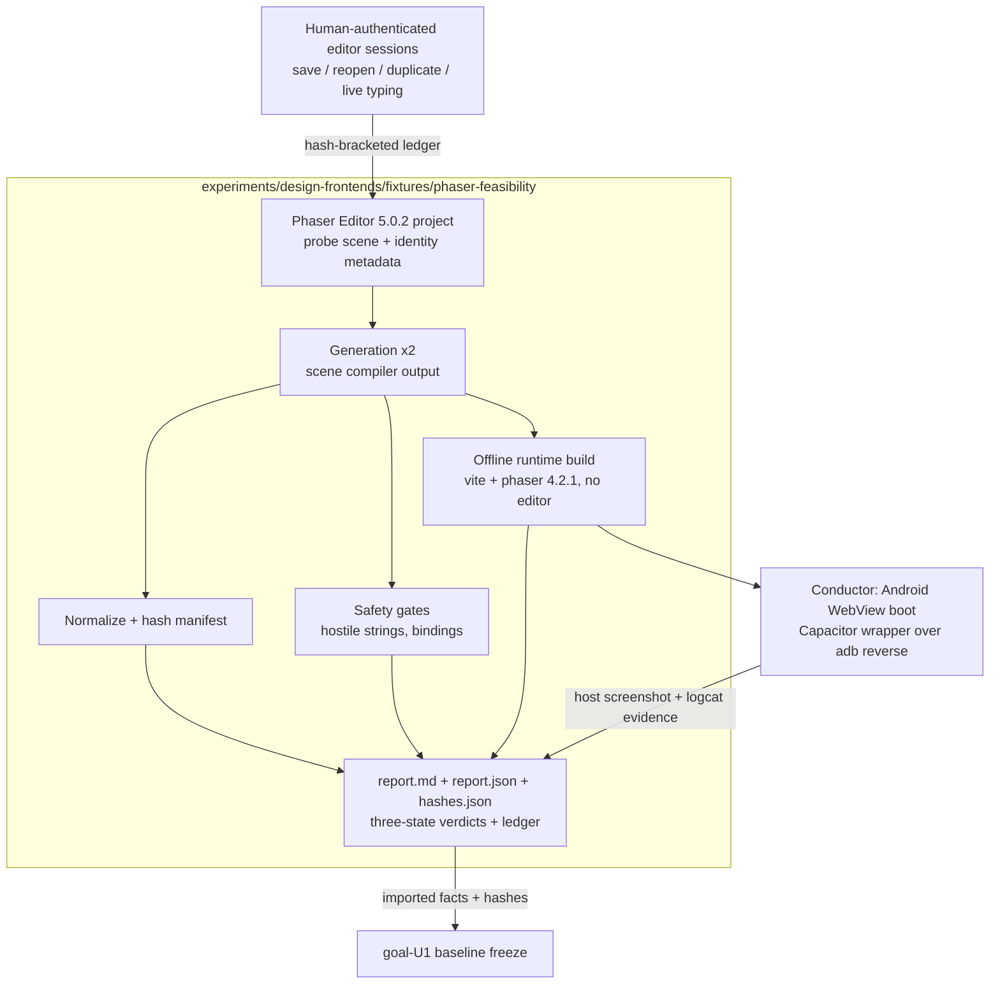

# Phaser Editor + Phaser 4 Feasibility Seam - Plan

## Goal Capsule

- **Objective:** Prove or falsify, in a disposable fixture, that pinned Phaser Editor 5.0.2 + Phaser 4.2.1 can preserve stable semantic identity, preview copy live, stay safe under hostile input, publish deterministically, rebuild offline without the editor or its account, and boot in a real Android WebView — and enumerate every dependency/workspace need the Phaser lane would impose on goal-U1 before shared dependencies freeze.
- **Authority:** `goal.md` @ `2ec08c51` (branch `experiment/dual-design-frontends`) section goal-U2 is the product contract; this plan operationalizes it for card `43Qvbih7`. Requirements carried: goal R7-R13, R17, R27-R28; flow F2; acceptance AE2, AE3, AE7.
- **Execution profile:** Evidence-first probe. Every acceptance criterion resolves to one of three typed outcomes — `pass`, `no-go` (intrinsic, reproducible failure, named), or `blocked` (missing environment/license/device/human, named). A workaround that changes the experiment is never an outcome.
- **Stop conditions:** Unavailable license, non-deterministic save, lost identity, unsafe generated string encoding, or unextractable state yields a named `no-go`/`blocked` result, not a loosened requirement. A feasibility failure pauses only the Phaser lane for Batu's decision; it does not authorize a DOM adapter or crown GrapesJS.
- **Tail ownership:** The card worker builds the fixture and all headless proofs in this worktree. Editor-GUI evidence requires the human-authenticated Phaser Editor installation (Batu). The conductor runs the physical Android leg on the Ubuntu ADB host. Landing goes through the twf conductor to `experiment/dual-design-frontends`; goal-U1 alone decides which results enter the frozen baseline.

Unit IDs below (U1-U7) are plan-local. Units of the parent plan are always cited as goal-U1 … goal-U10.

---

## Product Contract

### Summary

Build the smallest representative Phaser Editor 5.0.2 project — one scene with a semantic container, an action, editable copy, a catalog-bound raster, a duplicated instance, a state variant, and a safe-area anchor — inside a self-contained fixture at `experiments/design-frontends/fixtures/phaser-feasibility/`. Exercise the full authoring seam (save, reopen, duplicate, generate, validate, rebuild, device boot) and land only the fixture, a three-state feasibility report, and hashes. No shared repository surface changes.

### Problem Frame

The dual-frontend comparison forks two lanes after goal-U1 freezes shared dependencies, workspace state, and the experiment protocol. The Phaser lane's core bets — that editor-native state can hold stable semantic identity agents can trust, that generation is deterministic, and that the runtime survives vendor exit and a real Android WebView — are unproven in this repository. If any bet fails, it must fail now, cheaply and reproducibly, before goal-U1 freezes the baseline and goal-U5/U6 invest in a full lane.

### Requirements

**Authoring identity** (goal R7-R8)

- R1. Every semantic element in the probe scene carries a stable instance ID, role, and binding in editor-native state, and those survive save, close, and reopen unchanged.
- R2. Duplicating a semantic instance yields a distinct new stable ID in the correct semantic parent with its binding retained or explicitly changed, and the duplicate survives save, reopen, and generation.
- R3. Editing copy previews in the editor while typing, not only on Enter or blur — natively, or through the smallest recorded plugin path.
- R4. Identity uses editor-supported mechanisms first (scene schema fields, user components, prefab properties, asset-pack metadata); a plugin is introduced only when a base-editor rung demonstrably cannot preserve required identity or curated-catalog UX, with the failure recorded.

**Safety** (goal R10, AE3)

- R5. Copy and identifier strings containing quote, brace, template, newline, and comment sequences survive into generated output as inert data (exact value preserved) or block publication with a typed result — never silently mangled or executable.
- R6. An invalid catalog asset ID or a missing required binding blocks publication with a typed result and leaves prior outputs unchanged.

**Determinism and vendor exit** (goal R12-R13, R27, AE7)

- R7. Two generations from unchanged editor state are byte-identical, or normalize to an identical canonical publication under a documented deterministic normalization whose volatile fields are individually enumerated as feasibility facts.
- R8. Headless regeneration (scripted, no editor GUI, no account) is recorded three-state: supported with the working command, or unsupported as an explicit feasibility limitation. Never silently assumed either way.
- R9. The generated runtime builds and runs from the fixture with Phaser Editor absent, no editor account, and no network after dependency install.

**Device** (goal-U2 approach; R31 spirit)

- R10. A real Android WebView boots the built runtime and renders the Phaser 4 WebGL canvas, via a throwaway dev-only Capacitor wrapper served over `adb reverse`, with host-captured evidence. This vehicle is disposable feasibility evidence, not the goal-U10 implementation.

**Confinement and reporting** (goal R13, R28, R30; card contract)

- R11. Editor writes stay inside the fixture; confinement is audited and the path-hostility verdict recorded as the KTD11 (worktree vs duplicate-repo) input for later lane work.
- R12. Landed changes are confined to `experiments/design-frontends/fixtures/phaser-feasibility/**` plus this plan document (a pipeline artifact required by the card's stage checklist). No root manifest, lockfile, kernel, template, proof-game, or production-game changes; no DOM adapter.
- R13. No credentials, license material, account data, tokens, machine identifiers, or private paths enter git, the report, logs, or the ledger. License model and pinned version facts are recorded.
- R14. Every dependency and workspace need the Phaser lane would impose on goal-U1 is enumerated: packages with exact versions, tools, editor artifacts and their commit-worthiness, lockfile implications, plugin verdict, headless-regeneration capability, and normalization facts.
- R14a. (goal R17 carriage) The report records a command-surface verdict: for each of the shared lane commands goal R17 requires (validate, publish, preflight, apply, status, proof), whether the pinned Phaser toolchain can back it scriptably and whether its outcomes can map onto the shared typed vocabulary (`applied`, `no-op`, `blocked-drift`, `invalid-revision`, `unsupported-intent`) — three-state per command, as feasibility facts for goal-U5. The probe does not build the command surface itself.
- R15. The report carries the implementation ledger fields required by goal.md (starting/ending SHA, agent/model identity, attempts, rework, human interventions, added dependencies, changed surface, failed gates), and every verdict is three-state with an evidence pointer.

### Acceptance Examples

- AE1. Covers R1-R2. Given the probe scene is saved, closed, reopened, and its counter instance duplicated, when the saved project files are parsed before and after, then every pre-existing semantic ID is unchanged and the duplicate holds a new distinct ID in the same semantic parent with a valid binding.
- AE2. Covers R5-R6. Given copy containing `'`, `"`, backtick, `${`, `}`, a newline, and `*/`, and a second variant bound to a nonexistent catalog ID, when generation and publication checks run, then the hostile copy round-trips byte-exact as inert data (or blocks, typed) and the invalid binding blocks with a typed result leaving prior outputs untouched.
- AE3. Covers R7-R9. Given unchanged editor state, when generation runs twice and the runtime is rebuilt from a clean checkout with network disabled and no editor installed, then the two generations are byte-identical or normalized-identical with volatile fields enumerated, and the rebuild produces a bootable bundle.
- AE4. Covers R10, R15. Given the conductor's Ubuntu ADB host and the attached Android phone, when the throwaway wrapper boots the built runtime over `adb reverse`, then a host-captured screenshot shows the rendered probe scene sentinel; if the device lane is unreachable, the report records `blocked` with the missing environment named — never a pass.

### Scope Boundaries

Out of scope for this card:

- Any goal-U1 landing decision, shared-baseline change, proof-game scaffolding, or `_template`/`create-game`/kernel/testkit edit.
- A DOM adapter, a GrapesJS comparison verdict, or any lane-versus-lane judgment.
- The Phaser Editor MCP server and the agent-assisted arm (goal-U8 concern; noted in the report only if trivially observed).
- Production Capacitor/Android integration (goal-U10 owns the real warm lane), iPhone/Apple anything, and IAP/ads/analytics.
- Curated full asset catalog and fonts (goal-U1); the fixture uses a minimal local catalog with 2-3 CC0 rasters.

### Assumptions

- This plan document in `docs/plans/` is a permitted landing outside the card's Touches fence because the card's `planned`-stage checklist explicitly requires it; all implementation stays inside the fixture path.
- The fixture is a standalone npm package with its own `package-lock.json`. Verified: the root `package.json` workspaces globs (`packages/*`, `games/*`, five named tools) do not cover `experiments/**`, so installing and building the fixture cannot alter the root manifest or lockfile.
- Editor-GUI legs (save/reopen/duplicate observation, live-typing preview) run as human-authenticated recorded sessions with Batu's installed editor; the worker automates only what the editor exposes scriptably. If the editor or human is unavailable at execution time, those legs record `blocked`.
- The physical Android leg is conductor-run on the Ubuntu ADB host per goal.md tail ownership; this macOS worktree is not assumed to have the device.
- The feasibility report is Markdown plus machine-readable JSON (repo source material consumed by goal-U1, not an ad hoc human artifact page).

---

## Planning Contract

### Key Technical Decisions

- KTD1. **Standalone fixture package, not a workspace member.** The fixture owns its `package.json` and exact-pinned `package-lock.json` (`phaser@4.2.1` exact, toolchain mirroring root versions: TypeScript ~5.7, Vite ^6, Vitest ^4, ESLint 9). Verification runs via `npm --prefix experiments/design-frontends/fixtures/phaser-feasibility run verify`. This satisfies the no-root-landing contract structurally, not by discipline.
- KTD2. **Identity mechanism ladder, cheapest rung first.** (a) built-in scene object IDs/labels as saved in `.scene` JSON → (b) user components carrying `fabSemanticId`/`fabRole`/`fabBinding`/`fabSlot` → (c) prefab + prefab properties → (d) minimal plugin. Escalate one rung only on a recorded failure of the current rung; the report names the accepted rung and each failed one. A plugin is a last resort per goal-U2 patterns.
- KTD3. **`verify` = headless re-proof plus evidence validation.** The verify script re-runs everything provable on the current machine (typecheck, unit suites, generation determinism where headless generation exists, offline build) and validates recorded editor-GUI and device evidence by schema and hash instead of pretending to re-run it. It must be green on the landed branch on any machine, offline after install.
- KTD4. **Dual-artifact report.** `report/report.md` for humans, `report/report.json` schema-validated for machines, `report/hashes.json` binding evidence to committed bytes. goal-U1 imports facts from `report.json`; prose never becomes the machine contract.
- KTD5. **Editor-GUI evidence is a recorded session protocol.** Each GUI step (save, close/reopen, duplicate, live-typing observation) is bracketed by scripted project-tree hash snapshots and appended to a session ledger with the observation and timestamps. Fabricating a GUI observation is impossible to hide because the ledger binds observations to before/after hashes of committed project state.
- KTD6. **Throwaway Capacitor wrapper local to the fixture.** Disposable app ID (`com.basegamelab.phaser_feasibility.dev`), dev-only server config over `adb reverse`, generated `android/` tree gitignored and never committed — mirroring the repo's existing pattern (typed inline `capacitor.config.ts`, generated native trees on demand, as in `games/find_the_dog/capacitor.config.ts`). Explicitly not the goal-U10 vehicle.
- KTD7. **Hostile-string proof by round-trip assertion.** Tests import or parse the generated scene output and assert the exact runtime string value equals the authored value, plus a static scan for escaping failures (unterminated strings, template interpolation, comment breakouts). Compile-success alone is not proof.
- KTD8. **Normalization is canonicalization, never scrubbing.** Only enumerated volatile fields (e.g., timestamps, machine-local paths, nondeterministic ordering) may be normalized; each is recorded as a feasibility fact for goal-U1. Semantic content — IDs, geometry, copy, bindings — is never normalized away, and a semantic diff between two unchanged generations is a determinism failure, not a normalization candidate.

### High-Level Technical Design

The probe has one authority (the editor project), derived records only downstream, and a single report artifact that goal-U1 consumes. Nothing in the fixture feeds any shared surface directly.

### Implementation Constraints

- All landed work stays on this card's branch in this worktree; the conductor merges. No PRs.
- Browser or desktop rendering of the fixture is diagnostic only; device truth comes from the conductor-run Android leg (repo device-first rule).
- No steady-state script edits controller behavior, SDK code, root manifests, git state, Trello, or editor-native source (goal.md constraint carried into the fixture's scripts).
- The editor account/authentication is a human step, never repository automation (goal.md dependency).
- If Phaser Editor proves path-hostile in the worktree, the fallback is a KTD11 duplicate checkout used as a non-landing environment; every accepted artifact still lands through this card worktree.

---

## Implementation Units

Execution order: U1 → U2 → U3 → U4 → U5 → U6 (conductor) → U7. U4 and U5 can proceed in parallel after U3.

### U1. Fixture package scaffold and verify harness

- **Goal:** A self-contained probe package with pinned toolchain and a `verify` orchestrator that later units plug typed checks into.
- **Requirements:** R9, R12; enables all others.
- **Dependencies:** None.
- **Files:** `experiments/design-frontends/fixtures/phaser-feasibility/package.json`, `package-lock.json`, `.gitignore`, `README.md`, `tsconfig.json`, `vite.config.ts`, `vitest.config.ts`, `eslint.config.js`, `index.html`, `src/main.ts`, `scripts/verify.mjs`, `report/` (placeholder schema dir).
- **Approach:** Exact-pin `phaser@4.2.1`; mirror root toolchain versions. `verify.mjs` runs typecheck → lint → unit tests → determinism step → build step → report validation, each emitting a typed `pass`/`fail`/`blocked` line and failing the process on any `fail`. `.gitignore` covers `node_modules/`, `dist/`, generated `android/`, editor caches. README states the offline contract (green after `npm ci` with network then disabled) and the disposable nature of the fixture.
- **Test scenarios:** `verify` exits nonzero when any step fails (inject a failing placeholder test); `verify` runs green with network disabled after install; installing/building the fixture leaves `git status` clean outside the fixture path (proves root manifest/lockfile untouched).
- **Verification:** `npm --prefix experiments/design-frontends/fixtures/phaser-feasibility run verify` green at scaffold level; `git diff --name-only` against the branch base confined to the fixture path and this plan file.

### U2. Probe editor project, semantic identity mechanism, and confinement audit

- **Goal:** The smallest representative scene authored in Phaser Editor 5.0.2, an identity mechanism proven across save/reopen/duplicate, a live-copy-preview verdict, and an editor write-confinement verdict.
- **Requirements:** R1-R4, R11; goal R7-R8.
- **Dependencies:** U1; human-authenticated Phaser Editor installation (Batu).
- **Files:** `experiments/design-frontends/fixtures/phaser-feasibility/editor-project/` (as created by Phaser Editor 5.0.2: scene file, asset pack, editor config), `catalog/catalog.json`, `assets/` (2-3 small CC0 rasters), `scripts/confine-audit.mjs`, `scripts/session-snapshot.mjs`, `evidence/sessions/`, `tests/identity.test.ts`.
- **Approach:** Scene contains a semantic container, an action button, copy text, a catalog-bound raster, a duplicated counter instance, a state variant, and a safe-area-anchored element (goal-U2 approach list). Work the KTD2 ladder: attempt built-in scene IDs first, then user components carrying `fabSemanticId`/`fabRole`/`fabBinding`/`fabSlot`, then prefab properties, then (only on recorded failure) a minimal plugin. `session-snapshot.mjs` hashes the project tree before/after each GUI step and appends a ledger entry (step name, hashes, observation, timestamp). `confine-audit.mjs` manifests the worktree before/after an editor session and reports any write outside the fixture. `identity.test.ts` parses committed scene JSON and asserts ID presence, stability across the recorded save/reopen pair, and duplicate distinctness.
- **Execution note:** This is a new live integration seam — the first real editor session is part of the build, no matter how green the parsed-JSON tests are. If the editor or the human is unavailable, record the GUI legs as `blocked`; never fabricate an observation.
- **Test scenarios:** All pre-existing semantic IDs byte-identical across the save/close/reopen pair; duplicate receives a new distinct ID, correct parent, retained binding; live-typing preview observed (or the smallest plugin path recorded, or an explicit limitation recorded); a scene element missing identity metadata fails the identity test; a simulated out-of-fixture write makes `confine-audit` fail naming the path; ledger entries reject when before/after hashes don't match committed state.
- **Verification:** Identity tests green against committed project state; session ledger schema-valid with hash brackets; confinement verdict (clean, or path-hostility documented as the KTD11 input) recorded in the ledger.

### U3. Deterministic generation, normalization, hashes, and headless capability record

- **Goal:** Two unchanged generations proven byte-identical or normalized-identical, the volatile-field list enumerated, and the headless-regeneration capability recorded three-state.
- **Requirements:** R7-R8; goal R12.
- **Dependencies:** U2.
- **Files:** `scripts/generate.mjs`, `scripts/normalize.mjs`, `scripts/hash.mjs`, `tests/determinism.test.ts`, `report/hashes.json`.
- **Approach:** First determine whether scene compilation is scriptable without the GUI or account (Phaser Editor scene-compiler surface — a probe question, not an assumption). If supported: `generate.mjs` drives it and `verify` re-runs generation twice and compares live. If unsupported: record `headless_regen: unsupported` as a feasibility limitation and have `verify` validate two committed GUI-produced generations by hash instead. `normalize.mjs` applies only KTD8-enumerated canonicalizations, each logged as a feasibility fact. `hash.mjs` writes the manifest covering editor-native sources, generated outputs, catalog, and assets.
- **Test scenarios:** Unchanged state → byte-identical generations pass without normalization; generations differing only in enumerated volatile fields → normalized-identical pass with facts recorded; generations differing semantically → determinism `fail` (no-go candidate), never normalized away; normalization provably preserves IDs, geometry, copy, and bindings (fixture diff test); hash manifest matches committed bytes exactly.
- **Verification:** Determinism suite green inside `verify`; `report.json` carries the three-state `headless_regen` capability with the working command or the named limitation.

### U4. Hostile-string and binding-safety gates

- **Goal:** Prove unsafe copy/identifier/catalog/binding cases are inert or block with typed results.
- **Requirements:** R5-R6; goal R10, AE3.
- **Dependencies:** U3.
- **Files:** `tests/hostile-strings.test.ts`, `tests/binding.test.ts`, `scripts/publish-check.mjs`, hostile-copy variants inside `editor-project/`, `catalog/catalog.json` negative fixtures.
- **Approach:** Author copy and identifier fixtures containing `'`, `"`, backtick, `${}`, `{}`, newline, `*/`, `//`, and `</script>`-shaped sequences in editor state. `publish-check.mjs` is the probe's typed publication gate: it validates catalog IDs and required bindings against `catalog.json` and returns named block codes. Tests assert round-trip string equality between authored state and generated output (KTD7) plus a static escaping scan; binding tests assert invalid catalog ID and missing binding block, valid binding passes, and a block leaves prior generated output unchanged.
- **Test scenarios:** Each hostile class survives byte-exact as data or blocks typed — a silently altered string is a `fail`; generated output containing an unescaped breakout (string termination, template interpolation, live comment) is a `fail`; invalid catalog ID → typed block; missing required binding → typed block; valid case passes; blocked publication leaves the previous generation's bytes untouched.
- **Verification:** Both suites green inside `verify`; block codes appear in `report.json`'s typed-outcome vocabulary.

### U5. Offline runtime build and boot smoke

- **Goal:** The generated runtime builds and boots with the editor absent, no account, and no network after install.
- **Requirements:** R9; goal R13, R27, AE7.
- **Dependencies:** U3.
- **Files:** `src/main.ts` (boots the generated scene), `index.html`, `vite.config.ts`, `tests/build-output.test.ts`, `evidence/offline-build/` (clean-run transcript).
- **Approach:** `vite build` consumes generated scene code plus `phaser@4.2.1` only; the build must import nothing from editor packages. The R27-shaped proof runs once as a recorded clean run: fresh checkout of the branch, `npm ci` in the fixture, network disabled, editor not installed, `verify` green, transcript + environment facts stored under `evidence/offline-build/`. `verify` itself asserts the cheaper invariants on every run (build succeeds, bundle exists, contains the probe-scene sentinel, has no editor-package imports). Any browser boot check stays diagnostic-only per repo rules — device truth is U6.
- **Test scenarios:** Build succeeds offline after install; bundle contains the probe scene sentinel strings; static scan finds no editor-package imports in `src/` or the bundle; clean-run transcript present and schema-valid with network-disabled evidence.
- **Verification:** `verify` build step green; `evidence/offline-build/` transcript recorded and hash-bound in `hashes.json`.

### U6. Throwaway Android WebView boot over adb reverse (conductor-run)

- **Goal:** A real Android WebView boots the built runtime and renders the Phaser 4 WebGL canvas, with host-captured evidence — or a named `blocked` record.
- **Requirements:** R10; R13 (scrubbed evidence).
- **Dependencies:** U5; reachable Ubuntu ADB host + Android phone (conductor).
- **Files:** `capacitor.config.ts` (fixture root, typed inline per `games/find_the_dog/capacitor.config.ts` pattern), fixture `package.json` local Capacitor deps, `scripts/device-boot.md` (conductor runbook), `evidence/device/`.
- **Approach:** Dev-only wrapper with disposable app ID `com.basegamelab.phaser_feasibility.dev`; the conductor syncs the fixture to the Ubuntu host, serves the built bundle (or Vite dev server) on a fixed port, connects via `adb reverse`, generates the `android/` project on demand (never committed), installs, boots, and captures `adb exec-out screencap -p` plus logcat WebGL/console lines. Evidence is scrubbed: device profile without serials, no notifications, no private paths. The worker's deliverable is the wrapper config, runbook, and evidence schema; the run itself is the conductor's.
- **Execution note:** Live seam, conductor-run. Device, SSH, or host loss is `blocked` — never converted to pass or product defect.
- **Test scenarios:** Host screenshot shows the rendered probe scene sentinel (real canvas, not a blank/black WebView); logcat shows no WebGL context-creation failure; generated `android/` tree absent from git; wrapper config contains no production trust material and is documented throwaway; unreachable device lane → `blocked` verdict with the missing environment named.
- **Verification:** `evidence/device/` artifacts present, schema-valid, hash-bound in `hashes.json`, with live-device provenance recorded in the ledger; or a `blocked` record satisfying R15.

### U7. Feasibility report, dependency enumeration, and goal-U1 handoff facts

- **Goal:** The single artifact goal-U1 imports: three-state verdicts for every card acceptance criterion, the full dependency/workspace enumeration, license/version facts, and the implementation ledger.
- **Requirements:** R12-R15, R14a; goal R17 (command-surface verdict), goal R28 spirit, goal-U2 verification.
- **Dependencies:** U2-U6 (accepts `blocked` inputs; propagates them honestly).
- **Files:** `report/report.md`, `report/report.json`, `report/report.schema.json`, `report/hashes.json` (final), `tests/report.test.ts`.
- **Approach:** `report.json` maps each card acceptance criterion (distinct-ID round trip, live copy preview, unsafe-case inertness, deterministic generation, offline build, Android boot, dependency enumeration) to `pass`/`no-go`/`blocked` with an evidence pointer into `evidence/` or `tests/`. The dependency enumeration lists exact packages and versions the Phaser lane needs, editor artifacts and whether each is committed authority or derived, lockfile implications for the goal-U1 workspace freeze, the identity-mechanism rung accepted (and plugin verdict), `headless_regen` capability, normalization facts, the R14a per-command command-surface verdicts, and the KTD11 confinement verdict. Ledger fields per goal.md implementation constraints. A privacy scan (no tokens, usernames, absolute paths, device serials) runs inside `verify`.
- **Test scenarios:** `report.json` validates against `report.schema.json`; every acceptance criterion has a verdict and a resolvable evidence pointer; `hashes.json` matches committed bytes; privacy scan is clean; a `blocked` verdict names the missing environment; a `no-go` verdict names the intrinsic failed property and its reproducer.
- **Verification:** Full `npm --prefix experiments/design-frontends/fixtures/phaser-feasibility run verify` green end-to-end on the landed branch; report is self-contained for goal-U1 import.

---

## Verification Contract

| Gate | Applies to | Command / evidence | Passing signal |
|---|---|---|---|
| Fixture verify | U1-U5, U7 | `npm --prefix experiments/design-frontends/fixtures/phaser-feasibility run verify` | All typed steps pass; offline after install; green on the landed branch |
| Scope audit | all | `git diff --name-only` vs branch base | Only `experiments/design-frontends/fixtures/phaser-feasibility/**` and `docs/plans/2026-07-12-001-feat-phaser-editor-feasibility-plan.md` |
| Root gates untouched | all | root `npm run project-gate` (and `npm run audit`) unchanged-green | Fixture is invisible to root workspaces; no shared-surface landing |
| Editor-GUI evidence | U2 | `evidence/sessions/` ledger, hash-bracketed | Save/reopen/duplicate + live-preview observations bound to committed project hashes, or `blocked` |
| Clean offline rebuild | U5 | `evidence/offline-build/` transcript | Fresh checkout + `npm ci` + network disabled + no editor → verify green |
| Android boot | U6 | conductor-run; `evidence/device/` screenshot + logcat | Rendered probe sentinel on the physical phone with live provenance, or `blocked` |
| Report integrity | U7 | `report.json` schema validation + privacy scan inside verify | Every criterion three-state with evidence pointer; no secrets/private paths |

Browser and desktop renders of the fixture are diagnostic aids only and close nothing.

---

## Definition of Done

- Every card acceptance criterion has a `pass`, `no-go`, or `blocked` verdict in `report.json` with a resolvable evidence pointer — no criterion silently omitted, no proxy presented as device or GUI proof.
- The landed diff is confined per R12; root `project-gate`/`audit` behavior is unchanged; no credentials, license material, machine identifiers, or private paths anywhere in the landing.
- The dependency/workspace enumeration for goal-U1 is complete (R14), including the identity-mechanism rung, plugin verdict, `headless_regen` capability, normalization facts, the R14a command-surface verdicts, and KTD11 confinement verdict.
- The fixture `verify` command is green on the landed branch; the implementation ledger (R15) is complete.
- Dead ends are removed: abandoned identity-rung experiments, spike scripts, and any uncommitted generated trees (`android/`, `dist/`, editor caches) do not land. A reproducer proving a `no-go` is retained as evidence.
- An overall `pass` requires R1-R11 all `pass`. Any intrinsic reproducible failure lands as `no-go` naming the failed property; any missing environment (editor license/human session/device) lands as `blocked` naming it. All three shapes are legitimate card completions — the honest verdict is the deliverable.

---

## Sources and Research

- `goal.md` @ `2ec08c51` — product authority: goal-U2 unit spec, R7-R13/R17/R27-R28, AE2/AE3/AE7, KTD2/KTD7/KTD8/KTD11, implementation constraints, and the verification-contract row this plan expands. Official Phaser sources (Phaser 4.2.1 release, Phaser Editor v5 release, Scene Compiler and Asset Pack docs, plugin template, pricing) were checked 2026-07-12 in goal.md's Sources section and are carried from there; no fresher external research was needed.
- Root `package.json` — workspaces globs verified to exclude `experiments/**` (basis of KTD1 and the R12 structural containment).
- `games/find_the_dog/capacitor.config.ts` and `games/find_the_dog/package.json` — repo Capacitor pattern mirrored by KTD6 (typed inline config, generated native trees never committed, local Capacitor deps).
- `tools/verify-device/README.md` — existing Android capture conventions (`adb exec-out screencap -p`, logcat markers) informing the U6 evidence shape without reusing the production driver.
- `docs/plans/2026-07-10-002-feat-grapesjs-shell-specialization-plan.md` — sibling-lane plan whose security/determinism posture goal.md carries forward; format precedent for this artifact.
