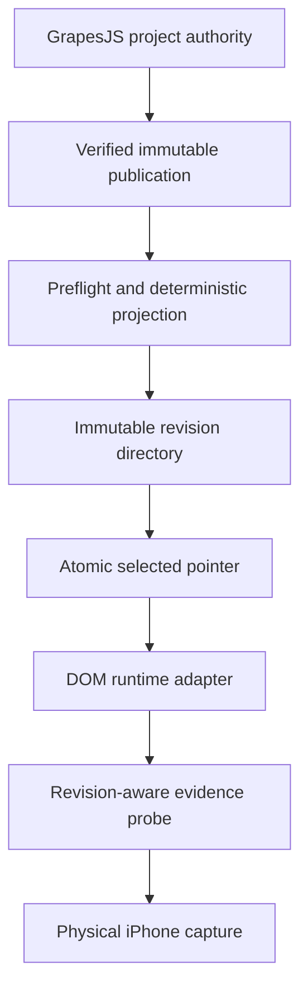

# Grapes Immutable Application Loop - Plan

## Goal Capsule

- **Objective:** Turn one explicit accepted GrapesJS publication into the selected DOM/CSS runtime projection, then prove an editor-authored visible change survives publish, apply, runtime rendering, and physical-device observation.
- **Authority:** The saved GrapesJS project remains the only editable presentation authority. Publications, projections, runtime modules, pointers, and evidence are derived records.
- **Execution profile:** Build the shortest fail-closed vertical slice on the completed U3 publisher. Defer unrelated audit adapters, shared-package changes, editor polish, and production adoption.
- **Stop condition:** The slice is complete only when a changed publication is selected atomically, reported by the runtime probe, and visibly observed on the connected device without hand-editing generated presentation.
- **Tail ownership:** U4 owns Grapes application and lane runtime selection. U7 owns shared audit integration; the existing device verifier owns native build/install/capture.

---

## Product Contract

### Summary

Add the missing boundary between GrapesJS immutable publication and the proof game's DOM/CSS runtime. Applying a publication must generate a content-addressed projection, switch one atomic pointer, preserve the previous selection on failure, and make repeated application a true no-op.

### Problem Frame

U3 can validate and publish editor state, but the proof runtime still reads seed design modules and reports no selected revision. Rebuilding the native app today therefore cannot prove that an editor change reached the phone.

### Requirements

**Application integrity**

- R1. Preflight and apply require an explicit publication ID and verify that immutable publication through the U3 verification boundary.
- R2. Apply generates a complete `dom-css` projection under `games/shell_proof_grapes/design/revisions/<projectionId>/` before atomically selecting it through `games/shell_proof_grapes/design/revision.json`.
- R3. Applying the same valid selected projection performs no filesystem writes and returns `no-op`.
- R4. Invalid publication, unsupported intent, selected-output drift, or interrupted generation leaves the previous selected pointer unchanged and returns the shared typed outcome.

**Runtime fidelity**

- R5. The proof runtime loads only modules named by the selected projection and fails closed when the pointer, module set, hashes, or profile do not match.
- R6. The selected projection changes copy, color, geometry, visibility, order, and approved asset references without replacing controller-owned nodes or event listeners.
- R7. The evidence probe reports the selected projection ID only after the projection has been rendered.

**Device proof**

- R8. A visible editor-authored change is published, applied, built, installed, launched, and independently captured on the connected physical device.
- R9. Generated presentation is never hand-edited, and device evidence records the publication and projection identities that produced the visible sentinel.

### Acceptance Examples

- AE1. Given valid publications A and B, applying A then B selects two complete projections; applying B again returns `no-op` with unchanged bytes and modification times.
- AE2. Given A is selected, when B generation or pointer promotion fails, A remains selected and renders normally.
- AE3. Given a generated artifact or pointer is tampered with, preflight detects regeneration drift and does not select another projection.
- AE4. Given an editor-authored visible title or palette change, when its publication is applied and installed, the physical-device capture shows that sentinel and the runtime probe reports the matching projection ID.

### Scope Boundaries

In scope: Grapes preflight/apply/status commands, immutable lane projections, atomic selection, lane runtime loading, focused tests, and physical-device proof using existing tooling.

Deferred: shared `tools/audit/**` integration, production-game migration, warm live reload, strict visual-reference authoring, editor UX polish, and changes to shared kernel or device-verifier contracts.

---

## Planning Contract

### Key Technical Decisions

- KTD1. Apply consumes an explicit publication ID and calls the existing U3 verifier; `latest-published.json` is never application authority.
- KTD2. Candidate artifacts are generated and verified before promotion. The selected pointer changes through one atomic temporary-file rename only after the immutable revision directory is complete.
- KTD3. Projection identity uses kernel v2 profile rules and hashes actual emitted bytes. Deterministic artifacts contain no timestamps or device facts.
- KTD4. Selected-output drift is checked by regenerating from the publication pinned by the pointer, not by trusting pointer hashes alone.
- KTD5. Runtime selection uses literal eager Vite module globs and the root pointer. The adapter patches existing semantic nodes after shell render so controller and SDK behavior remain frozen.
- KTD6. The device gate uses the existing iOS verifier and installed app identity; U4 records evidence but does not modify shared native tooling.

### High-Level Technical Design

Invalid input or drift terminates before pointer promotion. A repeated valid projection terminates as `no-op` before any write.

### Dependencies and Constraints

- The U4 branch must first incorporate `trello-qrVosoLc-grapes-shell-3-8-constrained-editor-and`, which contains the completed U3 publisher and proof game.
- The active lane fence permits `tools/grapes-shell/**`, lane-owned Grapes runtime paths, `games/shell_proof_grapes/design/revision.json`, `games/shell_proof_grapes/design/revisions/**`, runtime tests, refs, and evidence.
- `tools/audit/**`, shared packages, root manifests, and proof-game `tests/unit/**` remain outside this card.

---

## Implementation Units

### U1. Add deterministic preflight and immutable apply

- **Goal:** Convert one verified publication into a complete content-addressed projection and select it atomically.
- **Requirements:** R1-R4; AE1-AE3.
- **Dependencies:** Completed U3 branch.
- **Files:** `tools/grapes-shell/src/application/`; `tools/grapes-shell/test/unit/application.test.ts`; `games/shell_proof_grapes/design/revision.json`; `games/shell_proof_grapes/design/revisions/`.
- **Approach:** Reuse publication verification and kernel v2 parsing/hashing. Generate fixed TypeScript, CSS, asset identity, and copied raster artifacts from validated publication records only. Verify candidate bytes before immutable directory promotion and pointer rename.
- **Execution note:** Start with failure-preservation and repeated-apply tests because atomic selection and no-op behavior are the trust boundary.
- **Patterns to follow:** U3 staging-and-rename publication flow; kernel v2 projection identity and profile validation; canonical serialization utilities.
- **Test scenarios:** Apply valid A and B; reapply B with no writes; fail before revision promotion; fail before pointer rename; reject missing, tampered, mixed-profile, or hostile publication; detect artifact and self-consistent pointer drift by regeneration; reject unsupported intent; preserve deterministic ordering and path confinement.
- **Verification:** Focused application tests prove A/B/B, failure preservation, deterministic projection identity, and regeneration-based drift detection.

### U2. Expose the application contract through the Grapes CLI

- **Goal:** Make preflight, apply, and status usable through one typed command surface.
- **Requirements:** R1, R3-R4.
- **Dependencies:** U1.
- **Files:** `tools/grapes-shell/src/shared/cli.ts`; `tools/grapes-shell/test/unit/cli.test.ts`; `tools/grapes-shell/README.md`.
- **Approach:** Add explicit `--publication-id` handling, read-only preflight, typed apply outcomes, and status facts for selected projection and drift. `canApply` is true only for valid saved and published state.
- **Test scenarios:** Missing ID fails without writes; valid preflight reports candidate facts without selection; apply reports `applied` then `no-op`; status distinguishes absent, valid, and drifted selection; unsupported or invalid input returns the shared typed outcome.
- **Verification:** CLI tests cover command parsing, typed output, write boundaries, and status truthfulness.

### U3. Load the selected projection in the proof runtime

- **Goal:** Make the DOM shell visibly render the selected immutable projection without changing controller behavior.
- **Requirements:** R5-R7; AE4.
- **Dependencies:** U1.
- **Files:** `games/shell_proof_grapes/src/shell/renderers/GrapesProjection.ts`; `games/shell_proof_grapes/src/main.ts`; `games/shell_proof_grapes/src/shell/TemplateShell.ts`; `games/shell_proof_grapes/tests/runtime/`.
- **Approach:** Resolve the pointer through literal eager module globs, verify the selected module set, inject selected CSS, and patch existing semantic nodes after every render. Expose a small projection-derived visual sentinel and report the projection ID after paint.
- **Execution note:** Prove runtime selection with an integration test that exercises real shell navigation and listeners rather than a serializer-only test.
- **Patterns to follow:** Existing semantic instance attributes, `TemplateShell` render lifecycle, and `ShellEvidenceProbe` readiness contract.
- **Test scenarios:** Select A and B by pointer; apply visible copy, color, geometry, visibility, order, and asset changes; retain click handlers across seven states; report projection ID after paint; fail closed for missing or mismatched pointer modules; build without GrapesJS or network access.
- **Verification:** Runtime tests and the production build prove selected projection fidelity, preserved navigation, and vendor-independent runtime output.

### U4. Prove one editor change on the physical device

- **Goal:** Demonstrate the exact editor publication on the connected iPhone and capture reproducible evidence.
- **Requirements:** R8-R9; AE4.
- **Dependencies:** U1-U3.
- **Files:** `games/shell_proof_grapes/authoring/grapesjs/project.json`; `games/shell_proof_grapes/evidence/`; `games/shell_proof_grapes/refs/` only if an existing trusted reference applies.
- **Approach:** Make one obvious supported edit in GrapesJS, export the validated project, publish and apply its explicit ID, then use the existing device verifier to build, sign, install, launch, drive, and capture the seven-state shell. Record the publication/projection pair and visible sentinel.
- **Execution note:** This is an integration gate; use the real connected device and independent screenshot evidence rather than browser screenshots or runtime self-report alone.
- **Test scenarios:** The installed shell launches; the visible sentinel matches the changed publication; the probe reports the selected projection ID; the seven required states remain drivable; a browser-only or stale hardcoded design cannot satisfy the gate.
- **Verification:** Scrubbed physical-device captures and verifier artifacts identify the exact publication and projection and show the editor-authored sentinel.

---

## Verification Contract

- `npm test -w @fabrikav2/grapes-shell` proves application, CLI, publisher compatibility, determinism, and hostile-input handling.
- `npm run check -w @fabrikav2/grapes-shell` proves package typecheck, lint, unit, and render integrity.
- `npm run check -w @fabrikav2/shell_proof_grapes` proves runtime tests and production build.
- Applying P0, A, B, and B again proves complete selection, replacement, and filesystem no-op behavior.
- A clean runtime build with editor processes and network absent proves the accepted projection is vendor-independent.
- The existing iOS device verifier supplies the final build, install, launch, seven-state drive, and scrubbed capture evidence.

---

## Definition of Done

- U1-U3 checks pass and no selected revision can be produced or changed from unverified input.
- An explicit GrapesJS publication deterministically produces one immutable projection and one atomic selected pointer.
- Reapplying the selected projection is a true filesystem no-op; simulated failures and drift preserve the prior selection.
- The proof runtime renders the selected projection, preserves controller/SDK journeys, and reports its projection ID after paint.
- One visible editor-authored change is independently observed on the connected iPhone with the matching publication and projection identities.
- All changes remain inside the U4 fence, abandoned attempts are removed, and the card is committed and handed off through TWF.
