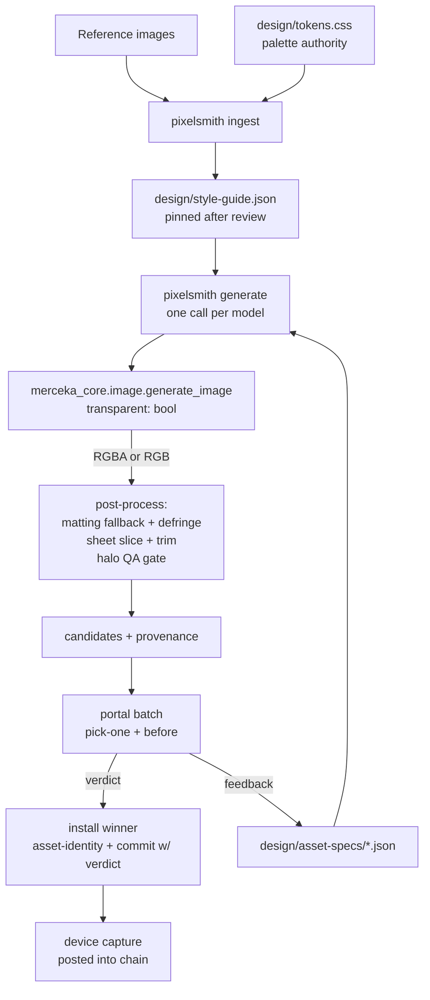

# Pixelsmith HITL Asset Pipeline - Plan

## Goal Capsule

- **Objective:** Extend pixelsmith into the asset-generation tool for fabrikav2 games — reference ingestion, spec-driven multi-model generation via merceka-core, sheet slicing, first-class transparency — with portal as the human review loop, proven end-to-end by generating shell_template's generic premium asset set.
- **Product authority:** Batu; design decisions resolved 2026-07-16 via grilling dialogue. Product Contract below is the WHAT authority; Planning Contract the HOW.
- **Target repos:** three. pixelsmith (`~/dev/appletolye/pixelsmith`) carries most code; merceka-core (`~/dev/appletolye/merceka-core`) gets a small transparency extension; fabrikav2 carries specs, tests, and the consuming game. Paths in units are relative to the repo named per unit.
- **Stop conditions:** U8–U10 are live HITL phases requiring Batu's portal picks and the physical device — they run interactively, never autonomously. Any spend beyond the per-batch `--max-cost` cap stops for confirmation.
- **Product Contract preservation:** changed: R4 — added the optional `glow` flag to the spec field list (review finding; field was already consumed by KTD1(c)/U6). All other R/A/F/AE IDs intact.

---

## Product Contract

### Summary

Roll the asset-generation pipeline into pixelsmith: a new `ingest` command pins a per-game style guide from reference images, `generate` consumes it plus checked-in per-slot specs — fanning one spec across multiple image models via merceka-core, with sheet generation and slicing for matching sets — and portal carries the batched human review loop. shell_template's generic premium set is the production proof.

### Problem Frame

Phase two of the shell_template needs ~19 art slots regenerated per game (see `games/shell_template/design/GENERATION-LIST.md`). Today there is no pipeline: assets were hand-sourced, drifted across generations (the swapped shop-art bytes persisted through two repos), and style consistency lived only in Batu's memory. ai_asset (`~/dev/appletolye/ai_asset`) solved prompt-craft — pinned style artifacts, sheet consistency, check loops — but as a paste-into-chat toolkit that doesn't fit the tools-not-loops architecture. pixelsmith already owns device capture, judging, and a `generate` command with its own OpenRouter client; merceka-core already owns a full image-model layer (`generate_image`, `edit_image`, `upscale_image`, multi-vendor). The pieces exist; they are not composed, and review has no structured human loop.

### Key Decisions

- **Roll into pixelsmith; learn from ai_asset, don't adopt it.** ai_asset's durable ideas (pinned style guide, identical style sentences across prompts, sheets for matching sets, check loop) are reimplemented minimally inside pixelsmith. Fewer lines over feature parity.
- **Style guide is a persisted, hand-correctable file** at `games/<game>/design/style-guide.json`, produced by `pixelsmith ingest` from reference images — not re-derived per generate call. Pinning is what holds color and style fidelity.
- **tokens.css keeps palette authority.** The design-sheets round-trip owns `design/tokens.css`; `ingest` reads palette roles from it rather than forking color authority. The style guide adds only what CSS cannot express (per-surface color map for prompts, rendering/shape/finish/lighting phrases). A test asserts style-guide/tokens hex alignment so drift fails loudly.
- **Prompts are assembled deterministically by pixelsmith** from style guide + spec brief (with an optional `prompt_extra` escape hatch), never hand-written per slot. Reproducible from files alone.
- **Model is data, not code.** pixelsmith's own OpenRouter HTTP client is deleted; generation calls `merceka_core.image.generate_image`. Specs carry a model list; default fan-out is `google/gemini-3.1-flash-image` + `openai/gpt-5.4-image-2` (both confirmed live on OpenRouter), `google/gemini-3-pro-image` in reserve for identity-critical slots.
- **Matching sets generate as one sheet** (N columns x M rows, "consistent items") and are sliced with per-cell transparent-margin trim — the strongest anti-drift device, chosen over per-item generation with retry.
- **In-context judgment is the device, not a synthetic composite.** Candidates are reviewed on a neutral grid; the picked winner is installed and a real device capture closes the review chain. No PIL mock-composite code.
- **Portal is the review surface.** Batched decision requests, agent keeps generating ahead while requests sit open. Chosen over chat-based review because batched+async needs held state, doorbell, and a feedback chain — portal already provides all three.
- **Repo-side verdict provenance by convention:** every accepted-asset commit message quotes the portal request id and the human verdict, keeping the repo self-sufficient if portal's DB is lost.

### Actors

- A1. **Batu (reviewer):** approves the style guide, picks winners per batch on the portal phone UI, gives revision feedback in his own words.
- A2. **Agent (pipeline driver):** owns the loop — writes specs, invokes pixelsmith, posts portal batches, installs winners, runs device verification, iterates on feedback.
- A3. **pixelsmith (tool):** `ingest`, `generate` (multi-model, sheets), `capture`, `judge`, `compose`. Each invocation returns; no internal loops.
- A4. **portal (service):** holds decision requests, chains supersedes+feedback, rings the Telegram doorbell, records verdicts.

### Requirements

**Ingestion**

- R1. `pixelsmith ingest <refs...> --game-root <path>` writes `design/style-guide.json`: rendering/shape/finish/lighting phrase tokens and a per-surface color map derived from the reference images, with palette roles read from the game's `design/tokens.css`.
- R2. The style guide is hand-editable and treated as pinned after human review; `generate` never silently re-derives values that a human corrected.
- R3. A unit test in the consuming game asserts style-guide palette hex matches `tokens.css`; mismatch fails the suite.

**Generation**

- R4. Asset specs are checked-in JSON files at `games/<game>/design/asset-specs/*.json`, one per slot, carrying: slot name, kind, ship size, gen size, brief (`description`), optional `prompt_extra`, transparency flag, optional `glow` flag (widens halo-QA tolerance for intentionally soft-edged slots), model list, and optional `sheet: {cols, rows, names[]}`.
- R5. `pixelsmith generate` assembles the prompt deterministically from style-guide + spec, calls `merceka_core.image.generate_image` with the spec's model string, and keeps the existing guards: size/transparency validation, `--max-cost` budget, provenance sidecar, `design/asset-identity.json` append.
- R6. Sheet specs produce one generated image sliced into the named per-cell PNGs, each auto-trimmed of transparent margins; slices flow through the same post-process and identity bookkeeping as singles.
- R7. Multi-model fan-out is one `generate` call per model with the same spec; outputs are distinguishable by model in filename and provenance.

**Review loop**

- R8. Candidates are posted to portal as batched decision requests (per set: economy, nav, saga, titles, marks), `pick-one` per slot with the current asset as the before-image, and per-variant captions carrying model and cost via the manifest.
- R9. The agent continues generating subsequent batches while earlier requests are open; verdicts are consumed as they arrive.
- R10. Rejected or feedback-bearing verdicts produce a v2 request posted with supersedes + feedback quoting the human's words, keeping each slot one reviewable chain.
- R11. After a winner is installed, an on-device capture of the affected screen is posted into the same chain as the in-context confirmation; the install commit message quotes the portal request id and verdict.

**Generic premium set (production proof)**

- R12. A "premium casual" style anchor for the shell template's own non-branded set — glossy but restrained, neutral motifs (stars, gems, ribbons, medals), no species, no IP — is drafted by the agent and approved by Batu as a portal `approve` request before any batch generation.
- R13. The full generic set covering every slot in `games/shell_template/design/GENERATION-LIST.md` (sections A slots 1-13, four saga node states, sheets for coin tiers, hint tiers, nav icons, saga nodes) is generated through the pipeline, reviewed via portal, installed, and device-verified.
- R14. The shakedown batch is the economy set (coin icon, coin-tier sheet x6, hint icon, hint-tier sheet x3) plus one lettering canary spec ("Level Complete" title); it must exercise every new seam live — merceka-core generation through both model families, transparency, sheet slicing, portal chain, device capture — before any other batch runs.

### Key Flows

- F1. **Ingest and pin the style**
  - **Trigger:** New game, or shell_template's generic-set kickoff.
  - **Steps:** Agent gathers reference images → `pixelsmith ingest` writes `style-guide.json` (palette from tokens.css) → agent posts style guide + refs to portal as `approve` → Batu corrects/approves → corrections hand-edited into the file → alignment test green.
  - **Covers R1, R2, R3, R12.**
- F2. **Batch generate and review**
  - **Trigger:** A batch of specs is ready and the style guide is pinned.
  - **Steps:** Agent runs `generate` per spec per model → post-process/slice → portal batch posted (doorbell) → agent proceeds to next batch → Batu picks → agent installs winner, records identity, commits with verdict quote → device capture posted into the chain.
  - **Covers R4-R9, R11.**
- F3. **Revision chain**
  - **Trigger:** Batu rejects or gives feedback on a variant.
  - **Steps:** Agent adjusts spec/`prompt_extra` per the feedback → regenerates → posts v2 with supersedes + quoted feedback → loop until picked.
  - **Covers R10.**

### Acceptance Examples

- AE1. **Covers R6.** Given the coin-tier sheet spec (2x3, six named tiers), when `generate` runs, then six PNGs land with the spec's ship size, transparent-trimmed, all six visibly the same coin identity, and six entries appear in `asset-identity.json`.
- AE2. **Covers R3.** Given a hand-edit changes `--fab-color-accent` in tokens.css without re-running ingest, when the game's unit suite runs, then the style-guide alignment test fails naming the mismatched role.
- AE3. **Covers R9, R10.** Given the economy batch is open on portal and the nav batch is generating, when Batu rejects the coin with "too brassy, want warmer gold", then a v2 coin request appears superseding v1 with that exact quote, and the nav batch generation was never blocked.
- AE4. **Covers R14.** Given the shakedown batch, when either model family fails transparency or reference conditioning through OpenRouter, then that failure is recorded and a native merceka-core path decision is made before batch two — not discovered mid-production.

### Success Criteria

- The full generic premium set ships on-device in shell_template with zero hand-run generation steps outside pixelsmith/portal invocations.
- A future new game reaches "all branded assets installed" via: ingest → correct style guide → write specs → run batches — no new code.
- Every installed asset is traceable: spec file + style guide + provenance sidecar + identity record + portal chain id in the commit.

### Scope Boundaries

- **Deferred for later:** the semantic color-scheme CSS token layer and its portal `view` color-picker page (sequenced after the pipeline lands); twf cards for post-shakedown per-batch runs; the fail-screen restyle rides with the "Out of Lives" slot but its UI work is a separate change; app icon / splash generation (existing capacitor flow).
- **Not in scope:** adopting ai_asset itself or its primer/schema files; changes to pixelsmith `capture`/`judge` internals; changes to portal; synthetic in-context composites; upscaling workflows.

### Dependencies / Assumptions

- merceka-core's `image.generate_image` supports the needed models — verified for model availability (`google/gemini-3.1-flash-image`, `openai/gpt-5.4-image-2` listed live 2026-07-16). Transparency requires the U1 extension (verified 2026-07-16: both merceka paths currently force-convert to RGB, destroying alpha).
- **AE4 resolved by the live shakedown (2026-07-16):** no `OPENAI_API_KEY` exists in the environment, so `openai/*` models route through OpenRouter (key-gated fallback added to merceka + pixelsmith) and NO model returns native alpha. The matting fallback (flat `#333333` backdrop → ONNX matting → defringe → halo QA) carried all 24 shakedown assets and passed QA on every one — it is the production transparency path; the native-alpha path activates automatically if an OpenAI key is ever added.
- Portal service on the Mac mini is running and reachable; Telegram doorbell configured.
- `OPENROUTER_API_KEY` and `OPENAI_API_KEY` available in the pixelsmith environment.
- shell_template's `tokens.css` currently holds 7 `--fab-*` colors; ingest reads whatever roles exist without requiring the deferred scheme-layer expansion.

### Sources / Research

- `games/shell_template/design/GENERATION-LIST.md` — the definitive slot list, sizes, briefs, generation order.
- `~/dev/appletolye/ai_asset` (README + `studio_primer.md` v2.1.2) — the learned patterns: pinned style guide with color lock, identical style sentences, sheet trick, CHECK/TWEAK loop.
- pixelsmith `src/pixelsmith/generate.py` — existing spec parsing (`AssetSpec`), `assemble_prompt`, `write_generated_png` (already validates size + alpha), cost guard, `append_asset_identity`, `AssetGenerator` ABC with the OpenRouter client to be replaced; `crop.py` (`CropRegion`, `clamped_box`) for slicing; `tests/test_generate.py` uses a fake generator injected via the `generator` parameter.
- merceka-core `merceka_core/image.py` — `generate_image(prompt, model, aspect_ratio, image_size)` dispatching `openai/*` to the direct OpenAI images API and everything else to OpenRouter chat-completions; both paths `.convert("RGB")` today; `_openai_size` maps size tiers.
- `~/dev/appletolye/portal/README.md` — streams, pick-one/before-after/approve kinds, supersedes chains, manifest captions, doorbell, `--kind view` (deferred scope).

---

## Planning Contract

### Key Technical Decisions

- **KTD1 — Transparency is three-layered.** (a) Native alpha: merceka-core `generate_image` gains `transparent: bool`; the OpenAI path sends `background: "transparent"` and preserves RGBA instead of `.convert("RGB")`; the OpenRouter path requests a transparent background in the prompt suffix and preserves alpha when the model returns it. (b) Matting fallback: for outputs without a real alpha channel (Gemini family), pixelsmith post-process runs local salient-object matting (rembg with a BiRefNet-class model — soft alpha, not binary) followed by color decontamination/defringe so semi-transparent edge pixels stop carrying the generation background's color. (c) Deterministic halo QA: every transparent asset is composited over black, white, and a saturated color; edge-band divergence above threshold fails the asset before it reaches portal. Specs may set `glow: true` to widen the tolerance for intentionally soft-edged slots (saga current node). Rationale: semi-transparent pixels are the historical failure class; native alpha is the only source of true soft edges, matting+defringe is the best recoverable approximation, and the QA gate makes the failure visible instead of discovered on-device.
- **KTD2 — Backend swap keeps pixelsmith's guard layer.** `OpenRouterImageGenerator` (and its bespoke HTTP client) is deleted; a thin `MercekaImageGenerator` implements the existing `AssetGenerator` ABC by calling `merceka_core.image.generate_image`, mapping spec gen-size to the nearest `aspect_ratio`/`image_size` tier and re-encoding the PIL image to PNG bytes. `write_generated_png`'s size/alpha validation, cost guard, provenance, and identity bookkeeping are unchanged. Tests keep injecting fakes through the existing `generator` parameter.
- **KTD3 — Style guide schema is minimal JSON, not the ai_asset schema.** `{palette: {role: [hex]}, color_map: {surface: [hex]}, phrases: {rendering, shape, finish, lighting}, sources: [ref paths], pinned: bool}`. `ingest` derives phrases and color_map from refs (reusing the existing k-means palette + `_style_metrics` token machinery in `generate.py`), reads palette roles from tokens.css, and writes `pinned: false`; a human review flips `pinned: true` and generate warns when consuming an unpinned guide.
- **KTD4 — Sheets are a spec property, not a new command.** `sheet: {cols, rows, names[]}` on a spec makes `generate` request one canvas (cell prompts joined with the "consistent items" phrasing), slice on the uniform grid via `crop.py`, per-cell alpha-trim, then run each cell through the standard post-process/QA/identity path. Slice tolerance: trim happens after slicing, so imperfect model grid alignment is absorbed by generous cell margins in the prompt.
- **KTD5 — Multi-model fan-out lives in the CLI loop, not the generator.** `generate --spec x.json` runs once per model listed in the spec (or `--model` override), suffixing outputs with a model slug. No routing logic; the portal manifest carries model + cost per variant so picks double as the bake-off.
- **KTD6 — Live phases are plan units.** U8–U10 are executed interactively by the agent+Batu (operating contract #7: first live run is part of the build); their verification is portal chains and device captures, not test suites.

### High-Level Technical Design

The agent owns every arrow; each box is one tool invocation that returns.

---

## Implementation Units

### U1. merceka-core: transparent generation support

- **Goal:** `generate_image` can produce RGBA output.
- **Requirements:** R5; KTD1(a).
- **Dependencies:** none.
- **Repo:** merceka-core. **Files:** `merceka_core/image.py`, `tests/test_image_openai_sizes.py`, `tests/test_image_openrouter.py`.
- **Approach:** Add `transparent: bool = False` to `generate_image`. OpenAI path: include `background: "transparent"` in the payload and decode without `.convert("RGB")` (convert to RGBA when transparent). OpenRouter path: append a transparent-background instruction to the prompt suffix when set; preserve alpha if the returned image has it, else return RGB unchanged (caller handles fallback). No behavior change when the flag is absent.
- **Test scenarios:** transparent OpenAI payload carries `background: "transparent"`; RGBA response survives undestroyed; default calls still return RGB (backward compat); OpenRouter data-URI with alpha is preserved when `transparent=True`; without the flag existing behavior is byte-identical.
- **Verification:** merceka-core suite green; a manual live smoke of one transparent gpt-image call is deferred to U9 (shakedown).

### U2. pixelsmith: merceka backend swap + model fan-out

- **Goal:** Generation goes through merceka-core; model is spec data.
- **Requirements:** R5, R7; KTD2, KTD5.
- **Dependencies:** U1.
- **Repo:** pixelsmith. **Files:** `src/pixelsmith/generate.py`, `src/pixelsmith/cli.py`, `tests/test_generate.py`, `tests/test_cli.py`, `pyproject.toml` (merceka-core already a dependency).
- **Approach:** Replace `OpenRouterImageGenerator` with `MercekaImageGenerator(model)` implementing the existing ABC: call `generate_image(..., transparent=spec.transparent)`, encode PNG bytes. Spec gains `models: [str]` (default: the two fan-out models) and `gen_size` (default 2x ship `size`); `estimate_cost` keys off gen_size x model count. Aspect mapping: pick the nearest supported ratio for gen_size (merceka's OpenAI path supports only 1:1, 9:16, 16:9, 3:4, 4:3), then aspect-preserving fit + transparent padding — **never stretch** — when the generated canvas ratio differs from gen_size. Post-process order is fixed: generate at gen_size → matting/defringe (U3) → sheet slice/trim (U5) → aspect-preserving downscale to ship size + transparent center-pad to exact WxH (replacing `write_generated_png`'s stretch-resize) → halo QA → identity. CLI loops the spec's model list, slugging output filenames and provenance with the model id. Delete the bespoke OpenRouter HTTP code and its tests.
- **Test scenarios:** fake generator still injectable; model list of 2 produces 2 outputs with distinct slugs and provenance model fields; `--model` override wins over spec list; unknown/empty model list errors cleanly; cost estimate multiplies by model count against `--max-cost`.
- **Verification:** `uv run pytest` green in pixelsmith; no import of the deleted client remains (grep).

### U3. pixelsmith: alpha pipeline — matting fallback, defringe, halo QA

- **Goal:** Transparent specs yield clean soft-edged RGBA from any model, or fail loudly.
- **Requirements:** R5, R6; KTD1(b,c).
- **Dependencies:** U2.
- **Repo:** pixelsmith. **Files:** new `src/pixelsmith/alpha.py`, `src/pixelsmith/generate.py` (post-process hook), `tests/test_alpha.py`, `pyproject.toml` (add `rembg` + model asset).
- **Approach:** Dependency note (approved by Batu in the 2026-07-16 plan review, amended at build time): `rembg`'s dependency chain fails to build on Python 3.14 (pymatting→numba 0.53), so the matting model runs through `onnxruntime` + `numpy` directly — same BiRefNet/ISNet-class ONNX model, pinned via `PIXELSMITH_MATTING_MODEL` (a local .onnx path; missing file is a loud input error, never a download). `ensure_alpha(image, spec)`: if image already has meaningful alpha, pass through; else run rembg (BiRefNet-class session, soft alpha) then defringe (alpha-weighted color decontamination on edge band). `halo_check(image, glow: bool)`: composite over black/white/saturated, measure edge-band divergence, return pass/fail + metric; `glow: true` widens threshold. Both wired into `write_generated_png`'s path for transparent specs; QA failure is a `GenerateError` naming the metric.
- **Test scenarios:** RGB input gains soft alpha (edge values strictly between 0 and 255 somewhere); synthetic image with baked white fringe fails halo_check, defringed version passes; glow flag admits a soft-halo fixture that fails without it; opaque specs bypass the whole path; already-RGBA input is not re-matted.
- **Verification:** pixelsmith suite green; fixture-based, no network.

### U4. pixelsmith: ingest command

- **Goal:** `pixelsmith ingest` writes the pinned-style artifact.
- **Requirements:** R1, R2; KTD3.
- **Dependencies:** none (parallel to U2/U3).
- **Repo:** pixelsmith. **Files:** new `src/pixelsmith/ingest.py`, `src/pixelsmith/cli.py`, `tests/test_ingest.py`.
- **Approach:** `ingest <refs...> --game-root <path> [--out]`: derive phrases + color_map from refs by reusing `generate.py`'s `_kmeans_palette`/`_style_metrics`/token machinery (extract to a shared module if cleaner); parse `--fab-color-*` custom properties from `<game-root>/design/tokens.css` into palette roles; write style-guide.json with `pinned: false`. Refuse to overwrite a `pinned: true` guide without `--force`.
- **Test scenarios:** fixture refs + fixture tokens.css produce expected roles and non-empty phrases/color_map; missing tokens.css errors with a clear message; pinned guide + no force refuses; `--force` overwrites and resets `pinned: false`.
- **Verification:** pixelsmith suite green.

### U5. pixelsmith: style-guide-driven prompt assembly + sheets

- **Goal:** `generate` consumes the pinned guide deterministically and supports sheet specs.
- **Requirements:** R4, R5, R6; KTD3, KTD4.
- **Dependencies:** U2, U3, U4.
- **Repo:** pixelsmith. **Files:** `src/pixelsmith/generate.py`, `src/pixelsmith/cli.py` (`--style-guide`, default `<game-root>/design/style-guide.json`), `tests/test_generate.py`.
- **Approach:** `assemble_prompt` reads pinned guide values (phrases + palette/color_map hex inline with surfaces) + spec `description` + `prompt_extra`; ephemeral `style_refs` derivation remains only as fallback when no guide exists (warn). Sheet specs: prompt asks for one canvas of `cols x rows` consistent cells with generous margins; after generation, grid-slice via `crop.py`, per-cell alpha-trim, route each named cell through post-process/QA/identity (one identity entry per cell, provenance carries sheet origin). Extend the spec `kind` vocabulary (`KIND_PHRASES`) to cover every kind the GENERATION-LIST slot set uses (e.g. lettering, badge, node, motif), with a test asserting each U6 spec parses.
- **Test scenarios:** same guide+spec yields byte-identical prompt across calls; unpinned guide warns; `prompt_extra` lands verbatim; 2x3 sheet with fake generator emits six named trimmed files + six identity entries; sheet cell failing halo QA fails the whole invocation naming the cell; `names` length mismatched to grid errors.
- **Verification:** pixelsmith suite green.

### U6. fabrikav2: alignment test + economy specs + canary

- **Goal:** The consuming game carries the machine truth for the shakedown batch.
- **Requirements:** R3, R4, R14.
- **Dependencies:** U4 (style-guide shape), U5 (spec shape).
- **Repo:** fabrikav2. **Files:** new `games/shell_template/design/asset-specs/` (coin.json, coin-tiers.json, hint.json, hint-tiers.json, level-complete-title.json), new `games/shell_template/tests/unit/style-guide-alignment.test.ts`. (`design/style-guide.json` is produced by U8, not this unit; the alignment test skips cleanly while it is absent.)
- **Approach:** Specs follow GENERATION-LIST briefs (sizes, transparency, `glow` where warranted, models = the two defaults). Alignment test parses tokens.css custom properties and style-guide.json palette; asserts hex equality per role; names the mismatched role on failure (AE2); skips with an explicit notice when style-guide.json doesn't exist yet.
- **Test scenarios:** Covers AE2. Matching fixture passes; mutated accent fails naming `accent`; absent guide skips visibly.
- **Verification:** `npm run test:unit` (shell_template scope) green.

### U7. Docs: pipeline usage runbook

- **Goal:** The pipeline is operable from documentation alone.
- **Requirements:** Success criterion "no new code for a future game".
- **Dependencies:** U1–U6.
- **Repo:** fabrikav2. **Files:** `games/shell_template/design/GENERATION-LIST.md` (pipeline section updated to the as-built commands), pixelsmith `README.md` (ingest/generate/sheet/transparency docs).
- **Approach:** Replace the aspirational pipeline sketch with exact commands, the portal batch conventions (stream naming, `--before`, manifest captions, supersedes+feedback, commit-message verdict quote), and the transparency contract.
- **Test expectation:** none — documentation unit.
- **Verification:** A cold read of the runbook names every command needed for F1–F3.

### U8. Live: style anchor + ingest + portal approval (F1)

- **Goal:** shell_template's premium-casual style guide exists, is Batu-approved, and is pinned.
- **Requirements:** R1, R2, R12; F1.
- **Dependencies:** U4, U6 — the runbook (U7) gates U9, not this unit, so style approval overlaps with U2/U3/U5 development.
- **Repo:** fabrikav2 (artifact); pixelsmith (tool). **Files:** `games/shell_template/design/style-guide.json`, reference set under `games/shell_template/design/refs/`.
- **Approach:** Agent drafts the premium-casual anchor (glossy restrained, stars/gems/ribbons/medals, no species/IP), assembles refs (curated exemplars + current device captures), runs `ingest`, posts guide+refs as a portal `approve` request, applies Batu's corrections by hand, flips `pinned: true`, commits. First live run of the ingest seam.
- **Test scenarios:** none — live HITL unit; alignment test (U6) turns active once the guide lands.
- **Verification:** Portal approval verdict recorded; alignment test green; style-guide.json committed with `pinned: true`.

### U9. Live: economy shakedown batch (F2/F3, R14)

- **Goal:** Every new seam proven live on the smallest real batch.
- **Requirements:** R5–R11, R14; AE1, AE3, AE4; KTD6.
- **Dependencies:** U1–U8.
- **Repo:** fabrikav2 + live services. **Files:** winners into `games/shell_template/public/ui/...` + `design/assets/`, identity records, evidence in the portal stream.
- **Approach:** Run the five U6 specs through both models (`--max-cost` ~ $3 total); verify transparency + halo QA behavior per family (AE4 gate: decide native-path changes before batch two); post one portal stream batch; consume picks; install winners with verdict-quoting commits; run `verify-device` and post home/shop captures into the chains. Any feedback exercises F3 once.
- **Test scenarios:** none — live HITL unit; AE1/AE3/AE4 are the acceptance checks, verified by observation.
- **Verification:** Portal chains closed with device captures; `verify-device` panel/captures committed; AE4 finding recorded in the plan's Open Questions resolution or docs.
- **Execution note:** First live run of five seams (merceka transparency, matting QA, sheets, portal chain, device close) — budget for surprises; stop and fix forward rather than batching past a red seam.

### U10. Live: full generic premium set production (R13)

- **Goal:** All remaining GENERATION-LIST slots generated, picked, installed, device-verified.
- **Requirements:** R9, R13; success criteria.
- **Dependencies:** U9 (all seams green).
- **Repo:** fabrikav2. **Files:** remaining specs in `games/shell_template/design/asset-specs/`, winners installed per slot, `design/asset-identity.json`.
- **Approach:** Batches in GENERATION-LIST order after economy: no-ads set → nav icon sheet → saga node sheet → title card → title lettering pair → success/fail marks → pattern motif (vector slot: generated as silhouette, hand-tuned into the tiling SVG). Keep generating ahead of open picks (R9). Close with a full `verify-device` run + a before/after portal report of home/shop/win/fail.
- **Test scenarios:** none — live HITL production run; per-slot acceptance is Batu's pick + device capture.
- **Verification:** Every slot's Review Chain closed; final device evidence committed; success criteria checklist satisfied.

---

## Verification Contract

| Gate | Command | Applies to |
|---|---|---|
| merceka-core suite | `uv run pytest` (in merceka-core) | U1 |
| pixelsmith suite | `uv run pytest` (in pixelsmith) | U2–U5 |
| fabrikav2 unit | `npm run test:unit` (shell_template scope) | U6 |
| fabrikav2 health | `npm run typecheck && npm run audit` | U6, installs in U9/U10 |
| Device proof | `npm run verify-device -- --game shell_template` | U9, U10 |
| HITL proof | Portal chains: approval (U8), closed pick chains with device captures (U9, U10) | U8–U10 |

Never pipe or filter gate output; check exit codes directly.

## Definition of Done

- U1–U7 landed with green suites in their repos; no dead OpenRouter-client code remains in pixelsmith.
- Style guide approved and pinned (U8); alignment test active and green.
- Economy shakedown completed with all five seams observed live and the AE4 model-capability finding recorded (U9).
- Full generic premium set installed in shell_template, every slot's portal Review Chain closed with a device capture, final `verify-device` evidence committed (U10).
- Runbook (U7) matches as-built behavior.
- No abandoned experimental code from dead-end approaches left in any of the three repos.
