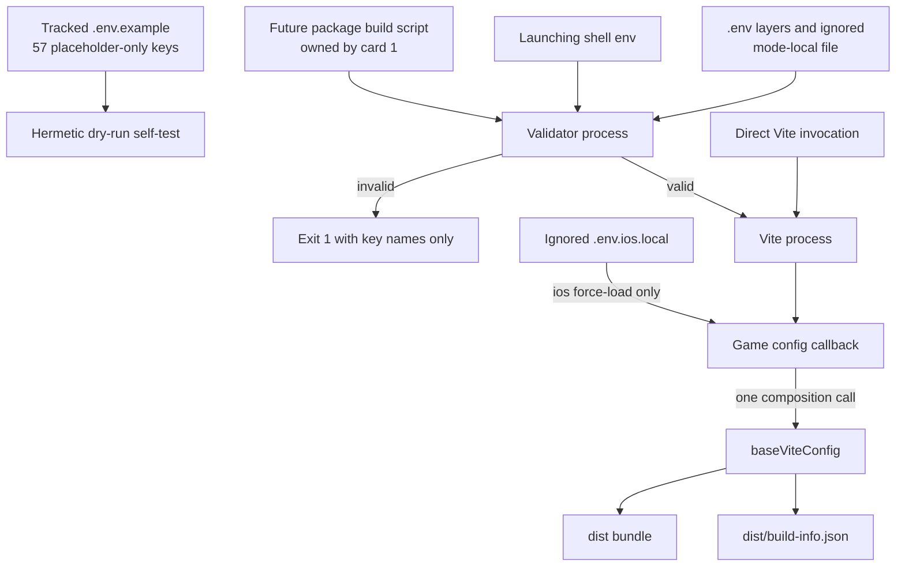

# FTD Canonical Environment and Build Parity - Plan

## Goal Capsule

- **Objective:** Give `games/find_the_dog` one secret-safe environment template, deterministic mode-aware validation, iOS Vite loading parity with v1, and an operator runbook without changing runtime source, native projects, or package scripts.
- **Authority:** Trello card `588Jrabe` defines the exact environment surface and allowed files; the read-only v1 game supplies behavior patterns, while current v2 shared configuration remains authoritative for build provenance.
- **Execution profile:** Build-time configuration and tooling only. Prefer hermetic Node self-tests and an actual Vite build over browser or device checks.
- **Stop conditions:** Stop if implementation requires real credential values, `package.json`, `ios/**`, `src/**`, a new dependency, or replacement of `configs/vite.base.ts` behavior.
- **Tail ownership:** The conductor copies real values separately after this branch lands; the implementation worker only documents that hand-copy and reports package-script values in its TWF handoff.

---

## Product Contract

### Summary

Establish the v2 Find the Dog environment and build contract as a tracked placeholder-only template, a fail-closed validator with a hermetic self-test, mode-aware Vite composition, and a secret-handling runbook. The work preserves v2 build provenance and leaves package/native/runtime ownership to their existing cards.

### Problem Frame

The v1 game carries the production environment inventory and a validator for Vite's empty mode-local override trap, but v2 currently has no game-local template, env tools, or operator documentation. Its Vite config is a static wrapper around `baseViteConfig`, whose build-info plugin must survive any mode-aware extension. The root ignore rules also hide `.env.example`, so adding the template without a game-local exception would silently leave the canonical contract untracked.

The card's acceptance contract is intentionally stricter than the v1 validator: it requires missing required iOS values to fail and a `--dry-run` command to prove placeholder success without access to real credentials. This is an adaptation of the v1 pattern, not a byte-for-byte port.

### Requirements

**Canonical environment surface**

- R1. `games/find_the_dog/.env.example` contains exactly the 57 names listed by the card, grouped and expanded from: `VITE_FIREBASE_{API_KEY,PROJECT_ID,APP_ID,AUTH_DOMAIN,STORAGE_BUCKET,MESSAGING_SENDER_ID,MEASUREMENT_ID}`; `VITE_FTD_DISABLE_REMOTE_CONFIG`; `VITE_GAMEANALYTICS_IOS_{ENABLED,GAME_KEY,SECRET_KEY}`; `VITE_GAMEANALYTICS_VERBOSE_LOGGING`; `VITE_REVENUECAT_{IOS,ANDROID}_API_KEY`; `VITE_ADJUST_IOS_{ENABLED,APP_TOKEN,ENVIRONMENT}`; `VITE_ADJUST_EVENT_{APP_OPEN,LEVEL_START,LEVEL_COMPLETE,LEVEL_FAIL,REWARDED_WATCHED}_TOKEN`; `VITE_ADJUST_VERBOSE_LOGGING`; `VITE_APPLOVIN_{IOS,ANDROID}_{ENABLED,SDK_KEY,GENERAL_AUDIENCE_ONLY}`; `VITE_APPLOVIN_{HAS_USER_CONSENT,DO_NOT_SELL,CONSENT_FLOW_ENABLED,GDPR_TERMS_ALERT_ENABLED,VERBOSE_LOGGING}`; `VITE_APPLOVIN_{IOS,ANDROID}_{BANNER,INTERSTITIAL,REWARDED}_ID`; `VITE_ADMOB_{IOS,ANDROID}_{BANNER,INTERSTITIAL,REWARDED}_ID`; `VITE_FTD_{PRIVACY_POLICY_URL,TERMS_URL,DATA_DELETION_URL,SUPPORT_URL,STORE_LINK}`; `VITE_CDN_{ENABLED,ORIGIN_DEV,ORIGIN_PROD,ORIGIN_ANDROID}`; and `VITE_FTD_OWNED_ANALYTICS_MIRROR_{URL,PUBLIC_CLIENT_KEY}`.
- R2. Every template entry has a non-secret placeholder and a one-line purpose comment; no live value, key prefix fragment, credential example, or copied v1 value appears in any changed file or command output.
- R3. `games/find_the_dog/.gitignore` ignores `.env*.local` and explicitly re-includes `.env.example`, overcoming the root `.env.*` rule while leaving real local files untracked.

**Loading and validation**

- R4. `tools/load-game-env.mjs` retains the v1 loader contract: resolve the game root from `import.meta.url`, read `.env` then `.env.local`, let the later file win, and never overwrite a key that existed in the launching shell.
- R5. `tools/validate-env-overrides.mjs` retains the v1 empty-override protection, `intentional-blank` escape hatch, supported modes, and exit-code contract, while adding required-value validation and strict rejection of unknown, duplicate, missing-value, or conflicting CLI flags. Normal release validation remains anchored to the script-derived game root; any root override is test-only and never part of a reported build script.
- R6. Normal validation requires every canonical provider/CDN enable flag for the selected mode to be present as a recognized boolean, then requires credentials only for enabled runtime consumers: GameAnalytics key/secret, Adjust token/environment, and AppLovin SDK/general-audience confirmation. Firebase and RevenueCat remain optional until their v2 runtime consumers land; CDN origins remain optional under the current fallback resolver; legal URLs, AdMob IDs, Keymaster-owned AppLovin unit IDs, disabled-provider credentials, and mirror settings retain existing defaults.
- R7. `--mode ios --dry-run` is a hermetic built-in self-test: it ignores ambient and local env values, proves a complete synthetic placeholder fixture passes, proves an enabled iOS provider fixture missing one required value is rejected and named, proves an empty override is rejected, and exits zero only when all assertions behave as expected. Every success response, including JSON, states that no local or ambient release configuration was validated; `intentional-blank` may suppress the override warning but never satisfies a required key.
- R8. Validation output is deterministic and secret-safe: missing keys are sorted, the mode and safe relative remediation file are named, and prose/JSON never print values, prefixes, lengths, raw lines, absolute roots, or exception dumps.

**Vite and provenance**

- R9. `games/find_the_dog/vite.config.ts` resolves as a Vite config callback, force-loads `.env.ios.local` into the current config process only in `ios` mode as v1 does, and retains mode-aware exposure of common variables plus the correct platform RevenueCat and GameAnalytics prefixes.
- R10. The game config composes through `baseViteConfig` rather than replacing or shallow-copying it, preserving the shared build-info plugin, `__BUILD_INFO__`, build target, sourcemaps, strict port behavior, and `dist/build-info.json` emission.

**Documentation and handoff**

- R11. `games/find_the_dog/docs/ENV.md` defines the 57 keys as the canonical supported release surface, classifies credential-bearing values as uncommitted, operator-sensitive client configuration that remains extractable from a shipped Vite bundle, forbids server-grade/private credentials in this surface, and distinguishes non-secret booleans/URLs/origins/IDs. It names the current v1 `.env.ios.local` as the real-value source without reproducing it, identifies excluded test/tuning/externally owned runtime knobs and their retained defaults, and gives the conductor a narrow owner-only manual copy procedure into v2's ignored `.env.ios.local`.
- R12. The implementation does not edit `package.json`; its TWF handoff reports exact `build:ios`, `build:android`, and `dev:ios` script values and does not append v1 packaging commands that do not exist in v2.

### Acceptance Examples

- AE1. Given the hermetic full-placeholder fixture, when `node tools/validate-env-overrides.mjs --mode ios --dry-run` runs without any local env file, then all internal assertions pass and the process exits zero without printing fixture values.
- AE2. Given the self-test's iOS fixture with GameAnalytics enabled and `VITE_GAMEANALYTICS_IOS_SECRET_KEY` removed, when required-value validation runs, then it returns the validation-failure status and names that key without printing any value.
- AE3. Given an optional base value and an empty `.env.ios.local` override without `intentional-blank`, when normal validation runs, then it returns the validation-failure status and reports the key; adding the escape-hatch comment permits only that optional empty override and never satisfies required-value validation.
- AE4. Given an iOS Vite build in this worktree, when the bundle completes, then `dist/build-info.json` exists and records the shared base config's provenance output.
- AE5. Given the new ignore rules, when Git evaluates `games/find_the_dog/.env.example` and `.env.ios.local`, then the example is trackable and the local secret file remains ignored.

### Scope Boundaries

- **In scope for product implementation:** only `games/find_the_dog/.env.example`, `games/find_the_dog/.gitignore`, `games/find_the_dog/tools/load-game-env.mjs`, `games/find_the_dog/tools/validate-env-overrides.mjs`, `games/find_the_dog/vite.config.ts`, and `games/find_the_dog/docs/ENV.md`. This planning artifact is process documentation and is exempt from the six-file implementation-diff gate.
- **Deferred to follow-up work:** card 1 owns package-script edits; the conductor owns copying real v1 values after landing; future runtime cards may reconcile environment declarations with consumers.
- **Out of scope:** `package.json`, lockfiles, dependencies, `ios/**`, `android/**`, `src/**`, native sync, real credentials, changes to shared `configs/vite.base.ts`, v1 packaging-tool ports, and device/UI verification.

---

## Planning Contract

### Key Technical Decisions

- KTD1. **The tracked template is the canonical supported release inventory.** Before implementation, classify every current runtime env read as included, test-only, tuning-only, or externally owned; stop if an excluded key is required for production. The validator parses `.env.example` only to assert the exact supported inventory, while its smaller conditional matrix and immutable synthetic values test behavior without becoming a competing registry.
- KTD2. **`--dry-run` is a self-test, not a release bypass.** Normal validation rejects empty, whitespace-only, and exact-template placeholder values for required keys. Dry-run uses internal synthetic placeholders and negative cases without reading local env files or mutating ambient process state; `--dry-run`, `--warn`, and any test-root option are forbidden in reported build scripts.
- KTD3. **Required values follow active runtime consumers, not template membership.** Normal validation requires explicit supported booleans for provider/CDN intent. Enabled GameAnalytics, Adjust, and AppLovin configurations fail closed on their runtime-required credentials; Firebase, RevenueCat, CDN origins, legal/support URLs, AdMob IDs, Keymaster-owned unit IDs, and mirror settings keep current unwired or fallback behavior.
- KTD4. **The card's 57 names stay exact even where current runtime has other knobs.** AppLovin ad unit IDs remain Keymaster-owned in current `src/**`; owned analytics enable/tuning keys and test-harness controls are outside this card. No aliases or runtime edits are introduced here.
- KTD5. **V2 shared config remains the build authority.** Each mode callback computes game-local overrides and calls `baseViteConfig` exactly once; shared `define`, plugin, build, and server behavior stays exclusively owned by the helper. The v1-style iOS process mutation is limited to the Vite config process, and any in-process config test snapshots and restores the ambient environment.
- KTD6. **Validation and Vite remain separate processes coordinated by card 1's scripts.** Direct Vite invocation does not imply validation. V2 has no applicable post-Vite level packaging command, so the script handoff sequences validator then Vite for each build and reports `vite --mode ios` for development without nonexistent v1 suffixes.

### Assumptions

- A1. The card's exact 57-key list is the public documentation contract even though current runtime code also references test-only, tuning, and enable variables not listed there.
- A2. Placeholder values may satisfy presence checks only inside the hermetic dry-run fixture. Normal validation treats recognized placeholder sentinels as unresolved for required keys.
- A3. Force-loading `.env.ios.local` is retained for v1 parity even though Vite also has conventional mode-file loading. For iOS config evaluation, keys in that file intentionally replace same-named ambient values as in v1; CLI `loadGameEnv` separately preserves launching-shell precedence. Tests must restore ambient state before evaluating another mode.
- A4. Build output is the real target environment for this non-visible card. A successful Vite build plus the emitted provenance file is stronger evidence than browser or device execution for the changed behavior.

### Environment Precedence

| Surface | Highest to lowest | Lifecycle boundary |
|---|---|---|
| CLI `loadGameEnv` | Launching shell, `.env.local`, `.env` | Fills missing process keys only |
| Normal iOS validation | `.env.ios.local`, launching shell, `.env.ios`, `.env.local`, `.env` | Reads and reports; does not mutate the parent shell |
| Normal Android validation | Launching shell, `.env.android.local`, `.env.android`, `.env.local`, `.env` | Mirrors Vite's standard mode precedence |
| Vite iOS callback | Forced `.env.ios.local`, launching shell, remaining Vite env layers | One-shot build process; config tests restore injected state |
| Vite Android/default | Launching shell, Vite mode-local, mode, local, base layers | No iOS force-load |

### High-Level Technical Design

The self-test validates the validator without entering the real-secret path. Card 1's future build scripts make validation a precondition for Vite; direct Vite remains independently runnable for config/build proof. The game callback adds iOS mode behavior, then delegates shared build semantics and provenance to the base helper.

### Risks and Operational Notes

- **Client-bundle exposure:** Every `VITE_*` value used by client code is recoverable from the shipped bundle. Mitigation: keep real values out of Git and evidence, forbid server/private credentials, treat any real-secret `dist` as transient and non-shareable, and remove it immediately after local use.
- **Validation bypass:** Warning mode, dry-run, test roots, placeholders, and `intentional-blank` can be mistaken for release validation. Mitigation: strict flag parsing, release scripts with no bypass flags, exact-template placeholder rejection in normal mode, and required-key checks that the escape hatch cannot suppress.
- **Validate/build parser drift:** The small parser is not a full dotenv implementation. Mitigation: document and test the supported syntax (`export`, quotes, inline comments, CRLF, duplicate assignment order, whitespace), fail closed on unsupported interpolation/multiline forms, and apply the same normalization rules in required and empty-override checks.
- **Diagnostic leakage:** Errors can leak values indirectly through raw lines, lengths, paths, or exception messages. Mitigation: emit only sorted key names, mode, safe relative filename, and remediation; seed canary values across layers in self-tests and assert neither output stream contains them or derived metadata.
- **Local-file custody:** A copied env file can be ignored by Git yet still be readable by other users or replaced by a symlink. Mitigation: the conductor refuses a symlink destination, creates/copies with owner-only permissions where POSIX applies, verifies mode/ownership without printing content, and confirms the path is ignored and unstaged.
- **Global config state:** V1-style force-loading mutates the Vite process environment. Mitigation: production Vite execution is one-shot; config tests snapshot and restore all injected keys on success and failure before evaluating another mode.
- **Partial secret-backed output:** A failed or interrupted build can leave a partial bundle. Mitigation: any build using real operator values registers cleanup before Vite starts and removes only `games/find_the_dog/dist` after success, assertion failure, build failure, or normal interruption; such output is never attached as evidence.

---

## Implementation Units

### U1. Track the exact canonical environment template safely

- **Goal:** Make the requested 57-key surface reviewable and trackable without exposing real values.
- **Requirements:** R1-R3; AE5; KTD1, KTD4.
- **Dependencies:** none.
- **Files:** `games/find_the_dog/.env.example`, `games/find_the_dog/.gitignore`.
- **Approach:** Expand the card's grouped names exactly once in the template, organize them by provider/capability, give each variable a one-line comment and type-appropriate non-production placeholder, and add the child ignore/re-include rules needed to track only the example.
- **Patterns to follow:** v1 `.env.example` grouping and warnings for orientation only; root `.gitignore` secret policy; no server/operator-only v1 variables.
- **Test scenarios:** assert a key-only parse equals the exact 57-name set with no duplicates or extras; assert every assignment uses an approved placeholder form without opening the v1 local file; inventory every current runtime env read and classify exclusions; use Git ignore resolution to prove the example is trackable while `.env.ios.local`, `.env.android.local`, and `.env.local` are ignored.
- **Verification:** The staged diff contains only placeholders and the exact inventory; Git can add `.env.example` but refuses the local env files without force.

### U2. Port loading and implement fail-closed validation with a Node self-test

- **Goal:** Provide deterministic env precedence, empty-override protection, required-mode checks, and hermetic acceptance proof without dependencies or an extra test file.
- **Requirements:** R4-R8; AE1-AE3; KTD1-KTD3.
- **Dependencies:** U1.
- **Files:** `games/find_the_dog/tools/load-game-env.mjs`, `games/find_the_dog/tools/validate-env-overrides.mjs`.
- **Approach:** Port v1's small ESM loader and subprocess-oriented validator structure. Separate parsing/resolution from CLI exit handling so dry-run can exercise immutable synthetic maps in-process. Preserve `--root`, `--warn`, and `--json`; add placeholder-sentinel rejection for normal required values, the baseline/conditional required matrix, and a dry-run summary that reports assertions rather than fixture contents.
- **Execution note:** Start by making the hermetic dry-run assertions fail against the v1 port, then add required-key and placeholder behavior while keeping empty-override cases green.
- **Patterns to follow:** v1 `tools/load-game-env.mjs`, v1 `tools/validate-env-overrides.mjs`, and its temporary-fixture/subprocess tests as behavioral references; current touch restrictions require the self-test to live in the Node CLI rather than a new Vitest file.
- **Test scenarios:** Covers AE1-AE3. Full iOS synthetic placeholder fixture passes dry-run and states that it did not validate release configuration; every mode-relevant provider/CDN enable flag rejects absence, malformed input, or ambiguity; enabling GameAnalytics without its key/secret is detected; disabled optional providers do not require credentials; unwired Firebase/RevenueCat values and fallback CDN origins remain optional; blank mode-local override of a non-empty base value fails; `intentional-blank` exempts only the immediately associated optional override and never a required key; unknown, repeated, missing-value, and conflicting flags return usage error; `--warn` preserves advisory success but is absent from release scripts; normal required checks reject whitespace and exact-template sentinels; CRLF, `export`, quotes, inline comments, duplicates, interpolation, and multiline cases follow the documented supported/fail-closed contract; canary values in base, override, and shell layers never appear in either output stream; shell-preexisting values remain authoritative in the loader.
- **Verification:** The card's dry-run command exits zero and states that its deliberate negative cases were caught; targeted synthetic normal-mode invocations return the documented exit codes without secret leakage.

### U3. Add iOS mode behavior without losing shared Vite provenance

- **Goal:** Reproduce v1 iOS env loading and platform exposure while retaining every shared v2 build default and plugin.
- **Requirements:** R9, R10; AE4; KTD5.
- **Dependencies:** U1.
- **Files:** `games/find_the_dog/vite.config.ts`.
- **Approach:** Convert the static config to `defineConfig(({ mode }) => ...)`, apply v1's `.env.ios.local` replacement behavior only for iOS mode, define the common/platform env-prefix policy from the canonical surface, and call `baseViteConfig` once with only game-specific server/env overrides. Do not spread a resolved base object or provide a replacement plugin array.
- **Patterns to follow:** the read-only v1 `vite.config.ts` mode callback and env-prefix helpers; `configs/vite.base.ts` public composition API.
- **Test scenarios:** iOS mode exposes iOS RevenueCat and GameAnalytics prefixes but not Android RevenueCat; Android/default modes do not force-load iOS local values; an iOS mode-local value replaces the same ambient key as it does in v1; repeated config evaluation restores process state before evaluating Android/default mode; a real iOS build emits the shared build-info asset while retaining representative shared target/server defaults.
- **Verification:** TypeScript/Vite config resolution succeeds, the iOS build completes, `dist/build-info.json` is present, and shared Vite defaults remain represented in the resolved config.

### U4. Document secret custody and leave the package-script handoff

- **Goal:** Make the env transfer/build workflow operable without copying secrets into Git or editing card 1's package surface.
- **Requirements:** R11, R12; KTD6.
- **Dependencies:** U1-U3.
- **Files:** `games/find_the_dog/docs/ENV.md`.
- **Approach:** Document the 57-key supported release surface and classify excluded test/tuning/externally owned knobs with their existing defaults. Explain operator-sensitive client credentials versus non-secret environment configuration and that bundled client values are extractable; name the v1 local file as the current source; give the conductor a no-symlink, owner-only hand-copy, ownership/mode, presence-only, ignored/unstaged, validation, and no-print checklist; explain normal validation versus the self-test-only dry-run warning and require transient secret-backed build output. Record that package scripts are handoff-only and that v2 currently has no applicable packaging suffix.
- **Patterns to follow:** v1 `docs/ios-mac-device-build.md` empty-override guidance, with machine-specific and credential values omitted.
- **Test expectation:** none for prose itself; cold-read review must show where real values live, how to copy them without Git, and how to validate without printing them.
- **Verification:** A reader can perform the copy with owner-only custody and presence checks without printing content; the doc forbids server-grade credentials and sharing secret-backed build output; the diff contains no real values and `package.json` is unchanged.

---

## Verification Contract

| Gate | Command or observation | Applies to |
|---|---|---|
| Hermetic validator contract | `cd games/find_the_dog && node tools/validate-env-overrides.mjs --mode ios --dry-run` exits zero after proving both positive and deliberate negative fixtures | U2 |
| Vite/build provenance | `cd games/find_the_dog && npx vite build --mode ios && test -f dist/build-info.json` | U3 |
| Generated-output cleanup | Register removal before any secret-backed Vite build and remove only `games/find_the_dog/dist` after success, failure, assertion failure, or normal interruption | U3 |
| Ignore contract | `git check-ignore -v games/find_the_dog/.env.ios.local games/find_the_dog/.env.android.local games/find_the_dog/.env.local`; `.env.example` must produce no ignore match | U1 |
| Scope/secret audit | Product implementation changes are limited to the six card-owned files; assert the exact approved placeholder assignments, classified runtime-read inventory, ignore behavior, and absence of unexpected non-placeholder values without reading the v1 local file | U1-U4 |
| Static health | `npm --workspace @fabrikav2/find_the_dog run typecheck` and the narrow applicable lint/unit commands remain green | U2-U4 |

No browser E2E or device check is part of this contract: the changed behavior is build-time env resolution and the real observable is the bundle plus provenance asset.

---

## Definition of Done

- The exact 57-key `.env.example` is tracked, commented, placeholder-only, and protected by local ignore rules.
- Normal validator behavior requires explicit provider/CDN intent and rejects enabled-provider omissions, placeholder sentinels, and accidental empty overrides without leaking values, while retaining current unwired/fallback behavior.
- The hermetic iOS dry-run proves both passing placeholders and deliberate missing/blank failures and exits zero without needing real local env files.
- `vite build --mode ios` completes through `baseViteConfig` and emits `dist/build-info.json`; generated `dist` is removed afterward.
- `games/find_the_dog/docs/ENV.md` names secret custody and the conductor's manual copy step without reproducing values.
- `package.json`, lockfiles, `ios/**`, `android/**`, `src/**`, shared Vite config, and all unrelated files remain unchanged.
- The TWF handoff reports the three exact package-script values and explicitly states that no v2 packaging suffix applies.
- No abandoned experiments, local env files, build outputs, or secret-bearing diagnostics remain in the branch.
