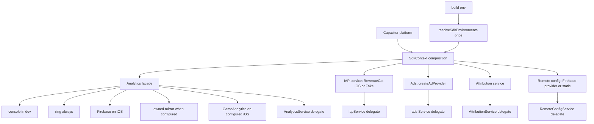
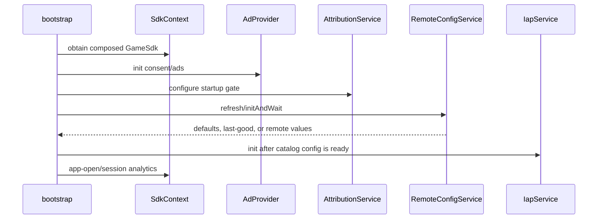
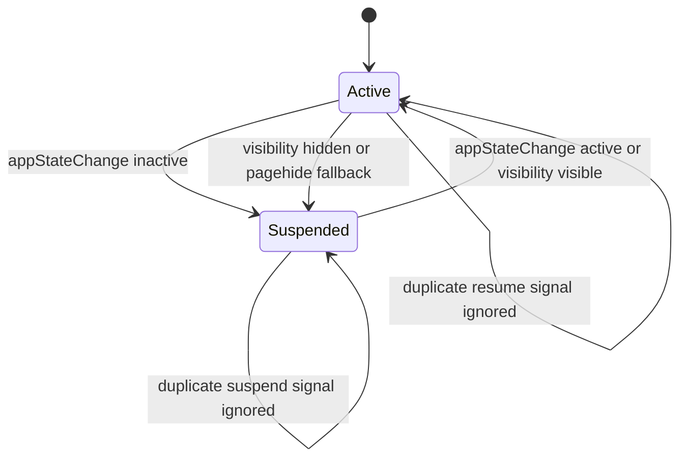

# Find The Dog SDK Composition Parity - Plan

## Goal Capsule

- **Objective:** Give `games/find_the_dog` one `GameSdk` composition root that resolves environments once and owns the analytics, IAP, ads, attribution, and remote-config implementations while preserving FTD's existing game-facing service APIs and behavior.
- **Authority:** Trello card `HuNL2T8A` is the product contract. Its decided provider matrix, environment names, dependency versions, prior-art requirements, acceptance tests, and file-scope restrictions override incidental legacy behavior.
- **Execution profile:** Deep TypeScript integration within `games/find_the_dog/src/**`, `games/find_the_dog/tests/**`, and `games/find_the_dog/package.json`; root `package-lock.json` churn from installation is allowed.
- **Scope fence:** Do not change `packages/sdk/**`, other games, or any `ios/**` path. Do not rebuild provider logic already supplied by `@fabrikav2/sdk` or `@fabrikav2/services`. Do not commit credentials or values for any named environment variable.
- **Stop conditions:** Stop and return to planning if an SDK/service package change becomes necessary, if the existing FTD purchase or remote-config public surfaces cannot be preserved without a product-visible behavior change, or if native selection requires static plugin imports that execute in web/CI.
- **Tail ownership:** This card ends with terminating TypeScript and Vitest gates. Native iOS installation, signing, plugin registration, and device observation belong to FTD-PARITY-2 and remain unverified here.

---

## Product Contract

### Summary

Adapt the `marble_run` composition-root pattern to FTD, but retain FTD's richer compatibility services as thin delegates over the root-owned SDK instances. Platform and configuration choose native providers in production code; browser and CI resolve to Disabled, Fake, or static implementations by construction.

### Problem Frame

FTD already has the game-specific behavior that must survive this migration: its analytics event union and purchase funnel, shop snapshot/test controls, persistent-banner contract, Adjust event names, large remote-config schema, lifecycle flush, and build provenance. What is missing is production composition. Analytics constructs an empty production fan-out, IAP pins a fake provider, ads pin a disabled provider, attribution duplicates package logic, and remote config remains a local stub.

The shared packages now contain the tested mechanisms. This card replaces scattered construction with one game-owned composition root and leaves legacy module paths as compatibility boundaries, so callers and existing mocks do not need to learn provider details.

### Requirements

**Composition and environments**

- R1. Add `games/find_the_dog/src/sdk/SdkContext.ts` as the only production composition authority for analytics, IAP, ads, attribution, and remote config, following the structure of `games/marble_run/src/sdk/SdkContext.ts` without copying Marble Run gameplay or economy behavior.
- R2. Resolve `SdkEnvironments` exactly once from the build environment and thread that result into every environment-aware adapter. A development build must never produce `analytics: 'production'` or `adjust: 'production'`.
- R3. Keep provider selection deterministic and testable through injected platform, environment, loader, transport, and factory seams. Web/CI behavior must emerge from the same production composition path, with no `if (test)` branches in runtime code.

**Analytics**

- R4. Build one `Analytics<FtdEvent>` facade with FTD's build stamp and game identity, then fan it out to a development console sink, an always-present bounded ring sink, an iOS Firebase sink, an optional owned-mirror sink, and an optional iOS GameAnalytics sink.
- R5. Construct the Firebase transport in FTD over `@capacitor-firebase/analytics`; pass that transport to the SDK `createFirebaseSink` factory. Do not import the Capacitor plugin from `packages/sdk` or enable Firebase analytics on web.
- R6. Add the owned-mirror sink only when both `VITE_FTD_OWNED_ANALYTICS_MIRROR_URL` and `VITE_FTD_OWNED_ANALYTICS_MIRROR_PUBLIC_CLIENT_KEY` are present. Reuse the existing FTD endpoint/key validation rules, but treat URL-plus-key presence as the enablement gate rather than requiring the legacy `VITE_FTD_OWNED_ANALYTICS_MIRROR_ENABLED` flag. Production endpoints must remain HTTPS, contain no URL credentials or query string, and use a valid public client key. Use an injected HTTP transport, the FTD game id, and the resolved analytics environment; otherwise omit the sink with an explicit disabled reason and without failing boot.
- R7. Implement the GameAnalytics adapter over `gameanalytics` as an SDK `AnalyticsSink`, initialize it only on configured iOS, and translate canonical facade events through the existing progression, design, resource, and ad mappers. Numeric and boolean custom fields must continue through `compactCustomFields` so zero and false arrive as strings.
- R8. Preserve the complete `FtdEvent` union, every public `AnalyticsService` method, purchase-funnel ordering, attribution calls, background flush/resume behavior, `ownedMirrorStats()`, cohort tagging, provider-name attribution, and the `buildStamp()` global parameter. Preserve FTD's existing GameAnalytics sensitive-value guards, mirror parameter allowlist/sanitizer, Firebase primitive coercion, and bounded purchase error field rather than forwarding raw exception objects. `AnalyticsService` consumes the root-built facade and ports instead of constructing its own facade or provider singletons.
- R9. Every identifier declared in `games/find_the_dog/game.config.ts` under `analyticsEvents` remains emittable through the composed facade, and existing FTD-specific events remain available through `track`.

**IAP, ads, and attribution**

- R10. Keep the SDK `IapService` and the existing `FindTheDogIapService` compatibility surface. Select `RevenueCatProvider` only for native iOS with a non-empty `VITE_REVENUECAT_IOS_API_KEY`, load `Purchases` dynamically from `@revenuecat/purchases-capacitor`, and select the seeded `FakePurchaseProvider` for web/CI or missing native configuration as the card explicitly requires. A native missing-key fallback must emit a prominent configuration diagnostic; FTD-PARITY-2 must treat that state as a release blocker even though this TypeScript card preserves the mandated fallback.
- R11. Preserve catalog construction, snapshots, test controls, customer-info listener behavior, operation and purchase timeouts, sandbox detection through the `test_` API-key prefix, and the existing `onEvent` analytics mapping for `state_changed` and `purchase_dispatched` in `games/find_the_dog/src/shop/IapService.ts`.
- R12. Replace the pinned disabled ad singleton with the SDK `createAdProvider` result using FTD's existing `AppLovinConfig` and Keymaster ad-unit ids. Use the shared SDK AppLovin/Disabled implementations, an injected AppLovin factory for FTD lifecycle/revenue callbacks, and one game-side compatibility decorator for `AdProvider.enabled` plus persistent-banner result semantics. Preserve rewarded-audio pausing, privacy options, ad-revenue telemetry, and the persistent-banner contract documented in `games/find_the_dog/src/ads/AppLovinMaxPlugin.ts`.
- R13. Use the package `createAttributionProvider` and `AttributionService` with FTD's existing Adjust environment variables and five event-token mappings. Preserve the ad-consent startup gate and its failure-tolerant timeout while removing or delegating the game-local provider/service implementation.

**Remote config and lifecycle**

- R14. Express the exact FTD remote-config defaults, remote keys, descriptions, and validation rules as an `@fabrikav2/services/remote-config` schema. On native iOS, inject a Firebase JS Remote Config provider; on web use the service with no provider so defaults remain static.
- R15. Preserve `remoteConfigService.init()`, `initAndWait()`, `initAndWaitForTest()`, `value()`, `snapshot()`, and `setValuesForTest()` as compatibility APIs. Development localStorage overrides keep precedence without reading browser storage when `window` is unavailable, and existing module mocks remain valid or are updated in the same card.
- R16. Make `@capacitor/app` `appStateChange` the primary native suspend/resume signal while retaining `visibilitychange` and `pagehide` fallbacks. All signals feed the existing idempotent lifecycle authority so duplicate notifications do not double-suspend, double-start sessions, or skip subscriber isolation.

**Dependencies, boundaries, and proof**

- R17. Add the direct workspace dependency `@fabrikav2/services` plus `@capacitor/app ^8.1.0`, `@capacitor-firebase/analytics ^8.3.0`, `@revenuecat/purchases-capacitor ^13.1.1`, `firebase ^12.12.0`, and `gameanalytics ^4.4.7` to `games/find_the_dog/package.json`; update `games/find_the_dog/src/vite-env.d.ts` for every consumed environment name.
- R18. Add focused unit coverage for environment invariants, web/iOS provider and sink selection, RevenueCat dynamic loading, owned-mirror gating, GameAnalytics mapping and falsy safety, remote-config provider/default/override behavior, lifecycle signal deduplication, and compatibility delegates.
- R19. Preserve all existing purchase-funnel, analytics-lifecycle, ad, harness, and game tests. Finish with the exact card-specified terminating game and root verification commands.

### Acceptance Examples

- AE1. Given a development build and web platform, creating the root yields non-production analytics/Adjust environments, a Fake IAP provider, Disabled ads, Disabled attribution, static remote config, console plus ring analytics sinks, and no native plugin load.
- AE2. Given native iOS, a RevenueCat key, and an injected successful dynamic loader, IAP uses `RevenueCatProvider` with the existing catalog and API key; a `test_` key remains the provider's sandbox path. Without the key or outside native iOS, the same composition uses Fake IAP; the missing-key native case also emits the release-blocking diagnostic named in R10.
- AE3. Given native iOS with Firebase analytics available, the Firebase SDK transport receives facade event names and sanitized parameters through `createFirebaseSink`. Given web, the Firebase analytics plugin is not imported or called.
- AE4. Given both owned-mirror URL and public client key, events are enqueued with `game_id: find_the_dog` and the resolved environment; if either value is absent, the sink is omitted and `ownedMirrorStats()` reports an explicit disabled reason.
- AE5. Given configured iOS GameAnalytics, `dog_index: 0` and `no_ads: false` map through the existing event helpers and reach the JS SDK as `'0'` and `'false'`. Given web or missing keys, no GameAnalytics SDK import or initialization occurs.
- AE6. Given a valid Firebase remote value, `value(key)` returns the schema-coerced remote value. Given a missing, invalid, or failed fetch, it returns the exact FTD default or last good value. In development, a stored/test override wins and is reflected by the compatibility snapshot source.
- AE7. Given an iOS `appStateChange` to inactive followed by `visibilitychange` or `pagehide`, subscribers suspend once and analytics emits one background/session-end/flush sequence. Returning active resumes once; browser-only visibility behavior remains unchanged.
- AE8. Given existing callers or Vitest mocks importing `AnalyticsService`, `IapService`, `Service`, `AttributionService`, or `RemoteConfigService`, their public methods and singleton import paths continue to work while provider construction belongs only to `SdkContext`.

### Scope Boundaries

**In scope**

- FTD TypeScript composition, game-owned native transports/adapters, compatibility delegates, environment typing, package dependencies, and focused tests.
- Removal of local duplicate provider/service code only when the replacement leaves the named FTD public contract and persistent-banner documentation intact.
- Root lockfile changes caused by installing the card-owned FTD dependencies.

**Outside this card**

- No `packages/sdk/**` or `packages/services/**` implementation changes.
- No other game changes and no shared-kit visual changes.
- No `games/find_the_dog/ios/**` changes, Capacitor sync, CocoaPods work, signing, app installation, or real-device claims; FTD-PARITY-2 owns those.
- No production Firebase, RevenueCat, Adjust, AppLovin, GameAnalytics, or mirror credential creation/configuration.
- No new analytics event taxonomy beyond preserving the existing canonical and FTD event surfaces.

---

## Planning Contract

### Key Technical Decisions

- KTD1. **The root owns construction; compatibility modules own game vocabulary.** `SdkContext` resolves environments and creates provider/service instances. Existing FTD modules keep their caller-facing methods and test helpers as delegates or factories, but cannot independently choose environments or providers.
- KTD2. **Use one-way factories and lazy delegates to avoid module-initialization cycles.** `AnalyticsService`, `IapService`, attribution, and remote config currently reference each other through module singletons. Refactor construction into dependency-injected factories called by the root, and make compatibility exports dereference the initialized context lazily rather than reading it during module evaluation.
- KTD3. **Platform selection is the web/CI safety mechanism.** Native-only plugins load behind iOS/configuration gates and dynamic imports. The root remains synchronous; memoized lazy structural proxies perform imports on first native use and define early-call behavior. Fake, Disabled, and static outcomes are normal production composition results for web, not test substitutions.
- KTD4. **Analytics is one facade with additive sinks.** Preserve one timestamp/session/environment/global-parameter stamping path, then attach sinks. This prevents each backend from reconstructing event meaning and lets the ring observe the exact event envelopes transports receive.
- KTD5. **GameAnalytics is a sink, not a parallel analytics authority.** Its adapter switches on facade event names and delegates field shaping to `GameAnalyticsEvents.ts`; no caller emits directly to the JS SDK. The adapter initializes currencies and item types before the SDK and tolerates loader or transport failures without blocking game boot.
- KTD6. **FTD wrappers preserve semantic deltas the shared packages intentionally do not own.** The IAP wrapper retains FTD catalog/snapshot/test behavior and analytics callbacks; AnalyticsService retains FTD-specific events/cohort/build stamp; remote config retains development overrides and its historical snapshot shape; the root supplies their underlying package mechanisms.
- KTD7. **Remote config uses a game-side Firebase provider adapter.** The adapter initializes/reuses the Firebase app from named `VITE_FIREBASE_*` configuration, calls `ensureInitialized`, attempts `fetchAndActivate`, and reads the currently activated values even when the network fetch rejects. It returns raw remote-key values to the shared service while retaining fetch status/error metadata for the compatibility snapshot. The shared schema owns coercion/default validation; the compatibility wrapper owns local override precedence and legacy snapshot translation.
- KTD8. **Lifecycle has one state machine and multiple signals.** `appStateChange` is registered first as the native signal, while visibility/pagehide call the same idempotent `suspendGame`/`resumeGame` functions. Listener registration must be observable and removable in tests without allowing one hook failure to block others.
- KTD9. **Reuse prior art selectively.** From Marble Run, take the one-call environment resolution, platform-selected providers, injected ports, and a single root object; reject its Fake-only native IAP, console-only analytics, default-only remote config, and Marble economy/gameplay facade. From v1 FTD, take Firebase app initialization rules, the thin Capacitor Firebase transport, Remote Config timing/provider details, Adjust startup/event mapping, GameAnalytics loader/queue/mappers, and RevenueCat dynamic plugin bridge; reject v1's inline SDK singletons, duplicated service state machines, provider-specific callers, web Firebase analytics path, and direct provider construction outside the root.
- KTD10. **Use shared ad implementations behind one FTD decorator.** `createAdProvider` remains the sole platform/configuration decision point. Its injected AppLovin factory constructs the shared SDK `AppLovinMaxProvider` with FTD lifecycle/revenue callbacks; the default shared Disabled provider remains unchanged. `Service.ts` wraps the selected provider once to expose the game-only `enabled` field and remember banner visibility so a repeated show returns `true`, without changing `packages/sdk/**` or retaining a competing local provider implementation.
- KTD11. **Keep composition synchronous and native loading lazy.** Export a pure synchronous `createSdkContext(dependencies)` and one memoized production getter. RevenueCat uses a memoized structural plugin proxy whose methods await one dynamic import; GameAnalytics retains its pre-init queue; Firebase transports/providers initialize lazily on their async calls. Compatibility exports can therefore exist at module import time, and early calls either queue or await the relevant loader rather than observing an uninitialized root.

### High-Level Technical Design

### Assumptions

- A1. The card's named environment variables and dependency versions are approved inputs to this card; secret values and native project configuration are not.
- A2. Shared purchase and attribution provider ports are structurally compatible with FTD's composition needs. Ads are deliberately not treated as identical: FTD's local interface adds `enabled`, and its banner contract differs from the shared provider implementation, so the single game-side decorator described in KTD10 is required.
- A3. Firebase Remote Config uses the JavaScript SDK on native WKWebView as the card directs; Firebase Analytics uses the native Capacitor plugin only on iOS.
- A4. `VITE_FTD_OWNED_ANALYTICS_MIRROR_PUBLIC_CLIENT_KEY` is the canonical key name because it is already used by FTD configuration and the SDK option is named `publicClientKey`.
- A5. GameAnalytics initialization remains fire-and-forget and failure-tolerant. The card requires sink selection and mapping tests, not delivery confirmation from the vendor.
- A6. Root lockfile churn is expected, but no unrelated dependency upgrades or formatting churn should be accepted.
- A7. Every `VITE_*` Firebase, RevenueCat, Adjust, AppLovin, GameAnalytics, and mirror value bundled by this card is extractable public client configuration, not a server secret or authorization boundary. Implementation must not log full values or place privileged server credentials in the client; operational build injection and release-based rotation remain outside the repository.
- A8. This composition card preserves FTD's current analytics enablement posture and the explicit attribution startup gate; it does not invent a new product-policy consent flow. If release policy requires Firebase, GameAnalytics, or mirror delivery to wait for a separate consent decision, that is a product-contract change and must be resolved before shipping rather than guessed during this card.

### Risks and Dependencies

- **Circular initialization:** A root that imports compatibility singletons while those modules import the root can read partially initialized bindings. Factory construction plus lazy delegates and a cold-import unit test are required.
- **Native code in web bundles:** Static plugin imports can execute or fail during Vitest/web boot. Native plugin loaders must be gated and injectable, with tests proving web selection never invokes them.
- **Analytics semantic drift:** FTD methods often emit both canonical and FTD-specific events or attribution calls. Characterization tests must pin event names, ordering, global params, and mapper output before ownership changes.
- **Remote-config shape drift:** The shared snapshot uses `origins`/`lastFetchAtMs`, while FTD callers expect `sources`, fetch status, and millisecond sentinel values. Preserve the FTD projection rather than changing callers en masse.
- **Override provenance:** Existing `setValuesForTest` reports override values as `remote`; the migration should make local development/test provenance explicit without breaking tests that consume the old union.
- **Purchase recovery:** Customer-info listeners recover only non-consumable entitlements. Provider selection must not broaden restore fulfillment to consumables or alter late-purchase safety.
- **Native missing-key fallback:** The card explicitly mandates the seeded Fake provider when native RevenueCat configuration is absent. That is unsafe as a shipped production state, so the TypeScript implementation must diagnose it and FTD-PARITY-2 must fail release/device sign-off until a real key selects RevenueCat.
- **Ad behavior regression:** The shared `AdProvider` type omits FTD's `enabled` field, and the shared AppLovin provider currently returns `false` for an already-visible banner while FTD intentionally returns `true`. Use one stateful game-facing decorator around the selected shared provider and pin both deltas in tests; provider selection alone is insufficient proof.
- **Third-party API drift:** RevenueCat configuration remains a single boot call; Capacitor `appStateChange` returns an async listener handle; Firebase Remote Config is browser-only and needs an initialized app; GameAnalytics requires resource allowlists before initialization. Tests should wrap these APIs behind structural ports rather than coupling assertions to vendor objects.

### Sources and Research

- `games/marble_run/src/sdk/SdkContext.ts` — canonical root shape, one environment resolution, platform-selected providers, injected ports, and web-safe defaults.
- `games/find_the_dog/src/analytics/AnalyticsService.ts`, `src/shop/IapService.ts`, `src/ads/Service.ts`, `src/attribution/AttributionService.ts`, `src/config/RemoteConfigService.ts`, and `src/platform/gameLifecycle.ts` — compatibility surfaces and behaviors to preserve.
- `packages/sdk/src/analytics/**`, `packages/sdk/src/iap/revenuecat-provider.ts`, `packages/sdk/src/ads/createAdProvider.ts`, `packages/sdk/src/attribution/AttributionService.ts`, and `packages/services/src/remote-config/**` — existing tested mechanisms this card composes without modification.
- `FIXES.md` — purchase-funnel telemetry, GA falsy-field regression, lifecycle flush, persistent-banner semantics, and build-stamp requirements that recently landed and must remain green.
- Read-only v1 FTD: `src/analytics/firebaseApp.ts`, `src/analytics/FirebaseAnalyticsSink.ts`, `src/config/RemoteConfigService.ts`, `src/attribution/AttributionService.ts`, `src/analytics/GameAnalyticsProvider.ts`, and `src/shop/IapService.ts` under the v1 repository — native transport and configuration prior art, not code authority.
- `docs/solutions/architecture-patterns/data-first-semantic-contract-and-immutable-projections.md` — one canonical authority with downstream wrappers rather than competing registries.
- [Capacitor App API](https://capacitorjs.com/docs/apis/app) — `appStateChange` reports active state on iOS, Android, and web and returns a listener handle.
- [RevenueCat Capacitor installation](https://www.revenuecat.com/docs/getting-started/installation/capacitor) — install/sync and one-time `Purchases.configure` contract.
- [Firebase Remote Config Web API](https://firebase.google.com/docs/reference/js/remote-config) — `ensureInitialized`, `fetchAndActivate`, `getAll`, and the browser-only constraint.
- [Capawesome Firebase Analytics API](https://capawesome.io/docs/plugins/firebase/analytics/) — `FirebaseAnalytics.logEvent({ name, params })` transport shape.
- [GameAnalytics JavaScript SDK](http://docs.gameanalytics.com/event-tracking-and-integrations/sdks-and-collection-api/open-source-sdks/javascript/) — configure resource allowlists and build before `initialize`.

---

## Implementation Units

### U1. Establish the GameSdk composition root and dependency direction

- **Goal:** Create the single root, resolve environments once, and make construction testable without importing native plugins.
- **Requirements:** R1, R2, R3, R17.
- **Dependencies:** None.
- **Files:** `games/find_the_dog/src/sdk/SdkContext.ts` (new), `games/find_the_dog/src/vite-env.d.ts`, `games/find_the_dog/package.json`, `package-lock.json`, `games/find_the_dog/tests/unit/sdk-context.test.ts` (new).
- **Approach:** Define the FTD root/ports and injected construction dependencies, normalize the platform once, call `resolveSdkEnvironments` once, and establish one-way factory ownership plus lazy compatibility access. Keep `createSdkContext` synchronous and pure, expose one memoized production getter, and put asynchronous imports behind memoized structural proxies or queued sinks. Add the card-owned external dependencies, the direct `@fabrikav2/services` workspace dependency required by the migration, and environment typings without importing any plugin before its platform/configuration gate.
- **Patterns to follow:** `games/marble_run/src/sdk/SdkContext.ts`; factory injection in `packages/sdk/src/ads/createAdProvider.ts`; structural plugin port in `packages/sdk/src/iap/revenuecat-provider.ts`.
- **Test scenarios:**
  - Development build resolves non-production analytics and Adjust environments and shares the same resolved object across ports.
  - Production build resolves the expected production matrix.
  - Web construction completes without calling Firebase, RevenueCat, or GameAnalytics loaders.
  - A cold import followed by root access produces fully initialized compatibility services with no temporal-dead-zone or undefined binding.
  - Calls made before native loaders resolve await or queue behind one memoized import and are delivered once; loader rejection degrades through the named service fallback without leaving a partial root.
- **Verification:** The root is the only game file that composes all five SDK/service domains; provider construction is injectable; package changes are limited to the named external dependencies, the required direct services workspace dependency, and lockfile consequences.

### U2. Compose analytics sinks and preserve AnalyticsService

- **Goal:** Route every canonical and FTD event through one facade and the required sink fan-out while retaining the existing public analytics contract.
- **Requirements:** R4, R5, R6, R7, R8, R9.
- **Dependencies:** U1, U4.
- **Files:** `games/find_the_dog/src/sdk/SdkContext.ts`, `games/find_the_dog/src/analytics/AnalyticsService.ts`, `games/find_the_dog/src/analytics/GameAnalyticsProvider.ts`, `games/find_the_dog/src/analytics/GameAnalyticsEvents.ts`, `games/find_the_dog/src/analytics/GameAnalyticsConfig.ts`, `games/find_the_dog/src/analytics/OwnedAnalyticsMirrorConfig.ts`, `games/find_the_dog/src/testing/TestHarness.ts`, `games/find_the_dog/tests/unit/sdk-context.test.ts`, `games/find_the_dog/tests/unit/analytics-lifecycle-flush.test.ts`, `games/find_the_dog/tests/unit/purchase-funnel-analytics.test.ts`, `games/find_the_dog/tests/unit/ga-falsy-custom-fields.test.ts`, `games/find_the_dog/tests/unit/gameanalytics-sink.test.ts` (new).
- **Approach:** Finalize the root-built facade after U4 has exposed the attribution service and ad provider through deferred analytics callbacks, then inject those ports, the ring sink, and optional mirror stats into the compatibility service. Adapt the Capacitor Firebase plugin behind the SDK transport, construct the mirror HTTP port locally, and turn GameAnalytics into an `AnalyticsSink` that maps facade events through existing helpers. Expose the ring to the harness without introducing a second analytics instance.
- **Execution note:** Add characterization assertions for event ordering and global params before changing ownership.
- **Patterns to follow:** SDK `firebase-sink.ts`, `owned-mirror-sink.ts`, and `ring-sink.ts`; v1 `FirebaseAnalyticsSink.ts` transport; v1 `GameAnalyticsProvider.ts` loader/queue; current `GameAnalyticsEvents.ts` sanitization.
- **Test scenarios:**
  - Dev console and ring sinks are selected; production omits console but retains ring.
  - Firebase selection occurs only on iOS and forwards name/params through the injected transport; rejection is swallowed.
  - Mirror is selected only when both named config values exist, uses the FTD game id/resolved env, flushes through the compatibility lifecycle, and reports live or disabled stats.
  - Mirror config rejects non-HTTPS endpoints, URL credentials, query strings, and invalid public keys before constructing the sink.
  - Configured iOS GameAnalytics initializes allowlists before the SDK and maps session, level, resource, ad, purchase, and FTD custom events to the correct mapper family.
  - Covers AE5. Zero/false custom fields survive as strings, including the existing regression suite.
  - Existing purchase-funnel methods, ad provider names, cohort bucket, build stamp, background flush, and session restart produce the same event sequence.
  - Existing bounded error fields and primitive coercion prevent raw exception objects from reaching Firebase; GameAnalytics and mirror sensitive-value/allowlist guards remain active.
  - Every `game.config.ts` analytics id can be emitted by the facade and observed through the ring.
- **Verification:** No production facade remains inside `AnalyticsService`; all sinks receive the same stamped event; existing analytics suites and new sink-selection/mapping suites pass.

### U3. Select RevenueCat or Fake IAP without changing the shop contract

- **Goal:** Make native iOS purchases use the shared RevenueCat adapter while web/CI retains the current fake behavior and all FTD shop semantics.
- **Requirements:** R10, R11.
- **Dependencies:** U1, U2.
- **Files:** `games/find_the_dog/src/sdk/SdkContext.ts`, `games/find_the_dog/src/shop/IapService.ts`, `games/find_the_dog/src/bootstrap.ts`, `games/find_the_dog/tests/unit/iap-provider-selection.test.ts` (new), `games/find_the_dog/tests/unit/purchase-funnel-analytics.test.ts`, `games/find_the_dog/tests/unit/bootstrap-insitu-tour.test.ts`.
- **Approach:** Keep FTD catalog conversion, snapshots, test configuration, and fulfillment consumers in the wrapper. Inject the selected purchase provider and API key from the root; dynamically load and structurally adapt `Purchases` only for configured native iOS. Retain the two `onEvent` analytics branches in the wrapper and preserve bootstrap listener/restore sequencing.
- **Execution note:** Characterize the fake-backed wrapper first, then add the provider matrix around it.
- **Patterns to follow:** `packages/sdk/src/iap/revenuecat-provider.ts`, current `FindTheDogIapService`, and v1's dynamic `revenueCatPurchases` bridge.
- **Test scenarios:**
  - Covers AE2. Native iOS plus key selects a `RevenueCatProvider`, passes the key/catalog, and calls the dynamic loader once.
  - Web, non-native iOS, and missing-key cases select the seeded Fake provider without invoking the loader.
  - Missing-key native iOS additionally emits the explicit configuration diagnostic that FTD-PARITY-2 uses as a release blocker.
  - A `test_` key reaches the shared provider unchanged for sandbox alias behavior.
  - `state_changed` and `purchase_dispatched` retain their analytics events and ordering.
  - Customer-info updates and cold-start restore continue recovering only non-consumable entitlements.
  - Existing snapshot/test methods and HUD/GameScene purchase flows behave unchanged.
- **Verification:** Provider selection tests prove the matrix without vendor code; existing purchase and bootstrap tests remain green.

### U4. Compose ads and attribution through shared factories

- **Goal:** Replace pinned/local construction with shared package providers while keeping FTD ad and attribution behavior.
- **Requirements:** R12, R13.
- **Dependencies:** U1.
- **Files:** `games/find_the_dog/src/sdk/SdkContext.ts`, `games/find_the_dog/src/ads/Service.ts`, `games/find_the_dog/src/ads/AppLovinConfig.ts`, `games/find_the_dog/src/ads/AppLovinMaxPlugin.ts`, `games/find_the_dog/src/attribution/AttributionService.ts`, `games/find_the_dog/src/bootstrap.ts`, `games/find_the_dog/tests/unit/sdk-context.test.ts`, `games/find_the_dog/tests/unit/ad-show-failed.test.ts`, `games/find_the_dog/tests/unit/attribution-composition.test.ts` (new).
- **Approach:** Feed existing FTD AppLovin configuration and full-screen lifecycle callbacks to `createAdProvider`. Pass an AppLovin factory that constructs the shared SDK provider with FTD's revenue callback, then wrap the selector result once in `Service.ts` to retain `enabled`, audio/privacy/test, and persistent-banner compatibility. Remove or delegate the local provider implementation rather than leaving it as an alternative composition path. Expose ad-revenue and attribution tracking through late-bound callbacks that U2 connects to the final facade, avoiding a construction cycle. Construct the package attribution provider/service from FTD Adjust config, expose the existing singleton methods as delegates, and configure its startup gate from ad consent.
- **Patterns to follow:** SDK `createAdProvider.ts` and attribution `AttributionService.ts`; current FTD `AppLovinConfig.ts`; persistent-banner contract in local `AppLovinMaxPlugin.ts`.
- **Test scenarios:**
  - Web ads are Disabled by construction and preserve `enabled === false` and existing failed-show accounting.
  - Configured iOS selects AppLovin with Keymaster unit ids and carries audio lifecycle/revenue callbacks.
  - Rewarded test override and privacy options remain available through `Service.ts`; a repeated `showBanner()` while the persistent banner is already visible returns `true`, and hide resets that state.
  - Web attribution is Disabled; configured iOS selects Adjust with the five FTD event-token names and the resolved environment.
  - Ad startup failure/timeout does not block attribution forever, and calls before/after the gate retain ordering.
- **Verification:** No game-local code reimplements the platform matrix or retains a second AppLovin implementation; `createAdProvider` receives the lifecycle/revenue-aware shared factory, the persistent-banner comment remains, and ad/attribution unit tests pin `enabled` plus already-visible banner behavior.

### U5. Migrate FTD remote config to the shared service

- **Goal:** Use the shared schema/service and a game-owned Firebase provider without changing FTD defaults, caller APIs, or development overrides.
- **Requirements:** R14, R15.
- **Dependencies:** U1.
- **Files:** `games/find_the_dog/src/config/remoteConfigSchema.ts`, `games/find_the_dog/src/config/RemoteConfigService.ts`, `games/find_the_dog/src/analytics/firebaseApp.ts` (new or equivalent game-owned adapter), `games/find_the_dog/src/config/FirebaseRemoteConfigProvider.ts` (new or equivalent), `games/find_the_dog/src/sdk/SdkContext.ts`, `games/find_the_dog/src/bootstrap.ts`, `games/find_the_dog/tests/unit/remote-config-composition.test.ts` (new), and existing tests that mock `../../src/config/RemoteConfigService`.
- **Approach:** Convert each existing definition into the shared field constructors with the same default, snake-case key, description, and non-negative/non-empty validation. Implement a small Firebase adapter that initializes one app, applies dev/prod fetch settings, ensures the local cache is initialized, attempts activation, and reads currently activated values even after a network failure. Keep fetch status/error as a side channel for the legacy snapshot while returning raw values to the shared service. Wrap the shared service to retain FTD init aliases, override precedence, test setter, and snapshot projection.
- **Execution note:** Build a schema parity test from the current definitions before replacing the service.
- **Patterns to follow:** `packages/services/src/remote-config/schema.ts` and `service.ts`; v1 `firebaseApp.ts` and `RemoteConfigService.ts`; current module-scope guard for `window`.
- **Test scenarios:**
  - Every schema key retains its exact default, remote key, primitive type, description, and validation outcome.
  - Web composition has no provider and returns defaults without importing/using Firebase.
  - Configured iOS fetch success returns validated remote values; missing/wrong/invalid values fall back; fetch failure retains last-good values and records the error.
  - A cold launch with previously activated cached values plus a rejected network fetch returns those cached values while the compatibility snapshot reports fetch failure.
  - Development localStorage override is read only when browser/DEV conditions hold, wins over remote/default, and survives the compatibility snapshot.
  - `setValuesForTest`, all init aliases, `value`, and `snapshot` retain caller-compatible shapes.
  - Existing test files that mock the module still load without localStorage failures.
- **Verification:** Schema parity and migration tests pass; callers do not import Firebase or the shared service directly; existing catalog/gameplay tests remain green.

### U6. Add Capacitor app-state lifecycle as the primary signal

- **Goal:** Observe native suspension earlier while preserving browser fallbacks and the existing one-transition lifecycle contract.
- **Requirements:** R16.
- **Dependencies:** U1, U2.
- **Files:** `games/find_the_dog/src/platform/gameLifecycle.ts`, `games/find_the_dog/tests/unit/analytics-lifecycle-flush.test.ts`, `games/find_the_dog/tests/unit/game-lifecycle-signals.test.ts` (new).
- **Approach:** Register `App.addListener('appStateChange', ...)` as part of lifecycle installation, route `isActive` to the existing suspend/resume functions, retain visibility/pagehide listeners, and hold/removal-test listener handles without using global `removeAllListeners`. Keep hook exception isolation and delta clamping unchanged.
- **Patterns to follow:** Existing lifecycle state machine; official Capacitor App listener/handle contract.
- **Test scenarios:**
  - Covers AE7. Inactive native event suspends Phaser and each hook once; later visibility/pagehide duplicates are ignored.
  - Active native event resumes once and clamps elapsed delta; later visibility-visible duplicate is ignored.
  - Browser visibility and pagehide still work when the App listener is unavailable or rejected.
  - A throwing hook does not prevent later hooks, analytics flush, or listener cleanup.
  - Test reset removes state and registered listener handles so suites cannot leak callbacks.
- **Verification:** Lifecycle and analytics-flush tests prove native-primary plus fallback deduplication; no browser E2E claim is used as device proof.

### U7. Close compatibility, provider-matrix, and regression coverage

- **Goal:** Prove the root is authoritative and the migration has not changed web/CI or FTD's public service contracts.
- **Requirements:** R18, R19 and AE1-AE8.
- **Dependencies:** U2, U3, U4, U5, U6.
- **Files:** `games/find_the_dog/tests/unit/sdk-context.test.ts`, `games/find_the_dog/tests/unit/gameanalytics-sink.test.ts`, `games/find_the_dog/tests/unit/iap-provider-selection.test.ts`, `games/find_the_dog/tests/unit/attribution-composition.test.ts`, `games/find_the_dog/tests/unit/remote-config-composition.test.ts`, `games/find_the_dog/tests/unit/game-lifecycle-signals.test.ts`, and existing affected unit tests/mocks.
- **Approach:** Consolidate an injectable provider/sink matrix around the production composition function, add cold-import and legacy-module compatibility tests, and keep assertions at provider identity, call ordering, event envelope, and public snapshot behavior rather than vendor internals.
- **Test scenarios:**
  - Covers AE1 and AE8 across a table of web development, web production, configured iOS, and unconfigured iOS.
  - Assert one environment resolution call and no independent construction in compatibility modules.
  - Assert native dynamic loaders are never called for web/CI.
  - Assert every existing mock path remains viable or is updated with the same exported surface.
  - Run all existing purchase-funnel, lifecycle, ad, harness, smoke, and unit suites unchanged except intentional mock adaptation.
- **Verification:** Both card-specified game commands terminate successfully, followed by both root commands; any skipped native observation is reported as FTD-PARITY-2 work rather than claimed here.

---

## Verification Contract

| Gate | Command | Done Signal |
|---|---|---|
| FTD TypeScript | `cd games/find_the_dog && npx tsc --noEmit` | The composition root, compatibility delegates, vendor structural ports, and environment declarations compile under strict TypeScript. |
| FTD unit suite | `cd games/find_the_dog && npx vitest run` | Existing suites plus provider, sink, GA, remote-config, lifecycle, and compatibility tests pass and terminate. |
| Workspace typecheck | `npm run typecheck` | Every workspace still typechecks after dependency/lockfile changes. |
| Workspace tests | `npm run test` | All workspace unit suites pass and terminate. |
| Scope audit | `git diff --name-only 4f5edb0a...HEAD` | Changes are limited to `games/find_the_dog/src/**`, `games/find_the_dog/tests/**`, `games/find_the_dog/package.json`, `package-lock.json`, and this plan artifact; no `ios/**`, shared package, or other-game edits. |
| Secret audit | inspect the diff for the named env surfaces | Only environment-variable names and fake/redacted test values appear; no real SDK keys, Firebase config values, endpoints, or client credentials are committed. |
| Client-config audit | inspect logging, diagnostics, and transport construction | Bundled `VITE_*` values are treated as extractable public configuration, full values are never logged, and no privileged server credential is used as a client authorization boundary. |
| Provider-matrix audit | new composition tests | Web/CI selects Disabled/Fake/static and never invokes native loaders; configured native iOS selects the intended adapters. |
| Prior-art audit | compare the implemented root/delegates with the cited Marble Run and v1 files | Handoff names what was taken and rejected from both sources, including the specific v1 Firebase, remote-config, attribution, GA, and IAP seams. |

The TypeScript card cannot prove native plugin registration or on-device delivery. Those are explicit release-gate gaps for FTD-PARITY-2, not reasons to substitute a desktop/browser run. FTD-PARITY-2 must also confirm a configured native build selects RevenueCat rather than the card-mandated missing-key Fake fallback.

---

## Definition of Done

- `games/find_the_dog/src/sdk/SdkContext.ts` is the only production composition root and resolves SDK environments once.
- Development composition cannot produce production analytics or Adjust environments.
- Analytics uses one FTD facade with preserved global params/methods and the required console, ring, Firebase, owned-mirror, and GameAnalytics selection rules.
- GameAnalytics canonical mapping uses existing FTD helpers and preserves zero/false stringification.
- Native configured iOS selects RevenueCat, AppLovin, Adjust, Firebase analytics, GameAnalytics, and Firebase remote config through injected/dynamic seams; web/CI selects Fake, Disabled, or static fallbacks without native loader calls.
- FTD's IAP snapshots/test controls/onEvent callbacks, ad audio/privacy/enabled/persistent-banner behavior, attribution startup gate, remote-config values/snapshot/overrides, and lifecycle flush/resume behavior remain compatible.
- `@capacitor/app` is the primary native lifecycle signal and fallback signals are idempotent.
- All named dependencies and environment type declarations exist; package-lock churn is limited to installation consequences.
- New provider/sink/remote-config/lifecycle tests and all existing FTD regression suites pass.
- The exact FTD and root verification commands terminate successfully or a concrete failure is reported without claiming completion.
- No SDK package, other game, native iOS project, secret, or abandoned experimental code is left in the diff.
- The structured handoff cites what implementation took and rejected from Marble Run and v1 FTD and calls out native device verification as remaining work for FTD-PARITY-2.
