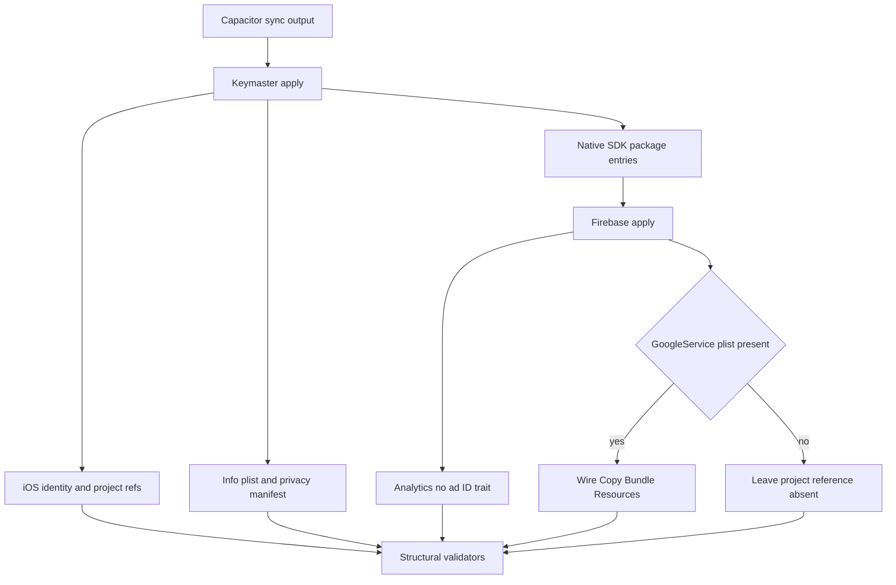
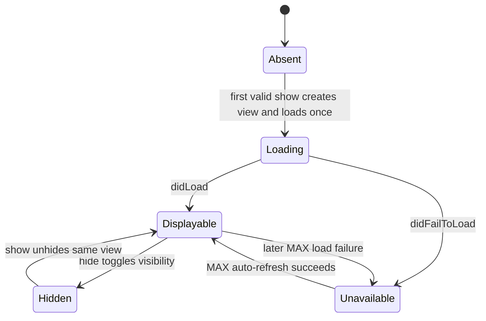

# Find the Dog iOS Native Shell - Plan

## Goal Capsule

- **Objective:** Author a production iOS Capacitor shell for `games/find_the_dog` that preserves the v1 Keymaster identity and native integrations while matching v2's current plugin contracts.
- **Authority:** The Trello card and current v2 TypeScript contracts override the v1 reference; the v2 lockfile selects the Capacitor version; official SDK documentation resolves external API assumptions.
- **Execution profile:** Author files and Node-based validators only. Do not run Capacitor sync, Xcode, signing, keychain, simulator, or device operations in the worker sandbox.
- **Stop conditions:** Apart from this required TWF plan artifact, do not edit `games/find_the_dog/package.json`, `games/find_the_dog/src/**`, or any file outside `games/find_the_dog/ios/**` and `games/find_the_dog/tools/**`. Do not commit secrets or a real `GoogleService-Info.plist`.
- **Tail ownership:** The worker proves deterministic structure and idempotence with Node. The conductor owns Capacitor regeneration, Swift package resolution, Xcode build, signing, and first real-iPhone verification.
- **Landing strategy:** Keep all authored changes on the TWF card branch for conductor landing; open no pull request from the worker.

---

## Product Contract

### Summary

`games/find_the_dog` gains the committed native project, Swift bridges, privacy metadata, and repeatable post-sync tools needed to build the v2 game as the existing App Store iOS identity.
The port keeps the v1 native behavior except where the card or current v2 TypeScript contract explicitly replaces it.

### Problem Frame

The v2 game has web-side ads, attribution, Firebase, and Capacitor contracts but no iOS project or sync patchers.
A raw Capacitor-generated project would lose the App Store identity, native plugin registration, privacy declarations, SDK package wiring, and Xcode resource references on regeneration.
Blindly copying v1 is also unsafe because v1's banner is destroyed on hide, its package manifest carries obsolete or out-of-scope local plugins, and its working copy currently contains uncommitted package-resolution changes.

### Requirements

#### Native runtime and bridge

- R1. The iOS app must use bundle identifier `com.baseardahan.hiddenobj`, display name `Find the Dog`, phone-only portrait orientation, and iOS 15 minimum deployment while the Capacitor app ID remains `com.basegamelab.find_the_dog.dev`.
- R2. `AppDelegate.swift` must configure `AVAudioSession` as playback with `mixWithOthers` before the web game starts.
- R3. `FindTheDogBridgeViewController` must register the AppLovin and Adjust plugin instances from `capacitorDidLoad` and preserve v2's `contentInsetAdjustmentBehavior = .never` viewport contract.
- R4. The AppLovin bridge must implement initialize, banner, interstitial/rewarded preload and show, privacy-options, consent-flow, general-audience, reward, and ad-revenue contracts exposed by v2.
- R5. The Adjust bridge must initialize without IDFA or automatic ATT usage, track only configured event tokens, accept only per-event allowlisted callback parameters, and report status.

#### Persistent banner behavior

- R6. The first valid banner show must create one `MAAdView`; all later shows must reuse that instance and must never replace it because of hide, no-fill, or repeated level entry.
- R7. Hiding a banner must only hide the existing view, and MAX auto-refresh must own reload behavior after the initial load.
- R8. Banner show must return `shown: false` whenever the persistent view is not currently displayable and `shown: true` when the existing banner is displayable or already visible.

#### Packaging, identity, and privacy

- R9. `CapApp-SPM/Package.swift` must use Swift tools 6.1, iOS 15, Capacitor Swift PM exact `8.4.1`, the four card-approved local packages, Firebase's `AnalyticsWithoutAdIdSupport` trait, and the pinned AppLovin, UMP, and Adjust minimum versions.
- R10. `Info.plist` must contain the tracking usage description, export-compliance false, Google Analytics IDFV collection false, portrait-only declarations, and exactly the same 152 unique SKAdNetwork entries as the copied JSON catalog with no extras.
- R11. `PrivacyInfo.xcprivacy` must preserve v1's required-reason API declarations and receive the tracking data/domains declaration through the Keymaster patch path.
- R12. Xcode project state must include both native plugin Swift files, the bridge controller, the privacy manifest, required weak-linked Adjust frameworks, storyboard controller assignment, and applicable build settings exactly once without a hardcoded development team.

#### Repeatable tooling and verification

- R13. Keymaster and Firebase apply tools must be idempotent, fail closed on malformed or partial project state, and produce no diff on an immediate second run.
- R14. The Firebase tool must add the analytics trait and plist privacy keys regardless of secret availability, wire `GoogleService-Info.plist` only when present, tolerate its gitignored absence in explicit allow-missing verification mode, and validate v2's Android identity when an Android config is present.
- R15. A Node structural validator must prove the exact `Package.swift` dependency/product set and versions, the native source shapes, split identity, privacy keys, project references, and SKAdNetwork count.
- R16. No source, package manifest, secret, generated build product, or user-specific Xcode state outside the card's scope may enter the diff.

### Acceptance Examples

- AE1. Given a freshly authored native project, when Keymaster and Firebase apply once and then run again without intervening changes, the second run leaves every tracked target byte-identical.
- AE2. Given no `GoogleService-Info.plist`, when Firebase verification runs with `--allow-missing`, it exits successfully while still validating all committed Firebase-related structure.
- AE3. Given a banner that loaded and was hidden, when the web layer calls show again, the same `MAAdView` is unhidden and no new load or view construction occurs.
- AE4. Given a banner view that exists but has not produced a displayable ad, when show resolves, it returns `shown: false` without destroying or replacing the view.
- AE5. Given the copied AppLovin catalog, when Keymaster injects `SKAdNetworkItems`, the validator observes 152 unique identifiers and no hand-maintained plist list.
- AE6. Given a real Firebase plist is absent from the repository, when the conductor later places it locally and reapplies Firebase wiring, the plist is added to the App target's Copy Bundle Resources exactly once without becoming tracked.

### Scope Boundaries

#### In scope

- The tracked v1 native project topology needed by the card: Xcode project/workspace metadata, app resources and storyboards, Swift sources, plist/privacy files, CapApp-SPM source wrapper, and debug configuration.
- The seven selected Node/JSON tool artifacts plus focused Node tests under `games/find_the_dog/tools/**`.

#### Outside this card

- npm package dependency changes, npm scripts, web TypeScript changes, Android file/runtime changes, credentials, Firebase console actions, Xcode signing, and real-device validation. Read-only validation of a present Android Firebase config remains in scope.
- AppLovin or Adjust product-policy changes beyond the current v2 web contracts.
- Updating the 152-entry vendor catalog from the network; this card ports the v1 catalog exactly.

### Success Criteria

- The required Node validators terminate successfully in the author sandbox.
- Each apply tool's second execution produces no tracked or untracked content change within the target tree.
- The structural validator rejects any missing, duplicate, extra, or wrong-version `Package.swift` entry and asserts 152 unique SKAdNetwork identifiers.
- The resulting diff contains only approved iOS/tool files and no token material, Firebase plist, build output, or unrelated source/package changes.

---

## Planning Contract

### Key Technical Decisions

- KTD1. **Port topology, not v1 package state.** Copy the tracked v1 native shell as the structural baseline, then rewrite the package manifest from the card's allowlist. Do not treat the dirty v1 `Package.swift` or `Package.resolved` as version authority.
- KTD2. **Match the installed Capacitor graph.** Pin `capacitor-swift-pm` exactly to `8.4.1`, which is the current lockfile resolution for v2's `@capacitor/core` range. Reject v1's `8.3.1` pin.
- KTD3. **Model the banner as one persistent lifecycle.** Keep one plugin-owned `MAAdView`, one ad-unit identity, requested-visibility state, and displayability state. Initial creation performs the only explicit load; hide resolves any pending first-show false and toggles visibility; load callbacks update displayability without forcing visibility; an incompatible later ad-unit request fails closed rather than recreating the view.
- KTD4. **Keep patching deterministic and validator-backed.** Reuse v1's pure string transforms and stable PBX object IDs, but make every transform recognize already-correct state, reject partial state, and share canonical expectations where practical so apply and validate cannot drift. Replace the managed SKAd block with the catalog set rather than merging pre-existing IDs.
- KTD5. **Make missing Firebase config an explicit mode.** A present plist is always identity-checked and wired. `--allow-missing` permits absent default files because they are owner-fetched and gitignored; it never excuses an explicitly named missing path or suppress validation of committed package, plist, or project structure. Update the v1 Android expectation to v2's `com.basegamelab.find_the_dog.dev`.
- KTD6. **Track the intentional native exception narrowly.** The root ignore rule covers `games/*/ios/`, so completion requires an explicit diff audit that the intended shell files are present while generated caches, build outputs, user state, and secrets remain absent.
- KTD7. **Separate author proof from runtime proof.** Node checks prove structure and repeatability. Only the conductor's Xcode and real-iPhone run can prove Swift compilation, SDK linkage, consent UI, revenue callbacks, persistent banner behavior, and app lifecycle.
- KTD8. **Treat the requested paths as an explicit card-level policy exception.** Current v2 guidance says generated `ios/` shells are never committed and `tools/audit/src/structure.js` redirects game-local `tools/` to repo tooling. The card nevertheless requires both paths and forbids the out-of-scope policy changes that would reconcile them, so implementation follows the card while landing remains gated on the conductor's explicit handling of the audit conflict.

### High-Level Technical Design





### Output Structure

```text
games/find_the_dog/
├── ios/
│   ├── .gitignore
│   ├── debug.xcconfig
│   └── App/
│       ├── App.xcodeproj/
│       ├── App/
│       │   ├── AppDelegate.swift
│       │   ├── FindTheDogBridgeViewController.swift
│       │   ├── AppLovinMaxPlugin.swift
│       │   ├── AdjustAttributionPlugin.swift
│       │   ├── Info.plist
│       │   ├── PrivacyInfo.xcprivacy
│       │   ├── Base.lproj/
│       │   └── Assets.xcassets/
│       └── CapApp-SPM/
└── tools/
    ├── applovin-skadnetwork-ids.json
    ├── ios-native-patches.mjs
    ├── apply-ios-keymaster-identity.mjs
    ├── validate-ios-keymaster-identity.mjs
    ├── apply-ios-firebase.mjs
    ├── verify-firebase-native-config.mjs
    ├── load-game-env.mjs
    └── __tests__/
```

### Sequencing

U1 establishes the native project and exact package graph.
U2 and U3 then add the independent Adjust/audio and AppLovin bridge behaviors.
U4 makes the authored state reproducible after Capacitor regeneration.
U5 locks the whole contract with structural and idempotence checks before conductor handoff.

### Assumptions

- FTD-PARITY-1 supplies the local npm packages referenced by `Package.swift`; this card authors their paths without editing npm manifests.
- `package-lock.json` resolution `8.4.1` is the intended meaning of matching v2's Capacitor core version.
- The AppLovin ad-unit ID is stable during one plugin lifetime; a different later ID is configuration drift and should return `shown: false`.
- The worker does not copy `Package.resolved`; the conductor generates a fresh resolution from the authored manifest during the first Xcode/SPM run.

### Source Adoption Matrix

**Reference repo:** `fabrika`; v1 paths in this table are relative to that read-only sibling repository.

| v1 source | Decision for v2 |
|---|---|
| `games/find_the_dog/ios/App/App/AppDelegate.swift` | Take the audio-session behavior and Capacitor delegate forwarding. |
| `games/find_the_dog/ios/App/App/FindTheDogBridgeViewController.swift` | Take plugin registration unchanged in responsibility. |
| `games/find_the_dog/ios/App/App/AppLovinMaxPlugin.swift` | Take initialization, consent, fullscreen, reward, privacy-options, and revenue shapes; replace banner create/destroy behavior with the persistent lifecycle. |
| `games/find_the_dog/ios/App/App/AdjustAttributionPlugin.swift` | Take the validated privacy gates, event-token map, callback allowlists, redaction, and main-thread dispatch. |
| `games/find_the_dog/ios/App/CapApp-SPM/Package.swift` | Take the manifest topology; reject v1's Capacitor pin and extra AdMob/filesystem/preferences/share packages; apply the card's exact allowlist and Firebase trait. |
| `games/find_the_dog/ios/App/App.xcodeproj/project.xcworkspace/xcshareddata/swiftpm/Package.resolved` | Do not use as dependency authority because the reference checkout is dirty and resolution is conductor-owned. |
| `games/find_the_dog/tools/ios-native-patches.mjs` and apply/validate tools | Take idempotent transforms, stable PBX IDs, privacy injection, split identity, and secret scanning; adapt paths, package expectations, missing-config CLI, and banner source-shape validation. |
| `games/find_the_dog/tools/load-game-env.mjs` | Take as a required verifier support module so project identity still resolves from gitignored Vite env files without embedding secrets. |
| `games/find_the_dog/tools/applovin-skadnetwork-ids.json` | Copy exactly and validate 152 unique entries before plist injection. |

---

## Implementation Units

### U1. Author the native shell and exact Swift package graph

- **Goal:** Establish the tracked iOS project topology, identity-ready Xcode state, resources, plist baselines, and exact v2 package manifest.
- **Requirements:** R1, R9, R10, R11, R12, R16
- **Dependencies:** None
- **Files:** `games/find_the_dog/ios/**`; structural coverage in `games/find_the_dog/tools/validate-ios-keymaster-identity.mjs` and `games/find_the_dog/tools/__tests__/ios-native-patches.test.mjs`
- **Approach:** Start from v1's tracked native file set, retain app assets/storyboards/project scaffolding, strip the v1 signing team, and replace package declarations with the card allowlist. Keep Swift tools 6.1, iOS 15, Capacitor 8.4.1, Firebase trait, RevenueCat, AppLovin 13.6.2, UMP 3.1.0, and Adjust 5.6.2. Treat generated resolution/user/build state as non-authoritative, keep real Firebase config absent, and ensure the tracked native-file inventory matches the Output Structure despite the root ignore rule.
- **Execution note:** This is packaging/configuration work; prioritize structural validation and conductor-owned resolution/build proof over speculative unit behavior.
- **Patterns to follow:** v1 Xcode topology and current `package-lock.json` Capacitor resolution.
- **Test scenarios:**
  - The structural validator accepts the exact required local and remote dependency/product set.
  - Wrong tools version, platform version, Capacitor pin, SDK minimum, missing product, duplicate entry, or v1-only extra package causes a targeted failure.
  - A copied hardcoded `DEVELOPMENT_TEAM` or v1 AdMob package/config artifact causes a targeted failure.
  - The committed tree contains required app resources but no copied `Package.resolved`, `GoogleService-Info.plist`, build output, user data, or unrelated platform files.
- **Verification:** The validator reports one complete package graph and the tracked-file inventory proves the intentional ignored iOS files are present without generated or secret material.

### U2. Port app lifecycle, bridge registration, and Adjust attribution

- **Goal:** Restore native game audio and a privacy-bounded Adjust bridge registered through the Capacitor controller.
- **Requirements:** R2, R3, R5, R12
- **Dependencies:** U1
- **Files:** `games/find_the_dog/ios/App/App/AppDelegate.swift`, `games/find_the_dog/ios/App/App/FindTheDogBridgeViewController.swift`, `games/find_the_dog/ios/App/App/AdjustAttributionPlugin.swift`, `games/find_the_dog/ios/App/App.xcodeproj/project.pbxproj`, `games/find_the_dog/ios/App/App/Base.lproj/Main.storyboard`, `games/find_the_dog/tools/validate-ios-keymaster-identity.mjs`, `games/find_the_dog/tools/__tests__/ios-native-patches.test.mjs`
- **Approach:** Preserve v1's AVAudioSession patch, Capacitor URL/activity forwarding, main-thread plugin operations, environment validation, token redaction, event-token compaction, callback parameter allowlists, 96-character cap, and disabled IDFA/automatic ATT usage. Register both native plugins in the custom bridge controller, pin the bridge web view to no automatic inset adjustment, and ensure storyboard/project references resolve to it exactly once.
- **Patterns to follow:** v1 `AppDelegate.swift`, `FindTheDogBridgeViewController.swift`, `AdjustAttributionPlugin.swift`, and validator source-shape guards.
- **Test scenarios:**
  - Missing or invalid app token/environment resolves initialization false without SDK startup.
  - A configured allowlisted event forwards only allowed string callback parameters and caps their values.
  - Unknown event names, missing tokens, disallowed keys, and non-string callback values do not cross the native boundary.
  - Structural checks fail if IDFA/ATT disabling, framework references, plugin registration, viewport inset pinning, or storyboard class assignment disappears.
- **Verification:** Node source/project checks prove the bridge contract; conductor Xcode/device verification remains an explicit release gate.

### U3. Port AppLovin with a persistent banner lifecycle

- **Goal:** Implement the complete MAX bridge while replacing v1's destructive banner behavior with v2's one-view contract.
- **Requirements:** R4, R6, R7, R8
- **Dependencies:** U1
- **Files:** `games/find_the_dog/ios/App/App/AppLovinMaxPlugin.swift`, `games/find_the_dog/tools/validate-ios-keymaster-identity.mjs`, `games/find_the_dog/tools/__tests__/ios-native-patches.test.mjs`
- **Approach:** Port v1 initialization coalescing, general-audience gate, consent/privacy setup, fullscreen behavior, reward granting, privacy-options UI, revenue listener payload, logging, and main-thread dispatch without unrelated policy changes. Replace only the banner's `destroyBanner` paths with a persistent view whose initial show creates and loads once; hide changes visibility only; show reuses/unhides; callbacks maintain displayability; MAX auto-refresh handles later loads.
- **Patterns to follow:** `games/find_the_dog/src/ads/AppLovinMaxPlugin.ts`, `games/find_the_dog/src/ads/AppLovinMaxProvider.ts`, and v1 `AppLovinMaxPlugin.swift` excluding its banner destroy/recreate paths.
- **Test scenarios:**
  - Covers AE3. Show after hide reuses the same view, issues no second explicit load, and returns true when the cached banner is displayable.
  - Covers AE4. The first construction keeps one show call pending until `didLoad`, `didFailToLoad`, or hide; it resolves true only when loaded and requested-visible, and false on failure/hide. A later show while the retained view is unavailable resolves false immediately without another load.
  - Hide during the first load resolves the pending show false, leaves the view hidden, and lets a later load callback update displayability without revealing it.
  - Repeated show while already visible returns true without mutating the view hierarchy.
  - A changed ad-unit ID fails closed without constructing a replacement.
  - General-audience false, invalid consent URLs under the existing v1 rules, uninitialized fullscreen calls, failed loads/displays, and reward callbacks preserve the v1 result behavior without leaking pending calls.
  - Revenue callbacks emit the v2 `adRevenuePaid` fields and redact configuration material in logs.
- **Verification:** Node source-shape checks prohibit banner removal/destruction and repeated load patterns; conductor device proof must observe one banner instance across show/hide/show and MAX callbacks.

### U4. Port deterministic Keymaster and Firebase apply tools

- **Goal:** Make the committed native contract reproducible after every Capacitor sync without hand-editing plist arrays or Xcode project sections.
- **Requirements:** R1, R9, R10, R11, R12, R13, R14
- **Dependencies:** U1, U2, U3
- **Files:** `games/find_the_dog/tools/ios-native-patches.mjs`, `games/find_the_dog/tools/apply-ios-keymaster-identity.mjs`, `games/find_the_dog/tools/apply-ios-firebase.mjs`, `games/find_the_dog/tools/applovin-skadnetwork-ids.json`, `games/find_the_dog/ios/App/App/Info.plist`, `games/find_the_dog/ios/App/App/PrivacyInfo.xcprivacy`, `games/find_the_dog/ios/App/App/Base.lproj/Main.storyboard`, `games/find_the_dog/ios/App/App.xcodeproj/project.pbxproj`, `games/find_the_dog/ios/App/CapApp-SPM/Package.swift`
- **Approach:** Adapt v1 tool roots to the v2 game, preserve stable PBX insertion IDs and fail-closed anchors, and centralize identity/package/privacy expectations where it reduces apply/validate drift. Keymaster stamps the split iOS identity, project references, storyboard, package additions, privacy manifest, orientation, and 152-item SKAd block. Firebase enforces Swift 6.1 and the analytics trait, applies both false plist keys, and conditionally wires the local Firebase plist.
- **Patterns to follow:** v1 apply tools and `docs/solutions/architecture-patterns/data-first-semantic-contract-and-immutable-projections.md` for canonical data and atomic selection.
- **Test scenarios:**
  - Covers AE1. Each transform applied twice returns the exact first-pass bytes on the second pass.
  - Covers AE5. The JSON catalog has 152 unique well-formed IDs and injection replaces the whole managed SKAd block; the plist set equals the JSON set with no extras or duplicates.
  - Partial PBX Firebase wiring, missing anchors, duplicate object IDs, malformed plist/package content, or unsupported Swift tools version fails before further mutation.
  - Covers AE6. Missing Firebase plist skips resource wiring; a present plist adds all four PBX references exactly once.
  - Existing correct plist keys are preserved and incorrect boolean values are normalized.
- **Verification:** Focused Node tests compare first and second outputs byte-for-byte and exercise malformed/partial fixtures without requiring Xcode.

### U5. Harden validators and produce the author-to-conductor handoff

- **Goal:** Prove every author-verifiable acceptance condition and leave exact unresolved runtime gates for the conductor.
- **Requirements:** R9, R10, R12, R13, R14, R15, R16
- **Dependencies:** U1, U2, U3, U4
- **Files:** `games/find_the_dog/tools/validate-ios-keymaster-identity.mjs`, `games/find_the_dog/tools/verify-firebase-native-config.mjs`, `games/find_the_dog/tools/load-game-env.mjs`, `games/find_the_dog/tools/__tests__/ios-native-patches.test.mjs`
- **Approach:** Extend the Keymaster validator into the single structural gate for exact package graph, native sources, Xcode refs/settings, split identity, privacy manifest, plist flags, secret hygiene, persistent-banner source shape, and 152 SKAd entries. Port the verifier's env loader as a support module, add explicit `--allow-missing` handling, and preserve identity/project checks for any present config. Run syntax checks, required validators, the focused Node tests, apply-twice hash comparisons, and scope/secret audits before handoff.
- **Patterns to follow:** v1 validator diagnostics and current card acceptance command shape.
- **Test scenarios:**
  - Exact authored project passes the Keymaster validator with a 152-count success message.
  - Covers AE2. Both default Firebase config files absent plus `--allow-missing` passes with a clear note; any explicit missing path or present mismatched iOS/Android config still fails.
  - Missing package entries, extras, wrong versions, duplicated SKAd IDs, destructive banner snippets, missing Adjust privacy calls, or committed token material each fail with a specific diagnostic.
  - Running both apply tools a second time leaves the worktree unchanged.
- **Verification:** The card's terminating validator command exits zero, focused Node tests pass, and a final path audit confirms zero `src/**` or package manifest changes.

---

## System-Wide Impact

- **Web/native boundary:** Swift methods and listener payloads must remain byte-for-shape compatible with the existing TypeScript interfaces because `src/**` is frozen on this card.
- **Regeneration boundary:** Capacitor sync may overwrite package/project state, so Keymaster must run before Firebase; Firebase anchors its optional plist resource entries to privacy-manifest project references restored by Keymaster.
- **Identity boundary:** Capacitor and Android retain `com.basegamelab.find_the_dog.dev`, while only iOS project settings and Firebase iOS config use `com.baseardahan.hiddenobj`.
- **Privacy boundary:** AppLovin consent configuration, Adjust IDFA/ATT disabling, Firebase no-ad-ID trait, plist declarations, and the privacy manifest must agree; a green validator cannot substitute for App Store policy review or device observation.
- **Repository-policy boundary:** `games/find_the_dog/ios/` and `games/find_the_dog/tools/` are card-mandated exceptions to current native-resource and structure-audit guidance. This card cannot make the repository-wide policy internally consistent without leaving its scope.
- **Failure propagation:** Patchers fail on partial/unknown state instead of guessing. The conductor must treat such a failure as native-template drift requiring inspection, not bypass the validator.

---

## Verification Contract

| Gate | Owner | Command or observation | Done signal |
|---|---|---|---|
| Focused structural/idempotence tests | Worker | `node --test games/find_the_dog/tools/__tests__/ios-native-patches.test.mjs` | Exact package, patch, malformed-state, and persistent-banner guards pass. |
| Required author validators | Worker | `node games/find_the_dog/tools/validate-ios-keymaster-identity.mjs && node games/find_the_dog/tools/verify-firebase-native-config.mjs --allow-missing` | Terminates zero; Keymaster reports 152 SKAd IDs and Firebase reports allowed absence or valid present config. |
| Apply idempotence | Worker | Run Keymaster and Firebase apply tools twice against the authored project and compare the target tree before and after the second pass. | Second pass produces no file-content diff. |
| Scope and secret audit | Worker | Inspect the branch diff and tracked file list. | Only `games/find_the_dog/ios/**`, `games/find_the_dog/tools/**`, and this plan are changed; no package/src edits, Firebase plist, token material, build output, or user state. |
| Known repository audit conflict | Conductor | Run the repository audit with the branch files present and inspect the `games/find_the_dog/tools/` structure finding. | Landing has a durable policy-owner decision: a documented waiver or linked follow-up card with owner and acceptance criteria. |
| Native build and package resolution | Conductor | Run the repository-approved Capacitor/Xcode build path after landing dependencies. | SPM resolves, Swift compiles, app signs, installs, and launches under `com.baseardahan.hiddenobj`. |
| Third-party resolution review | Conductor | Inspect the fresh Swift package resolution before build/device testing. | Resolved package identities and versions satisfy the authored allowlist; unexpected SDK graph changes block the build for review. |
| Privacy reconciliation | Conductor | Compare resolved SDK privacy manifests and enabled data paths with `PrivacyInfo.xcprivacy`, `Info.plist`, and App Store disclosures. | V1 metadata is confirmed or corrected as a seed; structural presence alone is not accepted as privacy proof. |
| Real-device integration | Conductor | Observe fresh launch, consent/privacy options, Adjust initialization/event path, fullscreen/reward callbacks, revenue listener, and banner show/hide/show on the physical iPhone. | The same banner view persists across hide/show, app audio plays under the silent-switch policy, and no plugin/runtime error appears. |
| Initial no-fill recovery | Conductor | Exercise or instrument an initial banner load failure followed by MAX-driven recovery. | The retained view becomes displayable without a second explicit plugin load or view construction. |

Browser Playwright and simulator output are not substitutes for the conductor's real-device gate.

---

## Risks and Dependencies

- **Upstream npm dependency timing:** FTD-PARITY-1 may not be present at the worker baseline. Author the declared local SPM paths as specified and defer resolution to the conductor after dependency landing.
- **Ignored native tree:** Root `.gitignore` excludes `games/*/ios/`. A normal status view can hide missing deliverables, so the final tracked-file audit is load-bearing.
- **Card versus repository structure policy:** `games/find_the_dog/native-resources/README.md` forbids committed generated native shells, and `tools/audit/src/structure.js` rejects game-local `tools/`. The card explicitly requires both paths and forbids the out-of-scope policy changes needed to reconcile them; landing requires a durable repository-policy-owner waiver or a linked follow-up card with an owner and acceptance criteria.
- **V1-only native residue:** The v1 project includes Community AdMob package/config behavior and a hardcoded development team. Both must be removed because the card's package allowlist excludes AdMob and signing belongs to the conductor.
- **Dirty v1 package reference:** The v1 checkout has local `Package.swift` and `Package.resolved` changes. Use its committed topology and the card's versions, not its current resolution state.
- **Swift-only behavior cannot be executed here:** Source-shape validation can miss API or lifecycle errors. Xcode compilation and device observation remain release gates, not implied by Node success.
- **Vendor behavior:** AppLovin documents automatic banner refresh and minimal/reused view instances; Adjust requires ATT-use configuration before SDK initialization. The native implementation must preserve these ordering constraints.
- **Project-file mutation:** PBX IDs or anchors can collide or drift after future Capacitor regeneration. Apply tools must fail loudly on partial/unrecognized state rather than creating a second reference set.

---

## Sources and Research

- Current v2 contracts: `games/find_the_dog/src/ads/AppLovinMaxPlugin.ts`, `games/find_the_dog/src/ads/AppLovinMaxProvider.ts`, `games/find_the_dog/src/ads/AppLovinConfig.ts`, `games/find_the_dog/capacitor.config.ts`, `games/find_the_dog/package.json`, and `package-lock.json`.
- Read-only reference repo `fabrika`: `games/find_the_dog/ios/**` and the selected `games/find_the_dog/tools/**` files listed in the Source Adoption Matrix.
- Institutional guidance: `docs/solutions/architecture-patterns/data-first-semantic-contract-and-immutable-projections.md` and `docs/solutions/2026-07-09-cameleon-device-and-canvas-lessons.md`.
- AppLovin MAX iOS banner guidance: <https://developers.applovin.com/en/max/ios/ad-formats/banner-and-mrec-ads/>.
- Adjust iOS ATT configuration: <https://dev.adjust.com/en/sdk/ios/features/att/>.
- Swift Package Manager traits: <https://docs.swift.org/swiftpm/documentation/packagemanagerdocs/packagetraits/>.
- Native viewport and structure policy: `games/find_the_dog/native-resources/README.md` and `tools/audit/src/structure.js`.

---

## Definition of Done

- U1-U5 satisfy every linked requirement and acceptance example without edits to `games/find_the_dog/package.json` or `games/find_the_dog/src/**`.
- The committed iOS shell contains the required native project/resources but excludes secrets, generated build output, user-specific Xcode state, and abandoned experimental files.
- The custom bridge preserves the no-automatic-inset viewport contract, and the copied project contains neither v1's AdMob fallback nor a hardcoded signing team.
- The branch records the card-level native-shell and game-tools policy exception; repository audit friction is surfaced to the conductor rather than described as green.
- AppLovin owns one persistent `MAAdView`; hide never destroys it; repeated show never reloads it; `shown` reflects current displayability.
- Adjust remains IDFA/automatic-ATT disabled and forwards only configured, allowlisted event data.
- Package.swift contains only the card-approved local packages and remote SDKs at the specified versions, with Capacitor 8.4.1 and Firebase's no-ad-ID trait.
- `Info.plist` and `PrivacyInfo.xcprivacy` validate, and `SKAdNetworkItems` contains exactly 152 unique catalog entries.
- Both apply tools are idempotent, the required author validators terminate successfully, and their focused failure-path tests pass.
- The handoff names the exact proposed `ios:sync` script but does not edit package manifests.
- The structured handoff cites the absolute v1 source paths taken/adapted and the v1 artifacts or behaviors explicitly rejected.
- The conductor receives explicit Xcode, signing, and real-device gates; the worker does not claim those behaviors verified.
