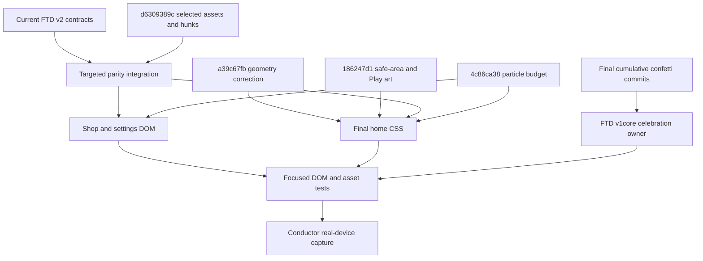
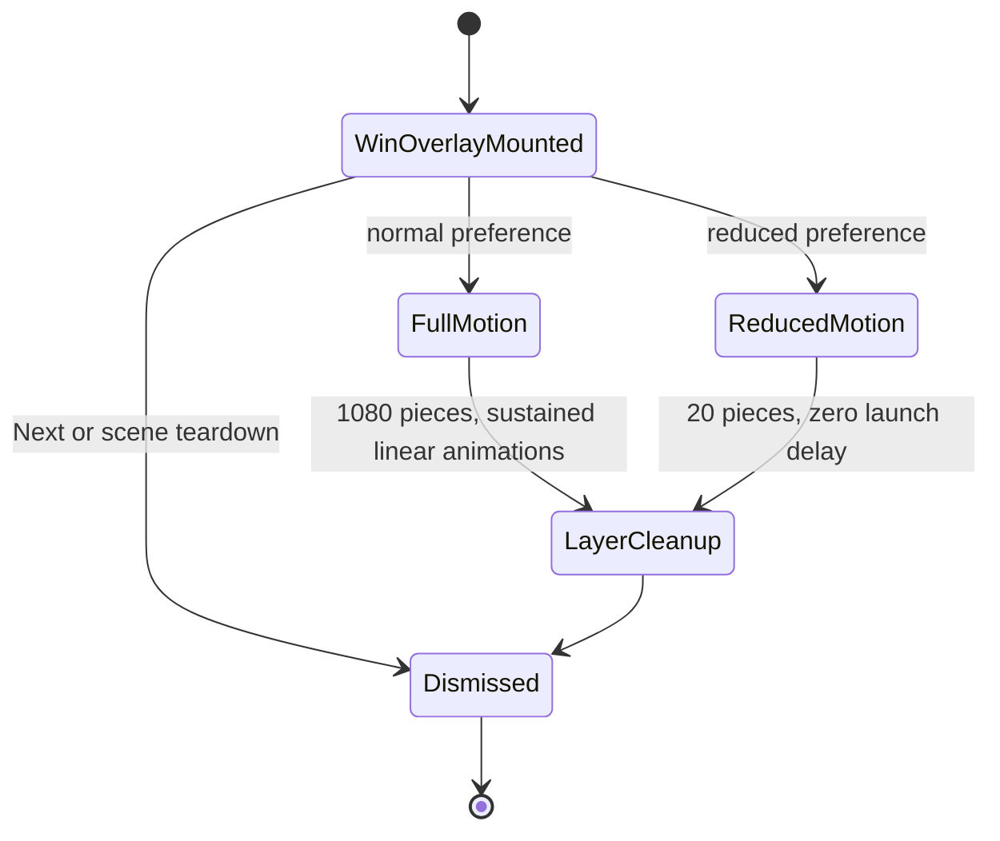

# Find The Dog Shop Home and Confetti Parity - Plan

## Goal Capsule

- **Objective:** Bring `games/find_the_dog` shop, settings, home, and win-confetti presentation to the selected v1 and `shell_template` references without regressing v2 analytics, IAP, privacy, progression, or scene-lifecycle behavior.
- **Authority hierarchy:** This Trello card defines scope; current v2 behavior and `FIXES.md` define contracts that must survive; v1 commit `d6309389c` supplies selected shop/home art and polish; `shell_template` commits `a39c67fb` and `186247d1` supersede earlier home geometry; the confetti chain `febc62b8` → `eb8a6690` → `523206b0` → `daf9928c` → cumulative tip `660043c4` defines the final celebration; `4c86ca38` limits non-celebration particles.
- **Execution profile:** Deep, device-sensitive visual port. Use source-diff extraction and focused regression coverage before any phone capture.
- **Stop conditions:** Do not edit `package.json`, `ios/**`, `src/sdk/**`, shared packages, analytics emitters, purchase fulfillment semantics, or unrelated presentation. Do not regenerate binary assets. Do not open a pull request; the TWF conductor lands the branch.
- **Tail ownership:** The implementation worker owns code health and the requested diagnostic web smoke. The conductor owns real-device WKWebView capture and final visual/performance acceptance.

---

## Product Contract

### Summary

Port the selected shipped FTD assets and polish into the current v2 surfaces, then apply the later `shell_template` layout and confetti corrections as the final authority. Preserve the current game’s behavior and analytics while changing presentation, the explicitly required Settings Home action, and the purchase interaction safeguards that isolate the pending button and prevent native-operation re-entry.

### Problem Frame

The v2 game already contains part of the earlier home polish, but its shop still uses text badges, old art, and a global purchase-busy treatment; its balance pills and bottom safe-area band retain pre-fix geometry; and a win currently triggers both a Phaser rectangle burst and the overlay's bitmap-sheet confetti. A wholesale v1 copy would overwrite analytics and privacy work that landed later, while a wholesale `styles.css` replacement would discard current v2 rules. The implementation must therefore be a provenance-aware visual port rather than a file transplant.

### Requirements

#### Asset parity

- R1. Copy exactly the fifteen card-listed public assets from the `d6309389c` v1 state into the matching `games/find_the_dog/public/ui/**` paths, byte-for-byte and without regeneration.
- R2. The VIP card must render `shop_no_ads_premium.png`; Best Value and Popular badges must render the selected image assets; the settings Home row must render `settings_icon_home.png`; and icon preloading must include that PNG.

#### Shop and settings behavior

- R3. The shop badge policy must follow the exhaustive Shop Badge Matrix below: Best Value on `no-ads-premium`, `hint-pack-50`, and `coin-pack-100000`; Popular on `hint-pack-25` and `coin-pack-5000`; no shop image badge on every other catalog product. Coin-tier emphasis is keyed by stable catalog id.
- R4. During a native purchase, only the tapped product button may show the pressed greyscale busy treatment; its price text and width remain stable, every other product keeps its price and visual state, and a synchronous `nativeOperationInProgress` guard prevents a second purchase.
- R5. Existing `productTapped`, `purchaseInitiated`, `purchaseCancelled`, `purchaseFailed`, `purchaseFulfilled`, unfulfilled-purchase reporting, restore-retry, and IAP state/sheet analytics must remain present and ordered around the current purchase flow.
- R6. Settings must add a full-row Home action that closes the page and invokes the currently active scene-specific Home callback, while retaining the v2 privacy-choices row, legal links, settings analytics, and the existing Restore Purchases placement. Callback replacement/clearing must prevent a destroyed scene from being controlled later.

#### Home presentation

- R7. Home must retain one prominent Play Now CTA for the current level, the label-free No Ads rail action, the 78px Play magnifier, current-level positioning, idle pulse, entry-scatter participation, and one slow reduced-motion-aware sparkle on each locked saga tile.
- R8. The final home geometry must use content-hugging coin and hint pills with a 96x42 minimum and readable intrinsic balance text (remove the current 4ch clipping, with only a viewport-safe maximum), Play CTA margins of `-40px auto 26px`, 40px map bottom padding, restored nav-cell spacing, a safe-area-free nav container, and per-button bottom padding that extends each button’s own background into 55% of the bottom inset plus 4px.
- R9. Play Now must use the dedicated glossy `play-level-button-runtime.png` presentation from `186247d1`, not the earlier shop-price green pill from `d6309389c`.

#### Celebration presentation

- R10. Replace both current FTD celebration effects—the Phaser rectangle burst and the overlay bitmap sheets—with one individual-DOM-piece layer following randomized quadratic left/right cannon and top-rain paths, randomized 6–14px by 8–18px sizes, normalized random-axis 3D tumble, and 22 sampled path intervals that produce 23 keyframes with global linear WAAPI easing.
- R11. Full motion must emit 1080 pieces over a 1920ms launch window with a 3040ms base duration and self-cleanup after the longest allowed animation; reduced motion must use the reference’s 20-piece, zero-delay, 900ms treatment.
- R12. Confetti must remain purely presentational around the existing win overlay: it must not alter Active Attempt identity, Durable Progression, reward grants, result actions, analytics, fail/retry/home behavior, or teardown semantics.
- R13. Outside the intentional win celebration, decorative particles must follow `4c86ca38`: one ambient sparkle per locked tile and at most one or two large accents per decorated badge/card surface, with no new tiny-particle clusters.

#### Verification and provenance

- R14. Focused unit coverage must pin asset identity, shop badge/icon selection, purchase-busy isolation and concurrency, settings Home navigation, final home CSS values, confetti motion parameters, reduced motion, and teardown.
- R15. A phone-sized web smoke may prove DOM/selector/asset wiring, but safe-area ownership, animation feel, and confetti performance remain unverified until the conductor captures them in the real mobile WebView.
- R16. The implementation handoff must attribute every adopted hunk to `d6309389c`, `a39c67fb`, `186247d1`, or the named confetti commits, and must name every consciously skipped source hunk with its reason.

### Acceptance Examples

- AE1. Given the shop catalog is ready, when the shop opens, then `hint-pack-50` shows the mint/rose Best Value ticket, `coin-pack-5000` shows the gold Popular tab, and the VIP card uses `shop_no_ads_premium.png`.
- AE2. Given product A is tapped and the native purchase is pending, when shop controls refresh, then A retains its price and width with the busy class, products B–N retain their prices without the busy class, and another tap cannot call the purchase provider.
- AE3. Given Settings is opened over gameplay, when Home is tapped, then the settings page closes and the registered `GameScene` callback starts `HomeScene`; privacy choices, toggle analytics, and legal links remain wired.
- AE4. Given a device with a non-zero bottom safe-area inset, when Home renders, then the nav container contributes no flat bottom band and each of the three nav cells extends its own background into the inset.
- AE5. Given full motion and a win, when the celebration mounts, then 1080 pieces receive linear per-piece animations across the sustained window and the layer later removes itself; given reduced motion, only 20 zero-delay pieces use the shortened timing.
- AE6. Given a replayed completed level, a fail, Retry, or Home navigation, when the result flow runs, then no extra progression/reward/analytics mutation is caused by confetti and no stale animation survives overlay dismissal.
- AE7. Given the branch diff, when the copied assets are hashed, then every destination hash matches the Source Asset Matrix and no unlisted binary was regenerated or copied.

### Scope Boundaries

#### In scope

- `games/find_the_dog/public/ui/**` for the exact asset list below.
- `games/find_the_dog/src/ui/HUD.ts`, `games/find_the_dog/src/ui/styles.css`, `games/find_the_dog/src/ui/iconPreload.ts`, `games/find_the_dog/src/ui/SceneTransitionCover.ts`, and `games/find_the_dog/src/ui/LevelCompleteOverlay.ts`.
- `games/find_the_dog/src/scenes/HomeScene.ts` only where the current markup/listener shape still lacks a required hunk.
- `games/find_the_dog/src/scenes/GameScene.ts` only to route Play entry through the specialized cover and remove the superseded Phaser confetti trigger, texture, and helpers.
- `games/find_the_dog/src/v1core/ui/index.ts` and `games/find_the_dog/src/v1core/ui/ui.css` as the narrow exception required to change the actual owner of FTD’s current confetti presentation.
- Focused files under `games/find_the_dog/tests/unit/**` and this plan artifact.

#### Out of scope

- `games/find_the_dog/package.json`, `games/find_the_dog/ios/**`, `games/find_the_dog/src/sdk/**`, shared packages, and other games.
- Source A’s Xcode project hunk, unlisted badge variants, coin packs 1–5, and other binaries not named by the card.
- Source A’s relocation of Restore Purchases into Settings and removal of v2 privacy-choice behavior.
- Reworking the purchase timeout, fulfillment, analytics schema, progression, result-card sequencing, or scene lifecycle.
- Updating `design/**` asset sources or manifests; this card explicitly ports public runtime binaries only.
- Deleting the old confetti PNG files; replacing their runtime use is required, but asset deletion was not authorized.

---

## Planning Contract

### Assumptions

- No matching brainstorm exists for this game-specific parity port, so the Trello card is the Product Contract and is recorded as `origin: trello-card:x4VHbXOh`.
- The card’s `Touches` shorthand omits `src/v1core/ui/**` and `GameScene.ts`, but current code proves `mountLevelComplete` owns the overlay confetti while `GameScene.emitConfettiBurst()` independently creates a second burst. Editing those actual owners is the smallest way to satisfy “replacing FTD’s current confetti”; the exception is limited to removing the Phaser path and porting the source-matched DOM layer.
- The d630 stylesheet supplies play-entry scatter classes but not their runtime trigger. The matching live source is `shell_template/src/ui/SceneTransitionCover.ts`; port its generation-guarded play-entry cover into FTD and adapt the existing scene transition call sites rather than leaving inert CSS.
- Current v2 already contains the Play Now markup/listener, label-free No Ads button, 78px nav icon rule, glossy Play art, prewarm/navigation guards, and parts of the source CSS. Those source hunks are provenance matches to preserve, not instructions to duplicate or rewrite them.
- The public no-ads runtime asset will intentionally diverge from the current `design/asset-identity.json` entry because `design/**` is outside the card. Focused tests will pin the public runtime asset to the v1 source hash rather than claim the old design copy is canonical.
- The exact d630 sparkle counts are superseded by `4c86ca38` for ambient decoration; the plan preserves the badge/sparkle language with a reduced 1–2 large accents while keeping the high-density win confetti as consequence-scaled feedback.

### Key Technical Decisions

- KTD1. **Use ordered source precedence.** Begin from current v2; overlay only the card-selected `d6309389c` hunks; apply `a39c67fb` and then `186247d1` to home geometry; extract the cumulative confetti implementation from tip `660043c4` after the linear history `febc62b8` → `eb8a6690` → `523206b0` → `daf9928c` → `660043c4`; apply `4c86ca38` only to non-celebration particle density. Later sources win when values conflict.
- KTD2. **Verify binary identity mechanically.** Copy from the named v1 commit state and pin SHA-256 values in focused tests so visually similar regenerated files cannot pass.
- KTD3. **Hand-integrate HUD behavior.** Preserve the current analytics calls, purchase fulfillment/retry logic, privacy choices, legal links, and restore placement while bringing in only badge rendering, icon selection, busy-class state, concurrency guard, and the settings Home callback.
- KTD4. **Port CSS by selector/hunk, not file replacement.** Reconcile the d630 diff into current selector blocks, then apply the two later shell fixes. Remove or update stale duplicate rules when they would override final values; do not append a second conflicting style layer.
- KTD5. **Converge on one confetti owner.** Port the final `shell_template/src/v1core/ui` implementation into the matching FTD v1core files; remove the earlier `GameScene` burst/texture path and now-unused bitmap token/preload wiring from the FTD wrapper. Keep `mountLevelComplete` sequencing and `UiHandle` cleanup intact.
- KTD6. **Make random animation deterministic under test.** Stub `Math.random`, viewport dimensions, `matchMedia`, and `Element.animate` to assert counts, keyframe structure, global easing, ranges, and cleanup without weakening runtime randomness.
- KTD7. **Separate diagnostic and acceptance evidence.** Unit tests and a phone-sized web smoke prove code and DOM wiring. Only a real-device WebView capture can accept safe-area painting, animation feel, frame pacing, real fonts, and touch behavior.

### High-Level Technical Design



```mermaid
sequenceDiagram
  participant Player
  participant HUD
  participant Analytics
  participant IAP
  Player->>HUD: Tap available product
  HUD->>Analytics: productTapped then purchaseInitiated
  HUD->>IAP: purchase(productId)
  HUD->>HUD: Refresh controls; pending product gets busy class
  Player-xHUD: Second tap blocked by nativeOperationInProgress
  IAP-->>HUD: purchased, cancelled, or failed
  HUD->>Analytics: Existing outcome and fulfillment events
  HUD->>HUD: Restore prices and normal styles after settlement
```



### Source Asset Matrix

| Public path under `games/find_the_dog/public/` | Source SHA-256 |
|---|---|
| `ui/shop/shop_no_ads_premium.png` | `f9c31663e04484f1bf784afbcc9a66b8e536ac580a12fb65cbbe148559a2e4e7` |
| `ui/shop/badges/best-value-2-mint-rose-ticket.png` | `c2310232503b747df6e3b46421809bd222a8c09bf5c665813beb39dea4a0fa34` |
| `ui/shop/badges/popular-3-gold-candy-tab.png` | `ac400dd413fc37cef639e32d1e03d2f77bc84a4c5bc341b53dbcc0af30d58b46` |
| `ui/shop/shop_hint_pack_small.png` | `b6c6f51eab32c19275b77972868b4ccc200f6a3cb28e1ff808d6dae6fb32b766` |
| `ui/shop/shop_hint_pack_medium.png` | `ded4ee72219c88190a00ebbcb6859ea833adc2410443e42b7c6a275e8e70a8f0` |
| `ui/shop/shop_hint_pack_large.png` | `5784279ec6992aa39e5c028041f7e7c6d395381f228bc043a3a2fa2a41b2143e` |
| `ui/shop/shop_no_ads.png` | `1c25ea20b8f78279374bb8d4eec1aa0b404e6d7794d1101514b937809b7ed8e9` |
| `ui/shop/shop_vip_bundle.png` | `c398c75f823ea891d9b3b66a9a309213ec00b2ce53209202ac601ff53aaa51c3` |
| `ui/shop/shop_coin_pack_6.png` | `7e1c0e3c5c37eb8e3f802a44bb4e132ecf203f8f1d52a440e1fa5861889ceab3` |
| `ui/settings/settings_icon_home.png` | `1b63b502850aa3f3afd092f962dbcfd8acd4e8fb6c8aaa17f43a3094f56e2028` |
| `ui/settings/settings_icon_home.svg` | `b4aec7ec1e6db225d3d526062632ff76efd072ce3c5a473955d50c7bfc687052` |
| `ui/home/no-ads-runtime.png` | `1c25ea20b8f78279374bb8d4eec1aa0b404e6d7794d1101514b937809b7ed8e9` |
| `ui/menu-icons/magnifier-runtime.png` | `733d24b713f8eec00aba3eff442065cb284bcfc9675b676320355c60df14fbe0` |
| `ui/menu-icons/settings-icon-runtime.png` | `a460e4fd568f8ff32e36241cbcf1b38aa9dda34c7d034f2b71e686bf6d71136a` |
| `ui/menu-icons/shop-icon-runtime.png` | `97b9aa58f157d94405cb7b66632c554c40fa15b3f2f5e9693989441685012f34` |

### Shop Badge Matrix

This table is exhaustive for the full catalog’s image-badge policy. Remote configuration may change product amounts, so coin emphasis is keyed by stable catalog id. The fail-screen ego offer keeps its existing Continue treatment and does not receive either shop badge image.

| Catalog id or product rule | Badge label | Image source |
|---|---|---|
| `no-ads-premium` | Best Value | `/ui/shop/badges/best-value-2-mint-rose-ticket.png` |
| `hint-pack-25` | Popular | `/ui/shop/badges/popular-3-gold-candy-tab.png` |
| `hint-pack-50` | Best Value | `/ui/shop/badges/best-value-2-mint-rose-ticket.png` |
| `coin-pack-5000` | Popular | `/ui/shop/badges/popular-3-gold-candy-tab.png` |
| `coin-pack-100000` | Best Value | `/ui/shop/badges/best-value-2-mint-rose-ticket.png` |
| `no-ads`, `hint-pack-10`, `coin-pack-1000`, `coin-pack-10000`, `coin-pack-25000`, `coin-pack-50000` | None | None |
| `ego-offer-level-continue-5-hints` | Existing fail-screen Continue treatment only | None |

### Source Adoption Matrix

| Source | Adopt | Consciously skip or supersede |
|---|---|---|
| `d6309389c` | Exact listed binaries; shop icon constants; premium/badge image rendering; badge mappings; isolated purchase busy state and guard; settings Home row/callback; missing shop/home/saga CSS polish; settings icon preload | Xcode hunk, unlisted binaries/badge variants, Restore relocation, privacy removal, absent analytics-era code, already-present HomeScene markup/listeners, and its inert scatter CSS unless paired with the live transition-cover trigger |
| `a39c67fb` | 96x42 content-hugging pills, Play margins, 40px map padding, nav cell spacing | Its intermediate safe-area distribution, superseded by `186247d1` |
| `186247d1` | Container padding zero, per-button safe-area padding, 62px dedicated glossy Play art | Earlier green shop-pill Play styling and prior 66px sizing |
| `febc62b8` | Establish global linear easing before the per-piece rewrite; no per-waypoint easing | Per-segment easing that pulsed on device |
| `eb8a6690` | Per-piece DOM implementation, quadratic paths, dimensions, lanes, 3D tumble, 22 sampled intervals/23 keyframes, cleanup shape | Bitmap-sheet rendering and decode gating |
| `523206b0` | Proven compositor-density progression as provenance | Intermediate 360-piece final count |
| `daf9928c` | 1080-piece sustained emission model | Intermediate 2400ms emission and 3800ms base duration |
| `660043c4` | Cumulative extraction tip with final 3040ms duration and 1920ms emission window | Slower timings and any earlier intermediate snapshot |
| `de1e7c3e` | Live play-entry cover state machine that makes d630’s scatter selectors executable | Creating a new transition abstraction or leaving scatter CSS inert |
| `4c86ca38` | Ration ambient/badge decoration; keep high density only for the large win consequence | Tiny ambient particle clusters and unbounded decorative sparkles |
| Current FTD v2 | Analytics, privacy, Restore placement, guarded start-level flow, prewarm/lifecycle behavior | Parallel Phaser confetti path, stale bitmap confetti wiring, and the no-op Home callback stub |

### Sequencing

1. Establish byte-identical assets and preload coverage so DOM work can target final art.
2. Port shop/settings behavior around current analytics and IAP state handling.
3. Reconcile home styles using ordered source precedence and update regression assertions.
4. Replace confetti at the v1core owner and remove dead bitmap wiring from the wrapper.
5. Run integrated regression and diagnostic smoke, then hand device-sensitive acceptance to the conductor.

---

## Implementation Units

### U1. Install and pin the selected runtime assets

- **Goal:** Put the exact source art at every card-listed public path and preload the settings Home icon.
- **Requirements:** R1, R2, R14; AE7.
- **Dependencies:** None.
- **Files:** `games/find_the_dog/public/ui/shop/**`, `games/find_the_dog/public/ui/settings/settings_icon_home.png`, `games/find_the_dog/public/ui/settings/settings_icon_home.svg`, `games/find_the_dog/public/ui/home/no-ads-runtime.png`, `games/find_the_dog/public/ui/menu-icons/*-runtime.png`, `games/find_the_dog/src/ui/iconPreload.ts`, `games/find_the_dog/tests/unit/home-menu-polish.test.ts`, `games/find_the_dog/tests/unit/shop-home-parity.test.ts`.
- **Approach:** Copy only the Source Asset Matrix entries from the read-only v1 commit state. Add `settings_icon_home.png` to the existing preload list. Update public-runtime hash assertions to the new source hashes without editing or falsely validating the stale `design/**` copies.
- **Patterns to follow:** `HOME_NO_ADS_BADGE_SRC`, `ICON_URLS`, and SHA-256 checks in `games/find_the_dog/tests/unit/home-menu-polish.test.ts`.
- **Test scenarios:**
  1. Hash all fifteen destinations and compare each to its matrix value.
  2. Assert every new required path exists and no unlisted d630 badge variant was added.
  3. Invoke icon preload with a mocked `Image` and verify the settings Home PNG joins the decode set exactly once.
- **Verification:** The git diff lists only the selected binaries, every hash matches, and icon preload remains idempotent.

### U2. Port shop badges, purchase busy state, and Settings Home

- **Goal:** Bring the required shop/settings presentation and Home action into the current v2 HUD without disturbing monetization, privacy, or analytics behavior.
- **Requirements:** R2–R6, R13, R14, R16; AE1–AE3.
- **Dependencies:** U1.
- **Files:** `games/find_the_dog/src/ui/HUD.ts`, `games/find_the_dog/src/ui/styles.css`, `games/find_the_dog/src/scenes/HomeScene.ts`, `games/find_the_dog/src/scenes/GameScene.ts`, `games/find_the_dog/tests/unit/shop-home-parity.test.ts`, `games/find_the_dog/tests/unit/purchase-funnel-analytics.test.ts`.
- **Approach:** Add the two icon constants, the exhaustive Shop Badge Matrix policy and image DOM, premium icon selection, shine-mask/badge/busy/settings-row styles, and a real stored Home callback. Reconcile `applyShopPurchaseButtonState` and `purchaseShopProduct` so only the pending product carries `shop-btn-purchasing`, all available products retain price copy, and the native-operation guard stops re-entry. Preserve all current analytics and fulfillment blocks verbatim in responsibility and ordering. Keep v2 privacy choices and Restore Purchases where they are today. Register scene-specific callbacks on creation and call `setHomeCallback(null)` from each existing scene shutdown path so a destroyed scene closure cannot survive. Apply the `4c86ca38` particle cap to generated badge accents rather than copying d630’s 8/10-star counts.
- **Execution note:** Add characterization assertions for the current analytics call sequence before changing the purchase-control code.
- **Patterns to follow:** Current `renderCurrentShopPurchaseControls`, `scheduleShopNativeOperationRefresh`, `reportUnfulfilledPurchase`, `privacyConsentService`, and scene registrations of `setHomeCallback`.
- **Test scenarios:**
  1. Covers AE1. Render a ready full shop catalog and assert every row of the Shop Badge Matrix plus the premium icon path.
  2. Covers AE2. Mark one product pending and assert only its button has the busy class while all product buttons keep unchanged price text and dimensions.
  3. Covers AE2. Dispatch a second tap while `nativeOperationInProgress` is true and assert the provider and purchase analytics are not called again.
  4. Exercise purchased, cancelled, failed, duplicate, and unverified results and assert the existing analytics/fulfillment callbacks retain their current parameters and order.
  5. Covers AE3. Register a Home callback, open Settings, tap Home, and assert close-before-callback while privacy, legal, toggle analytics, and Restore placement remain reachable; replace/clear the callback and prove a destroyed scene callback cannot fire.
  6. Render badge accents and assert no decorated surface exceeds the `4c86ca38` ambient particle budget.
- **Verification:** Shop DOM matches AE1–AE3; purchase analytics tests remain green with no emitter/call-site deletion; source review shows no Restore/privacy relocation.

### U3. Reconcile the final home layout and motion

- **Goal:** Finish the home visual port using the later shell corrections as final geometry authority.
- **Requirements:** R7–R9, R13–R16; AE4.
- **Dependencies:** U1.
- **Files:** `games/find_the_dog/src/scenes/HomeScene.ts`, `games/find_the_dog/src/scenes/GameScene.ts`, `games/find_the_dog/src/ui/SceneTransitionCover.ts`, `games/find_the_dog/src/ui/styles.css`, `games/find_the_dog/tests/unit/home-menu-polish.test.ts`, `games/find_the_dog/tests/unit/scene-transition-cover.test.ts`.
- **Approach:** Preserve the already-present Play Now listener/markup, no-label No Ads markup, nav bounce, navigation guard, level prewarm, and current-level routing. Port the live shell transition-cover state machine so Play entry clones `#home-shell`, marks it inert, generation-guards its arming/holding/revealing/clearing phases, and cleans up or falls back to the generic cover. Route existing start/hide call sites through that specialized path without changing level selection. Reconcile current CSS to d630 polish, then apply `a39c67fb` and `186247d1` values in order so no duplicate earlier rule wins. Keep the locked-node sparkle singular and reduced-motion-aware.
- **Patterns to follow:** Current `startCurrentLevel`, `mountHomeLevelMap`, `triggerNavBounce`, and the final `games/shell_template/src/ui/styles.css` selector blocks.
- **Test scenarios:**
  1. At the existing narrow-layout floor of 360 CSS px, assert balance pills have no fixed width/height, expose minimum 96px by 42px geometry, and render a 100,000 balance on one readable line without clipping or overlap.
  2. Assert Play Now uses dedicated art, 62px height, `-40px auto 26px` margins, and the map uses 40px bottom padding.
  3. Covers AE4. Assert the nav container has zero padding and both side and center cells own the `0.55 * safe-area + 4px` bottom padding.
  4. Resolve the source conflict in favor of the card’s literal requirement: assert the center Play magnifier is 78px, the No Ads control has no visible text label, and each locked tile produces only one ambient sparkle.
  5. Assert reduced motion disables idle and ambient animation without hiding the actionable controls.
  6. Assert both Play Now and nav Play start the current level once, create one inert play-entry cover, and continue to honor overlay/navigation guards.
  7. Exercise generic fallback, repeated starts, cancellation, scene render, and reduced motion; assert generation guards prevent stale timers from hiding or mutating a newer cover.
  8. Preserve accessible names for image-only nav actions, the Settings Home row, and badge images while decorative images remain hidden from assistive technology.
- **Verification:** Computed-style regression tests encode the final shell values, and a diagnostic phone-sized Home render shows content-hugging pills and no flat bottom band.

### U4. Replace bitmap confetti at the celebration owner

- **Goal:** Port the final per-piece confetti implementation while leaving the result/reward state machine untouched.
- **Requirements:** R10–R13, R14–R16; AE5, AE6.
- **Dependencies:** None.
- **Files:** `games/find_the_dog/src/scenes/GameScene.ts`, `games/find_the_dog/src/v1core/ui/index.ts`, `games/find_the_dog/src/v1core/ui/ui.css`, `games/find_the_dog/src/ui/LevelCompleteOverlay.ts`, `games/find_the_dog/tests/unit/level-complete-confetti.test.ts`, `games/find_the_dog/tests/unit/test-harness-real-flow.test.ts`.
- **Approach:** Characterize and remove `GameScene`’s `emitConfettiBurst`, generated `confetti_square` texture, helper, and completion call so the overlay owns the only celebration. Port the final cumulative `addCompletionSideConfetti` behavior and `.fab-confetti-piece` CSS from `shell_template`. Remove confetti bitmap constants, theme tokens, and preload work from `LevelCompleteOverlay.ts`, but keep title/mascot/coin/ad art preloading and all `mountLevelComplete` timing, callbacks, handles, and cleanup. Do not change progress or reward calculations.
- **Execution note:** Characterize result/reward/teardown behavior first, then replace only the presentation implementation.
- **Patterns to follow:** `createUiRoot` scheduled cleanup and abort handling, existing `mountLevelComplete` re-entrancy, and the final shell_template function after `febc62b8`.
- **Test scenarios:**
  1. Covers AE5. Under full motion, mount a win and assert 1080 `.fab-confetti-piece` elements, one animation per piece, 23 keyframes, linear easing, bounded randomized duration/delay, and mixed launch lanes.
  2. Covers AE5. Under reduced motion, assert 20 pieces, zero delay, shortened timing, and eventual cleanup.
  3. Stub random values at boundaries and assert piece sizes, normalized axes, finite transforms, fade-out behavior, and no per-keyframe easing.
  4. Remove or omit `Element.animate` and assert the static fallback remains safe and is cleaned up.
  5. Covers AE6. Dismiss during emission and assert scheduled work cannot mutate a detached overlay or keep stale timers/listeners.
  6. Covers AE6. Exercise first win, completed-level replay, fail, Retry, Home, and terminal win and assert progression, grants, and analytics remain exactly-once and tied to the Active Attempt.
  7. Assert one and only one celebration layer mounts: no Phaser rectangle burst/texture and no confetti bitmap `` or art token is created/preloaded by the live completion flow.
- **Verification:** The confetti-specific suite proves the final source parameters and cleanup, while the existing result flow remains behaviorally unchanged.

### U5. Prove integrated parity and source discipline

- **Goal:** Close the worker stage with code-health, DOM-smoke, and provenance evidence that is honest about the remaining device gate.
- **Requirements:** R14–R16; AE1–AE7.
- **Dependencies:** U1–U4.
- **Files:** `games/find_the_dog/tests/unit/home-menu-polish.test.ts`, `games/find_the_dog/tests/unit/shop-home-parity.test.ts`, `games/find_the_dog/tests/unit/level-complete-confetti.test.ts`, `games/find_the_dog/tests/unit/purchase-funnel-analytics.test.ts`, `games/find_the_dog/tests/unit/test-harness-real-flow.test.ts`.
- **Approach:** Run the required static/unit gates, inspect the diff against the scope allowlist, and perform a diagnostic phone-sized render of Home, Shop, Settings Home, and Win. Record the exact source matrix in the TWF handoff, including already-present and consciously skipped hunks. Do not use routine browser E2E as a game close-out or describe the smoke as device verification.
- **Test scenarios:**
  1. Render Home and assert content-hugging pills plus three independently painted nav cells.
  2. Render Shop and assert AE1 selectors and asset URLs in the visible DOM.
  3. Tap one ready product through the rendered path and assert AE2 plus analytics preservation.
  4. Open Settings over Home and gameplay and assert the Home callback resolves to the correct scene behavior.
  5. Trigger Win and inspect a sampled confetti layer; trigger Fail and assert no win confetti appears.
  6. Audit changed paths and assert no package, iOS, SDK, shared-package, unlisted asset, or analytics-emitter removal entered the diff.
- **Verification:** Required commands are green, diagnostic screenshots exist for the named surfaces, and the handoff marks safe-area/motion/performance acceptance as conductor-owned device work.

---

## Verification Contract

| Gate | Owner | Check | Passing signal |
|---|---|---|---|
| Asset identity | Worker | SHA-256 comparison against the Source Asset Matrix | All fifteen destinations match; no unlisted binaries changed |
| Focused unit behavior | Worker | `cd games/find_the_dog && npx vitest run tests/unit/home-menu-polish.test.ts tests/unit/shop-home-parity.test.ts tests/unit/level-complete-confetti.test.ts tests/unit/purchase-funnel-analytics.test.ts tests/unit/test-harness-real-flow.test.ts` | Asset, DOM, purchase, settings, home, confetti, progression, and teardown scenarios pass |
| Required card gate | Worker | `cd games/find_the_dog && npx tsc --noEmit && npx vitest run` | Both commands terminate zero |
| Diagnostic web smoke | Worker | Existing game harness or dev build at 360 CSS px wide and at the 390x844 iPhone-12-class viewport; render Home, Shop, Settings, and Win through their visible input paths | Badges and premium icon are visible; a 100,000 balance stays single-line/readable/overlap-free; pills hug content; nav cells paint to the viewport bottom; no obvious DOM failure |
| Scope/provenance audit | Worker | Inspect the branch diff and compare adopted/skipped hunks to the Source Adoption Matrix | No forbidden paths or analytics removals; every source commit is accounted for in the handoff |
| Real-device visual gate | Conductor | Capture the affected states in the actual target WebView after clearing system dialogs, and compare against the accepted shipped/reference lane | Safe areas, fonts, taps, layout, badge art, home polish, and reduced/full-motion behavior match on device |
| Real-device performance gate | Conductor | Record the win celebration on the target phone and inspect frame pacing through the sustained emission and cleanup | No visible stalls, stale confetti, blocked result action, or teardown leak |

The diagnostic browser render is not a substitute for the final two device gates. Do not run `npm run test:e2e` as routine close-out; browser automation is permitted only as a targeted diagnostic for the visible DOM path.

---

## Risks & Dependencies

- **Confetti/transition ownership versus card touch shorthand:** The non-listed production paths are the two `src/v1core/ui` owner files plus narrow `GameScene.ts` call-site removals/routing. Mitigation: keep the exception to deleting the duplicate Phaser effect, invoking the play-entry cover, and porting the exact source-matched DOM/CSS owners; call it out in the handoff.
- **CSS cascade drift:** Current FTD contains older blocks plus later overrides; appending another override could pass source review but fail on device. Mitigation: edit the owning selector blocks, assert computed values, and inspect the final cascade.
- **Analytics/IAP regression:** d630 predates current purchase-funnel and failure telemetry. Mitigation: characterize the current sequence and hand-port around it; never replace the whole function/file.
- **Runtime/design asset divergence:** The card changes public binaries but forbids `design/**`. Mitigation: pin runtime hashes honestly and surface any later audit complaint as a separate asset-authority decision rather than broadening this card.
- **Randomized test flakiness:** Confetti and sparkle placement use randomness. Mitigation: deterministic stubs and range assertions; never snapshot random coordinates from an uncontrolled run.
- **DOM load and device frame pacing:** 1080 pieces are proven on the sibling iPhone 12 lane but remain device-sensitive in FTD’s fuller overlay. Mitigation: preserve compositor-only transform/opacity animation and make conductor capture a release gate.
- **Home callback restoration:** Current v2 keeps `setHomeCallback` as a no-op compatibility stub. Mitigation: store only one callback, clear/replace it on scene registration, and test both HomeScene and GameScene callers so stale scene closures cannot fire.
- **Particle-rationing conflict:** d630 uses dense ambient badge sparkles while later guidance rejects tiny clusters. Mitigation: preserve the visual cue with one or two large accents and reserve high density for the explicit win celebration.

---

## Sources & Research

- Current integration contracts: `games/find_the_dog/src/ui/HUD.ts`, `games/find_the_dog/src/ui/styles.css`, `games/find_the_dog/src/ui/LevelCompleteOverlay.ts`, `games/find_the_dog/src/v1core/ui/index.ts`, `games/find_the_dog/src/v1core/ui/ui.css`, `games/find_the_dog/src/scenes/HomeScene.ts`, and `FIXES.md`.
- Existing regression patterns: `games/find_the_dog/tests/unit/home-menu-polish.test.ts`, `games/find_the_dog/tests/unit/purchase-funnel-analytics.test.ts`, and `games/find_the_dog/tests/unit/test-harness-real-flow.test.ts`.
- Read-only shipped source: v1 commit `d6309389c`.
- Same-repo prior art: `games/shell_template` home/layout changes at `a39c67fb`, `186247d1`, and `de1e7c3e`; cumulative confetti history `febc62b8` → `eb8a6690` → `523206b0` → `daf9928c` → `660043c4`; particle-budget guidance at `4c86ca38`.
- Institutional learning: `docs/solutions/2026-07-09-cameleon-device-and-canvas-lessons.md` establishes real-device capture as the truth surface for mobile/WebView UI.
- Institutional learning: `docs/solutions/logic-errors/separate-active-attempt-from-durable-progression.md` requires presentation to remain separate from progression and reward mutation.
- The older `docs/brainstorms/2026-07-06-ui-screens-homemenu-sagamap-settings-result-pause-pageshell-requirements.md` is not this plan’s origin: it targets generic `packages/ui` screens and explicitly leaves rich confetti/shop monetization outside that shared shell.

---

## Definition of Done

- U1–U5 satisfy their linked requirements and acceptance examples without touching forbidden paths or removing analytics behavior.
- Every Source Asset Matrix hash matches and no binary asset was regenerated.
- Shop badges, premium icon, purchase-busy state, Settings Home, home geometry, and confetti parameters are locked by focused unit scenarios.
- `cd games/find_the_dog && npx tsc --noEmit && npx vitest run` terminates zero.
- The diagnostic phone-sized web smoke shows the required shop and home state, with its device limitations stated explicitly.
- The TWF handoff cites every prior-art source, names already-present/superseded/skipped hunks, and assigns real-device capture/performance verification to the conductor.
- The final diff contains no dead experimental path, duplicate confetti layer, stale bitmap runtime wiring, or abandoned implementation attempt.
- The card is not described as visually verified until a real-device capture has observed the safe-area band, touch layout, and sustained celebration in the target WebView.
