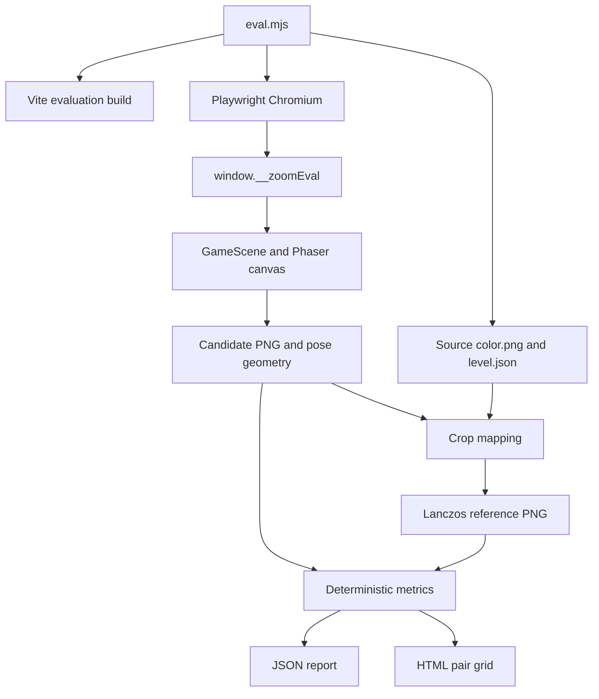

# Max-Zoom Fidelity Fast-Tier Evaluator

## Goal Capsule

- **Objective:** Add the deterministic Chromium fast-tier evaluator defined by `tools/zoom-sharpness/GOAL.md` and commit a representative baseline without changing rendering behavior.
- **Authority:** `tools/zoom-sharpness/GOAL.md`, then the preserved Product Contract below, then the Planning Contract.
- **Execution profile:** Build the game with an explicit evaluation gate, drive the real build through Playwright, and keep all image analysis deterministic and dependency-free.
- **Stop conditions:** Stop rather than score if a requested pose is invalid, the hook cannot prove a settled frame, candidate/reference geometry differs, or the representative subset lacks an aspect class.
- **Tail ownership:** This card ends after the fast-tier JSON/HTML baseline is committed; device-tier confirmation and fidelity optimization remain separate work.

---

## Product Contract

### Summary

Build the deterministic fast-tier evaluator defined by `tools/zoom-sharpness/GOAL.md`. It compares the real Find the Dog web build with source-art reference crops at identical poses, publishes machine-readable scores and a human-review grid, and establishes a representative baseline without changing rendering behavior.

### Problem Frame

The analytic audit identifies undersampling but cannot measure the perceptual gap between a rendered frame and the best crop physically producible from source art. The optimization loop needs a repeatable, reference-anchored fitness function before any rendering change can be judged.

### Actors

- A1. Fidelity iteration worker runs the evaluator before and after rendering changes.
- A2. Fast-tier evaluator selects poses, drives the game, constructs references, scores pairs, and emits artifacts.
- A3. Find the Dog test surface exposes deterministic level and camera control only outside production builds.
- A4. Reviewer inspects the HTML candidate/reference pairs when aggregates hide a localized defect.

### Requirements

**Test-only game hook**

- R1. Find the Dog exposes `window.__zoomEval` only in the explicit zoom-evaluation build; ordinary development and production builds omit it.
- R2. Production builds do not expose the hook or an active gameplay-control path through it.
- R3. The hook accepts `{ levelId, zoom, scrollX, scrollY }`, loads the requested level, and applies that camera pose deterministically.
- R4. Invalid poses are rejected consistently and the effective pose is returned.
- R5. The hook resolves only after assets, camera state, Phaser rendering, and browser paint have settled.
- R6. The returned pixels come from the actual Phaser canvas.
- R7. The result includes the effective camera, canvas, and image-placement facts needed to map the capture to one source crop.
- R8. Existing test-only seams are reused where possible and no player-visible behavior is added.

**Pose selection and references**

- R9. Each level has exactly three stable spatial poses: first dog in metadata order, densest-detail region, and seeded-random valid region.
- R10. Densest detail is the deterministic source-region edge-energy argmax with a stable tie-break.
- R11. Random selection uses one documented fixed seed and stable level ordering.
- R12. Each spatial pose is captured at runtime max zoom and zoom 1.
- R13. References use `games/find_the_dog/public/levels/<id>/color.png`, crop the exact visible source region, and Lanczos-resample it to candidate framebuffer dimensions.
- R14. Candidate and reference dimensions, alpha handling, and color-channel treatment match before scoring.
- R15. Invalid or incomplete captures fail visibly instead of producing a score.

**Scoring and reports**

- R16. Each pose score is `100 * (0.5 * MS-SSIM + 0.3 * min(candidate edge energy / reference edge energy, 1) + 0.2 * PSNR band)`.
- R17. PSNR maps linearly from 20-40 dB to 0-1 and clamps outside that band.
- R18. JSON records reproducibility inputs, every pose component at both zooms, `perLevel`, `median`, and `worstDecile`.
- R19. Ordering, percentile selection, rounding, and tie-breaks are deterministic and documented.
- R20. HTML presents labeled candidate/reference pairs with level, pose, zoom, and score context.
- R21. The committed baseline covers at least 15 levels and all playable aspect classes under `tools/zoom-sharpness/baseline/`.
- R22. Baseline metadata records the level subset, viewport, device scale, max zoom, seed, revision, and evaluator content identity.

**Scope and operational constraints**

- R23. Playwright drives a production-style Vite build in headless Chromium.
- R24. The evaluator and hook remain small: no framework, plugin architecture, or configuration system.
- R25. Existing utilities are reused and no dependency is added without authorization.
- R26. Code changes are limited to `games/find_the_dog/src` for the hook and `tools/zoom-sharpness/` for evaluator, tests, and baseline.
- R27. Rendering behavior, source art, texture caps, filtering, mipmaps, zoom limits, and asset-loading policy do not change.

### Key Flows

- F1. The evaluator asks the gated hook to load a level and lock a pose; the hook returns settled canvas pixels and effective geometry from the same frame.
- F2. The evaluator maps the camera view into the source PNG, builds the exact Lanczos reference, computes all components, and retains the pair.
- F3. The evaluator aggregates the fixed subset and emits reproducible JSON plus the inspection grid.

### Acceptance Examples

- AE1. Given an evaluation build and valid pose, the hook returns settled Phaser-canvas pixels whose metadata maps to one exact source crop.
- AE2. Given a normal production build, `window.__zoomEval` is absent.
- AE3. Given the same revision, subset, viewport, and seed, two runs choose the same six captures per level and produce identical references and numeric scores.
- AE4. Equal edge-energy regions resolve by topmost row, then leftmost column.
- AE5. Every pose has separately labeled max-zoom and zoom-1 results in JSON and HTML.
- AE6. A clamped or mismatched pose fails with level and pose identity before scoring.
- AE7. The committed baseline includes at least 15 levels across portrait and wide-landscape classes with complete reproduction metadata.
- AE8. The final diff contains no rendering, asset, or zoom-limit change.

### Success Criteria

- One evaluator invocation produces deterministic JSON and HTML artifacts from the real build.
- Every aggregate traces to labeled pose-level components and visible image pairs.
- The baseline covers at least 15 levels and both current playable aspect classes.
- Max-zoom target results and zoom-1 guard results remain separate.

### Scope Boundaries

- No device-tier capture, iPhone plateau confirmation, performance guardrails, rendering improvement, asset regeneration, or full-catalog requirement.
- No LLM judgment and no general-purpose harness expansion.

### Dependencies

- The existing `games/find_the_dog/src/testing/TestHarness.ts` and bootstrap gate provide the test-only control pattern.
- `tools/refcap-compare/src/png.mjs` provides reusable zero-dependency PNG decode/encode for the source and generated pair artifacts.
- `games/find_the_dog/src/data/playableAspect.ts` remains the authority for aspect classification.

### Product Contract Preservation

Product Contract changed: R1 clarifies that the optimized zoom-evaluation mode is the test build, because Vite sets `import.meta.env.PROD` for every `vite build` mode. All other R1-R27, F1-F3, and AE1-AE8 decisions are preserved from `docs/brainstorms/2026-07-20-zoom-max-fidelity-fast-tier-baseline-requirements.md`.

---

## Planning Contract

### Key Technical Decisions

- KTD1. **A dedicated evaluation-build gate using existing exposed inputs.** Install `window.__zoomEval` from the same lazy test module as the existing harness only when `import.meta.env.MODE === "zoom-eval"` and the already-allowed `VITE_ENABLE_TEST_HARNESS === "true"`. The evaluator creates an optimized `vite build --mode zoom-eval` artifact with that existing harness flag; normal development and production modes fail the mode check and tree-shake the hook path. This avoids changing `vite.config.ts` or the shared environment policy outside R26's file boundary. The evaluation artifact is test-only even though Vite sets `PROD` during its optimized build.
- KTD2. **One same-frame capture payload.** The hook waits for the requested `GameScene` to report ready, applies zoom and bounded scroll, then crosses two Phaser post-render/browser-animation-frame boundaries before calling the Phaser canvas `toDataURL("image/png")`. It returns the PNG plus effective zoom/scroll, backing-canvas dimensions, level dimensions, and `imgScale`/offsets captured immediately before serialization. The evaluator rejects any effective/requested mismatch beyond an exact documented epsilon.
- KTD3. **Source coordinates derive from Phaser geometry.** For each Phaser-canvas pixel, invert camera scroll/zoom and `imgScale`/offset to obtain the corresponding source-art coordinate. Compute the projected image intersection with the canvas; the evaluator extracts those actual candidate pixels from the returned full-canvas PNG and treats that extracted rectangle as the candidate framebuffer. The source crop is then Lanczos-resampled to exactly that candidate framebuffer's width and height, preserving R13-R14 while excluding pixels that have no source-art counterpart.
- KTD4. **Deterministic pose conventions.** Use a fixed ordered 15-or-more-level array in `eval.mjs`, validated at startup against `isPlayableLevelAspect` semantics represented in level dimensions. Dog uses the first metadata dog. Dense-region scanning uses the max-zoom visible crop footprint, luminance Sobel edge energy, and a fixed stride of `max(1, floor(min(cropWidth, cropHeight) / 32))`; ties choose lowest source `y`, then `x`. Seeded random uses a named fixed integer seed plus level ID through a small stable PRNG and samples only valid crop centers.
- KTD5. **Dependency-free image math.** Reuse `decodePng`/`encodePng`; implement evaluator-local separable Lanczos-3 sampling. Composite transparent pixels over opaque black before comparing sRGB byte channels. Compute PSNR over RGB, edge energy over Rec. 709 byte-space luminance, and five-scale MS-SSIM using an 11x11 Gaussian window (`sigma=1.5`), 2x box downsampling, standard constants for an 8-bit range, and fixed published scale weights. Unit fixtures lock these conventions rather than relying on an unapproved package.
- KTD6. **Separate target and guard aggregates.** Every pose records both zooms. `perLevel`, `median`, and `worstDecile` each expose `maxZoom` and `zoom1`; the report's headline score is the max-zoom median. Level aggregation is the arithmetic mean of its three pose composites. Cross-level median uses sorted midpoint averaging for even counts; worst decile is the arithmetic mean of the lowest `max(1, ceil(n * 0.1))` level scores. Stored numbers round to six decimals only at JSON serialization.
- KTD7. **Artifacts are deterministic except declared provenance.** Candidate/reference PNGs use stable names and order. JSON keys/arrays are emitted in fixed construction order; HTML is generated from that JSON with escaped labels and embedded relative images. Revision and evaluator hash are explicit metadata, so cross-revision reports need not be byte-identical while pose/reference/scoring results at the same inputs must be.
- KTD8. **The HTML is an inspection tool, not a decorative gallery.** Lead with max-zoom median, worst decile, and zoom-1 guard summaries; provide jump links to each level in stable order with aspect class visible; within each level group by pose and then zoom. Candidate/reference images render side by side at identical CSS dimensions and preserved aspect ratio, with a per-pair 1:1 view that uses overflow instead of browser resampling and a return link to the summary.

### High-Level Technical Design

### Assumptions

- Existing level PNGs remain compatible with the reusable decoder; unsupported PNG variants fail with the level path rather than trigger a dependency addition.
- A two-post-render/two-animation-frame barrier is sufficient for Chromium capture once scene readiness and exact camera state are observed; the integration test must prove repeated capture stability.
- The checked-in representative subset is a benchmark contract. Changing it requires an intentional baseline refresh, not automatic catalog sampling.

### Sequencing

U1 defines and proves the browser capture seam. U2 builds deterministic image/pose/scoring primitives independently. U3 integrates the runner and reports. U4 runs the real build, inspects the grid for alignment, and commits the baseline only after all verification gates pass.

### Risks and Mitigations

- WebGL readback may expose a stale or blank buffer. Fail on blank/transparent captures and prove repeated identical captures through the real build before baseline generation.
- Camera-to-source inversion may be off by letterboxing, backing-pixel ratio, or rounding. Preserve raw effective geometry and include synthetic mapping fixtures plus human inspection of the candidate/reference grid.
- A hand-rolled MS-SSIM can silently diverge from its stated convention. Lock constants, scale behavior, identical-image ceiling, degradation ordering, and fixture hashes in unit tests.
- Baseline binaries can become large. Store only the 180 candidate/reference images needed by 15 levels x 3 poses x 2 zooms x 2 sides, plus JSON and one HTML file; do not retain build output or Playwright traces.

---

## Implementation Units

### U1. Add the evaluation-only capture hook

- **Goal:** Expose a deterministic same-frame camera-control and canvas-capture contract without affecting production.
- **Requirements:** R1-R8, R15, R26-R27; F1; AE1-AE2, AE6, AE8.
- **Dependencies:** None.
- **Files:** `games/find_the_dog/src/testing/ZoomEvalHook.ts` (new), `games/find_the_dog/src/testing/ZoomEvalHook.test.ts` (new), `games/find_the_dog/src/bootstrap.ts` (modify), and the minimal scene/test-harness type surface under `games/find_the_dog/src` only if needed.
- **Approach:** Reuse `loadLevel`, `GameScene` readiness/snapshot fields, and the existing lazy test-harness bootstrap pattern. Validate finite inputs and bounds, await the requested level identity, apply and re-read the pose, settle across render/paint boundaries, then return a PNG data URL and immutable geometry snapshot. Delete the global during teardown/HMR and install it only under KTD1's explicit evaluation-build gate.
- **Patterns to follow:** `games/find_the_dog/src/bootstrap.ts` lazy harness import and `games/find_the_dog/src/testing/TestHarness.ts` scene loading, camera snapshot, and wait helpers.
- **Test scenarios:** (1) Covers AE1: a valid mocked scene loads, applies the pose, crosses the settle barrier, and serializes the real supplied game canvas with matching effective metadata; (2) invalid/non-finite/out-of-range pose fails before serialization; (3) scene timeout and blank canvas fail visibly; (4) Covers AE2: the bootstrap gate truth table installs only for `MODE=zoom-eval` plus the existing explicit test-harness flag, and omits the hook in ordinary development and production modes; (5) Covers AE6: effective pose mismatch rejects with identity context.
- **Verification:** Unit tests prove validation/gating/barrier behavior; U3's real-build integration proves the browser-visible hook and pixels.

### U2. Implement deterministic pose, crop, and metric primitives

- **Goal:** Produce reference crops and scores with no new dependency or runtime renderer coupling.
- **Requirements:** R9-R17, R19, R24-R25; F2; AE3-AE4.
- **Dependencies:** None.
- **Files:** `tools/zoom-sharpness/lib.mjs` (new), `tools/zoom-sharpness/eval.test.mjs` (new), `tools/refcap-compare/src/png.mjs` (reuse, do not modify unless a source fixture proves a required supported variant).
- **Approach:** Implement source/camera coordinate transforms, valid-center bounds, stable dense/random pose choice, Lanczos-3 RGBA resampling, alpha normalization, MS-SSIM, edge energy, PSNR band, composite, and aggregate functions as pure exports. Keep constants adjacent to their implementations and include them in report metadata.
- **Patterns to follow:** Zero-dependency typed-array image handling in `tools/refcap-compare/src/png.mjs` and deterministic Node tests in `tools/refcap-compare/test/`.
- **Test scenarios:** (1) identity images reach metric ceilings; (2) blur lowers edge ratio and composite while oversharpening cannot exceed the capped edge component; (3) 20/30/40 dB map to 0/0.5/1; (4) Lanczos output dimensions and fixed fixture hash are stable; (5) coordinate inversion maps known zoom/scroll/offset fixtures exactly; (6) dense-region ties choose topmost then leftmost; (7) same seed/level repeats while different level IDs produce stable different samples; (8) odd/even medians and 15-level worst-decile use KTD6; (9) dimension or unsupported-alpha mismatch rejects.
- **Verification:** Node unit tests pass twice with identical fixture hashes and score objects.

### U3. Drive the real build and emit reports

- **Goal:** Integrate Playwright capture, reference construction, scoring, JSON, and HTML into one evaluator command.
- **Requirements:** R12-R20, R22-R24; F1-F3; AE3, AE5-AE6.
- **Dependencies:** U1, U2.
- **Files:** `tools/zoom-sharpness/eval.mjs` (new), `tools/zoom-sharpness/eval.test.mjs` (extend), `tools/zoom-sharpness/README.md` (new).
- **Approach:** Build a production-style Vite output in the exact mode/flag combination from KTD1, serve it on an ephemeral localhost port, launch fixed Playwright Chromium viewport/DPR, and process the static level subset in stable order. For each source-selected pose, request max zoom and zoom 1 through the hook, reject geometry drift, write stable pair filenames, then generate JSON and the KTD8 inspection hierarchy from the result model. Ensure child server/browser cleanup in `finally`.
- **Execution note:** Prove one portrait and one landscape level end to end before expanding to the baseline subset.
- **Patterns to follow:** Root `@playwright/test` version and direct Playwright/browser lifecycle patterns in existing tools; avoid the mobile game's browser E2E suite because this evaluator is a purpose-built fast-tier tool, not device verification.
- **Test scenarios:** (1) Covers AE5: a stubbed two-zoom result produces separate raw and aggregate groups plus correctly labeled HTML; (2) malformed hook payload, missing source, dimension mismatch, or browser/server failure exits nonzero with level/pose context and cleans up; (3) report ordering and filenames remain stable under shuffled input discovery; (4) HTML escapes metadata, references every emitted pair, exposes level jump/return navigation, displays aspect class, gives paired images identical presentation dimensions, and includes the unresampled 1:1 view; (5) Covers AE3: two real-build smoke captures of the same two levels select identical poses and produce identical reference hashes and scores; (6) the optimized `zoom-eval` build exposes the hook while an otherwise identical `production`-mode build does not.
- **Verification:** The two-aspect real-build smoke run completes in headless Chromium; its grid is visually inspected for crop alignment, and repeated result values match.

### U4. Record and validate the representative baseline

- **Goal:** Commit a reproducible starting score spanning every playable aspect class.
- **Requirements:** R18-R23, R26-R27; F3; AE7-AE8.
- **Dependencies:** U3.
- **Files:** `tools/zoom-sharpness/baseline/report.json` (new), `tools/zoom-sharpness/baseline/index.html` (new), `tools/zoom-sharpness/baseline/pairs/*.png` (new), `tools/zoom-sharpness/README.md` (update).
- **Approach:** Run the fixed subset of at least 15 levels, assert portrait and wide-landscape coverage before capture, record git revision and evaluator hash, and retain only report artifacts. Review the full HTML grid for systematic crop offset, blank frames, overlays, and aspect-specific mismatch before accepting the numeric baseline.
- **Execution note:** This is the first live run of the new build/browser/hook seam; the baseline is invalid until the report is observed, not merely generated.
- **Patterns to follow:** Metadata-first audit output in `tools/zoom-sharpness/audit.mjs` and artifact placement required by `tools/zoom-sharpness/GOAL.md`.
- **Test scenarios:** (1) Covers AE7: preflight rejects fewer than 15 levels or a missing aspect class; (2) every expected level has exactly three poses and six scored captures; (3) all report image references exist and dimensions match; (4) rerunning at the same revision yields identical pose/reference hashes and numeric results; (5) Covers AE8: branch diff is restricted to the declared directories and contains no source-art or rendering change.
- **Verification:** Inspect the generated HTML grid, validate JSON invariants programmatically, rerun for determinism, and confirm the committed baseline names its non-device scope explicitly.

---

## Verification Contract

| Gate | Command or observation | Proves |
| --- | --- | --- |
| Hook and game types | `npm run typecheck --workspace @fabrikav2/find_the_dog` | Hook types and its game integration compile. |
| Game unit behavior | `npm run test:unit --workspace @fabrikav2/find_the_dog` | Gate, validation, and settled-capture behavior. |
| Evaluator unit behavior | `node --test tools/zoom-sharpness/eval.test.mjs` | Image math, pose rules, metrics, aggregation, and reporting invariants. |
| Real-build fast-tier smoke | Run `node tools/zoom-sharpness/eval.mjs` with its documented two-level smoke option | Chromium drives the gated Vite build for portrait and landscape and repeated outputs match. |
| Baseline | Run `node tools/zoom-sharpness/eval.mjs` with no subset override | At least 15 levels, both aspect classes, 90 candidate captures, 90 references, JSON aggregates, and HTML grid are produced. |
| Static quality | `npx eslint games/find_the_dog/src tools/zoom-sharpness` and `git diff --check` | Changed source follows local static conventions and contains no whitespace errors. |
| Scope | Inspect `git diff --name-only c6bb6a13...HEAD` and the final uncommitted diff | Only the hook, evaluator, tests, docs, and baseline changed; rendering and source art did not. |
| Human evidence | Open `tools/zoom-sharpness/baseline/index.html` and inspect every pair | Captures are nonblank and reference crops align across both aspect classes. This is fast-tier evidence only, never device verification. |

---

## Definition of Done

- U1-U4 satisfy their listed scenarios and verification outcomes.
- `window.__zoomEval` is absent from a normal production build and functional only in the explicitly gated evaluation build.
- The evaluator uses the real Vite build and actual Phaser canvas, produces the exact contracted component formula, and fails mismatches rather than scoring them.
- The committed baseline contains at least 15 levels across all playable aspect classes, separate max-zoom and zoom-1 aggregates, complete provenance, JSON, HTML, and all referenced pairs.
- The baseline HTML has been visually inspected and the same-revision determinism rerun matches pose/reference hashes and numeric scores.
- No dependency, rendering behavior, source art, device-tier claim, or unrelated cleanup enters the diff.
- Abandoned experiments, temporary build output, traces, and scratch captures are removed before handoff.
