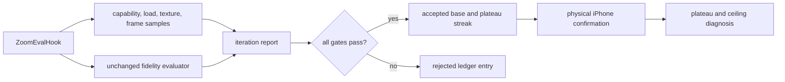

# Max-Zoom Quality Plateau

## Goal Capsule

- **Objective:** Improve Find the Dog's fully zoomed-in fidelity until two consecutive accepted iterations each gain less than one composite point, while preserving zoom-1 quality and the load, memory, and 30fps guardrails.
- **Authority:** `tools/zoom-sharpness/GOAL.md`, the preserved Product Contract below, then this Planning Contract.
- **Execution profile:** Change one lever at a time in expected-impact order and use the locked ZOOM-1 Chromium fast tier for every iteration. The conductor runs the physical-iPhone tier only once the fast-tier plateau fires.
- **Stop conditions:** Reject any iteration that regresses zoom 1, lowers the max-zoom or zoom-1 worst-decile aggregate by more than the measured evaluator repeatability epsilon, exceeds either +15% resource allowance, fails allocation, or misses the physical-device 30fps budget. Stop after the plateau rule and at most one justified source-art escalation round.
- **Tail ownership:** This card owns the complete experiment ledger and winning implementation; it does not generalize the evaluator, asset system, or performance tooling.

---

## Product Contract

### Summary

Iterate on Find the Dog's fully zoomed-in rendering until the ZOOM-1 reference-anchored score reaches the defined plateau. Accept only changes that improve max-zoom fidelity without regressing zoom 1, exceeding the load-time or texture-memory allowance, or losing the device's 30fps budget.

### Problem Frame

The locked 15-level Chromium baseline reports max-zoom median `75.457942`, max-zoom worst decile `74.412557`, and zoom-1 median `76.135316`. The runtime currently caps color textures at a 2560-pixel long edge before generating the grayscale layer, while the camera reaches 2.5x and source PNGs can contain more detail. The optimization must find the smallest maintainable policy that closes that measurable gap without moving the evaluator or harming real-device behavior.

### Actors

- A1. Iteration worker selects one hypothesis, implements the smallest experiment, runs the locked evaluator and guardrails, and records the disposition.
- A2. ZOOM-1 harness supplies deterministic max-zoom and zoom-1 fitness scores.
- A3. At plateau, the conductor uses the physical iPhone for authoritative frame-pacing and visual confirmation.
- A4. Reviewer confirms the plateau and remaining-ceiling diagnosis from paired crops and the iteration ledger.

### Requirements

**Baseline and experiment discipline**

- R1. Use the committed ZOOM-1 score baseline and record comparable fast-tier guardrails for each rendering iteration.
- R2. Record every hypothesis, changed lever, expected fidelity effect, and expected resource effect before evaluation.
- R3. Change only one lever or one inseparable lever set per iteration.
- R4. Try candidate levers in expected-impact order unless recorded measurements or platform limits justify reordering.
- R5. Do not impose arbitrary texture, asset-resolution, filtering, or zoom ceilings beyond measured capability and guardrails.

**Scoring and acceptance**

- R6. Run the unchanged ZOOM-1 evaluator with its locked corpus, poses, viewport, seed, references, and aggregation.
- R7. Accept only a max-zoom median improvement over the current accepted result with no zoom-1 composite drop.
- R8. Measure gain against the immediately previous accepted iteration.
- R9. Record and inspect max-zoom and zoom-1 worst-decile values so the median cannot hide tail damage.
- R10. Invalidate results affected by evaluator, pose, crop, reference, or aggregation drift.

**Resource and device guardrails**

- R11. Keep level load time and texture memory within +15% of their locked baselines under identical conditions.
- R12. Sustain the existing 30fps budget at max zoom when the conductor runs the device tier at plateau.
- R13. Derive runtime texture policy from actual graphics capability.
- R14. Preserve a lower Android guard wherever measured Android capability requires it.
- R15. Reject a Chromium-passing candidate that fails iPhone fidelity, loading, allocation, memory, or frame pacing.
- R16. Use the repository's real-device path; browser and simulator output are not device verification.

**Asset and rendering integrity**

- R17. Preserve level geometry, dog coordinates, reveal alignment, and candidate/reference crop identity when delivery resolution changes.
- R18. A zoom-aware texture transition must not flash, move the camera, lose reveal state, or race stale texture loads.
- R19. Color and grayscale layers must derive from resolution-compatible content.
- R20. Filtering or mipmaps must improve the locked reference-anchored composite.
- R21. A max-zoom change is valid only if the evaluated player outcome improves and all guardrails pass.

**Ledger, plateau, and escalation**

- R22. Record every attempt in `tools/zoom-sharpness/iterations.md`, including score distributions, guardrails, disposition, and rejection reason.
- R23. Reach provisional plateau only after two consecutive accepted gains below `1.0` point.
- R24. Rejected attempts neither count toward the streak nor change the accepted comparison base.
- R25. Finalize plateau only after physical-iPhone confirmation.
- R26. At plateau, inspect paired device/reference crops for visibly soft source art.
- R27. If source art is the ceiling, allow one escalation round, re-anchor affected references to the new source identity, and resume the same loop.
- R28. Stop after a non-source ceiling or the one escalation round, recording final scores, resources, evidence, accepted/rejected changes, and remaining ceiling.
- R29. Apply the winning policy across playable levels represented by the committed 15-level headline corpus; do not add a new catalog prerequisite.

### Key Flows

- F1. Lock score/resource baselines, record a hypothesis, run one experiment, and accept or reject it against all gates.
- F2. Accepted results become the next comparison base; rejected results remain ledger entries but do not affect plateau state.
- F3. After two sub-1.0 accepted gains, confirm the winner on iPhone, diagnose the remaining ceiling, and either stop or perform the single source-art escalation.

### Acceptance Examples

- AE1. A higher max-zoom median with any zoom-1 drop is rejected and the previous accepted result remains current.
- AE2. A Chromium pass that misses 30fps or allocation on iPhone is rejected.
- AE3. A zoom-aware high-resolution swap preserves camera, reveal state, and color/grayscale alignment.
- AE4. Accepted gains of `0.8` and `0.6` trigger device confirmation; intervening rejected attempts do not alter the streak.
- AE5. Accepted gains of `0.7` then `1.2` do not satisfy the plateau rule.
- AE6. Visibly soft paired references permit exactly one source-art escalation round.
- AE7. The final policy retains the locked headline corpus and reports its existing aspect-class coverage without inventing levels.

### Scope Boundaries

- No evaluator-weight, pose, crop, reference, or aggregation changes made to inflate the score.
- No generalized evaluation framework, asset system, device profiler, or cross-game abstraction.
- No source-art regeneration before runtime and delivery experiments plateau and paired evidence identifies source softness.
- No browser or simulator claim presented as mobile verification.
- No unrelated gameplay, UI, economy, analytics, SDK, or catalog work.

### Product Contract Preservation

Product Contract unchanged. R1-R29, F1-F3, and AE1-AE7 preserve `docs/brainstorms/2026-07-20-zoom-max-quality-plateau-requirements.md`.

---

## Planning Contract

### Key Technical Decisions

- KTD1. **Extend the existing zoom-evaluation seam, not the general device tool.** Add performance/capability facts to the explicitly gated `window.__zoomEval` path and report model. Measure level load from the request start through the hook's existing settled-frame barrier. Report decoded runtime texture dimensions and estimated resident RGBA bytes (`width * height * 4` for each live color, generated grayscale, and background texture) rather than claiming unavailable browser GPU-allocation telemetry. Keep the estimate formula and texture set in every report so comparisons are like-for-like.
- KTD2. **Use a robust baseline-relative resource gate.** For each locked level/pose, take five warm-process level-load samples after one discarded warm-up; compare candidate versus baseline by the median of per-level medians. Record individual samples and require both aggregate load time and estimated resident texture bytes to remain at or below `1.15 * baseline`. This bounds noise without creating a performance framework.
- KTD3. **Define material tail damage from evaluator repeatability.** Before experiments, run the unchanged baseline twice and record the largest absolute change in the max-zoom or zoom-1 worst-decile aggregate as `repeatabilityEpsilon`. Reject a candidate when either worst-decile aggregate falls by more than that epsilon. Preserve per-level/pose deltas for diagnosis, but do not turn them into a stricter undeclared acceptance gate. This gives R9 a deterministic threshold grounded in observed harness noise rather than a new fitness weight.
- KTD4. **Make the first quality experiment a capability-aware cap plus higher-resolution evaluation input.** Query `MAX_TEXTURE_SIZE` from the active Phaser WebGL context after renderer creation; select the largest requested long edge no greater than the measured limit and source dimensions, with the current 2560 fallback for Canvas/unknown contexts. Keep this separate from `games/find_the_dog/src/core/Constants.ts`'s existing `MAX_RENDERBUFFER_SIZE`/DPR safety calculation, which protects render targets and must not change. For this experiment, point the evaluator's temporary manifest at the existing higher-resolution `color.png`; raising the cap against the shipped 2560-long-edge WebP alone is a no-op. Treat these as one inseparable causal lever set: higher-resolution input makes pixels available and the capability policy prevents premature downscaling. The texture policy is capability-derived for both iOS and Android; a lower measured Android limit naturally retains its guard.
- KTD5. **Keep color and grayscale at one effective resolution.** `capTextureLongEdge` and `generateGrayscaleTexture` consume one resolved per-scene cap. The grayscale layer is generated at the capped color resolution and displayed at logical level dimensions, avoiding the current upscale-to-logical-size allocation and preventing mismatched reveal detail. Background layers use the same safety resolver only when their source exceeds the selected limit.
- KTD6. **Escalate one lever at a time after the cap experiment.** If KTD4 is accepted, next test higher-resolution packaged WebP delivery while keeping runtime policy fixed; only then test filtering/mipmap changes, and only then vary `PINCH.maxZoom`. Add zoom-threshold loading only if eager high-resolution delivery breaches a resource guardrail and measurements show deferred delivery can recover it. Do not retain rejected code between experiments.
- KTD7. **Device confirmation is a plateau-only conductor duty.** Workers use `node tools/zoom-sharpness/eval.mjs` as the fitness function and must not add diagnostic states, registries, or device prerequisites. Once the plateau rule fires, hand the winning revision and exact device verification request to the conductor.
- KTD8. **The committed 15-level corpus is complete for this card.** Its two shipping image shapes are the accepted catalog reality. Do not require or manufacture width-greater-than-height levels, and do not change the headline corpus during iteration.
- KTD9. **Source-ceiling diagnosis is paired and conservative.** At provisional plateau, export iPhone captures for the worst three max-zoom pairs plus one median pair. Compare each with the evaluator's exact source reference and a 1:1 source crop. Classify source art as the ceiling only when the reference and 1:1 crop are themselves visibly soft in the same region while runtime/reference alignment is correct; otherwise attribute the ceiling to runtime delivery/filtering/device capability. Any source refresh records new asset hashes and starts a new, explicitly labeled reference generation rather than overwriting the original baseline identity. The new generation establishes a fresh accepted baseline and resets the sub-1.0 streak; gains are never compared across reference identities.

### High-Level Technical Design

### Sequencing

U1 locks fast-tier baseline evidence before rendering changes. U2 implements and evaluates the capability-aware cap as the first hypothesis. U3 owns later experiments in strict expected-impact order and keeps only accepted changes. U4 hands the plateau candidate to the conductor for iPhone confirmation and writes the final diagnosis.

### Risks and Mitigations

- Browser timings vary with host load. Use warm-process medians, preserve raw samples, and compare the same corpus in alternating baseline/candidate runs.
- Estimated RGBA bytes do not equal driver-resident memory. Label them as a deterministic allocation proxy; physical allocation failure and process stability remain iPhone acceptance gates.
- Larger canvases can multiply CPU-composite and reveal costs even when GL supports them. Exercise classic reveal during the device frame window and retain the existing `ClassicRenderDiagnosticsSnapshot` timings in evidence.
- `MAX_TEXTURE_SIZE` can be high while practical memory is not. Capability only bounds candidates; the +15% memory proxy, load gate, and live iPhone run decide acceptance.
- Asset regeneration can make the benchmark self-referential. Preserve original baseline/reference hashes, isolate the one escalation generation, and compare both generations explicitly.

### Deferred to Follow-Up Work

- General performance telemetry, adaptive cross-session device tiers, and shared high-resolution asset APIs remain outside this card. If the minimal local policy cannot ship without them, record the blocker and require a separately approved card rather than expanding this one.

---

## Implementation Units

### U1. Lock the fast-tier iteration baseline

- **Goal:** Treat the committed ZOOM-1 report as the fitness baseline and create the iteration ledger before changing rendering.
- **Requirements:** R1-R3, R6-R12, R16, R22; F1-F2; AE1-AE2.
- **Dependencies:** None.
- **Files:** `tools/zoom-sharpness/baseline/report.json` (read-only authority) and `tools/zoom-sharpness/iterations.md` (new).
- **Approach:** Create the ledger from the committed baseline, record each one-lever hypothesis and fast-tier result, and leave device-only facts explicitly pending until plateau. Do not add diagnostics states or registries.
- **Patterns to follow:** Existing request/settle/capture lifecycle in `games/find_the_dog/src/testing/ZoomEvalHook.ts`, `getRuntimeTexturesSnapshot()` and `getClassicRenderDiagnosticsSnapshot()` in `games/find_the_dog/src/scenes/GameScene.ts`, and deterministic aggregation in `tools/zoom-sharpness/lib.mjs`.
- **Test scenarios:** (1) five recorded samples produce the documented median and +15% pass/fail boundary; (2) byte estimates include exactly the live texture snapshot entries and reject invalid dimensions; (3) repeatability epsilon is derived from matching corpus/reference identities and fails on drift; (4) a worst-decile regression beyond epsilon rejects despite median improvement, while per-level deltas remain diagnostic; (5) the frame state follows the fixed warm-up/pan/reveal window, returns statistics once, publishes its marker only after the overlay is stable, and does not loop autonomously; (6) ordinary builds still omit the evaluation hook/state; (7) ledger/report serialization is deterministic and records rejected attempts without changing accepted-base or streak state.
- **Verification:** Run zoom-sharpness unit tests, Find the Dog unit tests/typecheck, and the locked fast-tier evaluator when the environment permits; otherwise hand the exact evaluator command to the conductor.

### U2. Evaluate the capability-aware runtime texture policy

- **Goal:** Test the smallest expected-high-impact lever set: supply existing higher-resolution pixels to the evaluator and stop downscaling them below measured GL/source capability while keeping color and grayscale aligned.
- **Requirements:** R4-R5, R13-R15, R17, R19, R22; F1-F2; AE1-AE2.
- **Dependencies:** U1.
- **Files:** `games/find_the_dog/src/scenes/GameScene.ts` (modify), `games/find_the_dog/src/core/Constants.ts` (read-only existing guard authority; modify only if a pure texture-cap helper belongs beside it), `games/find_the_dog/tests/unit/test-harness-real-flow.test.ts` and/or a focused scene-policy unit test (modify/new), `games/find_the_dog/src/testing/ZoomEvalHook.test.ts` (extend), `tools/zoom-sharpness/eval.mjs` and `tools/zoom-sharpness/eval.test.mjs` (temporary-manifest input), `tools/zoom-sharpness/iterations.md` (append).
- **Approach:** Point the evaluator's temporary color asset at existing `color.png`, resolve one scene texture limit from renderer capability with a 2560 fallback, clamp it to actual source dimensions, and use it for color/background caps plus grayscale generation as KTD4-KTD5 specify. Keep the resolver pure and testable. Run the full locked evaluator and all resource gates; accept the coupled experiment only if every gate passes, otherwise revert it and retain its ledger entry.
- **Test scenarios:** (1) the evaluation manifest uses higher-resolution PNG pixels without changing pose/reference identity; (2) 8192/4096/2048 GL limits select the highest safe source-bounded edge; (3) Canvas/unknown/invalid capability retains 2560; (4) an Android WebGL context with a lower reported limit retains that lower guard without a platform-name branch; (5) color and generated grayscale snapshots have identical effective detail dimensions; (6) oversized backgrounds are bounded; (7) logical placement, dog coordinates, camera crop, and reveal state remain unchanged; (8) max-zoom score improves, zoom-1 and worst-decile tails stay within epsilon, and load/bytes stay within +15%.
- **Verification:** Unit/type checks, full ZOOM-1 evaluation, ledger diff, and physical-iPhone load/allocation/frame/capture evidence if the fast tier provisionally accepts the iteration.

### U3. Iterate remaining levers to the provisional plateau

- **Goal:** Continue attributable experiments in expected-impact order until two consecutive accepted gains are below one point.
- **Requirements:** R2-R10, R17-R24; F1-F2; AE1, AE3-AE5.
- **Dependencies:** U2 disposition recorded.
- **Files:** `tools/zoom-sharpness/iterations.md` (append every attempt); only the minimal relevant files among `games/find_the_dog/src/scenes/GameScene.ts`, `games/find_the_dog/src/scenes/PinchZoom.ts`, `games/find_the_dog/src/testing/ZoomEvalHook.ts`, `tools/zoom-sharpness/eval.mjs`, the level publishing source discovered by the implementer, and generated `games/find_the_dog/public/levels/**` assets for an accepted delivery experiment.
- **Approach:** Follow KTD6. If U2 is accepted, inventory source/shipped dimensions and hashes and add a deterministic higher-resolution WebP export because no checked-in Find the Dog WebP generator currently exists. Introduce threshold loading only if eager delivery alone fails a resource gate. Then test texture filtering/mipmaps, then max zoom. Each attempt begins from the last accepted state, records its hypothesis before execution, runs the identical suite, and either lands alone or is removed before the next hypothesis.
- **Test scenarios:** (1) every attempted lever produces a complete accepted/rejected ledger row; (2) rejected attempts leave runtime/assets identical to the last accepted state; (3) higher-resolution assets preserve dimensions, dog/reveal alignment, cache/manifest identity, and color/grayscale parity; (4) a threshold swap, if required, crosses both directions after the same fixed partial reveal while physical-iPhone captures immediately before, during, and after prove no flash, camera jump, reveal-state change, detail mismatch, stale replacement, or URL leak; (5) filtering/mipmap changes have deterministic texture configuration and improve the locked composite; (6) a max-zoom change updates the evaluated max consistently and remains gesture-reachable; (7) plateau streak advances only for consecutive accepted gains below 1.0 and uses the previous accepted score.
- **Verification:** For every attempt, run unit/type/audit checks, the full locked evaluator, resource comparison, and ledger validation. The conductor runs the iPhone check only after the plateau rule fires.

### U4. Confirm the winning plateau and diagnose the ceiling

- **Goal:** Produce authoritative plateau device evidence and the final stop/escalation decision.
- **Requirements:** R15-R16, R25-R29; F3; AE2, AE6-AE7.
- **Dependencies:** U3 has two consecutive accepted sub-1.0 gains.
- **Files:** `tools/zoom-sharpness/iterations.md` (finalize), `tools/zoom-sharpness/baseline/` (do not overwrite; read as original authority), a new generation-scoped output under `tools/zoom-sharpness/` only if KTD9 authorizes source escalation, and accepted source/published assets only if that escalation wins.
- **Approach:** Hand the winning candidate to the conductor for the live iPhone max-zoom capture/frame check. If a device gate rejects it, record the rejection and return to U3. Review worst-three plus median paired crops using KTD9, then stop or perform the one allowed source-art escalation.
- **Test scenarios:** (1) live-device provenance, identity, GL capability, frame statistics, and captures are present at plateau; (2) any device guard failure rejects the candidate despite Chromium scores; (3) source escalation cannot start without matching soft reference/1:1 evidence and cannot occur twice; (4) original and escalated reference identities remain distinguishable; (5) final ledger identifies exactly one winning accepted state and a justified remaining ceiling.
- **Verification:** Inspect the real iPhone captures and frame report, rerun the full headline evaluation, validate final asset/manifest hashes, and confirm the ledger's plateau arithmetic from accepted rows only.

---

## Verification Contract

- **Code health:** Find the Dog typecheck/unit tests plus targeted zoom-sharpness tests must pass after each retained code change. Do not use routine browser E2E as card close-out.
- **Fitness:** `node tools/zoom-sharpness/eval.mjs` must use the unchanged locked headline inputs and write a distinct candidate output; evaluator/corpus/reference identity must match the baseline before score comparison.
- **Resources:** Compare recorded warm-process load samples and decoded resident-byte estimates against the U1 baseline; both aggregate ratios must be `<= 1.15`.
- **Tail:** Neither locked worst-decile aggregate may regress beyond the recorded repeatability epsilon; retain per-level/pose deltas as diagnostic evidence.
- **Device:** A current live physical-iPhone `allstates` run must capture the named KTD7 at-rest diagnostics state after its deterministic partial reveal, pan, and timed reveal path; the overlay must show selected texture capability, successful allocation/loading, frame and reveal diagnostics, and resource values. A skipped, browser, simulator, or detached-capture lane is unverified. If threshold loading is tested, add the before/during/after crossing sequence in both directions after partial reveal.
- **Coverage:** The committed 15-level corpus remains the only headline aggregate and no additional catalog cohort blocks completion.
- **Ledger integrity:** Every attempt, including removed/rejected code, has a complete row and evidence path; plateau arithmetic uses accepted rows only.

## Definition of Done

- The committed score baseline and iteration ledger are recorded before the first rendering experiment; device confirmation remains pending until plateau.
- Every experiment is attributable, ordered or explicitly justified, and recorded in `tools/zoom-sharpness/iterations.md`.
- The retained implementation is the highest-scoring candidate that passes zoom-1, tail, load, memory, allocation, and physical-iPhone 30fps gates.
- Two consecutive accepted gains below `1.0` are present and correctly calculated against previous accepted results.
- Current physical-iPhone captures and frame statistics prove the winning state; browser evidence is labeled only as fast-tier fitness.
- The committed 15-level corpus remains unchanged throughout the iteration loop.
- The final ledger states the remaining ceiling and, if source art was escalated, proves only one isolated reference generation occurred.
- No rejected experiment code, unrelated refactor, new framework, or unapproved dependency remains.

## Sources & Research

- `docs/brainstorms/2026-07-20-zoom-max-quality-plateau-requirements.md` — preserved product contract.
- `tools/zoom-sharpness/GOAL.md` and `tools/zoom-sharpness/README.md` — scoring, plateau, and evaluator authority.
- `tools/zoom-sharpness/baseline/report.json` — locked corpus and baseline metrics.
- `games/find_the_dog/src/scenes/GameScene.ts` — current 2560 cap, grayscale generation, texture and classic-render diagnostics.
- `games/find_the_dog/src/core/Constants.ts` — existing renderbuffer/DPR guard that must remain distinct from texture capability.
- `games/find_the_dog/src/scenes/PinchZoom.ts` — current 2.5 max zoom.
- `games/find_the_dog/src/testing/ZoomEvalHook.ts` — deterministic evaluation seam.
- `tools/verify-device/README.md` — live-device provenance boundary and capture discipline.
