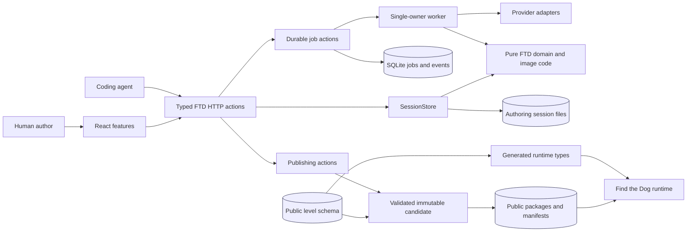
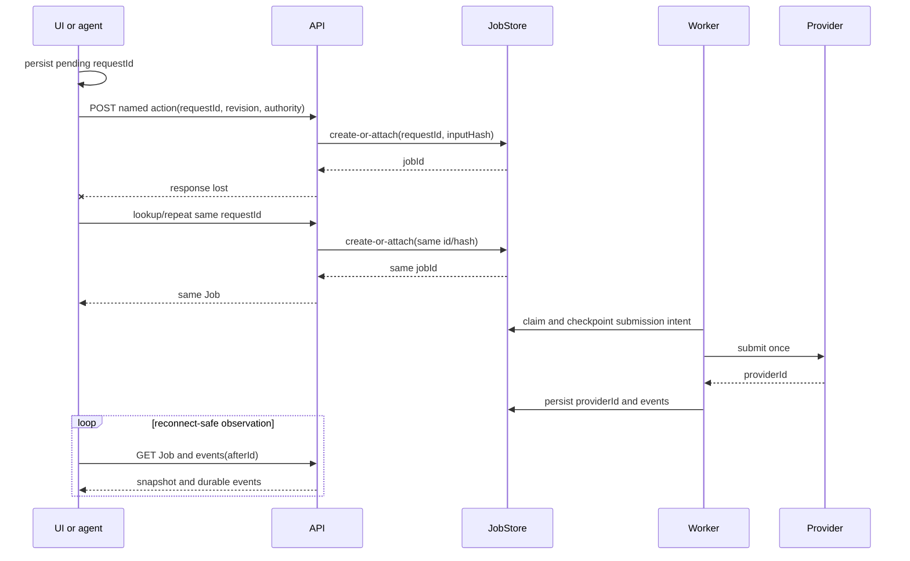
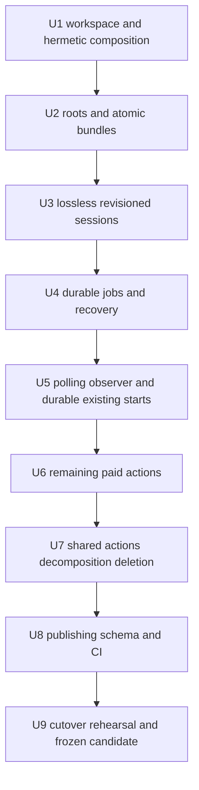

# Find the Dog Level Editor Reliability Migration

## Goal Capsule

- **Objective:** Move the Find the Dog authoring tool into Factory2 as one simple, durable, agent-changeable editor whose work survives browser disconnects, reloads, API restarts, and worker restarts without duplicate provider spend or corrupt artifacts.
- **Authority:** This Product Contract, then the Planning Contract, then the current Factory2 project instructions. The legacy editor checkout is read-only reference material during implementation and remains the sole writable authority until a separately approved final activation from the exact reviewed commit.
- **Execution profile:** Run nine dependency-ordered TWF cards on isolated card branches, land each card on `twf-ftd-level-editor-migration`, and keep `main` unchanged until one reviewed integration PR is ready.
- **Stop conditions:** Stop a card rather than guess if it would share the legacy ledger or authoring roots, introduce an unapproved dependency outside the migrated v1 set, submit ambiguous paid work again, mutate published content without a revision-bound preview, or delete legacy identity recovery before its archive gate is proven.
- **Tail ownership:** The initiative owns the Factory2 tool, reliability contracts, tests, documentation, schema/publishing gates, cutover rehearsal, and the separately approval-gated local editor-authority activation. It does not own new editor features, multi-game generalization, provider tuning, or public-game or remote-editor deployment.

---

## Product Contract

### Summary

The current editor has valuable domain behavior but unreliable transport and ownership boundaries. Browser-owned EventSource flows, request-owned paid operations, module-global paths and workers, handwritten cross-language contracts, and broad session modules make disconnections risky and changes difficult.

The new home is `tools/ftd-level-editor/` in Factory2. It remains one FTD-owned modular monolith: one FastAPI process, one deliberately single-owner in-process worker, one React UI, one filesystem authoring authority, and one SQLite job ledger. Reliability infrastructure becomes reusable inside the editor; dogs, prompts, geometry, hitboxes, variants, publishing, and sequence rules stay explicitly Find the Dog.

### Problem Frame

A network read failure currently looks too much like failed work, even when durable work is still running. Several paid paths are still tied to a browser request. Test lifespans can reach production-default state. Session reads and writes do not share one lossless typed boundary or a general revision precondition. Upcoming agents therefore face two hazards: they can accidentally duplicate expensive work, and they must reason through large barrels with hidden global state.

The migration must improve those seams while moving them. Hardening v1 and then porting it would create two integration boundaries and duplicate changes. Factory2 is the active TWF authority, so the safer overall path is a target-first, slice-by-slice migration with v1 kept read-only and runnable as fallback until a single final cutover.

### Actors

- **A1. Human level author:** Uses the React editor to create, inspect, generate, validate, export, publish sequence versions, and roll back by activating an eligible prior sequence version whose immutable packages are retained.
- **A2. Coding agent:** Uses the same typed HTTP actions and snapshots as the UI, without reading React internals or receiving extra privileges.
- **A3. Editor API:** Validates FTD-specific intent, exposes side-effect-free state, applies revisioned mutations, and returns durable job or artifact resources.
- **A4. Durable worker:** Owns one job attempt at a time, persists checkpoints/events/artifacts, and recovers conservatively after process or owner loss.
- **A5. Provider adapter:** Performs a paid or expensive external operation only after explicit authority and returns a provider identity when available.
- **A6. Publisher and game runtime:** Consume validated public packages and manifests; they never read mutable authoring-session state or the job ledger.
- **A7. TWF conductor and workers:** Execute one card stage at a time, keep decisions on cards, and land reviewed branch evidence onto the initiative integration branch.

### Domain Vocabulary

- **Authoring Session:** The writable, losslessly preserved FTD workspace for one level-in-progress. It is not a public level package.
- **Session Revision:** An opaque value that changes with every accepted authoring mutation and is required as a mutation precondition.
- **Job Attempt:** One immutable invocation of a named durable action. Retry and force-new create linked attempts rather than rewriting history.
- **Request ID:** Caller-chosen invocation identity used to attach after a lost response or transport replay.
- **Input Hash:** Server-computed digest of canonical inputs, source revisions, and relevant source bytes for one request ID.
- **Execution Spec:** The immutable, versioned action inputs actually consumed by a worker, including server-owned recipe/policy versions, provider/model options, source hashes/revisions, and target reservation. It is persisted before side effects and is part of the Input Hash.
- **Approval Grant:** An opaque, expiring, single-use human authority record bound to actor, protected action kind, Request ID/Input Hash or publication digest, source revision, and acknowledgement text. The server mints and atomically consumes it; caller claims are not authority.
- **Artifact Reference:** An opaque client-visible artifact ID with sanitized display name, media type, checksum, and size. Filesystem paths remain server-internal and root-confined.
- **Observer Connection:** Ephemeral browser/API connectivity to durable job state. Its failure does not change job status.
- **Published Package:** A complete, validated, immutable candidate selected atomically into the public catalog/manifests.
- **Legacy Identity Recovery:** Temporary census, geometric rebind, quarantine, and backfill behavior needed for older sessions with incomplete stable dog IDs; it is distinct from the dormant LevelStore projection.

### Requirements

**Workspace and authority**

- R1. Factory2 owns the migrated editor at `tools/ftd-level-editor/` and explicitly registers it as an npm workspace plus an installable Python distribution whose Hatch package mapping names `backend/ftd_editor`; clean-environment imports cannot depend on `PYTHONPATH` workarounds.
- R2. One immutable-at-startup settings object supplies authoring, public, state, artifact, cache, and lock roots; production requires a stable explicit local data root outside Git worktrees and rejects network/synchronization-backed filesystems unless a locking, atomic-rename, and fsync probe proves their semantics. Tests/development use disposable roots. Path discovery by parent depth or import-time globals is removed.
- R3. The tool uses one FastAPI process, one in-process single-owner worker, one React UI, and no generic service mesh, DI container, plugin registry, command bus, or multi-game framework.
- R4. Four authorities remain explicit: authoring session files, the durable SQLite job ledger, the public level schema, and published package/manifests.
- R5. The legacy Fabrika editor remains read-only reference/fallback throughout implementation. The two editors never share a writable root or ledger and are never simultaneously writable authorities.
- R6. Factory2's existing public corpus is retained. Migration compares bytes and manifests instead of bulk-overwriting the target from v1. No public-level content change is planned; consumer-proven `levels-index.json` removal or an explicitly escalated schema/package byte delta are the only named exceptions.

**Hermetic composition and filesystem safety**

- R7. The FastAPI application is created by an injected composition function; importing modules does not create a production app, worker, provider client, static mount, or JobStore. Provider/publisher secrets are backend-only non-serializable composition inputs, excluded from representations and generated contracts.
- R8. Tests use temporary authoring/public/state/artifact roots, an isolated ledger and worker lock, disabled prewarm, a manually controlled worker, and providers that fail closed unless a scripted fake is installed. A central sanitization boundary redacts canary secrets before API errors, durable events, SQLite metadata, logs, artifacts, and evidence writes.
- R9. Browser fixtures reject unmatched protected paths instead of proxying them to an ambient localhost backend.
- R10. JSON, bytes, images, and complete staged bundles publish through small atomic helpers on the destination filesystem. A commit/recovery record lets startup reconcile incomplete staging, installation, backup, or manifest selection.
- R11. Variant allocation and the complete per-dog artifact bundle share one exclusion boundary. A race produces distinct complete bundles or one explicit reservation rejection, never partial cross-writes.
- R12. Local startup binds to loopback by default and generates an unguessable per-launch credential delivered only by the same-origin bootstrap. Every API, asset, and download route requires it; exact Host and mutating-request Origin checks reject DNS rebinding, cross-origin form/fetch requests, hostile preflights, and missing credentials. Any remote exposure is explicit, separately authenticated, same-origin, and does not place bearer credentials in query strings.

**Durable work and connection reliability**

- R13. Every asynchronous or paid operation returns a canonical durable Job resource with typed status, stage, retryability, error, events, opaque Artifact References, and a kind-discriminated result. Download resolution follows the Job-to-artifact relation, opens only regular files beneath the artifact root after symlink resolution, and serves allowlisted attachment types with `nosniff`.
- R14. Every paid, non-idempotent, or destructive start/apply action accepts a Request ID. The server persists the immutable Execution Spec before side effects and computes the Input Hash across every semantically consumed field; same ID plus same hash returns the original result/job, while same ID plus a different hash fails synchronously with conflict. The API supports lookup by Request ID, and clients persist pending identity before sending.
- R15. Retry and acknowledged force-new create linked immutable attempts. A successful terminal attempt is never silently requeued.
- R16. Cancel is an explicit action. Cancellation request, cancellation acknowledgement, provider non-cancellability, and terminal cancellation are distinguishable.
- R17. Worker ownership includes owner identity, heartbeat, prior-owner takeover, startup reconciliation, and periodic stale recovery.
- R18. Restart before submission intent may resume safely. Restart after submission intent with a provider ID resumes polling; submission intent without a provider ID remains `orphaned_unknown`. No ambiguous attempt is submitted again without explicit force-new authority.
- R19. Provider-free artifact reuse still returns a real readable terminal Job with events and artifacts; callers never receive a fake operation-specific status projection.
- R20. One browser observer polls both the canonical Job and durable events after a cursor. It preserves the last valid snapshot, job identity, event cursor, pending Request ID, and connection state separately; reload can rediscover nonterminal work by session and Request ID even if browser Job-ID storage is missing. A session-scoped Activity surface is the persistent home for one or many recovered jobs and retained artifacts.
- R21. A failed read means reconnecting. The observer stops only on a backend terminal state or explicit caller cancellation, and browser reload can attach to the same job.
- R22. EventSource start-on-GET routes, `_active_generations`, `/generation-status`, feature timers, and shadow storage are removed only after every caller has moved to durable POST plus polling.
- R23. Background, crop/retry, band, sequence, magenta, dog regeneration, sprite animation, and every upscale path use the common lifecycle. Completion does not depend on an attached observer.

**Lossless sessions and shared actions**

- R24. `AuthoringSession` is a tolerant typed boundary that preserves unknown fields and semantically distinct sentinels, including `None` versus variant `0`, without serializing defaults merely because a file was read.
- R25. One `SessionStore` owns load/save, provenance, locks, atomic current-session mutation, stable dog reservations, read-only legacy census helpers, and session revision changes.
- R26. Current-session reads plus the cutover-time legacy identity census/rebind/quarantine analysis are side-effect-free. Public-only and archived-level import/repair actions and UI are deferred; no source is repaired in place.
- R27. Every mutation of an existing authoring session requires Session Revision and returns the new revision. A stale writer gets conflict plus the current typed snapshot; the UI preserves the pending local intent, blocks automatic resubmission, and offers explicit reapply-on-current-revision or discard-and-refresh. New-session creation uses a destination-absence precondition and returns the initial revision.
- R28. Long jobs bind to their source revision and reserve their target. If final application conflicts, the paid Artifact Reference remains inspectable and recoverable; the UI shows source/current revisions and exposes an explicit revision-bound Apply to Current Session action without discarding the artifact on another conflict.
- R29. Important UI capabilities have equivalent typed, FTD-named HTTP actions. UI and coding agents share the same session, job, events, validation facts, artifacts, and permission/spend metadata.
- R30. Mutations address stable authoring dog IDs, not mutable array indexes. Generic raw-session patch and caller-selected generic job-kind endpoints are forbidden.
- R31. Prompt recipes, hiddenness policy, and deterministic dog selection are server-owned structured FTD intents. React does not assemble authoritative opaque prompts.
- R32. Snapshot and capture actions return revision-bound facts and images, then return control; the tool does not autonomously judge, branch, loop, or converge.
- R33. OpenAPI is the single discoverability authority: it is pinned with stable operation IDs, response models, and operation extensions for durability, revision, cost, authorization, side effects, artifacts, approval, and retired replacements. Generated TypeScript wire types consume that contract; no standalone action-catalog projection exists.

**Approval, publishing, and cutover**

- R34. Reads and reversible local edits require no special approval. New provider spend defaults to per-attempt authority; force-new after ambiguity always requires a fresh Approval Grant. Grants are minted only through authenticated human interaction, are actor/action/request-or-digest/revision/expiry bound, and are atomically consumed with the protected action; agents and caller-supplied role claims cannot mint or replay them.
- R35. Publication, rollback, public tombstoning, destructive cleanup, and final writer activation use a revision-bound preview/digest and fresh Approval Grant. Permanent purge, credential changes, and public-game or remote-editor deployment remain human-only.
- R36. Publishing validates a complete immutable candidate before selection and runs live activation/rollback as a durable saga with request identity, actor, base revision, hashes, pending/reconciling state, remote readback, and recoverable local finalization. Selected public artifacts are not edited in place or blindly republished after an ambiguous timeout.
- R37. Native-authoring versus baked-public coordinates, stable dog identity, hitboxes, visibility geometry, variants, catalog retention, cohorts, tombstones, starter rules, and sequence activation remain FTD-specific contracts.
- R38. The dormant LevelStore projection is deleted after live identity helpers move. Read-only legacy identity census/rebind/quarantine/backfill remains for cutover classification; archive resurrection/import is deferred until separately justified.
- R39. `levels-index.json` is removed only after runtime, scaffold, generated-evidence, and publishing consumer tests prove it unnecessary.
- R40. Factory2 restores level-schema generation, schema drift checks, geometry verification, catalog/sequence publishing checks, editor-focused CI, and agent-facing `README.md`/`ARCHITECTURE.md`/`AGENTS.md`.
- R41. Publishing integration and tests keep remote publication disabled unless an authenticated environment is explicitly configured; unknown remote outcomes reconcile by readback instead of automatic retry.
- R42. Cutover rehearsal first loads every live authoring session through the target read-only model, proves no-write round-trip preservation and referenced-artifact resolution, classifies every identity quarantine/incompatibility, and records a checksummed per-session report with zero unexplained failures. It also exports terminal or explicitly resolved legacy Request IDs, Input Hashes, linked attempt IDs, dispositions, and artifact checksums/locators into inert non-runnable target archive rows so replay lookup cannot become new spend; no queued/running ownership or provider state is copied.
- R43. Final activation runs only from the exact integration commit that passed the accumulated-diff simplify, review/fix, evidence, and CI gates. With fresh human approval, it stops every v1 API/UI/worker, makes the v1 authoring root read-only, proves a representative v1 mutation fails, drains or explicitly resolves active/ambiguous work, copies authoring data once into stable target roots, starts Factory2 read-only with a fresh runnable ledger plus inert legacy archive, repeats corpus/manifests checks, and only then enables one target writer. Before the first target write, cutback may restore v1 access; afterward rollback changes Factory2 code while retaining target data, never dual authority.
- R44. Before v1 quiescence, the human author must accept a cloned-session end-to-end recovery/publish-preview journey. Before writer enablement, separately approved minimum-cost real invocations cover each distinct provider adapter and authenticated non-mutating publisher validation/readback, proving Request-ID reattachment, provider identity, artifact integrity, and exact remote hash. An unapproved or failed external gate blocks activation rather than being simulated.

### Key Flows

- **F1. Shared unpaid edit:** A human or coding agent reads a side-effect-free session snapshot, submits a stable-ID mutation with Session Revision, receives the new snapshot/revision, requests a revision-bound capture, and runs export validation without provider spend.
- **F2. Paid start with lost response:** The caller submits a named FTD action with Request ID, revision, and spend authority. If the response is lost, it repeats the same request and attaches to the original job; it never creates a second provider submission.
- **F3. Disconnect and reload:** The observer loses reads while the job continues, reports reconnecting without changing job status, reloads, resumes from stored job ID/event cursor, replays missing events once, and reaches the backend terminal result.
- **F4. Restart before submission:** The API/worker stops after durable Job creation but before provider-submission intent is checkpointed. A new owner takes over and submits at most once.
- **F5. Restart after submission:** The API/worker stops after provider submission. If provider identity is known, the worker resumes polling; if unknown, it exposes ambiguity and requires force-new authority before another charge.
- **F6. Concurrent edit:** UI and agent start from one revision. The first mutation wins; the second receives conflict plus current state, preserves its pending intent, and must explicitly reapply that intent to the current revision or discard and refresh.
- **F7. Reserved artifact conflict:** A paid operation finishes after the session changed. Its bundle remains complete and inspectable in Activity; applying it requires an explicit action against the current revision, and another conflict preserves the artifact again.
- **F8. Legacy cutover census:** The operator runs a read-only full-corpus identity/artifact analysis, reviews stable and quarantined results, and resolves every incompatibility before cutover. Archived/public import and resurrection remain deferred.
- **F9. Publish and rollback:** The operator prepares and validates immutable packages for a sequence version, approves its digest, atomically activates that sequence, and can later activate an eligible retained prior sequence version without mutating any package.
- **F10. Authority cutover:** U9 rehearses and freezes a cutover package without changing authority. After that exact commit passes simplify, review/fix, evidence, and CI, a separately approved gate validates the human and external workflows, stops v1 writes, proves v1 mutation failure, drains old work, copies accepted state, starts Factory2 read-only, exercises recovery, and enables exactly one target writer.

### Acceptance Examples

- AE1. A test app lifespan created with temporary roots cannot open, claim, or modify the legacy `state/jobs.sqlite` even when a queued legacy job exists.
- AE2. An unmatched protected browser request fails the test immediately; it never falls through to a running developer backend.
- AE3. Two concurrent same-dog generations produce two distinct complete bundles or one explicit reservation rejection; no image/sidecar/session combination is mixed.
- AE4. Repeating a lost start request with the same Request ID and inputs returns the same Job ID and one provider submission.
- AE5. Reusing that Request ID with changed bytes, revision, or structured intent returns conflict before provider invocation.
- AE5a. A reload retaining only Request ID can rediscover the original job after response loss before/after insertion or worker wake-up.
- AE6. One failed Job read followed by `running` and `succeeded` keeps the same job, displays reconnecting only as connection state, and delivers every durable event once.
- AE7. Closing every observer does not cancel or prevent a job from committing its terminal result and artifacts.
- AE8. Restart before submission results in one submission; restart after known submission resumes polling; restart after unknown submission cannot resubmit without force-new authority.
- AE8a. Cancellation racing provider success retains late output but does not apply it unless current revision and cancellation policy permit.
- AE9. Loading and saving an old session without a mutation preserves unknown fields and `None` versus `0` byte-semantics and does not add model defaults.
- AE10. Two writers using the same Session Revision produce one success and one conflict containing the current snapshot.
- AE11. A stale finishing job retains its complete paid artifact but cannot overwrite a newer session without a new revision-bound apply action.
- AE12. The React UI and a direct HTTP client performing the same unpaid stable-ID edit receive equivalent revision, state, validation, and artifact contracts.
- AE13. A fresh coding agent given only pinned OpenAPI operations/extensions and a session snapshot can make an unpaid edit, capture it, and run an export dry-run without reading React or repository internals.
- AE14. Reading every live authoring session for cutover produces no filesystem write, preserves unknown/sentinel semantics, resolves referenced artifacts, and emits a checksummed classification report.
- AE14a. Every unsupported shape or ambiguous legacy identity is explicitly quarantined or resolved; no unexplained session advances to cutover and no archive resurrection/import action is exposed.
- AE15. Publishing failure before selection leaves the currently selected package unchanged; selecting a prior valid revision performs rollback without rewriting package contents.
- AE15a. A remote timeout remains pending until readback proves whether the exact hash landed; restart reconciliation never republishes blindly.
- AE16. Cutover rehearsal uses disposable target roots, imports inert legacy Request-ID/artifact identity without runnable attempts, proves the v1 quiescence commands and cutback boundary, and freezes the exact reviewed activation candidate without enabling writes.
- AE17. Hostile Host, Origin, CORS preflight, or missing/invalid launch credentials cannot read assets or mutate the loopback editor.
- AE18. Spoofed actor, agent-minted, replayed, expired, wrong-action, wrong-revision, and wrong-digest approval grants all fail before protected side effects; a valid grant is consumed once.
- AE19. Guessed, cross-job, traversal, and symlink-swapped artifact downloads fail; a valid opaque Artifact Reference returns the checksummed allowlisted attachment without exposing an operational path.
- AE20. After reload, Activity lists every recovered job and retained artifact with separate durable and connection status; each state exposes only valid actions, and keyboard/screen-reader users receive equivalent status and focus behavior.
- AE21. Canary provider/publisher secrets are absent from API payloads, SQLite, logs, generated metadata, artifacts, and evidence after representative failures.
- AE22. A human accepts the cloned-session edit/recovery/export/publish-preview flow before v1 quiescence, and separately approved real provider/publisher gates pass before the first target write.
- AE23. Final activation runs from the exact reviewed commit, proves v1 is read-only before drain/copy, uses a fresh runnable ledger plus inert legacy identity archive, preserves accepted public bytes/manifests, and leaves exactly one writable editor.

### Success Criteria

- Network loss and browser reload no longer determine whether durable work succeeds.
- Provider submissions are idempotent under lost responses and conservative under ambiguous restarts.
- Session and artifact writes are revisioned, lossless, atomic, and race-tested.
- UI and coding agents use one typed FTD action surface and one shared workspace.
- The target code is split by feature and dependency direction, with no compatibility barrels or second canonical store.
- Factory2 owns schema generation, publishing verification, focused CI, and documentation.
- The legacy editor remains available as read-only fallback until a measured one-way cutover, after which only Factory2 writes.

### Scope Boundaries

- No generic multi-game editor, workflow engine, job command bus, repository superclass, plugin registry, service split, or distributed worker.
- No MCP server in this initiative. A thin MCP/CLI adapter may be added later over the stable HTTP primitives.
- No new editor feature, archive-resurrection/import workflow, visual redesign, prompt-quality tuning, cutout-algorithm retuning, planned public-level content change, or provider migration. Consumer-proven `levels-index.json` removal and explicitly escalated schema/package byte deltas are the only named content exceptions.
- No arbitrary raw filesystem/session mutation, agent privilege bypass, unapproved provider spend, autonomous tool loop, permanent purge, credential management, public-game or remote-editor deployment, or merge to `main`. U9's local editor-authority rehearsal and the separate final activation gate are in scope.
- No dual-write compatibility period. The target remains non-authoritative until the final cutover gate.

### Dependencies

- The migrated Python dependency set is constrained to the current v1 editor manifest and pinned `merceka-core` revision unless a later card receives explicit dependency approval.
- Existing Factory2 npm, Vite, TypeScript, Vitest, Playwright, and workspace conventions remain authoritative.
- The source checkout at `/Users/base/dev/appletolye/fabrika` is read-only prior art and fixture input, not a runtime dependency.
- TWF `scratch-2` is the board of record. Nine card branches land only on `twf-ftd-level-editor-migration` until the initiative PR.

### Product Contract Preservation

This is a direct planning bootstrap from the completed cross-model review and live repository research. No prior requirements artifact exists. The product boundary preserves the earlier review verdict—generalize reliability, keep FTD semantics explicit—while selecting a target-first migration because live TWF authority and integration-branch isolation make a v1-first double port less simple and less reliable.

---

## Planning Contract

### Context and Research

- The cross-model review under `/tmp/compound-engineering/ce-code-review/20260720-163605-ftd-generalization/` found a durable job foundation worth preserving, concentrated complexity in `inpaint.py`/`session.py`/`routes.py`/`editorApi.ts`, drift between Python and TypeScript Job contracts, and unsafe production-default test composition.
- Factory2 reserves game folders for game runtime/content and explicitly lists tool workspaces, so the editor belongs under `tools/` while public levels stay under `games/find_the_dog/public/levels/`.
- The existing 2026-07-20 census found matching first-level public directories and manifest hashes across repos. That evidence is a snapshot and must be repeated at cutover.
- Factory2 institutional guidance favors one semantic authority with immutable projections and distinguishes transient attempts from durable progression. Those patterns directly support separate Observer Connection versus Job Attempt and immutable Published Packages.
- A dedicated user-flow pass added end-to-end pending Request-ID recovery, bundle crash reconciliation, lossless session-before-job sequencing, import analyze/apply separation, a durable publishing saga, and a distinct operational cutover card.
- External web research was intentionally skipped: the decisive constraints are current repository architecture, migration safety, and existing dependency behavior rather than an unsettled vendor or library choice.

### Key Technical Decisions

- KTD1. **Migrate target-first, slice-by-slice.** Build every reliability seam on the Factory2 integration branch and keep v1 unchanged as reference/fallback. This avoids implementing and validating each change twice. U9 proves readiness but does not change authority; the target becomes writable only in the separately approved post-review activation gate.
- KTD2. **One FTD-owned modular monolith.** One FastAPI process composes routers, stores, worker, provider adapters, and static UI. This preserves process-local exclusion and keeps operational failure modes small. Multi-process/distributed execution is deferred until measured demand.
- KTD3. **Composition owns dependencies.** `create_app(settings, stores, worker, providers)` is the only application composition boundary. Feature routes receive explicit dependencies; importing feature/domain modules has no side effects.
- KTD4. **Four authorities, no shadow projections.** Session files own authoring, SQLite owns jobs/events, the schema owns public package shape, and manifests select published packages. The dormant LevelStore is deleted rather than promoted.
- KTD5. **Session revision precedes job finalization.** The lossless SessionStore and bundle compare-and-swap contract land before the definitive Job lifecycle so long-running result application has one safe commit rule.
- KTD6. **Immutable attempts with two identities and one stored spec.** Request ID handles transport replay; Input Hash proves the replay is the same semantic invocation, including every versioned server-owned Execution Spec field. Workers execute the persisted spec, and attempts never reset in place, making audit, retry, ambiguity, and spend decisions explicit.
- KTD7. **Polling is the only browser observation transport.** The observer reads Job plus events-after-cursor and rediscovers by Request ID/session. Polling matches the SQLite-backed server, survives ordinary proxy/network conditions, and removes start-on-GET reconnection hazards without adding a socket protocol.
- KTD8. **Connection state is not job state.** The observer retains the last valid durable snapshot and exposes disconnected/reconnecting separately. Only server terminal status can declare work terminal.
- KTD9. **One lossless SessionStore.** A tolerant Pydantic boundary with explicit field-set/raw-preservation rules prevents read-time schema expansion. Revision checks and locks live with atomic mutation, not in routes.
- KTD10. **Atomic publication is bundle-scoped and recoverable.** Small filesystem primitives plus a per-dog reservation cover allocation through all image/sidecar/session writes. Complete staged bundles validate on the destination filesystem, record recovery state, install, then expose their revision/manifest last.
- KTD11. **HTTP is the agent surface.** Stable OpenAPI operations and extensions, generated wire types, side-effect-free snapshots, and revision-bound captures give agents parity without adding MCP, a duplicate action catalog, or autonomous tools.
- KTD12. **FTD actions remain explicit.** Domain endpoints validate named operations such as background generation, crop inpaint, dog regeneration, sequence start, export, and publication. Generic Job endpoints only observe/control existing attempts.
- KTD13. **Approval follows blast radius.** Per-attempt provider authority is the default; ambiguous force-new, live publish/rollback, destructive cleanup, and authority activation need fresh server-minted single-use Approval Grants. Tests and implementation run provider-free; separately approved minimum-cost live checks are reserved for the final pre-write activation gate.
- KTD14. **Publish is a recoverable saga, not filesystem atomicity theater.** Candidate staging/selection is local and atomic; remote activation records pending intent and exact hashes, verifies readback, and reconciles ambiguous timeouts without blind republish.
- KTD15. **Delete after direct cutover.** Each feature moves to its final module and callers switch directly. No compatibility re-export façade remains. Legacy identity support survives independently from LevelStore until its separate archive gate is satisfied.
- KTD16. **One integration branch, one frozen candidate, one final PR.** TWF workers own card code and review; the conductor lands card branches to `twf-ftd-level-editor-migration`. LFG simplify/review/fix/evidence and CI freeze an exact activation candidate before any target write. The final PR uses that accumulated diff; merging to `main` and activating editor authority remain separate explicit approvals.

### High-Level Technical Design

The sketches describe boundaries and lifecycle, not exact implementation syntax.

```mermaid
stateDiagram-v2
  [*] --> queued
  queued --> running: worker claims
  running --> waiting_provider: provider id persisted
  waiting_provider --> running: poll/checkpoint
  running --> succeeded: bundle committed or retained
  running --> failed_retryable: definitive transient failure
  running --> failed_terminal: definitive terminal failure
  running --> cancel_requested: explicit cancel action
  cancel_requested --> cancelled: acknowledged or locally stopped
  cancel_requested --> running: provider cannot cancel; result retained
  running --> orphaned_unknown: submission intent persisted but no provider id
  failed_retryable --> [*]: original attempt remains terminal
  orphaned_unknown --> [*]: original attempt remains terminal
  failed_retryable --> linked_retry: explicit retry action
  orphaned_unknown --> linked_retry: approved force-new action
  linked_retry --> queued: create distinct linked attempt
  succeeded --> [*]
  failed_terminal --> [*]
  cancelled --> [*]
```

### Assumptions

- Archived and public-only level resurrection/import is deferred. Only the read-only identity/artifact census, rebind classification, quarantine, and backfill needed to prove current authoring data safe for cutover remain in scope.
- Provider spend is not authorized by the implementation cards. Their verification uses scripted providers or provider-free reuse. The final activation gate remains blocked until the human separately approves its named minimum-cost live invocations.
- Moving the existing v1 dependency manifest and lock into the isolated Factory2 tool is part of the requested migration. Any dependency not already in that manifest still requires explicit approval.
- Loopback-only startup is sufficient for initial use. Remote access stays disabled until an authenticated same-origin deployment is separately specified.
- No public-level content change is planned. Consumer-proven `levels-index.json` removal or an explicitly named schema/package byte delta must pass U8/U9 escalation and the real-device verification contract before activation.
- TWF cards use the `short` profile and direct-to-work classification because this reviewed plan is their shared planning artifact. Each still receives an independent review-stage worker.

### Resolved Defaults

- **Agent spend authority:** Per-attempt Approval Grant, not a session budget or caller role claim. Force-new and live publish/rollback are always single-use and request/digest/revision bound.
- **Archived session posture:** Retain read-only census/rebind/quarantine evidence for current-data cutover; defer archive resurrection/import actions and UI.
- **Remote authentication:** Loopback-only by default; no query-token compatibility path.
- **LevelStore:** Delete the dormant projection, retain only live stable-ID and legacy identity recovery code.
- **`levels-index.json`:** Keep until U7/U8 consumer proof makes deletion safe.
- **Cutback boundary:** U9 never performs the first target write. During the separately approved activation gate, v1 may resume only before that first write; afterward rollback keeps target data and changes Factory2 code only.

### Sequencing

U1 establishes the only safe test, package, local-request, secret, and composition boundary while placing required pure FTD dependency leaves in their final modules. U2 makes roots, crash recovery, and bundle publication deterministic. U3 defines lossless current-session state, compare-and-swap, and read-only cutover census before any long-running result contract. U4 defines durable attempt, Approval Grant, artifact, and recovery semantics against that commit rule. U5 ports already-durable starts and replaces their SSE/shadow paths with one Activity-backed observer. U6 closes remaining request-owned paid work behind the provider trust boundary. U7 completes shared actions, final module boundaries, and legacy deletion. U8 restores publishing, its human surface, schema, and CI while keeping remote activation disabled. U9 proves cutover readiness and freezes an exact candidate without changing authority. Only after the LFG tail and CI pass may the separately approved final activation gate change operational authority.

Cards are strictly dependency-linked in this order. A later card is not spawned merely because its files look disjoint; every unit depends on the contract established by its predecessor.

### Risks and Mitigations

- **Mechanical migration hides behavior drift.** Freeze route/OpenAPI inventory and representative session/job/public fixtures in U1, then move feature slices against those fixtures rather than hand-rewriting everything at once.
- **Tests touch live state.** Make production composition impossible from test fixtures, assert all paths sit under the test root, and plant a queued sentinel in a forbidden ledger for AE1.
- **Idempotency masks changed input.** Compute Input Hash server-side from canonical intent, revision, and relevant bytes; reject ID/hash mismatch before any handler/provider call.
- **Provider ambiguity causes duplicate spend.** Persist submission intent and provider identity checkpoints, model unknown submission explicitly, and require force-new approval rather than guessing.
- **Polling loses semantic progress.** Poll both Job and durable events, rediscover from server state, and use monotonic event IDs plus deduplication fixtures.
- **Typed sessions rewrite legacy data.** Preserve raw/unknown nested fields, missing versus null, and explicitly test no-op round trips, null/zero, missing fields, and old fixtures before enabling mutation.
- **Atomic rename leaves allocation or crash races.** Hold one reservation from index choice through the entire staged bundle and session commit; record install recovery and deterministically terminate tests at each stage.
- **Target accidentally becomes a second authority.** Keep startup provider-free and target writes under isolated migration roots through U9; never point implementation or rehearsal at v1 writable data, and allow live writes only in the separately approved post-review activation gate.
- **Legacy cleanup destroys recoverability.** Extract and test census/rebind/quarantine before deleting LevelStore or canonical migration branches.
- **Remote timeout causes duplicate publication.** Persist exact publish intent/hash and reconcile by readback; never infer failure from transport alone.
- **Public content changes silently.** Hash directories and manifests immediately before cutover, stage selection atomically, and require device proof if accepted runtime bytes or schema behavior changes.
- **Nine sequential cards create long integration drift.** Every spawn uses `--sync-main --to-branch twf-ftd-level-editor-migration`, every landing uses `--to-branch twf-ftd-level-editor-migration`, and integration gates run after each card.

---

## Implementation Units

### U1. Create the Factory2 workspace and hermetic composition boundary

- **Goal:** Establish the target workspace and a frozen, provider-free contract baseline without making Factory2 an authoring authority.
- **Requirements:** R1-R9, R12, R31, R33, R37, R40; AE1-AE2, AE17, AE21.
- **Dependencies:** None.
- **Files:** `package.json`, `package-lock.json`, `tools/ftd-level-editor/package.json`, `tools/ftd-level-editor/pyproject.toml`, `tools/ftd-level-editor/uv.lock`, `tools/ftd-level-editor/backend/ftd_editor/app.py`, `settings.py`, `security.py`, final pure leaves under `domain/`, `prompts/`, and the model-option registry required by later handlers, `tools/ftd-level-editor/tests/conftest.py`, `tools/ftd-level-editor/tests/contracts/test_app_isolation.py`, `test_local_request_guard.py`, `test_secret_redaction.py`, `test_pure_ftd_parity.py`, `tools/ftd-level-editor/tests/fixtures/`, `tools/ftd-level-editor/ui/`, `tools/ftd-level-editor/README.md`, `ARCHITECTURE.md`, `AGENTS.md`.
- **Approach:** Register the explicit npm workspace and Hatch mapping for the installable `backend/ftd_editor` package. Move only the required pure FTD dependency leaves and model-option registry directly into final modules, then freeze their parity fixtures so U5/U6 never import the legacy checkout or wait for U7. Build `create_app` around injected settings/stores/worker/providers/secrets, with no import-time app or static mounts. Generate a per-launch same-origin credential and enforce Host/Origin/credential guards across bootstrap, API, assets, and downloads. Centralize canary-tested secret redaction. Provide a manually stepped worker and fail-closed provider/browser fixtures. Keep all default migration roots inside disposable development state and refuse legacy paths.
- **Prior art:** Legacy `api/server.py`, `api/job_store.py`, `api/job_worker.py`, UI package, and pipeline test fixtures under the read-only source checkout.
- **Test scenarios:** (1) Covers AE1 with a forbidden queued legacy-ledger sentinel and proves target test lifespan never opens it; (2) imports every target module and proves no app, worker thread, provider, or ledger is created; (3) all test settings roots resolve below one temporary root; (4) unmatched protected paths plus hostile Host/Origin/preflight/missing credential satisfy AE17; (5) OpenAPI/route and representative pure-FTD fixture inventory is deterministic; (6) target local start refuses a non-loopback bind without explicit secure settings; (7) a clean installed-package virtual environment imports `ftd_editor` without path injection; (8) representative failures satisfy AE21's canary-secret scan.
- **Verification:** Focused backend isolation/request-guard/redaction tests, clean-venv import smoke, generated contract fixture check, UI typecheck/build against a fail-closed API fixture, and `git diff --check` pass. Do not run the copied legacy full suite until this gate passes.

### U2. Centralize operational roots and recoverable atomic bundles

- **Goal:** Make every read/write root explicit and every multi-file mutation allocation- and crash-safe.
- **Requirements:** R2, R4, R10-R12; AE3.
- **Dependencies:** U1.
- **Files:** `tools/ftd-level-editor/backend/ftd_editor/settings.py`, `tools/ftd-level-editor/backend/ftd_editor/fs.py`, `tools/ftd-level-editor/backend/ftd_editor/sessions/store.py`, `tools/ftd-level-editor/backend/ftd_editor/sessions/dogs.py`, `tools/ftd-level-editor/tests/contracts/test_workspace_paths.py`, `test_atomic_publication.py`, `test_bundle_recovery.py`, `test_variant_reservation.py`.
- **Approach:** Replace parent-depth/module roots with one immutable `WorkspacePaths`. Require production roots outside Git worktrees and probe locking/rename/fsync behavior before accepting non-local filesystems. Implement small same-filesystem atomic JSON/bytes/image helpers and complete staged-bundle install/recovery records. Define raw bundle membership for session edits, dog variants, public packages, and manifest sets without inventing U3's typed session semantics. Move reservation and publication into one per-dog boundary owned by the future `SessionStore`. Preserve legacy output through canonical fixtures; do not add a repository framework.
- **Test scenarios:** (1) every path class maps to the injected root and rejects escape, symlink traversal, and cross-filesystem staging; (2) deterministic termination at every stage leaves the previous revision readable and startup reconciles staging/backups; (3) Covers AE3 with barriers around allocation and publication; (4) image, box, sprite metadata, session mutation, and job artifact either all agree or none become active; (5) manifest-write failure after package installation retains a recoverable prior selection; (6) stale staging cleans up without deleting a committed bundle; (7) local-only/default exposure and same-origin download paths remain valid.
- **Verification:** Filesystem contract tests run repeatedly, including a stress-marked race/crash lane; fixture hashes match the legacy reference where behavior is meant to remain byte-identical.

### U3. Add lossless current sessions, revisions, and cutover census

- **Goal:** Establish the authoring compare-and-swap contract before long-running jobs can apply results.
- **Requirements:** R24-R30, R32-R35, R38; F1, F6-F8; AE9-AE11, AE14-AE14a.
- **Dependencies:** U2.
- **Files:** `tools/ftd-level-editor/backend/ftd_editor/sessions/model.py`, `sessions/store.py`, `sessions/dogs.py`, `sessions/gallery.py`, `sessions/legacy_identity.py`, named current-session action routes, `ui/src/sessions/revisionConflict.tsx`, `tools/ftd-level-editor/tests/contracts/test_session_roundtrip.py`, `test_session_revision.py`, `test_session_drift.py`, `test_legacy_census.py`.
- **Approach:** Model tolerant current sessions without read-time default expansion, put every managed bundle mutation behind `SessionStore` revision checks, and make reads side-effect-free. Detect direct filesystem drift. Preserve a rejected UI mutation on conflict and require explicit reapply or discard. Implement only deterministic read-only identity/artifact census, rebind classification, and quarantine reporting for cutover; do not expose archive/public import or mutation actions. Preserve originals and record provenance.
- **Test scenarios:** (1) Covers AE9 across current, old, unknown nested-field, missing-versus-null, and null/zero fixtures; (2) Covers AE10 with two tabs and browser-versus-agent writers, preserving pending UI intent and prohibiting automatic resubmit; (3) unrelated direct filesystem drift changes or invalidates revision instead of being overwritten; (4) current-session and full-corpus census reads leave byte-identical files for AE14; (5) Covers AE14a with explicit stable/ambiguous/unsupported classifications and no import route; (6) new-session creation uses destination absence and returns an initial revision; (7) long-result compare-and-swap can retain an artifact while withholding stale apply for AE11.
- **Verification:** Lossless round-trip fixtures, deterministic conflict/race tests, read-only legacy-census lane, and no-write snapshots pass before any paid handler is ported.

### U4. Define canonical action identity, durable jobs, and recovery

- **Goal:** Give every expensive or asynchronous action one idempotent, inspectable, restart-safe lifecycle against U3's revision contract.
- **Requirements:** R13-R19, R28, R33-R35; F2, F4-F5, F7; AE4-AE5a, AE7-AE8a, AE11, AE18-AE19, AE21.
- **Dependencies:** U3.
- **Files:** `tools/ftd-level-editor/backend/ftd_editor/jobs/models.py`, `jobs/store.py`, `jobs/worker.py`, `jobs/actions.py`, `approvals.py`, `artifacts.py`, `tools/ftd-level-editor/backend/ftd_editor/app.py`, `tools/ftd-level-editor/tests/contracts/test_job_contract.py`, `test_job_request_identity.py`, `test_job_recovery.py`, `test_job_cancellation.py`, `test_job_artifacts.py`, `test_approval_grants.py`, `test_execution_spec.py`, `tools/ftd-level-editor/openapi.json`, `tools/ftd-level-editor/ui/src/api/generated.ts`.
- **Approach:** Port the proven single-owner SQLite/lock core, then normalize status/error/event/artifact/result models. Persist pending Request ID, immutable Execution Spec, and server Input Hash before side effects; support lookup by Request ID/session. Keep attempts append-only and linked, add explicit cancel/retry/force-new actions, persist submission intent/owner/heartbeat/provider checkpoints, and sweep stale work periodically. Mint Approval Grants only through authenticated human interaction and atomically consume them with protected actions. Expose opaque Artifact References and resolve downloads only through root-confined Job relations. Completion compare-and-swaps through U3; stale success retains artifacts with `application=conflict`. Generate wire types only after response models, extensions, and stable operation IDs are complete.
- **Test scenarios:** (1) response loss before insertion, after insertion, and after worker wake-up all satisfy AE4/AE5a; (2) changed body/bytes/revision or any semantically consumed Execution Spec field returns AE5 conflict; (3) crash before submission intent yields one later submission; (4) intent plus provider ID resumes polling; intent without ID becomes `orphaned_unknown`; (5) queued cancel is immediate, submitted cancel reconciles, cancel racing success retains but does not improperly apply output; (6) retry is allowed only for definitive retryable failure, creates a linked attempt, and preserves prior evidence; (7) force-new creates a linked attempt with new Request ID and valid AE18 grant, and late old completion cannot win; (8) artifact reuse returns a canonical terminal Job and all AE19 traversal/symlink/cross-job cases fail; (9) unregistered kind fails terminally without livelock; (10) heartbeat/takeover and periodic stale sweep work with deterministic clocks; (11) grant spoof/replay/expiry/binding cases and durable-error canary-secret scans satisfy AE18/AE21.
- **Verification:** Parameterized provider-script fault matrix, OpenAPI drift check, generated-TypeScript drift check, and repeated restart tests pass with zero live provider calls.

### U5. Replace SSE state machines with one job-and-event observer

- **Goal:** Make dropped connections and reloads ordinary observer events while migrating already-durable starts.
- **Requirements:** R20-R23, R28-R29, R33; F2-F3, F7; AE4, AE5a-AE7, AE20.
- **Dependencies:** U4.
- **Files:** `tools/ftd-level-editor/ui/src/api/http.ts`, `ui/src/api/generated.ts`, `ui/src/jobs/observeJob.ts`, `ui/src/jobs/observeJob.test.ts`, `ui/src/jobs/Activity.tsx`, `ui/src/jobs/jobStateActions.ts`, `ui/src/features/wizard/`, `ui/src/features/lineup/`, corresponding backend named-action modules for background/crop/retry/band/sequence, `tools/ftd-level-editor/tests/integration/test_observer_contract.py`, and deletion of migrated SSE/shadow modules.
- **Approach:** Implement one observer that stores pending Request ID, Job ID, last snapshot, event high-water cursor, and connection state. On reload, query server state by Request ID/session before browser caches. Give recovered jobs and retained artifacts one session-scoped Activity surface with routes back to their originating feature. Define a state-action matrix for queued, running, waiting-provider, reconnecting, cancel-requested, cancelled, retryable failure, terminal failure, orphaned-unknown, succeeded, and succeeded-with-unapplied-artifact; each row specifies copy, valid controls, grant requirements, and artifact access. Port background, crop/retry, band, sequence, and multi-scene starts to durable POST actions and observe through Job plus events. Poll with bounded backoff but no arbitrary terminal timeout. Delete each old EventSource/timer/storage path immediately after its last caller moves; do not retain a dual transport.
- **Test scenarios:** (1) Covers AE6 with one failed read then running/succeeded; (2) disconnect/reconnect never changes Job status; (3) cleared browser storage reload rediscovers one or multiple nonterminal jobs by session/Request ID and deduplicates out-of-order event replay in Activity; (4) lost POST response with only pending Request ID finds one Job/provider call; (5) detaching every component/observer still allows AE7 completion and differs visibly from Cancel; (6) concurrent observers receive equivalent ordered events; (7) protected bootstrap/API/assets/downloads all use the same auth origin; (8) UI and direct HTTP start return equivalent Job contracts; (9) every matrix state exposes only valid actions and grant posture, with `orphaned_unknown` unable to retry and retained artifacts offering explicit revision-bound apply; (10) AE20 keyboard, focus-restoration, label, non-color, and live-announcement checks pass.
- **Verification:** Vitest observer contracts, backend integration fixtures, and one provider-free browser journey with an injected API stop/restart pass. Source search proves migrated EventSource/start-on-GET/shadow-state paths are absent.

### U6. Move every remaining paid action onto durable jobs

- **Goal:** Remove the final browser/request-owned provider work and JSON mini-ledgers.
- **Requirements:** R7-R8, R13-R19, R23, R28, R34; F2, F4-F5, F7; AE4-AE8a, AE11, AE21.
- **Dependencies:** U5.
- **Files:** `tools/ftd-level-editor/backend/ftd_editor/generation/magenta.py`, `crop.py`, `upscale.py`, `animation.py`, `cutout.py`, `composition.py`, named action routes, `ui/src/features/animations/`, `ui/src/features/wizard/`, `tools/ftd-level-editor/tests/contracts/test_paid_job_kinds.py`, `test_observer_free_completion.py`, `test_paid_artifact_conflict.py`.
- **Approach:** Port magenta, dog regeneration, sprite animation, and every upscale caller behind U4's named actions and U5's observer. Replace the sprite JSON mini-ledger with Job events/artifacts. Preserve the legacy provider trust boundary: fixed HTTPS endpoint/output-host allowlists, no credential forwarding to output hosts, redirect/private/link-local rejection, bounded connect/read/deadline and streamed bytes, MIME-versus-decoded-media/dimension validation, and quarantine before artifact registration. Store submission intent/provider identity before response polling and stage outputs before revision-bound apply. Keep cutout/composition algorithms pure and FTD-named.
- **Test scenarios:** (1) every paid kind passes the same Request ID/Input Hash/restart/cancel/retry/force-new matrix; (2) no handler depends on an HTTP request, event stream, or mounted UI; (3) observer-free completion commits a readable bundle; (4) ambiguous post-submit state blocks force-new without a valid grant; (5) stale apply preserves the paid bundle and current session; (6) cancellation racing late output retains it but does not automatically apply; (7) same-dog concurrent paid actions respect U2 reservation; (8) source inventory finds no request-owned provider call or sprite JSON ledger; (9) scripted redirects, private/link-local outputs, oversized streams, MIME/decode/dimension mismatches, deadlines, and secret leakage fail before artifact registration.
- **Verification:** Scripted provider tests cover every inventoried paid kind, direct module import boundaries pass, and no live credential/provider call occurs.

### U7. Complete shared FTD actions, feature decomposition, and legacy deletion

- **Goal:** Give humans and agents one discoverable action surface and leave a small dependency-directed codebase.
- **Requirements:** R3-R5, R29-R35, R37-R39; F1, F6, F8; AE12, AE14-AE14a.
- **Dependencies:** U6.
- **Files:** existing final modules under `tools/ftd-level-editor/backend/ftd_editor/sessions/`, `generation/`, `prompts/`, and `domain/`; named routes; `ui/src/features/{wizard,gallery,animations,lineup,prompts}/`; OpenAPI operation extensions; `tools/ftd-level-editor/tests/contracts/test_action_parity.py`, `test_structured_inpaint_intent.py`, `test_import_boundaries.py`, `test_route_inventory.py`, `test_legacy_identity.py`; and deletion of migrated compatibility barrels/projections.
- **Approach:** Port stable-ID domain actions and server-owned structured prompt/inpaint intent onto the pure final modules established in U1/U2. Encode lifecycle, revision, cost, authorization, side effects, artifacts, approvals, and retired replacements directly as OpenAPI extensions; do not create a standalone catalog projection. Move contiguous feature behavior directly to final modules without re-export facades. Enforce: Job core imports no FTD module; domain/image code imports no FastAPI/UI/JobStore; routes do not own persistence/provider calls; only SessionStore owns session locks and current-session mutation. Delete LevelStore after read-only legacy identity behavior is isolated. Remove dead mask parameters, duplicate prompt composition, flattened statuses, private lock imports, and mega-barrels. Keep `levels-index.json` until its consumer gate passes.
- **Test scenarios:** (1) UI and direct HTTP perform AE12-equivalent unpaid stable-ID edits; (2) a fresh client using only snapshot plus pinned OpenAPI operations/extensions completes an unpaid edit and capture without repository or React knowledge; (3) stable-ID operations survive dog reorder and no index identity endpoint remains; (4) OpenAPI/Python/TypeScript fixtures and extensions cannot drift; (5) import-boundary test rejects every forbidden edge; (6) route inventory has no compatibility duplicate or archive-import action; (7) LevelStore is absent while AE14/AE14a read-only census/rebind/quarantine passes; (8) no private lock/dead mask/duplicate prompt/barrel remains; (9) all U1 behavior fixtures still match.
- **Verification:** Full safe editor backend/UI suite, pinned OpenAPI extension/type drift check, lint/typecheck/build, import-boundary/dead-code checks, and an unpaid UI/direct-client parity journey pass.

### U8. Restore publishing saga, schema generation, and focused CI

- **Goal:** Make Factory2 self-sufficient and prove publication behavior without changing operational authority.
- **Requirements:** R33, R35-R41; F9; AE13, AE15-AE15a, AE18, AE21.
- **Dependencies:** U7.
- **Files:** `tools/ftd-level-editor/backend/ftd_editor/publishing/{level_schema.py,export.py,catalog.py,sequence.py}`, `tools/ftd-level-editor/ui/src/features/publishing/`, `tools/ftd-level-editor/tests/contracts/test_publishing.py`, `test_publish_reconciliation.py`, `test_public_schema.py`, `test_catalog_sequence.py`, UI publishing tests, `games/find_the_dog/src/data/generated/levelFile.ts`, `games/find_the_dog/src/data/levels.ts`, `games/find_the_dog/package.json`, root `package.json`, `.github/workflows/ci.yml`, `tools/ftd-level-editor/{README.md,ARCHITECTURE.md,AGENTS.md}`.
- **Approach:** Port deterministic package/export, schema/geometry validation, catalog retention, and sequence activation. Treat Start/publish and rollback as durable sagas: persist actor/changelog/request/base revisions/hashes, stage and validate locally, record pending remote intent, verify remote readback, then finalize activation/retention. Give the editor an explicit publishing surface for validation progress/errors, changelog and digest review, Approval Grant confirmation, pending/reconciling outcomes, recoverable local-finalization failure, retained sequence selection, and rollback confirmation. Reconcile crashes/timeouts without blind republish. Keep remote publication disabled on the integration branch/tests. Add root `editor:verify` and path-scoped Python CI. Delete `levels-index.json` only if runtime, create-game scaffold, generated-evidence, and publishing consumer gates all pass.
- **Test scenarios:** (1) schema generation is deterministic and generated TypeScript drift fails CI; (2) native/baked geometry violations fail before package selection; (3) Covers AE15 with local staged failure and immutable sequence rollback; (4) Covers AE15a for remote rejection, timeout, remote success then local-finalize crash, restart readback reconciliation, and stale remote base; (5) catalog/sequence retention, tombstone, cohort, starter, and activation fixtures pass; (6) remote calls fail closed without authenticated config and publisher failures satisfy AE21; (7) `levels-index.json` either remains intentionally or its complete consumer proof passes; (8) documentation/OpenAPI distinguish package/export, catalog, Start/publish, and rollback; (9) the publishing surface covers every saga state, grant binding, keyboard/focus/live-announcement behavior, and AE13's edit/capture/export-dry-run journey.
- **Verification:** `editor:verify`, schema/OpenAPI/action drift gates, repository quality gates, and provider-free publishing/reconciliation fixtures pass. No v1 data is copied and no authority changes in this unit.

### U9. Rehearse cutover and freeze the activation candidate

- **Goal:** Prove the complete cutover can be executed safely from one exact reviewed commit without changing live authority or enabling Factory2 writes.
- **Requirements:** R2, R5-R6, R41-R44; F10; AE14-AE14a, AE16, AE22.
- **Dependencies:** U8.
- **Files:** A durable cutover runbook and rehearsal evidence under `docs/evidence/`, the inert legacy-identity export/import format and tests, approved-filesystem probe, and minimal configuration/docs required to name the frozen candidate. No authoring data, runnable ledger, credentials, environment file, or live-root mutation is committed.
- **Approach:** Refresh source/target inventories without quiescing v1. Run the target read-only model across the full live authoring corpus and prove AE14/AE14a. Export checksummed terminal/resolved Request-ID/Input-Hash/attempt/artifact identity, import it into inert non-runnable archive rows in a disposable rehearsal ledger, and prove replay lookup cannot schedule work. Rehearse v1 process shutdown, read-only permission commands, mutation-failure proof, job-drain predicates, same-filesystem copy, fresh runnable ledger creation, one-writer lock, Factory2 read-only start, provider-free lost-response/disconnect/reload/API/worker restart, export dry-run, package validation, and cutback using cloned/disposable roots only. Record the human-acceptance and separately approved provider/publisher commands as hard pre-write gates; do not execute paid/live publication checks or enable the writer in this card. Freeze the exact commit and evidence inputs required by final activation.
- **Test scenarios:** (1) full-corpus checksummed no-write report has zero unexplained failures; (2) inert legacy identity import has no runnable attempts/ownership/provider state and blocks duplicate Request-ID spend; (3) rehearsal tree inventory copies no `jobs.sqlite`; (4) target rejects any v1 root/ledger, worktree production root, or unsupported filesystem; (5) cloned v1 quiescence makes a representative mutation fail before drain/copy; (6) one-writer lock contention rejects a second process; (7) corpus/manifests recomputation blocks missing/extra/byte-different automatic overwrite; (8) provider-free live reliability journeys use the real process against disposable roots; (9) Covers AE16 and records the exact candidate plus pre-write/post-write cutback boundary; (10) human journey is rehearsed on a cloned real session, while unapproved AE22 external checks remain visibly blocked; (11) if public runtime bytes/schema behavior differ, readiness waits for real-device proof.
- **Verification:** Signed/dated command-and-observation rehearsal evidence names source/cloned/target roots, filesystem probe, inert archive contents, runnable-ledger emptiness, job-drain predicates, hashes, authority lock, live restart behavior, quiescence proof, blocked approval gates, and exact candidate commit. It explicitly proves no live authority or target write changed.
- **Post-unit activation gate:** Only after all card diffs pass the LFG simplify/review/fix/evidence/CI tail may the user separately authorize AE22's named real-provider/publisher checks and R43's live quiescence/copy/first write. Execute from the frozen exact commit, satisfy AE23, and capture durable evidence. Failure or missing approval stops before writer enablement; no TWF worker infers this authority from the initiative request.

---

## System-Wide Impact

### Interfaces and Callers

- The React editor moves from handwritten feature-wide API/SSE helpers to generated wire types plus thin feature adapters and one Job observer.
- Direct coding-agent clients use the same named HTTP operations/extensions, snapshots, Request-ID lookup, event cursor, opaque Artifact References, and approval metadata without extra authority.
- The Find the Dog runtime remains a consumer only of public packages/manifests and generated schema types.
- TWF workers read this plan and card descriptions; no worker may treat the legacy checkout as a writable target.

### State and Data Lifecycle

- Authoring sessions remain filesystem-owned but become typed, revisioned, losslessly round-tripped, and installed as recoverable bundles.
- Runnable jobs/events/artifacts remain SQLite-ledger-owned and move to immutable attempt semantics; inert imported legacy identities are lookup-only tombstones that cannot be claimed or retried.
- Paid artifacts can outlive cancellation or a stale apply conflict and remain explicitly recoverable.
- Published packages become immutable validated candidates selected by one local manifest update; remote live activation is a separately reconciled saga.
- Production authoring/state/artifact roots live outside Git worktrees. Migration starts with an empty target ledger and never copies queued/running job state.

### Failure Propagation

- Transport errors surface as Observer Connection state, not Job failure.
- Provider errors are classified into retryable, terminal, cancelled, or ambiguous unknown submission.
- Session conflicts return current state and preserve any completed artifact.
- Filesystem/publishing failure leaves the prior active bundle/package intact and startup reconciles incomplete staging.
- Remote timeout stays pending/reconciling until readback proves outcome.
- Contract/schema/corpus/full-session-census drift fails before activation.

### Security and Trust Boundaries

- Local-only still requires per-launch credentials plus Host/Origin enforcement; remote exposure requires a separately specified authenticated same-origin configuration.
- Tokens do not enter URLs, representations, generated contracts, API errors, logs, SQLite metadata, artifacts, or evidence.
- Spend, force-new, live publish/rollback, tombstone, destructive cleanup, and authority activation accept only server-minted, atomically consumed Approval Grants.
- Permanent purge, credentials, public-game/remote-editor deployment, public API breaks, destructive v1 removal, live activation, and merge to `main` remain outside autonomous execution.

### Observability and Operations

- Durable Job status/events, pending Request ID, Execution Spec, Input Hash, provider checkpoint, owner heartbeat, opaque artifact descriptors, Approval Grant consumption, and linked attempts form the audit trail.
- Session Revision, bundle recovery record, publication digest, and activation ledger make stale edits and ambiguous outcomes inspectable.
- Focused `editor:verify` and path-scoped CI replace ad hoc test invocation.
- U9's rehearsal records actual process IDs/ports against disposable roots, induced disconnect/restart steps, quiescence commands, and observed recovery without provider spend. Only the later approved activation evidence records the first target write.

### Agent-Native Boundary

- **Now:** Typed HTTP actions and OpenAPI extensions, context snapshots/captures, revisions, jobs/events, Approval Grants, and shared workspace.
- **Later:** Thin MCP/CLI adapters and batch recipes over the stable primitives.
- **Never/human-only:** Generic command execution, arbitrary file/session patches, autonomous tool loops, secret/deployment controls, unapproved spend/publication, and privilege bypass.

---

## Verification Contract

| Gate | Command or observation | Proves |
| --- | --- | --- |
| Hermetic backend | `uv run --project tools/ftd-level-editor pytest tools/ftd-level-editor/tests/contracts/test_app_isolation.py tools/ftd-level-editor/tests/contracts/test_workspace_paths.py` | Test composition cannot touch legacy/ambient roots, ledgers, workers, or providers. |
| Safe backend suite | `uv run --project tools/ftd-level-editor pytest tools/ftd-level-editor/tests -m "not stress and not legacy_census and not paid"` | Default editor contracts pass without external spend or local archives. |
| Fault matrix | `uv run --project tools/ftd-level-editor pytest tools/ftd-level-editor/tests/contracts/test_job_request_identity.py tools/ftd-level-editor/tests/contracts/test_job_recovery.py tools/ftd-level-editor/tests/integration/test_observer_contract.py` | Lost response, disconnect, cursor replay, ownership loss, cancellation, and restart semantics are correct. |
| Stress and crash recovery | `uv run --project tools/ftd-level-editor pytest tools/ftd-level-editor/tests -m stress --count=20` | Reservation, bundle installation, and recovery behavior survives repeated concurrency/termination. |
| Legacy census | `uv run --project tools/ftd-level-editor pytest tools/ftd-level-editor/tests -m legacy_census` | Current data is classified read-only with no archive-import surface, and rebind/quarantine remains available without LevelStore. |
| UI types and units | `npm run typecheck -w @fabrikav2/ftd-level-editor && npm run test:unit -w @fabrikav2/ftd-level-editor` | Generated contracts, observer behavior, and feature adapters compile and behave. |
| UI build | `npm run build -w @fabrikav2/ftd-level-editor` | The one React application builds from direct feature imports. |
| Contract drift | `npm run editor:contracts:check -w @fabrikav2/ftd-level-editor` | OpenAPI operations/extensions, generated wire types, route inventory, and shared fixtures agree without a duplicate catalog. |
| Editor aggregate | `npm run editor:verify` | Backend, UI, contract, schema, geometry, and publishing checks run through one documented root command. |
| Game compatibility | `npm run typecheck -w @fabrikav2/find_the_dog && npm run test:unit -w @fabrikav2/find_the_dog && npm run audit` | Generated level contract and runtime consumers remain healthy. |
| Static quality | `npm run lint -w @fabrikav2/ftd-level-editor && git diff --check` | Changed code follows local static conventions and has no whitespace errors. |
| Live reliability | Start the provider-free real editor, persist a pending Request ID, create one scripted durable job, cut the client connection, clear/reload browser state, restart API/worker at documented checkpoints, then inspect the same Job/events/artifacts | New process/network seams work outside mocks and do not submit paid work. |
| Security boundaries | Run request-guard, Approval Grant, artifact-download, provider-boundary, and canary-secret suites | Loopback/browser trust, protected authority, untrusted output, downloads, and durable error surfaces fail closed. |
| Cutover rehearsal | Run the U9 full-corpus census, inert-identity import, cloned quiescence/copy, fresh-ledger, lock, and provider-free restart runbook against disposable roots | The exact candidate is activation-ready without changing live authority. |
| Corpus and manifests | Generate the U9 directory/file/hash report for both checkouts immediately before cutover | Factory2 public artifacts were retained or every intentional delta is named. |
| Conditional device gate | Run `npm run verify-device -- --game find_the_dog` only if public runtime bytes or schema behavior changed | Real iPhone/WebView runtime consumes the accepted changed package; browser evidence is never substituted. |
| TWF landing | For every card, verify one-stage advancement, structured handoff, branch commit, integration-gate pass, and ancestry on `twf-ftd-level-editor-migration` | Board state and code state agree before the next dependency card starts. |

---

## TWF Execution Contract

- Create U1-U9 as nine `Pipeline: short`, `Classification: direct-to-work` cards in `Planned` on `scratch-2`.
- Put the decided approach, exact scope fence, acceptance examples, verification command, known baselines, and “verify, do not trust the plan” escape valve in every card body.
- Declare `Depends_on` with the prior card's eight-character short ID, producing a strict chain.
- Launch each worker from the claimed Factory2 conductor checkout with `twf run-card <id> --worktree --sync-main --to-branch twf-ftd-level-editor-migration`; verify the local integration ref is current before every sync.
- Accept a worker only when the card advanced exactly one stage, posted `twf handoff`, and its branch contains the claimed diff.
- Perform every landing and integration gate from the clean `twf-ftd-level-editor-migration` checkout. Run `twf merge-card <id> --to-branch twf-ftd-level-editor-migration` there without piping or filtering the gate output.
- Spawn the review-stage worker on the integrated baseline; fix findings on the card branch, then prove the reviewed commit landed.
- After each card, scan for rogue PRs and overlap, run the integration-due check, and feed surprises into all later card descriptions.
- U9 rehearses only; its worker must leave live v1 and Factory2 authority unchanged. The post-unit activation gate is not inferred from card completion and needs fresh human approval after the LFG tail is green.
- Do not release `scratch-2` at initiative completion; it contains unrelated project history and release would archive the whole board.

| Unit | Card | Depends on |
| --- | --- | --- |
| U1 | [hIcIoEhL](https://trello.com/c/hIcIoEhL) | — |
| U2 | [axYZSiiH](https://trello.com/c/axYZSiiH) | hIcIoEhL |
| U3 | [hu49JHmR](https://trello.com/c/hu49JHmR) | axYZSiiH |
| U4 | [e1tkuJVt](https://trello.com/c/e1tkuJVt) | hu49JHmR |
| U5 | [Q83flyGY](https://trello.com/c/Q83flyGY) | e1tkuJVt |
| U6 | [cMHI3PVc](https://trello.com/c/cMHI3PVc) | Q83flyGY |
| U7 | [QHlpqoFF](https://trello.com/c/QHlpqoFF) | cMHI3PVc |
| U8 | [VuPS0Z3R](https://trello.com/c/VuPS0Z3R) | QHlpqoFF |
| U9 | [JZly7JC5](https://trello.com/c/JZly7JC5) | VuPS0Z3R |

---

## Definition of Done

- U1-U9 satisfy every implementation/rehearsal test scenario and observable verification outcome without changing live authority.
- All nine TWF cards are in their correct terminal state with one-stage worker handoffs, review evidence, and commits proven on `twf-ftd-level-editor-migration`.
- The target editor survives lost responses, observer disconnect/reload, API restart, worker owner loss, stale session writers, bundle crash recovery, and same-dog publication races under the shared fault matrix.
- Every paid operation is durable, idempotent, observer-independent, and conservative under ambiguous provider submission; no live provider spend occurred without explicit per-attempt approval.
- Authoring sessions are typed, lossless, revisioned, side-effect-free on read/analyze, and shared by UI and direct agent actions.
- The codebase follows the final feature dependency direction, with no mega-barrels, compatibility facades, private lock imports, shadow job state, EventSource start transport, sprite mini-ledger, or LevelStore projection.
- Legacy identity recovery remains tested; `levels-index.json` is deleted only if its complete consumer gate passed.
- Factory2 owns editor docs, generated API types/OpenAPI extensions, public-level schema generation, geometry/publishing gates, focused CI, and one root `editor:verify` command.
- U9 readiness evidence proves the full corpus, inert legacy Request-ID/artifact identity, approved filesystem semantics, fresh runnable ledger, cloned quiescence, accepted corpus/manifests, provider-free reconnect/restart behavior, and exact activation candidate without a first target write.
- Operational migration is complete only after the separately approved activation gate satisfies AE22-AE23: human workflow acceptance, named real provider/publisher checks, v1 process shutdown and read-only proof before drain/copy, stable external target roots, and exactly one writable authority from the exact reviewed commit.
- If public runtime bytes or schema behavior changed, real-device verification is captured before the initiative is called complete.
- LFG's accumulated-diff simplify pass, code review, residual-finding fix loop, evidence, CI, and final integration PR complete. `main` is not merged without explicit approval.

---

## Sources and References

- `/tmp/compound-engineering/ce-code-review/20260720-163605-ftd-generalization/report.md`
- `/tmp/compound-engineering/ce-code-review/20260720-163605-ftd-generalization/fable-review.md`
- `/tmp/compound-engineering/ce-code-review/20260720-163605-ftd-generalization/correctness.md`
- `/tmp/compound-engineering/ce-code-review/20260720-163605-ftd-generalization/testing.json`
- `AGENTS.md`
- `CONCEPTS.md`
- `docs/architecture/v2-architecture.md`
- `docs/solutions/architecture-patterns/data-first-semantic-contract-and-immutable-projections.md`
- `docs/solutions/logic-errors/separate-active-attempt-from-durable-progression.md`
- `games/find_the_dog/README.md`
- `games/find_the_dog/content/README.md`
- `games/find_the_dog/src/data/generated/levelFile.ts`
- `games/find_the_dog/src/data/levelFileRuntimeGuard.ts`
- Legacy reference checkout: `/Users/base/dev/appletolye/fabrika/games/find_the_dog/pipeline/levelbuilder/` and `/Users/base/dev/appletolye/fabrika/games/find_the_dog/pipeline/tests/`.

## Open Questions

No question blocks implementation under the conservative defaults above. Reopen only if new evidence requires a different spend-grant model, remote deployment, automatic archive resurrection, an additional external dependency, a public-schema/content delta, multi-writer/distributed operation, or post-first-write dual-authority rollback.
