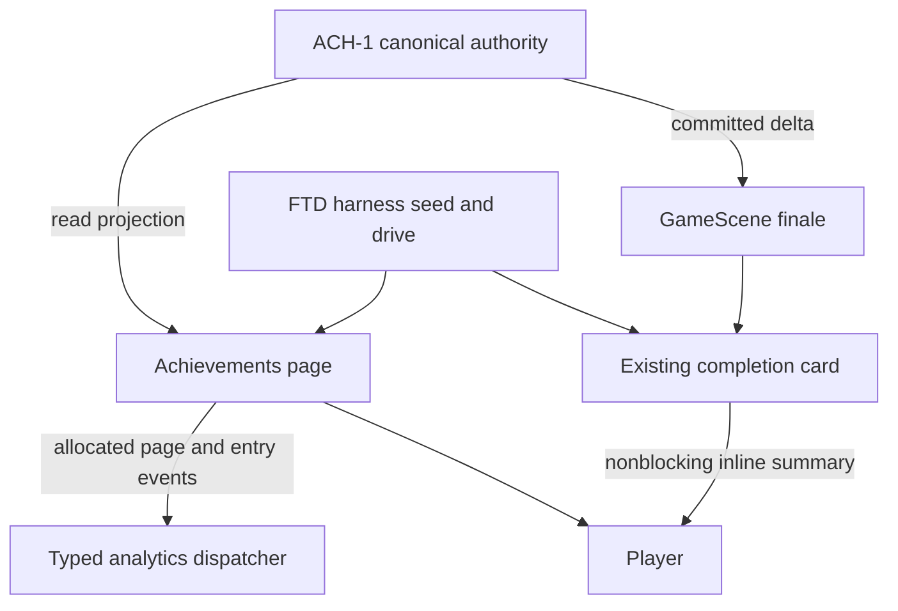
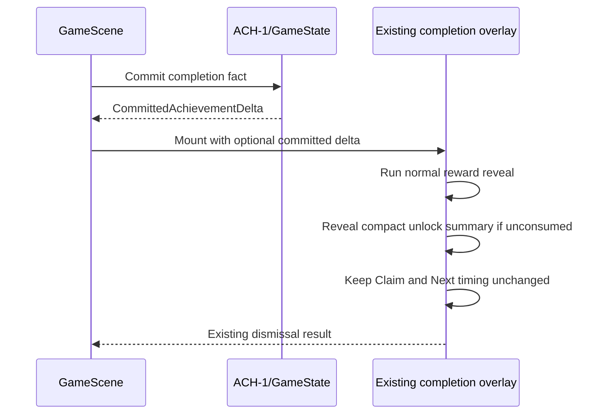
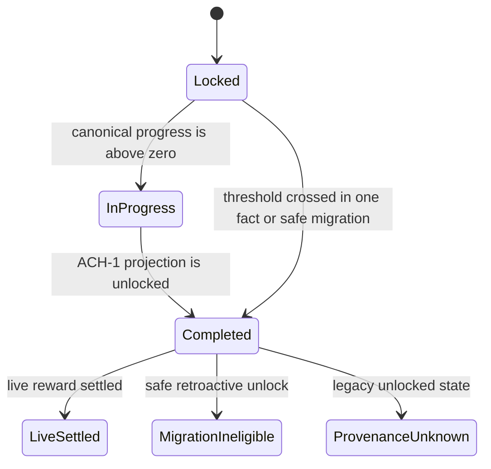

# feat: FTD Achievement Collection, Unlock Celebration, and Device Proof

## Goal Capsule

Turn ACH-1's durable achievement authority into a discoverable, accessible Find the Dog experience without creating a second source of truth.
Players can open a complete collection from the Home left rail, understand every progress and reward state, and see newly unlocked achievements inside the existing level-completion rhythm.
The implementation consumes `AchievementReadProjection`, `CommittedAchievementDelta`, and allocated achievement analytics events unchanged.
Stop and return a dependency gap if those canonical contracts cannot express a required state; do not adapt, re-declare, or mutate them.
Close-out requires new card-owned real-iPhone evidence, including a real relaunch persistence check; browser rendering is not proof.

---

## Product Contract

### Summary

Add an Achievements quick action to the existing Home left rail while preserving the three-cell Shop / Play / Settings bottom navigation.
Extend the existing full-screen Home page shell with an achievements collection that presents every catalog entry in deterministic order and communicates locked, in-progress, completed, and reward status through text and accessibility semantics.
When a completion commits one or more new unlocks, show a compact summary inside the existing completion card after the normal reward reveal without changing the Claim, Next, rate-prompt, coin-transfer, or teardown sequence.

### Problem Frame

ACH-1 now owns catalog order, durable progress, migration truth, reward settlement, committed unlock deltas, and collision-safe analytics allocation, but none of that state is visible to players.
The current Home shell has a suitable quick-action rail and reusable full-screen page shell.
The current completion flow hides sibling HUD content and carefully orders reward reveal, Claim, Next, rate prompting, and cleanup, so achievement feedback must remain within that card and must not become another modal or timing gate.

### Requirements

**Discovery and collection**

- R1. Home exposes a labeled, accessible Achievements action in the existing left rail without changing the three-cell bottom navigation.
- R2. The existing full-screen Home page shell renders every canonical achievement in deterministic catalog order with name, description, category, numeric current/target progress, state text, and one-time reward status.
- R3. Locked, in-progress, and completed meaning remains understandable without color and is exposed through useful headings, labels, progress semantics, and focus order.
- R4. The collection remains scrollable and operable across supported narrow and short phone viewports, safe areas, wrapping/localizable copy, keyboard focus, Escape/back behavior, and 44px touch targets.
- R5. Opening the page and presenting achievement entries dispatches only canonical ACH-1-allocated analytics events; allocation failure never blocks the UI.

**Completion celebration and durability**

- R6. A non-empty `CommittedAchievementDelta.newlyUnlocked` renders as a compact callout inside the existing completion card after the normal reward reveal.
- R7. Multiple unlocks use canonical catalog order and collapse into one concise summary; the callout does not add a modal, acknowledgement gate, or delay to Claim, Next, rate prompting, coin transfer, or teardown.
- R8. The celebration uses existing sound, haptic, motion, and theme conventions, and reduced-motion mode removes nonessential motion without hiding the information.
- R9. Duplicate completion presentation, retry, or relaunch does not replay a consumed unlock celebration or reward; the collection continues to show the durable completed and reward state.
- R10. Existing saves display only ACH-1's safe retroactive unlocks and honest non-derivable progress, with canonical reward-ineligible or provenance-unknown wording.

**Harness, evidence, and scope**

- R11. The FTD harness publishes deterministic `achievements` and `win-achievement` states through real drivers, predicates, snapshots, and trusted markers, with the conductor-approved narrow `bootstrap.ts` state-list wiring.
- R12. Fresh card-owned device evidence proves the collection state mix, unlock callout, navigation/back behavior, narrow/short layout, and persistence after a real app relaunch.
- R13. Generated design copy, tokens, and assets change only through their source workflow; no dependency, currency, account, cloud, social, leaderboard, battle pass, or daily mission is introduced.

### Acceptance Examples

- AE1. From Home, activating Achievements opens the existing page shell, focuses a useful page control or heading, and Back or Escape returns to the unchanged Home navigation.
- AE2. A seeded collection containing locked, partial, live-settled, migration-ineligible, and legacy-provenance-unknown entries renders all entries in catalog order with numeric progress and explicit text for each state.
- AE3. A completion that unlocks one achievement reveals one inline callout after the normal coin reward reveal while Claim remains available on its existing schedule.
- AE4. A completion that unlocks several achievements shows a deterministic compact count/summary rather than stacking cards or extending the completion timeline.
- AE5. Re-entering completion or relaunching the app after a presented unlock does not replay the callout, while the collection still shows the completed state and canonical reward status.
- AE6. With reduced motion enabled, the callout appears without its decorative animation and all content and controls remain available.
- AE7. A real-device run reaches exact `achievements` and `win-achievement` markers, captures both states, then relaunches and proves persisted progress and no replay.

### Scope Boundaries

In scope are the declared FTD Home, HUD, completion-overlay, styling, testing, design-source, reference-manifest, test, and evidence surfaces, plus the conductor-authorized narrow `games/find_the_dog/src/bootstrap.ts` tour-state wiring.
ACH-1's files remain canonical consumer dependencies and are not modified unless implementation proves an explicit contract gap and returns it upstream.
Shared tour/verify-device protocols, shared UI packages, native signing/provider configuration, unrelated games, dependencies, and lockfiles are out of scope.
The dirty July 20 evidence remains untouched and cannot satisfy this card.

---

## Planning Contract

### Key Technical Decisions

- KTD1. Read collection state only through `gameState.achievementReadProjection()` and preserve its entry order and reward truth. Group entries under category headings in stable first-category-occurrence order while preserving canonical order within each group; each card leads with name and explicit state, then description/progress, then reward status. Do not import the persisted record to derive UI state or reclassify the projection.
- KTD2. Extend `openPage` to a third `achievements` variant and strengthen that one shared shell as a modal page: labelled dialog semantics, inert/background isolation, contained focus, deterministic focus entry/return, Escape handling, and listener cleanup. This reuses the established dimmed Home navigation rather than adding a parallel overlay framework and must preserve Shop/Settings behavior.
- KTD3. Keep the Home bottom navigation byte-for-byte three-way in structure; add a second button to `.home-rail-left` beside Remove Ads and wire it through the same Home listener lifecycle.
- KTD4. Pass the completion's canonical `CommittedAchievementDelta` from `GameScene` into `LevelCompleteOverlayOptions`. After `mountLevelComplete` returns, the FTD wrapper locates its owned `#level-complete-overlay` card, inserts the callout, and observes that root's existing `data-reward-reveal="complete"` transition with one abort-cleaned `MutationObserver`. The observer disconnects on reveal, dismissal, or remount; an absent root/card/reveal transition fails silently without affecting Claim/Next. This uses the existing DOM contract and avoids shared `v1core` changes or duplicated timing constants.
- KTD5. Presentation consumption is UI-local and separate from reward settlement. At the reveal transition, synchronously check and add `CommittedAchievementDelta.occurrenceId` to an FTD UI-session guard immediately before DOM visibility, announcement, and effects. Mounting or aborting before reveal does not consume; competing observers cannot both present. The guard survives overlay teardown/remount within the running app. Characterize the production resume path to prove relaunch cannot reconstruct an old committed delta; if it can, return an ACH-1 dependency gap instead of persisting a second authority.
- KTD6. The callout never owns progression and contains no link or button. One unlock shows its canonical name plus “Achievement unlocked”; multiple unlocks show the first canonical name plus “and N more,” with all names included in the accessible announcement. Text wraps to two visible lines before the count summary takes priority. A final “View from Home” guidance line points to the persistent rail entry without replacing, covering, or gating Claim/Next; immediate collection navigation is excluded because completion mode hides sibling HUD pages and another blocking surface violates the card contract.
- KTD7. Allocate `achievement_page_viewed` once per successful ready-page open and `achievement_viewed` once per catalog entry per successful open when the ready collection is rendered, independent of scroll position; unavailable states emit neither. Reopening allocates fresh events. A newly unlocked item actually shown in the completion callout also allocates `achievement_viewed`. Dispatch each returned event unchanged through `analytics.dispatchAchievementEvent`; a null allocation is a silent analytics degradation. Do not invent a distinct unlock-presentation event locally.
- KTD8. Harness states seed canonical ACH-1 data through existing game-state test seams, drive the real Home action or completion path, and publish markers only after DOM plus snapshot predicates agree. `bootstrap.ts` supplies the two FTD-local custom states; shared protocols remain unchanged.
- KTD9. Use existing tokens and approved assets, and keep the small achievement strings as authored runtime UI copy beside the consuming markup, matching current Home/completion practice. Do not edit generated `design/copy.ts`, `design/tokens.css`, `design/assets.ts`, or `design/assets/`; if implementation proves a generated asset/token is required, stop and report the design-sheet source gap rather than hand-editing output.

### High-Level Technical Design

### Assumptions

- The card description is the complete product contract; no separate brainstorm artifact exists.
- “Access to the collection” is satisfied by the persistent Home rail entry and clear completion-callout guidance. The completion card does not open a second overlay or reroute Next.
- The live committed delta is the only celebration trigger. Relaunch restores the projection but does not recreate that delta, while an in-process occurrence-id guard covers repeated overlay mounts.
- External research is unnecessary because the repository supplies direct patterns for Home pages, completion timing, accessibility styling, harness state publication, and strict device proof.

### Sequencing and Constraints

Implement projection-to-view rendering and its accessibility tests first, then Home routing and analytics, then completion-delta presentation and replay protection.
Add harness states only after the product states have deterministic setup and observable predicates.
Run local code-health gates before any real-device capture.
Capture into `.work/collectRun/<card>-<timestamp>/`, inspect and judge every declared visual surface on the iPhone, and promote only the curated artifacts cited by the final evidence index.

---

## Implementation Units

### U1. Achievement collection view and accessible page shell

**Goal:** Render the complete canonical collection inside the existing Home page shell with honest state, progress, reward, and navigation semantics.

**Requirements:** R2-R5, R10, R13; AE1-AE2.

**Dependencies:** ACH-1 merged contract.

**Files:** `games/find_the_dog/src/ui/HUD.ts`, `games/find_the_dog/src/ui/styles.css`, `games/find_the_dog/tests/unit/achievement-collection-ui.test.ts`.

**Approach:** Add the `achievements` page variant to `openPage`, map only the ready canonical projection into category sections and semantic collection cards, and provide an honest unavailable state for persistence or pending settlement. Preserve first-occurrence category order and catalog order within each group; render category headings, name/state priority, description, numeric progress, and distinct reward-status copy. Upgrade the shared page's role/label, inert background, focus containment, initial focus, focus restoration, Escape listener lifecycle, and scroll containment narrowly enough to preserve Shop and Settings behavior. At the compact baseline of 320x568 CSS pixels, use one collection column, wrapping content, safe-area padding, and body scrolling with a non-scrolling header; no control or required status may clip. Allocate and dispatch canonical page/entry view events without blocking rendering.

**Patterns to follow:** `openPage`/`closePage` in `games/find_the_dog/src/ui/HUD.ts`, existing shop/settings page CSS in `games/find_the_dog/src/ui/styles.css`, and `achievementReadProjection()` plus `allocateAchievementViewEvent()` in `games/find_the_dog/src/core/GameState.ts`.

**Test scenarios:**

1. Covers AE2. A mixed canonical projection renders every entry in source order with name, description, category, `current/target`, progress semantics, explicit state text, and the exact canonical reward-status meaning.
2. A ready empty-or-boundary projection remains structurally valid, while `persistence-unavailable` and `settlement-pending` produce honest non-fabricated unavailable states.
3. Covers AE1. Opening focuses the page, Tab order reaches interactive controls, Escape/Back closes it, focus returns to the opener, and repeated open/close does not leak listeners.
4. Shop and Settings still render and close through the same shell after the semantic/focus changes.
5. Page-open and visible-entry analytics use allocated canonical events unchanged; allocator failure leaves the collection usable and emits no fabricated event.
6. Long names/descriptions and a 320x568 CSS-pixel fixture remain one-column and scrollable, keep safe-area edges and required progress/reward text visible, and retain 44px controls and visible focus.
7. Category headings follow stable first-occurrence order, cards preserve canonical order inside each category, and the name/state -> description/progress -> reward hierarchy is semantic as well as visual.
8. Modal focus cannot move into the dimmed Home shell; close restores the opener, and Shop/Settings retain the same background isolation after the shared-shell change.

**Verification:** DOM-level tests prove semantics, order, analytics, focus, and unavailable states; a later iPhone capture proves actual viewport behavior.

### U2. Home discovery action and unchanged bottom navigation

**Goal:** Make Achievements discoverable from the existing left rail without disturbing the Home shell's primary navigation rhythm.

**Requirements:** R1, R4-R5; AE1.

**Dependencies:** U1.

**Files:** `games/find_the_dog/src/scenes/HomeScene.ts`, `games/find_the_dog/src/ui/styles.css`, `games/find_the_dog/tests/unit/achievement-home-routing.test.ts`, `games/find_the_dog/tests/unit/shop-home-parity.test.ts`.

**Approach:** Add a labeled Achievements button as the second `.home-rail-left` action, wire it to `openPage('achievements')`, and use existing Home render/listener cleanup conventions. Style the two-action rail for safe-area, short-height, and 44px targeting while leaving `.home-nav-bar` with Shop, Play, and Settings only; at 320x568 CSS pixels, compact rail spacing without overlapping the map or bottom navigation.

**Patterns to follow:** `home-no-ads`, `home-nav-shop`, and `home-nav-settings` render/listener wiring in `games/find_the_dog/src/scenes/HomeScene.ts`.

**Test scenarios:**

1. Activating the accessible Achievements button opens the achievements page and returns focus after Back.
2. The left rail contains Remove Ads and Achievements while the bottom nav still contains exactly Shop, Play, and Settings in the same order.
3. Re-rendering Home does not duplicate Achievements listeners or controls.
4. Narrow and short viewport style assertions preserve touch-target size and prevent collision with the center map or bottom nav.

**Verification:** Routing and parity tests fail if the action moves into the bottom nav, loses its accessible label, or breaks repeat rendering.

### U3. Nonblocking completion unlock callout

**Goal:** Present newly committed unlocks inside the existing completion card without replay or interference with its established sequence.

**Requirements:** R6-R10, R13; AE3-AE6.

**Dependencies:** ACH-1 committed delta; U1 for shared state copy conventions.

**Files:** `games/find_the_dog/src/scenes/GameScene.ts`, `games/find_the_dog/src/ui/LevelCompleteOverlay.ts`, `games/find_the_dog/src/ui/styles.css`, `games/find_the_dog/tests/unit/achievement-unlock-callout.test.ts`, `games/find_the_dog/tests/unit/level-complete-confetti.test.ts`, `games/find_the_dog/tests/unit/achievement-runtime-wiring.test.ts`.

**Approach:** Thread the optional `achievementCommit` from the completion transaction into the FTD overlay wrapper unchanged. After mount, insert the callout into the owned completion card and attach one `MutationObserver` to the overlay's reward-reveal data attribute; reveal only on `complete`, and disconnect on reveal, abort/dismissal, or remount. One unlock shows its canonical name; multiple unlocks select the first canonical entry and show “and N more,” while the accessible announcement names every unlock. Keep visible copy to two wrapping lines plus the text-only “View from Home” guidance. Guard repeated presentation through a module-owned UI-session set keyed by live occurrence id before sound/haptic/motion, skip empty/already-presented deltas, allocate one canonical `achievement_viewed` event per presented unlock, and make effects idempotent and abort-safe. Missing DOM/reveal seams degrade to no callout and never modify shared `v1core` files or Claim/Next scheduling.

**Execution note:** Start with integration tests that characterize the existing reward-reveal, Claim, Next, rate-prompt, and teardown order; the new callout must fit around that proof rather than changing it.

**Patterns to follow:** `LEVEL_COMPLETE_REWARD_REVEAL_DELAY_MS`, `mountLevelComplete`, `UiHandle` cleanup, reduced-motion handling, and current confetti/audio/haptic conventions in the FTD overlay stack.

**Test scenarios:**

1. Covers AE3. One committed unlock appears only after normal reward reveal completion, fires effects once, and leaves Claim availability timing unchanged.
2. Covers AE4. Several unlocks render one deterministic bounded summary in catalog order and do not add multiple cards or timers to the completion tail.
3. Empty, progress-only, duplicate, and already-consumed deltas render no callout and fire no celebration effects.
4. Covers AE5. Dismissal before reveal does not consume; remount then presents once, and two competing reveal observers still present exactly once.
5. Characterize the production GameScene bootstrap/resume path: persisted completion state cannot regenerate or pass an old `achievementCommit`; recreated GameState and scene show no callout or reward replay while the collection remains completed. If this fails, stop on the ACH-1 contract gap.
6. Claim, Claim 2x, Next, rate prompt, coin transfer, scene shutdown, and bare dismiss retain their existing order and resolution behavior with and without a callout.
7. Covers AE6. Reduced motion removes decorative entrance motion while keeping text, accessible announcement, Claim, and Next intact.
8. Dismissal during scheduled reveal aborts effects and timers without leaking DOM or blocking scene cleanup.
9. The longest localized single name and the maximum simultaneous unlock fixture obey the two-line/count contract, expose every unlocked name to assistive technology, and add no interactive control.
10. The observer reveals only when `data-reward-reveal` becomes `complete`, disconnects on every terminal path, and a missing card/root leaves Claim, Next, and dismissal functional.
11. Each presented unlock allocates and dispatches canonical `achievement_viewed`; allocation failure neither fabricates an event nor suppresses the callout.

**Verification:** Focused integration tests prove callout ordering and non-interference against the real FTD wrapper; device evidence later proves visual timing and feel.

### U4. Deterministic harness states and tour publication

**Goal:** Make the collection and unlock celebration independently reachable and trustworthy for strict real-device capture.

**Requirements:** R11; AE7.

**Dependencies:** U1-U3.

**Files:** `games/find_the_dog/src/testing/TestHarness.ts`, `games/find_the_dog/src/bootstrap.ts`, `games/find_the_dog/tests/unit/test-harness-real-flow.test.ts`, and only if an existing FTD-local bootstrap test requires extension, `games/find_the_dog/tests/unit/bootstrap-insitu-tour.test.ts`.

**Approach:** Extend the FTD-local drive-state type/predicates, seed methods, snapshots, and drivers for `achievements` and `win-achievement`. The collection fixture includes locked, partial, and completed reward-status variants; the win fixture commits a deterministic unlock through the real ACH-1 seam and waits for the inline callout predicate. Pass the two custom states from `bootstrap.ts` into the existing generic tour option. Publish trusted markers only after the corresponding real snapshot and DOM state agree.

**Patterns to follow:** `findTheDogDrivePredicates`, `driveTo`, `snapshot()`, real-flow marker history, and `maybeRunInsituTour` custom-state options.

**Test scenarios:**

1. The `achievements` driver uses the Home action and reaches a projection-backed collection whose snapshot predicate rejects Home, Settings, and incomplete rendering.
2. The `win-achievement` driver commits a real deterministic unlock and does not pass until the completion overlay and inline callout are both visible.
3. The two states publish exact trusted and `-DONE` markers in configured order; a failed predicate publishes `-FAILED` and cannot be treated as captured.
4. Repeating either driver resets or reseeds safely without reward duplication, stale DOM, or nondeterministic ordering.
5. Existing menu, level, settings, pause, win, and fail predicates and tour behavior remain green.

**Verification:** The real-harness unit fixture proves reachability and marker truth; browser-only capture is not used as close-out evidence.

### U5. Curated real-device evidence and relaunch proof

**Goal:** Produce fresh, judged iPhone evidence for every declared achievement surface and persistence behavior.

**Requirements:** R4, R8-R12; AE1-AE7.

**Dependencies:** U1-U4 and green local gates.

**Files:** `.work/collectRun/gdUIHVjO-<timestamp>/`, `games/find_the_dog/refs/manifest.yaml`, `games/find_the_dog/evidence/2026-07-21-achievements/README.md`, and curated PNG/JSON/report artifacts under `games/find_the_dog/evidence/2026-07-21-achievements/`.

**Approach:** Run strict device verification against the real iPhone with an explicit `.work/collectRun/` output. Capture Home discovery, the collection with mixed states, locked/partial/completed detail, the inline unlock summary, Back/Escape-equivalent device navigation, and short/narrow layout. After an unlock, terminate the real app, relaunch it without a harness reseed, observe the completion surface for the harness-defined negative dwell window with the callout predicate false, then navigate to the collection and capture the persisted completed state. Judge all declared Visual surfaces against the card's review contract, update the FTD manifest only where the new named states require selected references, and copy only cited review artifacts into the evidence directory.

**Execution note:** Device capture and direct screenshot inspection are the proof; never promote a capture merely because the runner exited successfully.

**Patterns to follow:** `games/find_the_dog/evidence/README.md`, `games/find_the_dog/refs/manifest.yaml`, `tools/verify-device/README.md`, and the marker-gated evidence conventions in `docs/plans/2026-07-20-001-ftd-insitu-tour-state-coverage-device-reference-seeding-plan.md`.

**Test scenarios:** Test expectation: none - this unit validates the integrated runtime on hardware and curates evidence rather than adding code behavior.

**Verification:** The curated index names each source run and capture, includes the inspected collection and unlock screenshots, records viewport/safe-area details, and documents a real relaunch sequence showing durable state and no replay. Any blind, stale, browser, simulator, or July 20 artifact is rejected.

---

## Verification Contract

| Gate | Applies after | Required signal |
|---|---|---|
| `npm run typecheck -w @fabrikav2/find_the_dog` | U1-U4 | FTD TypeScript compiles with canonical ACH-1 imports and no adapted types. |
| `npm run test:unit -w @fabrikav2/find_the_dog` | U1-U4 | Collection, routing, analytics, completion sequencing, replay, reduced-motion, persistence, and harness cases pass. |
| `npm run audit` | U4-U5 | Repository audit accepts harness, manifest, design authority, and evidence shape. |
| `npm run verify-device -- --game find_the_dog --strict` | U5 | The real iPhone produces trusted achievement markers and inspected captures with no strict failure. |
| `git diff --check` | All units | The final scoped diff has no whitespace errors. |

Browser Playwright checks may be run only as explicit diagnostics and are never reported as device proof.
Verification must inspect the actual iPhone screenshots and relaunch sequence, not infer success from build, install, launch, or command exit.

---

## Definition of Done

- U1 is done when every canonical achievement and reward status renders accessibly in the reused page shell, analytics use allocated events unchanged, and Shop/Settings semantics remain intact.
- U2 is done when the left rail exposes Achievements and tests prove the bottom navigation is still exactly Shop / Play / Settings.
- U3 is done when one or many committed unlocks produce one nonblocking inline summary at the correct reveal point, all existing completion paths retain their order, and replay/relaunch tests are green.
- U4 is done when real FTD drivers and predicates publish trusted `achievements` and `win-achievement` markers through the conductor-authorized bootstrap seam without shared protocol changes.
- U5 is done when fresh curated iPhone evidence proves collection states, unlock celebration, navigation, narrow/short layout, and post-relaunch persistence/no replay.
- All Verification Contract gates pass; generated outputs were changed only through their source workflow; no out-of-scope file, dependency, protocol, or authority changed.
- Abandoned experiments, uncited scratch captures, duplicated contracts, and dead presentation code are absent from the final diff.
