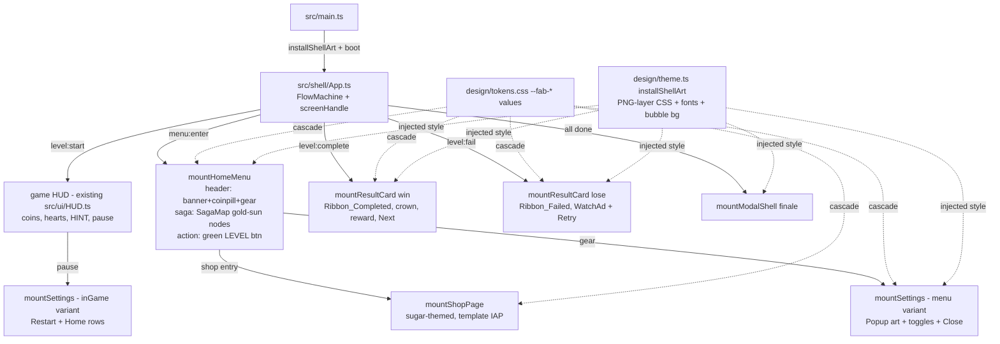

# feat: Rebuild Marble Run shell screens on @fabrikav2/ui, pixel-matched to v1

## Summary

Replace Marble Run's shell_template Phaser-scene shell (`HomeScene` + v1core overlays) with `@fabrikav2/ui` mounts — HomeMenu/SagaMap, SettingsPage/ModalShell, ShopPage, ResultCard, Button — themed via `--fab-*` tokens plus an `installShellArt()` style layer to reproduce v1 Sugar3D's exact look: purple bubble background, Vida PNG-layer chrome (Popup/Ribbon/Button art), gold sun level nodes, green LEVEL button, HINT button, coin pill. Follow the `games/arrow` shell pattern. Scope fence: `games/marble_run/src/**` + `games/marble_run/design/**`; **zero `packages/ui` edits**.

---

## Problem Frame

The MRV2 rebuild requires fabrikav2/games/marble_run to be a pixel-faithful replica of fabrika v1 sugar3d. MRV2-1 scaffolded the game from shell_template (FTD-styled Phaser shell); MRV2-3 ported all 58 v1 assets to `games/marble_run/public/v1/ui/**` (verified by `docs/asset-manifest.json`). The shell screens still render the template's FTD look via `src/scenes/HomeScene.ts` + `src/ui/ftdTheme.ts` + vendored `src/v1core/ui`. This card rebuilds them on `@fabrikav2/ui` to v1's exact appearance. Pixel parity is judged downstream by the conductor's Pixelsmith gate on device; this card's bar is: correct components, correct theme values, every screen reachable and demo-able in dev, typecheck + unit green.

## Requirements

- R1: Home screen = HomeMenu composing SagaMap, matching v1 menu: coin pill (Frame_Currency + Icon_Coin), settings gear (Button_Settins + Icon_Settings), title banner (`marble-run-banner.webp`), green LEVEL button (Button_Green), bottom-anchored saga map with gold sun nodes (`level-node-*.webp`) and candy-striped rail.
- R2: Settings surface matching v1's settings modal (Popup.png card, Ribbon_Orange header, white translucent toggle rows, green/grey pill switches, Music/Sound Effects/Haptics), with menu variant (Close) and in-game variant (Restart + Home).
- R3: Pause behavior matches v1: HUD pause opens the in-game settings surface. (v1 has **no separate pause menu** — see KTD2.)
- R4: Win result = ResultCard win variant: Popup body, Ribbon_Completed + glare, green "Level N", crown, Txt_Reward, coin reward row, green Next button (Txt_Next). Lose = ResultCard lose variant: Ribbon_Failed, Icon_Failed, red "Level N", blue message, Watch Ad (green) + Retry (orange) buttons. Finale modal (Ribbon_Orange "Complete", "All marbles sorted!", green Awesome button).
- R5: Shop = ShopPage themed in the same Sugar/Vida language. **v1 has no shop screen** (see KTD3) — no pixel-parity target exists; visual bar is theme-consistency, not parity.
- R6: Purple bubble background (`#9b7bcd → #6b568e` gradient + animated `marble-shadow-tile.png` at 0.46) and v1 fonts (FredokaOne display, LilitaOne level, TitanOne number) applied shell-wide.
- R7: All screens reachable in `npm run dev` (menu → play → pause/settings → win/lose → shop), typecheck + unit tests green.
- R8: No edits to `packages/ui/**`; theming only through the supported surface (tokens, props, game-local CSS on game-owned wrapper class à la arrow's `installLevelMapArt`). Where the supported surface cannot reach parity, record the gap for SURPRISES with a repro — do not fork or hack.

## Key Technical Decisions

- **KTD1 — Arrow pattern, global wrapper theming.** Model the new shell on `games/arrow/src/shell/App.ts`: a shell App owning a FlowMachine and one screen handle; `clearScreen()` then mount next. Theme via a game class on the `#ui` root + `design/tokens.css` `--fab-*` values cascading into `.fab-ui`, plus `design/theme.ts` `installShellArt()` injecting the art-layer CSS tokens can't express (PNG frames, absolute layer positioning, animations). This is kit-supported (arrow precedent), not wrapper-CSS hacking of kit internals: it sets tokens and styles game-owned slot elements.
- **KTD2 — Pause = settings modal (fidelity over component list).** v1 has no PauseOverlay; the HUD pause button opens the settings card with Restart/Home rows (`sugar3d/src/ui/dom.ts:216-220`, `src/shell/settings.ts:54-72`). Reproduce that: one settings surface with `inGame` variant. The kit's PauseOverlay component is **not used** — using it would add a screen v1 never had. Record this deviation from the card's component list in the handoff.
- **KTD3 — Shop has no v1 canonical.** The card lists ShopPage but v1 sugar3d ships no shop (confirmed: no shop code/route/assets in v1). Build a minimal ShopPage using the template's existing IAP wiring and coin/hint pack assets, themed with the sugar tokens. Flag in SURPRISES that the Pixelsmith gate has no v1 reference frame for this screen.
- **KTD4 — Vida PNG-layer system is the target, not the legacy CSS gradients.** v1 has two styling generations; live screens use the `.vida-*` PNG layers (`style.css:1713-2499`). Match those; use gradient values only where no art overrides them (`.dim` scrim `rgba(17,14,18,0.66)`, switch colors `#7d879a` / `#55f464→#10b535`, settings-row `rgba(255,255,255,0.54)`).
- **KTD5 — Assets referenced from the MRV2-3 port.** All art/fonts load from `games/marble_run/public/v1/ui/**` (e.g. `/v1/ui/vida/End/Win/Button_Green.png`, `/v1/ui/fonts/TitanOne.ttf`). Do not re-copy assets into `design/assets/`; the manifest test guards the ported tree.
- **KTD6 — Wooden board preview is out of this card.** v1's menu backdrop is a live Three.js board (`App.showMenuDecor`). The gameplay-port card owns the 3D scene; this card leaves the existing scaffold canvas behind the DOM shell and notes the dependency. If no board renders behind the menu yet, state it as a known parity gap for the conductor.

## High-Level Technical Design

Prose is authoritative; the flow edges follow arrow's `App.ts` FlowMachine wiring adapted to marble_run's existing scaffold seams.

---

## Implementation Units

### U1. Sugar theme foundation: tokens, fonts, background, art layer

**Goal:** All v1 visual constants available to every screen: `design/theme.ts` (asset URL map into `/v1/ui/**` + `installShellArt(doc)`) and rewritten `design/tokens.css` (sugar `--fab-*` values, `@font-face` FredokaOne/LilitaOne/TitanOne, purple bubble body background + shadow-tile overlay, `.marble-ui` wrapper rules).
**Requirements:** R6, R8, feeds R1-R5.
**Dependencies:** none.
**Files:** `games/marble_run/design/theme.ts` (new), `games/marble_run/design/tokens.css` (rewrite), `games/marble_run/index.html` (add wrapper class on `#ui`), `games/marble_run/tests/unit/shell-theme.test.ts` (new).
**Approach:** Mirror `games/arrow/design/theme.ts` / `tokens.css`. Port the SagaMap tokens from v1 `sugar3d/src/shell/shellTheme.ts` verbatim (`--fab-levelmap-art-*` → `/v1/ui/level-node-*.webp`, colors `#6a3016`/`#5b4636`, sizes 76/142px with the menu-mount smaller overrides 56/100px from v1 `style.css:1050-1062`). Copy v1 palette hexes and radii from `sugar3d/src/ui/style.css:24-65`. Pin the shell-default overrides arrow/FTD needed (`--fab-modal-backdrop-padding:0`, `--fab-modal-*-animation:none`, `--fab-btn-line-height:normal`) as applicable.
**Patterns to follow:** `games/arrow/design/theme.ts`, `games/arrow/design/tokens.css`, `games/marble_run/src/ui/ftdTheme.ts` (token vocabulary being replaced).
**Test scenarios:** `installShellArt(document)` injects exactly one style element (idempotent on second call); asset URL map entries all begin `/v1/ui/` and every mapped file exists on disk under `public` (guards typo'd paths against the MRV2-3 manifest tree); tokens.css parses and defines the four `--fab-levelmap-art-*` vars.
**Verification:** dev server shows purple bubble background with animated tile; fonts load (no fallback serif).

### U2. Shell App + home menu (HomeMenu + SagaMap)

**Goal:** New `src/shell/App.ts` (arrow pattern) rendering the v1 home menu: banner header, coin pill, gear, green LEVEL button, bottom-anchored gold-sun saga map; replaces `HomeScene`'s v1core mounts as the menu surface.
**Requirements:** R1, R7.
**Dependencies:** U1.
**Files:** `games/marble_run/src/shell/App.ts` (new), `games/marble_run/src/shell/saga.ts` (new — port of v1 `buildSagaNodes` windowing `{ahead:4, behind:0}` from `sugar3d/src/shell/saga.ts`), `games/marble_run/src/scenes/HomeScene.ts` (strip v1core menu UI, delegate to shell App), `games/marble_run/src/main.ts` + `src/bootstrap.ts` (wire App, drop `v1core/ui` CSS import once unused), `games/marble_run/tests/unit/shell-home.test.ts` (new), `games/marble_run/tests/unit/shell-saga.test.ts` (new).
**Approach:** `mountHomeMenu({header, saga:{state, actions, loadingLabel}, actions:[LEVEL button]})`. Header is a game-owned fresh element carrying banner ``, coin pill, and gear (styled by U1's art CSS). SagaMap gets nodes from the ported `buildSagaNodes`; locked-node taps trigger the shake-reject affordance (v1 `dom.ts:182-189`) in the game handler since SagaMap fires `onSelectLevel` for every node. Gear opens U3's settings; LEVEL starts the current level through the existing scaffold flow.
**Test scenarios:** `buildSagaNodes` — fresh save yields level 1 current + 4 ahead locked, 0 behind; mid-progress yields completed/current/locked statuses matching v1's windowing; mount test (jsdom) — home mounts with a `.fab-ui` SagaMap, a LEVEL action button whose label is `Level N`, coin pill showing save coins; tapping a locked node calls no start-level action and applies the reject class; tapping the current node invokes the start action with its id.
**Verification:** dev menu visually shows all five chrome elements and nodes render the webp art.

### U3. Settings / pause surface

**Goal:** One settings surface matching v1's modal (Popup card, orange ribbon, three toggle rows, green switches), with `inGame` variant (Restart + Home, opened by HUD pause) and menu variant (Close), per KTD2.
**Requirements:** R2, R3, R7.
**Dependencies:** U1, U2 (App owns mounting).
**Files:** `games/marble_run/src/shell/settings.ts` (new — port v1 `sugar3d/src/shell/settings.ts` row/action read-model), `games/marble_run/src/shell/App.ts` (extend), `games/marble_run/src/ui/HUD.ts` (pause button routes to shell settings instead of `openPage('settings')`), `games/marble_run/tests/unit/shell-settings.test.ts` (new).
**Approach:** Use SettingsPage for toggle rows if its themed look can reach the v1 modal card; otherwise compose ModalShell (`cardImage:` Popup.png, `ribbon:` Ribbon_Orange, close button art Button_Settins) + ToggleRow-equivalent rows, as arrow does (`games/arrow/src/shell/App.ts` `openSettings()`). Decide at implementation by rendering both; prefer whichever reproduces the art card without fighting defaults, and record the loser and why. Toggles bind to the scaffold's existing audio/haptics settings store.
**Test scenarios:** menu variant renders Music/Sound Effects/Haptics rows and a Close action, no Restart/Home; inGame variant renders Restart + Home; toggling a row flips the persisted setting and the switch state; Restart invokes the restart callback; dismiss resumes (callback fired once).
**Verification:** in dev, gear (menu) and pause (in game) both open the modal with correct action rows.

### U4. Win / lose result cards + finale

**Goal:** ResultCard win and lose variants and the finale modal, layered per v1's Vida art specs.
**Requirements:** R4, R7.
**Dependencies:** U1, U2.
**Files:** `games/marble_run/src/shell/App.ts` (extend), `games/marble_run/src/ui/LevelCompleteOverlay.ts` + `LevelFailedOverlay.ts` (retire/replace as the mount path — keep file removal surgical), `games/marble_run/tests/unit/shell-results.test.ts` (new).
**Approach:** `mountResultCard({variant:'win', ribbonImage: Ribbon_Completed, cardImage: Popup, art: crown/glare/reward layers, rewardDisplay: coin row, actions:[Next (Button_Green + Txt_Next, or 'Finish' when last)]})`; lose: Ribbon_Failed, Icon_Failed art, messages ("No hearts left! / Watch an ad to continue."), actions Watch Ad (green) + Retry (orange), with a loading label swap on Watch Ad. Finale via ModalShell (Ribbon_Orange, "All marbles sorted!", Awesome button). Coin fly-to-balance animation: reuse the scaffold's `EconomyTransfer.ts` if it fits; otherwise defer the flight animation to a follow-up and keep the static reward row (note in handoff — animation fidelity is judged on device anyway).
**Test scenarios:** win mount shows `Level N`, reward `+N`, and Next; last-level win shows Finish and completing it routes to finale; lose mount shows both Watch Ad and Retry, Retry restarts, Watch Ad triggers the ad callback and enters loading state; dismiss/back routes to menu.
**Verification:** dev: complete and fail a level; both cards render with art layers positioned.

### U5. Shop page (no v1 canonical — theme-consistent build)

**Goal:** ShopPage reachable from the shell, themed with the sugar tokens, using the template's IAP service and existing coin/hint pack art, per KTD3.
**Requirements:** R5, R7.
**Dependencies:** U1, U2.
**Files:** `games/marble_run/src/shell/App.ts` or `src/ui/HUD.ts` (entry point — keep the template's existing shop entry), `games/marble_run/src/shell/shop.ts` (new — sections/copy config), `games/marble_run/tests/unit/shell-shop.test.ts` (new).
**Approach:** `mountShopPage({iap, sections, copy, theme})` with the scaffold's IAP wiring and `design/assets/shop_*.png` icons. Visual bar: consistent with the sugar theme (Fredoka headings, wood/candy panel tokens). Do not invent a fake "v1 shop look".
**Test scenarios:** shop mounts with the configured sections and item labels; purchase action delegates to the IAP service stub; restore action fires `onRestore`.
**Verification:** shop reachable in dev and renders themed.

### U6. Retire dead template shell + code health gate

**Goal:** Old FTD shell paths no longer reachable or shipped; repo health green.
**Requirements:** R7, R8.
**Dependencies:** U2-U5.
**Files:** `games/marble_run/src/ui/ftdTheme.ts` (remove), `games/marble_run/src/v1core/**` (remove if nothing references it after U2-U4 — check imports first; if gameplay still needs pieces, remove only the shell UI parts), stale template tests (`tests/unit/test-harness-real-flow.test.ts` — update or replace to drive the new shell), `games/marble_run/package.json` untouched.
**Approach:** Grep-driven removal only of what the new shell orphaned; run `npx knip` and `npx eslint .` per repo policy; keep the asset-manifest test green (do not touch `public/v1/**`).
**Test scenarios:** Test expectation: unit suites from U1-U5 plus updated flow test are the coverage; this unit's own change is deletion/config.
**Verification:** `npm run typecheck`, `npm run test:unit`, `npx eslint .` all green in `games/marble_run`; dev boot shows no 404s for removed assets/modules.

---

## Scope Boundaries

**In scope:** `games/marble_run/src/**`, `games/marble_run/design/**`, `games/marble_run/index.html`, `games/marble_run/tests/**`, `docs/plans/` (this file).

**Out of scope / non-goals:** any `packages/ui/**` edit (kit blast radius — separate card); gameplay/3D board port (other MRV2 cards; KTD6); v1 finale/debug-panel/tutorial-hand beyond what's listed; visual "improvements" of any kind; browser e2e as verification.

### Deferred to Follow-Up Work
- Coin fly-to-balance animation if `EconomyTransfer.ts` doesn't map cleanly (U4 note).
- Live wooden board preview behind the menu (gameplay card; KTD6).
- Any kit-parity gap discovered during theming → SURPRISES with repro, potential kit card.

## Open Questions / Deferred to Implementation

- SettingsPage vs ModalShell composition for the settings card (U3 decides by rendering both).
- Whether `v1core` can be fully deleted in U6 or gameplay still imports parts (check at implementation).
- Exact per-layer percentage positioning of the Vida result-card layers — tune in dev against v1 screenshots; final judgment is the conductor's on-device Pixelsmith gate.

## Verification Contract

- `npm run typecheck` and `npm run test:unit` green in `games/marble_run`; `npx eslint .` clean.
- Every screen demo-able in `npm run dev`: menu (banner, coin pill, gear, LEVEL, gold-sun saga) → settings (both variants) → win → lose → finale → shop.
- **Unverified by this card (state in handoff):** on-device pixel parity — conductor's Pixelsmith gate owns it. Browser renders are never presented as device verification.

## Definition of Done

All units landed on the card branch; Verification Contract green; deviations recorded (KTD2 pause-as-settings, KTD3 no-v1-shop, any parity gaps) in the handoff SURPRISES; no `packages/ui` diffs; no PR opened.

## Sources & Research

- v1 canonical: `fabrika/games/marble_run/sugar3d/src/ui/dom.ts`, `src/ui/style.css`, `src/shell/{saga,settings,shellTheme}.ts` (surveyed 2026-07-22; screen inventory, hexes, and layer specs cited inline above).
- v2 kit surface: `packages/ui/src/*.ts` option types + `ui.css` token vocabulary (read-only).
- Exemplar: `games/arrow/src/shell/App.ts`, `games/arrow/design/{theme.ts,tokens.css}`.
- Ported assets: `games/marble_run/public/v1/ui/**` + `games/marble_run/docs/asset-manifest.json` (MRV2-3, commit 7562e0b5).
