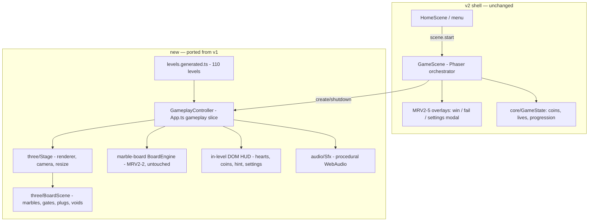

# feat: MRV2-4 port Sugar3D gameplay scene (board renderer + HUD) pixel-faithful

## Summary

Replace the FTD Win/Lose stub inner game inside `games/marble_run/src/scenes/GameScene.ts` with the v1 Sugar3D gameplay stack, ported as-is for fidelity: the three.js renderer (`Stage`, `BoardScene`, `ModelerSpec`), the gameplay slice of v1 `App.ts` (level run loop, pointer input with tap assist and long-press routing, hint, win/fail detection), and the v1 in-level DOM HUD (hearts, coins, hint button, settings button). Shell seams established by MRV2-5 (overlays, economy, settings modal, analytics/ads) stay intact. Exit bar: typecheck + unit lanes green, game boots to a playable level in dev. On-device pixel parity is the conductor's Pixelsmith gate — explicitly NOT claimed by this card.

**Canonical v1 source** (read-only input, outside this repo's fence): `fabrika/games/marble_run/sugar3d/src/` — `three/` (2,189 lines), `App.ts` (725), `ui/dom.ts` (731) + `ui/style.css` (2,516), `core/Constants.ts`, `audio/Sfx.ts`.

---

## Problem Frame

MRV2-1/2/3/5 delivered the scaffold, the byte-identical `src/marble-board` engine + 110 generated levels (`src/levels/levels.generated.ts`), the v1 asset port, and sugar-themed shell screens. The in-level screen is still the FTD stub: a Phaser-rendered WIN/LOSE button pair (`GameScene.ts` "stub scene body"). This card fills that slot with the real gameplay experience. The "new components" mandate applies to shell screens only; the in-level renderer ports verbatim — fidelity wins.

## Requirements

- R1: 3D board renders with the same three.js pipeline as v1 — same materials, lighting, camera (dimetric, `GAMEPLAY_CAMERA_GROUND_ANGLE_DEG`), marble/gate/plug/void visuals.
- R2: Gameplay input matches v1 — tap-to-route with tap assist radius, precise-blocked-hit assist, long-press route preview, pointer capture semantics.
- R3: In-level HUD matches v1 pixel-for-pixel — hearts (vida frame), coin counter, hint button (cost badge, disabled state), settings button.
- R4: Win/fail/level-progression flows through the existing v2 shell seams (MRV2-5 overlays, economy, saga progression), not a parallel path.
- R5: Worker verification = typecheck + unit green + boots to a playable level in dev. Visual parity on device is unverified at handoff and stated as such.

## Key Technical Decisions

- **KTD1 — Verbatim port, minimal-diff imports.** Copy `three/Stage.ts`, `three/BoardScene.ts`, `three/ModelerSpec.ts` into `games/marble_run/src/three/` unchanged except import-path rewrites (`./engine/*` → `../marble-board/*`, v1 `core/Constants` → a new `src/three`-adjacent constants module). Same recipe MRV2-2 used for the engine ("import-path lines only"). Any forced semantic edit is a fidelity risk and must be listed in the handoff.
- **KTD2 — GameScene stays the Phaser shell orchestrator; gameplay renders on its own three.js canvas + DOM HUD layered over it.** MRV2-5 set the pattern: "surgical DOM swap inside the existing Phaser scenes." A new `GameplayController` (the gameplay slice of v1 `App.ts`) owns Stage/BoardScene/input/HUD lifecycle; `GameScene.create()` mounts it, `shutdown` disposes it. The Phaser stub body is deleted; the Phaser canvas stays underneath for scene-machine continuity (it renders nothing during gameplay). Rejected alternative: replacing GameScene with a non-Phaser screen — that would break the shell's scene machine, transition covers, and lifecycle hooks for no fidelity gain.
- **KTD3 — Port v1 HUD DOM as-is, not @fabrikav2/ui.** v1's in-level HUD is bespoke vida-asset chrome (`Frame_Goals`, `Button_Booster`, `Frame_Currency`, heart glyphs) with hand-tuned CSS. The card allows @fabrikav2/ui only where pixel-identical; nothing in the kit reproduces this chrome, so the HUD ports verbatim (the game-HUD slice of `ui/dom.ts` + the matching `style.css` slice + vida asset imports). Note this in the handoff per the card.
- **KTD4 — Port `audio/Sfx.ts` (procedural WebAudio, zero-dep) rather than strip audio calls out of the ported gameplay code.** The v1 gameplay loop calls `absorbPlop`/`thud`/`heartBreak`/`winFanfare` inline; stripping them is a larger, riskier diff than carrying the 245-line self-contained module. Music and menu audio stay out of scope.
- **KTD5 — Add `three@^0.180.0` to `games/marble_run/package.json`** — the exact v1 pin. This is a dependency addition inside the card's mandate ("same three.js pipeline"); flag it in the handoff for the conductor.
- **KTD6 — Level source is `src/levels/levels.generated.ts` keyed by shell progression; FTD's manifest-based `data/levels.ts` path is bypassed for gameplay.** The MRV2-2 levels are the byte-identical ground truth. GameScene's current FTD `loadLevel`/manifest imports are removed from the gameplay path (left in place elsewhere if other shell code still imports them — no cleanup crusade).
- **KTD7 — Hearts/coins state lives in the v2 shell (`core/GameState` + MRV2-5 economy wiring), not v1 `SaveState`.** v1 `SaveState` is not ported; the controller reads/writes lives and coins through the existing shell state so overlays, saga, and economy transfer keep working. Constants (`HINT_COIN_COST`, `LEVEL_COIN_REWARD`, hearts count) come from the v1 values verbatim.

## Scope Boundaries

**In scope:** `games/marble_run/src/**` (new `three/`, `gameplay/`, HUD swap in `ui/`, `scenes/GameScene.ts` glue), `games/marble_run/package.json` + root `package-lock.json` (three dep), `games/marble_run/tests/unit/**`.

**Out of scope / deferred:** menu decor board (v1 `decorBoard` behind the home menu — shell screen territory, MRV2-5's parity-gaps doc owns it), v1 `Music.ts`, v1 debug panel / four-finger debug gesture (port only if it falls out for free; otherwise note as gap), shop/fail-continue offers (conductor ruled no v1 shop), device capture/parity claims, any other game or shared package. Anything outside the fence is a SURPRISES item.

---

## High-Level Technical Design

Data flow per run: GameScene hands the controller a level index from shell progression → controller builds `BoardEngine` from `LEVELS[i]`, one `BoardScene` per run on the Stage → pointer events on the three canvas resolve to cells (tap assist) → engine `TapChange`s animate in BoardScene → win/fail callbacks fire back into GameScene, which drives the MRV2-5 overlays and economy.

---

## Implementation Units

### U1. three.js renderer port + constants

**Goal:** `src/three/{Stage,BoardScene,ModelerSpec}.ts` exist verbatim from v1 and typecheck against `src/marble-board`.

**Requirements:** R1. **Dependencies:** none (MRV2-2 already merged).

**Files:** `games/marble_run/src/three/Stage.ts`, `src/three/BoardScene.ts`, `src/three/ModelerSpec.ts`, `src/three/constants.ts` (the v1 `core/Constants.ts` values the renderer/gameplay need: `W3D`, camera angles, `CameraMode`, `HINT_COIN_COST`, `LEVEL_COIN_REWARD`, `LEVEL_COUNT`, `LONG_PRESS_ROUTE_MS`), `games/marble_run/package.json`, root `package-lock.json`.

**Approach:** Copy the three files unchanged; rewrite only import lines (`../engine/*` → `../marble-board/*`, `../core/Constants` → `./constants`). Add `three@^0.180.0` + `@types/three` if v1 uses it (check v1 devDeps), `npm install` from root. Do NOT rename the existing v2 `src/core/Constants.ts` (Phaser shell constants) — the new module lives beside the renderer to avoid a collision.

**Test scenarios:** Test expectation: none — verbatim copy; behavior is proven by U2's run loop and existing marble-board tests. Verification: `npm run typecheck -w @fabrikav2/marble_run` green; `diff` of each ported file against v1 shows import-line changes only (attach the diff summary to the handoff).

### U2. GameplayController — v1 App.ts gameplay slice + Sfx

**Goal:** A mountable controller reproducing v1's level-run behavior: engine + BoardScene per run, rAF loop, pointer input (tap assist radius 46px, precise-blocked-hit assist, long-press route preview, pointer capture/cancel semantics), hint flow, tutorial nudge for level 1 if v1 gates it, win/fail detection with the v1 modal timing delays.

**Requirements:** R1, R2. **Dependencies:** U1.

**Files:** `games/marble_run/src/gameplay/GameplayController.ts` (extracted gameplay slice of v1 `App.ts`), `src/audio/Sfx.ts` (v1 copy, `saveState` import replaced by a mute/settings hook into v2 state per KTD7), `tests/unit/gameplay-controller.test.ts`.

**Approach:** Extraction, not rewrite: carry v1's methods and constants (`TAP_ASSIST_RADIUS_PX`, `PRECISE_BLOCKED_HIT_*`, pending-pointer state machine) with names intact; drop menu/decor/debug-panel/screen-routing branches (shell owns screens now). The controller exposes v1-shaped callbacks outward (`onWin(levelId, coinsEarned)`, `onFail`, `onHeartsChanged`, `onHintUsed`) and takes injected shell state (coins/lives read + spend). Haptics: map v1 `safeImpact`/`safeNotification` calls to the v2 `haptics/HapticsManager` equivalents (one-line adapter, keep call sites identical).

**Execution note:** Any v1 branch that must be dropped or adapted (SaveState, ads-save flow, shop) gets a one-line inventory in the handoff — the fidelity audit trail the card demands.

**Test scenarios (jsdom, mock Stage/BoardScene render calls):** (1) mounting with level 1 builds a BoardEngine from `LEVELS[0]` and creates one BoardScene; (2) a tap on a routable cell applies the engine change and plays the absorb cue path; (3) tap assist: a pointer within 46px of a legal cell but outside it resolves to that cell, one farther away does not; (4) losing the last heart fires `onFail` after the v1 fail-modal delay; (5) clearing the board fires `onWin` with the v1 coin reward; (6) hint with `coins >= HINT_COIN_COST` invokes the spend hook and shows the hint, with fewer coins it does not; (7) unmount disposes BoardScene/Stage handles and cancels timers (no rAF leak).

**Verification:** unit lane green; scenarios above pass without touching `src/marble-board` files.

### U3. In-level HUD port

**Goal:** The v1 game HUD chrome — hearts in vida goals frame, coin counter in vida currency frame, hint button with cost badge + disabled state, settings button — rendered pixel-faithful as a DOM layer during gameplay.

**Requirements:** R3. **Dependencies:** U2 (callbacks), MRV2-3 assets (vida images already under the game's asset tree — locate the ported paths before writing imports; if any vida GameScreen asset is missing, that's a SURPRISES item, not a re-export).

**Files:** `games/marble_run/src/gameplay/hud.ts` (game-HUD slice of v1 `ui/dom.ts`: `showGameHud`, heart update/loss animation, hint enable/disable), `src/gameplay/hud.css` (matching slice of v1 `style.css`, scoped so it cannot bleed into MRV2-5 shell screens), `tests/unit/gameplay-hud.test.ts`.

**Approach:** Port the markup and CSS verbatim per KTD3. The existing FTD `src/ui/HUD.ts` (1,423 lines) is NOT edited or reused for chrome; GameScene stops calling its FTD visual surface during gameplay but its callback registry seams (`setHintCallback` etc.) may remain as pass-throughs if the shell depends on them — smallest diff wins. Settings button opens the MRV2-5 in-game settings modal (Restart+Home variant).

**Test scenarios (jsdom):** (1) HUD renders N heart glyphs for N hearts and updates on heart loss; (2) hint button disabled when coins < `HINT_COIN_COST`, enabled at/above, click fires the hint callback once; (3) coin counter reflects injected coin value and updates on change; (4) settings button invokes the settings-modal opener; (5) HUD unmount removes its DOM nodes.

**Verification:** unit lane green; manual dev-boot eyeball that chrome uses the vida art (screenshot in handoff as dev-only evidence, explicitly not parity proof).

### U4. GameScene integration — stub out, gameplay in

**Goal:** GameScene boots the ported gameplay: Play from home lands on a real level; win/fail route through MRV2-5 overlays and shell economy; the FTD stub body and stub buttons are gone.

**Requirements:** R4, R5. **Dependencies:** U1–U3.

**Files:** `games/marble_run/src/scenes/GameScene.ts`, `src/core/GameState.ts` (only if lives/coins fields need marble-run values — hearts count, level reward), `tests/unit/gameplay-scene-wiring.test.ts` (or extend existing scene tests).

**Approach:** In `create()`: show transition cover per existing flow, resolve level index from shell progression (KTD6 — `LEVELS[index]`, not the FTD manifest loader), mount `GameplayController` + HUD, keep lifecycle hooks (`registerLifecycleHooks`, pause/visibility) wired to controller pause. Delete the stub scene body (`makeStubButton`, stub textures, stub win/lose). Map `onWin` → existing `winLevel()` path (overlay, economy, analytics, saga advance) and `onFail` → existing fail path minus shop offers per conductor ruling; preserve the analytics/attribution calls that wrap them. `shutdown`/`destroy` unmounts controller + HUD.

**Test scenarios:** (1) scene create with progression at level k mounts controller with `LEVELS[k-1]`; (2) controller `onWin` triggers the level-complete overlay path and coin grant exactly once; (3) `onFail` triggers the failed overlay path; (4) scene shutdown unmounts controller and HUD (idempotent); (5) existing shell unit suites (`shell-results`, `shell-settings`, etc.) still green — the seam contract from MRV2-5 is unbroken.

**Verification:** full `typecheck` + `test:unit` + `npx eslint .` (game package) green; `npm run dev` boots → Home → Play → level 1 renders the 3D board, taps move marbles, win shows the MRV2-5 overlay. Name the observed artifact in the handoff. Do NOT run browser e2e as close-out.

---

## Verification Contract

- `npm run typecheck` and unit lane green for `@fabrikav2/marble_run`; `npx eslint .` clean for touched files; `src/marble-board/**` and `src/levels/**` untouched (byte-identical guarantee from MRV2-2 preserved — verify with `git diff --stat`).
- Dev boot to a playable level observed and described concretely in the handoff.
- **Unverified at handoff (state explicitly):** on-device rendering, pixel parity vs canonical, WKWebView performance, touch feel. These are the conductor's Pixelsmith/verify-device gates.

## Definition of Done

U1–U4 landed on this branch; verification contract met; handoff cites per the card: what was taken from v1 verbatim (three/, App.ts slice, HUD slice, Sfx), what was adapted (imports, shell-state injection, haptics adapter), what was rejected and why (SaveState, Music, shop offers, decor board, debug panel — with the free-fall exception noted), plus KTD5 dependency addition and any forced semantic edits to ported files.

## Risks & Open Questions

- **Risk: BoardScene/Stage assumptions about viewport ownership.** v1 owned the whole page; v2 has a Phaser canvas and safe-area handling from the shell. Stage's resize logic may need a container-scoped mount — if so, that is a semantic edit to a ported file: minimize and log it.
- **Risk: CSS bleed both ways.** v1 `style.css` is global; the ported slice must be scoped (root class on the HUD layer) so MRV2-5 screens and FTD HUD styles don't collide.
- **Open (implementation-time): tutorial overlay for level 1.** v1 `App.ts` has tutorial element logic; port it if it's inside the gameplay slice, otherwise record as a gap for the conductor.
- **Open (implementation-time): exact fail-flow shape without shop offers** — mirror whatever MRV2-5's LevelFailedOverlay already expects rather than inventing.
