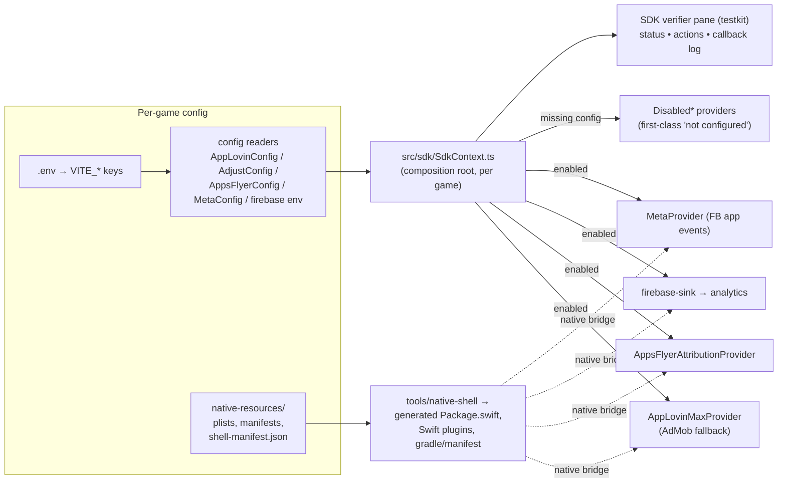

# feat: AppsFlyer, Firebase, Facebook, MAX as SDK Components + SDK Verifier Pane

## Summary

Integrate all four publisher-required SDKs — AppsFlyer, Firebase Analytics, Facebook Core, AppLovin MAX (with AdMob fallback) — into marble_run and shell_template as reusable, config-switched `packages/sdk` components, following find_the_dog's proven composition-root + generated-native-shell architecture. Add a generic SDK verifier debug pane (testkit) that shows per-SDK init status vs configured ids, fires test events/ads, and logs callbacks — serving as the on-device verification surface. marble_run gets real credentials; shell_template gets placeholders and must degrade to first-class "not configured" states. Both iOS and Android are wired and device-verified this card.

**Organizing principle (user-stated):** every SDK is a component behind an interface; "on" is a config block, "off" is a first-class `Disabled*` provider. Adding an SDK to a future game is config + manifest entries, never code forks.

---

## Problem Frame

The publisher sheet (`games/marble_run/sdk_integration/`) supplies Marble Run's live SDK identity: Facebook App ID `4138472436283342` + client token, AppsFlyer key, AppLovin SDK key, one MAX unit id (`d516d39f20c54af0`, format unknown), AdMob app id, Apple ID `6793860059`, package `com.basegamelab.marblerun`, plus `GoogleService-Info.plist`. None of it is wired: marble_run and shell_template run hardcoded `DisabledAdProvider`, stub Firebase, and local dormant copies of the sdk package's ads/attribution/analytics code. AppsFlyer and Facebook do not exist anywhere in source. There is no in-app way to prove an SDK is correctly integrated on device.

find_the_dog already solved the architecture: JS composition root (`games/find_the_dog/src/sdk/SdkContext.ts`), `includePlugins` allowlist gating (`games/find_the_dog/src/sdk/includePlugins.ts`), and deterministic iOS shell generation (`tools/native-shell` from `games/find_the_dog/native-resources/ios/shell-manifest.json`). This plan extends that architecture with two new concerns and ports it to two more games.

---

## Requirements

- R1: AppsFlyer attribution adapter in `packages/sdk/src/attribution/` behind the existing `AttributionProvider` interface, config-gated, iOS + Android.
- R2: Facebook Core SDK as a new `packages/sdk` concern (init + app events only, no Login), config-gated, iOS + Android.
- R3: Firebase Analytics wired live in marble_run via the existing `firebase-sink` + `@capacitor-firebase/analytics`, with the publisher plist installed.
- R4: AppLovin MAX active in marble_run via existing `AppLovinMaxProvider`/`createAdProvider`; AdMob retained as config-switched fallback; the single known unit id wired configurably by ad format.
- R5: SDK verifier pane in `packages/testkit`: per-SDK status (configured ids vs live SDK state), action buttons (fire analytics event, load+show rewarded/interstitial, send AppsFlyer event, send FB event), timestamped callback log. Dev-gated, generic against sdk interfaces.
- R6: Both games mount the pane; both games adopt the package SDK composition root (replacing local dormant copies).
- R7: shell_template runs the identical wiring with placeholder/absent credentials — every SDK must degrade to an explicit "not configured" state (Disabled* pattern), never crash (Firebase native-load crash hazard specifically guarded).
- R8: iOS and Android native shells wired for both games (shell_template Android shell created), via the `tools/native-shell` manifest pipeline where applicable.
- R9: Secrets hygiene — `games/marble_run/sdk_integration/` gitignored; keys flow through the per-game `.env` → `VITE_*` pattern; no credentials committed except platform-public ids that must ship in Info.plist/manifest.
- R10: On-device verification on real iPhone and Android hardware using verifier-pane captures as evidence (hashed per evidence discipline).

### Scope Boundaries

Out of scope: Facebook Login; Firebase beyond Analytics (no Crashlytics/Remote Config); IAP/RevenueCat changes; other games (find_the_dog untouched); removing the Adjust adapter from the package (it stays; marble_run simply selects AppsFlyer).

### Deferred to Follow-Up Work

- Remaining MAX unit ids (publisher to supply); the config slots exist, filling them is a `.env` edit.
- find_the_dog adoption of the verifier pane.
- Deleting the now-redundant local SDK copies from `_template` if it has them.

---

## Key Technical Decisions

- **KTD1 — Adopt find_the_dog's composition-root pattern.** marble_run and shell_template each get a `src/sdk/SdkContext.ts`-style composition root; their local dormant copies under `src/ads/`, `src/attribution/` (and analytics stubs) are replaced by `@fabrikav2/sdk` imports. Rationale: it is the only wiring in the repo verified live on device, and it is exactly the "config in/out" model requested. This is an adoption migration, not a flag flip — sized accordingly.
- **KTD2 — AppsFlyer mirrors the Adjust adapter shape.** New files clone the structure of `AdjustAttributionProvider`/`AdjustConfig`/`AdjustAttributionPlugin` (config reader with discriminated enabled/disabled result, `registerPlugin` bridge, Disabled fallback). Unlike Adjust (iOS-only today), the AppsFlyer bridge is built for both platforms. Env keys: `VITE_APPSFLYER_DEV_KEY`, `VITE_APPSFLYER_APPLE_APP_ID`, plus consent/debug flags.
- **KTD3 — Facebook Core is a new sibling concern** (`packages/sdk/src/meta/` — named `meta` to match provider-validation vocabulary from v1): interface (`init`, `logEvent`, `setAdvertiserTrackingEnabled`), config reader (`VITE_FB_APP_ID`, `VITE_FB_CLIENT_TOKEN`), Capacitor plugin bridge, Disabled provider. App events only. The v1 FTD fixture (`fabrika` repo, `games/find_the_dog/tests/unit/provider-validation-clean.spec.ts`) is the Android touchpoint map (gradle dep, manifest meta-data, resource strings).
- **KTD4 — Native deps enter via the shell-manifest pipeline, not hand-edits.** marble_run and shell_template iOS shells migrate onto `tools/native-shell` + per-game `native-resources/ios/shell-manifest.json` (schemaVersion 1), because the stock Capacitor `CapApp-SPM/Package.swift` is marked DO-NOT-MODIFY and find_the_dog's generated variant is the deterministic path for adding AppLovinSDK, Firebase, AppsFlyerLib, FacebookCore SPM packages + Swift plugin sources + PrivacyInfo.xcprivacy + SKAdNetwork catalog.
- **KTD5 — Firebase crash-at-boot guard is mandatory.** `@capacitor-firebase/analytics` calls `FIRApp.configure()` unconditionally at native load; both games replicate find_the_dog's `includePlugins.ts` allowlist so the pod is excluded from the native build unless the Firebase env triple is present. This is what makes shell_template's placeholder mode safe.
- **KTD6 — Ad provider selection stays in `selectAdProvider`.** marble_run's `src/ads/Service.ts` switches from hardcoded `DisabledAdProvider` to `createAdProvider` with `readAppLovinConfigForPlatform`; the existing platform matrix (iOS→MAX, Android→MAX else AdMob fallback, web→disabled) already encodes the requested AdMob-fallback behavior. The single MAX unit id is bound via a format-keyed env (`VITE_APPLOVIN_IOS_REWARDED_UNIT_ID` / `..._INTERSTITIAL_UNIT_ID` per existing AppLovinConfig keys); whichever format `d516d39f20c54af0` is will be the one that loads — the verifier pane reveals it.
- **KTD7 — Verifier pane is a tool, not an agent.** It exposes state + actions + a callback log and always returns; no loops or self-directed retries. Built on `mountDebugPanel` (`packages/testkit/src/debug/panelShell.ts`), consuming only sdk-package interfaces plus a per-game descriptor of configured ids, so any game can mount it. Gated `!import.meta.env.PROD || TEST_HARNESS_ENABLED`; mounted from the reserved 4-tap gesture in bootstrap (currently a no-op placeholder in `games/marble_run/src/bootstrap.ts`).
- **KTD8 — Secrets split.** Dev keys/tokens live in per-game untracked `.env`; `games/marble_run/sdk_integration/` is gitignored as-is. Ids that must ship inside platform artifacts (FB App ID + client token in Info.plist/manifest, AdMob app id, SKAdNetwork ids, GoogleService-Info.plist) are committed via `native-resources/` — they are platform-public by nature. The AppLovin SDK key and AppsFlyer dev key stay env-injected.

**Product Contract preservation:** solo plan (no upstream brainstorm); scope confirmed interactively in-session.

---

## High-Level Technical Design

Directional guidance, prose is authoritative. The pane reads provider state through the same interfaces the game uses — no privileged back-channel.

---

## Implementation Units

### U1. AppsFlyer attribution adapter (sdk package)

**Goal:** `AttributionProvider` adapter for AppsFlyer with config reader, Capacitor plugin bridge contract, and disabled fallback.
**Requirements:** R1, R7. **Dependencies:** none.
**Files:** `packages/sdk/src/attribution/AppsFlyerConfig.ts` (+`.test.ts`), `packages/sdk/src/attribution/AppsFlyerAttributionProvider.ts` (+`.test.ts`), `packages/sdk/src/attribution/AppsFlyerAttributionPlugin.ts` (+`.test.ts`), update `packages/sdk/src/attribution/index.ts`, `AttributionService.ts` provider factory, `README.md` (env table + native contract).
**Approach:** clone the Adjust adapter's discriminated config-result shape and resolve-not-reject plugin contract (`initialize`/`trackEvent`/`getStatus`). Provider maps the five canonical attribution events. Selection: extend the create-provider path so a game chooses `appsflyer | adjust | disabled` by config presence (explicit provider key, e.g. `VITE_ATTRIBUTION_PROVIDER`, defaulting to whichever is configured).
**Patterns to follow:** `AdjustAttributionProvider.ts`, `AdjustConfig.ts`, `AdjustAttributionPlugin.ts`, their tests.
**Test scenarios:** config reader returns enabled with dev key + apple app id present (iOS) and dev key alone (Android); returns disabled with named missingKeys when any required key absent; provider init on disabled config never touches the plugin; plugin bridge failure (rejected/unavailable) degrades to disabled status without throwing; trackEvent forwards only allowlisted params; provider selection picks appsflyer when its config is enabled and adjust is not.
**Verification:** sdk package `test:unit` + `typecheck` green; provider status surface renders correctly in the pane (U6) — live proof deferred to U9.

### U2. Facebook Core (Meta) concern (sdk package)

**Goal:** new `meta` concern: init + app events behind an interface with config reader, plugin bridge, disabled provider.
**Requirements:** R2, R7. **Dependencies:** none.
**Files:** `packages/sdk/src/meta/MetaProvider.ts` (interface), `packages/sdk/src/meta/MetaConfig.ts` (+`.test.ts`), `packages/sdk/src/meta/CapacitorMetaPlugin.ts` (+`.test.ts`), `packages/sdk/src/meta/CapacitorMetaProvider.ts` (+`.test.ts`), `packages/sdk/src/meta/DisabledMetaProvider.ts` (+`.test.ts`), `packages/sdk/src/meta/index.ts`, `packages/sdk/src/index.ts`, `packages/sdk/README.md`.
**Approach:** app events only (`init`, `logEvent(name, params)`, `setAdvertiserTrackingEnabled(bool)` for iOS ATT alignment). Config: `VITE_FB_APP_ID`, `VITE_FB_CLIENT_TOKEN`; auto-log app events and advertiser-id collection default **off** in config, enabled explicitly (privacy posture mirrors v1 manifest flags).
**Patterns to follow:** attribution concern structure; `firebase-sink.ts` optional-native-dep discipline (source-shipped, no hard plugin import).
**Test scenarios:** config enabled only when both id and token present; disabled result names missing keys; disabled provider logs nothing and reports `not configured` status; provider init failure from native bridge yields error status, not throw; logEvent coerces params like the analytics wire contract; ATT setter forwarded only when initialized.
**Verification:** package tests + typecheck green.

### U3. SDK composition root adoption in both games

**Goal:** marble_run and shell_template consume `@fabrikav2/sdk` through a per-game `src/sdk/SdkContext.ts` + `includePlugins.ts`, replacing local dormant copies; Firebase sink goes live in marble_run's analytics.
**Requirements:** R3, R6, R7. **Dependencies:** U1, U2.
**Files:** new `games/marble_run/src/sdk/SdkContext.ts`, `games/marble_run/src/sdk/includePlugins.ts` (+ unit tests under `games/marble_run/tests/unit/`); rewrite `games/marble_run/src/ads/Service.ts`, `games/marble_run/src/attribution/AttributionService.ts` (thin re-export of package service), `games/marble_run/src/analytics/AnalyticsService.ts`, delete superseded local copies (`src/ads/AdMobProvider.ts`, `AppLovinMaxProvider.ts`, `AppLovinConfig.ts`, `src/attribution/Adjust*`, `src/analytics/FirebaseAnalyticsSink.ts` stub, `firebaseApp.ts` stub); `games/marble_run/capacitor.config.ts` (includePlugins); mirrored set under `games/shell_template/`.
**Approach:** port find_the_dog's `SdkContext.ts` shape: derive `buildEnv` once, call `resolveSdkEnvironments`, construct analytics (console sink in dev + firebase sink when env triple present), attribution (U1 selection), ads (U4), meta (U2). `includePlugins` allowlist excludes `@capacitor-firebase/analytics` unless `VITE_FIREBASE_{API_KEY,PROJECT_ID,APP_ID}` all present (KTD5). bootstrap.ts wiring points (`adService.init` gate, `configureAttributionStartupGate`, analytics init) reroute to the context.
**Execution note:** this is the largest seam — land it green on `typecheck`/`test:unit` for both games before native work; runtime truth waits for U9.
**Test scenarios:** includePlugins excludes firebase plugin when any env key missing and includes it when all present (clone find_the_dog's test); SdkContext with empty env yields all-Disabled providers and analytics console-only (shell_template placeholder case); with full marble_run env yields firebase sink attached + appsflyer + meta + applovin selected; analytics events still fan into attribution (existing behavior preserved); dev build never selects production analytics/adjust environments (`resolveSdkEnvironments` invariant).
**Verification:** both games `typecheck` + `test:unit` + repo `audit` green; no imports remain from deleted local copies (knip/eslint clean).

### U4. Ad provider activation (MAX + AdMob fallback, format-keyed unit id)

**Goal:** marble_run serves ads through `createAdProvider`; shell_template exercises the same path resolving to disabled.
**Requirements:** R4, R7. **Dependencies:** U3.
**Files:** `games/marble_run/src/ads/Service.ts` (within U3's rewrite), `.env.example` entries for both games, `packages/sdk/src/ads/AppLovinConfig.ts` only if a needed env key is missing (verify before editing).
**Approach:** bind AppLovin SDK key + AdMob app id + the single unit id via existing `VITE_APPLOVIN_*` keys; set only the format slot(s) we have — the config's discriminated result plus the pane's load buttons identify which format `d516d39f20c54af0` actually serves. AdMob fallback comes free from `selectAdProvider`'s Android matrix; confirm the config switch surface (explicit "prefer admob" override) exists or add a minimal one.
**Test scenarios:** iOS + AppLovin enabled → AppLovinMaxProvider; Android + AppLovin misconfigured-but-requested → disabled with reason; Android + no AppLovin request → AdMob fallback; web → disabled; unit id present for only one format → other format reports not-configured (not error).
**Verification:** unit tests green; real load/show behavior is U9 evidence.

### U5. SDK verifier pane (testkit component)

**Goal:** generic, dev-gated pane: per-SDK status vs configured ids, action buttons, timestamped callback log.
**Requirements:** R5. **Dependencies:** U1, U2 (interfaces only).
**Files:** `packages/testkit/src/debug/sdkVerifierPane.ts` (+`.test.ts`), `packages/testkit/src/debug/index.ts`, `packages/testkit/src/index.ts`, `packages/testkit/README.md`.
**Approach:** input is a descriptor: for each SDK, `{ name, configuredIds (non-secret), getStatus(), actions: [{label, run()}] }` plus a shared log sink. Pane renders status rows (configured / initialized / error / not-configured), buttons wired to the game's real provider instances, and an append-only timestamped log fed by provider callbacks. Pure DOM on `mountDebugPanel`; injectable document for tests. Tool discipline: every action is one call that returns; the pane never retries or loops.
**Test scenarios:** renders one row per descriptor entry with status text; not-configured SDK renders its state without action buttons erroring; action button invokes the supplied `run()` exactly once; log entries append with timestamps and cap length (no unbounded growth); `remove()` unmounts cleanly; works against a fake document.
**Verification:** testkit unit tests + typecheck green.

### U6. Mount the pane in both games

**Goal:** the pane is reachable on-device in dev builds of marble_run and shell_template.
**Requirements:** R5, R6, R7. **Dependencies:** U3, U5.
**Files:** `games/marble_run/src/devtools/SdkVerifierMount.ts` (+ unit test), `games/marble_run/src/bootstrap.ts` (activate the reserved 4-tap gesture), mirrored in `games/shell_template/`.
**Approach:** descriptor built from the game's SdkContext (real providers + non-secret configured ids); gate `!import.meta.env.PROD || TEST_HARNESS_ENABLED`; 4-tap toggles mount/unmount. Buttons: fire canonical analytics event, load rewarded, show rewarded, load interstitial, show interstitial, send AppsFlyer event, send FB event.
**Test scenarios:** gesture mounts then unmounts; production gate prevents mount; descriptor for shell_template (empty env) shows all SDKs as not-configured; analytics action routes through the real AnalyticsService (spy).
**Verification:** unit tests green; visual truth in U9.

### U7. Native shells: manifest pipeline migration + new SDK deps (iOS & Android, both games)

**Goal:** native bridges exist for all four SDKs on both platforms; shells generated deterministically.
**Requirements:** R8, R2, R1, R3, R4. **Dependencies:** U3 (includePlugins contract), U1/U2 (plugin jsNames).
**Files:** new `games/marble_run/native-resources/ios/shell-manifest.json` + Swift plugin sources under `games/marble_run/native-resources/ios/` (AppLovinMax, AppsFlyerAttribution, MetaEvents plugins + BridgeViewController), `GoogleService-Info.plist` (moved from `sdk_integration/`), `PrivacyInfo.xcprivacy`, SKAdNetwork catalog, Info.plist entries (FacebookAppID, FacebookClientToken, FacebookDisplayName, NSUserTrackingUsageDescription, GADApplicationIdentifier); marble_run Android: gradle deps (facebook-android-sdk, AppsFlyer, AppLovin, firebase via plugin), `AndroidManifest.xml` meta-data (com.facebook.sdk.ApplicationId/ClientToken per v1 fixture map), resource strings, `google-services.json` slot (flag as missing — sheet supplied iOS plist only); shell_template: `npx cap add android` scaffold committed per repo convention, iOS shell-manifest with the same packages but **plugins excluded by config** (KTD5 pattern generalized: a placeholder game ships no SDK pods it can't configure); `tools/native-shell/` extended only if the manifest schema lacks something Facebook/AppsFlyer need (check `validate.mjs` first).
**Approach:** mirror find_the_dog's manifest + generated Package.swift + `bridge?.registerPluginInstance` pattern exactly; native plugin contracts are the ones U1/U2 defined (resolve-not-reject). Android side uses the v1 provider-validation fixture as the authoritative touchpoint list for Facebook.
**Execution note:** this is the classic green-mocks/live-bugs seam (Operating Contract #7) — budget the live shakedown (U9) as part of this work, not after it. Never hand-edit the Capacitor-managed Package.swift.
**Test scenarios:** shell-manifest validates via `tools/native-shell/validate.mjs`; generated Package.swift contains exactly the manifest's packages (deterministic regen test if the tool provides one); Info.plist/manifest assertions via a unit test on `native-resources` sources (clone find_the_dog's ios-native-patches-style checks if present); shell_template build with empty env contains no Firebase/FB/AppsFlyer/AppLovin pods beyond what config allows.
**Verification:** `ios:sync`/`android:sync` complete; both apps build and install; runtime proof is U9.

### U8. Secrets hygiene + env plumbing

**Goal:** credentials flow correctly and nothing secret lands in git.
**Requirements:** R9. **Dependencies:** none (land first or alongside U3).
**Files:** root or game `.gitignore` (add `games/marble_run/sdk_integration/`), `games/marble_run/.env.example`, `games/shell_template/.env.example` (placeholder-documented, empty values), local untracked `.env` for marble_run populated from the sheet (not committed).
**Approach:** per KTD8. Document in `.env.example` which values are platform-public (shipped in plists/manifests) vs env-only.
**Test scenarios:** none — config/scaffolding. Test expectation: none — covered by U3's includePlugins/config tests and a `git status` check that `sdk_integration/` is ignored.
**Verification:** `git check-ignore games/marble_run/sdk_integration` passes; repo `audit` green; no key material in any tracked diff.

### U9. Live device shakedown + evidence (iOS & Android, both games)

**Goal:** observed on-device proof that each SDK initializes with the real ids (marble_run) and degrades cleanly (shell_template).
**Requirements:** R10, R7. **Dependencies:** U1–U8.
**Files:** evidence under `games/marble_run/evidence/` (dated dir) and shell_template equivalent; no product code expected — fixes discovered here amend earlier units.
**Approach:** on each platform: launch dev build, open verifier pane, capture (1) status screen — Firebase sink attached, MAX initialized, AppsFlyer started, FB initialized, ids matching the sheet; (2) analytics event fired + Firebase DebugView cross-check; (3) rewarded and interstitial load/show attempts — recording which format `d516d39f20c54af0` serves; (4) AppsFlyer + FB test events with callback log visible; shell_template: all-not-configured pane, no crash at boot (Firebase guard proven). `shasum` every capture set (hash-device-evidence discipline). `npm run verify-device -- --game marble_run` for the standard capture lane where applicable; verifier-pane screenshots are the SDK-specific evidence.
**Test scenarios:** none — this unit *is* verification. Known live risks to watch: ATT prompt ordering vs MAX consent flow; AppsFlyer needing the Apple App ID (`6793860059`); missing `google-services.json` on Android Firebase (expected gap — Firebase may be iOS-only-verified this card; declare explicitly if so).
**Verification:** named artifacts: the hashed screenshot sets + a short evidence note per game/platform stating verified vs UNVERIFIED items. The card is not done below this bar.

---

## Risks & Dependencies

- **Firebase Android config missing:** the sheet provided only the iOS plist. Android Firebase cannot be verified without `google-services.json` — publisher ask; U9 declares it UNVERIFIED if still absent.
- **MAX unit id format unknown:** by design the config is format-keyed; risk is *neither* format loads (id invalid/inactive) — pane's error codes are the diagnostic.
- **Package.swift migration:** moving marble_run/shell_template from Capacitor-managed to native-shell-generated Package.swift may fight `cap sync`; find_the_dog's `ios:sync` toolchain (`tools/marble-run/ios-inject-team.mjs` analog) is the pattern; first `ios:sync` after migration is a live seam.
- **Facebook iOS SPM:** facebook-ios-sdk via SPM is heavy; if SPM resolution is problematic, fall back to the smallest viable product (FBSDKCoreKit only). Decision deferred to implementation with this default.
- **ATT/consent ordering:** FB advertiser tracking, AppsFlyer, and MAX consent flow all interact with ATT; follow find_the_dog's consent gate (`configureAttributionStartupGate` on `adConsentReady`) for all attribution-class SDKs.
- **shell_template Android is greenfield:** `cap add android` output must be committed consistently with marble_run's android layout.

## Open Questions

- Publisher: remaining MAX unit ids; `google-services.json` for Android; confirmation whether the single unit id is rewarded or interstitial (pane will answer empirically regardless).

## Sources & Research

- Publisher sheet + plist: `games/marble_run/sdk_integration/` (untracked).
- Reference implementation: `games/find_the_dog/src/sdk/`, `games/find_the_dog/native-resources/ios/shell-manifest.json`, `tools/native-shell/`.
- Adapter templates: `packages/sdk/src/attribution/`, `packages/sdk/src/analytics/firebase-sink.ts`, `packages/sdk/src/ads/`.
- Android Facebook touchpoint map: fabrika v1 `games/find_the_dog/tests/unit/provider-validation-clean.spec.ts` (external repo).
- Verifier pane base: `packages/testkit/src/debug/panelShell.ts`.

## Definition of Done

All units landed green on `typecheck`/`test:unit`/`audit`; `sdk_integration/` ignored; marble_run on real iPhone + Android hardware shows the verifier pane with Firebase/MAX/AppsFlyer/Facebook initialized against the sheet's ids (or each gap explicitly declared UNVERIFIED with reason); shell_template boots on both platforms with all SDKs in first-class not-configured states and no crash; hashed evidence sets committed.
