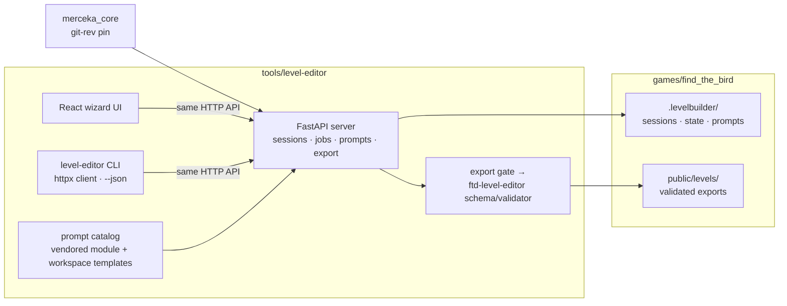

# feat: Level editor fork with agentic CLI

---

## Product Contract

### Summary

Fork the fabrika v1 wizard level editor into `tools/level-editor` as the single hidden-object editor for this repo, add fail-closed export validation from the v2 contract, and give it an agentic CLI with full human parity — human (wizard) and agent (CLI) operate on the same running server and the same live sessions.

### Problem Frame

Level authoring for Find the Bird currently runs on the v1 editor living in the fabrika repo, driven by env-var overrides added 2026-07-28. That works, but: (1) the tool is stranded outside the repo whose games consume its exports; (2) only a human can drive it — every wizard step is click-only, so an agent cannot generate, review, or fix levels without the human in the loop; (3) exports reach the game unvalidated — a drifted `level.json` becomes a black screen on device instead of a red line in the terminal; (4) error surfaces lie (empty `{"error":""}` 502s observed live today).

The end state the user has set: **one tool in fabrikav2 `tools/` serving both Find the Bird (now) and Find the Dog (after its separately-gated cutover)**, with the fabrika copy remaining as the dog's frozen archive. No backward compatibility is owed to fabrika.

### Requirements

- **R1 — Single tool, per-game workspaces.** The editor lives at `tools/level-editor` and operates on a selected game: workspace (sessions, state, prompt library) under `games/<game>/.levelbuilder/`, exports into `games/<game>/public/levels/`. Nothing in code hardcodes a specific game's paths; FTD onboarding later is a workspace addition, not a code change.
- **R2 — Full CLI/human parity.** Every operation reachable from the wizard UI is reachable as a CLI verb: session lifecycle, background generation, background selection, upscale, hitboxes (auto + manual), inpaint (batch + single-target regenerate), sprite extraction, review artifacts, export, validation, prompt library, templates. Parity is by construction: the CLI is a client of the same HTTP API the UI uses.
- **R3 — Seamless co-presence.** Human in the browser and agent in the terminal work the same live session concurrently: the CLI can watch job/session progress, and artifacts (backgrounds, crops, sprites) are downloadable to files so an agent can visually inspect them.
- **R4 — Fail-closed export.** Every export is validated against the v2-derived level schema and geometry rules before it lands in the game's public root; invalid exports are rejected with a specific reason. (Mirrors the repo's fail-closed authoring learning in `docs/solutions/architecture-patterns/data-first-semantic-contract-and-immutable-projections.md`.)
- **R5 — Honest failure surfaces.** No empty error bodies; provider and pipeline failures surface with cause and stage. CLI verbs exit non-zero with a machine-readable reason (`--json`).
- **R6 — Shared templates.** Recipe templates (one pick sets every axis) are served by the backend and consumed identically by the UI dropdown and the CLI, and are user-extensible without a code change.
- **R7 — Verification is provider-free by default**, with exactly one budgeted live shakedown (a real background generation through the CLI) as the seam proof.

### Key Flows

- **F1 — Agent authors a level solo:** `create --template ftb-cardboard-forest` → `generate-bg` → `select-bg` → `auto-hitboxes` → `inpaint` → `review` (download artifacts, inspect) → `regenerate <target>` as needed → `export` (validation gate runs) → game loads it.
- **F2 — Human and agent together:** human generates and picks a background in the wizard; agent runs hitboxes + inpaint from the CLI on the same session; human reviews visually in the gallery; agent exports — where "export" is the lineup + packaging job (the wizard's Lineup tab and the CLI verb drive the same flow).
- **F3 — Fail-closed export:** agent (or human) exports a session with an out-of-bounds hitbox → export refuses with the specific geometry violation → after fix, export succeeds and the validator reports green.

### Acceptance Examples

- **AE1.** With the server running and a bird workspace selected, `level-editor sessions --json` lists the same sessions visible in the wizard gallery, and a session created via CLI template appears in the wizard without a reload workaround.
- **AE2.** `level-editor export <session>` on a session whose hitbox extends past the image bounds exits non-zero, prints the violating hitbox id and bounds, and writes nothing into `games/find_the_bird/public/levels/`.
- **AE3.** A route-inventory contract test enumerates the wizard-reachable API operations and fails if any lacks a mapped CLI verb.
- **AE4.** The one live shakedown: `level-editor create --template ftb-cardboard-forest && level-editor generate-bg <session> --wait` produces a background PNG on disk in the bird workspace, driven entirely from the CLI.

### Scope Boundaries

**In scope:** the fork, per-game profiles, validation gate, CLI, robustness fixes, shared templates, the tool's own test suite and verify aggregate.

**Out of scope (this plan):**
- Migrating or touching the Find the Dog corpus, or executing the FTD cutover. FTD authoring remains in fabrika until that separately-gated event; this tool must merely not preclude it.
- Merging or refactoring the existing `tools/ftd-level-editor` v2 backend. It stays frozen as the FTD cutover candidate; this plan only consumes its schema/validator contract (read-only reuse, U3).
- Game runtime changes beyond what already exists in `games/find_the_bird`.
- Rewriting provider clients — `merceka_core` stays the provider layer, git-rev-pinned.
- Backward compatibility with the fabrika copy. The 2026-07-28 env-var changes there remain for the dog's benefit; the fork diverges freely.

#### Deferred to Follow-Up Work

- FTD workspace onboarding + retirement of the fabrika editor (blocked on the human-gated cutover, runbook `tools/ftd-level-editor/../docs/runbooks/ftd-editor-cutover.md` in this repo).
- Optimistic concurrency (revisioned sessions / ETags) if two-actor collisions prove painful in practice; this plan ships collision-*visibility*, not locking (see KTD6).
- Retiring `tools/ftd-level-editor` once its validator/schema authority has been absorbed and FTD is onboarded.
- Deleting the duplicated bird asset-inventory files from `games/find_the_dog/design/` (asset agent's cleanup, already in motion).

---

## Planning Contract

### Key Technical Decisions

- **KTD1 — Fork v1, don't extend v2.** The v1 editor is the working authoring experience (5-step wizard, live providers, 12.5k lines proven in production use); the v2 backend is a publishing/contract system with no authoring UI and no live provider. Forking v1 and grafting v2's validation on is days; rebuilding the wizard on v2 is weeks. Confirmed by the user.
- **KTD2 — CLI as HTTP client of the running server.** Parity and co-presence fall out for free: one API, two clients, one live session store. A library-embedded CLI would fork state and re-fight every concurrency problem. Cost: the server must be running — mitigated by a `serve` verb and a clear "server not reachable, run `level-editor serve`" error.
- **KTD3 — Vendor the prompt catalog into the tool.** v1 imports `dog_pipeline.utils.prompts` from fabrika's pipeline package. The fork copies that module (views/styles/entities/scene catalog + recipe assembly, including today's `bold_cardboard`/`isometric_close_20`/`bird` additions) into the tool as its own module. The catalog is authoring data for this tool, not shared game infrastructure; a cross-repo import would chain the fork to fabrika forever.
- **KTD4 — `merceka_core` git-rev pin.** Same mechanism fabrika uses (`pyproject.toml` git dependency pinned to a rev). Provider transport, retries, and image ops are battle-tested there; rewriting them is risk with no payoff. The httpx phase-timeout patch (with today's write=120s fix) comes along in the fork's server module.
- **KTD5 — Validation reuses the v2 contract via a uv editable path-dep.** `tools/ftd-level-editor`'s `publishing/level_schema.py` (source of the game's generated `LevelFileV1` type) and `scripts/verify_public_levels.py` become the export gate, taking the public-levels root as a parameter instead of the hardcoded FTD paths (`scripts/verify_public_levels.py:13-14`). ftd-level-editor is hatchling-packaged, so the fork depends on it as a uv editable path dependency (subprocess would need ftd-level-editor's venv anyway). The v2 tool remains the home of the schema; the fork imports it, not copies it.
- **KTD9 — Export is the durable sequence-workflow job, not a per-session endpoint.** v1's per-session `export`, `preview-local`, `approve-catalog`, and sequence-workflow write routes are retired (410 guards, `api/routes.py:1870-1875, 2307-2309`); the only live packaging path is `POST /sequence-workflow/start` — a durable job that packages a *lineup* of sessions and owns validation + `catalog-manifest.json`/`bundled-manifest.json` writes. The plan adopts that: "export" in every flow below means lineup + packaging job. The CLI `export <session>` verb is a convenience composition (add to lineup → start job → wait), which also makes exports durable and `--wait`-able for free.
- **KTD6a — Known singleton:** v1's `/generation-status` is a global one-active-generation singleton (`api/inpaint.py:2051`); two actors generating concurrently will stomp each other's status display. Acceptable for the pilot (status display only, not job state); noted for the U5 collision work.
- **KTD6 — Collision visibility over locking.** Two actors on one session is the seamlessness feature and the main new race surface. v1 serializes writes with in-process locks; cross-actor semantics are last-write-wins. This plan makes that safe-enough by (a) the CLI defaulting to job-based operations that are already durable and idempotent, (b) a `watch` verb streaming session/job events so the agent sees human actions, and (c) mutation responses echoing a session revision stamp so a stale actor gets a warning. Full optimistic concurrency is deferred (see Scope Boundaries).
- **KTD7 — Templates move server-side.** Today's `RECIPE_TEMPLATES` const in `StepConfigure.tsx` moves to the backend (seeded defaults + workspace-JSON user additions), exposed via `/api/config`. UI and CLI render the same list; a new template requires editing a JSON file, not shipping code.
- **KTD8 — `--json` is the agent contract.** Every CLI verb supports `--json` with stable keys (mirrors the repo lesson about CLIs consumed by automation: non-TTY output is a contract, `games/find_the_dog/tools/*` release-hook precedent).

### Assumptions

- The tool's Python package keeps the `levelbuilder` module name internally; the tool directory and CLI binary are named `level-editor`. Renaming internals buys nothing.
- Disk hygiene: workspaces are gitignored per game (already done for `games/find_the_bird/.gitignore`); heavy artifacts never enter git.

---

## High-Level Technical Design

### Component topology



Both clients speak one API; the server owns the workspace; exports pass through the validation gate before touching the game. The frozen `tools/ftd-level-editor` contributes only the schema/validator contract (arrow VAL), nothing else.

### CLI verb surface (directional, not final naming)

```text
level-editor serve [--game find_the_bird] [--port]
level-editor status | doctor | config
level-editor sessions [--json] | session <id> [--json]
level-editor create --template <id> | --setting --scene --style --view --entity --model --count
level-editor generate-bg <id> [--wait] | select-bg <id> <index> | upscale <id>
level-editor auto-hitboxes <id> | set-hitboxes <id> --file hitboxes.json
level-editor inpaint <id> [--wait] | regenerate <id> --dog <dog-id>
level-editor review <id> --out <dir>       # downloads bg/crops/sprites for visual inspection
level-editor watch <id>                    # streams session + job events (co-presence)
level-editor export <id>                   # runs validation gate; refuses on violation
level-editor validate [--game]             # whole-corpus check, same engine as export gate
level-editor templates [--json] | prompts <kind>
```

### Two-actor session flow (F2)

```mermaid
sequenceDiagram
  participant H as Human (wizard)
  participant S as Server (one session)
  participant A as Agent (CLI)
  H->>S: generate backgrounds, pick one
  A->>S: watch <id> (sees select-bg event)
  A->>S: auto-hitboxes, inpaint --wait (durable jobs)
  H->>S: gallery review, tweak a dog variant
  A->>S: review --out; inspects sprites
  A->>S: export → validation gate → public/levels
```

---

## Implementation Units

### U1. Fork the v1 editor into `tools/level-editor`

**Goal:** A self-contained tool in this repo: FastAPI backend, React wizard, vendored prompt catalog, uv project with pinned `merceka_core`, npm workspace registration.
**Requirements:** R1
**Dependencies:** none
**Files:** `tools/level-editor/` (new: `api/` including `api/server.py`, `ui/` including the `ui/tests/*.mjs` smoke harnesses, `prompts/catalog.py` vendored from fabrika `games/find_the_dog/pipeline/dog_pipeline/utils/prompts.py`, `pyproject.toml`, `uv.lock`, `package.json`); root `package.json` (workspaces entry).
**Approach:** Copy fabrika's `games/find_the_dog/pipeline/levelbuilder/` (api + ui, not levels/state/archives — workspaces are per-game now) carrying today's changes (env-var roots, template dropdown, prompt caps, write-timeout fix). Rewrite `dog_pipeline.utils.prompts` imports to the vendored module. `api/server.py` needs deliberate surgery, not a copy: its cross-repo `.env` candidate chain (`server.py:63-80`) shrinks to repo root + tool dir; its module-import-time static mounts `/levels` and `/public-levels` (`server.py:268-272`) must resolve from settings before app construction (feeds U2); the merceka httpx timeout patch (with write=120s) carries over. **Strip the Firebase RemoteConfig publisher**: `api/sequence_activation.py` wires `RemoteConfigPublisher` reachable from the packaging flow — the fork removes or fail-closes it so no CLI or UI path can attempt a production remote-config publish. Trim fabrika-specific launch machinery (`dev-up.sh` tunnel choreography) — `serve` (U4) replaces it.
**Patterns to follow:** `tools/ftd-level-editor/package.json` for uv-via-npm script shape; fabrika `pipeline/pyproject.toml` for the merceka pin.
**Test scenarios:**
- Happy: backend boots against a temp workspace; `/api/config` serves views/styles/entities including `bold_cardboard`, `isometric_close_20`, `bird`; UI typechecks and builds.
- Edge: boot with a missing workspace dir → created; boot with no provider keys → server up, generation endpoints fail with explicit "provider key missing" (not a stack trace).
- Import boundary: test asserting no module imports `dog_pipeline` or reaches outside the tool + pinned deps.
**Verification:** tool pytest subset green; `tsc` green; boot smoke against temp workspace.

### U2. Per-game profiles

**Goal:** `--game <name>` resolves every root from the repo layout; nothing dog- or bird-specific in code; UI shows the active game.
**Requirements:** R1
**Dependencies:** U1
**Files:** `tools/level-editor/api/settings.py` (new, replacing env-var plumbing in `api/session.py`, `api/job_store.py`, `api/level_store.py`, `api/sequence_workflow.py`, `api/sequence_activation.py`); `tools/level-editor/ui/src/App.tsx` (header from config); `games/find_the_bird/.gitignore` (already ignores `.levelbuilder/`).
**Approach:** One settings object constructed at startup from `--game` (or `LEVEL_EDITOR_GAME`): workspace `games/<game>/.levelbuilder`, public `games/<game>/public/levels`, display label. `/api/config` gains `game` metadata; the UI masthead and document title render it (kills the hardcoded "Find the Dog - Level Editor").
**Test scenarios:**
- Happy: two settings objects for two games yield disjoint roots; server started with `--game find_the_bird` lists only bird sessions.
- Error: unknown game name → startup fails with the list of available games (dirs under `games/` containing a workspace or a game config).
- Edge: absolute-path game root outside repo (future fabrika-hosted FTD) accepted via explicit path form.
**Verification:** unit tests on settings resolution; boot smoke with `--game find_the_bird` shows bird masthead.

### U3. Fail-closed export gate

**Goal:** The packaging job validates schema + geometry via the v2 contract before anything lands in the game; a `validate` entry point checks a whole corpus.
**Requirements:** R4, R5
**Dependencies:** U1, U2
**Files:** `tools/ftd-level-editor/scripts/verify_public_levels.py` (parameterize the hardcoded ROOT/LEVELS, lines 13-14); `tools/level-editor/api/export_gate.py` (new); `tools/level-editor/api/sequence_workflow.py` (packaging job calls the gate); tests `tools/level-editor/tests/test_export_gate.py` (new).
**Approach:** Per KTD9 the gate hooks the durable packaging job (`POST /sequence-workflow/start`), which already owns validation and the manifest writes — the gate strengthens it with the v2 schema/geometry engine (uv editable path-dep on ftd-level-editor per KTD5). **Atomicity unit = level dirs + `catalog-manifest.json` + `bundled-manifest.json` together**: the FTB game hard-fails boot on a bad bundled manifest (`games/find_the_bird/src/data/levels.ts:204-208`), so refusal must leave both manifests untouched, not just level dirs. Stage → validate → atomic move + coherent manifest upsert. Refusal surfaces the violation list verbatim through job events.
**Execution note:** Start with a failing test packaging a fixture session with one out-of-bounds hitbox (AE2).
**Test scenarios:**
- Covers AE2. Out-of-bounds hitbox → packaging job fails with the named hitbox; no level dir written AND both manifests byte-identical to before.
- Happy: valid fixture session packages; validator green on the resulting corpus; manifests coherent with level dirs.
- Edge: staging dir left over from a crashed export is cleaned/ignored on next run.
- Error: validator itself crashes → refusal ("gate unavailable" is a refusal, not a bypass).
**Verification:** gate tests green; `verify_public_levels --root games/find_the_bird/public/levels` green on an exported fixture.

### U4. Agentic CLI

**Goal:** The full verb surface (HTD sketch) as a thin httpx client with `--json`, `--wait` job polling, artifact download, and `serve`.
**Requirements:** R2, R3, R5, R7
**Dependencies:** U1, U2 (U3 for `export`/`validate` verbs)
**Files:** `tools/level-editor/cli/` (new package: entry point, verb modules, output formatting); `tools/level-editor/pyproject.toml` (console script); tests `tools/level-editor/tests/test_cli_contract.py`, `tools/level-editor/tests/test_cli_parity.py` (new).
**Approach:** Each verb maps to existing API operations; long-running verbs start the durable job and poll to terminal, streaming progress lines. **Not all v1 operations are job-pollable**: background/inpaint/band/retry have POST+GET job pairs, but magenta inpaint is GET+SSE-only (`api/inpaint.py:4483`) and single-dog regeneration is a blocking POST (`api/inpaint.py:3803-3808`) — those two get a small SSE/blocking adapter in the CLI (or, if trivial in the fork, durable-job wrappers server-side; decide at implementation). `export <session>` composes lineup-add → packaging job → wait (KTD9). `review` downloads the session's current artifacts (backgrounds, crops, eval, sprites) into a directory an agent can Read. `watch` tails session + job events. Errors: non-zero exit, `{"error": {code, stage, message}}` in `--json` mode. The parity inventory (AE3) is derived mechanically from the FastAPI `app.routes` at test time — v1 pins no OpenAPI document, so the live route table is the source of truth.
**Execution note:** Parity is enforced by test, not discipline — write the route-inventory parity test (AE3) early and let it drive verb completeness.
**Test scenarios:**
- Covers AE3. Parity test: wizard-reachable API operations ⊇ mapped CLI verbs; fails on unmapped addition.
- Covers AE1. Contract test against a test server (scripted provider): create-from-template via CLI appears in `sessions --json`.
- Happy: `generate-bg --wait` against scripted provider reaches terminal state and reports the artifact path; `review --out` writes expected files.
- Error: server down → exit non-zero with the `serve` hint; job fails → CLI surfaces stage + cause and exits non-zero.
- Edge: `--wait` timeout → exits with "still running" status and the job id (resumable, not orphaned).
**Verification:** contract + parity tests green in the provider-free suite.

### U5. Robustness pass

**Goal:** Honest errors end-to-end, `doctor`, and two-actor collision visibility.
**Requirements:** R3, R5
**Dependencies:** U1, U4
**Files:** `tools/level-editor/api/` error paths (the empty-502 upscale path in `routes.py`, provider error mapping in `inpaint.py`); `tools/level-editor/cli/doctor.py` (new); session mutation responses (revision stamp); tests `tools/level-editor/tests/test_error_surfaces.py` (new).
**Approach:** Audit every route that can return an empty or generic error (today's `{"error":""}` upscale 502 is the exemplar) and route them through one error shape with stage + cause (redaction preserved). `doctor`: workspace census (orphaned sessions, stale locks, jobs stuck non-terminal, disk usage) with actionable output. Mutation responses carry a monotonic session revision; the CLI warns when its last-seen revision is stale (KTD6 — visibility, not locking).
**Test scenarios:**
- Error shape: forced provider failure at each stage (submit, poll, download) yields structured cause; no route returns an empty body with a 5xx.
- Doctor: fixture workspace with a stuck job and an orphaned dir → both reported; clean workspace → "healthy".
- Collision: two clients mutate the same session; the second sees the revision advance and the CLI prints the staleness warning.
**Verification:** error-surface tests green; `doctor` run on the real bird workspace reports healthy.

### U6. Server-side shared templates

**Goal:** Templates live in the backend (seed defaults + workspace JSON), served via `/api/config`; UI dropdown and CLI `--template` consume the same list.
**Requirements:** R6
**Dependencies:** U1, U2
**Files:** `tools/level-editor/api/templates.py` (new); `tools/level-editor/ui/src/components/StepConfigure.tsx` (dropdown reads config instead of local const); `tools/level-editor/cli/` (create verb + `templates` verb); tests `tools/level-editor/tests/test_templates.py` (new).
**Approach:** Seeds = today's three (two Bold Cardboard pilots, Spot The Bird line art). Workspace file `<workspace>/templates.json` merges over seeds by id. Template application stays client-side semantics-free: the backend serves axis values; each client applies them to its own form/args (same as today's dropdown behavior).
**Test scenarios:**
- Happy: config lists seeds; workspace file adds a template and overrides a seed by id; CLI `create --template` and UI dropdown see identical lists.
- Edge: malformed workspace templates.json → server logs a warning, serves seeds (fail-open for templates is acceptable; they're conveniences, not authority).
**Verification:** template tests green; UI dropdown visually shows a workspace-added template (screenshot).

### U7. Verify aggregate + live shakedown

**Goal:** One command proves the tool provider-free; one budgeted live run proves the seam.
**Requirements:** R7
**Dependencies:** U1–U6
**Files:** `tools/level-editor/package.json` (`editor2:verify` style aggregate: uv pytest, tsc, ui build, cli parity); root `package.json` (aggregate alias); `docs/evidence/` (shakedown record).
**Approach:** Port the *relevant* levelbuilder tests from fabrika's pipeline suite (session, packaging, job store, prompt assembly — not dog-corpus-coupled tests). **Sizing honesty:** these tests live mixed into fabrika's `pipeline/tests/` with `dog_pipeline` imports, corpus fixtures, and custom markers (`generated_evidence`, `local_experiment`) — expect conftest/fixture surgery, not file copies; budget this unit as a full day and narrow to the named suites rather than chasing the whole 909. The live shakedown is AE4, run once, evidence recorded (artifact path + screenshot of the wizard showing the CLI-created session).
**Test scenarios:** Test expectation: none — this unit is aggregation and evidence; its content is the other units' suites.
**Verification:** aggregate green from repo root; shakedown evidence file exists and names its artifacts.

---

## Verification Contract

- **Provider-free gate (CI-able):** `npm run -w @fabrikav2/level-editor verify` → uv pytest (all suites above), `tsc`, UI build, CLI parity test. No network, no keys, scripted providers only.
- **Corpus gate:** `verify_public_levels --root games/find_the_bird/public/levels` green after any export.
- **Live shakedown (once, budgeted):** AE4 end-to-end via CLI with real Gemini; evidence in `docs/evidence/`.
- **Co-presence proof:** F2 walked once for real — human action visible in `watch`, CLI export of a human-touched session (part of shakedown session).

## Definition of Done

1. An agent with no browser can take a bird level from template to validated export using only `level-editor` verbs (proven by AE4 + AE2).
2. The human wizard experience is unchanged or better (templates now server-backed; masthead shows the game).
3. Human and agent demonstrably co-drive one session (F2 walkthrough).
4. Every export into `games/find_the_bird/public/levels` has passed the schema/geometry gate.
5. The fabrika editor and the FTD corpus are untouched; `tools/ftd-level-editor` is modified only in `verify_public_levels.py` root parameterization.
6. Provider-free verify aggregate is green from the repo root.

---

## Risks & Dependencies

- **merceka_core drift** — the pin is a snapshot; fabrika may advance it for dog work. Low risk short-term; the pin is explicit and bumping is a one-line change + lock regen.
- **Two-actor races beyond visibility** — last-write-wins can still surprise (human edits hitboxes while agent inpaints). Mitigated by durable-job idempotency and the revision warning; full concurrency control is explicitly deferred.
- **SSE flows in the CLI** — some v1 operations are SSE-native; if polling coverage is uneven, `--wait` may need per-operation adapters. Contained in U4; the durable-job endpoints (ported June 2026) already poll cleanly.
- **Test-port effort underestimation** — fabrika's suite is 909 tests with corpus coupling; U7 deliberately ports a subset. Risk of losing a regression net for an edge we forgot; the parity + gate tests are the compensating control.
- **Disk** — each workspace holds heavy PNGs; host was at 99% today. Mitigation: workspaces gitignored, `doctor` reports usage, and generation verbs (and the U7 shakedown) check free-space as a precondition — refuse/warn below a floor rather than failing mid-generation for an unrelated reason. Cleanup remains manual.

## Sources & Research

- Session research (2026-07-28): full capability matrix of fabrika v1 editor vs `tools/ftd-level-editor` (this conversation; handoff `docs/handoffs/2026-07-28-fabrikav2-level-editor-release-cut-research.md`).
- `docs/solutions/architecture-patterns/data-first-semantic-contract-and-immutable-projections.md` — fail-closed validation + authoring/runtime authority split (drives R4/KTD5).
- Fabrika lessons: durable-job requeue semantics, CLI non-TTY output contract (`games/find_the_dog/tools/*` release-hook incident), phase-aware httpx timeouts (write-timeout fix 2026-07-28).
- Hill-climb preset evidence: `spot-the-bird-lineart` (model choice >> prompt wording), seeds U6.
