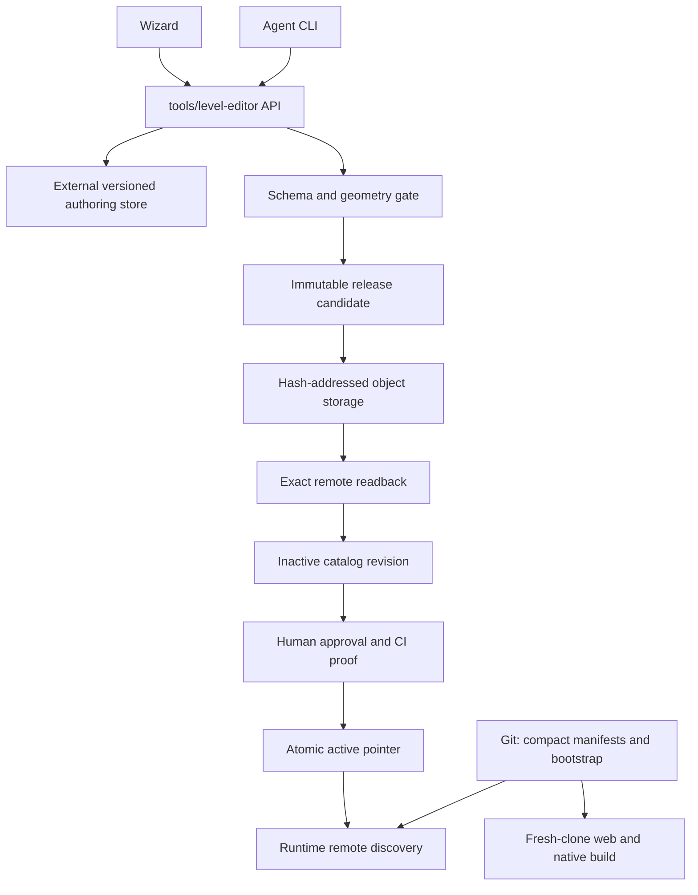
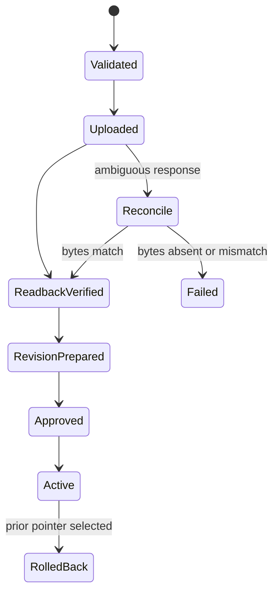

# refactor: Consolidate level authoring and externalize level storage

---

## Goal Capsule

- **Objective:** End with one executable hidden-object authoring surface under `tools/level-editor`, one durable authoring workspace outside Git worktrees, and a portable Find the Bird release path that stores heavy promoted packages in immutable object storage instead of Git or Git LFS.
- **Authority order:** This plan, the existing publication invariants in `tools/ftd-level-editor`, the human-gated FTD cutover runbook, then local implementation conventions.
- **Execution profile:** Five atomic implementation units culminating in a path-scoped branch closeout. No production activation, destructive corpus deletion, FTD migration/cutover, merge, or deployment is authorized by this plan alone.
- **Stop conditions:** Stop before remote activation or old-corpus removal if upload readback, fresh-clone build, offline bootstrap play, rollback, or corpus reconciliation fails.
- **Tail ownership:** The implementation owner leaves a scoped clean diff and a path-classification ledger; unrelated Find the Bird UI/reskin work remains untouched until its owner commits or relocates it.

---

## Product Contract

### Summary

The familiar Wizard and CLI remain the only writable authoring experience, with source owned by `tools/level-editor`.
Authoring sessions no longer live under `games/<game>/.levelbuilder`, because that path is recreated per worktree and currently holds 1.3 GB for Find the Bird.
Game-ready level packages remain reproducible from a fresh clone without placing the full corpus in Git LFS: Git carries compact desired-state manifests, checksums, rollback metadata, and a tiny complete bootstrap set, while immutable heavy assets live behind the existing CDN/object-storage boundary.

### Problem Frame

The current repository has three different storage concerns collapsed into tracked or worktree-local game paths.
Generated authoring state is worktree-local, promoted packages are stored under `games/*/public/levels`, and native builds create additional copies.
The tracked Find the Dog corpus is approximately 5.1 GB and is materialized in each linked worktree; three current worktrees therefore hold roughly 15 GB before native build copies.
Git LFS is not currently used by this repository, and enabling it would still populate each checkout unless smudge were disabled while consuming quota the user reports is nearly full.

There are also two tool directories, but they are not interchangeable duplicates today.
`tools/level-editor` owns the working Wizard, CLI, provider generation, sessions, and export flow.
`tools/ftd-level-editor` owns FTD-specific schema, geometry, publication, approval, and cutover contracts.
The final state is one user-facing editor, but removing the contract library before its consumers move would discard the only authoritative publication invariants.

### Requirements

**Authoring and workspace**

- R1. `tools/level-editor` is the sole human and CLI authoring surface for hidden-object levels; no generator or Wizard remains under a game directory.
- R2. Generated sessions, jobs, previews, templates, and content-addressed artifacts default to an external per-repository/per-game application-data root shared by all linked worktrees, with an explicit override for CI and unusual layouts.
- R3. Shared workspace access is versioned and concurrency-safe: incompatible tool/store versions refuse, one mutator owns a session at a time, one promotion writer owns the release boundary, and every export records source commit and tool-version provenance.

**Promotion and build portability**

- R4. Heavy promoted assets use immutable hash-addressed object keys; publication uploads bytes first, verifies exact remote readback, creates an inactive revision, and advances the active pointer only after approval.
- R5. Git contains compact desired-state manifests, hashes, retained rollback metadata, legacy `levels-index.json` while consumers require it, and 1–3 complete bootstrap levels; it does not contain raw generations or the full promoted corpus.
- R6. A fresh clone builds without the authoring workspace, credentials, Git LFS, or network access by using the committed bootstrap set; an optional authenticated release/integration lane verifies remote-only levels.
- R7. Runtime catalog discovery, catalog snapshots, level JSON, images, and sprites obey one immutable remote contract with same-origin bootstrap fallback.

**Migration and repository hygiene**

- R8. Existing `.levelbuilder` data and level corpora are inventoried and reconciled before migration; no source is removed until count/hash comparison, backup/restore rehearsal, validation, and runtime proof pass.
- R9. Owned migration work is committed through explicit path allowlists in coherent subsystem commits; every other current entry is intentionally retained, externally archived, or deferred to a named owner, and unrelated UI/reskin/evidence changes are neither staged nor stashed implicitly.
- R10. Root scripts and normal documentation expose `tools/level-editor` as the sole authoring command. The frozen `tools/ftd-level-editor` executable remains dormant, non-authoritative cutover machinery plus an internal contract library until the separately approved FTD migration.

### Key Flows

- F1. An author opens any linked worktree, runs the canonical editor for a game, and sees the same external sessions without creating a new multi-gigabyte game-local workspace.
- F2. A reviewer promotes a validated level: immutable assets upload, every size/hash is read back, an inactive catalog revision is recorded, Git desired state passes fresh-clone and bootstrap gates, then a separately authorized action advances the remote pointer.
- F3. A fresh clone builds and launches with the network disabled, using the committed bootstrap sequence; when online, it discovers a remote catalog revision and loads a CDN-only level by immutable asset hash.
- F4. A failed or ambiguous publication leaves the old active pointer intact; an operator reconciles by request ID and exact readback rather than blindly retrying.
- F5. Cleanup classifies the 196 dirty entries, commits only owned pathsets, preserves unrelated changes, and removes old generated bytes only after explicit approval and migration proof.

### Acceptance Examples

- AE1. Two linked worktrees resolve the same game workspace outside both worktree roots, and deleting either worktree leaves sessions and completed provider jobs intact.
- AE2. A second writer with a stale session revision or incompatible store schema receives a refusal before modifying shared state.
- AE3. A simulated upload that loses its response is reconciled through stable request identity and readback; it neither overwrites an immutable key nor advances the catalog pointer twice.
- AE4. A clean, credential-free clone with outbound network disabled builds the web and native bundles and launches at least one complete playable bootstrap sequence.
- AE5. A CDN-only promoted level loads after catalog discovery, and switching the remote pointer to the prior retained revision restores the preceding catalog without rebuilding the app.
- AE6. The migration ledger accounts for all 196 current status entries as committed, intentionally retained, externally archived, or deferred to a named owner; no blanket staging, reset, clean, or stash is used.

### Scope Boundaries

**In scope**

- Canonical editor ownership, external authoring workspace resolution, concurrency/provenance contracts, immutable object-store publication, remote catalog discovery, bootstrap packaging, corpus migration, and an atomic commit/cleanup strategy.

**Outside this plan**

- Production deployment or remote pointer activation.
- Purchasing storage, increasing Git LFS quota, or introducing Git LFS.
- Reworking generation prompts, model comparisons, hitbox algorithms, game UI, or unrelated Find the Bird reskin assets.
- Deleting historical Git objects; Git history is shared by linked worktrees and requires a separately approved repository-history operation if ever warranted.

### Deferred to Follow-Up Work

- Find the Dog corpus migration and editor cutover after the Find the Bird storage contract has operated successfully and the FTD runbook is separately authorized.
- Physical relocation of the internal FTD schema/publication library after all consumers migrate.
- Object-store garbage collection after active, rollback, bootstrap, and client-cache retention windows are defined and observed.
- Portal hosting of full-resolution generation evidence; this plan commits compact evidence indexes and links only.
- Removing legacy `levels-index.json` after runtime, scaffold, editor, and validation consumers all migrate.

---

## Planning Contract

### Key Technical Decisions

- KTD1. **One executable authoring surface, one internal contract library.** Keep `tools/level-editor` as the only runnable Wizard/server/CLI. Compose the schema, approval, replay, reconciliation, and immutable-publication rules already owned by `tools/ftd-level-editor`; do not recreate them under a second namespace. Physical package consolidation is deferred because removing the internal library now would remove authority, not duplication.
- KTD2. **External application-data workspace, not a repo-relative cache.** Resolve a stable per-repository/per-game root under the host application-data directory, with `LEVELBUILDER_WORKSPACE` plus `LEVELBUILDER_GAME_ROOT` retaining explicit precedence. This survives worktree deletion and avoids assuming the primary checkout path is permanent.
- KTD3. **No Git LFS for levels.** Store immutable promoted bytes in the existing Cloudflare-origin/object-storage architecture. Git records compact desired state and a tiny complete bootstrap set. This avoids LFS quota pressure and prevents every worktree from materializing the full corpus.
- KTD4. **Catalog publication is a distinct saga built from existing reliability primitives.** The current FTD `PublishingService` publishes an ordered sequence that already names a catalog revision; it does not upload assets or create catalog revisions. Add a catalog-release candidate/service that reuses the existing approval store, durable request identity, locking, and exact-readback reconciliation primitives. It validates and uploads immutable bytes, creates an inactive catalog revision, commits desired state, passes fresh-clone/runtime gates, and only then conditionally advances the catalog pointer. Sequence publication remains downstream and can reference only a confirmed catalog revision. An upload without activation is a harmless orphan; a pointer without verified bytes is forbidden.
- KTD5. **Remote discovery must be complete.** Catalog manifests and retained snapshots move to the remote discovery contract with bundled same-origin fallback, and the mutable sprite-path exception is removed. A post-build promotion must not depend on files that only existed when the app bundle was created.
- KTD6. **Workspace migration is copy-verify-switch-retain.** The first migration copies through a store-aware backup/import path, verifies count and content hashes, switches the resolver, runs a live census, and retains the source until a separately approved cleanup. Raw SQLite/WAL copying and cross-filesystem moves are not accepted as backup.
- KTD7. **Clean means scoped ownership, not an empty status command at any cost.** Each commit stages an explicit path allowlist and passes its own gates. If unrelated user work remains, the feature branch reports a clean owned pathset rather than stashing or deleting someone else's changes to manufacture a globally clean tree.
- KTD8. **Repository identity is a recoverable clone-local UUID stored in the shared Git common directory.** Linked worktrees discover the same ID through `git rev-parse --git-common-dir`; moving the checkout preserves it, while a fresh clone intentionally receives a new ID. The external path is the OS application-data root plus repository UUID and game ID. A human-readable repository fingerprint and workspace descriptor live beside the external store, and `doctor` can list and explicitly rebind an existing workspace after operator confirmation. An explicit workspace/game-root pair remains the portable CI override.
- KTD9. **The remote protocol is provider-neutral and concrete.** Immutable objects use `assets/sha256/<digest>.<extension>`. Versioned catalog revisions are immutable JSON documents named by digest; the active pointer is a small revision/digest document advanced by conditional compare-and-swap. Stable request IDs and candidate digests persist in the release record. Readback requires exact bytes or matching size/hash, and the live Cloudflare adapter remains disabled until ownership, credentials, CORS, cache policy, and conditional-write support are verified.

### High-Level Technical Design

### Assumptions

- The existing Cloudflare origin remains the intended delivery surface, but its current bucket ownership, credentials, CORS, cache policy, and production health must be verified before any live upload or activation.
- One to three bootstrap levels are the initial size range, not an accepted count. U3 selects the smallest set that proves initial launch, ordered progression, retry/relaunch, deterministic terminal behavior at the end of bundled content, and transition to online content.
- Shared authoring data is local operator state, not a substitute for durable promoted-package storage or backup.
- The current branch's unrelated reskin and evidence changes have owners outside this storage migration unless later classified otherwise.

### Sequencing and Commit Strategy

1. Land the shared release-candidate/provenance contract, then develop external workspace handling and immutable publication independently without moving live data or activating production.
2. Land the provider-independent Find the Bird bootstrap/native packaging and prove fresh-clone, network-denied behavior before remote integration.
3. Land the object-store transport and complete remote discovery using scripted storage and the existing publication service contracts.
4. After a separately supplied staging-store gate, generate the Find the Bird desired state, verified remote census, and exact deletion allowlist, then stop for explicit deletion/activation approval.
5. Make the familiar editor the sole advertised/default command and finish the path-by-path dirty-work ledger; preserve dormant FTD cutover machinery and defer FTD corpus migration and physical contract-package consolidation.

---

## Implementation Units

### U1. Externalize and harden the authoring workspace

- **Goal:** Make all linked worktrees use one durable external workspace without risking corruption or silent branch incompatibility.
- **Requirements:** R1, R2, R3, R8; AE1, AE2.
- **Dependencies:** None.
- **Files:** `tools/level-editor/levelbuilder/settings.py`, `tools/level-editor/levelbuilder/api/job_store.py`, `tools/level-editor/levelbuilder/api/level_store.py`, `tools/level-editor/levelbuilder/api/session.py`, `tools/level-editor/levelbuilder/cli/main.py`, `tools/level-editor/tests/test_settings.py`, `tools/level-editor/tests/test_security_hardening.py`, `tools/level-editor/tests/test_robustness.py`, new focused workspace-migration tests, `tools/level-editor/README.md`.
- **Approach:** Persist a clone-local UUID in the Git common directory and resolve the external application-data root by that UUID plus game. Define the authoritative store as filesystem session records/artifact CAS, durable job database, templates, and one version header/authority-switch marker; the dormant `level_store.py` remains non-authoritative. Add interprocess session locks, optimistic revisions, and export provenance. Migration quiesces workers, uses the database backup API plus an immutable artifact snapshot, verifies both under one migration lease, then switches the authority marker. Provide doctor/census plus copy-verify-switch backup/restore; preserve explicit paired environment overrides.
- **Execution note:** Add failing resolver, incompatible-version, stale-writer, and interrupted-migration tests before changing the default.
- **Patterns to follow:** Existing half-set environment refusal in `tools/level-editor/levelbuilder/settings.py`; durable request/job identity in `tools/ftd-level-editor/backend/ftd_editor`.
- **Test scenarios:**
  - Two linked worktree roots for the same repository/game resolve the same external path, while two repositories with the same folder name do not collide.
  - An explicit valid environment pair wins; a half-set pair still refuses.
  - A stale revision, incompatible store version, active lock, nonempty destination, hash mismatch, disk-full write, and interrupted import all fail without switching authority.
  - A completed import preserves session/job/template/artifact counts and hashes, survives worktree deletion, and is idempotent on rerun.
  - A fresh clone is isolated by default, while `doctor` can discover an orphaned external descriptor and rebind it only after explicit operator confirmation.
- **Verification:** The editor opens existing sessions from the external store, `doctor` reports store identity/provenance/leases, and the original 1.3 GB source remains untouched pending explicit cleanup.

### U2. Compose immutable remote publication and catalog discovery

- **Goal:** Promote validated levels without Git/LFS blobs and make post-build catalog revisions discoverable and reversible.
- **Requirements:** R4, R7, R8; AE3, AE5.
- **Dependencies:** The shared release-candidate/provenance contract introduced alongside U1; live workspace migration is not required.
- **Files:** `tools/level-editor/levelbuilder/api/session.py`, `tools/level-editor/levelbuilder/api/sequence_workflow.py`, `tools/level-editor/levelbuilder/api/public_levels.py`, a new publisher adapter under `tools/level-editor/levelbuilder`, focused publisher/reconciliation tests under `tools/level-editor/tests`, `games/find_the_bird/src/data/levels.ts`, `games/find_the_bird/src/data/levelPackageCache.ts`, relevant runtime unit tests.
- **Approach:** Define a catalog-release candidate and service rather than forcing catalog publication through the existing sequence-shaped publisher. Reuse its approval store, durable request identity, locking, and reconciliation primitives; sequence publication remains a downstream consumer of an already confirmed catalog revision. Compose those primitives with a credential-free-by-default object-store transport and a Find the Bird adapter. Content-address every promoted file including sprites, upload missing keys, verify exact readback, write an inactive digest-addressed catalog revision, and change runtime discovery so remote catalog and snapshots have bundled fallback. Add the global promotion lease here. Bind approval to candidate digest, actor, source revision, and stable request ID; advance the pointer through conditional compare-and-swap only through a separately authorized adapter.
- **Execution note:** Characterize current same-origin catalog and mutable sprite behavior first, then make those tests fail for post-build promotion and immutable rollback.
- **Patterns to follow:** Reuse the approval grants, request replay, locks, and exact-readback reconciliation primitives under `tools/ftd-level-editor/backend/ftd_editor`; do not reuse its sequence `Candidate`/`Publisher` shape for catalog publication. Follow runtime `ManifestClient` and `AssetCache` patterns in `games/find_the_bird/src`.
- **Test scenarios:**
  - Every logical package file maps to one immutable key and a changed byte produces a new key.
  - Upload succeeds but response is lost; reconciliation finds matching bytes and resumes without duplicate activation.
  - Readback size/hash mismatch, CORS/network failure, manifest-finalize crash, stale approval, and pointer conflict all leave the previous revision active.
  - A runtime built before a promotion discovers the new remote catalog and loads level JSON, color/background, and sprites by immutable hash.
  - Selecting the prior retained pointer restores the prior level package while bootstrap remains playable.
- **Verification:** Scripted storage proves upload-before-pointer ordering, idempotency, exact readback, and rollback; no live credentials or production writes are required.

### U3. Make builds portable with a bounded bootstrap

- **Goal:** Build and launch from a fresh clone without the authoring store, Git LFS, provider credentials, or full level corpus.
- **Requirements:** R5, R6, R7; AE4.
- **Dependencies:** Existing local schema/manifest validation; remote discovery scenarios additionally depend on U2.
- **Files:** `games/find_the_bird/build/nativePublicBundle.ts`, `games/find_the_bird/tests/unit/native-public-bundle.test.ts`, `games/find_the_bird/src/data/levels.ts`, `games/find_the_bird/src/config/cdn.ts`, focused cache/fallback tests, root package/build scripts.
- **Approach:** Keep only compact manifests, rollback metadata, and 1–3 complete hash-verified bootstrap packages in the source tree. Make web/native packaging copy only manifest-selected bootstrap bytes, fail on missing/hash-mismatched assets, and enforce an artifact-size ceiling. Remote assets are never materialized into a worktree during normal builds.
- **Execution note:** Prove the fresh-clone network-denied build before removing any tracked package.
- **Patterns to follow:** Existing manifest-selected native copying and 100 MB guard in `games/find_the_bird/build/nativePublicBundle.ts`.
- **Test scenarios:**
  - A credential-free clean clone builds with outbound network denied and no external authoring store.
  - A cold install in airplane mode loads and completes every bootstrap level.
  - The selected bootstrap sequence proves initial launch, ordered progression, retry/relaunch, defined end-of-bundled-content behavior, and later transition to online content.
  - A missing or corrupt bootstrap asset fails the build with its logical path and expected hash.
  - Remote-only packages do not appear in web/native output, and artifact size stays below the configured ceiling.
  - Online startup fetches a CDN-only level while CDN failure falls back to the complete bootstrap sequence.
- **Verification:** Web build, native bundle tests, artifact inventory/size, cold offline gameplay, and one online remote-only gameplay run all pass independently.

### U4. Migrate corpora and produce atomic data commits

- **Goal:** Prepare Find the Bird's verified remote desired state and an exact deletion allowlist; remove tracked corpus bytes only in a separately approved continuation.
- **Requirements:** R4, R5, R8, R9; AE5, AE6.
- **Dependencies:** U1, U2, U3.
- **Files:** `games/find_the_bird/public/levels/bundled-manifest.json`, `catalog-manifest.json`, `levels-index.json`, retained `catalog-snapshots`, selected bootstrap package directories, a machine-readable migration ledger under `docs/evidence`, and no raw generation report assets.
- **Approach:** First require an external staging-store gate: named ownership, secret-safe credentials, bounded upload scope, CORS/cache/conditional-write capability proof, and a small write/read/delete probe. Then inventory current tracked/untracked packages and the 1.3 GB workspace, classify bootstrap versus remote-only, upload and read back all remote-only bytes, generate compact desired state, and produce an exact allowlist of directories whose hashes are reachable from a verified retained revision. Stop for explicit authorization before removing those directories or activating the remote pointer. If the external gate is unavailable, the authorized stopping deliverable is the local immutable candidate manifest and the remote census/deletion allowlist remains explicitly blocked. Keep any later data-deletion commit mechanically generated and independently revertible from editor/runtime code.
- **Execution note:** Treat package directories plus manifests as one coherent migration boundary; never hand-edit or delete individual assets.
- **Patterns to follow:** Atomic manifest staging in `tools/level-editor/levelbuilder/api/session.py`; catalog snapshot retention and export validation.
- **Test scenarios:**
  - Every pre-migration promoted package is accounted for as bootstrap, remote retained, intentionally rejected, or archived with reason.
  - Every manifest descriptor resolves to exactly one valid local bootstrap file or immutable remote object.
  - Removing a remote-only tracked directory does not change runtime reachability or rollback.
  - A partial upload or unverified hash prevents manifest generation and deletion.
  - The migration can be replayed without changing hashes or catalog revision.
- **Verification:** Corpus validation, remote readback census, fresh-clone/offline build, online remote gameplay, rollback, and byte-count comparison pass before the exact deletion allowlist is presented for approval.

### U5. Enforce one default editor and close out the branch

- **Goal:** Finish with one advertised/default editor surface and an auditable, reviewable commit stack without consuming unrelated dirty work.
- **Requirements:** R1, R9, R10; AE6.
- **Dependencies:** U1, U2, U3, U4.
- **Files:** root workspace/package scripts, `tools/level-editor/README.md`, `tools/ftd-level-editor/README.md`, and a scoped status-classification ledger.
- **Approach:** Make the familiar `tools/level-editor` Wizard/server/CLI the only root-advertised and default authoring command. Preserve the frozen `tools/ftd-level-editor` executable unchanged as dormant, non-authoritative machinery required by the future cutover runbook, and keep its internal contracts importable. Build commits from explicit path lists, inspect staged diffs, and classify the 196-entry baseline plus later arrivals. Relocate unrelated work only through owner-approved commits or dedicated worktrees—never blanket stash or clean. FTD runtime/corpus migration, executable retirement, and physical library relocation are follow-up work.
- **Execution note:** Do not modify the frozen FTD executable beyond documentation that marks it non-authoritative; its future rehearsal must remain reproducible.
- **Patterns to follow:** Existing root workspace scripts and `tools/level-editor`'s documented sole-authoring boundary.
- **Test scenarios:**
  - Root scripts and normal documentation expose one Wizard/server/CLI, while contract consumers can still import the internal FTD library.
  - FTB schema/geometry/publication fixtures retain the same accepted/rejected results, and the frozen FTD cutover rehearsal still starts from its documented command.
  - The familiar Wizard and CLI retain all authoring verbs; the dormant FTD candidate is never presented or activated as a parallel authority.
  - Path-scoped staging includes only the named commit unit and preserves unrelated modified/untracked files byte-for-byte.
  - The final ledger totals 196 original entries with no unclassified path and records any later arrivals separately.
- **Verification:** Both editor contract suites, Find the Bird type/build/runtime gates, root-command/documentation scan, frozen FTD rehearsal smoke, staged-diff inspection, and the path ledger pass before any merge is requested.

---

## Verification Contract

| Gate | Applies to | Done signal |
|---|---|---|
| External workspace contracts | U1 | Resolver, version, locking, stale-revision, migration, backup/restore, and worktree-deletion tests pass without touching the live source. |
| Publication and reconciliation | U2 | Provider-free publisher tests prove immutable keys, upload-before-pointer, stable replay, exact readback, ambiguity reconciliation, and rollback. |
| Portable build and runtime | U3 | Credential-free network-denied web/native builds pass; bootstrap is playable offline; one remote-only level is playable online; artifact size is under its hard limit. |
| Corpus migration | U4 | Every package and manifest asset is accounted for and hash-reachable locally or remotely; old bytes remain until the deletion approval gate. |
| Editor-surface and Git hygiene | U5 | The canonical editor and internal contract-library suites pass, root scripts/documentation expose only the familiar editor, the dormant FTD cutover command remains reproducible, staged commits are path-scoped, and the 196-entry baseline is fully classified. |

---

## Definition of Done

- `tools/level-editor` is the only advertised/default hidden-object Wizard, server, and CLI; `tools/ftd-level-editor` remains dormant non-authoritative cutover machinery and internal contract code.
- Linked worktrees use one versioned external authoring store as authority; the old game-local `.levelbuilder` source is inactive and retained until a separately approved cleanup continuation verifies no editor process uses it, backup/restore proof still passes, hashes match, and the exact source path is authorized for removal.
- Heavy Find the Bird promoted levels are immutable remote objects; Git and Git LFS do not hold the full FTB corpus after the separately approved deletion continuation.
- A clean, credential-free, network-denied clone builds and launches a complete bootstrap sequence.
- Runtime can discover and play a post-build remote revision and atomically roll back to a retained revision.
- The current dirty work is represented by coherent commits or explicit owner/defer entries; no unrelated file was staged, stashed, reset, cleaned, or deleted.
- Production activation, old-corpus deletion, FTD migration/cutover, physical contract-package consolidation, and merging occur only after their named proof and authorization gates.
- Removal of the inactive 1.3 GB game-local authoring workspace is a separately authorized cleanup continuation, not part of the code/data commits in this plan.

---

## Risks & Dependencies

- The Cloudflare origin is present in runtime code, but no repository-owned upload implementation or verified live bucket configuration was found. Production publication remains blocked on secret-safe operator configuration and staging readback proof.
- Sharing one mutable store across branches increases concurrency and schema-drift risk; version refusal, revision checks, leases, and export provenance are required before switching the default.
- Git cannot atomically commit with a remote pointer. The release saga deliberately makes unreferenced uploads harmless and forbids activation before desired-state and runtime proof.
- Removing tracked corpora reduces future worktree size but does not shrink the shared Git object database. History rewriting would be a separate destructive operation with coordination and force-push implications.
- Existing native and runtime behavior is Find the Dog-derived. Cross-game contract parity must be proven rather than inferred from shared filenames.

---

## Sources & Research

- `tools/level-editor/README.md`
- `tools/level-editor/levelbuilder/settings.py`
- `tools/level-editor/levelbuilder/api/session.py`
- `tools/ftd-level-editor/AGENTS.md`
- `tools/ftd-level-editor/ARCHITECTURE.md`
- `docs/plans/2026-07-28-001-feat-level-editor-fork-agentic-cli-plan.md`
- `docs/runbooks/ftd-editor-cutover.md`
- `games/find_the_bird/src/data/levels.ts`
- `games/find_the_bird/src/config/cdn.ts`
- `games/find_the_bird/build/nativePublicBundle.ts`
- Live workspace census on 2026-07-31: 196 dirty entries, 1.3 GB Find the Bird authoring workspace, 65 MB Find the Bird public levels, and 5.1 GB Find the Dog public levels per worktree.
