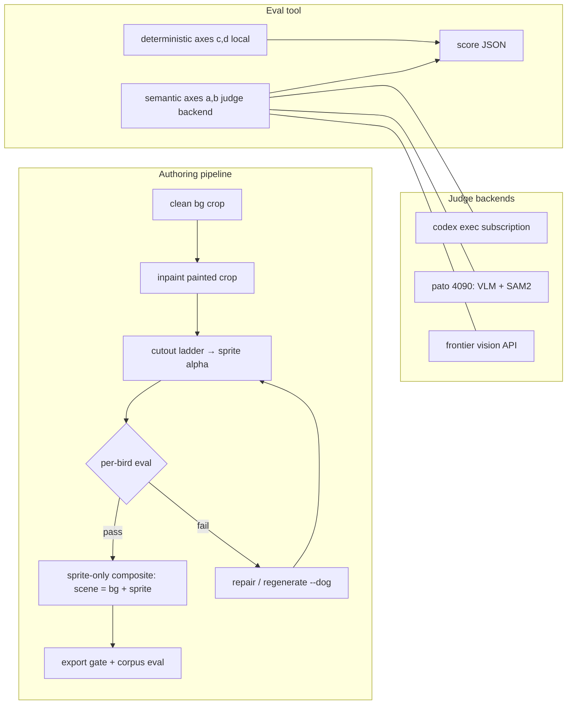

# feat: Sprite-cutout quality eval and sprite-only compositing

## Summary

Build a four-axis evaluation tool for Find The Bird pickup sprites, baseline the shipped 282-sprite corpus, then use the eval to drive two pipeline changes — sprite-only compositing (eliminating cleanup pop-in by construction) and a semantically validated cutout ladder — ending with full regeneration of all 21 shipped levels and a rescore proving improvement.

**Context:** the 2026-07-31 audit found ~15–20% of shipped sprites defective (barrels, parchment fragments, foliage chunks shipped as "birds"; truncated birds; stray specks) while all 282 passed the existing geometry-only gates. The gates validate mask shape, not mask content.

---

## Problem Frame

The level generator (`tools/level-editor`) inpaints birds into backgrounds, then extracts pickup sprites via a diff-mask + fallback ladder (`levelbuilder/api/inpaint.py`). Three player-visible failure classes:

1. **Wrong subject** — cutout is a background chunk or prop; the player "picks up" scenery.
2. **Truncated bird** — the mask cuts through a fully painted bird; the picked-up sprite looks broken.
3. **Pop-in** — the inpaint step painted extra content (foliage, props) beyond the bird; that content is composited into the scene, and pickup restores the `cleanup` rect to clean background, making scenery visibly evaporate.

Root cause for (3): the scene gets the *whole painted region* while the sprite is a *subset* of it, and the two disagree. No gate checks semantic content for (1) and (2).

---

## Requirements

- **R1** — An eval tool (`level-editor` CLI verb) that scores each bird sprite on four axes and returns per-bird JSON scores plus a corpus report. Tool-not-loop: it scores and returns; the agent owns any improvement loop.
- **R2** — Subject definition: the sprite is the **bird plus held/worn items** (binoculars, hat, book, telescope). Perches, branches, shadows, foliage, and props the model painted around the bird are **background**, never part of the sprite.
- **R3** — Axes: (a) **subject correctness** — is the cutout a complete recognizable bird+held-items; (b) **completeness** — no truncation relative to the painted bird; (c) **exclusion** — no background/foliage content inside the sprite; (d) **scene coherence** — simulated pickup (scene − sprite + clean background) leaves no visible residue or discontinuity.
- **R4** — Axes (c) and (d) are deterministic image ops run locally. Axes (a) and (b) use a **pluggable semantic judge backend**; backend choice is a calibration-phase decision, not hardcoded.
- **R5** — Calibration: build a gold-labeled set (~60 sprites spanning known defect classes from the audit), measure each backend's agreement against it, pick the default backend on agreement × cost × throughput. Paid API spend is authorized for calibration.
- **R6** — Baseline the current shipped corpus (282 sprites, 21 levels) with the calibrated eval before changing the pipeline.
- **R7** — **Sprite-only compositing**: the scene becomes clean background + validated sprite (not the whole painted crop). Pickup removes exactly the sprite, restoring pixel-identical clean background — zero pop-in by construction; `cleanup` rects become unnecessary for newly authored levels.
- **R8** — Cutout ladder improvements driven by eval failures: semantic bird+held-items masking, truncation detection routed to the existing repair path, satellite-speck elimination.
- **R9** — Eval wired into the pipeline as a per-bird gate during inpaint/repair and a corpus gate at export (fail-closed, consistent with `export_gate.py`).
- **R10** — Once the improved pipeline scores well on test levels, **fully regenerate all 21 shipped levels** and rescore; final evidence artifact compares baseline vs. regenerated scores.

### Scope Boundaries

**In scope:** eval tool + backends, calibration, baseline, compositing change, ladder improvements, regeneration, evidence.

**Deferred to follow-up work:** sticker-halo style consistency enforcement (record as an eval-reported metric only); the `2026-07-31-001` storage refactor (independent; avoid conflicting edits to the same modules); retiring the `dogs[]` naming debt.

**Out of scope:** game-side runtime changes beyond what regenerated `level.json`s require; photoreal-grade edge blending (the sticker art style makes hard composites acceptable).

---

## Key Technical Decisions

**KTD1 — Judge backend is pluggable; default chosen by calibration.** Three backends behind one interface (input: sprite PNG + painted crop + clean crop + prompt; output: structured verdict JSON):

| Backend | Cost | Throughput | Notes |
|---|---|---|---|
| `codex exec --json -i <imgs>` on subscription | ~free (subscription) | Serial, rate-window bound; check usage window before batches | Proven pattern in this org for headless per-item judging; images supported via `-i` |
| Local models on ubuntu-server 4090 (`pato`) | Free after setup; ~1–2h setup + downloads | Fastest for batch; repeatable | 199 GB disk free; **only 15 GB system RAM** — prefer serving via vLLM/llama.cpp with a ≤8B VLM (e.g. Qwen2.5-VL-7B-AWQ) and SAM2 (~2.5 GB); torch not yet installed |
| Frontier vision API (Gemini/Claude via existing provider plumbing) | Per-image $ | Parallel | Use for gold-label generation and calibration reference; authorized spend |

Recommended prior (to be confirmed by U4 calibration): API for gold labels, codex-exec as default batch judge, 4090 for SAM2 mask ops and as fallback batch judge if codex throughput disappoints.

**KTD2 — Eval consumes the triple** (clean crop, painted crop, sprite) when available from the `.levelbuilder` session workspace. Shipped levels lack painted crops, so the eval must support a **reduced-input mode** (sprite + level background only) — the baseline (U5) runs in this mode; axis (b) completeness is judged from the sprite alone there, with a confidence flag.

**KTD3 — Sprite-only compositing evolves existing machinery**, not a parallel system: `compose_with_mask` / `_isolate_variant_crop` / `recomposite_*` in `levelbuilder/api/inpaint.py` already do per-dog masked pasting. The change is which mask feeds the scene composite (validated sprite alpha instead of broad diff mask). Legacy export shape (`level.json` `cleanup` field) stays schema-valid: cleanup rect degenerates to the sprite rect.

**KTD4 — Deterministic first, semantic second.** Axes (c)/(d) run as cheap local numpy/PIL checks on every bird; the semantic judge runs only on birds passing deterministic checks (or in full-corpus scoring runs). Keeps per-level authoring latency and judge cost low.

**KTD5 — 4090 access pattern:** SSH to `ubuntu-server` (`pato`); models served as a persistent lightweight HTTP endpoint or invoked per-batch via SSH command; eval backend treats it as just another judge URL. New model downloads authorized.

---

## High-Level Technical Design

Score schema (directional): per bird `{axis: {score: 0–1, verdict: pass|warn|fail, evidence: str}}`, corpus report aggregates by level and axis with failure exemplar paths.

---

## Implementation Units

### U1. Eval harness + deterministic axes

**Goal:** `level-editor evaluate-sprites` verb scoring axes (c) exclusion and (d) scene coherence deterministically, with the score schema and reduced-input mode.
**Requirements:** R1, R3(c,d), R4, KTD2, KTD4.
**Dependencies:** none.
**Files:** `tools/level-editor/levelbuilder/api/sprite_eval.py` (new), `tools/level-editor/levelbuilder/cli/main.py`, `tools/level-editor/tests/test_sprite_eval_deterministic.py` (new).
**Approach:** exclusion = sprite alpha ∩ (regions where painted≈clean, i.e. unchanged background leaking into the sprite) + satellite-component detection reusing `_alpha_stats` idioms; coherence = simulate pickup (painted scene − sprite + clean bg) and measure residual diff inside/around the cleanup region. Reduced-input mode degrades gracefully with flagged confidence.
**Test scenarios:** known-good sprite scores pass on both axes; a sprite with baked-in background patch fails exclusion (synthetic fixture); a painted crop with extra foliage outside the sprite fails coherence; reduced-input mode returns flagged scores, never crashes; empty/missing sprite yields fail with evidence, not exception.
**Verification:** verb runs against one shipped level and one session workspace, emitting valid schema JSON.

### U2. Judge backend abstraction + codex and API backends

**Goal:** pluggable semantic judge (axes a, b) with `codex-exec` and frontier-API implementations.
**Requirements:** R3(a,b), R4, KTD1.
**Dependencies:** U1.
**Files:** `tools/level-editor/levelbuilder/api/sprite_judge.py` (new), `tools/level-editor/tests/test_sprite_judge.py` (new).
**Approach:** one interface, structured-JSON verdicts, retry/sanitization mirroring `_with_retries_and_timeout` conventions; prompt encodes the R2 subject rule (bird + held items; perch/foliage = background). Codex backend shells `codex exec --json -i`; API backend uses existing provider plumbing.
**Test scenarios:** backend interface contract with a stub backend; malformed judge output → structured failure, not crash; prompt includes subject rule (guard test, mirroring `test_no_dog_in_bird_prompts.py` style); codex CLI absent → clear skip/error.
**Execution note:** live-run each backend once on a real defect sprite before calling the seam done (first-live-run rule).

### U3. 4090 backend on pato

**Goal:** SAM2 + a ≤8B VLM served on ubuntu-server as a judge/mask backend.
**Requirements:** R4, KTD1, KTD5.
**Dependencies:** U2 (interface).
**Files:** `tools/level-editor/scripts/pato-judge/` (new: setup script, server, README), backend entry in `sprite_judge.py`.
**Approach:** uv-managed env on pato; download SAM2 checkpoint + quantized Qwen2.5-VL (AWQ/GGUF given 15 GB system RAM); minimal HTTP endpoint; health check. Mac side talks HTTP over SSH tunnel or LAN.
**Test scenarios:** health-check + one-image round trip (live, documented in README); Mac-side backend degrades to "backend unavailable" cleanly when pato is down.
**Execution note:** infra unit — smoke/live verification over unit coverage.

### U4. Calibration and backend selection

**Goal:** gold set + agreement study; pick the default judge backend.
**Requirements:** R5, KTD1.
**Dependencies:** U1–U3.
**Files:** `docs/evidence/<date>-sprite-eval-calibration/` (gold labels, per-backend results, decision), config default in `sprite_eval.py`.
**Approach:** ~60 sprites: the audit's known blockers (barrel, parchment, foliage, lantern), truncations, speck cases, and clean exemplars; label via frontier API + human-confirmable contact sheet; report per-backend agreement, cost, wall-time. Paid spend authorized here.
**Test scenarios:** none — evidence/analysis unit; the deliverable is the decision record.

### U5. Baseline the shipped corpus

**Goal:** score all 282 sprites / 21 levels with the calibrated eval; durable baseline artifact.
**Requirements:** R6.
**Dependencies:** U4.
**Files:** `docs/evidence/<date>-sprite-eval-baseline/` (scores JSON, per-level report, contact sheets).
**Approach:** reduced-input mode (KTD2). This is the number regeneration must beat.
**Test scenarios:** none — evidence unit.

### U6. Sprite-only compositing

**Goal:** scene composite uses the validated sprite alpha only; pop-in eliminated for newly authored levels.
**Requirements:** R7, KTD3.
**Dependencies:** U1 (validated alpha definition); parallel-safe with U2–U5.
**Files:** `tools/level-editor/levelbuilder/api/inpaint.py` (`compose_with_mask`, `recomposite_*`), `tools/level-editor/levelbuilder/api/session.py`, `tools/level-editor/tests/test_sprite_only_composite.py` (new).
**Approach:** feed sprite alpha (not broad diff mask) into the scene composite; cleanup rect degenerates to sprite bounds; keep `level.json` schema-valid against `ftd-level-editor` `LevelFileV1`. Preserve the `_isolate_variant_crop` invariant (neighbor removal on recomposite).
**Test scenarios:** composite(scene) − sprite == clean bg pixel-exact within sprite bounds; foliage painted outside the sprite never reaches the scene; recomposite with "no variant" still removes neighbors; exported level passes `validate_level_geometry` and `verify_public_levels`; guard test that cleanup region equals sprite bounds for new exports.
**Execution note:** characterization-test `compose_with_mask` current behavior before modifying.

### U7. Cutout ladder improvements

**Goal:** raise cutout quality where the eval says it fails: semantic bird+held-items masking, truncation detection → repair routing, satellite-speck removal.
**Requirements:** R8, R2.
**Dependencies:** U3 (SAM2 service), U4 (calibrated eval as the meter).
**Files:** `tools/level-editor/levelbuilder/api/inpaint.py` (ladder fns, `_clean_sprite_alpha`, `_sprite_repair_reason`), tests alongside existing ladder tests.
**Approach:** VLM-guided SAM2 prompting (point/box on the bird, not the hitbox center blindly); truncation check = eval axis (b) on candidate mask, failing masks routed to the existing repair ladder rather than shipped; tighten satellite-component keep rule (current 2.6×radius zone admits crumbs). Iterate: change → rescore gold set → keep only changes that improve agreement-weighted scores.
**Test scenarios:** synthetic truncated mask is detected and routed to repair; crumb speck outside bird body is dropped while a held telescope crossing the hitbox edge is kept; ladder still fails closed when all strategies fail.

### U8. Export-gate integration, full regeneration, rescore

**Goal:** eval gates export; regenerate all 21 levels through the improved pipeline; final evidence vs. U5 baseline.
**Requirements:** R9, R10.
**Dependencies:** U6, U7.
**Files:** `tools/level-editor/levelbuilder/api/export_gate.py`, `games/find_the_bird/public/levels/` (regenerated), `docs/evidence/<date>-sprite-eval-regeneration/`.
**Approach:** per-bird gate at inpaint/repair time (fail → repair loop budgeted per bird), corpus gate at export (fail-closed, atomic, matching existing `validate_corpus` semantics); regeneration via the existing batch driver pattern (`docs/evidence/2026-07-31-.../run_generation.py`); rescore and produce baseline-vs-after comparison with contact sheets.
**Test scenarios:** export refuses a corpus containing a known-bad sprite (fixture); gate crash = refusal not bypass; regenerated `level.json`s pass schema + geometry + `verify_public_levels`.
**Execution note:** regeneration consumes provider quota — check usage windows and run as resumable batches. On-device spot-check of at least one regenerated level (device-first rule) before declaring done.

---

## Verification Contract

- `uv run pytest` green in `tools/level-editor` and `tools/ftd-level-editor` after each unit.
- U4 decision record exists with per-backend agreement numbers.
- U5 baseline and U8 rescore artifacts exist; U8 shows blocker-rate reduction to zero and axis-score improvement over baseline.
- One regenerated level verified on the physical iPhone (pickup animation: no pop-in, sprite complete).

## Definition of Done

All 21 levels regenerated through the sprite-only-composite pipeline, corpus eval gate green with zero blocker-class sprites, rescore evidence published comparing baseline → regenerated, and one on-device capture confirming pop-in-free pickup.

## Open Questions (deferred to implementation)

- Whether codex-exec throughput within the usage window suffices for 282-sprite batch scoring, or the 4090 becomes the default batch judge (U4 answers this).
- Exact VLM quantization that fits pato's 15 GB system RAM comfortably (U3 answers this).
- Per-bird repair budget before a level is flagged for human review (tune in U8).
