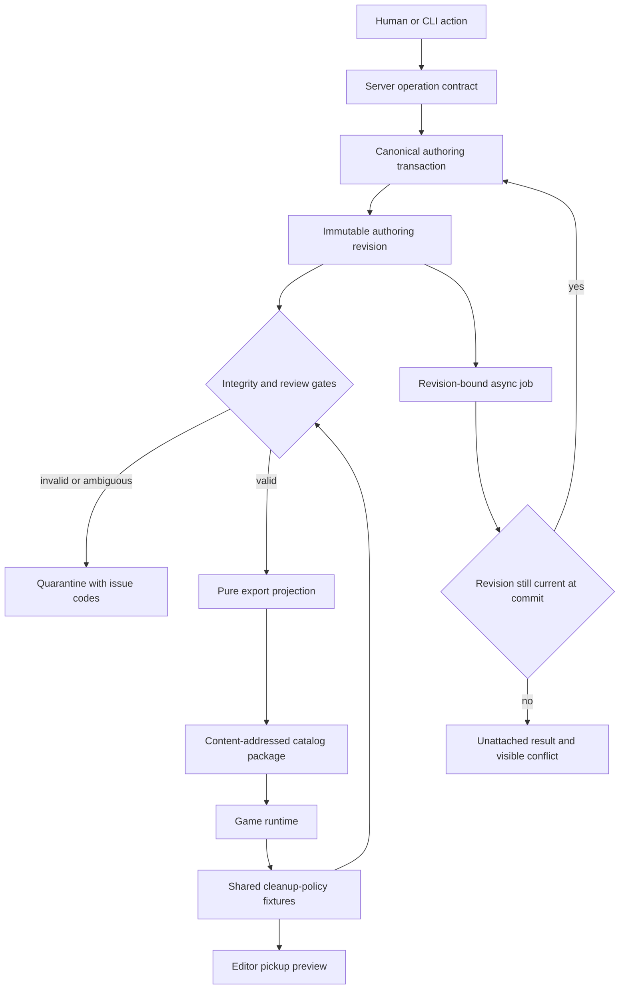

# Find the Bird Artifact Integrity - Plan

## Goal Capsule

- **Objective:** Eliminate silent drift between painted birds, human-reviewed hitboxes, extracted sprites, cleanup geometry, restore backgrounds, editor previews, and shipped runtime packages.
- **Authority:** Current source pixels and explicitly human-reviewed authoring data outrank generated sidecars and exported packages. A public package is a derived projection, never editable authority.
- **Execution profile:** Data-integrity repair across the level-editor backend, CLI, editor UI, generation jobs, export/catalog pipeline, and Find the Bird runtime contract.
- **Stop conditions:** Stop publication and quarantine a level whenever identity or provenance cannot be proven. Never guess by array index, geometry proximity, or folder name in an authoritative mutation.
- **Tail ownership:** The implementation must audit and migrate the active corpus, leave ambiguous levels unmodified and visibly quarantined, then verify editor and physical-device behavior before any repaired package is treated as safe.

---

## Product Contract

### Summary

Every bird becomes one durable entity whose identity survives authoring, generation, human review, export, catalog publication, and runtime pickup. Every derived artifact records which immutable authoring revision produced it. Moving a hitbox, replacing a sprite, changing padding, or rebuilding a restore background creates a new unreviewed revision instead of silently preserving an obsolete blessing.

### Problem Frame

The current system has several individually plausible authorities that disagree. Authoring hitboxes have stable IDs, sprite candidates and folders are indexed as `dog_NN`, export rewrites runtime IDs from array positions, review metadata is mirrored into two stores, and editor pickup preview does not execute runtime cleanup geometry. Geometry and positional fallbacks hide these disagreements until a bird pickup removes the wrong pixels, leaves residue, or displays a sprite belonging to another bird.

The failures are recurrent because repair logic currently operates after identity has already been lost. Expanding cleanup boxes, translating padding, or recomputing placements can improve one view while rebinding another artifact to a different bird.

### Requirements

**Identity and authority**

- R1. One immutable `birdId` must identify a bird in hitboxes, session records, generation inputs, sprite candidates, sidecars, review snapshots, durable jobs, source levels, exported runtime levels, catalog evidence, and runtime events.
- R2. Array positions and `dog_NN` paths may remain storage or display slots, but no mutation, job commit, review decision, export join, or runtime association may use them as identity.
- R3. The authoring workspace is the only writable authority; public and catalog packages are immutable derived projections and cannot hydrate or overwrite canonical authoring state without an explicit import migration.

**Revision and review integrity**

- R4. A content-derived authoring revision must bind scene pixels, clean-background source, the identity-bearing compatibility slot order, hitbox geometry, selected generation, sprite pixels, sprite placement, anchors, flips, cleanup geometry, and restore-background provenance; gallery-only presentation order is operational metadata.
- R16. Operational metadata such as archive state, lineup membership, job progress, and gallery filters must use a separate revision domain and must not stale content review.
- R5. Hitbox and final-cutout blessings must bind to the exact applicable revision and attributable human action; any bound mutation must make the relevant review stale atomically.
- R6. Automated repair, migration, generation, extraction, placement, export, or catalog refresh must never bless or restore blessing automatically.

**Jobs, export, and runtime parity**

- R7. Paid and long-running jobs must capture `birdId` and immutable input revisions at submission, revalidate before committing each result, and reject stale results without writing them to another bird.
- R8. Export must be a pure fail-closed projection from one validated revision: it may not rebind birds, expand cleanup, silently omit birds, refresh source art, or repair authoring data.
- R9. Export must reject contaminated or mismatched restore backgrounds, cleanup geometry that does not cover its own bird evidence, cleanup that would remove protected neighboring bird pixels, and any identity or provenance mismatch.
- R10. Editor pickup preview and automated validation must reproduce the runtime cleanup policy, including the 2x footprint and neighbor Voronoi clipping, from the same contract fixtures.

**Migration and operator workflow**

- R11. A read-only corpus audit must classify every active, lineup, archived, public-only, and source-only level by explicit issue codes before any migration writes occur.
- R12. Migration may repair only evidence-backed one-to-one mappings, must be byte-idempotent on repeat runs, must preserve source pixels, and must quarantine ambiguous levels without changing their blessings.
- R13. Previously blessed levels that require mutation must retain an audit record of the prior blessing but remain unblessed until a human verifies hitboxes and cutouts again.
- R14. The editor and CLI must expose the same audit, migration preview/apply, quarantine, placement, extraction/regeneration, review-readiness, job-status, and export-preflight operations through one server contract.
- R15. Every content mutation and blessing must use compare-and-set against the content revision the client loaded; conflicts return expected/actual revisions and changed artifact classes without overwriting either editor's work.

### Actors and Key Flows

- A1. **Human reviewer:** Moves hitboxes and sprites, adjusts cleanup padding, inspects runtime-equivalent pickup preview, and explicitly blesses hitboxes or final cutouts.
- A2. **Automation client:** Uses the CLI/server to audit, propose deterministic repairs, run generation work, and preflight export; it cannot impersonate A1 for blessing.
- A3. **Publisher/runtime:** Consumes only a validated immutable projection and never repairs or reinterprets authoring identity.

- F1. **Edit and review:** A1 edits one bird by `birdId`; the server commits the canonical mutation and revision together; affected review state becomes stale; all clients read the same result.
- F2. **Asynchronous generation:** A2 submits work against a bird and revision; provider work runs without a global lock; the commit succeeds only if identity and revision still match, otherwise the result is retained as an unattached artifact with a visible conflict.
- F3. **Publish:** A2 requests preflight/export; the server snapshots one revision, validates identity, geometry, restore provenance, review policy, and runtime semantics, then materializes a content-addressed package without changing authoring data.
- F4. **Corpus repair:** A2 runs audit and dry-run migration; deterministic cases receive proposed mappings; ambiguous cases enter quarantine; A1 reviews every mutated formerly blessed level before it can regain final approval.

### Acceptance Examples

- AE1. Given birds are reordered, inserted, or deleted after a job starts, when the job finishes, then it either commits to the same `birdId` and revision or returns a stale-input conflict with zero wrong-bird writes.
- AE2. Given cleanup padding changes on a final-reviewed level, when review status is read from the UI or CLI, then final cutouts report stale even if sprite pixels and placement are unchanged.
- AE3. Given workspace and public review files disagree, when the level is opened, then workspace authority wins only if its revision is valid; otherwise the level is quarantined instead of selecting the first parseable copy.
- AE4. Given a restore background contains bird pixels or belongs to another scene revision, when export runs, then no source or public file changes and preflight reports the exact bird/revision violation.
- AE5. Given a legacy level has only positional evidence and two plausible bird mappings, when migration runs, then it writes no mapping, preserves all pixels and prior metadata, and flags the level for human repair.
- AE6. Given a migrated level has a proven one-to-one mapping, when migration is run twice, then the second run changes no bytes and does not restore any blessing.
- AE7. Given editor preview shows all birds picked up, when the same package runs on device, then both surfaces use the same cleanup polygons and restore pixels.
- AE8. Given two editor tabs load the same revision, when one saves and the other later saves stale geometry, then the second receives a conflict and cannot overwrite the first.
- AE9. Given authoring for a currently live level is quarantined, when players load the catalog, then the last-known-good immutable package remains served while republish and sequence activation are blocked.

### Success Criteria

- The catalog-wide integrity audit reports zero silently rebound birds; every unresolved case has a stable quarantine reason.
- The runtime cleanup geometry sweep passes for every non-archived publishable level, with zero cleanup regions missing their own bird and zero protected-neighbor removals.
- Reorder/delete/insert and stale-job tests produce zero wrong-bird writes across UI, API, CLI, export, and restart paths.
- Exporting an unchanged revision is deterministic and does not mutate the authoring workspace.
- Every previously blessed level is either byte-preserved and still valid or explicitly stale/quarantined with its prior review history retained.

### Scope Boundaries

**Included now**

- Canonical identity, revision/provenance, mutation transactions, job commit guards, audit/migration/quarantine, export validation, CLI/UI parity, editor/runtime preview parity, and active-corpus repair.

**Deferred to follow-up work**

- New CV matching methods, cutout-model hill climbing, pickup animation styles, and changing the 2x/Voronoi cleanup policy based on aesthetic experiments.
- Renaming all user-facing “dog” terminology and physical folder names; compatibility slots may remain until a separate storage migration is justified.

---

## Planning Contract

### Key Technical Decisions

- KTD1. **`birdId` is the semantic identity; slot is presentation/storage.** Exported runtime `dog.id` should carry `birdId`. If path compatibility requires `dog_NN`, expose it separately as a slot. Runtime found-state, neighbor exclusion, analytics, sprites, and cleanup all depend on identity, so export-time renumbering is not benign.
- KTD2. **One canonical snapshot, many immutable projections.** The authoring workspace owns editable state. Public packages and catalog entries carry the source revision and content hashes but never become fallback write authority. This follows the repository's Published Revision and Projection Revision vocabulary in `CONCEPTS.md`.
- KTD2a. **Content and operational revisions are separate.** Content review binds only scene, bird, hitbox, sprite, cleanup, and restore state. Archive, lineup, job-progress, and UI-filter changes do not invalidate a human content review.
- KTD3. **No compatibility fallback in normal operation.** Index, nearest-box, and geometry fallbacks move into a one-time migration classifier. A missing identity in an ordinary route, worker, preview, or export is an integrity error.
- KTD4. **Optimistic commit guards, not long global locks.** Provider calls capture an input revision and commit only after revalidation. This prevents stale writes without holding a process-local lock during network work.
- KTD5. **Blessing is a human assertion over hashes.** Automation can calculate readiness and propose a repair, but only an attributable human action creates a blessing. A migration can preserve review history, never its current approval after bytes or bound metadata change.
- KTD6. **Export validates; it does not heal.** Cleanup expansion, color refresh, partial-dog filtering, ID rewriting, and restore construction move to explicit authoring/materialization operations. Export takes one immutable snapshot and either writes its projection atomically or writes nothing.
- KTD7. **Runtime semantics are tested from shared fixtures.** Keep the TypeScript runtime implementation authoritative for pickup behavior, then expose deterministic cleanup-policy fixtures consumed by Python preview/export tests. Do not duplicate an approximately similar Python algorithm without parity vectors.
- KTD8. **Cross-process commits use a per-session OS file lock plus revision CAS.** Acquire an advisory `flock` on a stable lock file, read and compare the current content revision while holding it, stage and fsync the complete revision and parent directory, atomically rename the pointer, then release. Catalog selection uses its existing serialized workflow separately after package validation. A two-process race must yield one commit and one revision conflict; stale locks disappear with the owning process.

### High-Level Technical Design

The canonical snapshot should be small JSON metadata plus hashes of large image assets, not duplicated image blobs. A revision includes an ordered projection for display but all joins use `birdId`. A transaction stages metadata changes, validates cross-file invariants, atomically swaps canonical metadata, then emits derived caches or catalog refresh work.

Each immutable content revision is staged as a complete manifest/directory and installed by atomically swapping one current-revision pointer after validation. Mutation and blessing use compare-and-set on that pointer. Job outputs first land as unattached candidates and are promoted through the same transaction; a failed request or stale job creates no content revision.

Normal reads have four explicit pointer states: valid current revision loads; absent pointer on a legacy level returns `migration_required`; malformed or dangling pointer returns `quarantined_integrity`; a fully staged revision without a completed pointer swap is ignored and may be resumed or garbage-collected only by the explicit recovery path. Ordinary reads never reconstruct from public packages or legacy sidecars.

### Review Invalidation Matrix

| Mutation | Hitbox review | Final-cutout review |
|---|---|---|
| Scene or restore pixels/provenance | Stale | Stale |
| Bird add, delete, identity, compatibility slot order, or hitbox geometry | Stale | Stale |
| Sprite pixels, active candidate, placement, anchor, flip, or cleanup | Current | Stale |
| Archive, lineup, job status, gallery filter | Current | Current |

Invalidation occurs only when a new content revision commits. Starting, cancelling, or failing an operation does not alter review state.

### Sequencing

1. Freeze writes long enough to inventory the existing data contract and capture baseline corruption evidence without changing it.
2. Land canonical identity and revision primitives, then implement the read-only audit on that contract before changing individual routes.
3. Convert mutations and async jobs to the new contract before removing fallbacks.
4. Establish shared runtime cleanup fixtures and cross-language parity before building the export semantic gate.
5. Make export pure after every authoring mutation can produce a valid snapshot and runtime semantics are testable.
6. Dry-run migration against the full corpus, inspect issue classes, then apply deterministic repairs and quarantine the rest.

### Sources and Research

- `CONCEPTS.md` defines semantic identity, Published Revision, and Projection Revision; this plan applies those project-wide terms to level content.
- `tools/level-editor/PIPELINE.md` remains the generation recipe, but its output must enter the canonical revision contract before review or export.
- `tools/level-editor/levelbuilder/api/session.py` contains current identity joins, dual-store reviews, hitbox persistence, restore generation, and export mutation.
- `tools/level-editor/levelbuilder/api/inpaint.py` contains positional regeneration jobs and generation commit paths.
- `tools/level-editor/levelbuilder/api/sprite_eval.py` contains manual and automatic placement rules; manual human authority remains less restrictive than automatic safety.
- `games/find_the_bird/src/scenes/cleanupGeometry.ts` and `games/find_the_bird/tests/unit/restoration-cleanup-geometry.test.ts` define and sweep actual runtime cleanup behavior.
- `docs/solutions/architecture-patterns/data-first-semantic-contract-and-immutable-projections.md` supports a canonical registry with immutable generated revisions.
- `docs/solutions/logic-errors/yolo-hitbox-anchored-label-corpus.md` establishes reviewed hitbox position plus current pixel evidence as authority over stale sidecar extent.
- Commits `0e4747b77`, `4ddf5cd6b`, `5661df99d`, and `4c09599e8` show repeated local fixes for manual placement, reviewed alignment, padding binding, and cleanup geometry; their recurrence motivates removing positional fallbacks rather than adding another repair branch.

### System-Wide Impact

- **Data lifecycle:** Session creation, hitbox edits, deletes, generation, extraction, manual placement, padding edits, blessing, export, archive/revoke, catalog approval, and boot hydration all need explicit revision behavior.
- **Concurrency:** Multi-file writes and job completion need per-session transactional metadata and optimistic revision checks. Process-local locks alone are insufficient under multiple workers.
- **Compatibility:** Legacy and public-only sessions require explicit import/migration. Ordinary gallery boot must not synthesize canonical state from exported projections.
- **Quarantine:** Quarantine blocks content mutation, promotion, blessing, export, and future activation while permitting inspection and explicit deterministic repair/import. It preserves assets and lineup metadata, remains distinct from archive, and does not remove a last-known-good live package.
- **Clients:** UI and CLI must consume one server operation/result schema, including issue codes and revision conflicts. Parity tests must detect omitted operations rather than validate only a hand-maintained mapping.
- **Runtime:** Stable exported IDs affect found state, texture keys, analytics, achievements, neighbor cleanup, and saved progress. A compatibility decision must preserve existing player progress when old positional IDs are replaced.

### Risks and Mitigations

- **Saved-player identity migration:** Changing exported IDs can invalidate found-state or analytics continuity. Version the level projection and provide an explicit old-slot-to-`birdId` compatibility map for existing published revisions.
- **Blessed-level mutation:** Automated migration could destroy the golden set. Audit first, archive pre-migration metadata, mutate only deterministic cases, retain prior review history, and require human re-review after any bound change.
- **Split-brain stores during rollout:** Old code may continue writing public and workspace copies. Introduce read compatibility first, switch all writers to canonical authority, then remove fallback reads after corpus migration.
- **Crash or rollback during migration:** Store a byte-level before manifest, stage each level independently, journal per-level completion, keep prior content-addressed packages, and provide verified roll-forward/rollback. Migration never mutates live/draft lineup or catalog selection.
- **Provider spend from stale retries:** Revision-check before submission where possible and always before commit; return reusable unattached outputs only when their full provenance matches a later request.
- **False confidence from aggregate metrics:** Gate on zero unsafe levels and disclose worst-level/per-bird failures; content addressing detects byte changes, not semantic correctness.

---

## Implementation Units

### U1. Define the canonical bird and revision contract

- **Goal:** Add the data model and pure validators that make identity and provenance explicit without changing existing levels.
- **Requirements:** R1-R6, R16; KTD1-KTD3, KTD5.
- **Files:** `tools/level-editor/levelbuilder/api/level_schema.py`, `tools/level-editor/levelbuilder/api/session.py`, a focused new contract module under `tools/level-editor/levelbuilder/api/`, generated/runtime schema consumers under `games/find_the_bird/src/`, and schema tests under `tools/level-editor/tests/`.
- **Approach:** Define non-reusable `birdId`, compatibility slot, separate content/operational revisions, asset descriptors, active-generation binding, cleanup/restore provenance, and review assertions. Centralize semantic hashing and invariant validation. Stage a full immutable revision and install its current pointer under the per-session OS lock with revision compare-and-set and fsync. Implement the explicit valid, migration-required, quarantined-integrity, and orphaned-stage read states. Keep legacy parsing read-only and label every fallback-derived field as unresolved until migration.
- **Test scenarios:** Duplicate IDs fail; compatibility slot-order changes stale the revision while gallery-only presentation ordering does not; cleanup/anchor/flip/pixel changes alter the correct revision; public projection cannot override canonical state; absent/malformed/dangling pointers never hydrate from projections; a two-process race yields exactly one commit and one conflict.
- **Verification:** Contract fixtures round-trip between Python and TypeScript with stable hashes and reject incomplete identity/provenance.

### U2. Add a read-only corpus integrity audit and quarantine model

- **Goal:** Make every current inconsistency visible before any repair occurs.
- **Requirements:** R9, R11-R13; KTD3.
- **Files:** `tools/level-editor/levelbuilder/api/canonical_migration.py`, `tools/level-editor/levelbuilder/api/public_levels.py`, `tools/level-editor/levelbuilder/api/routes.py`, `tools/level-editor/levelbuilder/cli/main.py`, gallery API types/components, and new audit tests.
- **Approach:** Scan source, public, lineup, archived, and public-only inventory. Emit stable per-level/per-bird issue codes for identity ambiguity, projection-only authority, contaminated restore, missing bird evidence, cross-bird cleanup, stale blessing, or divergent stores. Quarantine is operational metadata, not archive or deletion, and never changes lineup membership by itself.
- **Test scenarios:** Archived levels are classified but excluded from normal editor counts; public-only packages do not hydrate source; mixed source/public divergence is reported deterministically; repeated audit changes no bytes.
- **Verification:** Full-corpus audit produces a machine-readable report with mutually exclusive safe/migratable/quarantined totals and exact evidence paths.
- **Dependencies:** U1.

### U3. Make canonical mutations transactional and review-aware

- **Goal:** Ensure every human or automated edit targets one `birdId`, commits one revision, and invalidates review correctly.
- **Requirements:** R1-R6, R14-R15; F1.
- **Files:** `tools/level-editor/levelbuilder/api/session.py`, `tools/level-editor/levelbuilder/api/routes.py`, `tools/level-editor/levelbuilder/api/sprite_eval.py`, `tools/level-editor/ui/src/components/CutoutReviewPanel.tsx`, `tools/level-editor/ui/src/api.ts`, and focused persistence/review tests.
- **Approach:** Replace mirrored best-effort writes with a canonical metadata transaction and derived projection refresh. Remove index/geometry fallback from save, delete, placement, padding, confirmation, and review mutations. Blessings snapshot all bound fields, including cleanup, anchors, restore provenance, and active identity set. Keep manual placement bounded only by positive in-scene geometry while automatic placement retains containment safety.
- **Test scenarios:** Reorder/delete/insert during edits never changes surviving bindings; concurrent hitbox save and blessing cannot yield a current blessing on old geometry; two-tab stale saves return conflict; padding-only edits stale final review; archive/job-state changes do not; failed multi-bird validation writes nothing.
- **Verification:** UI and direct API reads return the same revision and review state after every mutation, including process restart.
- **Dependencies:** U1.

### U4. Version generation and extraction jobs by identity and input revision

- **Goal:** Prevent delayed or retried provider work from committing to the wrong bird or obsolete scene.
- **Requirements:** R1, R4-R7, R14-R15; F2, AE1.
- **Files:** `tools/level-editor/levelbuilder/api/inpaint.py`, job-store modules, route request/response models, `tools/level-editor/levelbuilder/cli/main.py`, editor job-status code, and cutout/regeneration tests.
- **Approach:** Replace `dogIndices` authority with `birdId` plus immutable input descriptors in parents, children, and idempotency keys. Revalidate before provider submission and promote candidates with compare-and-set. Preserve stale outputs as auditable unattached artifacts with an explicit `completed_stale`/`needs_review` result; never reuse a completed child unless full provenance matches.
- **Test scenarios:** Reorder/delete/insert after submission; hitbox or scene mutation mid-job; restart after partial batch; duplicate retry; stale child result; provider success followed by revision conflict. All must produce zero wrong-bird writes and no duplicate paid submission where provenance is identical.
- **Verification:** Job event streams and CLI/UI status identify committed, stale, reusable, and failed children by `birdId` and revision.
- **Dependencies:** U1, U3.

### U5. Turn export into a pure, fail-closed projection and preserve installed progress

- **Goal:** Publish exactly one validated revision without modifying authoring state.
- **Requirements:** R3-R10; F3, AE4.
- **Files:** `tools/level-editor/levelbuilder/api/session.py`, `tools/level-editor/levelbuilder/api/export_gate.py`, `tools/level-editor/levelbuilder/api/public_levels.py`, catalog/publishing modules, `tools/level-editor/scripts/publish_ftb_cdn.py`, Find the Bird level-loading and saved-state consumers under `games/find_the_bird/src/core/` and `games/find_the_bird/src/scenes/`, and export/publishing/upgrade tests.
- **Approach:** Move recomposition, cleanup adjustment, restore generation, and partial-dog decisions into explicit pre-export materialization. Snapshot under a revision, validate outside destructive destinations, stage the complete revision-addressed package, verify hashes and semantics, then atomically point the catalog at it while retaining prior packages for rollback. Carry `birdId`, compatibility slot/map, source revision, and asset provenance into level/catalog metadata. Version the projection and translate legacy positional found-state at level/save hydration through the package alias map; preserve aliases for every retained published revision and fail visibly on missing or colliding aliases.
- **Test scenarios:** Missing bird, contaminated restore, wrong scene hash, cleanup missing its own evidence, protected-neighbor overlap, concurrent authoring mutation, and failed catalog swap all leave canonical and current public bytes unchanged. Upgrade fixtures from currently published positional saves preserve found birds, occurrence identity, and achievement behavior after `birdId` migration.
- **Verification:** Two exports of one unchanged revision are content-identical; export performs no source writes; package validation rejects every known corrupted fixture.
- **Dependencies:** U1, U3, U4, U6.

### U6. Unify editor preview and runtime cleanup semantics

- **Goal:** Make the all-picked-up review view a faithful predictor of device behavior.
- **Requirements:** R9-R10; F1, AE7; KTD7.
- **Files:** `games/find_the_bird/src/scenes/cleanupGeometry.ts`, `games/find_the_bird/tests/unit/restoration-cleanup-geometry.test.ts`, shared fixture generation, `tools/level-editor/levelbuilder/api/routes.py`, `tools/level-editor/tests/test_pickup_preview.py`, and review-panel preview consumers.
- **Approach:** Produce deterministic cross-language fixtures for 2x expansion, scene clipping, and neighbor Voronoi exclusion. Preview uses canonical revision inputs and restore asset, never translates exported rectangles by an index-matched current hitbox.
- **Test scenarios:** Close pairs, edge birds, moved hitbox, deleted neighbor, mismatched restore dimensions, and known Yucatán/Lantern residue cases render identical cleanup masks across runtime fixtures and editor preview.
- **Verification:** Pixel-mask comparison passes for all shared fixtures; catalog cleanup sweep reports zero unsafe publishable levels after migration.
- **Dependencies:** U1.

### U7. Replace hand-maintained client parity with a server operation contract

- **Goal:** Make it mechanically impossible for a primary editor action to exist only in the UI or only in the CLI.
- **Requirements:** R14-R15; A1-A2.
- **Files:** `tools/level-editor/levelbuilder/cli/main.py`, FastAPI route metadata/operation registry, `tools/level-editor/tests/test_cli_parity.py`, UI API inventory tests, and operator documentation.
- **Approach:** Register atomic server operations and their identity, revision, actor, result, and error contracts. Both client inventories are checked against that registry. Bless operations require an explicit human attribution/confirmation artifact; automation operations remain composable and return after one action.
- **Test scenarios:** Missing client verb, mismatched schema/error code, stale revision conflict, human-only blessing attempted without attribution, and long-running job status/event parity.
- **Verification:** Generated inventory diff is empty for audit, migration, placement, jobs, readiness, blessing, preflight, and export operations.
- **Dependencies:** U2-U5.

### U8. Migrate and verify the existing corpus safely

- **Goal:** Repair deterministic cases, quarantine ambiguous ones, and re-establish a trustworthy lineup without losing human work.
- **Requirements:** R11-R14; F4, AE3, AE5-AE6.
- **Files:** migration/audit modules, corpus fixtures under `tools/level-editor/eval/`, migration reports under `docs/reports/`, and affected authoring/public level metadata only after reviewed dry-run evidence.
- **Approach:** Capture a byte-level pre-migration manifest and hashes, then journal per-level staged commits. Apply evidence-based one-to-one mappings only when current pixels and reviewed hitboxes agree. Preserve image bytes. Record old positional aliases for compatibility. Every migrated blessing becomes historical evidence and the new revision enters `verification_required`, even when pixels match. Import public-only levels only through an explicit unblessed revision; otherwise keep them frozen read-only. Apply to non-lineup canaries first, then reviewed lineup levels, then remaining lineup levels. Archived levels remain untouched unless separately authorized.
- **Test scenarios:** Dry-run/apply parity; second-run byte idempotence; blessed unchanged level preservation; deterministic changed level staling; ambiguous level quarantine; archived exclusion; lineup membership stability; rollback from the captured manifest.
- **Verification:** Compare pre/post hashes, issue counts, lineup IDs/order, blessing history, and worst-level geometry. No changed source pixels, no automatic blessing, and no silent exclusions are permitted.
- **Dependencies:** U2-U7.

### U9. Harden catalog and release gates

- **Goal:** Prevent recurrence after migration and prove the repaired behavior on the actual game target.
- **Requirements:** R1-R16; all acceptance examples.
- **Files:** `tools/level-editor/levelbuilder/api/export_gate.py`, catalog validation tests, `games/find_the_bird/tests/unit/restoration-cleanup-geometry.test.ts`, build/release scripts, and relevant handoff/runbook docs.
- **Approach:** Make integrity audit, schema parity, runtime cleanup geometry, restore provenance, review staleness, and UI/CLI operation parity mandatory gates for publishable non-archived levels. Then rebuild, install, launch, and capture representative pickups on the connected phone using the canonical device harness.
- **Test scenarios:** Reintroduce each former fallback or corrupted fixture and prove the gate fails before package mutation. Exercise clean, close-pair, edge, migrated, and quarantined cases.
- **Verification:** Automated gates are green; physical-device captures show correct bird removal and no wrong-bird cleanup for the representative residue set. Report build, install, launch, and visual proof separately.
- **Dependencies:** U8.

---

## Verification Contract

| Gate | Scope | Expected outcome |
|---|---|---|
| Python integrity suite | Canonical identity, mutation transactions, jobs, migration, export, publishing, preview, CLI parity | All focused level-editor tests pass with zero wrong-bird writes and zero partial canonical mutations. |
| Editor UI checks | Cutout review panel, gallery inventory, operation/result handling | UI build and focused interaction tests pass; review and quarantine state match server responses. |
| Schema and publishing checks | Editor/runtime schema and catalog package creation | Cross-language fixtures agree; refused export changes no source or public bytes. |
| Runtime unit sweep | Every non-archived publishable Find the Bird level | Every bird has valid cleanup provenance, owns its cleanup evidence, and protects unfound neighbors. |
| Migration evidence | Full corpus before/after manifests and resumable journal | Repeat apply is byte-idempotent; crash recovery is per-level atomic; lineup membership/order and image pixels are preserved; ambiguous cases are quarantined. |
| Physical-device verification | Representative clean, residue, close-pair, edge, and migrated levels | Exact installed build launches; consecutive pickup frames show correct cleanup and no wrong-bird removal or residue caused by identity drift. |

Use the repository's focused commands as the starting set: `uv run --project tools/level-editor pytest` for the named level-editor test modules, the `@fabrikav2/level-editor` build and focused UI tests, `editor:publishing:test` and `editor:schema:check` for the editor package, and the Find the Bird unit sweep containing `restoration-cleanup-geometry.test.ts`. The executor must inspect package scripts before finalizing exact command syntax because workspace scripts have changed during this editor work.

---

## Definition of Done

- R1-R16 are implemented and traced to passing tests and observable operator behavior.
- Every normal-path identity join uses `birdId`; positional and geometric inference exists only in the explicit migration classifier.
- Canonical authoring mutations, review invalidation, and async job commits are revision-safe under concurrency and restart.
- Export is deterministic, source-read-only, atomic, and fails closed on identity, geometry, sprite, cleanup, restore, or provenance disagreement.
- UI and CLI expose the same server operations and return consistent revision, quarantine, readiness, and error state.
- The active corpus has a reviewed audit artifact; deterministic migrations are idempotent; unresolved levels are quarantined; no archived level or source pixel was modified without authorization.
- Runtime and editor preview cleanup masks agree on shared fixtures, and the catalog-wide cleanup sweep has zero unsafe publishable levels.
- The rebuilt game is installed and launched on the connected phone, and inspected frame evidence confirms representative pickups no longer remove the wrong bird or use stale cleanup geometry.
- All dead-end compatibility branches, temporary migration experiments, and obsolete duplicated authorities introduced or superseded by this work are removed before completion.
