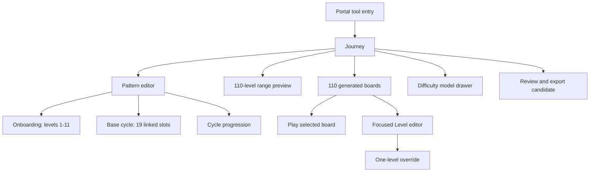
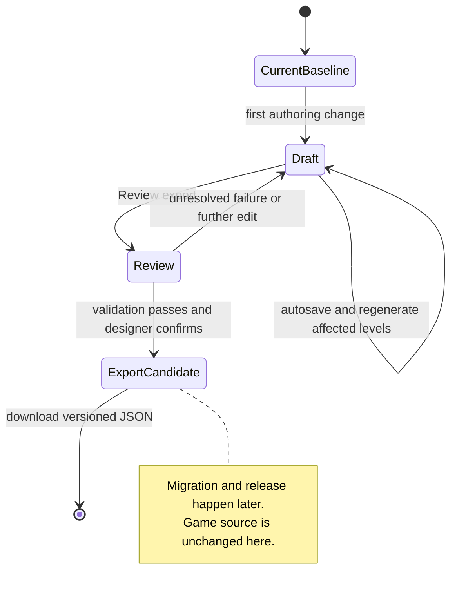
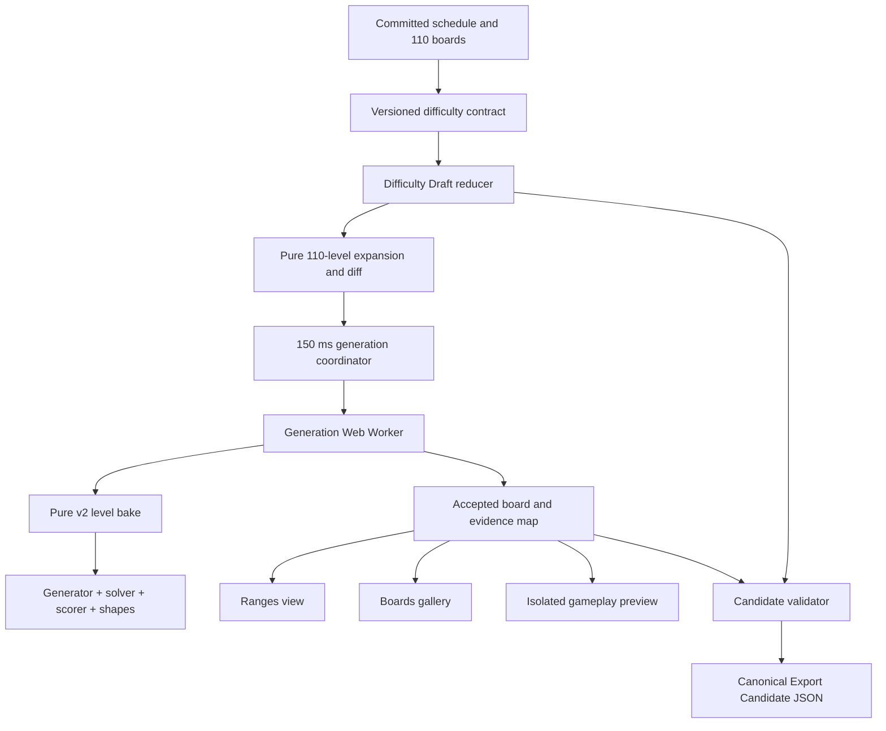
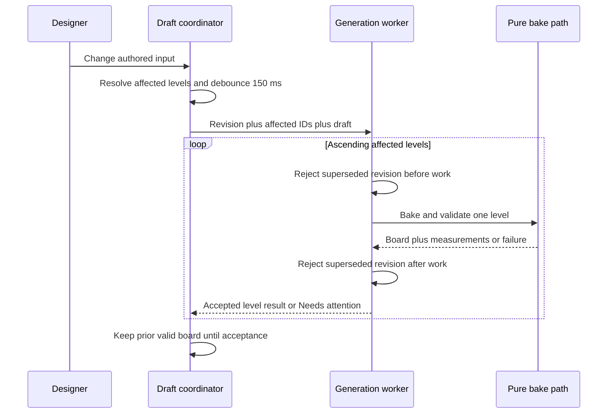
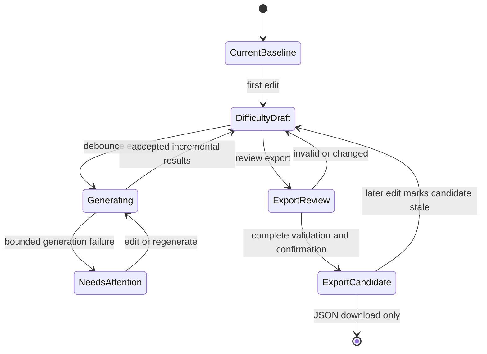

# Marble Run Difficulty Editor - Plan

## Goal Capsule

- **Objective:** Give a Marble Run designer a small, self-explanatory tool for authoring the 110-level difficulty journey, inspecting and playing generated boards, tuning exceptions, and exporting a validated migration candidate.
- **Product authority:** The current Marble Run 19-slot schedule and generator behavior define what the tool edits; the designer CSV defines the range-oriented interaction language.
- **Execution profile:** A game-owned React and TypeScript tool mounted through Portal's authenticated tool boundary.
- **Open blockers:** None for implementation planning. The missing supported v2 bake path is enabling scope, not a deferred dependency.

---

## Product Contract

### Summary

Build a Marble Run difficulty editor where designers author onboarding, one reusable base cycle, and cycle progression instead of editing 110 unrelated levels. The tool expands those inputs into a playable draft, regenerates affected boards, supports focused overrides, and exports one complete candidate JSON without changing the game directly.

### Problem Frame

Marble Run already has a sophisticated authored difficulty model, but its intent is encoded in source, generator constraints, and a historical spreadsheet. A designer cannot safely adjust the journey, see how global rules affect every board, or hand engineering a complete reviewed candidate without editing code.

The current game consumes a baked level set while the supported campaign bake driver does not exist in Fabrikav2. A view-only editor would reproduce the spreadsheet's appearance without completing its job. The v0 must therefore own deterministic draft generation and export, while leaving source migration and release approval explicit.

### Key Decisions

- **Edit causes, inspect consequences.** Journey edits onboarding, the linked base cycle, and progression rules; the expanded 110 ranges and boards are generated outputs.
- **Preserve the current schedule.** The current 19-slot cycle remains authoritative. The original CSV contributes the vertical-range editing model but does not restore its older exact layout.
- **Keep baseline, draft, and candidate distinct.** Edits never mutate the loaded game baseline. Export creates a candidate, not a release.
- **Separate global rules from exceptions.** Journey owns repeated patterns and the difficulty model. Level owns one-level overrides, regeneration, and play.
- **Use progressive disclosure.** The journey stays visually dominant; difficulty mappings, help, and normal status detail remain hidden until requested.
- **Build beside the game, not inside Portal.** The editor lives in Fabrikav2 with the same React, TypeScript, Vite, and FastAPI boundary proven by the existing Find the Bird editor. Portal supplies authentication, navigation, and mounting only.

### Actors

- **Designer:** Authors the journey, reviews generated results, plays levels, creates justified overrides, and exports a candidate.
- **Engineer:** Imports the candidate later, reviews source changes, verifies the migrated game on physical devices, and releases through the existing workflow.
- **Portal:** Authenticates the designer and exposes the editor at a stable tool route without owning Marble Run generation rules.
- **Marble Run generator and solver:** Deterministically produce boards, measure difficulty, and reject invalid results.

### Product Shape



### Requirements

**Journey authoring**

- R1. The editor must fingerprint the currently shipped schedule, generated boards, and manifest bytes as the immutable baseline; measurements are recomputed and labeled derived, absent locks and overrides initialize empty, and seed provenance remains unknown until reconstructed from a pinned historical source or deterministic search.
- R2. The designer must be able to author onboarding levels 1-11 individually, including exact target difficulty, teaching role, mechanic debut, and spotlight treatment.
- R3. The designer must be able to author one 19-slot base cycle whose slots define role, allowed difficulty range, and whether progression affects the slot.
- R4. Editing a base-cycle slot must update every linked occurrence unless an occurrence has been explicitly detached in the focused Level editor.
- R5. The designer must be able to define cycle offsets, ceilings, and which roles become harder while fixed ramp, recovery, or climax behavior remains visibly identifiable.
- R6. The final tail must render as the partial repetition produced by expanding the base cycle to 110 levels rather than as a separate authoring model.

**Journey inspection**

- R7. The Ranges view must show all 110 levels in one viewport using difficulty 1-20 vertically and levels horizontally.
- R8. Each range must show the generated measured result as a pass notch inside the range or a failure notch outside it; exact values appear on hover or selection.
- R9. Selecting a repeated range must identify the base slot, every linked occurrence, its cycle offsets, and the affected level count without presenting 110 independent controls.
- R10. The Boards view must contain all 110 generated boards in a ten-column gallery with level number and measured difficulty.
- R11. Normal ready boards must carry no status decoration; only locked, generating, overridden, or Needs attention states receive markers.
- R12. Clicking a valid board must open it directly in a playable preview while preserving the gallery position on return.
- R13. Play must offer Restart and Regenerate level, while Edit level remains a secondary path into focused authoring.

**Difficulty model and level exceptions**

- R14. The Difficulty model drawer must expose editable mappings from difficulty 1-20 to marble count, board area, color count, opening generosity, and solver-wave depth.
- R15. The Difficulty model must expose compact role rules for opening-route spread, finish character, and other existing role-dependent generation behavior.
- R16. Mapping curves must use a small set of draggable anchors rather than freehand drawing or raw generator parameters.
- R17. The focused Level editor must show the generated board, inherited values, measured evidence, and only the controls that can override that one level.
- R18. An override must state which inherited rule it replaces, mark the level as detached, and support returning to Journey inheritance.
- R19. Advanced level controls must contain dimensions, gate placement, exact caps, symmetry mode, and seed behind one disclosure point.
- R42. The designer must be able to lock an accepted board and its evidence against inherited regeneration, unlock it explicitly, and see how that choice affects reset, validation, and export.
- R43. Level must open the currently selected level; direct navigation with no prior selection must open level 1 and identify it as the default selection rather than showing an empty state.
- R44. Every draggable mapping anchor must also provide a focusable numeric input and bounded arrow-key editing with an announced value and deterministic anchor ordering.
- R45. The editor must support desktop viewports at least 1280 CSS pixels wide; below that width, Ranges retains its complete overview and selected-level detail while Boards may scroll horizontally to preserve readable ten-column cards.

**Generation and feedback**

- R20. A meaningful authoring change must start regeneration after 150 milliseconds without further input.
- R21. Generation must run outside the main UI thread, discard stale requests, and keep the last valid board visible until its replacement passes validation.
- R22. A change must regenerate only levels whose effective inputs changed while preserving locked levels and unrelated accepted boards.
- R23. Each affected level must resolve to Generating, Ready, or Needs attention, with a plain-language reason available for failures.
- R24. Generated evidence must include solvability, target range, measured difficulty, marble count, solver waves, initially movable share, seed, and override state.
- R25. The supported generation path must produce the complete deterministic 110-level draft inside Fabrikav2; a missing or failed bake cannot be treated as a successful editor result.

**Draft and export workflow**

- R26. The UI must distinguish Current baseline, Draft, and Export candidate and must not describe all three as Saved.
- R27. Draft work must autosave without changing the immutable baseline or Marble Run source files.
- R28. Review export must identify changed levels, overrides, locked levels, unresolved failures, and validation results before export is allowed.
- R29. Export must be blocked until all 110 boards exist, every board is solvable, and no generation failure remains unresolved.
- R30. Export candidate must download one versioned JSON containing the baseline fingerprint, authoring inputs, role rules, mappings, generated boards, seeds, overrides, target ranges, measurements, validation report, and changed-level inventory.
- R31. Exporting a candidate must not modify the game, migrate runtime data, create a commit, publish to Portal, or qualify the candidate for release.
- R32. Migration into the game, source-diff review, physical-device verification, commit, and release must remain a later explicit engineering workflow.
- R46. An Export Candidate must remain bound to the reviewed draft fingerprint and become visibly stale after any later draft edit; replacing it requires a fresh review and confirmation.

**Interface and help**

- R33. The editor's primary navigation must contain Journey and Level; help must live beside unfamiliar actions and in one Difficulty guide rather than as an equal top-level workflow.
- R34. Journey must contain Ranges and Boards as two representations of the same draft, not as separate product areas.
- R35. Copy must use player-experience language first and expose raw values as supporting evidence rather than as the primary control labels.
- R36. Actions must use one vocabulary: Restart, Regenerate level, Regenerate affected levels, Review export, and Export candidate.
- R37. Every visible control or status must change a designer decision, explain an exceptional state, or expose evidence needed for approval.

**Delivery boundary**

- R38. The editor must be a game-owned React and TypeScript application built with Vite and backed by a narrow FastAPI service where server behavior is required.
- R39. The editor must reuse Marble Run's generator, solver, scorer, schedule vocabulary, and generated-level contracts rather than copy them into Portal or invent parallel rules.
- R40. Portal integration must be limited to authentication, navigation, a stable tool route, and the reusable mounting or proxy contract already established by game-specific editors.
- R41. Portal-wide React migration, global CSS cleanup, and unrelated operator-console improvements must not be included in this feature.

### Key Flows

- F1. Author the repeated journey
  - **Trigger:** The designer opens Journey from the current game baseline.
  - **Steps:** Edit onboarding, adjust one base-cycle slot, set cycle progression, and inspect the expanded 110 ranges while affected levels regenerate.
  - **Outcome:** A complete draft expresses the intended journey without 110 independent edits.
  - **Covered by:** R1-R9, R20-R25.

- F2. Inspect and play generated output
  - **Trigger:** The designer switches from Ranges to Boards.
  - **Steps:** Scan the ten-column gallery, select a board, play it, restart or regenerate it, and return to the same gallery position.
  - **Outcome:** The designer judges generated pixels and play behavior instead of trusting metrics alone.
  - **Covered by:** R10-R13, R23-R24.

- F3. Override one level
  - **Trigger:** A generated board is valid but does not deliver the intended experience.
  - **Steps:** Open Level, inspect inherited values, override one or more controls, regenerate, play, and retain or reset the exception.
  - **Outcome:** The exceptional level changes without altering linked occurrences of its base-cycle slot.
  - **Covered by:** R17-R19, R22.

- F4. Export a migration candidate
  - **Trigger:** The designer believes the full draft is ready for engineering.
  - **Steps:** Review changed levels and validation, resolve failures, export one candidate JSON, and hand it to the later migration workflow.
  - **Outcome:** Engineering receives a deterministic, auditable artifact while game source remains unchanged.
  - **Covered by:** R26-R32.

### Export Lifecycle



### Acceptance Examples

- A1. Changing a Band base range from 11-15 to 12-16 highlights and regenerates every linked Band occurrence, applies the configured offsets, and leaves detached or locked levels unchanged.
- A2. Moving a mechanic debut in onboarding regenerates only levels whose available mechanics or spotlight behavior changes and marks them as affected before generation begins.
- A3. A generated level measuring inside its authored range shows a pass notch; a result outside the range shows a failure notch and blocks candidate export until resolved.
- A4. Clicking board 46 opens its playable draft, Restart preserves the board, Regenerate level requests another valid board, and closing play returns to the previous gallery position.
- A5. Export review for a complete valid draft lists changes against the loaded baseline and downloads a JSON whose fingerprint, inputs, outputs, seeds, measurements, and validation evidence are internally consistent.
- A6. Exporting the JSON leaves the repository, shipped level bundle, Portal release state, and physical devices unchanged.

### Success Signals

- A designer can explain onboarding, base cycle, cycle progression, and one-level overrides without reading generator source.
- Every journey edit has a visible and bounded set of affected levels.
- All 110 levels can be inspected as authored ranges and as generated boards.
- Every exported board can be reproduced and traced to its inputs, seed, measurements, and baseline.
- No UI action can silently turn a draft into shipped game content.

### Scope Boundaries

**Included**

- Marble Run journey, difficulty-model, board-inspection, play, override, validation, and candidate-export workflows.
- Restoration or adaptation of the deterministic generation path required to produce the final 110-level draft in Fabrikav2.
- Narrow Portal mounting and authentication integration.

**Deferred**

- Importing the candidate into the game and changing the runtime level-data format.
- Analytics-driven recommendations, adaptive difficulty, collaboration, comments, approvals, and durable version history.
- Arbitrary marble painting and authoring new generator rules or scoring formulas.
- Support for games other than Marble Run.
- Portal-wide frontend modernization.

### Risks and Guardrails

- **Expensive constraint combinations:** Keep generation off the main thread, cancel stale work, preserve the last valid board, and surface bounded failure rather than freezing the editor.
- **Model drift:** Export both inputs and generated boards with the generator-facing evidence and baseline fingerprint; do not regenerate from inputs alone during migration.
- **Schedule ambiguity:** Treat the current 19-slot schedule as authority and document any later schedule migration explicitly.
- **False completion:** Export validation proves candidate integrity, not runtime integration, device behavior, or release readiness.
- **Portal coupling:** Keep game-specific state and generation inside Fabrikav2 so Portal remains an authenticated host rather than a second Marble Run implementation.

**Product Contract preservation:** Changed R1 and added R42-R46 to resolve baseline provenance, lock ownership, direct Level navigation, accessible mapping input, supported viewport behavior, and candidate freshness discovered during implementation planning; the confirmed product scope is unchanged.

---

## Planning Contract

### Key Technical Decisions

- KTD1. **Restore one pure v2 generation composition before building UI.** Port the missing bake orchestration from the historical Marble Run driver into game-owned pure TypeScript modules around the current generator, solver, scorer, shapes, and schedule. The editor, tests, worker, export validator, and later migration tooling must call this same path.
- KTD2. **Prove shipped-byte baseline preservation before editable generation.** The restored composition first inventories committed fields and fingerprints shipped boards and manifests independently from derived metadata. A bounded characterization pass then reconstructs seed provenance where possible and reports mismatches by serialization, engine, or missing-provenance category; failure produces an escalation artifact rather than silently weakening the baseline gate.
- KTD3. **Represent difficulty as versioned authored inputs and pure expansion.** The contract stores onboarding, the 19-slot Base Cycle, Cycle Progression, mapping anchors, locks, and level overrides. A pure expander resolves those causes into 110 effective specifications and computes affected levels by comparing resolved inputs.
- KTD4. **Keep generation in a replaceable Web Worker with revision-based cancellation.** React debounces meaningful edits for 150 milliseconds and sends a monotonically increasing draft revision plus affected level IDs. A superseding revision terminates and recreates the active worker so pathological single-board search cannot delay the latest edit; revision checks still reject stale messages at the coordinator boundary.
- KTD5. **Generate in dependency order and preserve accepted output.** A batch runs in ascending level order because climax validation depends on preceding cycle evidence. The UI retains each last valid board until a replacement passes all hard invariants and publishes accepted boards incrementally.
- KTD6. **Keep v0 persistence and export browser-owned.** A guarded, schema-versioned local draft autosaves in browser storage. Export validates the exact canonical object supplied to the download Blob. FastAPI is omitted because v0 has no server-owned state, credential, or mutation.
- KTD7. **Reuse gameplay rather than create an editor renderer.** Add a narrow game-side entry that starts a supplied `LevelDef`, while the existing level-ID entry remains the runtime wrapper. Editor preview owns a transient attempt with no-op progression, rewards, analytics, ads, or save effects, and retains long-press route preview.
- KTD8. **Keep Portal as a named static gateway over a pinned artifact.** The editor build emits a manifest carrying its version, base path, aggregate hash, and every emitted asset digest. The release flow packages this directory as a retained tar archive in Portal's configured game-build storage, and Portal extracts it to a hash-named immutable directory only after verification. Portal's current configured operator token is the v0 authorization boundary; no distinct user or role model is invented.
- KTD9. **Treat an Export Candidate as immutable evidence, not publication.** Canonical serialization includes contract versions, baseline fingerprint, authored inputs, expanded specifications, boards, seeds, measurements, validation, locks, overrides, and changed-level inventory. Export cannot write game source or select a runtime revision.

### High-Level Technical Design







### Output Structure

```text
games/marble_run/src/levels/
  difficulty-contract.ts
  difficulty-expand.ts
  difficulty-validation.ts
  level-bake.ts
tools/marble-run-difficulty-editor/
  package.json
  index.html
  vite.config.ts
  src/
    domain/
    generation/
    features/
    preview/
    main.tsx
    styles.css
  tests/
```

The tree declares ownership boundaries, not exact final filenames. Pure generation authority stays with the game; editor state and presentation stay in the tool workspace.

### Sequencing

1. Establish the versioned contract and reproduce the committed baseline through the restored bake composition.
2. Add pure expansion, affected-level calculation, validation, and the worker coordination boundary.
3. Build Journey, Ranges, Boards, and focused Level authoring against deterministic fixture data.
4. Add isolated playable preview, draft recovery, export review, and canonical download.
5. Add the narrow Portal gateway and complete rendered acceptance without widening Portal scope.

### System-Wide Impact

- **Runtime compatibility:** Normal Marble Run gameplay continues importing `LEVELS`; only the preview seam accepts an injected board. No runtime level format changes in v0.
- **Generated-data authority:** The restored bake path becomes the only supported composition over existing schedule and engine primitives. A later migration CLI may wrap it, but cannot duplicate it.
- **Persistence:** Editor drafts use a versioned browser-storage key and never share Durable Progression storage or game save keys.
- **Performance:** Mapping changes may affect all 110 levels. U2 records restored-bake per-board and full-campaign baselines on the intended designer Mac/browser; later units must stay within 10% of those worker-compute baselines while meeting explicit interaction and cancellation budgets.
- **Accepted-result reuse:** Accepted results are reusable only when engine version, contract version, effective-input fingerprint, and seed match. Autosave is coalesced per settled edit burst and keeps synchronous storage work bounded.
- **Rendering:** The 110-board gallery uses lightweight thumbnails and creates no WebGL contexts. Play owns at most one canvas, renderer, animation loop, and input-listener set.
- **Portal:** Authentication and static gateway behavior change only for one named tool route in the Portal repository. The pinned artifact manifest is the cross-repository contract; game-specific state never crosses that boundary.

### Risks and Dependencies

- **Historical driver drift:** The deleted v2 driver and Fabrika v1 driver are prior art, not current authority. Baseline reproduction against committed v2 outputs is the acceptance oracle.
- **Expensive single-board work:** A superseding draft terminates the worker instead of waiting for synchronous nested search to finish. Accepted current-revision results remain in the coordinator and the replacement worker starts from the unresolved dependency set.
- **Climax coupling:** Regenerating a climax requires preceding spike measurements from the same effective cycle. The affected-level resolver must include or retain that evidence explicitly.
- **Preview side effects:** Reusing gameplay can accidentally touch progression, monetization, analytics, or lifecycle services. Preview composition must inject inert adapters and test those boundaries.
- **Cross-repository gateway:** Portal integration requires a separate clean Portal worktree, permission to create its branch, the existing FTD gateway as reference, retained game-build storage, and an authenticated verification environment. Portal currently authenticates one operator trust domain by configured token; the token is never exposed to editor storage. Missing access blocks Portal integration without downgrading editor-candidate completion; artifact activation, merge, and deployment remain consent-gated.
- **Irreproducible historical output:** U2 stops after a bounded full-campaign characterization when exact reconstruction fails. It records field-level mismatches and provenance gaps; preserving committed boards as the loaded baseline while generating only edited levels requires explicit product approval before U3 continues.

### Sources and Research

- `games/marble_run/src/levels/funnel-schedule.ts` defines the current 110-level schedule, teach pins, difficulty mappings, roles, and generation-facing knobs.
- `games/marble_run/src/marble-board/generate.ts`, `solver.ts`, `score.ts`, and `shapes.ts` are the current deterministic engine leaves.
- `games/marble_run/src/levels/levels.generated.ts` and `levels.manifest.generated.ts` are the baseline reproduction oracle.
- Historical commit `85c42ffba` removed `games/marble_run/scripts/generate-levels.ts`; its parent and the read-only Fabrika v1 driver supply prior composition logic that must be adapted and then proven against current output.
- `tools/ftd-level-editor/ARCHITECTURE.md` supplies the game-owned editor and explicit composition precedent; its publication machinery is not copied into this browser-owned v0.
- `docs/solutions/architecture-patterns/data-first-semantic-contract-and-immutable-projections.md` requires one validated canonical contract and immutable generated candidates.
- `docs/solutions/2026-07-09-cameleon-device-and-canvas-lessons.md` informs repeated preview mount teardown and separates browser diagnostics from physical-device claims.
- `docs/solutions/logic-errors/separate-active-attempt-from-durable-progression.md` requires editor play attempts to remain separate from progression.

---

## Implementation Units

### U1. Versioned difficulty contract and shipped baseline

- **Goal:** Define the canonical authored-input, expanded-level, generated-evidence, draft, and Export Candidate contracts and encode the shipped state as an immutable baseline.
- **Requirements:** R1-R6, R14-R19, R24, R26, R30, R42; F1, F3, F4; A1, A5.
- **Dependencies:** None.
- **Files:** `games/marble_run/src/levels/difficulty-contract.ts`, `games/marble_run/src/levels/difficulty-contract.test.ts`, `games/marble_run/src/levels/funnel-schedule.ts`, `games/marble_run/src/levels/levels.generated.ts`, `games/marble_run/src/levels/levels.manifest.generated.ts`.
- **Approach:** Define a finite, versioned data contract whose defaults reproduce the current onboarding, Base Cycle, Cycle Progression, mapping anchors, role rules, locks, and seeds. Canonical ordering and serialization produce a stable baseline fingerprint. Keep legacy schedule exports as compatibility wrappers until runtime migration is explicitly authorized.
- **Patterns to follow:** Pure typed leaves in `games/marble_run/src/marble-board/`; immutable generated projection vocabulary from `CONCEPTS.md`.
- **Test scenarios:**
  - Loading the canonical default contract resolves 11 onboarding entries, a 19-slot Base Cycle, and exactly 110 level identities.
  - Contract parsing rejects unsupported versions, duplicate or missing level identities, non-finite numbers, out-of-range difficulty values, malformed mappings, and invalid override references.
  - Canonical serialization is stable across key insertion order and produces the same fingerprint for semantically identical baseline input.
  - Covers A1. A Base Cycle slot identifies all inherited occurrences while excluding detached and locked levels from automatic replacement.
  - Baseline fingerprinting covers shipped bytes only; derived measurements are labeled, locks and overrides initialize empty, and every seed carries pinned provenance or an explicit unknown state.
- **Verification:** The checked-in baseline contract describes the shipped schedule and boards without changing their runtime bytes.

### U2. Deterministic v2 bake composition and baseline reproduction

- **Goal:** Restore the missing supported v2 path that converts one effective level specification into a validated board and evidence record.
- **Requirements:** R14-R16, R20-R25, R39; F1; A2-A3.
- **Dependencies:** U1.
- **Files:** `games/marble_run/src/levels/level-bake.ts`, `games/marble_run/src/levels/level-bake.test.ts`, `games/marble_run/src/marble-board/generate.ts`, `games/marble_run/src/marble-board/solver.ts`, `games/marble_run/src/marble-board/score.ts`, `games/marble_run/src/marble-board/shapes.ts`, `games/marble_run/src/levels/levels.test.ts`.
- **Approach:** Adapt the historical driver’s gate, shape, symmetry, bounded reseed, measured acceptance, debut visibility, and cycle-climax logic around current v2 primitives. Return data rather than writing files. Treat committed boards and manifests as the shipped-byte oracle, pin every historical input revision, and separate reconstructed seeds and measurements from that immutable fingerprint.
- **Execution note:** Start with baseline characterization. Do not add editor UI until exact reproduction passes.
- **Patterns to follow:** Existing pure deterministic functions and seeded PRNG use; hard acceptance predicates in `generate.ts`; current manifest invariants in `levels.test.ts`.
- **Test scenarios:**
  - Every baseline effective specification and seed reproduces the corresponding committed `LevelDef` and manifest evidence exactly.
  - Repeating the same bake input produces byte-identical canonical output and measurements.
  - Invalid candidates are reseeded within a fixed bound and produce a structured failure when no candidate satisfies hard invariants.
  - Debut levels visibly include the taught mechanic; gate colors remain covered; symmetry is either exact mirror or clearly asymmetric.
  - A climax is rejected when it does not exceed its preceding cycle spikes, while unrelated levels do not acquire that dependency.
  - The bounded full-campaign characterization classifies serialization, engine-behavior, and missing-provenance mismatches and writes an escalation artifact when exact reconstruction fails.
- **Verification:** All 110 shipped levels reproduce through the supported v2 composition, and current generator, solver, score, shape, schedule, and level tests remain green. Record per-board p50, p95, and maximum time plus full-110 wall time as the fixed worker-compute baseline for U4-U7.

### U3. Pure journey expansion, affected-level diff, and candidate validation

- **Goal:** Expand authored journey causes into 110 effective specifications, determine exactly which levels changed, and validate a complete Export Candidate.
- **Requirements:** R2-R9, R17-R18, R22-R25, R28-R31, R42, R46; F1, F3, F4; A1-A3, A5-A6.
- **Dependencies:** U1, U2.
- **Files:** `games/marble_run/src/levels/difficulty-expand.ts`, `games/marble_run/src/levels/difficulty-expand.test.ts`, `games/marble_run/src/levels/difficulty-validation.ts`, `games/marble_run/src/levels/difficulty-validation.test.ts`.
- **Approach:** Keep expansion and comparison independent of React and workers. Resolve onboarding, Base Cycle, Cycle Progression, mappings, locks, and overrides into effective inputs. Compare canonical effective inputs to derive affected IDs. Validate the exact candidate object, including completeness, solvability, measurements, fingerprints, changed inventory, and dependency evidence.
- **Patterns to follow:** Total validation behavior in `score.ts`; schedule integer arithmetic in `funnel-schedule.ts`; immutable projection contract from `CONCEPTS.md`.
- **Test scenarios:**
  - Covers A1. Editing one Base Cycle range changes each linked occurrence, applies cycle offsets, and excludes detached or locked levels.
  - Covers A2. Moving a mechanic debut changes only levels whose effective mechanic availability or spotlight behavior changes.
  - Changing a global mapping anchor can correctly mark all 110 levels when their resolved inputs change.
  - Resetting an override restores inheritance and returns the level to the linked affected set.
  - Locking preserves the accepted board and evidence through inherited changes; unlocking returns it to the correct affected set and validation inventory.
  - Covers A3. An out-of-range, unsolvable, missing, duplicate, stale-fingerprint, or internally inconsistent result blocks export with a level-specific reason.
  - Covers A5 and A6. A complete valid candidate round-trips through canonical serialization with matching fingerprint and no source mutation.
- **Verification:** Pure tests demonstrate exact propagation, detachment, dependency closure, validation failures, and canonical candidate integrity.

### U4. Editor workspace, draft store, and generation worker

- **Goal:** Create the React/Vite editor shell with one coherent draft store and responsive incremental regeneration outside the UI thread.
- **Requirements:** R20-R27, R33-R39, R43-R46; F1; A1-A3.
- **Dependencies:** U1-U3.
- **Files:** `package.json`, `package-lock.json`, `tools/marble-run-difficulty-editor/package.json`, `tools/marble-run-difficulty-editor/index.html`, `tools/marble-run-difficulty-editor/vite.config.ts`, `tools/marble-run-difficulty-editor/tsconfig.json`, `tools/marble-run-difficulty-editor/eslint.config.js`, `tools/marble-run-difficulty-editor/src/main.tsx`, `tools/marble-run-difficulty-editor/src/App.tsx`, `tools/marble-run-difficulty-editor/src/domain/draftStore.ts`, `tools/marble-run-difficulty-editor/src/domain/draftStore.test.ts`, `tools/marble-run-difficulty-editor/src/generation/coordinator.ts`, `tools/marble-run-difficulty-editor/src/generation/coordinator.test.ts`, `tools/marble-run-difficulty-editor/src/generation/generation.worker.ts`, `tools/marble-run-difficulty-editor/src/generation/protocol.ts`, `tools/marble-run-difficulty-editor/src/styles.css`.
- **Approach:** Use React StrictMode and a reducer or external-store-shaped domain module, not one state tree per level. Autosave a compact schema-versioned Difficulty Draft and accepted-result cache in guarded local storage, keyed by engine version, contract version, effective-input fingerprint, and seed. Coalesce storage writes per settled burst. The coordinator resolves affected IDs, debounces 150 milliseconds, assigns revisions, terminates a superseded worker, and incrementally merges only current accepted results while retaining prior valid boards.
- **Patterns to follow:** `tools/ftd-level-editor/ui/src/main.tsx` for app composition; `games/marble_run/src/platform/storageFallback.ts` for guarded storage behavior; standard Vite module-worker construction.
- **Test scenarios:**
  - A meaningful edit schedules exactly one generation request after 150 milliseconds without further input.
  - A newer revision terminates a worker running a deliberately worst-case fixture, starts latest-revision work within 250 milliseconds after debounce, and prevents queued, in-progress, or completed stale results from altering current state.
  - Accepted boards arrive incrementally in ascending dependency order; failed replacements preserve prior valid boards and expose Needs attention.
  - Reload restores compatible accepted results without rebaking them, while corrupt, oversized, or unsupported storage fails closed to Current baseline without touching game saves.
  - Autosave performs one coalesced write per settled edit burst, keeps the persisted payload below 1 MiB, and records synchronous write duration for the performance artifact.
  - StrictMode mount and unmount do not create duplicate workers, timers, storage writes, or subscriptions.
- **Verification:** Editor typecheck, unit tests, lint, and production build pass. During full-110 regeneration, generation creates no main-thread task over 50 milliseconds, input-to-paint p95 stays below 100 milliseconds, stale-result count is zero, and worker compute remains within 10% of U2's recorded baseline.

### U5. Journey, Ranges, Boards, and focused Level authoring

- **Goal:** Implement the complete designer-facing authoring and inspection surface with one non-repetitive information hierarchy.
- **Requirements:** R2-R19, R23-R25, R33-R37, R42-R45; F1-F3; A1-A4.
- **Dependencies:** U4.
- **Files:** `tools/marble-run-difficulty-editor/src/features/journey/JourneyView.tsx`, `tools/marble-run-difficulty-editor/src/features/journey/PatternEditor.tsx`, `tools/marble-run-difficulty-editor/src/features/journey/DifficultyModelDrawer.tsx`, `tools/marble-run-difficulty-editor/src/features/ranges/RangesView.tsx`, `tools/marble-run-difficulty-editor/src/features/boards/BoardsView.tsx`, `tools/marble-run-difficulty-editor/src/features/level/LevelView.tsx`, `tools/marble-run-difficulty-editor/src/features/help/DifficultyGuide.tsx`, `tools/marble-run-difficulty-editor/src/features/editor-ui.test.tsx`, `tools/marble-run-difficulty-editor/src/styles.css`.
- **Approach:** Journey owns onboarding, the Base Cycle, Cycle Progression, and the model drawer. Ranges and Boards are representations of the same derived draft. Focused Level reveals inheritance, evidence, explicit override/reset, and one collapsed advanced area. Ready boards remain undecorated; only exceptional states earn markers. Use SVG or DOM for accessible range interaction and lightweight canvas/SVG thumbnails derived from real board data rather than mounting 110 gameplay renderers.
- **Patterns to follow:** The approved requirements’ progressive disclosure and vocabulary; React feature-folder separation in `tools/ftd-level-editor/ui/src/features/`.
- **Test scenarios:**
  - All 110 ranges remain visible and keyboard/selectable; each displays its authored interval and pass/failure notch with exact values on hover or selection.
  - Selecting a repeated occurrence identifies its Base Cycle slot, linked occurrences, applied progression, and affected count without duplicating controls.
  - The ten-column board gallery renders all 110 identities and retains scroll position when a board is opened and closed.
  - Rendering and interacting with all 110 gallery items creates zero WebGL contexts and mounts at most one observer per visible item.
  - Ready boards show no status badge; locked, generating, overridden, and Needs attention boards show distinct accessible status text.
  - Inherited controls explain their source; creating an override detaches only that level; reset restores inheritance.
  - Direct Level navigation opens the current selection or defaults visibly to level 1; it never renders an unexplained empty state.
  - Mapping anchors support drag, numeric input, and bounded arrow keys with the same values, ordering constraints, visible focus, and announcements.
  - At 1280 CSS pixels or wider, Ranges shows the complete 110-level overview and Boards remains a readable ten-column gallery; narrower layouts preserve overview and selected detail while allowing board-grid overflow.
  - The Difficulty guide and control help explain player effect without repeating the same labels or evidence in multiple regions.
- **Verification:** Component tests cover authoring and inspection states; rendered desktop captures are inspected at full journey, ranges, boards, and focused-level widths before handoff.

### U6. Isolated playable board preview

- **Goal:** Let designers play any generated draft board through the real Marble Run gameplay renderer without modifying progression or other runtime services.
- **Requirements:** R12-R13, R17, R24, R39; F2-F3; A4.
- **Dependencies:** U2, U4, U5.
- **Files:** `games/marble_run/src/gameplay/GameplayController.ts`, `games/marble_run/tests/unit/gameplay-controller.test.ts`, `tools/marble-run-difficulty-editor/src/preview/EditorGameplayPreview.ts`, `tools/marble-run-difficulty-editor/src/preview/EditorGameplayPreview.test.ts`, `tools/marble-run-difficulty-editor/src/features/play/PlayView.tsx`.
- **Approach:** Add an injected-level start seam while preserving the runtime level-ID wrapper. Compose preview with inert economy, progression, analytics, monetization, and outcome adapters. Mount one gameplay instance at a time, retain long-press route preview, and fully dispose rendering, input, resize, and lifecycle listeners on close or board switch.
- **Execution note:** Characterize runtime `startLevel` first, then prove the injected seam preserves normal game behavior.
- **Patterns to follow:** Current `GameplayController`, `Stage`, and `BoardScene`; repeated-canvas teardown guidance in `docs/solutions/2026-07-09-cameleon-device-and-canvas-lessons.md`.
- **Test scenarios:**
  - Covers A4. Opening board 46 plays the draft `LevelDef`, Restart reuses it, Regenerate requests a replacement, and close restores the gallery position.
  - Winning, failing, retrying, and leaving preview do not alter Durable Progression, coins, boosters, analytics, ads, remote config, or the selected Export Candidate.
  - Long-press route preview remains available and uses the injected board geometry.
  - Repeatedly opening and closing different boards releases listeners, timers, animation frames, and renderer resources without detaching the shared preview host.
  - Normal runtime `startLevel(levelId)` continues selecting committed `LEVELS` and preserves existing gameplay-controller behavior.
- **Verification:** Unit and integration tests prove draft-board selection and isolation. A real-browser 30-cycle soak across early, middle, and post-20 boards maintains at most one canvas, WebGL context, animation loop, resize listener, and pointer-listener set, with no increasing retained-context trend after cleanup.

### U7. Export review and immutable editor artifact

- **Goal:** Complete the explicit baseline-to-draft-to-candidate workflow and produce a pinned editor build artifact for an authenticated host.
- **Requirements:** R26-R32, R36-R39, R41, R46; F4; A3, A5-A6.
- **Dependencies:** U3-U6.
- **Files:** `tools/marble-run-difficulty-editor/src/features/export/ExportReview.tsx`, `tools/marble-run-difficulty-editor/src/features/export/exportCandidate.ts`, `tools/marble-run-difficulty-editor/src/features/export/exportCandidate.test.ts`, `tools/marble-run-difficulty-editor/src/App.tsx`, `tools/marble-run-difficulty-editor/vite.config.ts`, `tools/marble-run-difficulty-editor/scripts/write-build-manifest.mjs`, `tools/marble-run-difficulty-editor/tests/build-manifest.test.mjs`, `tools/marble-run-difficulty-editor/README.md`.
- **Approach:** Review uses the same validator and exact canonical candidate object as download. It lists changed, overridden, locked, failed, and validated levels and blocks confirmation until all 110 are valid. The production build uses relative assets and emits a deterministic manifest with version, content hash, and base path for U8 to pin.
- **Patterns to follow:** `tools/ftd-level-editor/ui/vite.config.ts`; immutable candidate boundary in `CONCEPTS.md`.
- **Test scenarios:**
  - Export remains disabled for missing boards, unsolvable boards, out-of-range measurements, stale revisions, fingerprint mismatch, or any Needs attention state.
  - Covers A5. A valid review lists the exact changed inventory and downloads the same canonical bytes whose fingerprint and validation were displayed.
  - Covers A6. Download creates no repository write, runtime selection, Portal publication, game save mutation, or device change.
  - A downloaded candidate remains current only while its reviewed draft fingerprint matches; any edit marks it stale and requires a new review before replacement.
  - Rebuilding identical source produces the same aggregate and per-asset digests; changing an emitted asset changes its digest and aggregate hash.
- **Verification:** The downloaded candidate parses and revalidates byte-for-byte, no game source file changes during export, and the immutable production artifact plus manifest are ready for Portal pinning.

### U8. Authenticated Portal gateway for the pinned editor artifact

- **Goal:** Expose the exact U7 artifact through one authenticated Portal route without copying Marble Run behavior or granting publication authority.
- **Requirements:** R38-R41; A6.
- **Dependencies:** U7 and access to a clean isolated Portal worktree.
- **Target repo:** `portal`.
- **Files:** `gallery/server.py`, `gallery/templates/base.html`, `tests/test_ftd_editor_gateway.py`, plus the nearest existing tool-route configuration files discovered from the FTD gateway.
- **Approach:** Adapt the existing FTD gateway as a second named tool. Package U7 output as a retained tar archive in Portal's configured game-build storage; verify the aggregate and per-asset digests before extracting it to a hash-named immutable directory, then activate that hash through configuration. Keep the prior hash for rollback. Serve relative assets, mark HTML no-cache, allowlist protected paths, reject traversal, and never forward or store the Portal token in editor code. Possession of the configured Portal operator token is the explicit v0 authorization rule because Portal has no separate role model. Keep the change on its own Portal branch and worktree; do not merge, activate, or deploy without explicit consent.
- **Patterns to follow:** Portal's existing authenticated FTD editor route and gateway contract tests.
- **Test scenarios:**
  - Missing or invalid operator tokens redirect through Portal auth; the configured valid operator token loads the tool shell and every manifest-declared asset.
  - A missing archive, wrong aggregate hash, mismatched asset digest, wrong base path, or malformed manifest fails closed instead of serving a stale or partial editor.
  - Mutating a declared JavaScript asset without updating the pinned manifest is rejected before activation.
  - Switching configuration back to the retained prior hash restores the prior verified artifact without rebuilding either repository.
  - Traversal and unknown protected routes are rejected; Portal credentials are not forwarded to static files or editor code; HTML is no-cache while hashed assets may be cached.
  - Live authenticated verification loads the pinned artifact and exercises editor bootstrap, one board selection, and static asset retrieval; a shell-only response does not pass.
- **Verification:** Local Portal gateway contracts pass and a live authenticated route serves the exact expected artifact hash. If repository or authenticated-environment access is unavailable, U8 is reported BLOCKED while U1-U7 may still reach editor-candidate complete.

---

## Verification Contract

| Gate | Applies to | Required evidence |
|---|---|---|
| Marble Run typecheck, unit tests, lint, build | U1-U3, U6 | `@fabrikav2/marble_run` workspace checks pass, including exact 110-level baseline reproduction and unchanged runtime wrapper behavior. |
| Editor typecheck, unit tests, lint, build | U4-U7 | New editor workspace checks pass, including hard worker replacement, storage recovery, UI state, preview isolation, exact export bytes, and deterministic build manifest. |
| Repository test, lint, and audit sweep | U1-U7 | All changed-scope gates pass with no duplicate generator authority, undeclared dependency, or generated-contract drift. Pre-existing unrelated failures are recorded separately and are not repaired opportunistically. |
| Rendered editor inspection | U5-U7 | Actual production build is inspected in Journey, Ranges, Boards, Level, Play, failure, recovery, and export-review states; all 110 levels are reachable and no repeated information obscures decisions. |
| Performance behavior | U2, U4-U6 | U2 records per-board and full-110 baselines. Full regeneration keeps worker compute within 10%, produces no generation-attributable main-thread task over 50 milliseconds, keeps input-to-paint p95 below 100 milliseconds, begins the latest revision within 250 milliseconds after debounce, and publishes zero stale results. |
| Preview lifecycle soak | U5-U6 | All 110 thumbnails create zero WebGL contexts; a 30-cycle real-browser play soak keeps one active preview context and resource set with no retained-context growth trend. |
| Portal local gateway contracts | U8 | Authentication, artifact-hash pinning, failure closure, cache behavior, traversal rejection, allowlisting, and credential isolation pass in the Portal repository. |
| Portal live route | U8 | An authenticated route loads and exercises the exact manifest hash; a Portal shell response alone is insufficient. |
| Physical-device boundary | Later migration only | Editor preview is not device proof. Any later candidate migration must install a clean normal Marble Run build and play representative onboarding, cycle, and post-20 levels on a physical iPhone before runtime acceptance. |

---

## Definition of Done

- The versioned shipped baseline and restored v2 bake composition deterministically reproduce all 110 committed levels and their evidence.
- Designers can edit onboarding, the Base Cycle, Cycle Progression, mappings, locks, and explicit level overrides, with only effective dependents regenerated.
- Generation occurs outside the UI thread after the 150-millisecond debounce, stale revisions never publish, and the last valid board remains visible through failures.
- Ranges and Boards expose all 110 levels; a selected generated board is playable through the real renderer without touching Durable Progression or commercial services.
- Draft recovery is versioned and fail-closed; export review validates the exact complete candidate bytes and blocks every incomplete or inconsistent state.
- Export downloads one immutable, reproducible JSON and causes no source, runtime, Portal release, save, or device mutation.
- **Editor candidate complete:** U1-U7 and every Fabrikav2/editor gate pass, producing the validated candidate workflow and pinned editor artifact without requiring Portal access.
- **Portal integration complete:** U8's separate Portal branch passes local gateway contracts and live authenticated verification for the exact artifact hash. Lack of access is reported as BLOCKED, never silently treated as completion.
- Runtime/device acceptance remains a later migration state and cannot be inferred from editor or Portal completion.
- All applicable unit, integration, build, lint, audit, rendered-inspection, performance, and gateway gates in the Verification Contract pass.
- Product Contract requirements, flows, and acceptance examples remain traceable through implementation units and test scenarios.
- Experimental files, abandoned generation paths, debug toggles, and temporary fixtures are removed before completion; unrelated user changes remain untouched.
