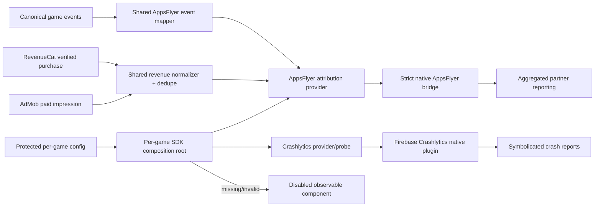

# Componentable AppsFlyer attribution and Crashlytics for the Find games

## Goal Capsule

Make Find The Bird the primary proving ground for a reusable, fail-closed mobile acquisition and crash-observability component set, then adopt the same components in Find the Dog without game-local forks. AppsFlyer becomes the single acquisition-attribution SDK for Meta, Google, and eventual Apple Ads; Firebase Crashlytics provides symbolicated crash diagnostics without enabling Firebase Analytics. Both games remain child-directed, non-tracking, and safe when credentials are absent.

Success means a physical iPhone build of Find The Bird proves the strict/no-IDFA AppsFlyer SDK initializes, emits the approved canonical test events, and produces a symbolicated deliberate Crashlytics test crash that is visible through an authoritative Firebase readback. Find the Dog must pass the same composition/native-shell contracts and at least a no-crash/device status smoke, with full device proof required before its next release.

## Problem Frame

The shared SDK already provides explicit `appsflyer | adjust | disabled` attribution selection, AppsFlyer configuration parsing, a provider abstraction, canonical analytics events, and fail-closed behavior. The Find games already share composition-root and generated-native-shell patterns. AdMob and RevenueCat are operational.

The remaining gap is not another abstraction. It is a privacy-correct native AppsFlyer implementation, value-event projection, Crashlytics-only Firebase composition, account provisioning, and real-device proof. The current Find shell manifests still contain Adjust and Firebase Analytics packages. When Firebase credentials are present, the existing plugin allowlist would activate Analytics; that violates this goal. AppsFlyer's official Capacitor SPM package currently links the standard SDK, while the children/mixed-audience declaration requires the Strict SDK. The implementation must therefore use the repository's existing custom Capacitor bridge and the official strict SPM binary rather than quietly shipping AdSupport.

## Product Contract

### Requirements

- **R1 — Primary target:** Implement and fully prove Find The Bird first. Find the Dog adopts the same shared components and configuration shape without copied provider logic.
- **R2 — Single acquisition SDK:** AppsFlyer is the only acquisition-attribution SDK enabled in production. Adjust remains a selectable dormant fallback in shared code but is not linked into a Find release when AppsFlyer is selected. Direct Meta App Events and Firebase Analytics remain disabled.
- **R3 — Strict privacy:** Use AppsFlyer's official Strict iOS SDK, which excludes IDFA collection and AdSupport. Keep `NSUserTrackingUsageDescription` absent and `NSPrivacyTracking=false`.
- **R4 — Explicit partner sharing:** AppsFlyer must start only after child-directed privacy controls are applied. Partner-sharing policy is a typed configuration, defaults to deny-all, and cannot silently become permissive. Aggregated Advanced Privacy remains enabled in AppsFlyer.
- **R5 — Componentability:** Native dependencies, plugin registration, config parsing, event projection, crash reporting, and verifier actions live in shared package/tool seams or parameterized per-game manifests. Future games adopt them through config and manifest declarations.
- **R6 — Fail closed:** Missing, malformed, wrong-bundle, or wrong-environment credentials produce an observable disabled provider and omit unsafe native plugins where possible. Web/CI builds never import native modules eagerly.
- **R7 — Canonical event map:** Project only approved canonical events into AppsFlyer: tutorial completion, meaningful progression milestones, verified purchase/revenue, ad impression revenue, and bounded retention/session milestones. No names, emails, free-form user content, raw exception objects, or persistent child identifiers.
- **R8 — Revenue correctness:** Revenue events include ISO currency, numeric revenue, product/placement/format identifiers, and a stable deduplication key. Verified purchases are forwarded once after RevenueCat verification; AdMob impression-level revenue is forwarded once per impression. Client and server forwarding must not double-count.
- **R9 — Crashlytics only:** Add Firebase Crashlytics without Firebase Analytics. Crash reports carry build/version and bounded diagnostic keys only; no advertising identifiers or user identity.
- **R10 — Protected credentials:** AppsFlyer key and Firebase owner configuration remain outside Git. Public app identifiers may be documented. Firebase plists are materialized through an ignored owner lane and validated against the exact bundle ID before native sync.
- **R11 — iOS attribution plumbing:** Configure SKAdNetwork and AdAttributionKit postback copies appropriate to AppsFlyer and preserve AdMob's existing SKAdNetwork entries. Apple Ads uses AdServices through AppsFlyer when that partner is activated later.
- **R12 — Partner activation gate:** Do not activate Meta, Google, Apple, RevenueCat, or AdMob partner forwarding until device events, privacy controls, event mapping, and deduplication are reviewed. Campaign spend is outside this work.
- **R13 — Physical proof:** Use the canonical device harness on the physical iPhone 12. Verify installed build identity, AppsFlyer status/event receipt, Crashlytics deliberate crash/relaunch/report receipt, dSYM upload, and symbolicated frames.
- **R14 — Regression safety:** Existing AdMob formats, RevenueCat purchase behavior, game analytics, lifecycle gates, web builds, and disabled-provider behavior remain intact.

### Actors

- **A1 — Player:** plays a Find game without being personally identified or tracked across apps.
- **A2 — Growth operator:** reads aggregated acquisition and value reports and maps approved events to ad networks.
- **A3 — Release operator:** materializes protected credentials, builds native shells, and verifies exact app identity.
- **A4 — Implementer:** adds future games through shared components rather than copying integrations.

### Key Flows

- **F1 — Configured launch:** protected config + exact bundle identity select AppsFlyer and Crashlytics; privacy controls apply before AppsFlyer start; both report observable initialized state.
- **F2 — Unconfigured launch:** either provider is absent without native boot failure, secret logging, or fallback to another tracking provider.
- **F3 — Conversion event:** canonical game event is projected through one allowlisted mapper; invalid/private params are rejected; approved event reaches AppsFlyer once.
- **F4 — Revenue event:** verified purchase or paid ad impression produces one normalized revenue event with a deduplication key.
- **F5 — Crash proof:** a dev/test-only action records a marker, crashes, relaunches, uploads, and produces a symbolicated issue visible through Firebase readback.
- **F6 — Future game adoption:** new game declares bundle/store IDs and manifest products, supplies ignored credentials, and receives the same behavior without a new provider implementation.

### Acceptance Examples

- **AE1:** Given a production iOS Find The Bird build with complete AppsFlyer config, selection reports `appsflyer`; the linked binary contains the Strict framework and no AdSupport dependency.
- **AE2:** Given the same build with the AppsFlyer key absent, selection reports disabled with a named reason and no AppsFlyer native call occurs.
- **AE3:** Given Firebase Crashlytics config but Firebase Analytics disabled, Crashlytics initializes and the generated native shell contains no Firebase Analytics Capacitor plugin/product.
- **AE4:** Given a malformed or wrong-bundle `GoogleService-Info.plist`, native sync fails before Xcode build with the expected and actual bundle IDs.
- **AE5:** Given an approved purchase completion emitted twice with the same transaction/deduplication ID, AppsFlyer receives one revenue event.
- **AE6:** Given an AdMob paid event with currency, value, format, placement, and impression ID, AppsFlyer receives one normalized ad-revenue event; a duplicate paid callback is ignored.
- **AE7:** Given a free-form parameter or prohibited identity field, the AppsFlyer mapper drops/rejects it and tests prove it cannot cross the native bridge.
- **AE8:** Given a physical-device deliberate crash in a test build, Firebase readback shows the matching marker and symbolicated app frames after relaunch.
- **AE9:** Given a web or CI build, neither Crashlytics nor AppsFlyer native modules load and existing tests remain green.

### Scope Boundaries

Out of scope: enabling campaign spend; publishing an App Store release; direct Meta App Events; Firebase Analytics; Firebase Authentication/Remote Config changes; Android implementation; Apple Ads campaign creation; unrestricted raw user-level forwarding; an age gate; changing the games' audience classification; replacing AdMob or RevenueCat.

Partner dashboard configuration may be prepared but remains disabled until the activation gate is passed. The plan may provision Firebase projects/apps because the user authorized credential setup, but it must not expose or commit credentials.

## Technical Decisions

- **KTD1 — Reuse the shared provider seam.** Extend `packages/sdk/src/attribution/` rather than adding game-local AppsFlyer services. FTB is the first consumer; FTD uses the same package and manifest shape.
- **KTD2 — Custom bridge + official Strict SPM binary.** Keep the existing registerPlugin/native-shell model. Add `AppsFlyerFramework-Strict` from AppsFlyer's official strict repository and a small Swift bridge. Do not adopt the current official Capacitor SPM package because its manifest hardcodes the standard static framework.
- **KTD3 — Privacy policy precedes start.** Extend the bridge contract so sharing filters are set before `start()`. Default is deny-all. Partner allowlisting is an explicit reviewed config; there is no `auto` mode.
- **KTD4 — Crash reporting is its own concern.** Split `firebaseCrashlyticsConfigPresent` from `firebaseAnalyticsConfigPresent`. Crashlytics credentials must never imply Analytics activation. Remove the Analytics plugin/product from Find release manifests unless a separate future product decision re-enables it.
- **KTD5 — Adopt proven Marble Run Crashlytics patterns upstream.** Reuse and generalize its lazy probe, include-plugin gate, symbol upload phase, and Firebase MCP readback. Do not create a second probe implementation per game.
- **KTD6 — One event projection authority.** Add an allowlisted AppsFlyer event mapper in `packages/sdk`; game analytics remains rich internally, while acquisition gets only bounded conversion/value events.
- **KTD7 — Revenue after verification.** Purchase revenue originates after RevenueCat-backed entitlement verification, not at button tap or payment-sheet display. Ad revenue originates from the native paid-impression callback. Deduplication lives at the shared adapter boundary.
- **KTD8 — No anonymous fallback to standard SDK.** If the strict package or privacy setup is unavailable, attribution is disabled and the release gate fails.
- **KTD9 — Firebase project ownership.** Reuse `hidden-object-base` for Find the Dog only after exact duplicate-app reconciliation. Create a dedicated Find The Bird Firebase project/app if no exact app exists. Do not place both games into an unrelated project merely because credentials are available.
- **KTD10 — Evidence before partner activation.** Device and backend readback evidence is part of implementation, not deferred release QA.

**Product Contract preservation:** created directly from the user's approved scope; no upstream brainstorm document.

## Credential and Account Readback

Current authenticated state, to be rechecked at execution time:

- AppsFlyer dashboard is authenticated as the Base Game Lab Growth role account. Both iOS apps exist: `id6796698146` and `id6772100729`.
- AppsFlyer developer key is stored owner-only at `~/.config/base-game-lab/appsflyer-dev-key`; never print or commit it.
- Firebase CLI and gcloud are authenticated as the existing Google administrator account, not yet the new Workspace identity.
- Visible Firebase projects include `hidden-object-base` with two iOS app records named Find the Dog and no visible Find The Bird project. Duplicate FTD records must be reconciled by exact bundle/config readback before choosing one.
- The active Firebase CLI credential is owner-only in the standard configstore. Do not copy it into the repo.
- If Workspace ownership is required, invite `batu@basegamelab.com` through Firebase/Google Cloud IAM and verify access before removing the legacy administrator. Do not create duplicate projects to avoid an access migration.

## High-Level Design

## Implementation Units

### U0. Establish isolated baseline and credential receipts

**Goal:** prove the exact code/account baseline before behavior changes.

**Files:** `.claude/SESSION_GOAL.md`; `docs/evidence/<dated-appsflyer-crashlytics>/credential-readback.md` (redacted); ignored owner credential paths only.

**Approach:** work only in `feat/ftb-appsflyer-crashlytics`. Record origin commit, package versions, exact AppsFlyer app records, Firebase projects/apps, and credential storage paths without values. Reconcile the two existing Find the Dog Firebase iOS records by downloading configs to owner-only temp files and checking bundle IDs/app IDs. Identify whether an exact FTB Firebase app/project already exists before mutation.

**Test scenarios:** no secret appears in `git diff`; downloaded Firebase config exact-bundle validation passes or records a blocker; missing credentials produce a named receipt rather than guessed values.

**Verification:** `git status`, secret-pattern scan, Firebase/AppsFlyer read-only account evidence.

### U1. Separate Crashlytics from Firebase Analytics

**Goal:** Crashlytics can be configured while Analytics remains absent.

**Files:** `games/find_the_bird/src/sdk/includePlugins.ts`, `games/find_the_dog/src/sdk/includePlugins.ts`, their tests, both `package.json` files, both `native-resources/ios/shell-manifest.json`, `tools/native-shell/src/native-shell.mjs`, `tools/native-shell/test/native-shell.test.mjs` only if manifest support is insufficient.

**Approach:** introduce explicit crash-reporting enablement and exact native-config presence checks. Add `@capacitor-firebase/crashlytics`; remove/omit `@capacitor-firebase/analytics` from Find production manifests and allowlists. Preserve lazy native loading and the no-config boot guard. Turn on the existing deterministic dSYM upload phase.

**Execution note:** write/strengthen tests first and observe the current incorrect behavior: complete Firebase config selects Analytics and cannot select Crashlytics independently.

**Test scenarios:** Crashlytics complete + Analytics disabled includes only Crashlytics; missing plist/env excludes both; explicit Analytics disabled wins even when legacy Firebase env is complete; generated Package.swift has Crashlytics product and upload phase exactly once; config removal unwires cleanly; web build imports neither plugin.

**Verification:** focused game tests, native-shell tests, typecheck, deterministic sync diff.

### U2. Provision and validate Firebase app identities

**Goal:** protected exact-bundle Firebase configs exist for both games.

**Files:** ignored owner files under each game's established native-resource materialization lane; `.env.example` documentation; provisioning scripts/tests only if the existing `provision-game-services` or native-shell lane lacks exact Firebase support.

**Approach:** reuse or extend existing provisioning infrastructure; do not hand-copy into tracked source. Reconcile FTD duplicates, select the canonical exact-bundle app, create FTB project/app only if absent, download each plist to owner-only storage, and materialize at sync time. Validate `BUNDLE_ID`, `GOOGLE_APP_ID`, `PROJECT_ID`, and file mode before use.

**Test scenarios:** exact app passes; wrong bundle/project fails before build; missing file is allowed for web/dev but blocks Crashlytics-required release; credential values never enter logs or receipts.

**Verification:** Firebase CLI readback, protected file permissions, native-shell require-Firebase validation.

### U3. Add strict AppsFlyer native component and privacy contract

**Goal:** FTB and FTD can link and initialize AppsFlyer's Strict SDK through the same bridge.

**Files:** shared attribution plugin contracts/tests; `games/find_the_bird/native-resources/ios/AppsFlyerAttributionPlugin.swift`; matching FTD source only if manifests require per-game source placement; bridge controller registration; both shell manifests; native-shell tests; attribution README/env examples.

**Approach:** add the official strict SPM repository/product and a resolve-not-reject Capacitor bridge. Apply deny-all/allowlisted partner sharing before SDK start, start without ATT wait or IDFA behavior, expose bounded status, and preserve provider timeouts. Parameterize generation/reuse so Swift logic does not drift between games.

**Execution note:** proof-first tests must reject standard AppsFlyer framework URLs/products and any manifest that combines AppsFlyer with tracking privacy declarations.

**Test scenarios:** strict package accepted; standard package rejected; sharing filter applied before start; initialization failure returns disabled/error status; duplicate init is idempotent; missing key never touches native bridge; no dev key appears in logs; generated binary dependency graph has no AdSupport/standard AppsFlyer product.

**Verification:** package tests, native-shell tests, typecheck, Xcode dependency/binary inspection.

### U4. Build the approved acquisition event and revenue projection

**Goal:** one shared mapper supplies precise, bounded events to AppsFlyer.

**Files:** new shared mapper/normalizer/dedupe modules and tests under `packages/sdk/src/attribution/`; relevant analytics contracts/tests; minimal FTB composition wiring and tests; AdMob provider paid-event seam/tests; RevenueCat verified-purchase observer seam/tests.

**Approach:** define a versioned event catalog and typed parameter schemas. Start with tutorial completion, selected progression milestones, verified purchase, ad revenue, and bounded retention. Normalize AppsFlyer standard names/parameters where appropriate. Add bounded in-memory plus durable dedupe only where callbacks can repeat across restarts; reuse existing purchase ledger identity rather than inventing another purchase authority.

**Test scenarios:** every approved event maps exactly; all non-approved events are ignored; invalid currency/revenue rejected; zero/negative/NaN handling explicit; duplicate transaction/impression ignored; same ID for different event class cannot collide; mapper strips unknown/private fields; provider failure cannot break gameplay/purchase/ad flow.

**Verification:** focused unit/integration tests through real analytics → mapper → fake AppsFlyer plugin chain.

### U5. Compose FTB as the reference implementation

**Goal:** Find The Bird selects strict AppsFlyer + Crashlytics from explicit config while preserving all neighboring providers.

**Files:** FTB `SdkContext.ts`, `includePlugins.ts`, bootstrap/lifecycle points, SDK-context tests, `.env.example`, native manifest/resources, dev/test verifier mount.

**Approach:** keep construction synchronous and native imports lazy. Add observable selection/status. Generalize the proven Marble Run Crashlytics probe into a shared testkit component, with read state, send unsent reports, non-fatal marker, and explicit forced-crash action behind test-only gates. No production autocrash path.

**Test scenarios:** complete config selects AppsFlyer/Crashlytics; each partial config fails closed independently; Adjust and Firebase Analytics remain unselected; direct Meta remains disabled; dev forced crash unavailable in production; AdMob, RevenueCat, remote config, and existing analytics selection unchanged.

**Verification:** FTB unit/typecheck/build/native sync and regression suite.

### U6. Adopt the same components in Find the Dog

**Goal:** FTD uses the exact shared implementation with only identity/config differences.

**Files:** FTD composition, includePlugins, manifest/env/tests; no duplicate shared implementation files.

**Approach:** diff FTD against the now-working FTB reference. Permit only bundle/store/project identity and game-event-source differences. Add parity tests asserting both manifests select the same strict AppsFlyer and Crashlytics products and privacy posture.

**Test scenarios:** all FTB config matrix cases repeat for FTD; wrong FTB Firebase plist is rejected for FTD; event mapper behavior is shared, not copied; FTD purchase/ad regressions remain green.

**Verification:** FTD tests/typecheck/build/native sync plus structural parity test.

### U7. Configure privacy-preserving iOS/dashboard attribution

**Goal:** dashboards are ready but partner delivery remains gated.

**Files:** redacted configuration receipt/evidence; public env docs only.

**Approach:** verify AppsFlyer AAP enabled for both apps; configure SKAN and AdAttributionKit postback-copy endpoints/keys; inspect partner integration availability. Prepare Meta App ID, Google Ads link-ID slots, and Apple Ads integration requirements without enabling forwarding. Define the reviewed event map in the receipt.

**Test scenarios:** both app records have matching store IDs; AAP remains on; direct Meta provider disabled; no partner marked active before U8 evidence; SKAN/AAK keys coexist with AdMob catalog without duplicate/malformed entries.

**Verification:** authoritative dashboard/API readback where available, otherwise inspected screenshots with sensitive values redacted.

### U8. Physical-device and backend proof

**Goal:** prove user-visible/runtime behavior and backend receipt on the real device.

**Files:** `docs/evidence/<dated-ftb-appsflyer-crashlytics>/` plus FTD smoke evidence.

**Approach:** use the canonical device harness and AppsFlyer test-device/test-console path. Build/install FTB with exact production bundle identity but test/debug flags, verify selection pane, emit approved test events, inspect AppsFlyer receipt, force one explicitly labeled Crashlytics test crash, relaunch, upload, read issue via Firebase MCP/API, and verify symbolication. Regression-sweep AdMob banner/interstitial/rewarded with Google sample ads and purchase-provider selection without clicking production ads. Repeat no-crash/status smoke for FTD.

**Test scenarios:** installed executable/hash matches built artifact; AppsFlyer receives event names/params once; forbidden params absent; Crashlytics marker and frames visible; dSYMs accepted; direct Meta/Firebase Analytics events absent; missing-config build boots disabled; neighboring AdMob/RevenueCat behavior remains intact.

**Verification:** hashed captures/logs, AppsFlyer dashboard receipt, Firebase issue/event readback, device build identity, focused regression evidence.

### U9. Partner activation and release gate

**Goal:** make readiness explicit without spending or releasing.

**Files:** final evidence/readiness report; config defaults/docs/tests as needed.

**Approach:** after human review of U8 evidence, activate only approved aggregated partner mappings. RevenueCat/AdMob forwarding must choose one authoritative revenue source each. Google link IDs and Meta mapping are recorded; Apple Ads remains disabled until chosen. Keep every campaign paused. Prepare but do not submit/release new builds.

**Test scenarios:** duplicate revenue source cannot be enabled by config; partner allowlist exactly matches reviewed list; zero active campaign delivery; release validation reports AppsFlyer + Crashlytics selected and Analytics/Meta direct disabled.

**Verification:** dashboard readback, zero-spend campaign status, release-env validation, no App Store submission.

## Verification Contract

- Shared packages: targeted Vitest suites, package typecheck, and full package audit.
- Both games: config matrix, SdkContext, includePlugins, attribution, analytics, purchase, ad lifecycle, and native-shell tests.
- Native shell: deterministic apply twice with zero second diff; exact package/product/plugin registration; privacy-manifest validation; strict SDK dependency assertion; Crashlytics upload phase.
- Security: secret-pattern scan and `git diff --check`; no owner credentials tracked.
- Artifact: physical iPhone evidence for AppsFlyer and Crashlytics, including backend receipt and symbolication.
- Regression: all three AdMob sample formats, RevenueCat provider selection, web boot, and disabled-provider boot.

## Risks and Mitigations

- **Strict SDK compatibility:** official Capacitor SPM path is not strict. Mitigation: custom bridge + official strict repository, binary/dependency assertion, fail release otherwise.
- **Kids-app partner tension:** deny-all sharing blocks network optimization. Mitigation: start deny-all; activate only legally reviewed aggregated partner paths after evidence. Do not trade compliance for apparent precision.
- **Firebase duplicate FTD apps:** selecting the wrong app silently routes crashes. Mitigation: exact config/bundle readback and canonical receipt before use.
- **Analytics accidental activation:** current Firebase completeness gate enables Analytics. Mitigation: split concern gates and assert Analytics absence in generated shell and runtime logs.
- **Double revenue:** RevenueCat, client purchase events, and network integrations can overlap. Mitigation: one authority per revenue class plus dedupe contract and dashboard receipt.
- **Disk/build pressure:** native dependencies are large. Mitigation: isolated worktree, shared package store, bounded DerivedData, report actual free space before archives.
- **Crash proof is destructive to the test run:** forced crash kills the app. Mitigation: explicit dev-only action, labeled marker, one controlled run, relaunch proof; never store/TestFlight auto-trigger.

## Definition of Done

- FTB and FTD select reusable AppsFlyer/Crashlytics components from explicit config with no game-local provider fork.
- Find native shells link AppsFlyer Strict and Crashlytics while omitting Adjust, standard AppsFlyer, Firebase Analytics, ATT copy, and direct Meta events in the chosen release configuration.
- Protected Firebase configs match exact bundle IDs and are never committed.
- Approved conversion and revenue events are typed, privacy-bounded, and deduplicated.
- All focused and adjacent tests, typechecks, audits, deterministic native syncs, and secret scans pass.
- FTB physical-device evidence proves AppsFlyer event receipt and a symbolicated Crashlytics issue; FTD passes parity plus device status/no-crash smoke.
- AdMob and RevenueCat neighboring behaviors remain verified.
- Partner forwarding, campaign delivery, App Store submission, and release remain off unless separately authorized.

## Sources

- Existing AppsFlyer provider: `packages/sdk/src/attribution/`.
- Existing composition roots: `games/find_the_bird/src/sdk/`, `games/find_the_dog/src/sdk/`.
- Existing native generation: `tools/native-shell/` and both Find shell manifests.
- Proven Crashlytics pattern/evidence: `games/marble_run/src/devtools/crashlyticsProbe.ts`, `games/marble_run/native-resources/ios/shell-manifest.json`, `games/marble_run/docs/evidence/2026-08-10-crashlytics-rehearsal/evidence.md`.
- Official AppsFlyer Strict SDK guidance: https://dev.appsflyer.com/hc/docs/install-ios-sdk
- Official strict SPM repository: https://github.com/AppsFlyerSDK/AppsFlyerFramework-Strict
- Official AppsFlyer iOS privacy controls: https://dev.appsflyer.com/hc/docs/preserve-user-privacy-ios
- Official Firebase Crashlytics Apple setup: https://firebase.google.com/docs/crashlytics/ios/get-started
