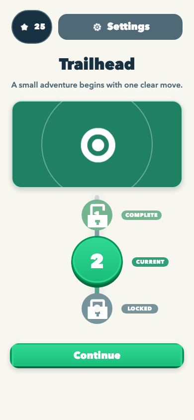
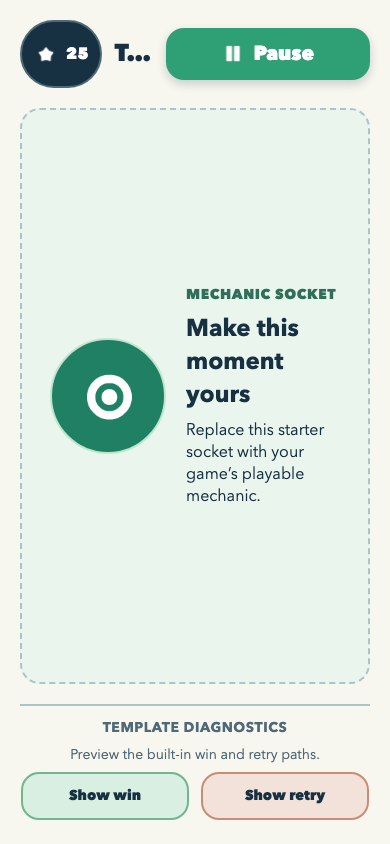
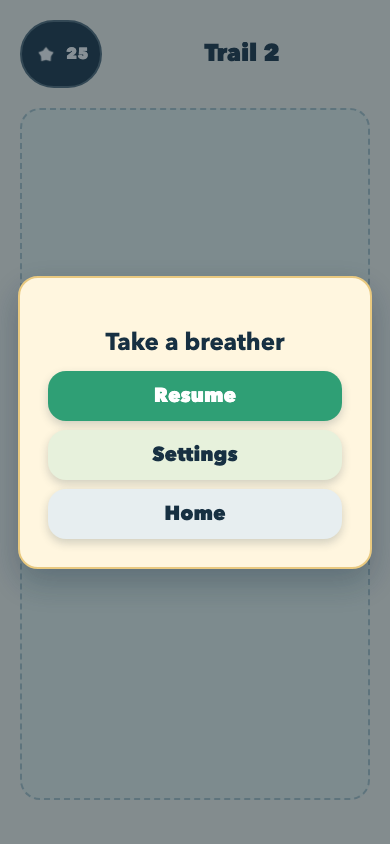
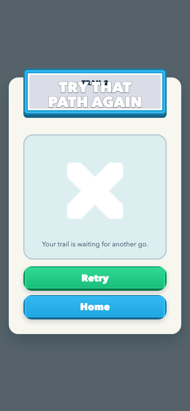
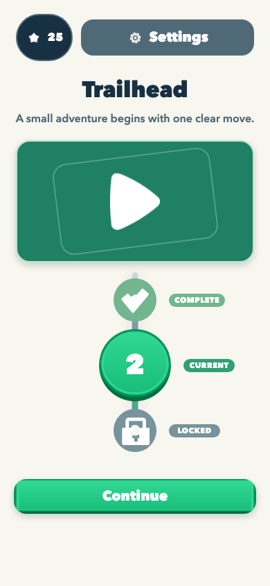
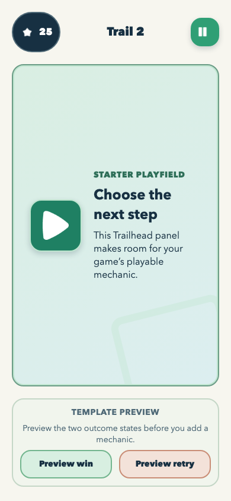
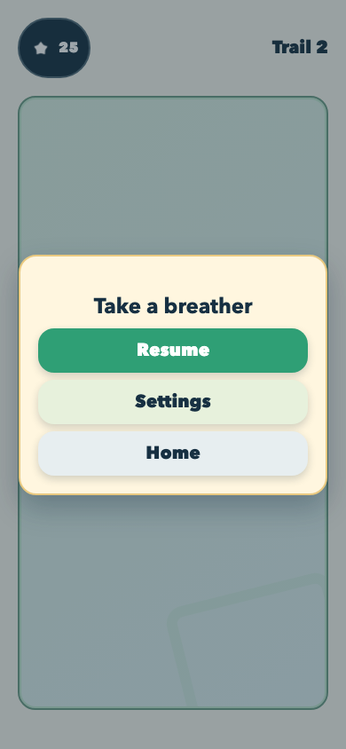
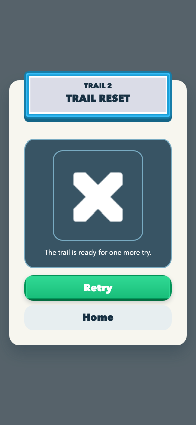

# Worked-stage aesthetics remediation journal

This journal records a 390 x 844 browser diagnostic for the editor-neutral
template shell. It is evidence for the next independent aesthetics review only;
it is not Android or iPhone device proof.

## Task T1 - Make the starter shell read as a game, not a scaffold

### Task Snapshot

Status: passed

The previous independent review found that the template met its behavioral
contract but looked like a prototype: internal scaffold copy, weak visible use
of its curated Kenney fixtures, ambiguous progression states, a flat outcome
demo, and a default-grey pause dialog. This bounded pass keeps the shared UI,
the six-state controller, and the required two demo outcomes while giving the
starter shell a coherent adventure-sample hierarchy.

### Task Acceptance Criteria

- No internal scaffold/developer phrasing is visible in the starter flow.
- Hero and completed/current/locked nodes are immediately distinguishable.
- The required two outcome controls read as a purposeful sample interaction.
- Pause is a readable cream/pastel game surface with all three actions visible.
- All existing state transitions and 48 px control guarantees remain intact.

### Iteration 1 - Baseline capture and bounded polish

#### Planned Result

The rendered flow should move from a technical placeholder toward a compact,
Kenney-backed starter game without changing any state-machine behavior.

#### Why This Iteration

The independent review identified P1 visual blockers that are all local to the
template shell's presentation, copy, and hierarchy.

#### Capture Setup

- Route: `/`
- Viewport: 390 x 844 CSS pixels
- Fixture: default synthetic save
- State: real rendered interactions; screenshots are captured only after the
  relevant UI is settled.

#### Pre-Change Screenshots

Captures are added after the reproducible diagnostic run. The baseline evaluation
is the independent review's P1 finding: the pause card reads grey/default,
scaffold copy is visible, hero/fixtures are underused, and the two demo outcomes
read like exposed debug controls.

#### Changes Made

Pending the baseline capture.

#### Post-Change Screenshots

Pending the remediation and matching capture set.

#### Decision

partial

#### Next Action

Capture the current rendered states, then implement only the listed presentation and copy corrections.

#### Spawned Tasks

- None; device safe-area and touch proof remain a later in-situ concern.

### Iteration 2 - Seed hierarchy and starter-flow correction

#### Planned Result

The same six-state shell should use its committed Kenney seed as a visible
adventure language: a centered trail marker, legible path-status labels, a
compact outcome sample, and a warm pause surface.

#### Why This Iteration

The baseline was already captured after the previous viewport remediation and
the only subsequent source change was design-authority documentation. It is the
accurate before-state for this presentation-only pass.

#### Capture Setup

- Route: `/`
- Viewport: 390 x 844 CSS pixels
- Fixture: default synthetic save
- State: the baseline is the settled conductor diagnostic; matching after-state
  capture is prepared with the local script described below.

#### Pre-Change Screenshots

1. 
   What to look at: the nearly invisible white target, unlabeled progression
   states, and generic title.
   Observation: the route has functional controls but no readable starter-game
   identity or visible distinction beyond size and grey tone.
   Acceptance check: starter copy fail; Kenney visibility fail; node-state
   clarity partial; action hierarchy partial.

2. 
   What to look at: the developer-facing gameplay text and oversized Test Win /
   Test Lose buttons.
   Observation: the controls work but read as exposed QA tools rather than an
   intentional sample interaction.
   Acceptance check: starter copy fail; demo hierarchy fail; controls remain
   visibly tappable.

3. 
   What to look at: the neutral white card and grey action stack.
   Observation: all actions are readable but the overlay looks detached from the
   cream/teal shell.
   Acceptance check: grounded pause treatment fail; action visibility pass.

4. 
   What to look at: the settled Retry and Home paths.
   Observation: the readable result-card repair remains intact and is retained
   while the title ribbon is made variant-aware.
   Acceptance check: result action visibility pass.

#### Changes Made

The bootstrap copy now presents `Trailhead` as a generic adventure sample,
without source-editing or debug phrasing. The shell places the existing white
Kenney target on seed-colored hero and gameplay fields, gives the three route
states visible text badges plus accessible names, and places the required two
outcomes beneath a `Sample outcome` heading with a compact primary/secondary
pair. A template-local token bridge makes each reused shared-UI root consume the
committed seed instead of its neutral package defaults; Pause now uses a warm
cream card with teal, pastel, and quiet actions. Win and Fail use their matching
green and blue seed ribbons. No controller, flow, SDK, package UI, or game
mechanic changed.

#### Post-Change Screenshots

The managed worker sandbox cannot launch Chromium: macOS denies
`MachPortRendezvousServer` during Playwright startup. An unrestricted conductor
should serve `games/_template` at `http://127.0.0.1:5199`, use the same 390 x
844 viewport and fresh localStorage fixture, and write settled
`after-{menu,level,pause,settings,win,fail}.png` plus control metrics to this
folder. Use real rendered clicks: menu; Play; Pause; menu Settings; Play then
Complete round; and Play then Preview retry. Browser capture is still diagnostic
only, never physical-device proof.

#### Decision

partial

#### Next Action

An unrestricted conductor must run the prepared matching capture, then the fresh
Aesthetics Reviewed worker must independently judge the resulting frames before
any device-stage claim.

#### Spawned Tasks

- No code follow-up: Android/iPhone safe-area, touch feel, and performance stay
  explicitly unverified until the later in-situ stage.

### Iteration 3 - Close the contract-to-DOM seam and prove the real flow

#### Planned Result

Every visible contract instance should have one accessible DOM owner, and the
same 390 x 844 build should remain usable through the complete shell flow.

#### Why This Iteration

The matching capture exposed a seam that the root audit did not: decorative
children duplicated semantic identities, several required action identities
were absent, and the native settings inputs had a zero-sized box even though
their painted switches were 64 x 48 px.

#### Changes Made

Semantic identities now live only on their interactive or accessible owner.
Decorative artwork is hidden from assistive technology and carries no duplicate
identity. Required menu, gameplay, settings, pause, win, and fail actions are
registered exactly once; dialogs own their panel identities. Progression now
renders one representative completed, current, and next-locked node at every
supported save edge. The native settings inputs cover the visible switch, so
automation, accessibility, and physical touch share the same 64 x 48 target.

#### Post-Change Screenshots

1. 
   Observation: the Trailhead hero, three labelled progression states, and
   Continue action form one readable starter-game hierarchy.
2. 
   Observation: the gameplay placeholder is explicit but game-like, and both
   required outcomes remain visible as a compact sample interaction.
3. 
   Observation: the pause surface uses the same cream, teal, and pastel system
   while retaining Resume, Settings, and Home.
4. 
   Observation: Back and all three switches are settled, readable, and at least
   48 px high.
5. 
   Observation: the success card has a variant ribbon and clear Next/Home paths.
6. 
   Observation: the retry card remains settled with clear Retry/Home paths.

The matching measurements are in `after-metrics.json`. The real-click tour in
`after-flow-metrics.json` proves Menu -> Level -> Pause -> Settings -> Back ->
Resume -> Win -> Home -> Level -> Fail, including a persisted Music toggle. All
six settled states report a 390 x 844 document with zero body margin; visible
actions are at least 48 px high.

#### Verification

- Typecheck, lint, build, 6 test files / 40 tests, and `git diff --check`: pass.
- Approved-source audit: all 29 committed Kenney fixtures match source bytes.
- Repository audit: pass with pre-existing warnings outside this change.
- Repository-wide `knip`: still reports the existing cross-repository unused
  files, exports, and dependencies; no finding points to this change.
- Browser evidence is diagnostic only. No Android or iPhone device claim is
  made for this U2 card.

#### Decision

passed

#### Next Action

Run the mandatory fresh independent aesthetics review against settled frames.

#### Spawned Tasks

- Sol performed a read-only contract-to-DOM census and identified the level 1
  and level 3 progression edge cases; deterministic tests now cover both.

### Iteration 4 - Keep the starter shell quiet, contextual, and replaceable

#### Planned Result

The editor-neutral template should retain its compact Trailhead starter language
without mistaking utilities, diagnostics, or the mechanic socket for
production-primary game UI. Pause should retain enough of the active level to
keep a player oriented, while the single controller remains the only behavior
owner.

#### Why This Iteration

The independent aesthetics follow-up identified six bounded seams: Settings
competed with Continue, the white currency star lacked a reliable backing,
Pause replaced rather than contextualized the level, the HUD identity could
wrap, the mechanic-neutral region resembled a result card, and the required
Win/Lose controls still read as production actions instead of template-only
diagnostics.

#### Changes Made

- Menu Settings now uses a muted utility surface with no button shadow; the
  primary Continue path remains the visual action hierarchy.
- The white Kenney star now sits on a dark, bordered currency surface in both
  menu and HUD contexts.
- Pause renders a visually retained, `aria-hidden` and `inert` level backdrop
  beneath a lighter pause scrim. That backdrop carries neither semantic
  instances nor action hooks, so only the foreground Pause controls can drive
  the shared controller.
- The HUD level label now uses a compact single-line ellipsis treatment.
- The gameplay area is now an explicitly labelled, dashed mechanic socket with
  a left-aligned content area rather than a centered result-card composition.
- Win and Lose remain functional but are relabelled as compact `Template
  diagnostics` with distinct, subdued win/retry treatments.

#### Deterministic Verification

- Proof-first command: `npm run test:unit -w @fabrikav2/game-template --
  tests/unit/template-shell.test.ts` initially failed in the four new
  utility/currency, paused-backdrop, diagnostic-socket, and compact-HUD
  assertions.
- After the bounded change, that same focused suite passes all 15 tests.
- `npm run typecheck -w @fabrikav2/game-template`, `npm run lint -w
  @fabrikav2/game-template`, and `npm run build -w
  @fabrikav2/game-template` pass.
- The full template unit suite passes 6 files / 43 tests, and
  `KENNEY_APPROVED_SOURCE_ROOT=/Users/base/dev/appletolye/assets npm run
  audit:kenney -w @fabrikav2/game-template` verifies all 29 fixtures.
- Root `npm run audit` passes with its existing repository/reference coverage
  warnings; no new template warning was introduced.

#### Post-Change Capture Contract

No new browser or physical-device capture is claimed by this iteration. A
worker attempt against the current worktree's Vite server reached Playwright
startup but macOS denied Chromium's `MachPortRendezvousServer` registration
before any frame rendered. Before the independent aesthetics decision, run the
existing real-click diagnostic from `games/_template` with an unrestricted
browser:

```sh
npm run dev -- --host 127.0.0.1 --port 5199
node .work/2026-07-11-aesthetics-remediation/capture.mjs u2-seam-remediation
```

Review the resulting menu, level, pause, settings, win, and fail frames at
390 x 844. In particular, verify the muted Settings control, star contrast,
visible noninteractive paused level, unwrapped HUD, socket treatment, and
subordinate diagnostic actions. This is browser diagnostic evidence only, not
Android or iPhone proof.

#### Decision

partial

#### Next Action

The Aesthetics Reviewed worker must obtain fresh settled frames with the recipe
above and perform the mandatory independent visual review. Android/iPhone safe
areas, touch feel, fonts, and performance remain explicitly unverified.

#### Conductor Capture and Independent Review

The unrestricted conductor reran both diagnostic paths after commit `5814596a`.
`u2-seam-remediation-metrics.json` records all six settled surfaces at 390 x
844. `after-flow-metrics.json` records the real-click Menu -> Level -> Pause ->
Settings -> Back -> Resume -> Win -> Home -> Level -> Fail path, including a
Music switch change. Every visible action is at least 48 px high and no surface
scrolls.

A new 7.48-second Playwright reel supplied four distinct ffmpeg-sampled settled
frames to blind Sol review session `019f4e71-6a97-7893-9656-777330a35fcf`.
That review returned `fix-then-ship` with P1 findings: the HUD level identity is
visibly truncated; the dashed mechanic region reads as prototype grey-box UI;
the reused bullseye and completed-node lock language look provisional; and the
fail ribbon/glyph lack readable contrast and visual continuity. Its P2 cluster
also calls for a clearer dev-only diagnostics strip, tighter Pause hierarchy,
and Retry as the sole primary fail action.

#### Decision

failed aesthetics gate; returned to Worked

#### Next Action

Resolve the bounded hierarchy, identity, placeholder, and fail-state seams;
repeat the deterministic browser proof and a fresh blind aesthetics review.

## Task T2 - Restore Trailhead hierarchy after blind review

### Task Snapshot

Status: active

The functional shell remains behavior-green, but blind review caught a set of
visible hierarchy regressions in its settled browser frames. This bounded pass
keeps the shared UI, controller, six-state flow, and required outcome controls
while repairing the exact HUD, socket, landmark, pause, and failure-state seams
that made the starter feel provisional.

### Task Acceptance Criteria

- The active HUD shows the complete `Trail 2` identity without ellipsis or wrapping.
- The bullseye placeholder is absent from the hero and mechanic socket; the socket remains visibly replaceable without reading as a grey-box prototype.
- Completed, Current, and Locked route nodes use visibly distinct, semantically correct landmark language.
- The failure ribbon title and glyph have decisive contrast, and Retry is visually the sole primary action.
- Template-only outcome previews remain functional and subordinate; Pause retains the level under a tighter, lighter scrim.

### Iteration 1 - Blind-review remediation baseline

#### Planned Result

The same Trailhead flow should become legible at a glance: a full level name,
a purposefully framed mechanic region, progress landmarks that communicate
status without lock ambiguity, and a failure card that directs the player to
Retry.

#### Why This Iteration

The independent Sol review of the latest settled U2 reel returned
`fix-then-ship`. Its P1 findings are directly visible in the matched browser
frames, while its P2 findings are all local hierarchy adjustments that can be
verified with the same real-click capture recipe.

#### Capture Setup

- Route: `/`
- Viewport: 390 x 844 CSS pixels
- Fixture: default synthetic save (Trail 2 current, Trail 1 complete, Trail 3 locked)
- State: settled menu, level, pause, settings, win, and fail frames created by real rendered clicks.

#### Pre-Change Screenshots

1. 
   What to look at: The central bullseye and the nearly identical open/closed-lock language on the route.
   Observation: The target does not convey Trailhead, and the completed landmark still reads as a lock instead of a success mark.
   Acceptance check: Placeholder removal fail; progression-icon distinction fail; current-node distinction pass.

2. 
   What to look at: The clipped `T…` header and large dashed socket.
   Observation: The label loses the player’s location and the panel reads as an unfinished web placeholder rather than a starter-game playfield.
   Acceptance check: Full HUD identity fail; solid game-like socket fail; preview controls remain functional but too prominent.

3. 
   What to look at: The card height and the opacity of the retained level beneath it.
   Observation: The scene remains technically present, but the modal hierarchy is looser and darker than it needs to be.
   Acceptance check: Preserved-level behavior pass; compact hierarchy partial; lighter contextual scrim partial.

4. 
   What to look at: The outlined title on the pale ribbon, white cross on a pale field, and similarly weighty Retry/Home buttons.
   Observation: The card has all required actions but the failure signifier and hierarchy are visually inconsistent.
   Acceptance check: Ribbon contrast fail; glyph contrast fail; Retry-only primary partial.

#### Changes Made

Pending proof-first tests and the scoped template-local visual corrections.

#### Post-Change Screenshots

Pending the matching `u3-hierarchy-remediation-*` capture set.

#### Decision

partial

#### Next Action

Strengthen the focused renderer regression test, observe its intended failure,
then make only the T2 presentation and copy corrections.

#### Spawned Tasks

- None. Fresh independent aesthetics judgment remains the next-stage gate; browser evidence must not be relabelled as device proof.

### Iteration 2 - Scoped hierarchy correction and conductor capture

#### Planned Result

Resolve each Sol P1/P2 seam without changing the template's controller or
six-surface behavior: restore the complete HUD name, give the mechanic socket
a purposeful trail treatment, clarify route landmarks, strengthen the fail
surface, and keep template previews quiet.

#### Why This Iteration

The red focused renderer assertions showed the pre-change DOM and CSS lacked
the requested identity, landmark, socket, preview, and fail-state hooks. The
correction stays inside the existing shell and its seed-token seams.

#### Changes Made

- Made the 48 px HUD Pause lane icon-only so the centered `Trail 2` label is
  fully visible, while retaining the accessible Pause name.
- Replaced the bullseye-derived hero and playfield art with the registered
  `icon.play` Kenney seed, a solid framed Trailhead playfield, and a quiet
  `Template preview` strip.
- Changed completed progress art to `icon.confirm`, retained the closed
  `node.locked` art, and kept the current node distinct.
- Tightened the shared Pause overlay through its supported action-gap token
  and a lighter scrim, preserving the inert level underneath.
- Rebuilt the fail treatment around a dark high-contrast field and ribbon,
  with Retry as the primary action and Home neutral; outcome preview actions
  remain functional but subordinate.

#### Post-Change Screenshots

Conductor-supplied, settled 390 x 844 real-click browser capture set:

1. 
   Observation: the play emblem has replaced the bullseye; completed uses a
   checkmark, current is green and numbered, and locked remains a closed lock.
2. 
   Observation: `Trail 2` is fully visible, the playfield is solid and
   purposeful, and the preview strip is visually quieter than the mechanic
   area.
3. 
   Observation: the retained level remains visible beneath a lighter scrim and
   the cream card has a compact Resume-first hierarchy.
4. 
   Observation: the `TRAIL RESET` ribbon and failure glyph are high contrast;
   Retry is primary and Home is secondary.

The companion [metrics](./u2-conductor-fixed-metrics.json) records an
844 px document/body, zero body margin, and every action at least 48 px across
menu, level, pause, settings, win, and fail. This is browser diagnostic
evidence only, not Android or iPhone proof.

#### Deterministic Proof

The focused renderer suite first failed on five intended hierarchy assertions,
then passed all 17 after the scoped corrections. The final template typecheck,
unit suite, lint, build, and approved-source Kenney audit are recorded with
the card handoff.

#### Decision

passed for the Worked remediation; a fresh independent Aesthetics Reviewed
worker still owns the visual-gate decision.

#### Next Action

Use this settled browser-only capture set for the independent frame review.
Do not claim mobile-device evidence: Android/iPhone safe areas, touch, fonts,
and performance remain unverified.

### Iteration 3 - Remove scaffold language and unify the retry surface

#### Why This Iteration

A fresh blind Sol review (`019f4e97-c387-7541-8b93-0cdea9cd7526`) still found
player-facing component labels, scaffold copy, Pause HUD reflow, and an
arcade-styled failure surface. The card returned to Worked for one more bounded
presentation pass; controller behavior and semantic action ownership stayed
unchanged.

#### Changes Made

- Removed visible `Complete`, `Current`, and `Locked` badges while retaining
  the same accessible node names and state hooks.
- Replaced mechanic-authoring copy with a neutral Trail clearing and renamed
  the required test-only controls to unambiguous Win/Lose previews.
- Preserved the Pause HUD's right-hand geometry with an inert spacer, compacted
  menu Settings to its icon, and kept Home visibly secondary but actionable.
- Replaced the failure cross with the registered retry glyph and replaced the
  beveled ribbon sprite with a local cream/pastel `Try again` title surface.
- Removed button-like elevation from non-interactive hero/playfield art.

#### Post-Change Screenshots

The conductor captured the final six states from real rendered clicks at
390 x 844: `u2-sol2-final-{menu,level,pause,settings,win,fail}.png`. The
companion `u2-sol2-final-metrics.json` records an 844 px document/body, zero
body margin, and a minimum visible action height of 48 px in every state.

#### Deterministic Proof

The focused renderer suite was red on six intended seams and then passed all
18 tests. Full typecheck, unit, lint, build, approved-source audit, and the next
blind frame review remain the Worked-stage closeout sequence.

#### Decision

passed for Worked; pending a fresh independent Aesthetics Reviewed verdict.
The captures are browser diagnostic evidence only, not Android or iPhone proof.

### Iteration 4 - Close the final player-facing seams

#### Why This Iteration

Fresh blind Sol review `019f4ea9-cbd4-74b3-82c8-4b9f93603741` rejected four
remaining P1 seams: the hero still looked like another Play action, the
gameplay region remained a prototype-grey box with a false-button glyph, and
the Fail surface removed the gameplay context. Its P2 cluster also identified
the straight setup-stepper route, ambiguous currency, oversized diagnostics,
Pause reflow, disabled-looking Home, and inconsistent overlay actions.

#### Changes Made

- Replaced the Play-shaped hero with one non-actionable composite trail scene;
  the full scene owns `menu.hero`, while its Kenney divider remains decorative.
- Staggered the route landmarks and split the connecting rail into two angled
  sections so progression reads as a path rather than a setup wizard.
- Made currency visibly and accessibly read `25 Coins` instead of relying on a
  star alone.
- Replaced the grey gameplay socket and raised Play glyph with a purposeful
  trail landscape, a quiet player-facing instruction card, and no action hook.
- Compacted the required Win/Lose diagnostics into a quarantined template
  footer while preserving 48 px controls.
- Reused the exact HUD, playfield, and diagnostic geometry beneath Pause, Win,
  and Fail. The inert copies expose no action, role, or semantic-instance hooks.
- Unified overlay actions: Resume/Next/Retry are primary, Settings is a
  pale-green secondary, and every Home action is an enabled cream tertiary.
- Removed result-button sprites and the duplicate retry glyph; `Trail blocked`
  plus a restrained warm accent identifies failure while Retry owns the action.

#### Post-Change Screenshots

The final settled 390 x 844 real-click browser set is
`u2-final-seam-pass-{menu,level,pause,settings,win,fail}.png`. Its companion
`u2-final-seam-pass-metrics.json` records a document and body height of 844 px,
zero body margin, and every live action at least 48 px. Level, Pause, and result
captures visibly retain the same HUD, landscape, and diagnostic footer.

#### Decision

passed for Worked; a new unseen reel and fresh independent Sol verdict still
own the Aesthetics Reviewed gate. This remains browser diagnostic evidence
only and makes no Android or iPhone claim.

### Iteration 5 - Remove content impostors and collapse the overlay grammar

#### Why This Iteration

Blind Sol review `019f4ec2-ccb7-7ce2-81e4-90f82dca7f1a` correctly caught that
the previous trail scene stretched a 128 x 8 modal divider into hero and
gameplay content. It also rejected the system font stack, boxed diagnostic
toolbar, and nested Fail composition.

#### Changes Made

- Removed the divider from rendered hero and gameplay content. Both surfaces
  now use their composite CSS trail illustration without pretending a panel
  fixture is a focal asset; the semantic hero slot still owns the whole scene.
- Added the approved CC0 Kenney Future/Future Narrow font bytes as a deliberate
  body/display pair, with committed source paths, hashes, license pointer, unit
  checks, and approved-source audit coverage.
- Reduced the current route node from 104 px to 88 px and added a quiet halo so
  emphasis no longer depends on oversized area.
- Moved the objective to a compact corner treatment and changed the exposed
  diagnostics to unboxed `Demo outcomes` pills. Inert backdrops retain their
  geometry but suppress that rail to 14% opacity.
- Flattened Continue and every overlay action into one grammar: solid primary
  and pale-green secondary. Pause is laterally inset and Settings/Home no
  longer resemble different enabled states.
- Collapsed Fail to one warm frame: inline title, one concise failure mark,
  plain actionable hint copy, Retry primary, and Home secondary. The nested
  alert body and overlapping plaque are gone.
- Adjusted the Win ribbon typography for the new font metrics so the eyebrow
  and title no longer collide.

#### Post-Change Screenshots

`u2-simplified-seam-pass-{menu,level,pause,settings,win,fail}.png` is the fresh
390 x 844 real-click browser set. The matching metrics JSON reports zero body
margin, an 844 px document/body, and every live action at least 48 px.

#### Decision

passed for Worked; fresh unseen frames still own the independent visual gate.
Browser-only evidence does not prove Android or iPhone rendering.

### Iteration 6 - Separate the player shell from its test harness

#### Why This Iteration

Fresh blind Sol review `019f4ed4-b071-7210-a6a2-dd84ba46ca29` rejected five
remaining P1 seams: the trail hero lacked a clear focal hierarchy, the level
currency could collapse into an empty capsule, permanent Win/Lose controls read
as player UI, Pause still resembled a centered web dialog, and failure guidance
used the display face at an undersized body-copy scale. The same review also
identified diagnostic residue under overlays, equal Pause action hierarchy, and
a form-validation-style failure mark.

#### Changes Made

- Made the level HUD an explicit three-column grid and gave its currency a
  compact visual variant. The DOM and accessible name still read `25 Coins`,
  while the level surface shows only the star and value without an empty tail.
- Replaced the permanent diagnostics row with a closed native `details`
  disclosure. `Test outcomes` remains a 48 px affordance; Win and Lose retain
  their exact semantic hooks and become visible only when explicitly opened.
- Strengthened the existing non-interactive trail illustration instead of
  reintroducing the rejected bullseye placeholder or extra state badges. The
  open landscape, enlarged high-contrast flag, route art, and ARIA names remain
  one editor-neutral hero slot.
- Converted Pause into a full-width bottom sheet, named it `Trail paused`, kept
  Resume primary and Settings secondary, and separated `Return home` as a plain
  full-contrast tertiary action.
- Hid test diagnostics, currency, and Pause chrome from inert overlay backdrops
  while preserving the frozen level geometry and context.
- Moved body copy to the platform rounded stack while retaining the committed
  Kenney display pair. Failure guidance is now concise 16 px mixed-case copy;
  a broken-trail illustration replaces the generic X, and all Result Home
  actions use the same separated tertiary grammar.
- Updated the browser smoke diagnostic to target the unique Continue instance
  and explicitly open the test disclosure before requiring Win visibility.

A read-only recovery pass by Halley caught three proposed regressions before
commit: reusing the literal bullseye placeholder, restoring player-facing route
badges, and replacing one exposed toolbar with a dark `DEV` toolbar. None of
those changes remain in this iteration.

#### Post-Change Screenshots

`u2-disclosure-seam-pass-{menu,level,pause,settings,win,fail}.png` is the settled
390 x 844 real-click browser set. The companion metrics report an 844 px
document/body, zero body margin, and every visible live action at least 48 px.

#### Deterministic Proof

- Unit: 6 files / 48 tests passed.
- Browser smoke: 1 Playwright test passed through Continue and the opened test
  disclosure.
- Typecheck, lint, production build, and `git diff --check`: passed.
- Approved-source audit: 29 semantic PNG fixtures and both committed Kenney
  fonts match the approved local source bytes.

#### Decision

passed for Worked; a fresh unseen reel and independent Sol verdict still own the
Aesthetics Reviewed gate. These captures remain browser diagnostics only and do
not claim Android or iPhone proof.

### Iteration 7 - Finish the mobile overlay hierarchy

#### Why This Iteration

The first fresh Sol run (`019f4eec-cc90-72b3-b3a4-34c0e3278c4b`) exhausted its
account before producing a verdict and was discarded. A bounded image-only
Terra review (`019f5037-5840-7463-ba65-a140928c8758`) then returned one P1 and
eight P2 findings. Its blocking finding was precise: Fail still used the generic
centered-web-modal pattern even though Pause had become a mobile bottom sheet.

#### Changes Made

- Converted Fail into a full-width bottom recovery sheet while retaining the
  frozen level context, dominant Retry action, and separate Home action.
- Removed the competing level eyebrow from Fail, enlarged the broken-trail mark,
  and tightened the message group so the outcome reads before its recovery copy.
- Added a standard grabber to Pause and lightened the shared overlay scrim so
  the frozen level remains legible without reading as active.
- Gave the gameplay instruction more breathing room and reduced its display
  tracking; softened the mechanic-socket outline to avoid prototype-panel
  framing.
- Intentionally left Terra's two menu P2s for the next specialization surface:
  the route can become more continuous and the hero crop can become more
  game-specific without expanding this functional-template card. The visual
  gate permits at most three P2s and still requires zero P1s.

#### Post-Change Screenshots

`u2-bottom-sheet-pass-{menu,level,pause,settings,win,fail}.png` is the settled
390 x 844 real-click browser set. Its metrics report an 844 px document/body,
zero body margin, and every visible action at least 48 px; Fail Retry is 346 x
54 and its Home target is 346 x 48.

#### Deterministic Proof

- Unit: 6 files / 48 tests passed.
- Browser smoke: 1 Playwright test passed.
- Typecheck, lint, production build, approved-source audit, and
  `git diff --check`: passed.

#### Decision

passed for Worked; one fresh image-only review still owns the Aesthetics
Reviewed gate. Browser evidence remains diagnostic only.

### Iteration 8 - Resolve the remaining local P2 cluster

#### Why This Iteration

Fresh image-only Terra session `019f503c-b020-7383-85f5-232a0f3516cd`
reported zero P1s but five P2s, exceeding the explicit three-P2 gate. One P2
was the already accepted menu-route continuity follow-up; the other four were
local to the objective and bottom sheets.

#### Changes Made

- Trimmed and softened the objective card so the replaceable mechanic socket
  retains visual ownership without returning to cramped copy.
- Chose the midpoint overlay scrim and added upward sheet elevation so Pause
  keeps enough level context while still taking focus.
- Replaced the ambiguous oval failure mark with a clear striped barricade.
- Added breathing room before Retry while preserving the separate Home divider.

#### Post-Change Screenshots

`u2-aesthetic-gate-pass-{menu,level,pause,settings,win,fail}.png` is the settled
390 x 844 real-click browser set. Its metrics retain an 844 px document/body,
zero body margin, and visible targets at least 48 px high.

#### Deterministic Proof

- Unit: 6 files / 48 tests passed.
- Browser smoke: 1 Playwright test passed.
- Typecheck, lint, production build, approved-source audit, and
  `git diff --check`: passed.

#### Decision

passed for Worked; final unseen frames still own the independent threshold.
Browser evidence remains diagnostic only.
