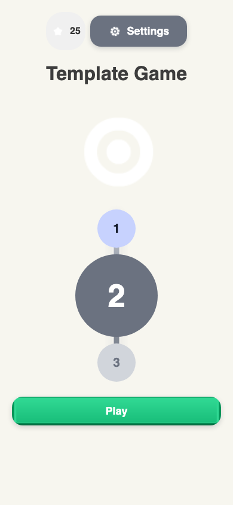
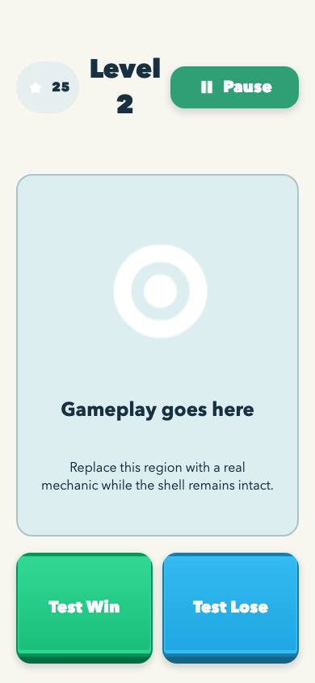
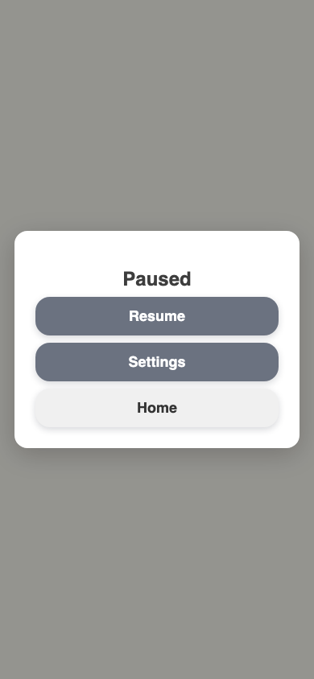
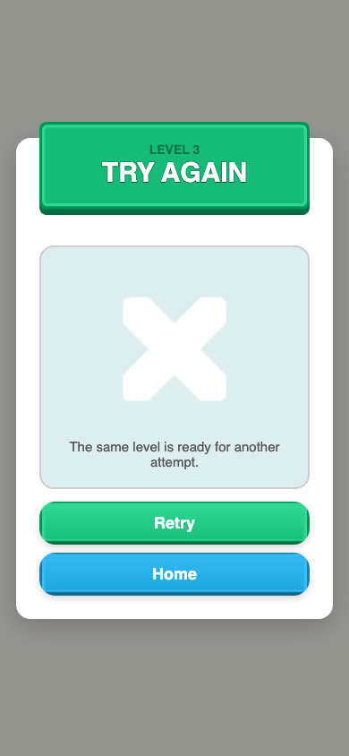
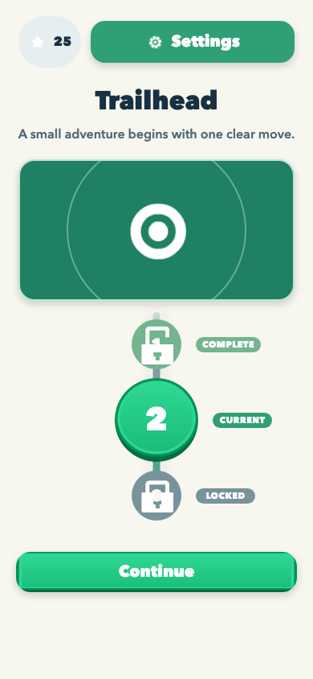
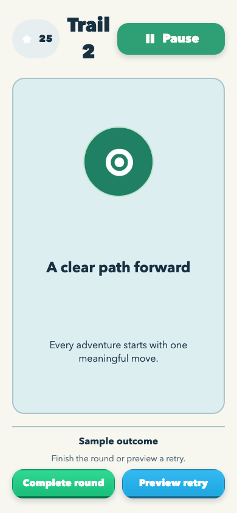
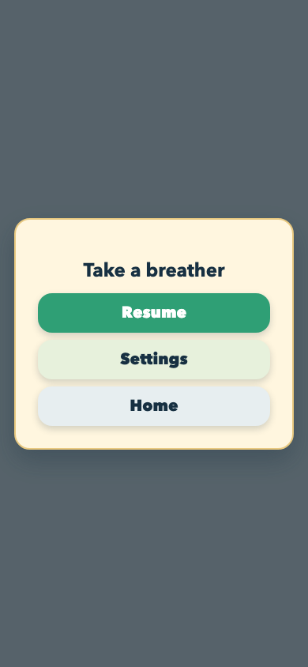
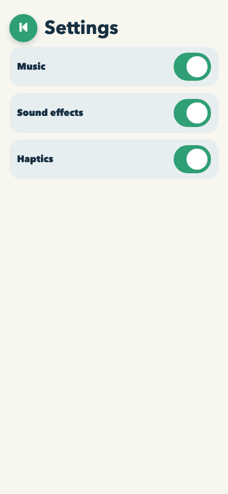
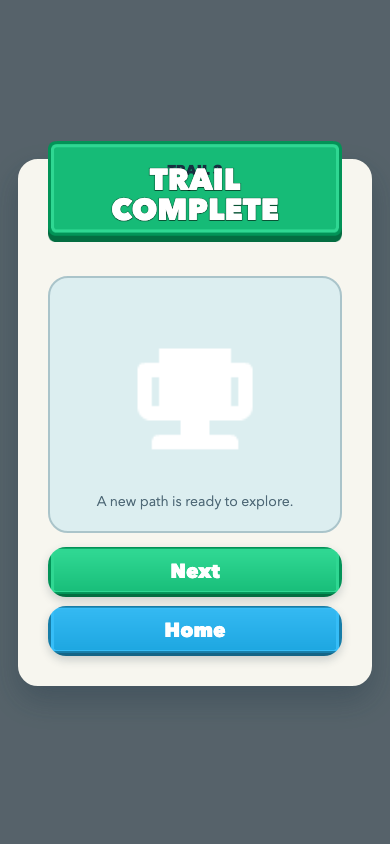

# Worked-stage aesthetics remediation journal

This journal records a 390 x 844 browser diagnostic for the editor-neutral
template shell. It is evidence for the next independent aesthetics review only;
it is not Android or iPhone device proof.

## Task T1 - Make the starter shell read as a game, not a scaffold

### Task Snapshot

Status: passed

The previous independent review found that the template met its behavioral
contract but looked like a prototype: internal scaffold copy, weak visible use
of its curated Kenney fixtures, ambiguous progression states, a flat outcome
demo, and a default-grey pause dialog. This bounded pass keeps the shared UI,
the six-state controller, and the required two demo outcomes while giving the
starter shell a coherent adventure-sample hierarchy.

### Task Acceptance Criteria

- No internal scaffold/developer phrasing is visible in the starter flow.
- Hero and completed/current/locked nodes are immediately distinguishable.
- The required two outcome controls read as a purposeful sample interaction.
- Pause is a readable cream/pastel game surface with all three actions visible.
- All existing state transitions and 48 px control guarantees remain intact.

### Iteration 1 - Baseline capture and bounded polish

#### Planned Result

The rendered flow should move from a technical placeholder toward a compact,
Kenney-backed starter game without changing any state-machine behavior.

#### Why This Iteration

The independent review identified P1 visual blockers that are all local to the
template shell's presentation, copy, and hierarchy.

#### Capture Setup

- Route: `/`
- Viewport: 390 x 844 CSS pixels
- Fixture: default synthetic save
- State: real rendered interactions; screenshots are captured only after the
  relevant UI is settled.

#### Pre-Change Screenshots

Captures are added after the reproducible diagnostic run. The baseline evaluation
is the independent review's P1 finding: the pause card reads grey/default,
scaffold copy is visible, hero/fixtures are underused, and the two demo outcomes
read like exposed debug controls.

#### Changes Made

Pending the baseline capture.

#### Post-Change Screenshots

Pending the remediation and matching capture set.

#### Decision

partial

#### Next Action

Capture the current rendered states, then implement only the listed presentation and copy corrections.

#### Spawned Tasks

- None; device safe-area and touch proof remain a later in-situ concern.

### Iteration 2 - Seed hierarchy and starter-flow correction

#### Planned Result

The same six-state shell should use its committed Kenney seed as a visible
adventure language: a centered trail marker, legible path-status labels, a
compact outcome sample, and a warm pause surface.

#### Why This Iteration

The baseline was already captured after the previous viewport remediation and
the only subsequent source change was design-authority documentation. It is the
accurate before-state for this presentation-only pass.

#### Capture Setup

- Route: `/`
- Viewport: 390 x 844 CSS pixels
- Fixture: default synthetic save
- State: the baseline is the settled conductor diagnostic; matching after-state
  capture is prepared with the local script described below.

#### Pre-Change Screenshots

1. 
   What to look at: the nearly invisible white target, unlabeled progression
   states, and generic title.
   Observation: the route has functional controls but no readable starter-game
   identity or visible distinction beyond size and grey tone.
   Acceptance check: starter copy fail; Kenney visibility fail; node-state
   clarity partial; action hierarchy partial.

2. 
   What to look at: the developer-facing gameplay text and oversized Test Win /
   Test Lose buttons.
   Observation: the controls work but read as exposed QA tools rather than an
   intentional sample interaction.
   Acceptance check: starter copy fail; demo hierarchy fail; controls remain
   visibly tappable.

3. 
   What to look at: the neutral white card and grey action stack.
   Observation: all actions are readable but the overlay looks detached from the
   cream/teal shell.
   Acceptance check: grounded pause treatment fail; action visibility pass.

4. 
   What to look at: the settled Retry and Home paths.
   Observation: the readable result-card repair remains intact and is retained
   while the title ribbon is made variant-aware.
   Acceptance check: result action visibility pass.

#### Changes Made

The bootstrap copy now presents `Trailhead` as a generic adventure sample,
without source-editing or debug phrasing. The shell places the existing white
Kenney target on seed-colored hero and gameplay fields, gives the three route
states visible text badges plus accessible names, and places the required two
outcomes beneath a `Sample outcome` heading with a compact primary/secondary
pair. A template-local token bridge makes each reused shared-UI root consume the
committed seed instead of its neutral package defaults; Pause now uses a warm
cream card with teal, pastel, and quiet actions. Win and Fail use their matching
green and blue seed ribbons. No controller, flow, SDK, package UI, or game
mechanic changed.

#### Post-Change Screenshots

The managed worker sandbox cannot launch Chromium: macOS denies
`MachPortRendezvousServer` during Playwright startup. An unrestricted conductor
should serve `games/_template` at `http://127.0.0.1:5199`, use the same 390 x
844 viewport and fresh localStorage fixture, and write settled
`after-{menu,level,pause,settings,win,fail}.png` plus control metrics to this
folder. Use real rendered clicks: menu; Play; Pause; menu Settings; Play then
Complete round; and Play then Preview retry. Browser capture is still diagnostic
only, never physical-device proof.

#### Decision

partial

#### Next Action

An unrestricted conductor must run the prepared matching capture, then the fresh
Aesthetics Reviewed worker must independently judge the resulting frames before
any device-stage claim.

#### Spawned Tasks

- No code follow-up: Android/iPhone safe-area, touch feel, and performance stay
  explicitly unverified until the later in-situ stage.

### Iteration 3 - Close the contract-to-DOM seam and prove the real flow

#### Planned Result

Every visible contract instance should have one accessible DOM owner, and the
same 390 x 844 build should remain usable through the complete shell flow.

#### Why This Iteration

The matching capture exposed a seam that the root audit did not: decorative
children duplicated semantic identities, several required action identities
were absent, and the native settings inputs had a zero-sized box even though
their painted switches were 64 x 48 px.

#### Changes Made

Semantic identities now live only on their interactive or accessible owner.
Decorative artwork is hidden from assistive technology and carries no duplicate
identity. Required menu, gameplay, settings, pause, win, and fail actions are
registered exactly once; dialogs own their panel identities. Progression now
renders one representative completed, current, and next-locked node at every
supported save edge. The native settings inputs cover the visible switch, so
automation, accessibility, and physical touch share the same 64 x 48 target.

#### Post-Change Screenshots

1. 
   Observation: the Trailhead hero, three labelled progression states, and
   Continue action form one readable starter-game hierarchy.
2. 
   Observation: the gameplay placeholder is explicit but game-like, and both
   required outcomes remain visible as a compact sample interaction.
3. 
   Observation: the pause surface uses the same cream, teal, and pastel system
   while retaining Resume, Settings, and Home.
4. 
   Observation: Back and all three switches are settled, readable, and at least
   48 px high.
5. 
   Observation: the success card has a variant ribbon and clear Next/Home paths.
6. 
   Observation: the retry card remains settled with clear Retry/Home paths.

The matching measurements are in `after-metrics.json`. The real-click tour in
`after-flow-metrics.json` proves Menu -> Level -> Pause -> Settings -> Back ->
Resume -> Win -> Home -> Level -> Fail, including a persisted Music toggle. All
six settled states report a 390 x 844 document with zero body margin; visible
actions are at least 48 px high.

#### Verification

- Typecheck, lint, build, 6 test files / 40 tests, and `git diff --check`: pass.
- Approved-source audit: all 29 committed Kenney fixtures match source bytes.
- Repository audit: pass with pre-existing warnings outside this change.
- Repository-wide `knip`: still reports the existing cross-repository unused
  files, exports, and dependencies; no finding points to this change.
- Browser evidence is diagnostic only. No Android or iPhone device claim is
  made for this U2 card.

#### Decision

passed

#### Next Action

Run the mandatory fresh independent aesthetics review against settled frames.

#### Spawned Tasks

- Sol performed a read-only contract-to-DOM census and identified the level 1
  and level 3 progression edge cases; deterministic tests now cover both.

### Iteration 4 - Keep the starter shell quiet, contextual, and replaceable

#### Planned Result

The editor-neutral template should retain its compact Trailhead starter language
without mistaking utilities, diagnostics, or the mechanic socket for
production-primary game UI. Pause should retain enough of the active level to
keep a player oriented, while the single controller remains the only behavior
owner.

#### Why This Iteration

The independent aesthetics follow-up identified six bounded seams: Settings
competed with Continue, the white currency star lacked a reliable backing,
Pause replaced rather than contextualized the level, the HUD identity could
wrap, the mechanic-neutral region resembled a result card, and the required
Win/Lose controls still read as production actions instead of template-only
diagnostics.

#### Changes Made

- Menu Settings now uses a muted utility surface with no button shadow; the
  primary Continue path remains the visual action hierarchy.
- The white Kenney star now sits on a dark, bordered currency surface in both
  menu and HUD contexts.
- Pause renders a visually retained, `aria-hidden` and `inert` level backdrop
  beneath a lighter pause scrim. That backdrop carries neither semantic
  instances nor action hooks, so only the foreground Pause controls can drive
  the shared controller.
- The HUD level label now uses a compact single-line ellipsis treatment.
- The gameplay area is now an explicitly labelled, dashed mechanic socket with
  a left-aligned content area rather than a centered result-card composition.
- Win and Lose remain functional but are relabelled as compact `Template
  diagnostics` with distinct, subdued win/retry treatments.

#### Deterministic Verification

- Proof-first command: `npm run test:unit -w @fabrikav2/game-template --
  tests/unit/template-shell.test.ts` initially failed in the four new
  utility/currency, paused-backdrop, diagnostic-socket, and compact-HUD
  assertions.
- After the bounded change, that same focused suite passes all 15 tests.
- `npm run typecheck -w @fabrikav2/game-template`, `npm run lint -w
  @fabrikav2/game-template`, and `npm run build -w
  @fabrikav2/game-template` pass.
- The full template unit suite passes 6 files / 43 tests, and
  `KENNEY_APPROVED_SOURCE_ROOT=/Users/base/dev/appletolye/assets npm run
  audit:kenney -w @fabrikav2/game-template` verifies all 29 fixtures.
- Root `npm run audit` passes with its existing repository/reference coverage
  warnings; no new template warning was introduced.

#### Post-Change Capture Contract

No new browser or physical-device capture is claimed by this iteration. A
worker attempt against the current worktree's Vite server reached Playwright
startup but macOS denied Chromium's `MachPortRendezvousServer` registration
before any frame rendered. Before the independent aesthetics decision, run the
existing real-click diagnostic from `games/_template` with an unrestricted
browser:

```sh
npm run dev -- --host 127.0.0.1 --port 5199
node .work/2026-07-11-aesthetics-remediation/capture.mjs u2-seam-remediation
```

Review the resulting menu, level, pause, settings, win, and fail frames at
390 x 844. In particular, verify the muted Settings control, star contrast,
visible noninteractive paused level, unwrapped HUD, socket treatment, and
subordinate diagnostic actions. This is browser diagnostic evidence only, not
Android or iPhone proof.

#### Decision

partial

#### Next Action

The Aesthetics Reviewed worker must obtain fresh settled frames with the recipe
above and perform the mandatory independent visual review. Android/iPhone safe
areas, touch feel, fonts, and performance remain explicitly unverified.

#### Conductor Capture and Independent Review

The unrestricted conductor reran both diagnostic paths after commit `5814596a`.
`u2-seam-remediation-metrics.json` records all six settled surfaces at 390 x
844. `after-flow-metrics.json` records the real-click Menu -> Level -> Pause ->
Settings -> Back -> Resume -> Win -> Home -> Level -> Fail path, including a
Music switch change. Every visible action is at least 48 px high and no surface
scrolls.

A new 7.48-second Playwright reel supplied four distinct ffmpeg-sampled settled
frames to blind Sol review session `019f4e71-6a97-7893-9656-777330a35fcf`.
That review returned `fix-then-ship` with P1 findings: the HUD level identity is
visibly truncated; the dashed mechanic region reads as prototype grey-box UI;
the reused bullseye and completed-node lock language look provisional; and the
fail ribbon/glyph lack readable contrast and visual continuity. Its P2 cluster
also calls for a clearer dev-only diagnostics strip, tighter Pause hierarchy,
and Retry as the sole primary fail action.

#### Decision

failed aesthetics gate; returned to Worked

#### Next Action

Resolve the bounded hierarchy, identity, placeholder, and fail-state seams;
repeat the deterministic browser proof and a fresh blind aesthetics review.
