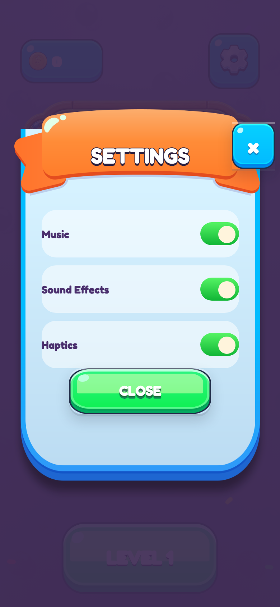
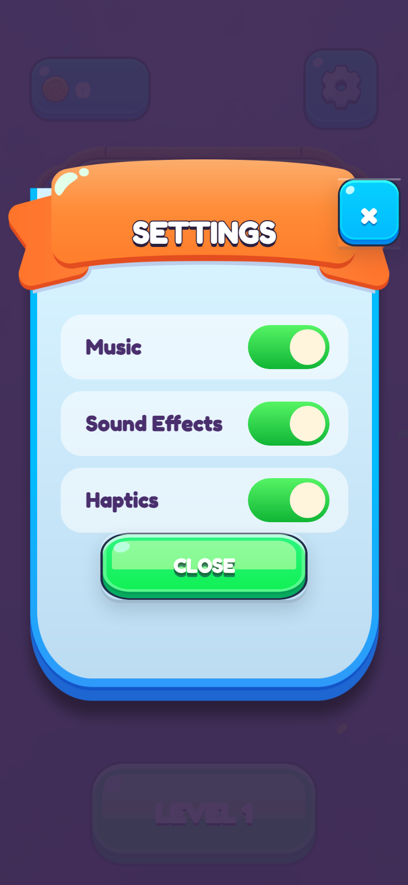
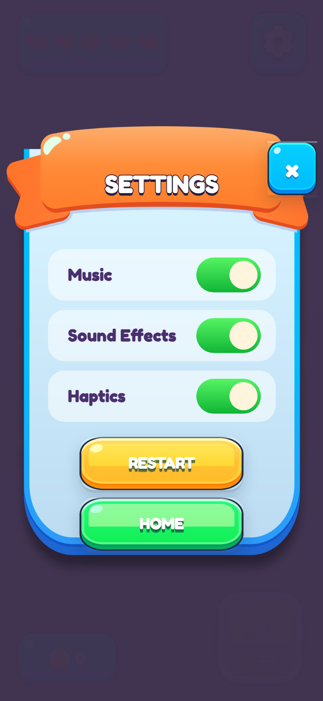
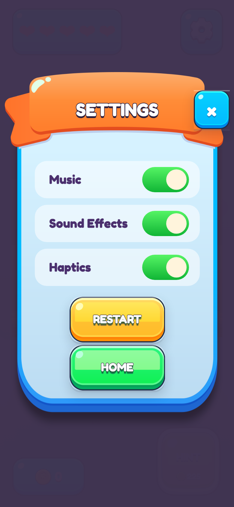
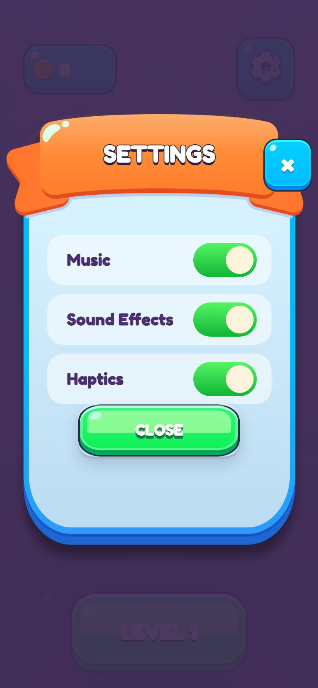
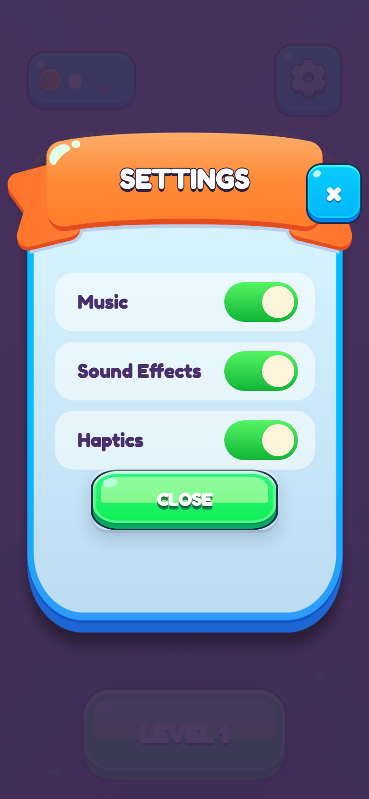
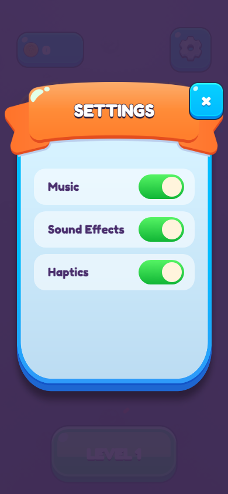
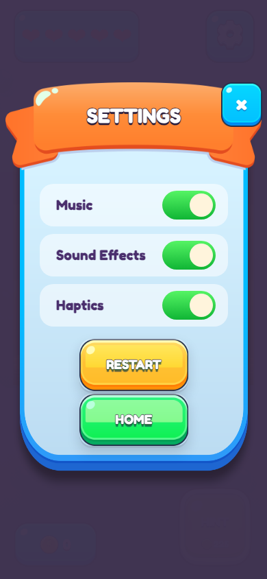

# Settings polish journal

## Task snapshot

The phone report identifies four geometry defects on the same settings surface: label inset, action separation, switch standardization, and ribbon size/cropping. The menu and in-game variants share the card and toggle rows; only their action set differs.

### Iteration 1 - planned

Planned result: labels move inward, switches match the v1 78 x 42 standard, Restart gains top clearance, and the ribbon grows without crossing the phone safe area.

Capture setup: local production UI at 390 x 844 CSS pixels, menu settings open; in-game settings captured through the repository test harness where available.

Pre-change evidence: `./screenshots/menu-settings-before.png`.

Acceptance status: pending implementation and post-change capture.

Next action: capture baseline geometry, add failing regression pins, and make one scoped theme adjustment.

### Iteration 1 - result

What to look at: row labels begin at the row edge, switches use the small generic geometry, and the ribbon leaves substantial side margins.
Observation: computed label inset was 0px, switch size was 54 x 32, and ribbon width was 351px in a 390px viewport.
Acceptance check: criteria 1, 3, and 4 failed; criterion 2 required the in-game variant.

Change: applied game-owned settings geometry: 24px label inset, non-wrapping responsive labels, 78 x 42 tracks with 34px thumbs, an 18px in-game action gap, a viewport-capped 374px ribbon, and explicit visible card overflow with safe-area top padding.

What to compare: labels now sit deliberately inside each row, Sound Effects remains on one line, the switches are consistently sized, and the banner nearly spans the viewport without losing its top edge.
Acceptance check: criteria 1, 3, and 4 met.

What to compare: the same row and switch geometry is retained, while Restart begins 18px below the toggle group and Home follows as a separate action.
Acceptance check: criterion 2 met; shared criteria 1, 3, and 4 remain met.

Decision: passed at the 390 x 844 browser capture target.

Follow-on candidates: none; adjacent result modals were intentionally untouched.

Next action: run the full automated checks and install the signed iPhone build without launching it.

### Iteration 2 - result

Planned result: lift the ribbon, vertically center its title, keep both in-game actions inside a taller card, match the v1 compact action width, and give action labels the same dark outline language as SETTINGS.

Capture setup: repository harness `driveTo('pause')`, 390 x 844 CSS pixels.

Change: ribbon lifted 12px; title pinned to 50%; in-game card fixed at 560px without flex shrinking; Restart/Home capped at 178px by 76px; button labels gained a 1.4px dark stroke; action gap retained at 18px above Restart and 4px between actions.

What to compare: the orange banner now masks the panel top more strongly, SETTINGS is centered in the orange face, both compact actions sit within the taller blue panel, and both labels have a visible dark outline.
Acceptance check: all requested iteration-2 geometry criteria met in the browser capture.

Decision: passed for browser geometry; physical-device rendering remains pending the signed build and controlled launch.

Next action: build, install, and collect analytics startup logs from the physical iPhone.

### Iteration 3 - result

Planned result: remove the close button's clipped focus line and optically center both SETTINGS and the X glyph.

Change: removed focus/focus-visible outlines only from the sprite close button, made the close button a centered grid with a 5px optical lift, and moved the ribbon title from the transparent PNG box midpoint to 39%—the center of the visible orange face.

What to compare: SETTINGS now sits in the visible orange face center and the X sits in the blue button center.
Acceptance check: both optical-centering criteria met.

What to compare: the pressed X has no clipped gray line above it.
Acceptance check: pressed-state criterion met.

Decision: passed in resting and pressed 390 x 844 captures.

Next action: run the complete checks and install the signed build.

### Iteration 4 - result

Planned result: remove the redundant menu CLOSE action, align the X with the banner's top-right corner in both settings variants, and keep an affordable hint fully opaque.

Change: the menu settings action row is no longer mounted; the shared X is anchored 38px above the card so its top edge matches the ribbon top; enabled hint buttons explicitly render at opacity 1 while unaffordable hints remain at 0.58.

What to compare: there is no bottom CLOSE button, and the X occupies the ribbon's top-right corner.

What to compare: Restart and Home remain intact, while the X uses the same ribbon corner placement.

Measured geometry at 390 x 844: menu X top 139.15px / ribbon top 139.15px; in-game X top 119.15px / ribbon top 119.15px. The menu DOM contains no `settings-close` action.

Hint state check: at 224 coins the button is disabled at opacity 0.58; at the 225-coin cost it is enabled at computed opacity 1.

Decision: all iteration-4 criteria passed in browser rendering and computed state.

Next action: run the complete checks and install the signed iPhone build without launching it.
