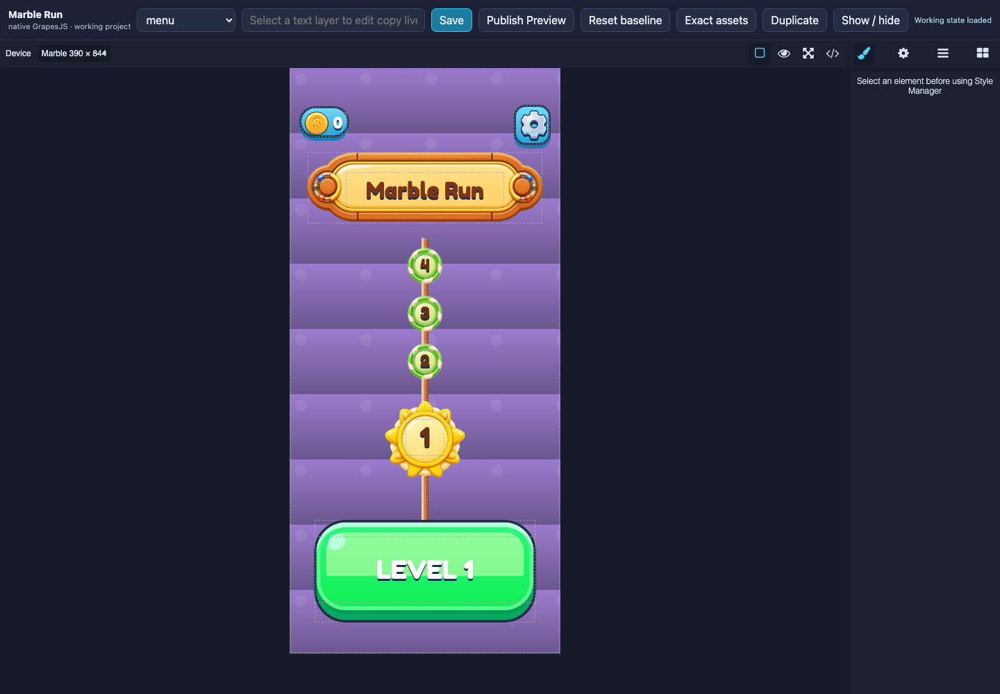
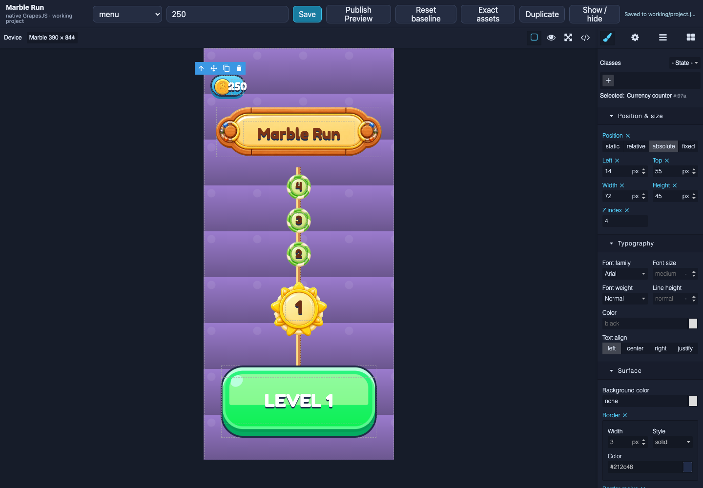
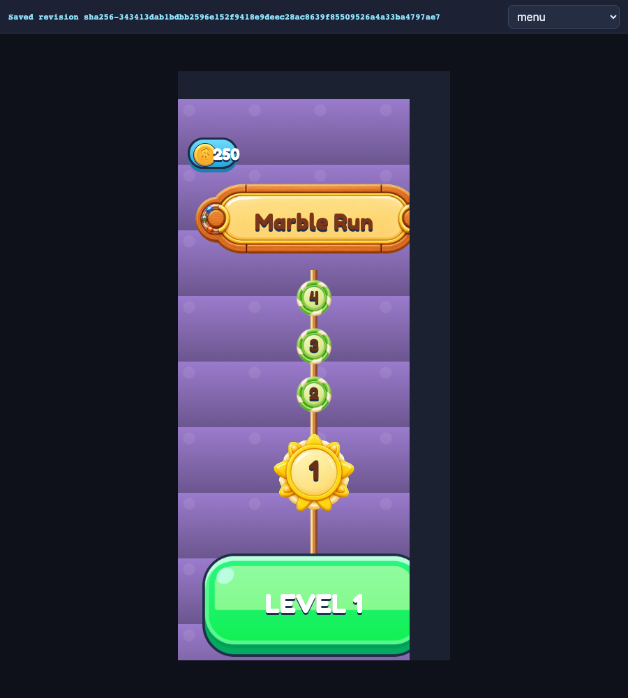
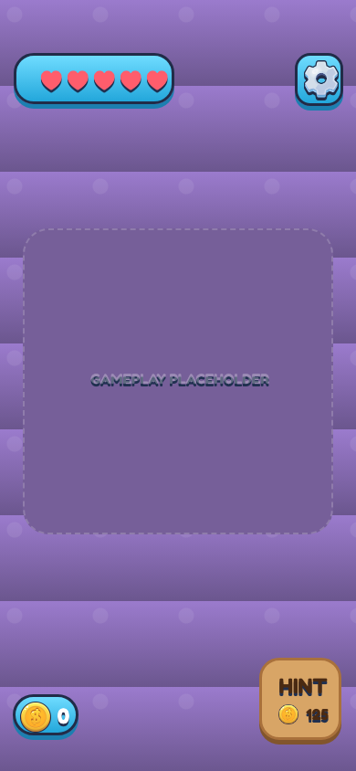
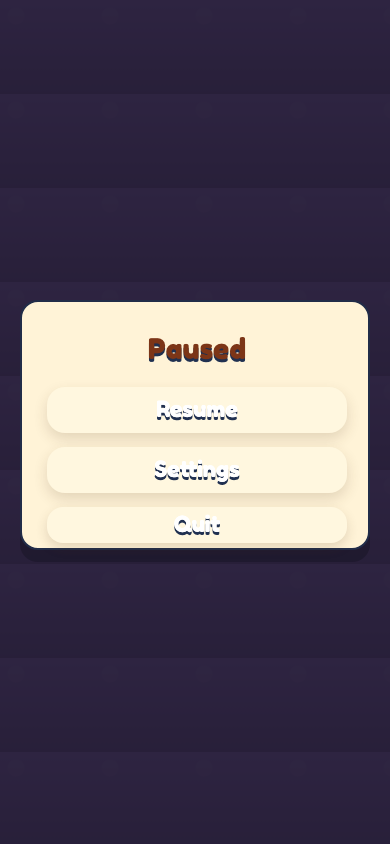
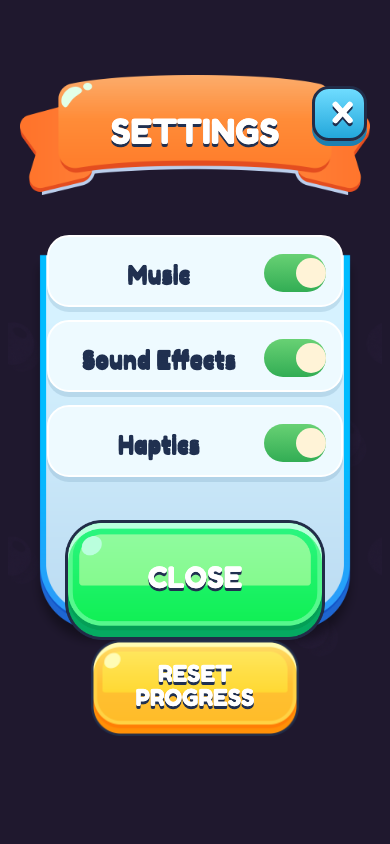
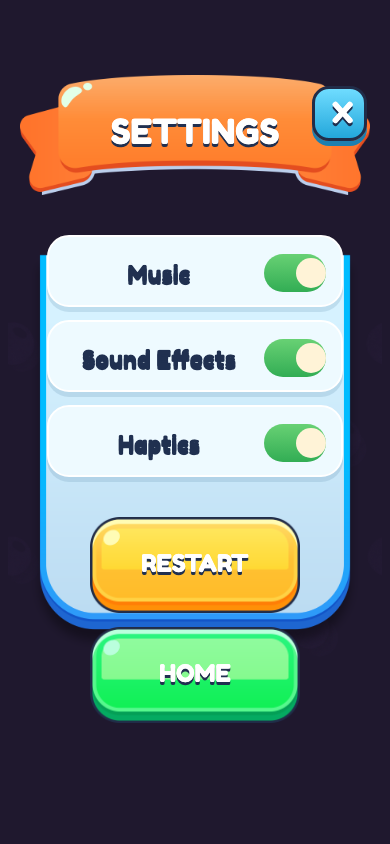
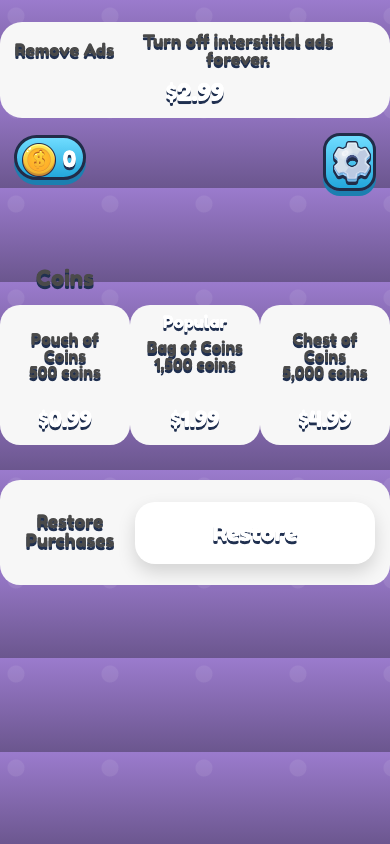

# MR2 native GrapesJS visual review journal

## T1 — Native editor owns the layout

Task snapshot: verify that the result is genuinely GrapesJS, not another custom shell editor, before judging its pixels.

### Iteration 1

- **Planned result:** native page/canvas/layer/style controls around a recognizable Marble menu.
- **Capture setup:** `http://127.0.0.1:5203/`, Chromium 1440 × 1000, Marble device 390 × 844, menu Page, 2.5-second asset wait.

What to look at: GrapesJS device toolbar, canvas, Style Manager, and the exact coin, gear, banner, nodes, and green CTA.
Observation: The native editor is present and the menu is immediately recognizable. Semantic components have selection outlines and standard Grapes resize/duplicate controls.
Acceptance check: native editor pass; exact visible assets pass; nine-page coverage verified separately; device fidelity not claimed.

- **Change explanation:** retained native Grapes chrome and added only a small game-specific save/page/copy toolbar. Layout remains in raw Grapes Project Data; the server validates and stores it but does not project from another layout model.
- **Decision:** passed.
- **Next action:** prove destructive edits, restart persistence, revision Preview, and reset.

## T2 — Required edits survive a full restart

Task snapshot: prove the editor is a round trip rather than a static reconstruction.

### Iteration 1

- **Planned result:** edit currency copy live, hide settings, duplicate the currency group, save, terminate the Vite process, restart it, and observe the same native project.
- **Capture setup:** same editor URL and viewport; select `menu.currency.value`, type `250`; select/hide `menu.settings.group`; duplicate `menu.currency.group`; Save.

What to look at: the top copy field and canvas both show `250`; the selected duplicate remains a normal Grapes component.
Observation: the copy updates before Enter, Save succeeds, and the duplicate receives `menu.currency.group.copy-1` while its children receive their own unique IDs.
Acceptance check: live copy met; visibility met in saved style data; duplicate identity met; save met.

- **Restart evidence:** the dev server was terminated, a fresh process started, and a clean Chromium page reported `250` plus `menu.currency.group.copy-1` from `getProjectData()`.

What to look at: the visible SHA-256 revision and the edited `250` currency value.
Observation: Preview loaded the immutable publication, not the mutable working file.
Acceptance check: Preview freshness and revision identity met.

- **Change explanation:** fixed the Preview canvas from Grapes' default 85% panel width to the full 390-pixel device width after the first screenshot exposed right-edge clipping.
- **Reset evidence:** `/api/reset` restored the protected baseline, then a new baseline publication was created. Baseline and working files are byte-identical at handoff.
- **Decision:** passed.
- **Next action:** inspect every page after delayed image/font load.

## T3 — Complete primary-surface coverage

Task snapshot: make incompleteness visible by capturing all nine saved Pages, not only the menu.

### Iteration 1

- **Planned result:** one stable screenshot per primary Page from the final baseline revision.
- **Capture setup:** `/preview?revision=sha256-3038e49c37b6b3944cf91f795f5dd9233f85791580cd67d8d162bc2846b6a9be&page=<id>`, direct page load, 1000-millisecond asset/font wait, screenshot of the 390 × 844 Grapes iframe.

What to look at: exact Marble source art, separate settings contexts, separate win/fail/finale compositions, shop without invented product icons, and a neutral gameplay field.
Observation: all nine Pages load from the committed native project. An initial 120-millisecond page-switch capture produced missing delayed images, so the evidence was recaptured through direct routes after a one-second wait. Toggle labels were corrected from a bad seed argument and re-published before these final screenshots.
Acceptance check: page completeness met; current copy met; exact-asset identity covered by hashes and byte verification; semantic editability covered by native layers/tests. Physical-device geometry and P1/P2 convergence are not proved here.

- **Decision:** passed for MR2; the Marble Gate remains open.
- **Next action:** independent editor usability review, device build, PixelSmith comparison, and P1/P2 repair under MR4.
