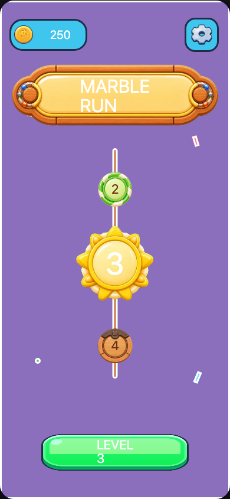
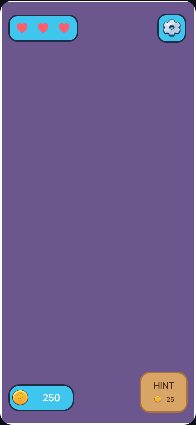
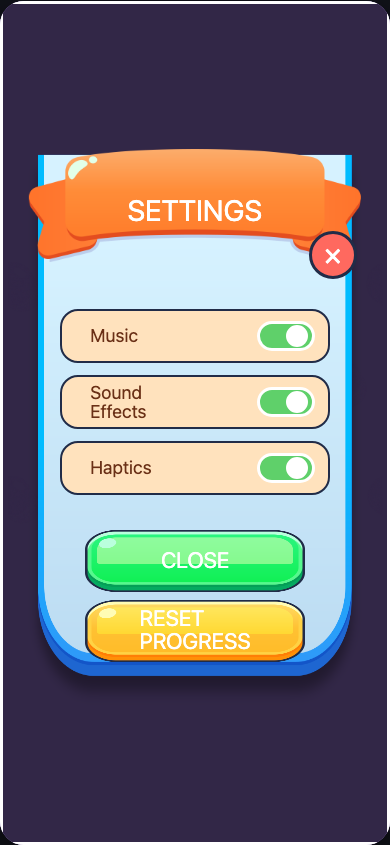
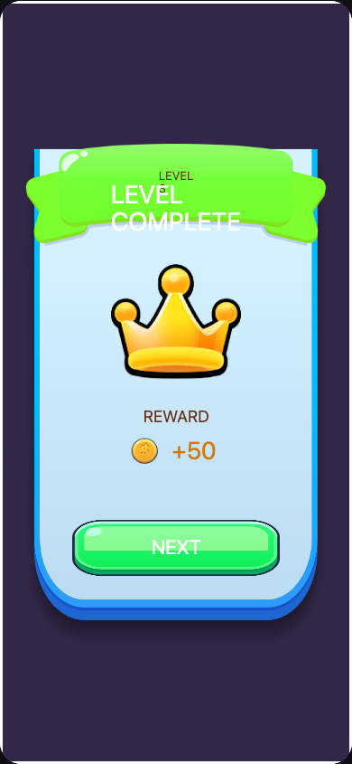
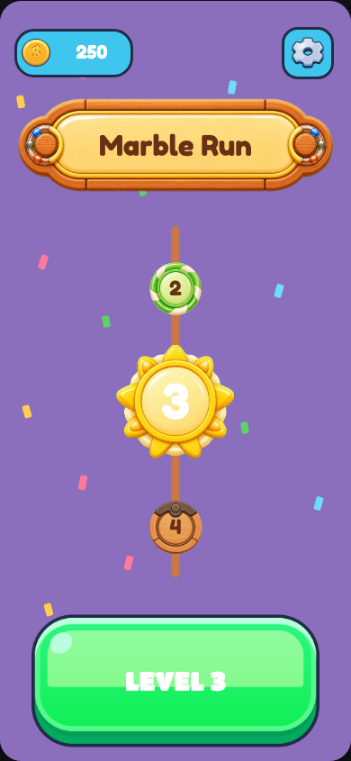
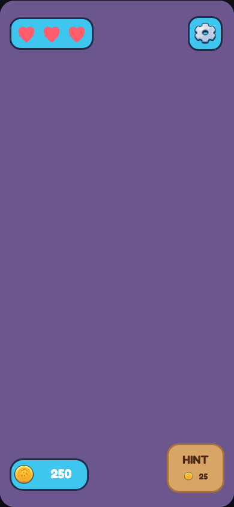
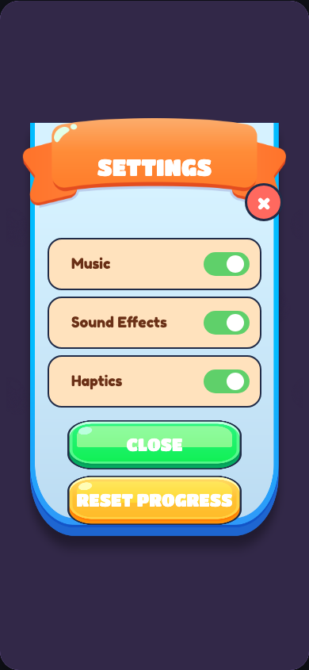
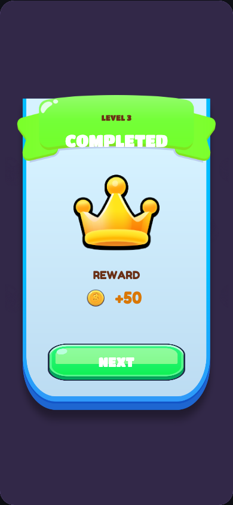

# Phaser Editor Marble aesthetics repair journal

## Task MR3-V1 - Restore the menu's candy hierarchy

### Task Snapshot

Status: active

The native Menu scene uses exact source images, but the copy falls back to thin generic type, the CTA is visually subordinate, and only four of the required 16 deterministic flecks are present. This iteration repairs only those independently validated material defects.

### Task Acceptance Criteria

- Title Case brown banner copy uses the loaded rounded Marble font.
- CTA is near full width and visually dominant.
- Exactly 16 deterministic semantic confetti pieces are present.

### Iteration 1 - Canonical pre-change evidence

#### Planned Result

Restore the current V2 source hierarchy without changing image identity or introducing another layout authority.

#### Why This Iteration

This is the minimum coherent repair set for the reviewed Menu scene.

#### Capture Setup

- Route: `authoring/phaser-editor/preview/?scene=Menu`
- Viewport: 390 x 844 saved-scene crop
- Fixture: publication `sha256-d04c3181a399d6904b24fb5cc94c3a67d8a777890eb66dbc91d5d28275d212ea`
- State: static Menu

#### Pre-Change Screenshots

What to look at: The banner type, empty field, and narrow bottom CTA.
Observation: `MARBLE RUN` wraps in thin white fallback type, only four flecks populate the full screen, and the CTA is much narrower than the reference.
Acceptance check: Banner fail; CTA fail; 16-piece field fail.

#### Changes Made

Pending.

#### Post-Change Screenshots

Pending.

#### Decision

partial

#### Next Action

Update native Menu scene authority and capture the same frame from a fresh publication.

## Task MR3-V2 - Replace Unicode lives with source-faithful primitives

### Task Snapshot

Status: active

The HUD uses three Unicode text glyphs where current source uses procedural inline heart silhouettes. The repair will keep each life independently selectable while replacing platform-dependent typography with scene primitives.

### Task Acceptance Criteria

- No Unicode heart remains.
- Three semantic heart groups are made from native primitives.
- Geometry stays inside the existing lives panel.

### Iteration 1 - Canonical pre-change evidence

#### Planned Result

Render three consistent source-pink heart silhouettes without adding an asset.

#### Why This Iteration

It removes a cross-platform visual dependency while preserving semantic granularity.

#### Capture Setup

- Route: `authoring/phaser-editor/preview/?scene=GameplayHud`
- Viewport: 390 x 844 saved-scene crop
- Fixture: publication `sha256-d04c3181a399d6904b24fb5cc94c3a67d8a777890eb66dbc91d5d28275d212ea`
- State: static gameplay HUD

#### Pre-Change Screenshots

What to look at: The three life marks in the top-left panel.
Observation: They are text glyphs whose silhouette depends on font rendering.
Acceptance check: No-glyph criterion fail; independent life identity pass; panel containment pass.

#### Changes Made

Pending.

#### Post-Change Screenshots

Pending.

#### Decision

partial

#### Next Action

Replace each glyph with a semantic container of native filled shapes.

## Task MR3-V3 - Repair Settings row usability and typography

### Task Snapshot

Status: active

SettingsMenu currently shows 54px rows and wraps `Sound Effects`, contradicting the 66px source inventory and damaging the primary settings surface. The same shared geometry must be repaired in SettingsLevel and the protected baseline.

### Task Acceptance Criteria

- All toggle surfaces are at least 66px high.
- `Sound Effects` remains on one line.
- Rounded source font is visibly loaded.

### Iteration 1 - Canonical pre-change evidence

#### Planned Result

Produce three comfortably spaced rows with a single-line middle label.

#### Why This Iteration

Row geometry and type loading are one visible settings usability defect.

#### Capture Setup

- Route: `authoring/phaser-editor/preview/?scene=SettingsMenu`
- Viewport: 390 x 844 saved-scene crop
- Fixture: publication `sha256-d04c3181a399d6904b24fb5cc94c3a67d8a777890eb66dbc91d5d28275d212ea`
- State: menu settings

#### Pre-Change Screenshots

What to look at: The middle label and vertical row size.
Observation: `Sound Effects` wraps to two lines and all rows appear compressed relative to the current source.
Acceptance check: Height fail; one-line label fail; rounded font fail.

#### Changes Made

Pending.

#### Post-Change Screenshots

Pending.

#### Decision

partial

#### Next Action

Repair shared Settings scene geometry and Preview text projection.

## Task MR3-V4 - Separate Win ribbon text bands

### Task Snapshot

Status: active

The Win ribbon's eyebrow and title collide, and the incorrect `LEVEL COMPLETE` headline wraps. This is a P1 readability failure on a primary screen.

### Task Acceptance Criteria

- `LEVEL 3` and `COMPLETED` occupy separate vertical bands.
- `COMPLETED` stays on one line in the exact rounded font.
- Both remain independent native scene children.

### Iteration 1 - Canonical pre-change evidence

#### Planned Result

Restore the source's small eyebrow plus large result-title hierarchy within the exact blank ribbon.

#### Why This Iteration

The current title collision blocks meaningful review of the Win surface.

#### Capture Setup

- Route: `authoring/phaser-editor/preview/?scene=Win`
- Viewport: 390 x 844 saved-scene crop
- Fixture: publication `sha256-d04c3181a399d6904b24fb5cc94c3a67d8a777890eb66dbc91d5d28275d212ea`
- State: static Win

#### Pre-Change Screenshots

What to look at: The green ribbon's two text layers.
Observation: `LEVEL COMPLETE` wraps through the eyebrow and across the band boundary.
Acceptance check: Separation fail; copy fail; single-line fail; independent children pass.

#### Changes Made

Pending.

#### Post-Change Screenshots

Pending.

#### Decision

partial

#### Next Action

Repair the saved Win scene, republish, and inspect it in the licensed editor.

## Task MR3-V1 - Iteration 2 - Menu hierarchy verified

### Changes Made

- Changed banner copy to source Title Case `Marble Run`, source brown `#6a3016`, and exact `Fredoka One` bytes.
- Enlarged the exact green CTA to 320px visual width and moved its label to exact `Titan One` bytes.
- Added exactly 16 deterministic, independently selectable native Rectangle confetti pieces.
- Mirrored the repaired native scene into the protected baseline.

### Post-Change Screenshots

What to look at: The populated field, brown rounded title, and dominant bottom CTA.
Observation: All three hierarchy defects are visibly removed without substituting any source image.
Acceptance check: Banner pass; CTA pass; 16-piece field pass; exact bindings pass.

### Decision

passed

### Next Action

None for this task.

## Task MR3-V2 - Iteration 2 - Procedural lives verified

### Changes Made

- Removed all Unicode heart text.
- Rebuilt each life as a semantic native Container containing three filled Rectangle primitives: one rotated body and two rounded lobes.
- Preserved three independently selectable `life-heart` instances and source fill `#ff5d6c`.
- Mirrored the repaired native scene into the protected baseline.

### Post-Change Screenshots

What to look at: Three consistent pink silhouettes in the top-left lives panel.
Observation: The hearts no longer depend on platform glyph rendering and remain contained in the panel.
Acceptance check: No glyph pass; three native groups pass; source color pass; containment pass.

### Decision

passed

### Next Action

None for this task.

## Task MR3-V3 - Iteration 2 - Settings usability verified

### Changes Made

- Raised all three toggle surfaces to 66px and respaced the row centers on a 74px cadence.
- Kept `Sound Effects` as a single-line Text object.
- Registered exact font bytes under their real Phaser family names, `Fredoka One` and `Titan One`.
- Applied the shared repair to both SettingsMenu and SettingsLevel, working scenes and protected baselines.

### Post-Change Screenshots

What to look at: The roomy rows, one-line middle label, and rounded typography.
Observation: The source touch-target rhythm and label legibility are restored.
Acceptance check: 66px rows pass; one-line label pass; exact loaded font pass; shared-scene parity pass.

### Decision

passed

### Next Action

None for this task.

## Task MR3-V4 - Iteration 2 - Win bands verified

### Changes Made

- Replaced the stale wrapping headline with current-source `COMPLETED`.
- Positioned the brown `LEVEL 3` eyebrow and white headline 38px apart in distinct bands.
- Used exact `Titan One` bytes while preserving both layers as independent native Text children.
- Mirrored the repaired native scene into the protected baseline.

### Post-Change Screenshots

What to look at: The small eyebrow above a large, single-line headline.
Observation: Both layers are immediately readable and remain inside the exact blank completed ribbon.
Acceptance check: Separation pass; current copy pass; single-line pass; independent-child pass.

### Licensed-editor persistence proof

- Opened Menu.scene, SettingsMenu.scene, and Win.scene in licensed Phaser Editor v5.0.2 at 1600 x 1000.
- Saved Win.scene with the native editor; all nine native scene SHA-256 hashes were byte-identical before and after save.
- Fully terminated the editor server, confirmed port 19594 was closed, restarted it against this project, and reopened Win.scene without console errors.
- Evidence: `native-editor/Menu-native-editor.png`, `native-editor/SettingsMenu-native-editor.png`, `native-editor/Win-native-editor-saved.png`, and `native-editor/Win-native-editor-after-restart.png`.

### Decision

passed

### Next Action

None for this task.

## Repair-wide verification

- Active immutable publication: `sha256-1dd58cd41133e93a2540fb6f7178579ddb8d0969da873072318db3d3dc6ce8ac`.
- Native authoring tests: 7/7 passed.
- Native validation: 9 scenes, 218 semantic objects, 16 exact curated assets.
- Marble Run unit tests: 94/94 passed; typecheck passed; lint passed with one pre-existing `Stage.ts` unused-import warning.
- Repository audit passed with pre-existing warnings.
- Full project gate inside `npm run land-gate` passed; its merge gate correctly deferred until this worker commit exists.
- Verification boundary: these screenshots prove saved-scene projection and licensed-editor persistence. They do not claim physical-device runtime integration, which is outside this aesthetics repair.
